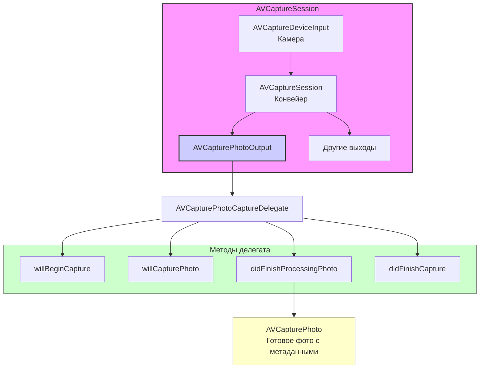

#avfoundation #photo #camera #capture #avcapturephotooutput #raw #livephotos #depth

---
### Определение
**AVCapturePhotoOutput** — это класс во фреймворке [[AVFoundation]], предназначенный для захвата фотографий высокого качества с камеры устройства. Он является современной заменой устаревшего [[AVCaptureStillImageOutput]] и предоставляет расширенные возможности: поддержку форматов [[HEIC]] и RAW, Live Photos, карт глубины (портретный режим), настройку вспышки и стабилизации, а также детальную обратную связь через делегат .

Простыми словами, `AVCapturePhotoOutput` — это профессиональный инструмент для съемки фото, который дает разработчику полный контроль над процессом: от настройки параметров до получения готового изображения с метаданными.

### Зачем это знать iOS-разработчику?
1.  **Создание кастомной камеры:** Когда стандартный [[UIImagePickerController]] недостаточно гибок.
2.  **Профессиональная съемка:** Поддержка RAW, настройка экспозиции, баланса белого.
3.  **Портретный режим:** Получение карт глубины для создания эффектов размытия.
4.  **Live Photos:** Съемка живых фотографий с видеофрагментом.
5.  **Максимальное качество:** Использование HEIC для экономии места без потери качества.
6.  **Обработка ошибок:** Детальная информация о проблемах при съемке.

---

### Архитектура и место в AVCaptureSession



### Ключевые компоненты

1.  **AVCapturePhotoOutput:** Сам объект, который нужно добавить в сессию.
2.  **[[AVCapturePhotoSettings]]:** Настройки для конкретного снимка (вспышка, стабилизация, формат).
3.  **[[AVCapturePhoto]]:** Объект, содержащий готовое фото и метаданные (получается в делегате).
4.  **[[AVCapturePhotoCaptureDelegate]]:** Протокол с методами для отслеживания процесса съемки.

### Основные возможности

- **Форматы:** [[HEIC]] (HEIF), [[JPEG]], RAW (DNG), TIFF.
- **Дополнительные данные:** Карты глубины (Depth Data), карты диспаритета (Disparity), метаданные камеры.
- **Управление вспышкой:** Авто, включено, выключено, медленная синхронизация.
- **Стабилизация:** Оптическая и цифровая стабилизация при съемке.
- **Live Photos:** Съемка с видеофрагментом до и после снимка.
- **Red-eye reduction:** Уменьшение эффекта красных глаз.
- **Dual camera support:** Автоматический выбор лучшей камеры (широкоугольная/телефото).

---

### Примеры от простого к сложному

#### Уровень 0: Настройка Info.plist и базовой структуры
Для доступа к камере нужно добавить описание в `Info.plist`.

- **NSCameraUsageDescription** — "Для съемки фотографий"

Базовая структура контроллера:

```swift
import UIKit
import AVFoundation

class PhotoBaseViewController: UIViewController {
    
    var captureSession: AVCaptureSession!
    var previewLayer: AVCaptureVideoPreviewLayer!
    var photoOutput: AVCapturePhotoOutput!
    
    override func viewDidLoad() {
        super.viewDidLoad()
        checkPermissionsAndSetup()
    }
    
    private func checkPermissionsAndSetup() {
        switch AVCaptureDevice.authorizationStatus(for: .video) {
        case .authorized:
            setupCamera()
        case .notDetermined:
            AVCaptureDevice.requestAccess(for: .video) { granted in
                if granted {
                    DispatchQueue.main.async {
                        self.setupCamera()
                    }
                }
            }
        default:
            showPermissionsAlert()
        }
    }
    
    private func showPermissionsAlert() {
        let alert = UIAlertController(
            title: "Нет доступа к камере",
            message: "Пожалуйста, разрешите доступ в настройках",
            preferredStyle: .alert
        )
        alert.addAction(UIAlertAction(title: "OK", style: .default))
        present(alert, animated: true)
    }
    
    func setupCamera() {
        captureSession = AVCaptureSession()
        captureSession.sessionPreset = .photo // Оптимально для фото
        
        guard let camera = AVCaptureDevice.default(.builtInWideAngleCamera, for: .video, position: .back),
              let input = try? AVCaptureDeviceInput(device: camera),
              captureSession.canAddInput(input) else {
            print("Не удалось настроить камеру")
            return
        }
        captureSession.addInput(input)
        
        photoOutput = AVCapturePhotoOutput()
        if captureSession.canAddOutput(photoOutput) {
            captureSession.addOutput(photoOutput)
        }
        
        previewLayer = AVCaptureVideoPreviewLayer(session: captureSession)
        previewLayer.frame = view.bounds
        previewLayer.videoGravity = .resizeAspectFill
        view.layer.addSublayer(previewLayer)
        
        DispatchQueue.global(qos: .userInitiated).async { [weak self] in
            self?.captureSession.startRunning()
        }
    }
    
    override func viewWillDisappear(_ animated: Bool) {
        super.viewWillDisappear(animated)
        DispatchQueue.global(qos: .background).async { [weak self] in
            self?.captureSession.stopRunning()
        }
    }
}
```

#### Уровень 1: Базовая съемка фото с сохранением в фотоальбом
Самый простой пример — кнопка "Сделать фото" и сохранение результата.

```swift
import UIKit
import AVFoundation
import Photos

class SimplePhotoViewController: PhotoBaseViewController, AVCapturePhotoCaptureDelegate {
    
    let captureButton = UIButton()
    
    override func viewDidLoad() {
        super.viewDidLoad()
        setupCaptureButton()
    }
    
    private func setupCaptureButton() {
        captureButton.setTitle("📸", for: .normal)
        captureButton.backgroundColor = .white
        captureButton.layer.cornerRadius = 35
        captureButton.frame = CGRect(x: view.bounds.midX - 35, 
                                     y: view.bounds.height - 150, 
                                     width: 70, 
                                     height: 70)
        captureButton.addTarget(self, action: #selector(capturePhoto), for: .touchUpInside)
        view.addSubview(captureButton)
    }
    
    @objc func capturePhoto() {
        // Настройки фото
        let settings = AVCapturePhotoSettings()
        settings.flashMode = .auto
        
        // Делаем снимок
        photoOutput.capturePhoto(with: settings, delegate: self)
    }
    
    // MARK: - AVCapturePhotoCaptureDelegate
    func photoOutput(_ output: AVCapturePhotoOutput, 
                     didFinishProcessingPhoto photo: AVCapturePhoto, 
                     error: Error?) {
        
        if let error = error {
            print("Ошибка съемки: \(error.localizedDescription)")
            return
        }
        
        // Получаем данные изображения
        guard let imageData = photo.fileDataRepresentation(),
              let image = UIImage(data: imageData) else {
            print("Не удалось создать изображение из данных")
            return
        }
        
        // Сохраняем в фотоальбом
        UIImageWriteToSavedPhotosAlbum(image, self, #selector(imageSaved), nil)
    }
    
    @objc func imageSaved(_ image: UIImage, 
                          didFinishSavingWithError error: Error?, 
                          contextInfo: UnsafeRawPointer) {
        if let error = error {
            print("Ошибка сохранения: \(error)")
        } else {
            print("Фото сохранено в альбом")
            
            // Визуальная обратная связь (анимация затвора)
            let shutterView = UIView(frame: view.bounds)
            shutterView.backgroundColor = .white
            view.addSubview(shutterView)
            
            UIView.animate(withDuration: 0.2, animations: {
                shutterView.alpha = 0
            }) { _ in
                shutterView.removeFromSuperview()
            }
        }
    }
}
```

#### Уровень 2: Продвинутые настройки съемки (вспышка, стабилизация, форматы)
Демонстрация различных настроек для одного снимка.

```swift
import UIKit
import AVFoundation

class AdvancedPhotoViewController: PhotoBaseViewController, AVCapturePhotoCaptureDelegate {
    
    let captureButton = UIButton()
    let settingsButton = UIButton()
    let formatSegmentedControl = UISegmentedControl(items: ["HEIC", "JPEG", "RAW"])
    let flashSegmentedControl = UISegmentedControl(items: ["Авто", "Вкл", "Выкл"])
    
    override func viewDidLoad() {
        super.viewDidLoad()
        setupUI()
    }
    
    private func setupUI() {
        captureButton.setTitle("📸", for: .normal)
        captureButton.backgroundColor = .white
        captureButton.layer.cornerRadius = 35
        captureButton.frame = CGRect(x: view.bounds.midX - 35, 
                                     y: view.bounds.height - 150, 
                                     width: 70, 
                                     height: 70)
        captureButton.addTarget(self, action: #selector(capturePhoto), for: .touchUpInside)
        view.addSubview(captureButton)
        
        // Настройки формата
        formatSegmentedControl.frame = CGRect(x: 20, y: 100, width: view.bounds.width - 40, height: 30)
        formatSegmentedControl.selectedSegmentIndex = 0
        view.addSubview(formatSegmentedControl)
        
        // Настройки вспышки
        flashSegmentedControl.frame = CGRect(x: 20, y: 150, width: view.bounds.width - 40, height: 30)
        flashSegmentedControl.selectedSegmentIndex = 0
        view.addSubview(flashSegmentedControl)
    }
    
    @objc func capturePhoto() {
        var settings = AVCapturePhotoSettings()
        
        // Настройка формата
        switch formatSegmentedControl.selectedSegmentIndex {
        case 0: // HEIC
            if photoOutput.availablePhotoCodecTypes.contains(.hevc) {
                settings = AVCapturePhotoSettings(format: [AVVideoCodecKey: AVVideoCodecType.hevc])
            }
        case 1: // JPEG
            settings = AVCapturePhotoSettings(format: [AVVideoCodecKey: AVVideoCodecType.jpeg])
        case 2: // RAW
            if let rawFormat = photoOutput.availableRawPhotoPixelFormatTypes.first {
                settings = AVCapturePhotoSettings(rawPixelFormatType: rawFormat)
            }
        default:
            break
        }
        
        // Настройка вспышки
        switch flashSegmentedControl.selectedSegmentIndex {
        case 0:
            settings.flashMode = .auto
        case 1:
            settings.flashMode = .on
        case 2:
            settings.flashMode = .off
        default:
            break
        }
        
        // Включение стабилизации (если поддерживается)
        if photoOutput.isAutoStillImageStabilizationEnabled {
            settings.isAutoStillImageStabilizationEnabled = true
        }
        
        // Уменьшение эффекта красных глаз
        settings.isAutoRedEyeReductionEnabled = true
        
        // Настройка качества
        settings.photoQualityPrioritization = .balanced
        
        print("Съемка с настройками: формат=\(formatSegmentedControl.selectedSegmentIndex), вспышка=\(flashSegmentedControl.selectedSegmentIndex)")
        
        photoOutput.capturePhoto(with: settings, delegate: self)
    }
    
    // MARK: - AVCapturePhotoCaptureDelegate
    func photoOutput(_ output: AVCapturePhotoOutput, 
                     willBeginCaptureFor resolvedSettings: AVCaptureResolvedPhotoSettings) {
        print("Начало захвата")
    }
    
    func photoOutput(_ output: AVCapturePhotoOutput, 
                     willCapturePhotoFor resolvedSettings: AVCaptureResolvedPhotoSettings) {
        print("Сработал затвор")
        
        // Анимация затвора
        DispatchQueue.main.async {
            let shutterView = UIView(frame: self.view.bounds)
            shutterView.backgroundColor = .white
            self.view.addSubview(shutterView)
            
            UIView.animate(withDuration: 0.1, animations: {
                shutterView.alpha = 0
            }) { _ in
                shutterView.removeFromSuperview()
            }
        }
    }
    
    func photoOutput(_ output: AVCapturePhotoOutput, 
                     didFinishProcessingPhoto photo: AVCapturePhoto, 
                     error: Error?) {
        
        if let error = error {
            print("Ошибка обработки: \(error)")
            return
        }
        
        // Получаем данные в зависимости от формата
        var imageData: Data?
        var uti: String?
        
        if let rawFileData = photo.fileDataRepresentation(with: .raw) {
            // RAW данные
            imageData = rawFileData
            uti = "DNG"
            print("Получен RAW файл")
        } else if let processedData = photo.fileDataRepresentation() {
            // Обработанные данные (JPEG/HEIC)
            imageData = processedData
            uti = photo.resolvedSettings.expectedPhotoProcessingFlags.isEmpty ? "HEIC/JPEG" : "other"
        }
        
        guard let data = imageData, let utiType = uti else { return }
        
        print("Размер фото: \(data.count / 1024) KB, тип: \(utiType)")
        
        // Сохраняем в фотоальбом
        if let image = UIImage(data: data) {
            UIImageWriteToSavedPhotosAlbum(image, self, #selector(imageSaved), nil)
        }
    }
    
    func photoOutput(_ output: AVCapturePhotoOutput, 
                     didFinishCaptureFor resolvedSettings: AVCaptureResolvedPhotoSettings, 
                     error: Error?) {
        
        if let error = error {
            print("Ошибка завершения съемки: \(error)")
        } else {
            print("Съемка успешно завершена")
        }
    }
    
    @objc func imageSaved(_ image: UIImage, 
                          didFinishSavingWithError error: Error?, 
                          contextInfo: UnsafeRawPointer) {
        if let error = error {
            print("Ошибка сохранения: \(error)")
        } else {
            print("Фото сохранено")
        }
    }
}
```

#### Уровень 3: Съемка с картой глубины (портретный режим)
Получение карты глубины для создания эффектов размытия.

```swift
import UIKit
import AVFoundation
import CoreImage

class DepthPhotoViewController: PhotoBaseViewController, AVCapturePhotoCaptureDelegate {
    
    let captureButton = UIButton()
    let depthImageView = UIImageView()
    
    override func viewDidLoad() {
        super.viewDidLoad()
        setupUI()
        
        // Проверяем поддержку глубины
        if !photoOutput.isDepthDataDeliverySupported {
            print("Depth Data не поддерживается на этом устройстве")
        }
    }
    
    override func setupCamera() {
        super.setupCamera()
        
        // Включаем доставку данных глубины
        if photoOutput.isDepthDataDeliverySupported {
            photoOutput.isDepthDataDeliveryEnabled = true
            print("Depth Data включена")
        }
    }
    
    private func setupUI() {
        captureButton.setTitle("📸 Depth", for: .normal)
        captureButton.backgroundColor = .white
        captureButton.layer.cornerRadius = 35
        captureButton.frame = CGRect(x: view.bounds.midX - 35, 
                                     y: view.bounds.height - 150, 
                                     width: 70, 
                                     height: 70)
        captureButton.addTarget(self, action: #selector(capturePhoto), for: .touchUpInside)
        view.addSubview(captureButton)
        
        depthImageView.frame = CGRect(x: 20, y: 100, width: 100, height: 100)
        depthImageView.backgroundColor = .black
        depthImageView.contentMode = .scaleAspectFit
        view.addSubview(depthImageView)
    }
    
    @objc func capturePhoto() {
        var settings = AVCapturePhotoSettings()
        
        // Включаем Depth Data в настройках
        if photoOutput.isDepthDataDeliverySupported {
            settings.isDepthDataDeliveryEnabled = true
        }
        
        photoOutput.capturePhoto(with: settings, delegate: self)
    }
    
    // MARK: - AVCapturePhotoCaptureDelegate
    func photoOutput(_ output: AVCapturePhotoOutput, 
                     didFinishProcessingPhoto photo: AVCapturePhoto, 
                     error: Error?) {
        
        if let error = error {
            print("Ошибка: \(error)")
            return
        }
        
        // Получаем основное изображение
        if let imageData = photo.fileDataRepresentation(),
           let image = UIImage(data: imageData) {
            UIImageWriteToSavedPhotosAlbum(image, self, #selector(imageSaved), nil)
        }
        
        // Получаем карту глубины
        if let depthData = photo.depthData {
            print("Depth Data получена: \(depthData)")
            
            // Конвертируем depth data в изображение для предпросмотра
            let depthDataMap = depthData.depthDataMap
            let ciImage = CIImage(cvPixelBuffer: depthDataMap)
            let context = CIContext()
            
            if let cgImage = context.createCGImage(ciImage, from: ciImage.extent) {
                let depthUIImage = UIImage(cgImage: cgImage)
                
                DispatchQueue.main.async {
                    self.depthImageView.image = depthUIImage
                }
            }
        }
        
        // Получаем метаданные камеры
        if let cameraCalibrationData = photo.cameraCalibrationData {
            print("Калибровка камеры: \(cameraCalibrationData)")
        }
    }
    
    @objc func imageSaved(_ image: UIImage, 
                          didFinishSavingWithError error: Error?, 
                          contextInfo: UnsafeRawPointer) {
        // Ничего
    }
}
```

#### Уровень 4: Съемка Live Photos
Захват живых фотографий с видеофрагментом.

```swift
import UIKit
import AVFoundation
import Photos

class LivePhotoViewController: PhotoBaseViewController, AVCapturePhotoCaptureDelegate {
    
    let captureButton = UIButton()
    let livePhotoSwitch = UISwitch()
    let livePhotoLabel = UILabel()
    
    override func viewDidLoad() {
        super.viewDidLoad()
        setupUI()
    }
    
    override func setupCamera() {
        super.setupCamera()
        
        // Проверяем поддержку Live Photos
        if photoOutput.isLivePhotoCaptureSupported {
            photoOutput.isLivePhotoCaptureEnabled = true
            print("Live Photo поддерживается и включена")
        } else {
            print("Live Photo не поддерживается")
            livePhotoSwitch.isEnabled = false
        }
    }
    
    private func setupUI() {
        captureButton.setTitle("📸 Live", for: .normal)
        captureButton.backgroundColor = .white
        captureButton.layer.cornerRadius = 35
        captureButton.frame = CGRect(x: view.bounds.midX - 35, 
                                     y: view.bounds.height - 150, 
                                     width: 70, 
                                     height: 70)
        captureButton.addTarget(self, action: #selector(capturePhoto), for: .touchUpInside)
        view.addSubview(captureButton)
        
        livePhotoLabel.text = "Live Photo"
        livePhotoLabel.textColor = .white
        livePhotoLabel.frame = CGRect(x: 20, y: 120, width: 100, height: 30)
        view.addSubview(livePhotoLabel)
        
        livePhotoSwitch.frame = CGRect(x: view.bounds.width - 70, y: 120, width: 50, height: 30)
        livePhotoSwitch.isOn = true
        view.addSubview(livePhotoSwitch)
    }
    
    @objc func capturePhoto() {
        var settings = AVCapturePhotoSettings()
        
        // Включаем Live Photo
        if livePhotoSwitch.isOn && photoOutput.isLivePhotoCaptureSupported {
            // Создаем временный URL для Live Photo
            let livePhotoMovieFileName = NSUUID().uuidString
            let livePhotoMoviePath = (NSTemporaryDirectory() as NSString).appendingPathComponent((livePhotoMovieFileName as NSString).appendingPathExtension("mov")!)
            settings.livePhotoMovieFileURL = URL(fileURLWithPath: livePhotoMoviePath)
        }
        
        photoOutput.capturePhoto(with: settings, delegate: self)
    }
    
    // MARK: - AVCapturePhotoCaptureDelegate
    func photoOutput(_ output: AVCapturePhotoOutput, 
                     willBeginCaptureFor resolvedSettings: AVCaptureResolvedPhotoSettings) {
        print("Начало захвата Live Photo")
    }
    
    func photoOutput(_ output: AVCapturePhotoOutput, 
                     willCapturePhotoFor resolvedSettings: AVCaptureResolvedPhotoSettings) {
        print("Сработал затвор для Live Photo")
    }
    
    func photoOutput(_ output: AVCapturePhotoOutput, 
                     didFinishProcessingPhoto photo: AVCapturePhoto, 
                     error: Error?) {
        
        if let error = error {
            print("Ошибка: \(error)")
            return
        }
        
        // Сохраняем фото (будет сохранено после завершения видео)
        if let imageData = photo.fileDataRepresentation(),
           let image = UIImage(data: imageData) {
            // Временно сохраняем в памяти
            print("Фото для Live Photo получено")
        }
    }
    
    func photoOutput(_ output: AVCapturePhotoOutput, 
                     didFinishRecordingLivePhotoMovieForEventualFileAt outputFileURL: URL, 
                     resolvedSettings: AVCaptureResolvedPhotoSettings) {
        print("Live Photo movie записан: \(outputFileURL)")
    }
    
    func photoOutput(_ output: AVCapturePhotoOutput, 
                     didFinishProcessingLivePhotoToMovieFileAt outputFileURL: URL, 
                     duration: CMTime, 
                     photoDisplayTime: CMTime, 
                     resolvedSettings: AVCaptureResolvedPhotoSettings, 
                     error: Error?) {
        
        if let error = error {
            print("Ошибка обработки Live Photo movie: \(error)")
            return
        }
        
        print("Live Photo movie обработан: \(outputFileURL)")
        
        // Здесь можно сохранить Live Photo в фотоальбом
        // Для этого нужно использовать PHPhotoLibrary
        PHPhotoLibrary.shared().performChanges({
            let request = PHAssetCreationRequest.forAsset()
            request.addResource(with: .photo, fileURL: outputFileURL, options: nil)
        }) { success, error in
            if success {
                print("Live Photo сохранена")
            } else if let error = error {
                print("Ошибка сохранения Live Photo: \(error)")
            }
        }
    }
    
    func photoOutput(_ output: AVCapturePhotoOutput, 
                     didFinishCaptureFor resolvedSettings: AVCaptureResolvedPhotoSettings, 
                     error: Error?) {
        
        if let error = error {
            print("Ошибка завершения: \(error)")
        } else {
            print("Съемка Live Photo завершена")
        }
    }
}
```

#### Уровень 5: Съемка с предпросмотром в реальном времени и изменением параметров
Добавляем возможность менять экспозицию, фокус и баланс белого.

```swift
import UIKit
import AVFoundation

class ProfessionalCameraViewController: PhotoBaseViewController, AVCapturePhotoCaptureDelegate {
    
    let captureButton = UIButton()
    let exposureSlider = UISlider()
    let exposureLabel = UILabel()
    let focusView = UIView()
    
    override func viewDidLoad() {
        super.viewDidLoad()
        setupUI()
        setupGestures()
    }
    
    private func setupUI() {
        captureButton.setTitle("📸", for: .normal)
        captureButton.backgroundColor = .white
        captureButton.layer.cornerRadius = 35
        captureButton.frame = CGRect(x: view.bounds.midX - 35, 
                                     y: view.bounds.height - 150, 
                                     width: 70, 
                                     height: 70)
        captureButton.addTarget(self, action: #selector(capturePhoto), for: .touchUpInside)
        view.addSubview(captureButton)
        
        exposureLabel.text = "Экспозиция: 0.0"
        exposureLabel.textColor = .white
        exposureLabel.frame = CGRect(x: 20, y: 100, width: 200, height: 30)
        view.addSubview(exposureLabel)
        
        exposureSlider.frame = CGRect(x: 20, y: 140, width: view.bounds.width - 40, height: 30)
        exposureSlider.minimumValue = -2.0
        exposureSlider.maximumValue = 2.0
        exposureSlider.value = 0.0
        exposureSlider.addTarget(self, action: #selector(exposureChanged), for: .valueChanged)
        view.addSubview(exposureSlider)
        
        focusView.frame = CGRect(x: 0, y: 0, width: 60, height: 60)
        focusView.layer.borderColor = UIColor.yellow.cgColor
        focusView.layer.borderWidth = 2
        focusView.layer.cornerRadius = 30
        focusView.isHidden = true
        view.addSubview(focusView)
    }
    
    private func setupGestures() {
        let tapGesture = UITapGestureRecognizer(target: self, action: #selector(handleTap(_:)))
        view.addGestureRecognizer(tapGesture)
    }
    
    @objc func exposureChanged() {
        guard let device = (captureSession.inputs.first as? AVCaptureDeviceInput)?.device else { return }
        
        do {
            try device.lockForConfiguration()
            let exposureValue = exposureSlider.value
            device.setExposureTargetBias(exposureValue)
            device.unlockForConfiguration()
            
            exposureLabel.text = String(format: "Экспозиция: %.1f", exposureValue)
        } catch {
            print("Ошибка настройки экспозиции: \(error)")
        }
    }
    
    @objc func handleTap(_ gesture: UITapGestureRecognizer) {
        let location = gesture.location(in: view)
        
        // Анимация фокус-рамки
        focusView.center = location
        focusView.isHidden = false
        focusView.transform = CGAffineTransform(scaleX: 1.5, y: 1.5)
        
        UIView.animate(withDuration: 0.3, animations: {
            self.focusView.transform = .identity
            self.focusView.alpha = 0.5
        }) { _ in
            UIView.animate(withDuration: 0.5) {
                self.focusView.alpha = 0
            } completion: { _ in
                self.focusView.isHidden = true
                self.focusView.alpha = 1
            }
        }
        
        // Конвертируем координаты для камеры
        let devicePoint = previewLayer.captureDevicePointConverted(fromLayerPoint: location)
        
        guard let device = (captureSession.inputs.first as? AVCaptureDeviceInput)?.device else { return }
        
        do {
            try device.lockForConfiguration()
            
            if device.isFocusPointOfInterestSupported {
                device.focusPointOfInterest = devicePoint
                device.focusMode = .autoFocus
            }
            
            if device.isExposurePointOfInterestSupported {
                device.exposurePointOfInterest = devicePoint
                device.exposureMode = .autoExpose
            }
            
            device.unlockForConfiguration()
            
        } catch {
            print("Ошибка установки фокуса: \(error)")
        }
    }
    
    @objc func capturePhoto() {
        let settings = AVCapturePhotoSettings()
        
        // Настройки для профессиональной съемки
        settings.flashMode = .off
        settings.isAutoStillImageStabilizationEnabled = true
        settings.photoQualityPrioritization = .quality
        
        photoOutput.capturePhoto(with: settings, delegate: self)
    }
    
    // MARK: - AVCapturePhotoCaptureDelegate
    func photoOutput(_ output: AVCapturePhotoOutput, 
                     didFinishProcessingPhoto photo: AVCapturePhoto, 
                     error: Error?) {
        
        if let error = error {
            print("Ошибка: \(error)")
            return
        }
        
        guard let imageData = photo.fileDataRepresentation() else { return }
        
        // Сохраняем в фотоальбом
        if let image = UIImage(data: imageData) {
            UIImageWriteToSavedPhotosAlbum(image, self, #selector(imageSaved), nil)
        }
        
        // Выводим метаданные
        if let metadata = photo.metadata as? [String: Any] {
            print("Метаданные фото:")
            for (key, value) in metadata {
                print("  \(key): \(value)")
            }
        }
    }
    
    @objc func imageSaved(_ image: UIImage, 
                          didFinishSavingWithError error: Error?, 
                          contextInfo: UnsafeRawPointer) {
        if let error = error {
            print("Ошибка сохранения: \(error)")
        } else {
            print("Профессиональное фото сохранено")
        }
    }
}
```

#### Уровень 6: Съемка с обработкой ошибок и диагностикой
Полный цикл с обработкой всех возможных ошибок.

```swift
import UIKit
import AVFoundation

class RobustPhotoViewController: PhotoBaseViewController, AVCapturePhotoCaptureDelegate {
    
    let captureButton = UIButton()
    let statusLabel = UILabel()
    
    override func viewDidLoad() {
        super.viewDidLoad()
        setupUI()
    }
    
    private func setupUI() {
        captureButton.setTitle("📸", for: .normal)
        captureButton.backgroundColor = .white
        captureButton.layer.cornerRadius = 35
        captureButton.frame = CGRect(x: view.bounds.midX - 35, 
                                     y: view.bounds.height - 150, 
                                     width: 70, 
                                     height: 70)
        captureButton.addTarget(self, action: #selector(capturePhoto), for: .touchUpInside)
        view.addSubview(captureButton)
        
        statusLabel.frame = CGRect(x: 20, y: 100, width: view.bounds.width - 40, height: 60)
        statusLabel.numberOfLines = 3
        statusLabel.textAlignment = .center
        statusLabel.textColor = .white
        statusLabel.backgroundColor = UIColor.black.withAlphaComponent(0.5)
        statusLabel.text = "Готов к съемке"
        view.addSubview(statusLabel)
    }
    
    override func setupCamera() {
        super.setupCamera()
        
        // Диагностика возможностей
        print("=== ВОЗМОЖНОСТИ PHOTO OUTPUT ===")
        print("Поддерживаемые кодеки: \(photoOutput.availablePhotoCodecTypes.map { $0.rawValue })")
        print("Поддерживаемые RAW форматы: \(photoOutput.availableRawPhotoPixelFormatTypes)")
        print("Depth Data: \(photoOutput.isDepthDataDeliverySupported)")
        print("Live Photo: \(photoOutput.isLivePhotoCaptureSupported)")
        print("Стабилизация: \(photoOutput.isAutoStillImageStabilizationEnabled)")
    }
    
    @objc func capturePhoto() {
        guard let photoOutput = photoOutput else {
            statusLabel.text = "Photo output не инициализирован"
            return
        }
        
        // Проверяем, можно ли сделать снимок
        guard photoOutput.connection(with: .video)?.isEnabled == true else {
            statusLabel.text = "Соединение с видео не активно"
            return
        }
        
        // Создаем настройки с проверкой поддержки
        let settings = AVCapturePhotoSettings()
        
        // Проверяем поддержку формата
        if photoOutput.availablePhotoCodecTypes.contains(.hevc) {
            settings.photoFilters = [AVVideoCodecKey: AVVideoCodecType.hevc]
        }
        
        // Проверяем поддержку вспышки
        if let device = (captureSession.inputs.first as? AVCaptureDeviceInput)?.device,
           device.hasFlash {
            settings.flashMode = .auto
        } else {
            settings.flashMode = .off
        }
        
        statusLabel.text = "Съемка..."
        
        photoOutput.capturePhoto(with: settings, delegate: self)
    }
    
    // MARK: - AVCapturePhotoCaptureDelegate (полный набор методов)
    func photoOutput(_ output: AVCapturePhotoOutput, 
                     willBeginCaptureFor resolvedSettings: AVCaptureResolvedPhotoSettings) {
        DispatchQueue.main.async {
            self.statusLabel.text = "Начало захвата..."
        }
    }
    
    func photoOutput(_ output: AVCapturePhotoOutput, 
                     willCapturePhotoFor resolvedSettings: AVCaptureResolvedPhotoSettings) {
        DispatchQueue.main.async {
            self.statusLabel.text = "Сработал затвор!"
            
            // Анимация
            let flashView = UIView(frame: self.view.bounds)
            flashView.backgroundColor = .white
            self.view.addSubview(flashView)
            
            UIView.animate(withDuration: 0.1, animations: {
                flashView.alpha = 0
            }) { _ in
                flashView.removeFromSuperview()
            }
        }
    }
    
    func photoOutput(_ output: AVCapturePhotoOutput, 
                     didFinishProcessingPhoto photo: AVCapturePhoto, 
                     error: Error?) {
        
        DispatchQueue.main.async {
            if let error = error {
                self.statusLabel.text = "Ошибка обработки: \(error.localizedDescription)"
                print("Детали ошибки: \(error)")
                return
            }
            
            self.statusLabel.text = "Обработка завершена"
        }
    }
    
    func photoOutput(_ output: AVCapturePhotoOutput, 
                     didFinishCaptureFor resolvedSettings: AVCaptureResolvedPhotoSettings, 
                     error: Error?) {
        
        DispatchQueue.main.async {
            if let error = error as NSError? {
                var errorMessage = "Ошибка съемки"
                
                switch error.code {
                case AVError.Code.deviceNotConnected.rawValue:
                    errorMessage = "Камера отключена"
                case AVError.Code.deviceBusy.rawValue:
                    errorMessage = "Камера занята"
                case AVError.Code.diskFull.rawValue:
                    errorMessage = "Нет места на диске"
                case AVError.Code.sessionNotRunning.rawValue:
                    errorMessage = "Сессия не запущена"
                default:
                    errorMessage = "Ошибка: \(error.localizedDescription)"
                }
                
                self.statusLabel.text = errorMessage
                print("Код ошибки: \(error.code), описание: \(error.localizedDescription)")
            } else {
                self.statusLabel.text = "Готов к съемке"
            }
        }
    }
    
    // Обработка уведомлений о проблемах с сессией
    override func viewDidLoad() {
        super.viewDidLoad()
        
        NotificationCenter.default.addObserver(self, 
                                              selector: #selector(sessionRuntimeError), 
                                              name: .AVCaptureSessionRuntimeError, 
                                              object: captureSession)
    }
    
    @objc func sessionRuntimeError(_ notification: Notification) {
        guard let error = notification.userInfo?[AVCaptureSessionErrorKey] as? AVError else { return }
        
        DispatchQueue.main.async {
            self.statusLabel.text = "Ошибка сессии: \(error.localizedDescription)"
        }
        
        // Пытаемся перезапустить сессию
        DispatchQueue.global(qos: .userInitiated).async { [weak self] in
            self?.captureSession.startRunning()
        }
    }
    
    deinit {
        NotificationCenter.default.removeObserver(self)
    }
}
```

---

### Важные нюансы и Best Practices

#### 1. **sessionPreset для фото**
Для фотосессии всегда используйте `sessionPreset = .photo`. Этот пресет оптимизирован для максимального качества фото, хотя может снизить частоту кадров для видео.

#### 2. **Проверка возможностей**
Всегда проверяйте поддержку функций перед их включением:

```swift
if photoOutput.isDepthDataDeliverySupported {
    photoOutput.isDepthDataDeliveryEnabled = true
}

if photoOutput.isLivePhotoCaptureSupported {
    photoOutput.isLivePhotoCaptureEnabled = true
}
```

#### 3. **Управление вспышкой**
Настройка вспышки зависит от устройства. Проверяйте наличие вспышки:

```swift
if let device = videoInput.device, device.hasFlash {
    settings.flashMode = .auto
}
```

#### 4. **RAW съемка**
RAW требует много места и обработки. Используйте только если нужно профессиональное качество.

```swift
if let rawFormat = photoOutput.availableRawPhotoPixelFormatTypes.first {
    let settings = AVCapturePhotoSettings(rawPixelFormatType: rawFormat)
    // Добавляем также обработанную версию для предпросмотра
    settings.preparePhotoSettings = [AVCapturePhotoSettings(format: [AVVideoCodecKey: AVVideoCodecType.jpeg])]
}
```

#### 5. **Обработка ошибок**
Реализуйте все методы делегата для полного контроля. Особенно важно обрабатывать `didFinishCaptureFor` с ошибкой.

#### 6. **Производительность**
- Съемка в RAW может занять несколько секунд.
- Live Photos потребляют больше памяти и времени на обработку.
- Depth Data добавляет нагрузку, но обычно незаметно.

#### 7. **Сохранение в фотоальбом**
Для сохранения фото с метаданными используйте `PHPhotoLibrary`:

```swift
PHPhotoLibrary.shared().performChanges({
    let request = PHAssetCreationRequest.forAsset()
    request.addResource(with: .photo, data: imageData, options: nil)
}) { success, error in
    // Обработка результата
}
```

#### 8. **Ориентация фото**
AVCapturePhotoOutput автоматически сохраняет правильную ориентацию в метаданных. При создании [[UIImage]] из данных ориентация будет учтена.

#### 9. **Тестирование на реальном устройстве**
Симулятор не поддерживает многие функции фото-выхода. Всегда тестируйте на реальных устройствах.

### Итог
**AVCapturePhotoOutput** — это мощный и гибкий инструмент для съемки фотографий в [[iOS]]. Он предоставляет:

1.  **Высокое качество** с поддержкой современных форматов (HEIC, RAW).
2.  **Расширенные функции** (Depth Data, Live Photos, портретный режим).
3.  **Детальный контроль** над процессом съемки через делегат.
4.  **Профессиональные настройки** (вспышка, стабилизация, экспозиция).

Ключевые навыки: правильная настройка сессии, выбор подходящих настроек для снимка, обработка всех этапов съемки через делегат, работа с дополнительными данными (глубина, метаданные), сохранение результатов в фотоальбом.