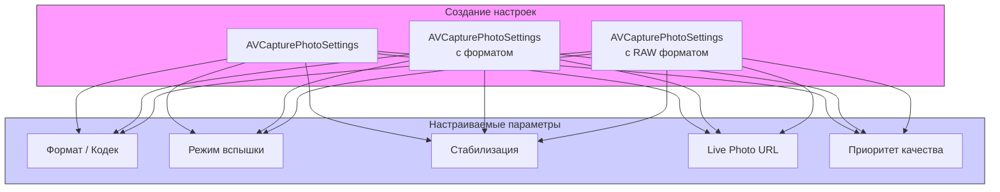

#avfoundation #photo #settings #avcapturephotosettings #camera #image-capture #raw #flash

---
## AVCapturePhotoSettings

### Определение
**AVCapturePhotoSettings** — это класс во фреймворке [[AVFoundation]], который инкапсулирует параметры и настройки для одного снимка, сделанного с помощью [[AVCapturePhotoOutput]]. Он позволяет разработчику точно контролировать, как будет выполнен захват фотографии: формат файла, режим вспышки, стабилизация, обработка и многие другие аспекты .

Каждый вызов `capturePhoto(with:delegate:)` требует объект `AVCapturePhotoSettings`, который определяет, как именно будет выполнен этот конкретный снимок. Это позволяет гибко менять настройки от кадра к кадру, например, использовать разные режимы вспышки или форматы для разных ситуаций .

### Зачем это знать [[iOS]]-разработчику?
1.  **Контроль качества:** Выбор формата ([[JPEG]], [[HEIC]], RAW), сжатия и разрешения снимка .
2.  **Управление вспышкой:** Настройка режима вспышки (авто, вкл, выкл) и режима уменьшения эффекта красных глаз .
3.  **Стабилизация:** Включение оптической или цифровой стабилизации для предотвращения смазывания .
4.  **Live Photos:** Настройка съемки живых фотографий с видеофрагментом .
5.  **Дополнительные данные:** Включение захвата карт глубины, портретных масок и других вспомогательных данных .
6.  **Приоритеты обработки:** Баланс между скоростью съемки, качеством и энергопотреблением .

---

### Иерархия и создание настроек



### Способы создания

```swift
// 1. Пустые настройки (система выберет оптимальные параметры)
let settings = AVCapturePhotoSettings()

// 2. С заданным форматом (кодеком)
let settings = AVCapturePhotoSettings(format: [AVVideoCodecKey: AVVideoCodecType.hevc])

// 3. Для RAW съемки
if let rawFormat = photoOutput.availableRawPhotoPixelFormatTypes.first {
    let settings = AVCapturePhotoSettings(rawPixelFormatType: rawFormat)
}

// 4. Из существующих настроек (для быстрого повторения)
let settings = AVCapturePhotoSettings(from: existingSettings)
```

---

### Ключевые свойства и методы

#### Форматы и кодеки
- `format` — словарь с настройками формата (кодек, качество сжатия) .
- `rawPixelFormatType` — формат пикселей для RAW съемки (если используется RAW-инициализатор) .
- `availableRawPhotoPixelFormatTypes` — доступные RAW форматы (свойство `AVCapturePhotoOutput`) .

#### Управление вспышкой
- `flashMode` — режим вспышки (`.off`, `.on`, `.auto`) .
- `isAutoRedEyeReductionEnabled` — автоматическое уменьшение эффекта красных глаз .

#### Стабилизация
- `isAutoStillImageStabilizationEnabled` — включение автоматической стабилизации при съемке .
- `isAutoDualCameraFusionEnabled` — включение фьюжн с двух камер (для устройств с двойной камерой) .

#### Live Photos
- `livePhotoMovieFileURL` — URL для сохранения видеофрагмента Live Photo .

#### Приоритеты и обработка
- `photoQualityPrioritization` — приоритет качества/скорости (`.speed`, `.quality`, `.balanced`) .
- `isHighResolutionPhotoEnabled` — съемка в максимальном разрешении .
- `isDepthDataDeliveryEnabled` — включение захвата данных глубины .
- `isPortraitEffectsMatteDeliveryEnabled` — включение захвата портретной маски .
- `isCameraCalibrationDataDeliveryEnabled` — включение захвата данных калибровки камеры .

#### Дополнительные настройки
- `metadata` — пользовательские метаданные для добавления в изображение .
- `shutterSound` — управление звуком затвора (на iOS 10+ можно отключить) .

---

### Примеры использования

#### Уровень 1: Базовые настройки для обычного фото
Простейший пример с минимальными настройками.

```swift
import AVFoundation

func captureBasicPhoto(photoOutput: AVCapturePhotoOutput, delegate: AVCapturePhotoCaptureDelegate) {
    // 1. Создаем настройки по умолчанию
    let settings = AVCapturePhotoSettings()
    
    // 2. Настраиваем базовые параметры
    settings.flashMode = .auto
    settings.isAutoStillImageStabilizationEnabled = true
    
    // 3. Запускаем съемку
    photoOutput.capturePhoto(with: settings, delegate: delegate)
}
```

#### Уровень 2: Настройка формата и качества
Выбор между HEIC и JPEG, настройка приоритета качества.

```swift
import AVFoundation

func configureFormatAndQuality(photoOutput: AVCapturePhotoOutput) -> AVCapturePhotoSettings {
    let settings: AVCapturePhotoSettings
    
    // 1. Выбираем формат (HEIC если доступен, иначе JPEG)
    if photoOutput.availablePhotoCodecTypes.contains(.hevc) {
        settings = AVCapturePhotoSettings(format: [AVVideoCodecKey: AVVideoCodecType.hevc])
        print("Используем HEIC формат")
    } else {
        settings = AVCapturePhotoSettings()
        print("Используем JPEG формат")
    }
    
    // 2. Настраиваем приоритет качества
    settings.photoQualityPrioritization = .quality // или .speed, .balanced
    
    // 3. Включаем высокое разрешение
    settings.isHighResolutionPhotoEnabled = true
    
    return settings
}
```

#### Уровень 3: Настройка для съемки в сложных условиях
Оптимизация для низкой освещенности.

```swift
import AVFoundation

func lowLightOptimizedSettings(photoOutput: AVCapturePhotoOutput) -> AVCapturePhotoSettings {
    let settings = AVCapturePhotoSettings()
    
    // 1. Вспышка в автоматическом режиме
    settings.flashMode = .auto
    
    // 2. Обязательная стабилизация
    settings.isAutoStillImageStabilizationEnabled = true
    
    // 3. Приоритет качества важнее скорости
    settings.photoQualityPrioritization = .quality
    
    // 4. Для двойных камер включаем фьюжн
    if photoOutput.isAutoDualCameraFusionEnabled {
        settings.isAutoDualCameraFusionEnabled = true
    }
    
    // 5. Отключаем ненужные дополнительные данные для скорости
    settings.isDepthDataDeliveryEnabled = false
    settings.isPortraitEffectsMatteDeliveryEnabled = false
    
    return settings
}
```

#### Уровень 4: Настройка для RAW съемки
Профессиональная съемка с RAW форматом.

```swift
import AVFoundation

func rawPhotoSettings(photoOutput: AVCapturePhotoOutput) -> AVCapturePhotoSettings? {
    // 1. Проверяем доступность RAW
    guard let rawFormat = photoOutput.availableRawPhotoPixelFormatTypes.first else {
        print("RAW не поддерживается")
        return nil
    }
    
    // 2. Создаем RAW настройки
    let rawSettings = AVCapturePhotoSettings(rawPixelFormatType: rawFormat)
    
    // 3. Добавляем также обработанную версию для предпросмотра
    if let previewFormat = photoOutput.availablePhotoCodecTypes.first {
        rawSettings.previewPhotoFormat = [kCVPixelBufferPixelFormatTypeKey as String: previewFormat]
    }
    
    // 4. Настройки для RAW
    rawSettings.flashMode = .off // RAW обычно снимают без вспышки
    rawSettings.isAutoStillImageStabilizationEnabled = true
    
    return rawSettings
}
```

#### Уровень 5: Настройка для Live Photos
Полная конфигурация для съемки живых фотографий.

```swift
import AVFoundation

func livePhotoSettings(photoOutput: AVCapturePhotoOutput) -> AVCapturePhotoSettings? {
    // 1. Проверяем поддержку Live Photos
    guard photoOutput.isLivePhotoCaptureSupported else {
        print("Live Photos не поддерживаются")
        return nil
    }
    
    // 2. Создаем настройки
    let settings = AVCapturePhotoSettings()
    
    // 3. Включаем Live Photo
    if photoOutput.isLivePhotoCaptureEnabled {
        settings.isLivePhotoCaptureEnabled = true
        
        // 4. Указываем URL для временного файла видео
        let movieFileName = UUID().uuidString
        let moviePath = (NSTemporaryDirectory() as NSString)
            .appendingPathComponent((movieFileName as NSString)
            .appendingPathExtension("mov")!)
        settings.livePhotoMovieFileURL = URL(fileURLWithPath: moviePath)
    }
    
    return settings
}
```

#### Уровень 6: Настройка для портретного режима с глубиной
Включение всех дополнительных данных для портретных эффектов.

```swift
import AVFoundation

func portraitModeSettings(photoOutput: AVCapturePhotoOutput) -> AVCapturePhotoSettings {
    let settings = AVCapturePhotoSettings()
    
    // 1. Включаем данные глубины
    if photoOutput.isDepthDataDeliverySupported {
        settings.isDepthDataDeliveryEnabled = true
        print("Depth data включена")
    }
    
    // 2. Включаем портретную маску
    if photoOutput.isPortraitEffectsMatteDeliverySupported {
        settings.isPortraitEffectsMatteDeliveryEnabled = true
        print("Portrait effects matte включена")
    }
    
    // 3. Включаем данные калибровки камеры
    if photoOutput.isCameraCalibrationDataDeliverySupported {
        settings.isCameraCalibrationDataDeliveryEnabled = true
    }
    
    // 4. Для лучшего качества в портретном режиме
    settings.photoQualityPrioritization = .quality
    
    return settings
}
```

#### Уровень 7: Пакетная съемка с разными настройками
Создание нескольких настроек для серии снимков.

```swift
import AVFoundation

func createBracketedSettings(photoOutput: AVCapturePhotoOutput) -> [AVCapturePhotoSettings] {
    var settingsArray: [AVCapturePhotoSettings] = []
    
    // 1. Настройка с разными режимами вспышки
    for flashMode in [AVCaptureDevice.FlashMode.off, .on, .auto] {
        let settings = AVCapturePhotoSettings()
        settings.flashMode = flashMode
        settingsArray.append(settings)
    }
    
    // 2. Настройка с разными приоритетами качества
    for priority in [AVCapturePhotoSettings.QualityPrioritization.speed, .balanced, .quality] {
        let settings = AVCapturePhotoSettings()
        settings.photoQualityPrioritization = priority
        settingsArray.append(settings)
    }
    
    return settingsArray
}

// Использование:
func captureBracketed(photoOutput: AVCapturePhotoOutput, delegate: AVCapturePhotoCaptureDelegate) {
    let settingsArray = createBracketedSettings(photoOutput: photoOutput)
    
    for settings in settingsArray {
        photoOutput.capturePhoto(with: settings, delegate: delegate)
        // Небольшая задержка между кадрами
        Thread.sleep(forTimeInterval: 0.5)
    }
}
```

#### Уровень 8: Динамическое изменение настроек в зависимости от условий
Адаптивные настройки на основе внешних факторов.

```swift
import AVFoundation
import UIKit

class AdaptivePhotoSettings {
    
    static func settingsForCurrentConditions(photoOutput: AVCapturePhotoOutput,
                                              device: AVCaptureDevice) -> AVCapturePhotoSettings {
        let settings = AVCapturePhotoSettings()
        
        // 1. Определяем уровень освещенности
        let brightness = device.exposureTargetBias
        let isLowLight = brightness < -1.0
        
        if isLowLight {
            // Низкая освещенность
            settings.flashMode = .auto
            settings.isAutoStillImageStabilizationEnabled = true
            settings.photoQualityPrioritization = .balanced
        } else {
            // Хорошее освещение
            settings.flashMode = .off
            settings.isAutoStillImageStabilizationEnabled = false
            settings.photoQualityPrioritization = .quality
        }
        
        // 2. Определяем, движется ли устройство (примерно)
        let isDeviceMoving = UIDevice.current.orientation.isFlat ? false : true
        if isDeviceMoving && !isLowLight {
            // Если устройство движется, но света достаточно
            settings.isAutoStillImageStabilizationEnabled = true
        }
        
        return settings
    }
}
```

---

### Таблица настроек и их влияние

| Настройка | Влияние | Когда использовать |
|-----------|---------|-------------------|
| `flashMode` | Управление вспышкой | В условиях недостаточной освещенности |
| `isAutoStillImageStabilizationEnabled` | Уменьшение смазывания | При съемке с рук или движущихся объектов |
| `photoQualityPrioritization` | Баланс качества/скорости | `.speed` для серийной съемки, `.quality` для одиночных кадров |
| `isDepthDataDeliveryEnabled` | Данные глубины | Для портретного режима, AR, эффектов размытия |
| `isHighResolutionPhotoEnabled` | Максимальное разрешение | Для печати, профессионального использования |
| `livePhotoMovieFileURL` | Видео для Live Photo | Для съемки живых фотографий |
| `isAutoRedEyeReductionEnabled` | Уменьшение красных глаз | При съемке людей со вспышкой |
| `isAutoDualCameraFusionEnabled` | Комбинирование с двух камер | Для улучшения качества на устройствах с двумя камерами |

---

### Важные нюансы и Best Practices

#### 1. **Проверка доступности**
Перед установкой любой функции проверяйте, поддерживается ли она устройством и конфигурацией сессии .

```swift
if photoOutput.isDepthDataDeliverySupported {
    settings.isDepthDataDeliveryEnabled = true
}
```

#### 2. **RAW и обработанные версии**
При съемке в RAW рекомендуется также запрашивать обработанную версию для предпросмотра, так как RAW файлы не могут быть отображены напрямую .

#### 3. **Live Photo Movie URL**
Убедитесь, что указанный URL доступен для записи. Система создаст временный файл по этому пути. После обработки файл может быть удален системой, поэтому скопируйте его, если нужно сохранить .

#### 4. **Производительность и энергопотребление**
- Высокое разрешение и RAW увеличивают нагрузку на процессор и потребление энергии.
- Стабилизация и фьюжн также требуют дополнительных вычислений.
- Выбирайте минимально необходимые настройки для конкретной задачи.

#### 5. **Приоритет качества**
`.speed` — минимальная задержка, подходит для серийной съемки.
`.quality` — максимальное качество, но может быть медленнее.
`.balanced` — компромиссный вариант.

#### 6. **Многократное использование**
Объекты `AVCapturePhotoSettings` можно использовать только для одного снимка. Для каждого нового кадра создавайте новый экземпляр .

#### 7. **Клонирование настроек**
Если нужно сделать несколько снимков с похожими настройками, используйте `init(from:)` для создания копии .

### Итог
**AVCapturePhotoSettings** — это гибкий и мощный инструмент для точной настройки каждого снимка в [[AVFoundation]]. Он позволяет:

- **Контролировать формат и качество** изображения
- **Управлять вспышкой и стабилизацией**
- **Включать дополнительные данные** (глубина, портретные маски)
- **Настраивать Live Photos** и RAW съемку
- **Адаптироваться к условиям** съемки

Правильное использование этого класса необходимо для создания профессиональных приложений с камерой, обеспечивающих оптимальное качество и пользовательский опыт в любых условиях.