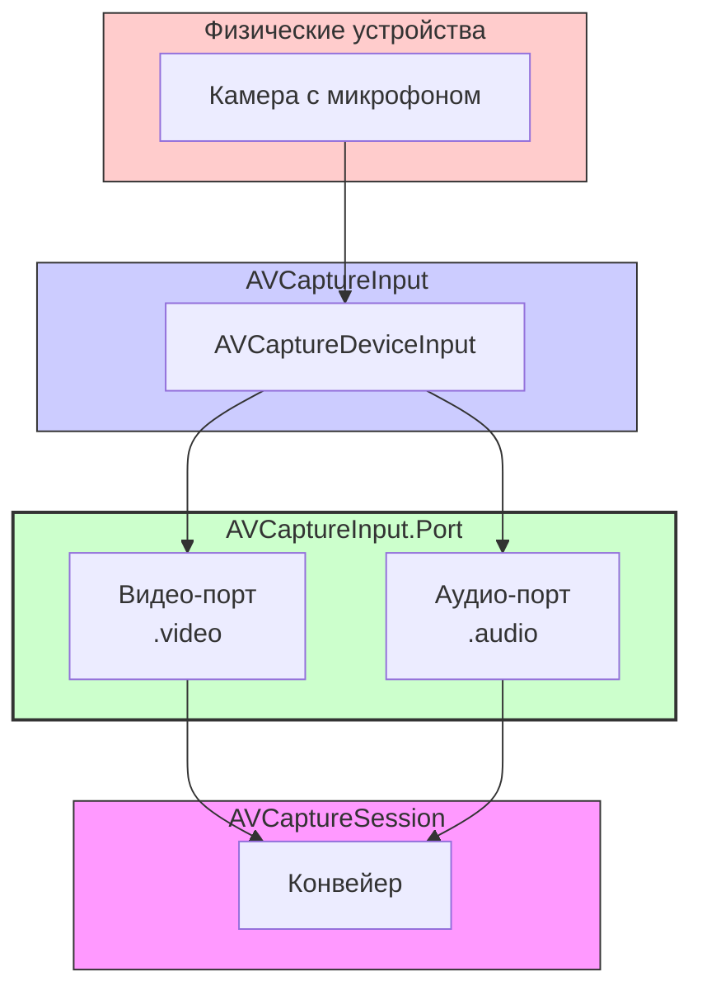

#avfoundation #capture #port #avcaptureinputport #multi-cam #virtual-device #media-type #core-media

---
## AVCaptureInput.Port (AVCapturePort)

### Определение
**AVCaptureInput.Port** (в [[Objective-C]] [[AVCaptureInputPort]]) — это класс во фреймворке AVFoundation, который представляет собой отдельный поток данных, предоставляемый входом захвата ([[AVCaptureInput]]) . Каждый физический или виртуальный источник данных может иметь один или несколько портов: например, камера имеет видеопорт, а встроенный микрофон — аудиопорт.

Простыми словами, если [[AVCaptureDeviceInput]] — это "кабель", подключающий камеру к сессии, то `AVCaptureInput.Port` — это отдельные "жилы" внутри этого кабеля: одна для видео, другая для аудио .

### Зачем это знать iOS-разработчику?
1.  **Различение потоков данных:** Позволяет идентифицировать, какой именно поток (видео, аудио, глубины) предоставляет порт.
2.  **Работа с виртуальными устройствами:** Для таких устройств, как двойная камера (dual camera), основной вход не раскрывает порты физических составляющих. Специальный метод `ports(for:sourceDeviceType:sourceDevicePosition:)` позволяет получить доступ к портам отдельных физических камер (широкоугольной и телефото) .
3.  **Multi-cam сессии:** При одновременном захвате с нескольких камер необходимо подключать выходы к конкретным портам, чтобы управлять потоками данных .
4.  **Мониторинг состояния:** Можно включать/отключать порт (`isEnabled`) и отслеживать изменения формата данных (`formatDescription`) через уведомления .
5.  **Идентификация источника:** Свойства `sourceDeviceType` и `sourceDevicePosition` позволяют точно определить, с какого физического устройства поступает данный порт .

---

### Архитектура и место в системе захвата



### Ключевые свойства AVCaptureInput.Port

| Свойство | Описание | Тип |
|----------|----------|-----|
| `mediaType` | Тип медиаданных порта (например, `.video`, `.audio`, `.depthData`)  | `AVMediaType` |
| `formatDescription` | Объект, описывающий текущий формат данных (разрешение, кодек, частота)  | `CMFormatDescription` |
| `isEnabled` | Булево значение, включающее или отключающее порт  | `Bool` |
| `sourceDeviceType` | Тип устройства-источника (для виртуальных устройств)  | `AVCaptureDevice.DeviceType` |
| `sourceDevicePosition` | Позиция устройства-источника (фронтальная/задняя)  | `AVCaptureDevice.Position` |
| `clock` | Тактовый генератор устройства для синхронизации времени  | `CMClock` |
| `input` | Вход, которому принадлежит данный порт  | `AVCaptureInput` |

### Наблюдение за изменениями

Система отправляет уведомление `AVCaptureInputPortFormatDescriptionDidChangeNotification`, когда формат данных порта изменяется (например, при смене активного формата устройства) .

---

### Примеры использования

#### Уровень 1: Инспекция портов устройства
Получение всех портов входа и вывод их характеристик.

```swift
import AVFoundation

func inspectPorts(for input: AVCaptureDeviceInput) {
    print("Инспекция портов для: \(input.device.localizedName)")
    
    for (index, port) in input.ports.enumerated() {
        print("  Порт #\(index + 1):")
        print("    - mediaType: \(port.mediaType.rawValue)")
        
        if let formatDescription = port.formatDescription {
            if port.mediaType == .video {
                let dimensions = CMVideoFormatDescriptionGetDimensions(formatDescription)
                print("    - Размер видео: \(dimensions.width)x\(dimensions.height)")
            }
        }
        
        print("    - isEnabled: \(port.isEnabled)")
        print("    - sourceDeviceType: \(port.sourceDeviceType?.rawValue ?? "unknown")")
        print("    - sourceDevicePosition: \(port.sourceDevicePosition.rawValue)")
    }
}

// Использование:
// let videoInput = captureSession.inputs.first as! AVCaptureDeviceInput
// inspectPorts(for: videoInput)
```

#### Уровень 2: Получение портов виртуального устройства (Dual Camera)
Для виртуальных устройств (например, `.builtInDualCamera`) свойство `ports` содержит только порты самого виртуального устройства, а не его физических компонентов .

```swift
import AVFoundation

// Предположим, у нас есть вход от двойной камеры
guard let dualCameraInput = captureSession.inputs.first(where: { input in
    (input as? AVCaptureDeviceInput)?.device.deviceType == .builtInDualCamera
}) as? AVCaptureDeviceInput else { return }

// Получаем порты составляющих физических камер
let wideVideoPort = dualCameraInput.ports(
    for: .video,
    sourceDeviceType: .builtInWideAngleCamera,
    sourceDevicePosition: .back
).first

let teleVideoPort = dualCameraInput.ports(
    for: .video,
    sourceDeviceType: .builtInTelephotoCamera,
    sourceDevicePosition: .back
).first

print("Широкоугольный порт: \(wideVideoPort != nil)")
print("Телефото порт: \(teleVideoPort != nil)")
```

#### Уровень 3: Настройка multi-cam сессии с подключением к конкретным портам
Пример использования портов для создания соединений с конкретными физическими камерами в `AVCaptureMultiCamSession` .

```swift
import AVFoundation

func setupMultiCamSession() {
    let session = AVCaptureMultiCamSession()
    
    // 1. Получаем входы для двух камер
    guard let backCamera = AVCaptureDevice.default(.builtInWideAngleCamera, for: .video, position: .back),
          let backInput = try? AVCaptureDeviceInput(device: backCamera),
          session.canAddInput(backInput) else { return }
    session.addInputWithNoConnections(backInput)
    
    guard let frontCamera = AVCaptureDevice.default(.builtInWideAngleCamera, for: .video, position: .front),
          let frontInput = try? AVCaptureDeviceInput(device: frontCamera),
          session.canAddInput(frontInput) else { return }
    session.addInputWithNoConnections(frontInput)
    
    // 2. Создаем выход
    let videoOutput = AVCaptureVideoDataOutput()
    guard session.canAddOutput(videoOutput) else { return }
    session.addOutputWithNoConnections(videoOutput)
    
    // 3. Создаем соединения, используя конкретные порты
    // Для задней камеры
    if let backPort = backInput.ports(for: .video, sourceDeviceType: nil, sourceDevicePosition: .back).first {
        let backConnection = AVCaptureConnection(inputPorts: [backPort], output: videoOutput)
        if session.canAddConnection(backConnection) {
            session.addConnection(backConnection)
        }
    }
    
    // Для фронтальной камеры
    if let frontPort = frontInput.ports(for: .video, sourceDeviceType: nil, sourceDevicePosition: .front).first {
        let frontConnection = AVCaptureConnection(inputPorts: [frontPort], output: videoOutput)
        if session.canAddConnection(frontConnection) {
            session.addConnection(frontConnection)
        }
    }
    
    session.startRunning()
}
```

#### Уровень 4: Включение/отключение порта
Можно временно отключить порт, чтобы остановить поток данных от конкретного источника .

```swift
import AVFoundation

func toggleAudioPort(for input: AVCaptureDeviceInput, enable: Bool) {
    for port in input.ports where port.mediaType == .audio {
        port.isEnabled = enable
        print("Аудио порт \(enable ? "включен" : "отключен")")
    }
}

// Использование:
// toggleAudioPort(for: videoInput, enable: false) // отключаем аудио от камеры
```

#### Уровень 5: Наблюдение за изменением формата порта
Получение уведомлений об изменении формата данных (например, при смене разрешения) .

```swift
import AVFoundation

class PortObserverViewController: UIViewController {
    
    var observation: NSObjectProtocol?
    
    override func viewDidLoad() {
        super.viewDidLoad()
        
        // Подписываемся на уведомление об изменении формата
        observation = NotificationCenter.default.addObserver(
            forName: .AVCaptureInputPortFormatDescriptionDidChange,
            object: nil,
            queue: .main
        ) { notification in
            guard let port = notification.object as? AVCaptureInput.Port else { return }
            print("Формат порта изменился!")
            
            if let formatDesc = port.formatDescription,
               port.mediaType == .video {
                let dimensions = CMVideoFormatDescriptionGetDimensions(formatDesc)
                print("  Новый размер видео: \(dimensions.width)x\(dimensions.height)")
            }
        }
    }
    
    deinit {
        if let observation = observation {
            NotificationCenter.default.removeObserver(observation)
        }
    }
}
```

---

### Важные нюансы и Best Practices

#### 1. **Порты не создаются напрямую**
Вы не можете создать экземпляр `AVCaptureInput.Port` самостоятельно. Они создаются системой при инициализации входа и предоставляются через свойство `ports` .

#### 2. **Виртуальные устройства скрывают физические порты**
Для виртуальных устройств (dual camera, triple camera) свойство `ports` содержит только порты самого виртуального устройства. Для доступа к портам физических компонентов используйте метод `ports(for:sourceDeviceType:sourceDevicePosition:)` .

#### 3. **Включение/отключение портов**
Свойство `isEnabled` позволяет включать или отключать порт. Это полезно для временного прекращения потока данных от конкретного источника без удаления всего входа из сессии .

#### 4. **Производительность**
При работе с multi-cam сессиями и множественными портами следите за производительностью. Каждый активный порт потребляет ресурсы устройства.

#### 5. **Синхронизация времени**
Свойство `clock` предоставляет доступ к тактовому генератору устройства, что важно для синхронизации данных из разных источников .

### Итог
**AVCaptureInput.Port** — это фундаментальный, но часто незаметный элемент архитектуры AVFoundation, представляющий отдельные потоки данных от источников захвата. Понимание портов необходимо для:

- **Различения типов данных** (видео/аудио) от одного устройства
- **Работы с виртуальными устройствами** и доступа к их физическим компонентам
- **Создания multi-cam сессий** с точным контролем соединений
- **Мониторинга состояния** потоков данных и их форматов