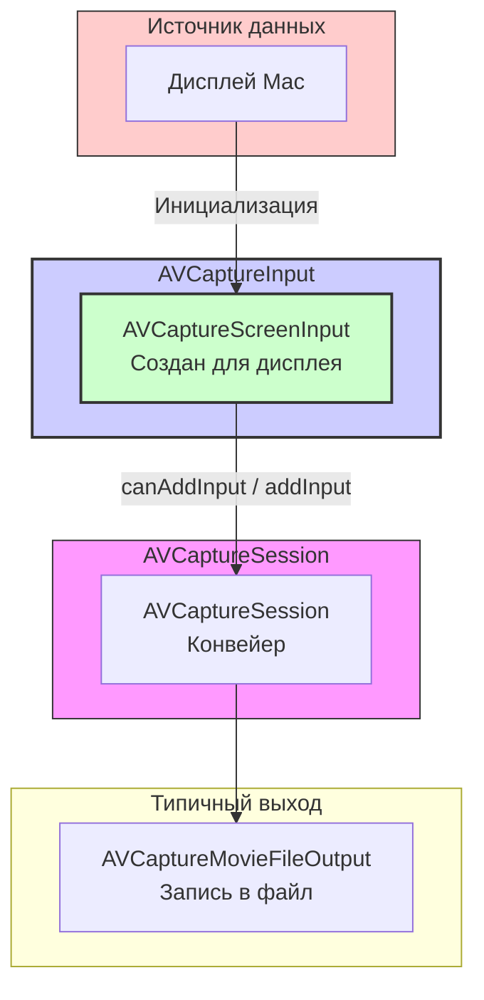

#avfoundation #macOS #screen-capture #recording #avcapturescreeninput #screen-recording

---
## AVCaptureScreenInput

### Определение
**AVCaptureScreenInput** — это конкретный подкласс [[AVCaptureInput]] во фреймворке [[AVFoundation]], предназначенный **исключительно для macOS**. Он предоставляет интерфейс для захвата медиаданных с экрана компьютера или его части . Объекты этого класса используются в качестве источников ввода для сессии захвата ([[AVCaptureSession]]), позволяя записывать происходящее на одном из подключенных к системе дисплеев.

### Важное предупреждение о платформе ([[iOS]] vs macOS)
Крайне важно понимать, что **`AVCaptureScreenInput` недоступен на iOS, watchOS и tvOS** . Его использование возможно только при разработке приложений для macOS. Если ваша цель — захват экрана на iOS, вам потребуются другие фреймворки, такие как `ReplayKit` (для записи экрана приложения) или `ScreenCaptureKit` (доступен на iPadOS 17+).

### Зачем это знать macOS-разработчику?
1.  **Запись экрана:** Создание приложений для создания скринкастов, туториалов или записи игрового процесса.
2.  **Трансляция экрана:** Передача захваченного видеопотока по сети для стриминга или видеоконференций.
3.  **Создание скриншотов:** Хотя для этого есть и другие, более простые способы, `AVCaptureScreenInput` также может быть использован для этой цели .
4.  **Захват определенной области:** Позволяет записывать не весь экран, а только выбранную пользователем область .

---

### Архитектура и место в AVCaptureSession (macOS)

`AVCaptureScreenInput` встраивается в сессию захвата аналогично другим входам, выступая источником видеоданных.



### Ключевые свойства

Эти свойства позволяют тонко настраивать процесс захвата экрана.

| Свойство                 | Описание                                                                                                                                 | Тип         |
| ------------------------ | ---------------------------------------------------------------------------------------------------------------------------------------- | ----------- |
| `minFrameDuration`       | Минимальная длительность кадра, определяющая максимальную частоту захвата (например, `CMTimeMake(value: 1, timescale: 30)` для 30 fps) . | `CMTime`    |
| `cropRect`               | Прямоугольник (`CGRect`) в пикселях, определяющий область экрана для захвата. Позволяет записывать не весь экран, а его часть .          | [[CGRect]]  |
| `scaleFactor`            | Коэффициент масштабирования видеобуферов. Например, значение `2.0` увеличит картинку в два раза .                                        | [[CGFloat]] |
| `capturesCursor`         | Булево значение, определяющее, будет ли курсор мыши отображаться в захваченном видео .                                                   | [[Bool]]    |
| `capturesMouseClicks`    | Булево значение, определяющее, будут ли клики мыши подсвечиваться (обычно кружком) в захваченном видео .                                 | `Bool`      |
| `removesDuplicateFrames` | Устаревшее свойство. Ранее использовалось для пропуска дублирующихся кадров .                                                            | `Bool`      |

### Создание экземпляра

Для создания `AVCaptureScreenInput` можно использовать один из двух инициализаторов:
- `init()` — создает вход для захвата основного экрана .
- `init(displayID:)` — создает вход для захвата конкретного дисплея по его идентификатору `CGDirectDisplayID` .

---

### Примеры использования

#### Уровень 0: Запрос разрешений (macOS)
Для захвата экрана на macOS (начиная с определенных версий) пользователь должен предоставить разрешение приложению в настройках "Безопасность и конфиденциальность" -> "Запись экрана" . Без этого разрешения захват будет невозможен, и вы можете получить ошибку.

#### Уровень 1: Простая запись экрана в файл
Этот пример демонстрирует минимальную настройку для записи всего основного экрана в файл.

```swift
import Cocoa
import AVFoundation

class ScreenRecorder: NSObject, AVCaptureFileOutputRecordingDelegate {

    let captureSession = AVCaptureSession()
    let movieOutput = AVCaptureMovieFileOutput()

    override init() {
        super.init()
        setupSession()
    }

    private func setupSession() {
        // 1. Создаем и добавляем вход для захвата экрана (основной экран)
        guard let screenInput = AVCaptureScreenInput(), // Инициализатор по умолчанию для главного экрана
              captureSession.canAddInput(screenInput) else {
            print("Не удалось создать или добавить вход для экрана")
            return
        }
        captureSession.addInput(screenInput)
        print("Вход для экрана добавлен")

        // 2. Настраиваем частоту кадров (опционально)
        screenInput.minFrameDuration = CMTime(value: 1, timescale: 30) // 30 fps
        screenInput.capturesCursor = true
        screenInput.capturesMouseClicks = true

        // 3. Добавляем выход для записи в файл
        if captureSession.canAddOutput(movieOutput) {
            captureSession.addOutput(movieOutput)
            print("Выход для записи добавлен")
        }

        // 4. Запускаем сессию (данные начнут поступать)
        DispatchQueue.global(qos: .userInitiated).async { [weak self] in
            self?.captureSession.startRunning()
        }
    }

    func startRecording(to url: URL) {
        movieOutput.startRecording(to: url, recordingDelegate: self)
    }

    func stopRecording() {
        movieOutput.stopRecording()
    }

    // MARK: - AVCaptureFileOutputRecordingDelegate
    func fileOutput(_ output: AVCaptureFileOutput, didStartRecordingTo fileURL: URL, from connections: [AVCaptureConnection]) {
        print("Запись экрана начата, файл: \(fileURL)")
    }

    func fileOutput(_ output: AVCaptureFileOutput, didFinishRecordingTo outputFileURL: URL, from connections: [AVCaptureConnection], error: Error?) {
        if let error = error {
            print("Ошибка записи: \(error.localizedDescription)")
        } else {
            print("Запись экрана завершена: \(outputFileURL)")
        }
        captureSession.stopRunning()
    }
}
```

**Использование:**
```swift
let recorder = ScreenRecorder()
let destinationURL = FileManager.default.temporaryDirectory.appendingPathComponent("recording.mov")
recorder.startRecording(to: destinationURL)

// ... через какое-то время
recorder.stopRecording()
```

#### Уровень 2: Захват определенного дисплея
Для систем с несколькими мониторами можно выбрать конкретный дисплей .

```swift
import AVFoundation

func createInputForDisplay(withID displayID: CGDirectDisplayID) -> AVCaptureScreenInput? {
    guard let input = AVCaptureScreenInput(displayID: displayID) else {
        print("Не удалось создать вход для дисплея с ID \(displayID)")
        return nil
    }
    return input
}

// Функция для получения списка активных дисплеев (упрощенно)
func getActiveDisplayIDs() -> [CGDirectDisplayID] {
    var displayCount: UInt32 = 0
    CGGetActiveDisplayList(0, nil, &displayCount)
    guard displayCount > 0 else { return [] }
    
    let allocated = Int(displayCount)
    let activeDisplays = UnsafeMutablePointer<CGDirectDisplayID>.allocate(capacity: allocated)
    defer { activeDisplays.deallocate() }
    
    CGGetActiveDisplayList(displayCount, activeDisplays, &displayCount)
    
    return Array(UnsafeBufferPointer(start: activeDisplays, count: Int(displayCount)))
}
```

#### Уровень 3: Захват определенной области экрана
Использование свойства `cropRect` для записи только части экрана .

```swift
import AVFoundation

func createInputForScreenRegion(origin: CGPoint, size: CGSize) -> AVCaptureScreenInput? {
    guard let input = AVCaptureScreenInput() else { return nil }
    
    // CropRect указывается в пиксельных координатах экрана
    input.cropRect = CGRect(origin: origin, size: size)
    print("Область захвата установлена: \(input.cropRect)")
    
    return input
}
```

#### Уровень 4: Интеграция с [[async]]/[[await]]
Пример обертки для асинхронного ожидания завершения записи .

```swift
import AVFoundation

class RecordingDelegate: NSObject, AVCaptureFileOutputRecordingDelegate {
    var didStartContinuation: CheckedContinuation<Void, Never>?
    var didFinishContinuation: CheckedContinuation<Void, Error>?

    func fileOutput(_ output: AVCaptureFileOutput, didStartRecordingTo fileURL: URL, from connections: [AVCaptureConnection]) {
        didStartContinuation?.resume()
        didStartContinuation = nil
    }

    func fileOutput(_ output: AVCaptureFileOutput, didFinishRecordingTo outputFileURL: URL, from connections: [AVCaptureConnection], error: Error?) {
        if let error = error {
            didFinishContinuation?.resume(throwing: error)
        } else {
            didFinishContinuation?.resume()
        }
        didFinishContinuation = nil
    }
}

extension AVCaptureMovieFileOutput {
    func startRecording(to url: URL) async throws {
        return try await withCheckedThrowingContinuation { continuation in
            let delegate = RecordingDelegate()
            delegate.didFinishContinuation = continuation
            self.startRecording(to: url, recordingDelegate: delegate)
        }
    }
}
```

---

### Важные нюансы и Best Practices

#### 1. **Платформозависимость**
Помните, что этот класс недоступен на iOS. Для мобильных устройств используйте `ReplayKit` или `ScreenCaptureKit` (начиная с [[iOS]] 17) .

#### 2. **Разрешения (macOS)**
Начиная с macOS 10.15 Catalina, для захвата экрана приложение должно быть добавлено пользователем в список разрешенных в настройках "Запись экрана". Без этого вы получите черный экран или ошибку .

#### 3. **Производительность**
- Захват экрана с высоким разрешением и частотой кадров (например, 4K при 60 fps) требует значительных ресурсов процессора и диска.
- Используйте `cropRect`, чтобы уменьшить область захвата, если вам не нужен весь экран.
- Настройте `minFrameDuration` на оптимальное для вашей задачи значение (например, 15 fps для лекций, 30-60 fps для игр).

#### 4. **Обработка ошибок**
Метод `startRecording` может вызвать исключение [[Objective-C]], которое напрямую не ловится в Swift. Рекомендуется использовать библиотеки-обертки (например, `ExceptionCatcher`) или тщательно проверять состояние перед записью .

#### 5. **CropRect и координаты**
`cropRect` задается в пиксельных координатах экрана. При получении координат из фреймворков вроде SwiftUI требуется их корректное преобразование .

### Итог
**AVCaptureScreenInput** — это мощный и относительно простой инструмент для захвата экрана в macOS-приложениях. Он предоставляет:
- **Простой API** для интеграции в стандартный конвейер AVFoundation.
- **Гибкость** в выборе дисплея и области захвата.
- **Контроль** над отображением курсора, кликов и частотой кадров.

Однако, учитывая появление более современного фреймворка `ScreenCaptureKit`, его использование может быть предпочтительным для новых проектов, нацеленных на последние версии macOS. `AVCaptureScreenInput` остается актуальным для поддержки старых версий операционной системы (до 10.15) .