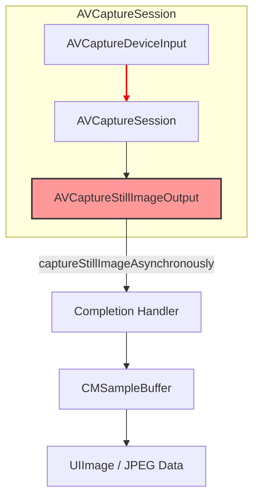

#avfoundation #deprecated #legacy #photo-capture #avcapturestillimageoutput #ios #migration

---
## AVCaptureStillImageOutput (==Устаревший==)

### Определение
**AVCaptureStillImageOutput** — это конкретный подкласс [[AVCaptureOutput]] во фреймворке AVFoundation, который использовался для захвата неподвижных изображений (фотографий) высокого качества с устройства камеры. Он позволял делать снимки "по требованию" и получать результат вместе с метаданными в виде `CMSampleBuffer`.

**ВАЖНО: Этот класс устарел (deprecated) начиная с iOS 10 (2016 год) и macOS 10.15 Catalina. Apple настоятельно рекомендует использовать [[AVCapturePhotoOutput]] для всех новых проектов.**

### Статус устаревания
- **iOS:** 4.0 – 10.0 (Устарел)
- **iPadOS:** 4.0 – 10.0 (Устарел)
- **macOS:** 10.7 – 10.15 (Устарел)
- **Аннотация устаревания:** `[Deprecated(PlatformName.iOS, 10, 0, ...)]`

### Почему он устарел?
`AVCaptureStillImageOutput` был заменен на `AVCapturePhotoOutput` по нескольким причинам:
1.  **Поддержка новых форматов:** `AVCapturePhotoOutput` поддерживает HEIC, RAW, Live Photos и другие современные форматы.
2.  **Более богатый API:** Предоставляет детальную обратную связь через делегата ([[AVCapturePhotoCaptureDelegate]]) на всех этапах съемки.
3.  **Дополнительные данные:** Позволяет получать карты глубины (depth data), портретные маски (portrait effects matte) и данные калибровки камеры.
4.  **Лучшая интеграция:** Работает с новыми функциями камеры, такими как двойная камера, фьюжн и расширенная стабилизация.

---

### Архитектура (Историческая)



### Ключевые методы и свойства (Для понимания legacy-кода)

#### Основные методы
- `captureStillImageAsynchronously(from:completionHandler:)` — основной метод захвата изображения. Вызывается асинхронно, результат возвращается в completion-блоке.
- `jpegStillImageNSDataRepresentation(_:)` — классовый метод для конвертации `CMSampleBuffer` в `NSData` с JPEG-изображением и объединенными метаданными.

#### Настройки
- `outputSettings` — словарь с настройками выходного изображения (например, `[AVVideoCodecKey: AVVideoCodecType.jpeg]`).
- `availableImageDataCodecTypes` / `availableImageDataCVPixelFormatTypes` — доступные форматы и кодеки.

#### Стабилизация
- `automaticallyEnablesStillImageStabilizationWhenAvailable` — автоматическое включение стабилизации.
- `isStillImageStabilizationActive` — индикатор активности стабилизации.

#### Разрешение
- `isHighResolutionStillImageOutputEnabled` — включение съемки в максимальном разрешении.

---

### Пример использования (Legacy-код, только для поддержки старых проектов)

**ВАЖНО: Не используйте этот код в новых проектах. Он приведен исключительно для понимания и поддержки существующего кода.**

```swift
import AVFoundation
import UIKit

// ⚠️ ВНИМАНИЕ: Этот класс устарел. Используйте AVCapturePhotoOutput для новых проектов.
class LegacyCameraViewController: UIViewController {

    var captureSession: AVCaptureSession!
    var stillImageOutput: AVCaptureStillImageOutput!
    var previewLayer: AVCaptureVideoPreviewLayer!

    override func viewDidLoad() {
        super.viewDidLoad()
        setupCamera()
    }

    private func setupCamera() {
        captureSession = AVCaptureSession()
        captureSession.sessionPreset = .photo

        guard let camera = AVCaptureDevice.default(for: .video),
              let input = try? AVCaptureDeviceInput(device: camera),
              captureSession.canAddInput(input) else { return }
        captureSession.addInput(input)

        // ⚠️ Настройка устаревшего still image output
        stillImageOutput = AVCaptureStillImageOutput()
        stillImageOutput?.outputSettings = [AVVideoCodecKey: AVVideoCodecType.jpeg]
        
        if captureSession.canAddOutput(stillImageOutput) {
            captureSession.addOutput(stillImageOutput)
        }

        previewLayer = AVCaptureVideoPreviewLayer(session: captureSession)
        previewLayer.frame = view.bounds
        previewLayer.videoGravity = .resizeAspectFill
        view.layer.addSublayer(previewLayer)

        DispatchQueue.global(qos: .userInitiated).async { [weak self] in
            self?.captureSession.startRunning()
        }
    }

    // ⚠️ Устаревший метод захвата фото
    func captureLegacyPhoto() {
        guard let videoConnection = stillImageOutput?.connection(with: .video) else { return }

        stillImageOutput?.captureStillImageAsynchronously(from: videoConnection) { [weak self] (imageDataSampleBuffer, error) in
            if let error = error {
                print("Ошибка захвата: \(error.localizedDescription)")
                return
            }

            // Конвертация CMSampleBuffer в JPEG Data
            if let imageData = AVCaptureStillImageOutput.jpegStillImageNSDataRepresentation(imageDataSampleBuffer!) {
                let image = UIImage(data: imageData)
                print("Фото получено (legacy): \(image?.size ?? .zero)")
                
                // Сохранение в фотоальбом
                UIImageWriteToSavedPhotosAlbum(image!, nil, nil, nil)
            }
        }
    }
}
```

---

### AVCaptureStillImageOutput vs AVCapturePhotoOutput

| Характеристика                | AVCaptureStillImageOutput (Устарел) | AVCapturePhotoOutput (Современный)                              |
| ----------------------------- | ----------------------------------- | --------------------------------------------------------------- |
| **API стиль**                 | Completion handler                  | Делегат (`AVCapturePhotoCaptureDelegate`) с детальными методами |
| **Форматы**                   | JPEG, TIFF                          | [[HEIC]], [[JPEG]], RAW, ProRAW                                 |
| **Live Photos**               | Не поддерживается                   | Поддерживается                                                  |
| **Depth Data**                | Не поддерживается                   | Поддерживается                                                  |
| **Portrait Effects**          | Не поддерживается                   | Поддерживается                                                  |
| **Bracketed capture**         | Ограниченная поддержка              | Расширенная поддержка                                           |
| **Поддержка новых устройств** | Ограниченная                        | Полная                                                          |

### Миграция с AVCaptureStillImageOutput на AVCapturePhotoOutput

Если вы поддерживаете старый проект, вот основные шаги по миграции:

#### Было (Still Image Output):
```swift
// Настройка
let stillOutput = AVCaptureStillImageOutput()
stillOutput.outputSettings = [AVVideoCodecKey: AVVideoCodecType.jpeg]

// Захват
stillOutput.captureStillImageAsynchronously(from: connection) { buffer, error in
    let data = AVCaptureStillImageOutput.jpegStillImageNSDataRepresentation(buffer!)
    let image = UIImage(data: data!)
}
```

#### Стало (Photo Output):
```swift
// Настройка
let photoOutput = AVCapturePhotoOutput()
let settings = AVCapturePhotoSettings(format: [AVVideoCodecKey: AVVideoCodecType.jpeg])

// Захват
photoOutput.capturePhoto(with: settings, delegate: self)

// Реализация делегата
func photoOutput(_ output: AVCapturePhotoOutput, 
                 didFinishProcessingPhoto photo: AVCapturePhoto, 
                 error: Error?) {
    let data = photo.fileDataRepresentation()
    let image = UIImage(data: data!)
}
```

### Почему важно перейти на AVCapturePhotoOutput?

1.  **Будущее платформы:** Новые функции камеры (нейрокомпьютерная фотография, улучшенный HDR) доступны только через `AVCapturePhotoOutput`.
2.  **Производительность:** Современный API лучше оптимизирован для новых устройств.
3.  **Гибкость:** Детальный делегат позволяет точно контролировать каждый этап съемки.
4.  **Поддержка:** Устаревшие API могут не получать обновлений и исправлений.

### Итог
**AVCaptureStillImageOutput** — это исторический класс, сыгравший важную роль в развитии iOS-фотографии. Однако с 2016 года он официально устарел. Для всех новых проектов необходимо использовать **AVCapturePhotoOutput**, который предоставляет:

- Современные форматы (HEIC, RAW)
- Расширенные возможности (Live Photos, Depth Data)
- Гибкий делегат для контроля съемки
- Поддержку всех новых функций камеры Apple

Понимание `AVCaptureStillImageOutput` полезно только для поддержки legacy-кода, но не для новой разработки.