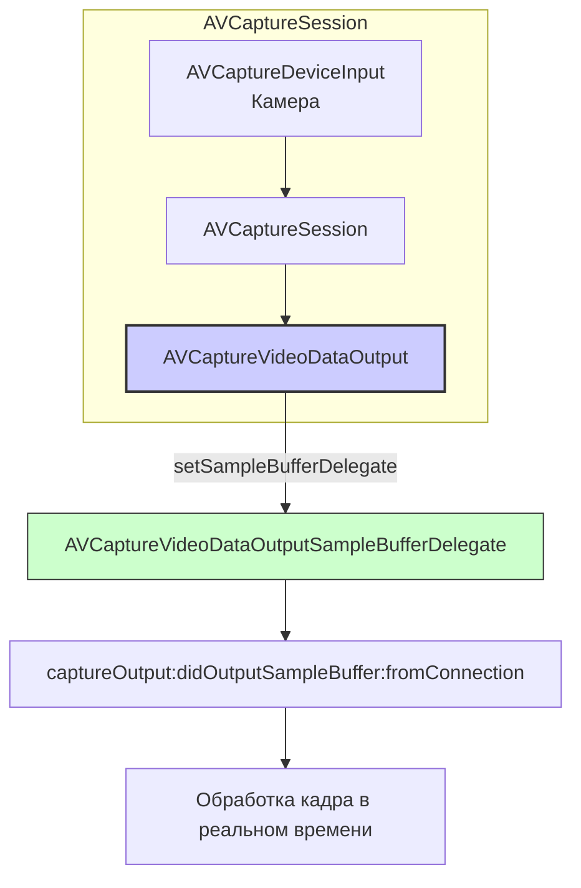

#avfoundation #video #real-time #processing #avcapturevideodataoutput #camera #vision #core-image

---
## AVCaptureVideoDataOutput

### Определение
**AVCaptureVideoDataOutput** — это конкретный подкласс [[AVCaptureOutput]] во фреймворке [[AVFoundation]], который предоставляет доступ к видеокадрам в реальном времени по мере их захвата с камеры устройства. Вместо того чтобы просто записывать видео в файл (как [[AVCaptureMovieFileOutput]]) или делать отдельные снимки (как [[AVCapturePhotoOutput]]), этот выход передает каждый кадр в ваш код для обработки .

Этот класс является основным инструментом для создания приложений, которым необходимо анализировать, модифицировать или интерпретировать видеопоток в реальном времени: компьютерное зрение, дополненная реальность, применение фильтров, детекция объектов и многое другое.

### Зачем это знать [[iOS]]-разработчику?
1.  **Обработка кадров в реальном времени:** Получение доступа к каждому видеокадру для анализа или модификации .
2.  **Интеграция с Vision:** Передача кадров в фреймворк Vision для распознавания лиц, текста, объектов, QR-кодов .
3.  **Применение фильтров Core Image:** Наложение эффектов, цветокоррекция, размытие на лету .
4.  **Машинное обучение:** Подача кадров в Core ML модели для классификации или детекции .
5.  **Создание кастомных кодеков или форматов:** Когда стандартной записи в файл недостаточно .
6.  **Синхронизация с другими данными:** Использование с `AVCaptureAudioDataOutput` для одновременной обработки аудио и видео .

---

### Архитектура и место в AVCaptureSession



### Ключевые свойства и методы

#### Настройка выходных данных
- `videoSettings` — словарь с настройками формата пикселей для выходных буферов (например, `[kCVPixelBufferPixelFormatTypeKey as String: kCVPixelFormatType_32BGRA]`) .
- `availableVideoCVPixelFormatTypes` — массив доступных форматов пикселей, которые можно использовать в `videoSettings` .

#### Управление кадрами
- `setSampleBufferDelegate(_:queue:)` — устанавливает делегата и очередь для получения видеокадров. Важно: очередь должна быть последовательной (не concurrent), чтобы кадры обрабатывались в правильном порядке .
- `alwaysDiscardsLateVideoFrames` — если `true` (значение по умолчанию), кадры, которые приходят с опозданием, отбрасываются. Это важно для поддержания "живости" потока в реальном времени .
- `minFrameDuration` — минимальная длительность кадра, определяющая максимальную частоту кадров, которую запрашивает выход .

#### Информация о соединении
- `connection(with:)` — возвращает соединение для видео, через которое можно настроить ориентацию, стабилизацию и другие параметры .

---

### Примеры от простого к сложному

#### Уровень 0: Настройка Info.plist и разрешений
Для доступа к камере необходимо добавить описание в `Info.plist`.

- **NSCameraUsageDescription** — "Для обработки видеокадров в реальном времени"

#### Уровень 1: Базовая настройка и получение кадров
Самый простой пример — подключение к камере и логирование получения каждого кадра.

```swift
import UIKit
import AVFoundation

class BasicVideoProcessorViewController: UIViewController, AVCaptureVideoDataOutputSampleBufferDelegate {

    var captureSession: AVCaptureSession!
    var previewLayer: AVCaptureVideoPreviewLayer!
    let videoProcessingQueue = DispatchQueue(label: "videoProcessingQueue")

    override func viewDidLoad() {
        super.viewDidLoad()
        checkPermissionsAndSetup()
    }

    private func checkPermissionsAndSetup() {
        switch AVCaptureDevice.authorizationStatus(for: .video) {
        case .authorized:
            setupCamera()
        case .notDetermined:
            AVCaptureDevice.requestAccess(for: .video) { granted in
                if granted { DispatchQueue.main.async { self.setupCamera() } }
            }
        default:
            print("Нет доступа к камере")
        }
    }

    private func setupCamera() {
        captureSession = AVCaptureSession()
        captureSession.sessionPreset = .hd1280x720

        guard let camera = AVCaptureDevice.default(.builtInWideAngleCamera, for: .video, position: .back),
              let input = try? AVCaptureDeviceInput(device: camera),
              captureSession.canAddInput(input) else { return }
        captureSession.addInput(input)

        // 1. Создаем и настраиваем VideoDataOutput
        let videoOutput = AVCaptureVideoDataOutput()
        
        // 2. Устанавливаем формат пикселей (32-bit BGRA - наиболее распространенный)
        videoOutput.videoSettings = [kCVPixelBufferPixelFormatTypeKey as String: kCVPixelFormatType_32BGRA]
        
        // 3. Устанавливаем делегата на нашу последовательную очередь
        videoOutput.setSampleBufferDelegate(self, queue: videoProcessingQueue)
        
        // 4. Отбрасываем устаревшие кадры для поддержания реального времени
        videoOutput.alwaysDiscardsLateVideoFrames = true

        if captureSession.canAddOutput(videoOutput) {
            captureSession.addOutput(videoOutput)
        }

        previewLayer = AVCaptureVideoPreviewLayer(session: captureSession)
        previewLayer.frame = view.bounds
        previewLayer.videoGravity = .resizeAspectFill
        view.layer.addSublayer(previewLayer)

        DispatchQueue.global(qos: .userInitiated).async { [weak self] in
            self?.captureSession.startRunning()
        }
    }

    // MARK: - AVCaptureVideoDataOutputSampleBufferDelegate
    func captureOutput(_ output: AVCaptureOutput, 
                       didOutput sampleBuffer: CMSampleBuffer, 
                       from connection: AVCaptureConnection) {
        // Этот метод вызывается для каждого видеокадра!
        print("Получен кадр в \(Date())")
        
        // Получаем пиксельный буфер для обработки
        guard let pixelBuffer = CMSampleBufferGetImageBuffer(sampleBuffer) else { return }
        
        // Здесь можно обрабатывать кадр
        // pixelBuffer - это CVPixelBuffer, готовый для использования с Core Image, Vision, Metal и т.д.
        let width = CVPixelBufferGetWidth(pixelBuffer)
        let height = CVPixelBufferGetHeight(pixelBuffer)
        print("  Размер кадра: \(width)x\(height)")
    }
}
```

#### Уровень 2: Применение фильтров Core Image к видеопотоку
Пример наложения простого фильтра (инверсия цветов) на каждый кадр и отображение результата в [[UIImageView]].

```swift
import UIKit
import AVFoundation
import CoreImage

class FilterViewController: UIViewController, AVCaptureVideoDataOutputSampleBufferDelegate {

    @IBOutlet weak var imageView: UIImageView!
    
    var captureSession: AVCaptureSession!
    let videoProcessingQueue = DispatchQueue(label: "videoProcessingQueue")
    let ciContext = CIContext()

    override func viewDidLoad() {
        super.viewDidLoad()
        setupCamera()
    }

    private func setupCamera() {
        captureSession = AVCaptureSession()
        captureSession.sessionPreset = .hd1280x720

        guard let camera = AVCaptureDevice.default(.builtInWideAngleCamera, for: .video, position: .back),
              let input = try? AVCaptureDeviceInput(device: camera) else { return }
        captureSession.addInput(input)

        let videoOutput = AVCaptureVideoDataOutput()
        videoOutput.videoSettings = [kCVPixelBufferPixelFormatTypeKey as String: kCVPixelFormatType_32BGRA]
        videoOutput.setSampleBufferDelegate(self, queue: videoProcessingQueue)
        videoOutput.alwaysDiscardsLateVideoFrames = true

        if captureSession.canAddOutput(videoOutput) {
            captureSession.addOutput(videoOutput)
        }

        DispatchQueue.global(qos: .userInitiated).async { [weak self] in
            self?.captureSession.startRunning()
        }
    }

    func captureOutput(_ output: AVCaptureOutput, 
                       didOutput sampleBuffer: CMSampleBuffer, 
                       from connection: AVCaptureConnection) {
        
        // 1. Получаем пиксельный буфер
        guard let pixelBuffer = CMSampleBufferGetImageBuffer(sampleBuffer) else { return }
        
        // 2. Создаем CIImage из буфера
        let ciImage = CIImage(cvPixelBuffer: pixelBuffer)
        
        // 3. Применяем фильтр (инверсия цветов)
        guard let filter = CIFilter(name: "CIColorInvert") else { return }
        filter.setValue(ciImage, forKey: kCIInputImageKey)
        guard let outputImage = filter.outputImage else { return }
        
        // 4. Создаем UIImage из обработанного CIImage
        if let cgImage = ciContext.createCGImage(outputImage, from: outputImage.extent) {
            let uiImage = UIImage(cgImage: cgImage)
            
            // 5. Обновляем UI на главном потоке
            DispatchQueue.main.async {
                self.imageView.image = uiImage
            }
        }
    }
}
```

#### Уровень 3: Интеграция с Vision для детекции лиц
Пример использования фреймворка Vision для обнаружения лиц в реальном времени.

```swift
import UIKit
import AVFoundation
import Vision

class FaceDetectionViewController: UIViewController, AVCaptureVideoDataOutputSampleBufferDelegate {

    var captureSession: AVCaptureSession!
    let videoProcessingQueue = DispatchQueue(label: "videoProcessingQueue")
    
    // Запрос Vision для детекции лиц
    private lazy var faceDetectionRequest: VNDetectFaceRectanglesRequest = {
        let request = VNDetectFaceRectanglesRequest { [weak self] request, error in
            self?.handleFaceDetection(request: request, error: error)
        }
        return request
    }()

    override func viewDidLoad() {
        super.viewDidLoad()
        setupCamera()
    }

    private func setupCamera() {
        captureSession = AVCaptureSession()
        captureSession.sessionPreset = .hd1280x720

        guard let camera = AVCaptureDevice.default(.builtInWideAngleCamera, for: .video, position: .front),
              let input = try? AVCaptureDeviceInput(device: camera) else { return }
        captureSession.addInput(input)

        let videoOutput = AVCaptureVideoDataOutput()
        videoOutput.videoSettings = [kCVPixelBufferPixelFormatTypeKey as String: kCVPixelFormatType_32BGRA]
        videoOutput.setSampleBufferDelegate(self, queue: videoProcessingQueue)
        videoOutput.alwaysDiscardsLateVideoFrames = true

        if captureSession.canAddOutput(videoOutput) {
            captureSession.addOutput(videoOutput)
        }

        DispatchQueue.global(qos: .userInitiated).async { [weak self] in
            self?.captureSession.startRunning()
        }
    }

    func captureOutput(_ output: AVCaptureOutput, 
                       didOutput sampleBuffer: CMSampleBuffer, 
                       from connection: AVCaptureConnection) {
        
        // 1. Получаем пиксельный буфер
        guard let pixelBuffer = CMSampleBufferGetImageBuffer(sampleBuffer) else { return }
        
        // 2. Создаем запрос Vision
        let requestHandler = VNImageRequestHandler(cvPixelBuffer: pixelBuffer, options: [:])
        
        do {
            try requestHandler.perform([faceDetectionRequest])
        } catch {
            print("Ошибка Vision: \(error)")
        }
    }

    private func handleFaceDetection(request: VNRequest, error: Error?) {
        guard let observations = request.results as? [VNFaceObservation] else { return }
        
        DispatchQueue.main.async {
            print("Обнаружено лиц: \(observations.count)")
            // Здесь можно обновлять UI, рисовать рамки вокруг лиц и т.д.
        }
    }
}
```

#### Уровень 4: Настройка ориентации и стабилизации
Пример настройки соединения для управления ориентацией и стабилизацией видео.

```swift
import AVFoundation

func configureVideoConnection(for output: AVCaptureVideoDataOutput) {
    if let connection = output.connection(with: .video) {
        // Настройка ориентации
        if connection.isVideoOrientationSupported {
            connection.videoOrientation = .portrait
        }
        
        // Настройка зеркалирования (для фронтальной камеры)
        if connection.isVideoMirroringSupported {
            connection.isVideoMirrored = false
        }
        
        // Настройка стабилизации
        if connection.isVideoStabilizationSupported {
            connection.preferredVideoStabilizationMode = .auto
        }
    }
}
```

#### Уровень 5: Обработка сброшенных кадров
Реализация метода делегата для отслеживания сброшенных кадров (важно для отладки производительности).

```swift
import AVFoundation

class PerformanceMonitorViewController: UIViewController, AVCaptureVideoDataOutputSampleBufferDelegate {

    var frameCount = 0
    var droppedFrameCount = 0

    func captureOutput(_ output: AVCaptureOutput, 
                       didOutput sampleBuffer: CMSampleBuffer, 
                       from connection: AVCaptureConnection) {
        frameCount += 1
        // ... обработка кадра
    }

    func captureOutput(_ output: AVCaptureOutput, 
                       didDrop sampleBuffer: CMSampleBuffer, 
                       from connection: AVCaptureConnection) {
        droppedFrameCount += 1
        
        let reason = sampleBuffer.attachments(with: CMSampleBuffer.AttachmentKey(rawValue: "droppedFrameReason"))
        print("⚠️ Кадр сброшен! Всего сброшено: \(droppedFrameCount), Причина: \(reason)")
        
        // Если слишком много сброшенных кадров, можно уменьшить нагрузку
        let dropPercentage = Double(droppedFrameCount) / Double(frameCount + droppedFrameCount)
        if dropPercentage > 0.1 { // Более 10% кадров теряется
            print("⚠️ Высокий процент потери кадров. Нужно оптимизировать обработку.")
        }
    }
}
```

#### Уровень 6: Синхронизация с [[AVCaptureAudioDataOutput]]
Одновременная обработка видео и аудио с синхронизацией.

```swift
import AVFoundation

class SyncViewController: UIViewController, 
                          AVCaptureVideoDataOutputSampleBufferDelegate,
                          AVCaptureAudioDataOutputSampleBufferDelegate {

    let videoQueue = DispatchQueue(label: "videoQueue")
    let audioQueue = DispatchQueue(label: "audioQueue")

    func setupCaptureSession() {
        // ... настройка сессии с добавлением видео и аудио входов
        
        // Видео выход
        let videoOutput = AVCaptureVideoDataOutput()
        videoOutput.setSampleBufferDelegate(self, queue: videoQueue)
        captureSession.addOutput(videoOutput)
        
        // Аудио выход
        let audioOutput = AVCaptureAudioDataOutput()
        audioOutput.setSampleBufferDelegate(self, queue: audioQueue)
        captureSession.addOutput(audioOutput)
    }

    // MARK: - Video Delegate
    func captureOutput(_ output: AVCaptureOutput, 
                       didOutput sampleBuffer: CMSampleBuffer, 
                       from connection: AVCaptureConnection) {
        // Обработка видео
        let timestamp = CMSampleBufferGetPresentationTimeStamp(sampleBuffer)
        print("Видео кадр в: \(timestamp.seconds)")
    }

    // MARK: - Audio Delegate
    func captureOutput(_ output: AVCaptureOutput, 
                       didOutput sampleBuffer: CMSampleBuffer, 
                       from connection: AVCaptureConnection) {
        // Обработка аудио
        let timestamp = CMSampleBufferGetPresentationTimeStamp(sampleBuffer)
        print("Аудио кадр в: \(timestamp.seconds)")
    }
}
```

#### Уровень 7: Кадровая синхронизация с [[AVCaptureDataOutputSynchronizer]]
Использование синхронизатора для получения согласованных по времени данных из нескольких выходов.

```swift
import AVFoundation

class SynchronizedCaptureViewController: UIViewController, AVCaptureDataOutputSynchronizerDelegate {

    var captureSession: AVCaptureSession!
    var dataOutputSynchronizer: AVCaptureDataOutputSynchronizer!
    
    func setupSynchronizedCapture() {
        // ... настройка сессии и добавление входов
        
        // Создаем выходы
        let videoOutput = AVCaptureVideoDataOutput()
        captureSession.addOutput(videoOutput)
        
        let metadataOutput = AVCaptureMetadataOutput()
        captureSession.addOutput(metadataOutput)
        
        // Создаем синхронизатор
        dataOutputSynchronizer = AVCaptureDataOutputSynchronizer(outputs: [videoOutput, metadataOutput])
        dataOutputSynchronizer.setDelegate(self, queue: DispatchQueue(label: "syncQueue"))
    }

    // MARK: - AVCaptureDataOutputSynchronizerDelegate
    func dataOutputSynchronizer(_ synchronizer: AVCaptureDataOutputSynchronizer, 
                                didOutput synchronizedDataCollection: AVCaptureSynchronizedDataCollection) {
        // Получаем синхронизированные данные
        if let videoData = synchronizedDataCollection.synchronizedData(for: videoOutput) as? AVCaptureSynchronizedSampleBufferData {
            // Используем видео кадр
        }
        
        if let metadataData = synchronizedDataCollection.synchronizedData(for: metadataOutput) as? AVCaptureSynchronizedMetadataData {
            // Используем метаданные
        }
    }
}
```

---

### Сравнение с другими выходами

| Характеристика                        | AVCaptureVideoDataOutput           | [[AVCaptureMovieFileOutput]] | [[AVCapturePhotoOutput]]               |
| ------------------------------------- | ---------------------------------- | ---------------------------- | -------------------------------------- |
| **Основное назначение**               | Доступ к кадрам в реальном времени | Запись видео в файл          | Захват фотографий                      |
| **Тип данных**                        | CMSampleBuffer (сырые кадры)       | Файл .mov                    | AVCapturePhoto ([[JPEG]]/[[HEIC]]/RAW) |
| **Обработка в реальном времени**      | ✅ Да                               | ❌ Нет                        | ❌ Нет                                  |
| **Доступ к каждому кадру**            | ✅ Да                               | ❌ Нет                        | ❌ Нет                                  |
| **Использование с Vision/Core Image** | ✅ Да                               | ❌ Нет                        | Ограниченно                            |
| **Синхронизация с аудио**             | ✅ Через синхронизатор              | ✅ Автоматически              | ❌ Нет                                  |

---

### Важные нюансы и Best Practices

#### 1. **Очередь делегата**
Всегда используйте последовательную (не concurrent) очередь для делегата. Это гарантирует, что кадры будут обрабатываться в правильном порядке .

```swift
let queue = DispatchQueue(label: "videoQueue") // Последовательная очередь
videoOutput.setSampleBufferDelegate(self, queue: queue)
```

#### 2. **Форматы пикселей**
Выбирайте правильный формат пикселей для ваших задач. Наиболее распространенный — `kCVPixelFormatType_32BGRA`. Для работы с Core ML или Metal могут потребоваться другие форматы .

```swift
// Проверка доступных форматов
let availableFormats = videoOutput.availableVideoCVPixelFormatTypes
for format in availableFormats {
    print("Доступный формат: \(format)")
}
```

#### 3. **Производительность**
- Обработка должна быть быстрой. Если ваша обработка занимает больше времени, чем интервал между кадрами, кадры начнут сбрасываться.
- Используйте `alwaysDiscardsLateVideoFrames = true` для поддержания "живости" потока.
- Для тяжелой обработки рассмотрите возможность пропуска кадров (например, обрабатывать каждый второй кадр).

#### 4. **Синхронизация**
Для точной синхронизации видео с аудио или метаданными используйте `AVCaptureDataOutputSynchronizer`.

#### 5. **Управление памятью**
`CMSampleBuffer` содержит большие объемы данных. Освобождайте их как можно скорее. Избегайте хранения буферов в свойствах класса.

#### 6. **Ориентация видео**
Не забывайте настраивать ориентацию через `connection.videoOrientation`, если это необходимо для вашего приложения.

#### 7. **Сброшенные кадры**
Метод `didDrop sampleBuffer` — ваш друг для отладки производительности. Если он вызывается часто, упростите обработку или уменьшите разрешение/частоту кадров.

### Итог
**AVCaptureVideoDataOutput** — это мощный инструмент для приложений, которым необходим доступ к видеопотоку в реальном времени. Он предоставляет:

- **Покадровый доступ** к видео
- **Гибкость** в выборе формата пикселей
- **Интеграцию** с Core Image, Vision, Metal и Core ML
- **Возможность синхронизации** с другими данными

Это незаменимый класс для создания приложений с компьютерным зрением, дополненной реальностью, видео-фильтрами и другими задачами реального времени.