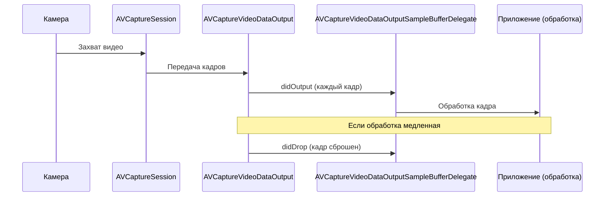

#avfoundation #delegate #video #samplebuffer #real-time #processing #camera #vision #core-image

---
## AVCaptureVideoDataOutputSampleBufferDelegate

### Определение
**AVCaptureVideoDataOutputSampleBufferDelegate** — это протокол во фреймворке [[AVFoundation]], который определяет методы для обработки видеокадров, захваченных с камеры устройства в реальном времени . Он является основным механизмом получения доступа к отдельным кадрам видеопотока через [[AVCaptureVideoDataOutput]].

Когда вы добавляете [[AVCaptureVideoDataOutput]] в сессию захвата ([[AVCaptureSession]]) и устанавливаете делегат, этот протокол позволяет вашему приложению получать каждый видеокадр (в виде `CMSampleBuffer`) по мере его захвата, открывая возможности для анализа, обработки, фильтрации или передачи видео .

### Зачем это знать [[iOS]]-разработчику?
1.  **Доступ к видеопотоку в реальном времени:** Получение каждого кадра для обработки, анализа или модификации .
2.  **Интеграция с Vision:** Передача кадров в фреймворк Vision для распознавания лиц, текста, объектов .
3.  **Применение фильтров Core Image:** Наложение эффектов, цветокоррекция, размытие на лету .
4.  **Машинное обучение:** Подача кадров в Core ML модели для классификации или детекции .
5.  **Создание кастомных кодеков:** Когда стандартной записи в файл недостаточно .
6.  **Мониторинг производительности:** Отслеживание сброшенных кадров для оптимизации обработки .

---

### Архитектура и место в системе захвата



### Ключевые методы протокола

Протокол содержит два основных метода:

#### 1. `captureOutput(_:didOutput:from:)`
**Назначение:** Вызывается каждый раз, когда захвачен новый видеокадр. Это основной метод для обработки видео в реальном времени .

```swift
func captureOutput(_ output: AVCaptureOutput, 
                   didOutput sampleBuffer: CMSampleBuffer, 
                   from connection: AVCaptureConnection)
```

**Параметры:**
- `output`: Ссылка на объект `AVCaptureVideoDataOutput`, который сгенерировал кадр.
- `sampleBuffer`: Объект `CMSampleBuffer`, содержащий видеоданные и метаданные.
- `connection`: Объект [[AVCaptureConnection]], представляющий соединение между выходом и устройством.

#### 2. `captureOutput(_:didDrop:from:)`
**Назначение:** Вызывается, когда видеокадр был сброшен (не обработан) из-за переполнения очереди или недостаточной производительности .

```swift
optional func captureOutput(_ output: AVCaptureOutput, 
                            didDrop sampleBuffer: CMSampleBuffer, 
                            from connection: AVCaptureConnection)
```

**Важность:** Этот метод критически важен для отладки производительности. Если он вызывается часто, значит ваша обработка не успевает за темпом поступления данных, и нужно оптимизировать код.

---

### Структура CMSampleBuffer (для видео)

`CMSampleBuffer` — это контейнер, содержащий:
1.  **Видеоданные:** Обычно в виде `CVPixelBuffer` (через `CMSampleBufferGetImageBuffer`).
2.  **Формат:** `CMVideoFormatDescription`, описывающий формат видео (разрешение, кодек и т.д.).
3.  **Временная информация:** Время захвата, длительность кадра.
4.  **Аттачи (Attachments):** Метаданные, такие как ориентация, стабилизация.

#### Извлечение ключевой информации из CMSampleBuffer

```swift
// Получение пиксельного буфера для обработки
guard let pixelBuffer = CMSampleBufferGetImageBuffer(sampleBuffer) else { return }

// Получение временной информации
let presentationTime = CMSampleBufferGetPresentationTimeStamp(sampleBuffer)
let duration = CMSampleBufferGetDuration(sampleBuffer)

// Получение информации о формате
if let formatDesc = CMSampleBufferGetFormatDescription(sampleBuffer) {
    let dimensions = CMVideoFormatDescriptionGetDimensions(formatDesc)
    print("Размер кадра: \(dimensions.width)x\(dimensions.height)")
}

// Получение метаданных (например, ориентация)
let attachments = CMSampleBufferGetSampleAttachmentsArray(sampleBuffer, createIfNecessary: true)
// ... работа с метаданными
```

---

### Примеры от простого к сложному

#### Уровень 0: Настройка Info.plist и базовой структуры
Для доступа к камере нужно добавить описание в `Info.plist`.

- **NSCameraUsageDescription** — "Для обработки видеокадров в реальном времени"

Базовая структура контроллера с проверкой разрешений:

```swift
import UIKit
import AVFoundation

class VideoDelegateBaseViewController: UIViewController {

    var captureSession: AVCaptureSession!
    var previewLayer: AVCaptureVideoPreviewLayer!
    let videoProcessingQueue = DispatchQueue(label: "videoProcessingQueue")

    override func viewDidLoad() {
        super.viewDidLoad()
        checkPermissionsAndSetup()
    }

    private func checkPermissionsAndSetup() {
        switch AVCaptureDevice.authorizationStatus(for: .video) {
        case .authorized:
            setupCamera()
        case .notDetermined:
            AVCaptureDevice.requestAccess(for: .video) { granted in
                if granted { DispatchQueue.main.async { self.setupCamera() } }
            }
        default:
            print("Нет доступа к камере")
        }
    }

    func setupCamera() {
        captureSession = AVCaptureSession()
        captureSession.sessionPreset = .hd1280x720

        guard let camera = AVCaptureDevice.default(.builtInWideAngleCamera, for: .video, position: .back),
              let input = try? AVCaptureDeviceInput(device: camera),
              captureSession.canAddInput(input) else { return }
        captureSession.addInput(input)

        // Будет переопределено в подклассах
        setupOutput()
    }

    func setupOutput() {
        // Переопределяется в подклассах
    }
}
```

#### Уровень 1: Базовая реализация делегата и получение кадров
Самый простой пример — логирование каждого кадра.

```swift
import UIKit
import AVFoundation

class BasicVideoDelegateViewController: VideoDelegateBaseViewController, 
                                        AVCaptureVideoDataOutputSampleBufferDelegate {

    override func setupOutput() {
        let videoOutput = AVCaptureVideoDataOutput()
        videoOutput.videoSettings = [kCVPixelBufferPixelFormatTypeKey as String: kCVPixelFormatType_32BGRA]
        videoOutput.setSampleBufferDelegate(self, queue: videoProcessingQueue)
        videoOutput.alwaysDiscardsLateVideoFrames = true

        if captureSession.canAddOutput(videoOutput) {
            captureSession.addOutput(videoOutput)
        }

        previewLayer = AVCaptureVideoPreviewLayer(session: captureSession)
        previewLayer.frame = view.bounds
        previewLayer.videoGravity = .resizeAspectFill
        view.layer.addSublayer(previewLayer)

        DispatchQueue.global(qos: .userInitiated).async { [weak self] in
            self?.captureSession.startRunning()
        }
    }

    // MARK: - AVCaptureVideoDataOutputSampleBufferDelegate
    func captureOutput(_ output: AVCaptureOutput, 
                       didOutput sampleBuffer: CMSampleBuffer, 
                       from connection: AVCaptureConnection) {
        
        // Этот метод вызывается для каждого видеокадра
        print("📹 Получен кадр в \(Date())")
        
        // Получаем пиксельный буфер
        guard let pixelBuffer = CMSampleBufferGetImageBuffer(sampleBuffer) else { return }
        
        let width = CVPixelBufferGetWidth(pixelBuffer)
        let height = CVPixelBufferGetHeight(pixelBuffer)
        print("  Размер: \(width)x\(height)")
        
        // Получаем временную метку
        let timestamp = CMSampleBufferGetPresentationTimeStamp(sampleBuffer)
        print("  Время: \(timestamp.seconds)")
    }
    
    func captureOutput(_ output: AVCaptureOutput, 
                       didDrop sampleBuffer: CMSampleBuffer, 
                       from connection: AVCaptureConnection) {
        print("⚠️ Кадр был сброшен! Не успеваем обрабатывать.")
    }
}
```

#### Уровень 2: Применение фильтров Core Image к видеопотоку
Наложение фильтра (например, сепия) на каждый кадр.

```swift
import UIKit
import AVFoundation
import CoreImage

class FilterVideoDelegateViewController: VideoDelegateBaseViewController, 
                                         AVCaptureVideoDataOutputSampleBufferDelegate {

    @IBOutlet weak var imageView: UIImageView!
    
    let ciContext = CIContext()

    override func setupOutput() {
        let videoOutput = AVCaptureVideoDataOutput()
        videoOutput.videoSettings = [kCVPixelBufferPixelFormatTypeKey as String: kCVPixelFormatType_32BGRA]
        videoOutput.setSampleBufferDelegate(self, queue: videoProcessingQueue)
        videoOutput.alwaysDiscardsLateVideoFrames = true

        if captureSession.canAddOutput(videoOutput) {
            captureSession.addOutput(videoOutput)
        }

        DispatchQueue.global(qos: .userInitiated).async { [weak self] in
            self?.captureSession.startRunning()
        }
    }

    func captureOutput(_ output: AVCaptureOutput, 
                       didOutput sampleBuffer: CMSampleBuffer, 
                       from connection: AVCaptureConnection) {
        
        // 1. Получаем пиксельный буфер
        guard let pixelBuffer = CMSampleBufferGetImageBuffer(sampleBuffer) else { return }
        
        // 2. Создаем CIImage
        let ciImage = CIImage(cvPixelBuffer: pixelBuffer)
        
        // 3. Применяем фильтр (сепия)
        guard let filter = CIFilter(name: "CISepiaTone") else { return }
        filter.setValue(ciImage, forKey: kCIInputImageKey)
        filter.setValue(0.8, forKey: kCIInputIntensityKey)
        
        guard let outputImage = filter.outputImage else { return }
        
        // 4. Создаем UIImage
        if let cgImage = ciContext.createCGImage(outputImage, from: outputImage.extent) {
            let uiImage = UIImage(cgImage: cgImage)
            
            // 5. Обновляем UI на главном потоке
            DispatchQueue.main.async {
                self.imageView.image = uiImage
            }
        }
    }
}
```

#### Уровень 3: Интеграция с Vision для детекции лиц
Обнаружение лиц с помощью Vision и отрисовка рамок.

```swift
import UIKit
import AVFoundation
import Vision

class VisionVideoDelegateViewController: VideoDelegateBaseViewController, 
                                         AVCaptureVideoDataOutputSampleBufferDelegate {

    // Запрос Vision для детекции лиц
    private lazy var faceDetectionRequest: VNDetectFaceRectanglesRequest = {
        let request = VNDetectFaceRectanglesRequest { [weak self] request, error in
            self?.handleFaceDetection(request: request, error: error)
        }
        return request
    }()
    
    // Слой для рисования рамок
    let overlayLayer = CALayer()

    override func setupOutput() {
        // Настройка overlay слоя
        overlayLayer.frame = view.bounds
        overlayLayer.contentsGravity = .resizeAspectFill
        view.layer.addSublayer(overlayLayer)

        let videoOutput = AVCaptureVideoDataOutput()
        videoOutput.videoSettings = [kCVPixelBufferPixelFormatTypeKey as String: kCVPixelFormatType_32BGRA]
        videoOutput.setSampleBufferDelegate(self, queue: videoProcessingQueue)
        videoOutput.alwaysDiscardsLateVideoFrames = true

        if captureSession.canAddOutput(videoOutput) {
            captureSession.addOutput(videoOutput)
        }

        previewLayer = AVCaptureVideoPreviewLayer(session: captureSession)
        previewLayer.frame = view.bounds
        previewLayer.videoGravity = .resizeAspectFill
        view.layer.insertSublayer(previewLayer, at: 0)

        DispatchQueue.global(qos: .userInitiated).async { [weak self] in
            self?.captureSession.startRunning()
        }
    }

    func captureOutput(_ output: AVCaptureOutput, 
                       didOutput sampleBuffer: CMSampleBuffer, 
                       from connection: AVCaptureConnection) {
        
        guard let pixelBuffer = CMSampleBufferGetImageBuffer(sampleBuffer) else { return }
        
        // Создаем запрос Vision
        let requestHandler = VNImageRequestHandler(cvPixelBuffer: pixelBuffer, options: [:])
        
        do {
            try requestHandler.perform([faceDetectionRequest])
        } catch {
            print("Ошибка Vision: \(error)")
        }
    }

    private func handleFaceDetection(request: VNRequest, error: Error?) {
        guard let observations = request.results as? [VNFaceObservation] else { return }
        
        DispatchQueue.main.async {
            // Очищаем предыдущие рамки
            self.overlayLayer.sublayers?.forEach { $0.removeFromSuperlayer() }
            
            // Рисуем новые рамки
            for observation in observations {
                let boundingBox = observation.boundingBox
                
                // Преобразуем координаты Vision в координаты слоя
                let rect = CGRect(
                    x: boundingBox.origin.x * self.view.bounds.width,
                    y: (1 - boundingBox.origin.y - boundingBox.height) * self.view.bounds.height,
                    width: boundingBox.width * self.view.bounds.width,
                    height: boundingBox.height * self.view.bounds.height
                )
                
                let shapeLayer = CAShapeLayer()
                shapeLayer.frame = rect
                shapeLayer.borderColor = UIColor.green.cgColor
                shapeLayer.borderWidth = 2
                shapeLayer.cornerRadius = 8
                
                self.overlayLayer.addSublayer(shapeLayer)
            }
        }
    }
}
```

#### Уровень 4: Синхронизация с Core Motion для стабилизации
Получение данных с гироскопа для каждого кадра (требуется Core Motion).

```swift
import UIKit
import AVFoundation
import CoreMotion

class MotionSyncVideoDelegateViewController: VideoDelegateBaseViewController, 
                                             AVCaptureVideoDataOutputSampleBufferDelegate {

    let motionManager = CMMotionManager()
    var latestMotionData: CMDeviceMotion?

    override func setupOutput() {
        // Запускаем получение данных с гироскопа
        if motionManager.isDeviceMotionAvailable {
            motionManager.deviceMotionUpdateInterval = 1.0 / 60.0 // 60 Hz
            motionManager.startDeviceMotionUpdates(to: .main) { [weak self] motion, error in
                self?.latestMotionData = motion
            }
        }

        let videoOutput = AVCaptureVideoDataOutput()
        videoOutput.videoSettings = [kCVPixelBufferPixelFormatTypeKey as String: kCVPixelFormatType_32BGRA]
        videoOutput.setSampleBufferDelegate(self, queue: videoProcessingQueue)
        videoOutput.alwaysDiscardsLateVideoFrames = true

        if captureSession.canAddOutput(videoOutput) {
            captureSession.addOutput(videoOutput)
        }

        DispatchQueue.global(qos: .userInitiated).async { [weak self] in
            self?.captureSession.startRunning()
        }
    }

    func captureOutput(_ output: AVCaptureOutput, 
                       didOutput sampleBuffer: CMSampleBuffer, 
                       from connection: AVCaptureConnection) {
        
        let timestamp = CMSampleBufferGetPresentationTimeStamp(sampleBuffer)
        
        // Синхронизируем с данными движения (приблизительно)
        if let motion = latestMotionData {
            print("Кадр в \(timestamp.seconds): attitude=\(motion.attitude)")
            // Используем motion данные для стабилизации или AR
        }
        
        // Обработка кадра...
    }
}
```

#### Уровень 5: Асинхронная обработка с [[async]]/[[await]]
Обертка для получения кадров в современном стиле.

```swift
import AVFoundation

class AsyncVideoDelegate: NSObject, AVCaptureVideoDataOutputSampleBufferDelegate {
    
    typealias FrameHandler = (CMSampleBuffer) -> Void
    var onFrame: FrameHandler?
    
    func captureOutput(_ output: AVCaptureOutput, 
                       didOutput sampleBuffer: CMSampleBuffer, 
                       from connection: AVCaptureConnection) {
        onFrame?(sampleBuffer)
    }
}

extension AVCaptureVideoDataOutput {
    func startStream() -> AsyncStream<CMSampleBuffer> {
        AsyncStream { continuation in
            let delegate = AsyncVideoDelegate()
            delegate.onFrame = { sampleBuffer in
                continuation.yield(sampleBuffer)
            }
            self.setSampleBufferDelegate(delegate, queue: DispatchQueue(label: "videoStream"))
            
            continuation.onTermination = { @Sendable _ in
                self.setSampleBufferDelegate(nil, queue: nil)
            }
        }
    }
}
```

#### Уровень 6: Обработка сброшенных кадров и мониторинг производительности
Детальный мониторинг и адаптация под нагрузку.

```swift
import AVFoundation

class PerformanceVideoDelegateViewController: VideoDelegateBaseViewController, 
                                              AVCaptureVideoDataOutputSampleBufferDelegate {

    var frameCount = 0
    var droppedFrameCount = 0
    var lastFrameTime = CFAbsoluteTimeGetCurrent()
    let fpsLabel = UILabel()

    override func viewDidLoad() {
        super.viewDidLoad()
        setupFPSLabel()
    }

    private func setupFPSLabel() {
        fpsLabel.frame = CGRect(x: 20, y: 100, width: 100, height: 30)
        fpsLabel.textColor = .white
        fpsLabel.backgroundColor = UIColor.black.withAlphaComponent(0.5)
        view.addSubview(fpsLabel)
    }

    func captureOutput(_ output: AVCaptureOutput, 
                       didOutput sampleBuffer: CMSampleBuffer, 
                       from connection: AVCaptureConnection) {
        
        frameCount += 1
        
        // Вычисляем FPS
        let currentTime = CFAbsoluteTimeGetCurrent()
        let elapsed = currentTime - lastFrameTime
        if elapsed >= 1.0 {
            let fps = Double(frameCount) / elapsed
            DispatchQueue.main.async {
                self.fpsLabel.text = String(format: "FPS: %.1f\nDropped: %d", fps, self.droppedFrameCount)
            }
            frameCount = 0
            lastFrameTime = currentTime
        }
        
        // Здесь ваша обработка кадра
    }

    func captureOutput(_ output: AVCaptureOutput, 
                       didDrop sampleBuffer: CMSampleBuffer, 
                       from connection: AVCaptureConnection) {
        
        droppedFrameCount += 1
        
        // Анализируем причину сброса
        if let attachments = CMSampleBufferGetSampleAttachmentsArray(sampleBuffer, createIfNecessary: false) {
            // Можно получить дополнительную информацию
        }
        
        // Если сбросов слишком много, уменьшаем нагрузку
        let dropRate = Double(droppedFrameCount) / Double(frameCount + droppedFrameCount)
        if dropRate > 0.1 {
            DispatchQueue.main.async {
                self.fpsLabel.textColor = .red
            }
        }
    }
}
```

#### Уровень 7: Сохранение выборочных кадров (фото из видео)
Сохранение каждого 30-го кадра как фото.

```swift
import AVFoundation
import UIKit

class PhotoFromVideoDelegateViewController: VideoDelegateBaseViewController, 
                                            AVCaptureVideoDataOutputSampleBufferDelegate {

    var frameCounter = 0
    let targetFrameInterval = 30 // Сохраняем каждый 30-й кадр

    func captureOutput(_ output: AVCaptureOutput, 
                       didOutput sampleBuffer: CMSampleBuffer, 
                       from connection: AVCaptureConnection) {
        
        frameCounter += 1
        
        // Сохраняем только каждый targetFrameInterval кадр
        guard frameCounter % targetFrameInterval == 0 else { return }
        
        guard let pixelBuffer = CMSampleBufferGetImageBuffer(sampleBuffer) else { return }
        
        // Конвертируем в UIImage и сохраняем
        let ciImage = CIImage(cvPixelBuffer: pixelBuffer)
        let context = CIContext()
        
        if let cgImage = context.createCGImage(ciImage, from: ciImage.extent) {
            let image = UIImage(cgImage: cgImage)
            
            // Сохраняем в фотоальбом (асинхронно)
            UIImageWriteToSavedPhotosAlbum(image, nil, nil, nil)
            
            print("📸 Кадр сохранен: \(frameCounter)")
        }
    }
}
```

---

### Важные нюансы и Best Practices

#### 1. **Очередь делегата**
Всегда используйте последовательную (не concurrent) очередь для делегата. Это гарантирует, что кадры будут обрабатываться в правильном порядке .

```swift
let queue = DispatchQueue(label: "videoQueue") // Последовательная очередь
videoOutput.setSampleBufferDelegate(self, queue: queue)
```

#### 2. **Производительность критически важна**
Метод делегата вызывается **до 60-120 раз в секунду**. Все вычисления должны быть быстрыми:
- Используйте **Accelerate framework** для математики
- Для тяжелых операций (запись на диск, отправка по сети) используйте отдельные очереди
- Рассмотрите возможность пропуска кадров, если обработка слишком тяжелая

#### 3. **Всегда обрабатывайте didDrop**
Метод `captureOutput(_:didDrop:from:)` — ваш друг для отладки производительности. Если он вызывается часто, нужно:
- Упростить обработку
- Уменьшить разрешение или частоту кадров
- Использовать более быстрые алгоритмы

#### 4. **Управление памятью**
`CMSampleBuffer` содержит большие объемы данных. Освобождайте их как можно скорее. Избегайте хранения буферов в свойствах класса, если это не необходимо.

#### 5. **Ориентация видео**
Не забывайте настраивать ориентацию через `connection.videoOrientation`, если это важно для вашего приложения.

```swift
if let connection = videoOutput.connection(with: .video) {
    connection.videoOrientation = .portrait
}
```

#### 6. **Форматы пикселей**
Выбирайте правильный формат пикселей для ваших задач. Наиболее распространенный — `kCVPixelFormatType_32BGRA`.

```swift
// Проверка доступных форматов
let availableFormats = videoOutput.availableVideoCVPixelFormatTypes
```

#### 7. **Синхронизация с UI**
Метод делегата вызывается на фоновой очереди. Все обновления UI должны выполняться на главном потоке через `DispatchQueue.main.async`.

### Итог
**AVCaptureVideoDataOutputSampleBufferDelegate** — это ключевой протокол для доступа к видеопотоку в реальном времени. Он обеспечивает:

1.  **Покадровый доступ** к видео с камеры
2.  **Возможность обработки** каждого кадра в реальном времени
3.  **Интеграцию** с Core Image, Vision, Core ML
4.  **Мониторинг производительности** через отслеживание сброшенных кадров
5.  **Гибкость** для создания сложных видеоприложений

Правильное использование этого делегата необходимо для создания приложений с компьютерным зрением, дополненной реальностью, видео-фильтрами и другими задачами реального времени.