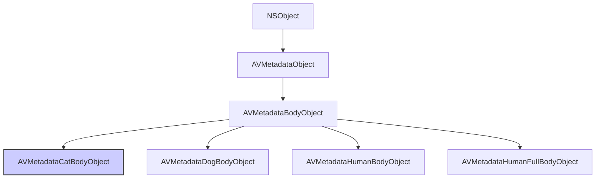

#avfoundation #metadata #cat-body #vision #avcapturemetadataoutput #object-detection #ios13

---

## AVMetadataCatBodyObject

### Определение
**AVMetadataCatBodyObject** — это конкретный подкласс [[AVMetadataBodyObject]] (который сам является подклассом [[AVMetadataObject]]) во фреймворке AVFoundation. Он представляет собой одно обнаруженное тело кошки в видеопотоке или изображении .

Этот класс является частью системы обнаружения объектов в [[AVFoundation]] и позволяет детектировать тела кошек в реальном времени без использования фреймворка Vision. Вместе с классами для обнаружения тел людей ([[AVMetadataHumanBodyObject]]), собак ([[AVMetadataDogBodyObject]]) и голов кошек/собак, он обеспечивает базовую функциональность машинного зрения на уровне системы захвата.

### Доступность платформ
- **iOS**: 13.0+ 
- **iPadOS**: 13.0+
- **macOS**: 10.15+
- **Mac Catalyst**: 14.0+
- **tvOS**: 17.0+
- **watchOS**: Недоступен 

### Зачем это знать iOS-разработчику?
1.  **Обнаружение животных:** Позволяет создавать приложения, которые могут обнаруживать кошек в кадре без сложной настройки Vision.
2.  **Интеграция с [[AVCaptureMetadataOutput]]:** Простое добавление типа `.catBody` в `metadataObjectTypes` для получения обнаруженных объектов.
3.  **Фильтрация и группировка:** Использование свойств `groupID` и `bodyID` для отслеживания нескольких животных в кадре.
4.  **Создание забавных приложений:** Идеально подходит для приложений с фильтрами для домашних животных, фото-ловушек или систем наблюдения.
5.  **Комбинирование с другими детекторами:** Можно одновременно обнаруживать людей, собак и кошек, используя разные типы метаданных.

---

### Иерархия наследования



### Ключевые свойства и методы

Будучи подклассом `AVMetadataBodyObject`, объект `AVMetadataCatBodyObject` наследует все свойства от `AVMetadataObject` и добавляет специфичные для тела свойства.

#### Свойства из AVMetadataObject
- `time` (`CMTime`) — время захвата данного метаданного объекта .
- `duration` (`CMTime`) — длительность объекта метаданных .
- `bounds` (`CGRect`) — ограничивающий прямоугольник объекта с координатами, нормализованными от 0.0 до 1.0 (верхний левый угол - начало координат) .
- `type` (`AVMetadataObjectType`) — тип объекта. Для тела кошки это значение будет `AVMetadataObjectTypeCatBody` .
- `objectID` (`NSInteger`) — уникальный идентификатор для каждого обнаруженного объекта. Когда новый объект появляется в кадре, ему присваивается новый уникальный ID. ID не переиспользуются, даже если объект покинул кадр и вернулся .
- `groupID` (`NSInteger`) — идентификатор, используемый для группировки объектов, принадлежащих одному родительскому объекту. Например, тело и голова одной кошки будут иметь одинаковый `groupID` .

#### Свойства из AVMetadataBodyObject
- `bodyID` (`NSInteger`) — уникальный номер, связанный с конкретным телом в кадре. Когда новое тело появляется, ему присваивается новый уникальный идентификатор. `bodyID` не переиспользуются .

---

### Примеры использования

#### Уровень 1: Базовая настройка детекции тел кошек
Простой пример настройки `AVCaptureMetadataOutput` для обнаружения кошек.

```swift
import UIKit
import AVFoundation

class CatBodyDetectionViewController: UIViewController, AVCaptureMetadataOutputObjectsDelegate {

    var captureSession: AVCaptureSession!
    var previewLayer: AVCaptureVideoPreviewLayer!
    
    override func viewDidLoad() {
        super.viewDidLoad()
        checkPermissionsAndSetup()
    }
    
    private func checkPermissionsAndSetup() {
        switch AVCaptureDevice.authorizationStatus(for: .video) {
        case .authorized:
            setupCamera()
        case .notDetermined:
            AVCaptureDevice.requestAccess(for: .video) { granted in
                if granted { DispatchQueue.main.async { self.setupCamera() } }
            }
        default:
            print("Нет доступа к камере")
        }
    }
    
    private func setupCamera() {
        captureSession = AVCaptureSession()
        captureSession.sessionPreset = .hd1920x1080
        
        guard let camera = AVCaptureDevice.default(.builtInWideAngleCamera, for: .video, position: .back),
              let input = try? AVCaptureDeviceInput(device: camera),
              captureSession.canAddInput(input) else { return }
        captureSession.addInput(input)
        
        // 1. Создаем и настраиваем MetadataOutput
        let metadataOutput = AVCaptureMetadataOutput()
        
        if captureSession.canAddOutput(metadataOutput) {
            captureSession.addOutput(metadataOutput)
            
            // 2. Устанавливаем делегат и очередь
            metadataOutput.setMetadataObjectsDelegate(self, queue: DispatchQueue.main)
            
            // 3. Проверяем доступность и добавляем тип .catBody
            if metadataOutput.availableMetadataObjectTypes.contains(.catBody) {
                metadataOutput.metadataObjectTypes = [.catBody]
                print("✅ Детекция тел кошек поддерживается")
            } else {
                print("❌ Детекция тел кошек не поддерживается на этом устройстве")
            }
        }
        
        previewLayer = AVCaptureVideoPreviewLayer(session: captureSession)
        previewLayer.frame = view.bounds
        previewLayer.videoGravity = .resizeAspectFill
        view.layer.addSublayer(previewLayer)
        
        DispatchQueue.global(qos: .userInitiated).async { [weak self] in
            self?.captureSession.startRunning()
        }
    }
    
    // MARK: - AVCaptureMetadataOutputObjectsDelegate
    func metadataOutput(_ output: AVCaptureMetadataOutput, 
                        didOutput metadataObjects: [AVMetadataObject], 
                        from connection: AVCaptureConnection) {
        
        for metadataObject in metadataObjects {
            // 4. Проверяем, является ли объект телом кошки
            guard let catBodyObject = metadataObject as? AVMetadataCatBodyObject else { continue }
            
            // 5. Преобразуем координаты из системы камеры в координаты previewLayer
            let transformedObject = previewLayer.transformedMetadataObject(for: catBodyObject) as? AVMetadataCatBodyObject
            
            if let catBody = transformedObject {
                print("🐱 Обнаружено тело кошки!")
                print("  Bounds: \(catBody.bounds)")
                print("  Body ID: \(catBody.bodyID)")
                print("  Object ID: \(catBody.objectID)")
            }
        }
    }
}
```

#### Уровень 2: Отрисовка рамок вокруг обнаруженных кошек
Расширение предыдущего примера с визуальной обратной связью.

```swift
import UIKit
import AVFoundation

class CatBodyWithOverlayViewController: CatBodyDetectionViewController {
    
    // Словарь для хранения слоев по bodyID
    var overlayLayers: [Int: CAShapeLayer] = [:]
    
    override func metadataOutput(_ output: AVCaptureMetadataOutput, 
                                  didOutput metadataObjects: [AVMetadataObject], 
                                  from connection: AVCaptureConnection) {
        
        var currentBodyIDs = Set<Int>()
        
        for metadataObject in metadataObjects {
            guard let catBodyObject = metadataObject as? AVMetadataCatBodyObject,
                  let transformedObject = previewLayer.transformedMetadataObject(for: catBodyObject) as? AVMetadataCatBodyObject else { continue }
            
            let bodyID = transformedObject.bodyID
            currentBodyIDs.insert(bodyID)
            
            // Обновляем или создаем слой для этого тела
            updateOverlay(for: transformedObject, bodyID: bodyID)
        }
        
        // Удаляем слои для тел, которые больше не в кадре
        for bodyID in overlayLayers.keys {
            if !currentBodyIDs.contains(bodyID) {
                overlayLayers[bodyID]?.removeFromSuperlayer()
                overlayLayers.removeValue(forKey: bodyID)
            }
        }
    }
    
    private func updateOverlay(for catBody: AVMetadataCatBodyObject, bodyID: Int) {
        let layer: CAShapeLayer
        
        if let existingLayer = overlayLayers[bodyID] {
            layer = existingLayer
        } else {
            layer = CAShapeLayer()
            layer.strokeColor = UIColor.orange.cgColor
            layer.lineWidth = 3
            layer.fillColor = UIColor.clear.cgColor
            previewLayer?.addSublayer(layer)
            overlayLayers[bodyID] = layer
            
            // Добавляем метку с ID кота (опционально)
            let textLayer = CATextLayer()
            textLayer.string = "🐱 Кот #\(bodyID)"
            textLayer.foregroundColor = UIColor.white.cgColor
            textLayer.fontSize = 14
            textLayer.backgroundColor = UIColor.orange.withAlphaComponent(0.7).cgColor
            textLayer.frame = CGRect(x: catBody.bounds.minX, 
                                    y: catBody.bounds.minY - 20, 
                                    width: 100, 
                                    height: 20)
            textLayer.cornerRadius = 5
            layer.addSublayer(textLayer)
        }
        
        // Обновляем рамку
        layer.path = UIBezierPath(rect: catBody.bounds).cgPath
    }
}
```

#### Уровень 3: Группировка тела и головы кошки
Использование `groupID` для связывания различных частей одного животного.

```swift
import AVFoundation

func processCatBodyAndHead(metadataObjects: [AVMetadataObject]) {
    // Словарь для группировки объектов по groupID
    var groupedObjects: [Int: [AVMetadataObject]] = [:]
    
    for object in metadataObjects {
        if let bodyObject = object as? AVMetadataCatBodyObject {
            let groupID = bodyObject.groupID
            if groupID >= 0 {
                groupedObjects[groupID, default: []].append(bodyObject)
            }
        } else if let headObject = object as? AVMetadataCatHeadObject {
            let groupID = headObject.groupID
            if groupID >= 0 {
                groupedObjects[groupID, default: []].append(headObject)
            }
        }
    }
    
    // Обрабатываем каждую группу (одного кота)
    for (groupID, objects) in groupedObjects {
        print("Группа \(groupID) содержит \(objects.count) объектов:")
        
        for object in objects {
            if object is AVMetadataCatBodyObject {
                print("  - Тело кота")
            } else if object is AVMetadataCatHeadObject {
                print("  - Голова кота")
            }
        }
    }
}
```

#### Уровень 4: Фильтрация по времени и размеру
Игнорирование мелких или кратковременных обнаружений.

```swift
import AVFoundation

class FilteredCatDetectionViewController: CatBodyDetectionViewController {
    
    let minimumArea: CGFloat = 0.05 // Минимальная площадь 5% от кадра
    var detectionTimes: [Int: CMTime] = [:] // Время первого обнаружения для каждого bodyID
    
    override func metadataOutput(_ output: AVCaptureMetadataOutput, 
                                  didOutput metadataObjects: [AVMetadataObject], 
                                  from connection: AVCaptureConnection) {
        
        for metadataObject in metadataObjects {
            guard let catBodyObject = metadataObject as? AVMetadataCatBodyObject,
                  let transformedObject = previewLayer.transformedMetadataObject(for: catBodyObject) as? AVMetadataCatBodyObject else { continue }
            
            // 1. Фильтр по размеру (игнорируем слишком маленькие объекты)
            let area = transformedObject.bounds.width * transformedObject.bounds.height
            guard area >= minimumArea else {
                print("Объект слишком маленький, игнорируем")
                continue
            }
            
            let bodyID = transformedObject.bodyID
            
            // 2. Фильтр по времени (обнаружение должно длиться не менее 0.5 секунды)
            if let firstTime = detectionTimes[bodyID] {
                let duration = CMTimeSubtract(transformedObject.time, firstTime)
                if duration.seconds >= 0.5 {
                    print("✅ Кот подтвержден (виден более 0.5 сек)")
                    processConfirmedCat(transformedObject)
                }
            } else {
                // Первое обнаружение
                detectionTimes[bodyID] = transformedObject.time
                print("⏳ Новое потенциальное обнаружение кота #\(bodyID)")
            }
        }
        
        // Очистка старых записей (упрощенно - можно добавить таймер для очистки)
    }
    
    private func processConfirmedCat(_ catBody: AVMetadataCatBodyObject) {
        // Здесь можно вызывать звук, сохранять фото и т.д.
        print("🐱 Кот #\(catBody.bodyID) обнаружен в позиции \(catBody.bounds)")
    }
}
```

---

### Сравнение с другими типами тел

| Класс | Тип (для metadataObjectTypes) | Описание | Доступность |
|-------|-------------------------------|----------|-------------|
| **AVMetadataCatBodyObject** | `.catBody` | Тело кошки | iOS 13.0+ |
| AVMetadataDogBodyObject | `.dogBody` | Тело собаки | iOS 13.0+  |
| AVMetadataHumanBodyObject | `.humanBody` | Тело человека | iOS 13.0+ |
| AVMetadataHumanFullBodyObject | `.humanFullBody` | Полное тело человека | iOS 13.0+ |
| AVMetadataCatHeadObject | `.catHead` | Голова кошки | iOS 13.0+  |
| AVMetadataDogHeadObject | `.dogHead` | Голова собаки | iOS 13.0+  |

### Важные нюансы и Best Practices

#### 1. **Проверка доступности**
Не все устройства поддерживают детекцию тел животных. Всегда проверяйте наличие типа в `availableMetadataObjectTypes` .

```swift
if metadataOutput.availableMetadataObjectTypes.contains(.catBody) {
    metadataOutput.metadataObjectTypes = [.catBody]
}
```

#### 2. **Координаты и преобразование**
Как и с другими метаданными, координаты `bounds` возвращаются в системе координат камеры. Всегда используйте `transformedMetadataObject(for:)` для преобразования в координаты `previewLayer` .

#### 3. **Производительность**
Детекция тел животных может потреблять значительные ресурсы. Используйте ограниченный набор типов метаданных и, при необходимости, уменьшите частоту кадров сессии.

#### 4. **Уникальные идентификаторы**
`bodyID` уникален для каждого тела в кадре и не переиспользуется. Это удобно для отслеживания конкретного кота во времени .

#### 5. **Группировка**
Используйте `groupID` для связывания тела и головы одного животного. Это особенно полезно, если вы детектируете оба типа .

#### 6. **Обработка ошибок**
В Xamarin/iOS были проблемы с маппингом новых типов метаданных в ранних версиях iOS 13. При использовании кросс-платформенных решений проверяйте совместимость .

### Итог
**AVMetadataCatBodyObject** — это специализированный класс для обнаружения тел кошек в видеопотоке. Он предоставляет:

- **Простой API** для детекции без использования Vision
- **Уникальные идентификаторы** для отслеживания животных
- **Возможность группировки** с другими объектами (например, голова кота)
- **Интеграцию** с `AVCaptureMetadataOutput` для работы в реальном времени

Этот класс идеально подходит для приложений, которым необходимо обнаруживать кошек в кадре без сложной настройки машинного обучения.