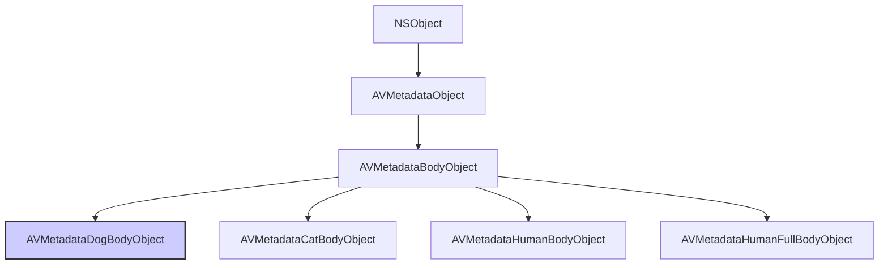

#avfoundation #metadata #dog-body #vision #avcapturemetadataoutput #object-detection #ios13 #pet-detection

---
## AVMetadataDogBodyObject

### Определение
**AVMetadataDogBodyObject** — это конкретный подкласс [[AVMetadataBodyObject]] (который сам является подклассом [[AVMetadataObject]]) во фреймворке AVFoundation. Он представляет собой одно обнаруженное тело собаки в видеопотоке или изображении .

Этот класс является частью системы обнаружения объектов в [[AVFoundation]], представленной в iOS 13, и позволяет детектировать тела собак в реальном времени без использования фреймворка Vision. Вместе с классами для обнаружения тел людей ([[AVMetadataHumanBodyObject]]), кошек ([[AVMetadataCatBodyObject]]) и голов животных, он обеспечивает базовую функциональность машинного зрения на уровне системы захвата.

### Доступность платформ
- **iOS**: 13.0+
- **iPadOS**: 13.0+
- **macOS**: 10.15+
- **Mac Catalyst**: 14.0+
- **tvOS**: 17.0+
- **watchOS**: Недоступен
- **Vision framework**: Да (для более продвинутой обработки)

### Зачем это знать iOS-разработчику?
1.  **Обнаружение животных:** Позволяет создавать приложения, которые могут обнаруживать собак в кадре без сложной настройки Vision.
2.  **Интеграция с AVCaptureMetadataOutput:** Простое добавление типа `.dogBody` в `metadataObjectTypes` для получения обнаруженных объектов.
3.  **Фильтрация и группировка:** Использование свойств `groupID` и `bodyID` для отслеживания нескольких животных в кадре.
4.  **Создание забавных приложений:** Идеально подходит для приложений с фильтрами для домашних животных, фото-ловушек или систем наблюдения.
5.  **Комбинирование с другими детекторами:** Можно одновременно обнаруживать людей, кошек и собак, используя разные типы метаданных.
6.  **Дополнение к Vision:** Для более точной детекции или получения дополнительной информации (например, порода собаки) можно комбинировать с Core ML и Vision.

---

### Иерархия наследования



### Ключевые свойства

Будучи подклассом `AVMetadataBodyObject`, объект `AVMetadataDogBodyObject` наследует все свойства от `AVMetadataObject` и добавляет специфичные для тела свойства.

#### Свойства из AVMetadataObject
- `time` (`CMTime`) — время захвата данного метаданного объекта .
- `duration` (`CMTime`) — длительность объекта метаданных .
- `bounds` (`CGRect`) — ограничивающий прямоугольник объекта с координатами, нормализованными от 0.0 до 1.0 (верхний левый угол - начало координат) .
- `type` (`AVMetadataObjectType`) — тип объекта. Для тела собаки это значение будет `AVMetadataObjectTypeDogBody` .
- `objectID` (`NSInteger`) — уникальный идентификатор для каждого обнаруженного объекта. Когда новый объект появляется в кадре, ему присваивается новый уникальный ID. ID не переиспользуются, даже если объект покинул кадр и вернулся .

#### Свойства из AVMetadataBodyObject
- `bodyID` (`NSInteger`) — уникальный номер, связанный с конкретным телом в кадре. Когда новое тело появляется, ему присваивается новый уникальный идентификатор. `bodyID` не переиспользуются .
- `groupID` (`NSInteger`) — идентификатор, используемый для группировки объектов, принадлежащих одному родительскому объекту. Например, тело и голова одной собаки будут иметь одинаковый `groupID` .

---

### Примеры использования

#### Уровень 1: Базовая настройка детекции тел собак
Простой пример настройки `AVCaptureMetadataOutput` для обнаружения собак.

```swift
import UIKit
import AVFoundation

class DogBodyDetectionViewController: UIViewController, AVCaptureMetadataOutputObjectsDelegate {

    var captureSession: AVCaptureSession!
    var previewLayer: AVCaptureVideoPreviewLayer!
    var dogCountLabel: UILabel!
    
    override func viewDidLoad() {
        super.viewDidLoad()
        setupUI()
        checkPermissionsAndSetup()
    }
    
    private func setupUI() {
        dogCountLabel = UILabel(frame: CGRect(x: 20, y: 100, width: 200, height: 40))
        dogCountLabel.textColor = .white
        dogCountLabel.backgroundColor = UIColor.black.withAlphaComponent(0.5)
        dogCountLabel.textAlignment = .center
        dogCountLabel.font = UIFont.boldSystemFont(ofSize: 18)
        dogCountLabel.text = "Собак: 0"
        view.addSubview(dogCountLabel)
    }
    
    private func checkPermissionsAndSetup() {
        switch AVCaptureDevice.authorizationStatus(for: .video) {
        case .authorized:
            setupCamera()
        case .notDetermined:
            AVCaptureDevice.requestAccess(for: .video) { granted in
                if granted { DispatchQueue.main.async { self.setupCamera() } }
            }
        default:
            print("Нет доступа к камере")
        }
    }
    
    private func setupCamera() {
        captureSession = AVCaptureSession()
        captureSession.sessionPreset = .hd1920x1080
        
        guard let camera = AVCaptureDevice.default(.builtInWideAngleCamera, for: .video, position: .back),
              let input = try? AVCaptureDeviceInput(device: camera),
              captureSession.canAddInput(input) else { return }
        captureSession.addInput(input)
        
        // 1. Создаем и настраиваем MetadataOutput
        let metadataOutput = AVCaptureMetadataOutput()
        
        if captureSession.canAddOutput(metadataOutput) {
            captureSession.addOutput(metadataOutput)
            
            // 2. Устанавливаем делегат на главную очередь (для обновления UI)
            metadataOutput.setMetadataObjectsDelegate(self, queue: DispatchQueue.main)
            
            // 3. Проверяем доступность и добавляем типы
            var objectTypes: [AVMetadataObject.ObjectType] = []
            
            if metadataOutput.availableMetadataObjectTypes.contains(.dogBody) {
                objectTypes.append(.dogBody)
                print("✅ Детекция тел собак поддерживается")
            }
            if metadataOutput.availableMetadataObjectTypes.contains(.catBody) {
                objectTypes.append(.catBody)
                print("✅ Детекция тел кошек поддерживается")
            }
            
            metadataOutput.metadataObjectTypes = objectTypes
        }
        
        previewLayer = AVCaptureVideoPreviewLayer(session: captureSession)
        previewLayer.frame = view.bounds
        previewLayer.videoGravity = .resizeAspectFill
        view.layer.insertSublayer(previewLayer, at: 0)
        
        DispatchQueue.global(qos: .userInitiated).async { [weak self] in
            self?.captureSession.startRunning()
        }
    }
    
    // MARK: - AVCaptureMetadataOutputObjectsDelegate
    func metadataOutput(_ output: AVCaptureMetadataOutput, 
                        didOutput metadataObjects: [AVMetadataObject], 
                        from connection: AVCaptureConnection) {
        
        var dogCount = 0
        var catCount = 0
        
        for metadataObject in metadataObjects {
            if let transformedObject = previewLayer.transformedMetadataObject(for: metadataObject) {
                
                // 4. Проверяем тип объекта
                if let dogBodyObject = transformedObject as? AVMetadataDogBodyObject {
                    dogCount += 1
                    print("🐕 Обнаружена собака!")
                    print("  Body ID: \(dogBodyObject.bodyID)")
                    print("  Group ID: \(dogBodyObject.groupID)")
                    print("  Bounds: \(dogBodyObject.bounds)")
                } else if let catBodyObject = transformedObject as? AVMetadataCatBodyObject {
                    catCount += 1
                    print("🐱 Обнаружена кошка!")
                }
            }
        }
        
        // Обновляем UI
        dogCountLabel.text = "Собак: \(dogCount), Кошек: \(catCount)"
    }
}
```

#### Уровень 2: Отрисовка рамок вокруг обнаруженных собак
Расширение предыдущего примера с визуальной обратной связью.

```swift
import UIKit
import AVFoundation

class DogBodyWithOverlayViewController: DogBodyDetectionViewController {
    
    // Словарь для хранения слоев по bodyID
    var overlayLayers: [Int: (frameLayer: CAShapeLayer, labelLayer: CATextLayer)] = [:]
    
    override func metadataOutput(_ output: AVCaptureMetadataOutput, 
                                  didOutput metadataObjects: [AVMetadataObject], 
                                  from connection: AVCaptureConnection) {
        
        super.metadataOutput(output, didOutput: metadataObjects, from: connection)
        
        var currentDogBodyIDs = Set<Int>()
        
        for metadataObject in metadataObjects {
            guard let dogBodyObject = metadataObject as? AVMetadataDogBodyObject,
                  let transformedObject = previewLayer.transformedMetadataObject(for: dogBodyObject) as? AVMetadataDogBodyObject else { continue }
            
            let bodyID = transformedObject.bodyID
            currentDogBodyIDs.insert(bodyID)
            
            // Обновляем или создаем слой для этого тела
            updateOverlay(for: transformedObject, bodyID: bodyID)
        }
        
        // Удаляем слои для тел, которые больше не в кадре
        for bodyID in overlayLayers.keys {
            if !currentDogBodyIDs.contains(bodyID) {
                overlayLayers[bodyID]?.frameLayer.removeFromSuperlayer()
                overlayLayers[bodyID]?.labelLayer.removeFromSuperlayer()
                overlayLayers.removeValue(forKey: bodyID)
            }
        }
    }
    
    private func updateOverlay(for dogBody: AVMetadataDogBodyObject, bodyID: Int) {
        let frameLayer: CAShapeLayer
        let labelLayer: CATextLayer
        
        if let existing = overlayLayers[bodyID] {
            frameLayer = existing.frameLayer
            labelLayer = existing.labelLayer
        } else {
            // Создаем слой для рамки
            frameLayer = CAShapeLayer()
            frameLayer.strokeColor = UIColor.systemBlue.cgColor
            frameLayer.lineWidth = 3
            frameLayer.fillColor = UIColor.clear.cgColor
            previewLayer?.addSublayer(frameLayer)
            
            // Создаем слой для текста
            labelLayer = CATextLayer()
            labelLayer.fontSize = 14
            labelLayer.foregroundColor = UIColor.white.cgColor
            labelLayer.backgroundColor = UIColor.systemBlue.withAlphaComponent(0.7).cgColor
            labelLayer.alignmentMode = .center
            labelLayer.cornerRadius = 5
            labelLayer.string = "🐕 Собака #\(bodyID)"
            previewLayer?.addSublayer(labelLayer)
            
            overlayLayers[bodyID] = (frameLayer: frameLayer, labelLayer: labelLayer)
        }
        
        // Обновляем рамку
        frameLayer.path = UIBezierPath(rect: dogBody.bounds).cgPath
        
        // Обновляем позицию текста (над рамкой)
        let labelWidth: CGFloat = 100
        let labelHeight: CGFloat = 25
        let labelX = dogBody.bounds.midX - labelWidth / 2
        let labelY = dogBody.bounds.minY - labelHeight - 5
        labelLayer.frame = CGRect(x: labelX, y: labelY, width: labelWidth, height: labelHeight)
    }
}
```

#### Уровень 3: Группировка тела и головы собаки
Использование `groupID` для связывания различных частей одного животного.

```swift
import AVFoundation

class DogPartsViewController: DogBodyDetectionViewController {
    
    override func metadataOutput(_ output: AVCaptureMetadataOutput, 
                                  didOutput metadataObjects: [AVMetadataObject], 
                                  from connection: AVCaptureConnection) {
        
        // Словарь для группировки объектов по groupID
        var groupedDogs: [Int: (body: AVMetadataDogBodyObject?, head: AVMetadataDogHeadObject?)] = [:]
        
        for metadataObject in metadataObjects {
            if let transformedObject = previewLayer.transformedMetadataObject(for: metadataObject) {
                
                if let dogBody = transformedObject as? AVMetadataDogBodyObject {
                    let groupID = dogBody.groupID
                    if groupID >= 0 {
                        groupedDogs[groupID, default: (nil, nil)].body = dogBody
                    }
                } else if let dogHead = transformedObject as? AVMetadataDogHeadObject {
                    let groupID = dogHead.groupID
                    if groupID >= 0 {
                        groupedDogs[groupID, default: (nil, nil)].head = dogHead
                    }
                }
            }
        }
        
        // Обрабатываем каждую собаку
        for (groupID, parts) in groupedDogs {
            print("Собака в группе \(groupID):")
            
            if let body = parts.body {
                let area = body.bounds.width * body.bounds.height
                print("  - Тело: позиция \(body.bounds), размер \(area)")
            }
            
            if let head = parts.head {
                print("  - Голова: позиция \(head.bounds)")
            }
            
            if parts.body != nil && parts.head != nil {
                print("  ✅ Полное обнаружение собаки")
            }
        }
    }
}
```

#### Уровень 4: Комбинирование с Vision для более точной детекции
Использование Vision для получения дополнительной информации (например, контуров тела).

```swift
import UIKit
import AVFoundation
import Vision

class VisionDogDetectionViewController: DogBodyDetectionViewController {
    
    override func metadataOutput(_ output: AVCaptureMetadataOutput, 
                                  didOutput metadataObjects: [AVMetadataObject], 
                                  from connection: AVCaptureConnection) {
        
        for metadataObject in metadataObjects {
            guard let dogBodyObject = metadataObject as? AVMetadataDogBodyObject,
                  let transformedObject = previewLayer.transformedMetadataObject(for: dogBodyObject) as? AVMetadataDogBodyObject else { continue }
            
            print("🐕 Собака обнаружена через AVFoundation: #\(transformedObject.bodyID)")
            
            // Здесь можно передать область в Vision для более детального анализа
            // Например, для получения контура тела или определения породы
            performVisionAnalysis(for: transformedObject.bounds)
        }
    }
    
    private func performVisionAnalysis(for rect: CGRect) {
        // Конвертируем rect из координат слоя в координаты изображения
        // и выполняем запрос Vision для детального анализа
    }
}
```

#### Уровень 5: Фильтрация по размеру и сохранение фото
Сохранение фото, когда собака достаточно крупная в кадре.

```swift
import UIKit
import AVFoundation
import Photos

class DogPhotoCaptureViewController: DogBodyDetectionViewController {
    
    let minimumArea: CGFloat = 0.2 // Собака занимает минимум 20% кадра
    var lastCaptureTime: TimeInterval = 0
    let captureCooldown: TimeInterval = 5 // Не чаще раза в 5 секунд
    
    override func metadataOutput(_ output: AVCaptureMetadataOutput, 
                                  didOutput metadataObjects: [AVMetadataObject], 
                                  from connection: AVCaptureConnection) {
        
        var largestDog: AVMetadataDogBodyObject?
        var maxArea: CGFloat = 0
        
        for metadataObject in metadataObjects {
            guard let dogBodyObject = metadataObject as? AVMetadataDogBodyObject,
                  let transformedObject = previewLayer.transformedMetadataObject(for: dogBodyObject) as? AVMetadataDogBodyObject else { continue }
            
            let area = transformedObject.bounds.width * transformedObject.bounds.height
            if area > maxArea {
                maxArea = area
                largestDog = transformedObject
            }
        }
        
        if let dog = largestDog, maxArea >= minimumArea {
            let currentTime = Date().timeIntervalSince1970
            if currentTime - lastCaptureTime > captureCooldown {
                lastCaptureTime = currentTime
                capturePhotoOfDog(dog)
            }
        }
    }
    
    private func capturePhotoOfDog(_ dog: AVMetadataDogBodyObject) {
        print("📸 Фото собаки #\(dog.bodyID)! Размер: \(dog.bounds.width * dog.bounds.height)")
        
        // Здесь можно сделать скриншот текущего кадра через AVCapturePhotoOutput
        // или другой механизм захвата изображения
    }
}
```

---

### Сравнение с другими типами тел

| Класс | Тип (для metadataObjectTypes) | Описание | Доступность |
|-------|-------------------------------|----------|-------------|
| **AVMetadataDogBodyObject** | `.dogBody` | Тело собаки | iOS 13.0+ |
| AVMetadataCatBodyObject | `.catBody` | Тело кошки | iOS 13.0+ |
| AVMetadataHumanBodyObject | `.humanBody` | Тело человека | iOS 13.0+ |
| AVMetadataHumanFullBodyObject | `.humanFullBody` | Полное тело человека | iOS 13.0+ |
| AVMetadataDogHeadObject | `.dogHead` | Голова собаки | iOS 13.0+ |
| AVMetadataCatHeadObject | `.catHead` | Голова кошки | iOS 13.0+ |

### Важные нюансы и Best Practices

#### 1. **Проверка доступности**
Не все устройства поддерживают детекцию тел животных. Всегда проверяйте наличие типа в `availableMetadataObjectTypes` перед использованием .

```swift
if metadataOutput.availableMetadataObjectTypes.contains(.dogBody) {
    metadataOutput.metadataObjectTypes.append(.dogBody)
}
```

#### 2. **Координаты и преобразование**
Как и с другими метаданными, координаты `bounds` возвращаются в системе координат камеры. Всегда используйте `previewLayer.transformedMetadataObject(for:)` для преобразования в координаты экрана .

#### 3. **Производительность**
Детекция тел животных может потреблять ресурсы. Рекомендуется:
- Использовать ограниченный набор типов метаданных
- При необходимости уменьшить частоту кадров сессии
- Использовать `rectOfInterest` для ограничения области поиска

#### 4. **Уникальные идентификаторы**
`bodyID` уникален для каждого тела в кадре и не переиспользуется. Это удобно для:
- Отслеживания конкретной собаки во времени
- Подсчета уникальных животных
- Создания визуальных эффектов, привязанных к конкретному животному

#### 5. **Группировка с головой**
Используйте `groupID` для связывания тела и головы одной собаки. Это особенно полезно для:
- Определения ориентации животного
- Применения масок и фильтров
- Более точной детекции

#### 6. **Ограничения**
Детекция работает лучше всего, когда:
- Собака видна полностью или большей частью
- Освещение достаточное
- Собака не слишком мала в кадре

### Итог
**AVMetadataDogBodyObject** — это специализированный класс для обнаружения тел собак в видеопотоке. Он предоставляет:

- **Простой [[API]]** для детекции без использования Vision
- **Уникальные идентификаторы** для отслеживания животных
- **Возможность группировки** с другими объектами (например, голова собаки)
- **Интеграцию** с `AVCaptureMetadataOutput` для работы в реальном времени
- **Базовую функциональность** для создания приложений с домашними животными

Этот класс идеально подходит для приложений, которым необходимо обнаруживать собак в кадре без сложной настройки машинного обучения, и является отличной отправной точкой для более продвинутой обработки с использованием Vision и Core ML.