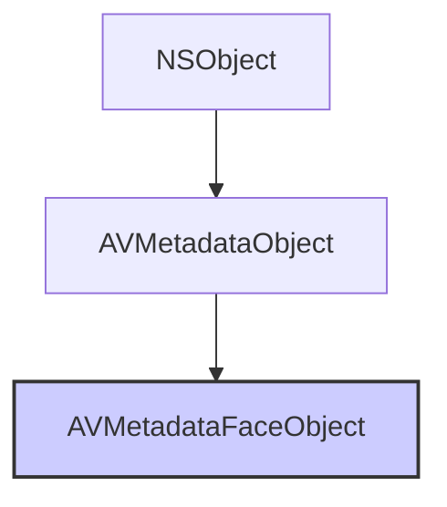

#avfoundation #metadata #face-detection #avcapturemetadataoutput #vision #real-time #camera #ios6

---
## AVMetadataFaceObject

### Определение
**AVMetadataFaceObject** — это конкретный подкласс [[AVMetadataObject]] во фреймворке [[AVFoundation]], который представляет собой одно обнаруженное лицо в видеопотоке или изображении . Он предоставляет информацию о позиции, размере и ориентации лица, а также уникальный идентификатор для отслеживания лица между кадрами.

Этот класс является частью системы обнаружения лиц в AVFoundation, доступной с iOS 6, и позволяет детектировать лица в реальном времени без использования фреймворка Vision. Вместе с классами для обнаружения тел животных и людей, он обеспечивает базовую функциональность компьютерного зрения на уровне системы захвата.

### Доступность платформ
- **iOS**: 6.0+
- **iPadOS**: 6.0+
- **macOS**: 10.8+
- **Mac Catalyst**: 13.0+
- **tvOS**: 9.0+
- **watchOS**: Недоступен

### Зачем это знать iOS-разработчику?
1.  **Обнаружение лиц:** Позволяет создавать приложения, которые могут обнаруживать лица в кадре без сложной настройки Vision.
2.  **Отслеживание лиц:** Уникальный `faceID` позволяет отслеживать одно и то же лицо между кадрами.
3.  **Информация об ориентации:** Свойства `rollAngle` и `yawAngle` дают информацию о повороте лица.
4.  **Интеграция с AVCaptureMetadataOutput:** Простое добавление типа `.face` в `metadataObjectTypes` для получения обнаруженных лиц.
5.  **Создание AR-эффектов:** Идеально подходит для наложения масок или фильтров на лица.
6.  **Комбинирование с Vision:** Для более точной детекции (например, контуров лица) можно комбинировать с Vision.

---

### Иерархия наследования



### Ключевые свойства

#### Свойства из AVMetadataObject
- `time` (`CMTime`) — время захвата данного метаданного объекта .
- `duration` (`CMTime`) — длительность объекта метаданных .
- `bounds` (`CGRect`) — ограничивающий прямоугольник лица с координатами, нормализованными от 0.0 до 1.0 (верхний левый угол - начало координат) .
- `type` ([[AVMetadataObjectType]]) — тип объекта. Для лица это значение будет [[AVMetadataObjectTypeFace]] .

#### Специфические свойства AVMetadataFaceObject
- `faceID` (`NSInteger`) — уникальный идентификатор для каждого лица в кадре. Когда новое лицо появляется, ему присваивается новый ID. Один и тот же ID используется для одного лица в последовательных кадрах, пока лицо остается в кадре .
- `hasRollAngle` ([[Bool]]) — указывает, доступен ли угол крена (roll) для этого лица .
- `rollAngle` ([[CGFloat]]) — угол крена лица в градусах. Значение 0 означает, что лицо вертикально. Положительные значения соответствуют повороту по часовой стрелке .
- `hasYawAngle` (`Bool`) — указывает, доступен ли угол рыскания (yaw) для этого лица .
- `yawAngle` (`CGFloat`) — угол рыскания лица в градусах. Значение 0 означает, что лицо смотрит прямо. Положительные значения соответствуют повороту вправо (со стороны субъекта) .
- `leftEyeClosed` (`Bool`) — указывает, закрыт ли левый глаз (доступно на некоторых устройствах и iOS версиях).
- `rightEyeClosed` (`Bool`) — указывает, закрыт ли правый глаз.
- `smile` (`Bool`) — указывает, улыбается ли лицо.

---

### Примеры использования

#### Уровень 1: Базовая настройка детекции лиц
Простой пример настройки `AVCaptureMetadataOutput` для обнаружения лиц.

```swift
import UIKit
import AVFoundation

class FaceDetectionViewController: UIViewController, AVCaptureMetadataOutputObjectsDelegate {

    var captureSession: AVCaptureSession!
    var previewLayer: AVCaptureVideoPreviewLayer!
    var faceCountLabel: UILabel!
    
    override func viewDidLoad() {
        super.viewDidLoad()
        setupUI()
        checkPermissionsAndSetup()
    }
    
    private func setupUI() {
        faceCountLabel = UILabel(frame: CGRect(x: 20, y: 100, width: 200, height: 40))
        faceCountLabel.textColor = .white
        faceCountLabel.backgroundColor = UIColor.black.withAlphaComponent(0.5)
        faceCountLabel.textAlignment = .center
        faceCountLabel.font = UIFont.boldSystemFont(ofSize: 18)
        faceCountLabel.text = "Лиц: 0"
        view.addSubview(faceCountLabel)
    }
    
    private func checkPermissionsAndSetup() {
        switch AVCaptureDevice.authorizationStatus(for: .video) {
        case .authorized:
            setupCamera()
        case .notDetermined:
            AVCaptureDevice.requestAccess(for: .video) { granted in
                if granted { DispatchQueue.main.async { self.setupCamera() } }
            }
        default:
            print("Нет доступа к камере")
        }
    }
    
    private func setupCamera() {
        captureSession = AVCaptureSession()
        captureSession.sessionPreset = .hd1920x1080
        
        // Для лиц лучше использовать фронтальную камеру
        guard let camera = AVCaptureDevice.default(.builtInWideAngleCamera, for: .video, position: .front),
              let input = try? AVCaptureDeviceInput(device: camera),
              captureSession.canAddInput(input) else { return }
        captureSession.addInput(input)
        
        // 1. Создаем и настраиваем MetadataOutput
        let metadataOutput = AVCaptureMetadataOutput()
        
        if captureSession.canAddOutput(metadataOutput) {
            captureSession.addOutput(metadataOutput)
            
            // 2. Устанавливаем делегат на главную очередь (для обновления UI)
            metadataOutput.setMetadataObjectsDelegate(self, queue: DispatchQueue.main)
            
            // 3. Проверяем доступность и добавляем тип .face
            if metadataOutput.availableMetadataObjectTypes.contains(.face) {
                metadataOutput.metadataObjectTypes = [.face]
                print("✅ Детекция лиц поддерживается")
            } else {
                print("❌ Детекция лиц не поддерживается")
            }
        }
        
        previewLayer = AVCaptureVideoPreviewLayer(session: captureSession)
        previewLayer.frame = view.bounds
        previewLayer.videoGravity = .resizeAspectFill
        view.layer.insertSublayer(previewLayer, at: 0)
        
        DispatchQueue.global(qos: .userInitiated).async { [weak self] in
            self?.captureSession.startRunning()
        }
    }
    
    // MARK: - AVCaptureMetadataOutputObjectsDelegate
    func metadataOutput(_ output: AVCaptureMetadataOutput, 
                        didOutput metadataObjects: [AVMetadataObject], 
                        from connection: AVCaptureConnection) {
        
        var faceCount = 0
        
        for metadataObject in metadataObjects {
            // 4. Проверяем, является ли объект лицом
            guard let faceObject = metadataObject as? AVMetadataFaceObject else { continue }
            
            // 5. Преобразуем координаты из системы камеры в координаты previewLayer
            if let transformedFace = previewLayer.transformedMetadataObject(for: faceObject) as? AVMetadataFaceObject {
                faceCount += 1
                print("👤 Обнаружено лицо #\(transformedFace.faceID)")
                
                if transformedFace.hasRollAngle {
                    print("  Roll angle: \(transformedFace.rollAngle)°")
                }
                if transformedFace.hasYawAngle {
                    print("  Yaw angle: \(transformedFace.yawAngle)°")
                }
            }
        }
        
        // Обновляем UI
        faceCountLabel.text = "Лиц: \(faceCount)"
    }
}
```

#### Уровень 2: Отрисовка рамок вокруг лиц
Расширение предыдущего примера с визуальной обратной связью.

```swift
import UIKit
import AVFoundation

class FaceOverlayViewController: FaceDetectionViewController {
    
    // Словарь для хранения слоев по faceID
    var overlayLayers: [Int: (frameLayer: CAShapeLayer, labelLayer: CATextLayer)] = [:]
    
    override func metadataOutput(_ output: AVCaptureMetadataOutput, 
                                  didOutput metadataObjects: [AVMetadataObject], 
                                  from connection: AVCaptureConnection) {
        
        super.metadataOutput(output, didOutput: metadataObjects, from: connection)
        
        var currentFaceIDs = Set<Int>()
        
        for metadataObject in metadataObjects {
            guard let faceObject = metadataObject as? AVMetadataFaceObject,
                  let transformedFace = previewLayer.transformedMetadataObject(for: faceObject) as? AVMetadataFaceObject else { continue }
            
            let faceID = transformedFace.faceID
            currentFaceIDs.insert(faceID)
            
            // Обновляем или создаем слой для этого лица
            updateOverlay(for: transformedFace, faceID: faceID)
        }
        
        // Удаляем слои для лиц, которые больше не в кадре
        for faceID in overlayLayers.keys {
            if !currentFaceIDs.contains(faceID) {
                overlayLayers[faceID]?.frameLayer.removeFromSuperlayer()
                overlayLayers[faceID]?.labelLayer.removeFromSuperlayer()
                overlayLayers.removeValue(forKey: faceID)
            }
        }
    }
    
    private func updateOverlay(for face: AVMetadataFaceObject, faceID: Int) {
        let frameLayer: CAShapeLayer
        let labelLayer: CATextLayer
        
        if let existing = overlayLayers[faceID] {
            frameLayer = existing.frameLayer
            labelLayer = existing.labelLayer
        } else {
            // Создаем слой для рамки
            frameLayer = CAShapeLayer()
            frameLayer.strokeColor = UIColor.green.cgColor
            frameLayer.lineWidth = 3
            frameLayer.fillColor = UIColor.clear.cgColor
            previewLayer?.addSublayer(frameLayer)
            
            // Создаем слой для текста
            labelLayer = CATextLayer()
            labelLayer.fontSize = 14
            labelLayer.foregroundColor = UIColor.white.cgColor
            labelLayer.backgroundColor = UIColor.green.withAlphaComponent(0.7).cgColor
            labelLayer.alignmentMode = .center
            labelLayer.cornerRadius = 5
            previewLayer?.addSublayer(labelLayer)
            
            overlayLayers[faceID] = (frameLayer: frameLayer, labelLayer: labelLayer)
        }
        
        // Обновляем рамку (используем овал для более естественного вида)
        let ovalPath = UIBezierPath(ovalIn: face.bounds)
        frameLayer.path = ovalPath.cgPath
        
        // Формируем текст с информацией о лице
        var infoString = "Лицо #\(faceID)"
        if face.hasRollAngle {
            infoString += String(format: "\nRoll: %.0f°", face.rollAngle)
        }
        if face.hasYawAngle {
            infoString += String(format: "\nYaw: %.0f°", face.yawAngle)
        }
        
        // Обновляем позицию и содержимое текста
        let labelWidth: CGFloat = 100
        let labelHeight: CGFloat = face.hasRollAngle || face.hasYawAngle ? 50 : 25
        let labelX = face.bounds.midX - labelWidth / 2
        let labelY = face.bounds.minY - labelHeight - 5
        
        labelLayer.string = infoString
        labelLayer.frame = CGRect(x: labelX, y: labelY, width: labelWidth, height: labelHeight)
    }
}
```

#### Уровень 3: Отслеживание лиц и определение их количества
Использование `faceID` для отслеживания уникальных лиц во времени.

```swift
import AVFoundation

class FaceTrackingViewController: FaceDetectionViewController {
    
    var faceHistory: [Int: CMTime] = [:] // Время первого появления лица
    var uniqueFaceCount = 0
    
    override func metadataOutput(_ output: AVCaptureMetadataOutput, 
                                  didOutput metadataObjects: [AVMetadataObject], 
                                  from connection: AVCaptureConnection) {
        
        var currentFaceIDs = Set<Int>()
        
        for metadataObject in metadataObjects {
            guard let faceObject = metadataObject as? AVMetadataFaceObject else { continue }
            
            let faceID = faceObject.faceID
            currentFaceIDs.insert(faceID)
            
            // Если лицо появилось впервые
            if faceHistory[faceID] == nil {
                faceHistory[faceID] = faceObject.time
                uniqueFaceCount += 1
                
                let timeString = String(format: "%.2f", faceObject.time.seconds)
                print("🎉 Новое лицо #\(faceID)! Всего уникальных: \(uniqueFaceCount), время: \(timeString)")
            }
        }
        
        // Очистка истории для лиц, которых нет уже долгое время (упрощенно)
        // В реальном приложении можно добавить таймер для очистки
        
        DispatchQueue.main.async {
            self.faceCountLabel.text = "Лиц сейчас: \(currentFaceIDs.count)\nВсего: \(self.uniqueFaceCount)"
        }
    }
}
```

#### Уровень 4: Применение эффектов на основе углов лица
Наложение простого эффекта (например, очки) с учетом ориентации лица.

```swift
import UIKit
import AVFoundation

class FaceEffectsViewController: FaceOverlayViewController {
    
    let glassesImageView = UIImageView(image: UIImage(named: "glasses"))
    
    override func viewDidLoad() {
        super.viewDidLoad()
        setupGlasses()
    }
    
    private func setupGlasses() {
        glassesImageView.contentMode = .scaleAspectFit
        glassesImageView.isHidden = true
        view.addSubview(glassesImageView)
    }
    
    override func updateOverlay(for face: AVMetadataFaceObject, faceID: Int) {
        super.updateOverlay(for: face, faceID: faceID)
        
        // Позиционируем очки
        let faceWidth = face.bounds.width
        let glassesWidth = faceWidth * 1.2 // Чуть шире лица
        let glassesHeight = glassesWidth * 0.4 // Примерное соотношение для очков
        
        let glassesX = face.bounds.midX - glassesWidth / 2
        let glassesY = face.bounds.minY + face.bounds.height * 0.25 // Чуть выше середины лица
        
        // Применяем трансформацию на основе углов лица
        var transform = CGAffineTransform.identity
        
        if face.hasRollAngle {
            // Поворачиваем очки на угол крена лица (в радианах)
            let rollRadians = face.rollAngle * .pi / 180.0
            transform = transform.rotated(by: rollRadians)
        }
        
        DispatchQueue.main.async {
            self.glassesImageView.transform = transform
            self.glassesImageView.frame = CGRect(x: glassesX, y: glassesY, width: glassesWidth, height: glassesHeight)
            self.glassesImageView.isHidden = false
        }
    }
}
```

#### Уровень 5: Комбинирование с Vision для определения эмоций
Использование Vision для получения более детальной информации о лице.

```swift
import UIKit
import AVFoundation
import Vision

class VisionFaceViewController: FaceDetectionViewController, AVCaptureVideoDataOutputSampleBufferDelegate {

    let videoProcessingQueue = DispatchQueue(label: "videoProcessingQueue")
    
    override func setupCamera() {
        super.setupCamera()
        
        // Добавляем VideoDataOutput для доступа к кадрам
        let videoOutput = AVCaptureVideoDataOutput()
        videoOutput.videoSettings = [kCVPixelBufferPixelFormatTypeKey as String: kCVPixelFormatType_32BGRA]
        videoOutput.setSampleBufferDelegate(self, queue: videoProcessingQueue)
        
        if captureSession.canAddOutput(videoOutput) {
            captureSession.addOutput(videoOutput)
        }
    }
    
    // MARK: - AVCaptureVideoDataOutputSampleBufferDelegate
    func captureOutput(_ output: AVCaptureOutput, 
                       didOutput sampleBuffer: CMSampleBuffer, 
                       from connection: AVCaptureConnection) {
        
        guard let pixelBuffer = CMSampleBufferGetImageBuffer(sampleBuffer) else { return }
        
        // Создаем запрос Vision для обнаружения контуров лица
        let request = VNDetectFaceLandmarksRequest { request, error in
            guard let observations = request.results as? [VNFaceObservation] else { return }
            
            for observation in observations {
                // Получаем контуры лица
                if let landmarks = observation.landmarks {
                    // Здесь можно анализировать эмоции, моргание и т.д.
                    print("Vision: обнаружены контуры лица")
                }
            }
        }
        
        let handler = VNImageRequestHandler(cvPixelBuffer: pixelBuffer, options: [:])
        try? handler.perform([request])
    }
}
```

---

### Сравнение с Vision

| Характеристика | AVMetadataFaceObject | Vision (VNFaceObservation) |
|---|---|---|
| **API уровень** | Низкоуровневый, часть AVFoundation | Высокоуровневый, часть Vision |
| **Детализация** | Базовая: позиция, углы, ID | Расширенная: контуры, эмоции, моргание |
| **Производительность** | Очень высокая (аппаратная) | Высокая (оптимизирована) |
| **Простота использования** | Очень просто (через metadataOutput) | Требует настройки запросов |
| **Глубина информации** | Ограниченная | Богатая |
| **Поддержка реального времени** | Отличная | Хорошая |
| **Использование** | Базовая детекция лиц, быстрые рамки | Детальный анализ, AR-эффекты, эмоции |

### Важные нюансы и Best Practices

#### 1. **Проверка доступности углов**
Всегда проверяйте `hasRollAngle` и `hasYawAngle` перед использованием этих свойств, так как они могут быть недоступны на некоторых устройствах или при определенных условиях .

```swift
if faceObject.hasRollAngle {
    // Используем faceObject.rollAngle
}
```

#### 2. **Координаты и преобразование**
Как и с другими метаданными, координаты `bounds` возвращаются в системе координат камеры. Всегда используйте `previewLayer.transformedMetadataObject(for:)` для преобразования в координаты экрана .

#### 3. **Производительность**
- Детекция лиц через `AVCaptureMetadataOutput` очень эффективна, так как использует аппаратное ускорение.
- Для более детального анализа можно комбинировать с Vision, но это может повлиять на производительность.

#### 4. **Уникальные идентификаторы**
`faceID` уникален для каждого лица в кадре и позволяет отслеживать одно лицо между кадрами. Это удобно для:
- Подсчета количества уникальных лиц
- Отслеживания движения лица
- Применения эффектов к конкретному лицу

#### 5. **Ориентация камеры**
Для фронтальной камеры углы `roll` и `yaw` могут быть зеркально отражены. Учитывайте это при наложении эффектов.

#### 6. **Ограничения**
- Детекция работает лучше всего, когда лицо хорошо освещено и смотрит в камеру.
- Профильные ракурсы могут не детектироваться или детектироваться с меньшей точностью.
- Наличие очков или маски может повлиять на качество детекции.

### Итог
**AVMetadataFaceObject** — это эффективный и простой способ обнаружения лиц в видеопотоке. Он предоставляет:

- **Высокопроизводительную детекцию** с аппаратным ускорением
- **Уникальные идентификаторы** для отслеживания лиц
- **Информацию об ориентации** (углы крена и рыскания)
- **Простую интеграцию** с `AVCaptureMetadataOutput`
- **Доступность** на всех основных платформах Apple (iOS, macOS, tvOS)

Этот класс идеально подходит для приложений, которым необходима базовая детекция лиц с минимальными накладными расходами, и является отличной отправной точкой для более продвинутой обработки с использованием Vision.