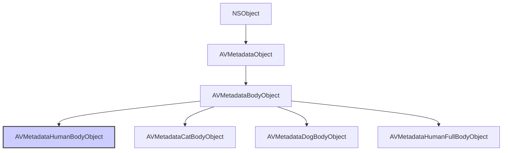

#avfoundation #metadata #human-body #vision #avcapturemetadataoutput #object-detection #ios13

---

## AVMetadataHumanBodyObject

### Определение
**AVMetadataHumanBodyObject** — это конкретный подкласс [[AVMetadataBodyObject]] (который сам является подклассом [[AVMetadataObject]]) во фреймворке [[AVFoundation]]. Он представляет собой одно обнаруженное тело человека в видеопотоке или изображении .

Этот класс является частью системы обнаружения объектов в AVFoundation, представленной в iOS 13, и позволяет детектировать человеческие тела в реальном времени без использования фреймворка Vision. Вместе с классами для обнаружения тел кошек, собак и голов, он обеспечивает базовую функциональность компьютерного зрения на уровне системы захвата.

### Доступность платформ
- **iOS**: 13.0+
- **iPadOS**: 13.0+
- **macOS**: 10.15+
- **Mac Catalyst**: 14.0+
- **tvOS**: 17.0+
- **watchOS**: Недоступен

### Зачем это знать iOS-разработчику?
1.  **Обнаружение людей:** Позволяет создавать приложения, которые могут обнаруживать людей в кадре без сложной настройки Vision.
2.  **Интеграция с AVCaptureMetadataOutput:** Простое добавление типа `.humanBody` в `metadataObjectTypes` для получения обнаруженных объектов.
3.  **Отслеживание нескольких людей:** Использование `bodyID` и `groupID` для идентификации и отслеживания отдельных людей.
4.  **Подсчет людей:** Идеально для приложений подсчета посетителей, систем безопасности или умных помещений.
5.  **Комбинирование с другими детекторами:** Можно одновременно обнаруживать людей, кошек и собак, используя разные типы метаданных.
6.  **Дополнение к Vision:** Для более точной детекции (например, определение позы человека) можно комбинировать с Vision framework.

---

### Иерархия наследования



### Ключевые свойства

Будучи подклассом `AVMetadataBodyObject`, объект `AVMetadataHumanBodyObject` наследует все свойства от `AVMetadataObject` и добавляет специфичные для тела свойства.

#### Свойства из AVMetadataObject
- `time` (`CMTime`) — время захвата данного метаданного объекта .
- `duration` (`CMTime`) — длительность объекта метаданных .
- `bounds` (`CGRect`) — ограничивающий прямоугольник тела с координатами, нормализованными от 0.0 до 1.0 (верхний левый угол - начало координат) .
- `type` (`AVMetadataObjectType`) — тип объекта. Для тела человека это значение будет `AVMetadataObjectTypeHumanBody` .

#### Свойства из AVMetadataBodyObject
- `bodyID` (`NSInteger`) — уникальный номер, связанный с конкретным телом в кадре. Когда новое тело появляется, ему присваивается новый уникальный идентификатор. `bodyID` не переиспользуются .
- `groupID` (`NSInteger`) — идентификатор, используемый для группировки объектов, принадлежащих одному родительскому объекту. Например, тело и голова одного человека будут иметь одинаковый `groupID` .

---

### Примеры использования

#### Уровень 1: Базовая настройка детекции человеческих тел
Простой пример настройки `AVCaptureMetadataOutput` для обнаружения людей.

```swift
import UIKit
import AVFoundation

class HumanBodyDetectionViewController: UIViewController, AVCaptureMetadataOutputObjectsDelegate {

    var captureSession: AVCaptureSession!
    var previewLayer: AVCaptureVideoPreviewLayer!
    var peopleCountLabel: UILabel!
    
    override func viewDidLoad() {
        super.viewDidLoad()
        setupUI()
        checkPermissionsAndSetup()
    }
    
    private func setupUI() {
        peopleCountLabel = UILabel(frame: CGRect(x: 20, y: 100, width: 200, height: 40))
        peopleCountLabel.textColor = .white
        peopleCountLabel.backgroundColor = UIColor.black.withAlphaComponent(0.5)
        peopleCountLabel.textAlignment = .center
        peopleCountLabel.font = UIFont.boldSystemFont(ofSize: 18)
        peopleCountLabel.text = "Людей: 0"
        view.addSubview(peopleCountLabel)
    }
    
    private func checkPermissionsAndSetup() {
        switch AVCaptureDevice.authorizationStatus(for: .video) {
        case .authorized:
            setupCamera()
        case .notDetermined:
            AVCaptureDevice.requestAccess(for: .video) { granted in
                if granted { DispatchQueue.main.async { self.setupCamera() } }
            }
        default:
            print("Нет доступа к камере")
        }
    }
    
    private func setupCamera() {
        captureSession = AVCaptureSession()
        captureSession.sessionPreset = .hd1920x1080
        
        guard let camera = AVCaptureDevice.default(.builtInWideAngleCamera, for: .video, position: .back),
              let input = try? AVCaptureDeviceInput(device: camera),
              captureSession.canAddInput(input) else { return }
        captureSession.addInput(input)
        
        // 1. Создаем и настраиваем MetadataOutput
        let metadataOutput = AVCaptureMetadataOutput()
        
        if captureSession.canAddOutput(metadataOutput) {
            captureSession.addOutput(metadataOutput)
            
            // 2. Устанавливаем делегат на главную очередь (для обновления UI)
            metadataOutput.setMetadataObjectsDelegate(self, queue: DispatchQueue.main)
            
            // 3. Проверяем доступность и добавляем тип .humanBody
            var objectTypes: [AVMetadataObject.ObjectType] = []
            
            if metadataOutput.availableMetadataObjectTypes.contains(.humanBody) {
                objectTypes.append(.humanBody)
                print("✅ Детекция тел людей поддерживается")
            } else {
                print("❌ Детекция тел людей не поддерживается на этом устройстве")
            }
            
            metadataOutput.metadataObjectTypes = objectTypes
        }
        
        previewLayer = AVCaptureVideoPreviewLayer(session: captureSession)
        previewLayer.frame = view.bounds
        previewLayer.videoGravity = .resizeAspectFill
        view.layer.insertSublayer(previewLayer, at: 0)
        
        DispatchQueue.global(qos: .userInitiated).async { [weak self] in
            self?.captureSession.startRunning()
        }
    }
    
    // MARK: - AVCaptureMetadataOutputObjectsDelegate
    func metadataOutput(_ output: AVCaptureMetadataOutput, 
                        didOutput metadataObjects: [AVMetadataObject], 
                        from connection: AVCaptureConnection) {
        
        var peopleCount = 0
        
        for metadataObject in metadataObjects {
            // 4. Проверяем, является ли объект телом человека
            guard let humanBodyObject = metadataObject as? AVMetadataHumanBodyObject else { continue }
            
            // 5. Преобразуем координаты из системы камеры в координаты previewLayer
            if let transformedBody = previewLayer.transformedMetadataObject(for: humanBodyObject) as? AVMetadataHumanBodyObject {
                peopleCount += 1
                print("👤 Обнаружен человек #\(transformedBody.bodyID)")
                print("  Bounds: \(transformedBody.bounds)")
                print("  Group ID: \(transformedBody.groupID)")
            }
        }
        
        // Обновляем UI
        peopleCountLabel.text = "Людей: \(peopleCount)"
    }
}
```

#### Уровень 2: Отрисовка рамок вокруг обнаруженных людей
Расширение предыдущего примера с визуальной обратной связью.

```swift
import UIKit
import AVFoundation

class HumanBodyWithOverlayViewController: HumanBodyDetectionViewController {
    
    // Словарь для хранения слоев по bodyID
    var overlayLayers: [Int: (frameLayer: CAShapeLayer, labelLayer: CATextLayer)] = [:]
    
    override func metadataOutput(_ output: AVCaptureMetadataOutput, 
                                  didOutput metadataObjects: [AVMetadataObject], 
                                  from connection: AVCaptureConnection) {
        
        super.metadataOutput(output, didOutput: metadataObjects, from: connection)
        
        var currentBodyIDs = Set<Int>()
        
        for metadataObject in metadataObjects {
            guard let humanBodyObject = metadataObject as? AVMetadataHumanBodyObject,
                  let transformedBody = previewLayer.transformedMetadataObject(for: humanBodyObject) as? AVMetadataHumanBodyObject else { continue }
            
            let bodyID = transformedBody.bodyID
            currentBodyIDs.insert(bodyID)
            
            // Обновляем или создаем слой для этого тела
            updateOverlay(for: transformedBody, bodyID: bodyID)
        }
        
        // Удаляем слои для тел, которые больше не в кадре
        for bodyID in overlayLayers.keys {
            if !currentBodyIDs.contains(bodyID) {
                overlayLayers[bodyID]?.frameLayer.removeFromSuperlayer()
                overlayLayers[bodyID]?.labelLayer.removeFromSuperlayer()
                overlayLayers.removeValue(forKey: bodyID)
            }
        }
    }
    
    private func updateOverlay(for humanBody: AVMetadataHumanBodyObject, bodyID: Int) {
        let frameLayer: CAShapeLayer
        let labelLayer: CATextLayer
        
        if let existing = overlayLayers[bodyID] {
            frameLayer = existing.frameLayer
            labelLayer = existing.labelLayer
        } else {
            // Создаем слой для рамки
            frameLayer = CAShapeLayer()
            frameLayer.strokeColor = UIColor.systemBlue.cgColor
            frameLayer.lineWidth = 3
            frameLayer.fillColor = UIColor.clear.cgColor
            previewLayer?.addSublayer(frameLayer)
            
            // Создаем слой для текста
            labelLayer = CATextLayer()
            labelLayer.fontSize = 14
            labelLayer.foregroundColor = UIColor.white.cgColor
            labelLayer.backgroundColor = UIColor.systemBlue.withAlphaComponent(0.7).cgColor
            labelLayer.alignmentMode = .center
            labelLayer.cornerRadius = 5
            labelLayer.string = "👤 Человек #\(bodyID)"
            previewLayer?.addSublayer(labelLayer)
            
            overlayLayers[bodyID] = (frameLayer: frameLayer, labelLayer: labelLayer)
        }
        
        // Обновляем рамку
        frameLayer.path = UIBezierPath(rect: humanBody.bounds).cgPath
        
        // Обновляем позицию текста (над рамкой)
        let labelWidth: CGFloat = 100
        let labelHeight: CGFloat = 25
        let labelX = humanBody.bounds.midX - labelWidth / 2
        let labelY = humanBody.bounds.minY - labelHeight - 5
        labelLayer.frame = CGRect(x: labelX, y: labelY, width: labelWidth, height: labelHeight)
    }
}
```

#### Уровень 3: Подсчет уникальных людей за время работы
Использование `bodyID` для отслеживания уникальных людей.

```swift
import AVFoundation

class UniquePeopleCounterViewController: HumanBodyDetectionViewController {
    
    var uniquePeople: Set<Int> = []
    var peopleHistory: [Int: Date] = [:]
    
    override func metadataOutput(_ output: AVCaptureMetadataOutput, 
                                  didOutput metadataObjects: [AVMetadataObject], 
                                  from connection: AVCaptureConnection) {
        
        var currentBodyIDs = Set<Int>()
        
        for metadataObject in metadataObjects {
            guard let humanBodyObject = metadataObject as? AVMetadataHumanBodyObject else { continue }
            
            let bodyID = humanBodyObject.bodyID
            currentBodyIDs.insert(bodyID)
            
            // Если человек появился впервые
            if !uniquePeople.contains(bodyID) {
                uniquePeople.insert(bodyID)
                peopleHistory[bodyID] = Date()
                print("👤 Новый человек #\(bodyID) обнаружен! Всего уникальных: \(uniquePeople.count)")
            }
        }
        
        // Логируем уход людей
        let previousPeople = Set(peopleHistory.keys)
        let peopleWhoLeft = previousPeople.subtracting(currentBodyIDs)
        
        for bodyID in peopleWhoLeft {
            if let firstSeen = peopleHistory[bodyID] {
                let timeSpent = Date().timeIntervalSince(firstSeen)
                print("👋 Человек #\(bodyID) покинул кадр. Был в кадре: \(String(format: "%.1f", timeSpent)) сек")
                peopleHistory.removeValue(forKey: bodyID)
            }
        }
        
        DispatchQueue.main.async {
            self.peopleCountLabel.text = "Сейчас: \(currentBodyIDs.count)\nВсего: \(self.uniquePeople.count)"
        }
    }
}
```

#### Уровень 4: Группировка тела и головы человека
Использование `groupID` для связывания различных частей одного человека.

```swift
import AVFoundation

class HumanBodyWithHeadViewController: HumanBodyDetectionViewController {
    
    override func metadataOutput(_ output: AVCaptureMetadataOutput, 
                                  didOutput metadataObjects: [AVMetadataObject], 
                                  from connection: AVCaptureConnection) {
        
        // Словарь для группировки объектов по groupID
        var groupedPeople: [Int: (body: AVMetadataHumanBodyObject?, head: AVMetadataHumanHeadObject?)] = [:]
        
        for metadataObject in metadataObjects {
            if let transformedObject = previewLayer.transformedMetadataObject(for: metadataObject) {
                
                if let humanBody = transformedObject as? AVMetadataHumanBodyObject {
                    let groupID = humanBody.groupID
                    if groupID >= 0 {
                        groupedPeople[groupID, default: (nil, nil)].body = humanBody
                        print("👤 Тело человека в группе \(groupID)")
                    }
                } else if let humanHead = transformedObject as? AVMetadataHumanHeadObject {
                    let groupID = humanHead.groupID
                    if groupID >= 0 {
                        groupedPeople[groupID, default: (nil, nil)].head = humanHead
                        print("👤 Голова человека в группе \(groupID)")
                    }
                }
            }
        }
        
        // Обрабатываем каждого человека
        for (groupID, parts) in groupedPeople {
            if parts.body != nil && parts.head != nil {
                print("✅ Полное обнаружение человека в группе \(groupID)")
            } else if parts.body != nil {
                print("⚠️ Только тело человека в группе \(groupID)")
            } else if parts.head != nil {
                print("⚠️ Только голова человека в группе \(groupID)")
            }
        }
    }
}
```

#### Уровень 5: Фильтрация по размеру и положению
Игнорирование слишком маленьких или находящихся на периферии людей.

```swift
import AVFoundation

class FilteredHumanDetectionViewController: HumanBodyDetectionViewController {
    
    let minimumArea: CGFloat = 0.05 // Минимум 5% площади кадра
    let regionOfInterest = CGRect(x: 0.2, y: 0.2, width: 0.6, height: 0.6) // Центральная область
    
    override func metadataOutput(_ output: AVCaptureMetadataOutput, 
                                  didOutput metadataObjects: [AVMetadataObject], 
                                  from connection: AVCaptureConnection) {
        
        var validPeople: [AVMetadataHumanBodyObject] = []
        
        for metadataObject in metadataObjects {
            guard let humanBodyObject = metadataObject as? AVMetadataHumanBodyObject,
                  let transformedBody = previewLayer.transformedMetadataObject(for: humanBodyObject) as? AVMetadataHumanBodyObject else { continue }
            
            // 1. Фильтр по размеру
            let area = transformedBody.bounds.width * transformedBody.bounds.height
            guard area >= minimumArea else {
                print("Слишком маленький объект, игнорируем")
                continue
            }
            
            // 2. Фильтр по положению (проверяем, пересекается ли с областью интереса)
            let normalizedBounds = CGRect(
                x: transformedBody.bounds.midX / view.bounds.width,
                y: transformedBody.bounds.midY / view.bounds.height,
                width: 0,
                height: 0
            )
            
            if regionOfInterest.contains(normalizedBounds.origin) {
                validPeople.append(transformedBody)
                print("✅ Человек #\(transformedBody.bodyID) в центральной зоне")
            } else {
                print("⏭️ Человек #\(transformedBody.bodyID) на периферии, игнорируем")
            }
        }
        
        // Обрабатываем только валидные обнаружения
        processValidPeople(validPeople)
    }
    
    private func processValidPeople(_ people: [AVMetadataHumanBodyObject]) {
        print("Обрабатываем \(people.count) человек в центральной зоне")
        // Здесь можно добавить дополнительную логику
    }
}
```

---

### AVMetadataHumanBodyObject vs AVMetadataHumanFullBodyObject

| Характеристика             | AVMetadataHumanBodyObject         | [[AVMetadataHumanFullBodyObject]]  |
| -------------------------- | --------------------------------- | ---------------------------------- |
| **Что обнаруживает**       | Тело человека (торс и конечности) | Полное тело человека (с головой)   |
| **Точность**               | Базовая                           | Более высокая                      |
| **Использование ресурсов** | Меньше                            | Больше                             |
| **Применение**             | Подсчет людей, базовая детекция   | Анализ позы, спортивные приложения |
| **Доступность**            | iOS 13+                           | iOS 13+                            |

### Важные нюансы и Best Practices

#### 1. **Проверка доступности**
Не все устройства поддерживают детекцию человеческих тел. Всегда проверяйте наличие типа в `availableMetadataObjectTypes` .

```swift
if metadataOutput.availableMetadataObjectTypes.contains(.humanBody) {
    metadataOutput.metadataObjectTypes = [.humanBody]
}
```

#### 2. **Координаты и преобразование**
Как и с другими метаданными, координаты `bounds` возвращаются в системе координат камеры. Всегда используйте `previewLayer.transformedMetadataObject(for:)` для преобразования в координаты экрана .

#### 3. **Производительность**
- Детекция человеческих тел через `AVCaptureMetadataOutput` достаточно эффективна, так как использует аппаратное ускорение.
- Для более сложного анализа (поза человека, жесты) рекомендуется использовать Vision framework.

#### 4. **Уникальные идентификаторы**
`bodyID` уникален для каждого тела в кадре и позволяет отслеживать одного человека между кадрами. Это удобно для:
- Подсчета уникальных посетителей
- Отслеживания траектории движения
- Анализа поведения

#### 5. **Группировка с головой**
Используйте `groupID` для связывания тела и головы одного человека. Это особенно полезно для:
- Определения ориентации человека
- Применения эффектов
- Более точной детекции

#### 6. **Ограничения**
- Детекция работает лучше всего, когда человек виден полностью или большей частью.
- Освещение должно быть достаточным.
- Люди в профиль могут детектироваться с меньшей точностью.
- Частичное перекрытие объектов может влиять на качество детекции.

#### 7. **Альтернативы и дополнения**
- **Vision (VNDetectHumanRectanglesRequest)** — для более точной детекции
- **Vision (VNDetectHumanBodyPoseRequest)** — для определения позы человека
- **Core ML** — для кастомных моделей обнаружения людей

### Итог
**AVMetadataHumanBodyObject** — это эффективный и простой способ обнаружения человеческих тел в видеопотоке. Он предоставляет:

- **Простой API** для детекции без использования Vision
- **Уникальные идентификаторы** для отслеживания людей
- **Возможность группировки** с другими объектами (голова)
- **Интеграцию** с `AVCaptureMetadataOutput` для работы в реальном времени
- **Доступность** на iOS 13+ и других платформах Apple

Этот класс идеально подходит для приложений подсчета людей, систем безопасности и умных помещений, где требуется базовая детекция человеческих тел с минимальными накладными расходами. Для более сложного анализа рекомендуется комбинировать с Vision framework.