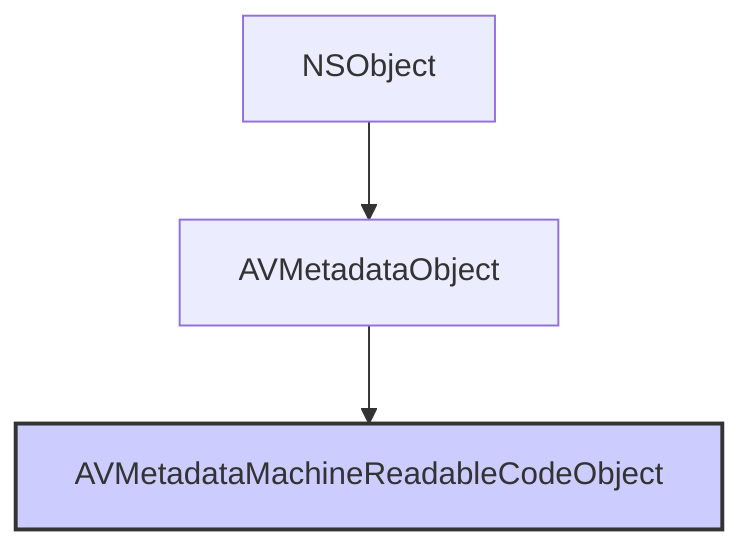

#avfoundation #metadata #barcode #qr #avcapturemetadataoutput #scanning #vision #ios7

---
## AVMetadataMachineReadableCodeObject

### Определение
**AVMetadataMachineReadableCodeObject** — это конкретный подкласс [[AVMetadataObject]] во фреймворке [[AVFoundation]], который представляет собой один обнаруженный машиночитаемый код (например, QR-код, штрих-код) в видеопотоке или изображении . Он предоставляет не только информацию о положении и размере кода, но и его декодированное содержимое, а также координаты углов для точного позиционирования.

Этот класс является основным инструментом для создания приложений-сканеров штрих-кодов и QR-кодов на iOS, доступный с iOS 7. Он поддерживает широкий спектр форматов: от простых QR-кодов до сложных промышленных кодировок, таких как PDF417 и Aztec.

### Доступность платформ
- **iOS**: 7.0+
- **iPadOS**: 7.0+
- **macOS**: 10.10+
- **Mac Catalyst**: 13.0+
- **tvOS**: 9.0+
- **watchOS**: Недоступен

### Зачем это знать iOS-разработчику?
1.  **Сканирование QR-кодов:** Самое популярное применение — создание сканеров QR-кодов для авторизации, оплаты, получения информации.
2.  **Сканирование штрих-кодов:** Для торговых приложений, сканеров товаров, инвентаризации.
3.  **Точное позиционирование:** Свойство `corners` позволяет точно наложить визуальные эффекты на найденный код.
4.  **Поддержка множества форматов:** EAN-13, Code 128, PDF417, Aztec, Data Matrix и другие.
5.  **Интеграция с AVCaptureMetadataOutput:** Простое добавление типов кодов в `metadataObjectTypes` для получения результатов.
6.  **Безопасность:** Можно проверять содержимое кодов и отображать предупреждения о потенциально опасных ссылках.

---

### Иерархия наследования



### Ключевые свойства

#### Свойства из AVMetadataObject
- `time` (`CMTime`) — время захвата данного метаданного объекта .
- `duration` (`CMTime`) — длительность объекта метаданных .
- `bounds` (`CGRect`) — ограничивающий прямоугольник кода с координатами, нормализованными от 0.0 до 1.0 (верхний левый угол - начало координат) .
- `type` (`AVMetadataObject.ObjectType`) — тип обнаруженного кода (например, `.qr`, `.ean13`, `.pdf417`) .

#### Специфические свойства AVMetadataMachineReadableCodeObject
- `stringValue` ([[String]]`?`) — декодированное содержимое кода в виде строки. Для кодов, которые не содержат текстовых данных (например, некоторые бинарные форматы), это свойство может быть [[nil]] .
- `corners` (`[CGPoint]`) — массив точек, определяющих точный контур найденного кода. Обычно содержит 4 точки (углы прямоугольника), но для некоторых типов кодов может быть больше .
- `descriptor` (`CIQRCodeDescriptor?`) — для QR-кодов предоставляет дополнительную информацию о версии, маске, режиме исправления ошибок (доступно в [[iOS]] 11+) .

---

### Поддерживаемые типы кодов

AVFoundation поддерживает множество типов машиночитаемых кодов:

| Тип | Константа | Описание |
|-----|-----------|----------|
| **QR Code** | `.qr` | Двумерный код, популярный в маркетинге и платежах |
| **EAN-13** | `.ean13` | 13-значный товарный штрих-код (ISBN книг) |
| **EAN-8** | `.ean8` | 8-значный товарный штрих-код |
| **UPC-E** | `.upce` | 6-значный вариант UPC |
| **Code 39** | `.code39` | Промышленный штрих-код |
| **Code 93** | `.code93` | Улучшенная версия Code 39 |
| **Code 128** | `.code128` | Высокоплотный штрих-код, используется в логистике |
| **PDF417** | `.pdf417` | Многострочный код, используется в билетах и документах |
| **Aztec** | `.aztec` | Устойчивый к повреждениям код, используется в транспорте |
| **Data Matrix** | `.dataMatrix` | Компактный код, используется в промышленности |
| **Interleaved 2 of 5** | `.interleaved2of5` | Промышленный код |
| **ITF-14** | `.itf14` | Вариант Interleaved 2 of 5 для транспортной упаковки |

---

### Примеры использования

#### Уровень 1: Базовая настройка сканера QR-кодов
Простой пример настройки `AVCaptureMetadataOutput` для сканирования QR-кодов.

```swift
import UIKit
import AVFoundation

class QRScannerViewController: UIViewController, AVCaptureMetadataOutputObjectsDelegate {

    var captureSession: AVCaptureSession!
    var previewLayer: AVCaptureVideoPreviewLayer!
    var resultLabel: UILabel!
    
    override func viewDidLoad() {
        super.viewDidLoad()
        setupUI()
        checkPermissionsAndSetup()
    }
    
    private func setupUI() {
        resultLabel = UILabel(frame: CGRect(x: 20, y: 100, width: view.bounds.width - 40, height: 60))
        resultLabel.numberOfLines = 2
        resultLabel.textColor = .white
        resultLabel.backgroundColor = UIColor.black.withAlphaComponent(0.5)
        resultLabel.textAlignment = .center
        resultLabel.text = "Наведите камеру на QR-код"
        view.addSubview(resultLabel)
    }
    
    private func checkPermissionsAndSetup() {
        switch AVCaptureDevice.authorizationStatus(for: .video) {
        case .authorized:
            setupCamera()
        case .notDetermined:
            AVCaptureDevice.requestAccess(for: .video) { granted in
                if granted { DispatchQueue.main.async { self.setupCamera() } }
            }
        default:
            print("Нет доступа к камере")
        }
    }
    
    private func setupCamera() {
        captureSession = AVCaptureSession()
        captureSession.sessionPreset = .hd1920x1080
        
        guard let camera = AVCaptureDevice.default(for: .video),
              let input = try? AVCaptureDeviceInput(device: camera),
              captureSession.canAddInput(input) else { return }
        captureSession.addInput(input)
        
        // 1. Создаем и настраиваем MetadataOutput
        let metadataOutput = AVCaptureMetadataOutput()
        
        if captureSession.canAddOutput(metadataOutput) {
            captureSession.addOutput(metadataOutput)
            
            // 2. Устанавливаем делегат на главную очередь (для обновления UI)
            metadataOutput.setMetadataObjectsDelegate(self, queue: DispatchQueue.main)
            
            // 3. Указываем типы метаданных (только QR)
            if metadataOutput.availableMetadataObjectTypes.contains(.qr) {
                metadataOutput.metadataObjectTypes = [.qr]
            } else {
                print("QR-коды не поддерживаются")
            }
        }
        
        previewLayer = AVCaptureVideoPreviewLayer(session: captureSession)
        previewLayer.frame = view.bounds
        previewLayer.videoGravity = .resizeAspectFill
        view.layer.insertSublayer(previewLayer, at: 0)
        
        DispatchQueue.global(qos: .userInitiated).async { [weak self] in
            self?.captureSession.startRunning()
        }
    }
    
    // MARK: - AVCaptureMetadataOutputObjectsDelegate
    func metadataOutput(_ output: AVCaptureMetadataOutput, 
                        didOutput metadataObjects: [AVMetadataObject], 
                        from connection: AVCaptureConnection) {
        
        // Проверяем, есть ли объекты
        guard let metadataObject = metadataObjects.first else {
            resultLabel.text = "Наведите камеру на QR-код"
            return
        }
        
        // 4. Преобразуем в читаемый объект
        guard let readableObject = metadataObject as? AVMetadataMachineReadableCodeObject,
              let stringValue = readableObject.stringValue else { return }
        
        // 5. Обновляем UI
        resultLabel.text = "Найден QR: \(stringValue)"
        
        // Вибрируем
        AudioServicesPlaySystemSound(SystemSoundID(kSystemSoundID_Vibrate))
        
        // Опционально: останавливаем сканирование после первого успеха
        captureSession.stopRunning()
        
        // Показываем алерт
        let alert = UIAlertController(title: "QR-код", 
                                      message: stringValue, 
                                      preferredStyle: .alert)
        alert.addAction(UIAlertAction(title: "OK", style: .default) { [weak self] _ in
            // Возобновляем сканирование
            DispatchQueue.global(qos: .userInitiated).async {
                self?.captureSession.startRunning()
            }
        })
        present(alert, animated: true)
    }
}
```

#### Уровень 2: Сканер нескольких типов штрих-кодов
Расширение для поддержки различных форматов.

```swift
import UIKit
import AVFoundation

class MultiBarcodeScannerViewController: QRScannerViewController {
    
    let supportedCodeTypes: [AVMetadataObject.ObjectType] = [
        .qr, .ean13, .ean8, .code128, .code39, .pdf417, .aztec, .upce
    ]
    
    let codeTypeLabel = UILabel()
    let codeValueLabel = UILabel()
    
    override func setupUI() {
        super.setupUI()
        
        codeTypeLabel.frame = CGRect(x: 20, y: 100, width: 100, height: 40)
        codeTypeLabel.backgroundColor = .blue
        codeTypeLabel.textColor = .white
        codeTypeLabel.textAlignment = .center
        codeTypeLabel.font = UIFont.boldSystemFont(ofSize: 14)
        view.addSubview(codeTypeLabel)
        
        codeValueLabel.frame = CGRect(x: 130, y: 100, width: view.bounds.width - 150, height: 40)
        codeValueLabel.backgroundColor = .darkGray
        codeValueLabel.textColor = .white
        codeValueLabel.textAlignment = .center
        codeValueLabel.font = UIFont.systemFont(ofSize: 12)
        view.addSubview(codeValueLabel)
    }
    
    override func setupCamera() {
        captureSession = AVCaptureSession()
        captureSession.sessionPreset = .hd1920x1080
        
        guard let camera = AVCaptureDevice.default(for: .video),
              let input = try? AVCaptureDeviceInput(device: camera),
              captureSession.canAddInput(input) else { return }
        captureSession.addInput(input)
        
        let metadataOutput = AVCaptureMetadataOutput()
        
        if captureSession.canAddOutput(metadataOutput) {
            captureSession.addOutput(metadataOutput)
            metadataOutput.setMetadataObjectsDelegate(self, queue: DispatchQueue.main)
            
            // Фильтруем доступные типы
            let availableTypes = metadataOutput.availableMetadataObjectTypes
            let filteredTypes = supportedCodeTypes.filter { availableTypes.contains($0) }
            metadataOutput.metadataObjectTypes = filteredTypes
            
            print("Доступные типы: \(filteredTypes.map { $0.rawValue })")
        }
        
        previewLayer = AVCaptureVideoPreviewLayer(session: captureSession)
        previewLayer.frame = view.bounds
        previewLayer.videoGravity = .resizeAspectFill
        view.layer.insertSublayer(previewLayer, at: 0)
        
        DispatchQueue.global(qos: .userInitiated).async { [weak self] in
            self?.captureSession.startRunning()
        }
    }
    
    override func metadataOutput(_ output: AVCaptureMetadataOutput, 
                                  didOutput metadataObjects: [AVMetadataObject], 
                                  from connection: AVCaptureConnection) {
        
        guard let metadataObject = metadataObjects.first else {
            codeTypeLabel.text = ""
            codeValueLabel.text = "Ничего не найдено"
            return
        }
        
        guard let readableObject = previewLayer.transformedMetadataObject(for: metadataObject) as? AVMetadataMachineReadableCodeObject,
              let stringValue = readableObject.stringValue else { return }
        
        // Определяем тип кода
        let typeString = readableObject.type.rawValue
        codeTypeLabel.text = typeString
        codeValueLabel.text = stringValue
        
        // Вибрируем
        AudioServicesPlaySystemSound(SystemSoundID(kSystemSoundID_Vibrate))
        
        print("Найден \(typeString): \(stringValue)")
        
        // Для EAN-13 можно проверить контрольную сумму
        if readableObject.type == .ean13, stringValue.count == 13 {
            validateEAN13(stringValue)
        }
    }
    
    private func validateEAN13(_ code: String) {
        // Простейшая проверка EAN-13
        print("EAN-13 код: \(code)")
    }
}
```

#### Уровень 3: Отрисовка рамки вокруг кода с использованием углов
Использование свойства `corners` для точного выделения кода.

```swift
import UIKit
import AVFoundation

class BarcodeWithOverlayViewController: MultiBarcodeScannerViewController {
    
    var overlayLayer: CAShapeLayer?
    var lastFrame: [CGPoint]?
    
    override func viewDidLoad() {
        super.viewDidLoad()
        setupOverlayLayer()
    }
    
    private func setupOverlayLayer() {
        overlayLayer = CAShapeLayer()
        overlayLayer?.strokeColor = UIColor.green.cgColor
        overlayLayer?.lineWidth = 3
        overlayLayer?.fillColor = UIColor.clear.cgColor
        previewLayer?.addSublayer(overlayLayer!)
    }
    
    override func metadataOutput(_ output: AVCaptureMetadataOutput, 
                                  didOutput metadataObjects: [AVMetadataObject], 
                                  from connection: AVCaptureConnection) {
        
        super.metadataOutput(output, didOutput: metadataObjects, from: connection)
        
        guard let metadataObject = metadataObjects.first,
              let readableObject = previewLayer.transformedMetadataObject(for: metadataObject) as? AVMetadataMachineReadableCodeObject else {
            overlayLayer?.path = nil
            return
        }
        
        // 1. Получаем угловые точки
        let corners = readableObject.corners
        
        // 2. Создаем путь из углов
        let path = UIBezierPath()
        
        if corners.count >= 4 {
            path.move(to: corners[0])
            for i in 1..<corners.count {
                path.addLine(to: corners[i])
            }
            path.close()
            
            // Анимируем появление рамки
            if lastFrame != corners {
                lastFrame = corners
                
                let animation = CABasicAnimation(keyPath: "opacity")
                animation.fromValue = 0
                animation.toValue = 1
                animation.duration = 0.2
                overlayLayer?.add(animation, forKey: "opacity")
            }
            
            overlayLayer?.path = path.cgPath
        }
    }
}
```

#### Уровень 4: Обработка QR-кодов с дополнительной информацией (iOS 11+)
Использование `descriptor` для получения детальной информации о QR-коде.

```swift
import AVFoundation
import CoreImage

@available(iOS 11.0, *)
class AdvancedQRProcessorViewController: QRScannerViewController {
    
    override func metadataOutput(_ output: AVCaptureMetadataOutput, 
                                  didOutput metadataObjects: [AVMetadataObject], 
                                  from connection: AVCaptureConnection) {
        
        guard let metadataObject = metadataObjects.first,
              let readableObject = metadataObject as? AVMetadataMachineReadableCodeObject,
              readableObject.type == .qr else { return }
        
        // Основная информация
        print("QR Content: \(readableObject.stringValue ?? "nil")")
        
        // Дополнительная информация из дескриптора
        if let descriptor = readableObject.descriptor {
            print("QR Version: \(descriptor.symbolVersion)")
            print("Mask Pattern: \(descriptor.maskPattern)")
            print("Error Correction Level: \(descriptor.errorCorrectionLevel)")
            
            // Можно создать изображение QR-кода из дескриптора
            if let qrImage = createQRImage(from: descriptor) {
                print("QR Image created: \(qrImage.size)")
            }
        }
    }
    
    func createQRImage(from descriptor: CIQRCodeDescriptor) -> UIImage? {
        let generator = CIQRCodeGenerator()
        generator.setValue(descriptor, forKey: "inputQRCodeDescriptor")
        
        if let outputImage = generator.outputImage {
            let transform = CGAffineTransform(scaleX: 10, y: 10)
            let scaledImage = outputImage.transformed(by: transform)
            
            let context = CIContext()
            if let cgImage = context.createCGImage(scaledImage, from: scaledImage.extent) {
                return UIImage(cgImage: cgImage)
            }
        }
        return nil
    }
}
```

#### Уровень 5: Парсинг данных из QR-кодов (URL, контакты, Wi-Fi)
Обработка различных типов содержимого.

```swift
import UIKit
import AVFoundation
import Contacts

class QRContentParserViewController: QRScannerViewController {
    
    enum QRContent {
        case url(URL)
        case contact(String)
        case wifi(ssid: String, password: String, security: String)
        case plain(String)
        case unknown
    }
    
    override func metadataOutput(_ output: AVCaptureMetadataOutput, 
                                  didOutput metadataObjects: [AVMetadataObject], 
                                  from connection: AVCaptureConnection) {
        
        guard let metadataObject = metadataObjects.first,
              let readableObject = metadataObject as? AVMetadataMachineReadableCodeObject,
              let stringValue = readableObject.stringValue else { return }
        
        let content = parseQRContent(stringValue)
        
        switch content {
        case .url(let url):
            print("🌐 URL: \(url)")
            // Открыть в Safari
            UIApplication.shared.open(url)
            
        case .contact(let contactData):
            print("👤 Контакт: \(contactData)")
            // Сохранить в контакты
            saveToContacts(contactData)
            
        case .wifi(let ssid, let password, let security):
            print("📶 Wi-Fi: \(ssid) / \(password) [\(security)]")
            // Показать пароль или подключиться
            
        case .plain(let text):
            print("📝 Текст: \(text)")
            // Копировать в буфер обмена
            UIPasteboard.general.string = text
            
        case .unknown:
            print("❓ Неизвестный формат")
        }
    }
    
    private func parseQRContent(_ string: String) -> QRContent {
        // Проверяем URL
        if let url = URL(string: string), url.scheme != nil {
            return .url(url)
        }
        
        // Проверяем Wi-Fi (WIFI:S:<SSID>;T:<WEP|WPA|>;P:<PASSWORD>;;)
        if string.hasPrefix("WIFI:") {
            return parseWifiQR(string)
        }
        
        // Проверяем vCard контакт
        if string.hasPrefix("BEGIN:VCARD") {
            return .contact(string)
        }
        
        return .plain(string)
    }
    
    private func parseWifiQR(_ string: String) -> QRContent {
        var ssid = ""
        var password = ""
        var security = ""
        
        let components = string.components(separatedBy: ";")
        for component in components {
            if component.hasPrefix("S:") {
                ssid = String(component.dropFirst(2))
            } else if component.hasPrefix("P:") {
                password = String(component.dropFirst(2))
            } else if component.hasPrefix("T:") {
                security = String(component.dropFirst(2))
            }
        }
        
        return .wifi(ssid: ssid, password: password, security: security)
    }
    
    private func saveToContacts(_ vCardData: String) {
        // Парсинг vCard и сохранение в контакты
        print("Сохранение контакта...")
    }
}
```

#### Уровень 6: Выборочное сканирование определенной области
Оптимизация сканирования путем ограничения области поиска.

```swift
import UIKit
import AVFoundation

class RegionOfInterestScannerViewController: QRScannerViewController {
    
    let scanAreaView = UIView()
    
    override func setupUI() {
        super.setupUI()
        
        // Создаем полупрозрачную маску
        let overlayView = UIView(frame: view.bounds)
        overlayView.backgroundColor = UIColor.black.withAlphaComponent(0.6)
        view.addSubview(overlayView)
        
        // Область сканирования в центре
        let scanAreaWidth: CGFloat = 250
        let scanAreaHeight: CGFloat = 250
        let scanAreaRect = CGRect(x: view.bounds.midX - scanAreaWidth/2,
                                   y: view.bounds.midY - scanAreaHeight/2,
                                   width: scanAreaWidth,
                                   height: scanAreaHeight)
        
        // Вырезаем отверстие
        let maskLayer = CAShapeLayer()
        let path = UIBezierPath(rect: view.bounds)
        let cutoutPath = UIBezierPath(rect: scanAreaRect)
        path.append(cutoutPath)
        path.usesEvenOddFillRule = true
        maskLayer.path = path.cgPath
        maskLayer.fillRule = .evenOdd
        overlayView.layer.mask = maskLayer
        
        // Рамка для области сканирования
        scanAreaView.frame = scanAreaRect
        scanAreaView.layer.borderColor = UIColor.green.cgColor
        scanAreaView.layer.borderWidth = 2
        scanAreaView.layer.cornerRadius = 12
        view.addSubview(scanAreaView)
    }
    
    override func setupCamera() {
        super.setupCamera()
        
        // Устанавливаем область интереса (ROI) для метаданных
        if let metadataOutput = captureSession.outputs.first as? AVCaptureMetadataOutput {
            // Преобразуем координаты экрана в координаты камеры
            let scanRect = scanAreaView.frame
            let normalizedRect = previewLayer.metadataOutputRectConverted(fromLayerRect: scanRect)
            metadataOutput.rectOfInterest = normalizedRect
            print("ROI установлен: \(normalizedRect)")
        }
    }
    
    override func metadataOutput(_ output: AVCaptureMetadataOutput, 
                                  didOutput metadataObjects: [AVMetadataObject], 
                                  from connection: AVCaptureConnection) {
        
        // Все найденные объекты уже отфильтрованы по ROI
        super.metadataOutput(output, didOutput: metadataObjects, from: connection)
        
        // Меняем цвет рамки при обнаружении
        if metadataObjects.isEmpty {
            scanAreaView.layer.borderColor = UIColor.green.cgColor
        } else {
            scanAreaView.layer.borderColor = UIColor.yellow.cgColor
        }
    }
}
```

---

### AVMetadataMachineReadableCodeObject vs Vision (VNBarcodeObservation)

| Характеристика | AVMetadataMachineReadableCodeObject | VNBarcodeObservation |
|---|---|---|
| **API уровень** | Часть AVFoundation | Часть Vision framework |
| **Простота использования** | Очень просто, интеграция с камерой | Требуется настройка запросов |
| **Поддержка форматов** | Широкая | Расширенная |
| **Точность углов** | Хорошая (corners) | Отличная (boundingBox + контуры) |
| **Доп. информация** | Базовая | Расширенная (версия, маска, исправление ошибок) |
| **Производительность** | Высокая (аппаратная) | Хорошая (оптимизирована) |
| **Гибкость** | Только обнаружение | Обнаружение + трекинг + распознавание |
| **Доступность** | iOS 7+ | iOS 11+ |

### Важные нюансы и Best Practices

#### 1. **Проверка доступности форматов**
Не все форматы доступны на всех устройствах. Всегда проверяйте `availableMetadataObjectTypes` .

```swift
let available = metadataOutput.availableMetadataObjectTypes
let desiredTypes: [AVMetadataObject.ObjectType] = [.qr, .ean13, .pdf417]
let supportedTypes = desiredTypes.filter { available.contains($0) }
metadataOutput.metadataObjectTypes = supportedTypes
```

#### 2. **Координаты и преобразование**
Всегда используйте `previewLayer.transformedMetadataObject(for:)` для получения координат в системе экрана .

```swift
if let transformed = previewLayer.transformedMetadataObject(for: metadataObject) as? AVMetadataMachineReadableCodeObject {
    // Используйте transformed.bounds для экрана
    // Используйте transformed.corners для точных углов
}
```

#### 3. **Ограничение области сканирования**
Используйте `rectOfInterest` для повышения производительности и точности.

```swift
let scanRect = CGRect(x: 0.2, y: 0.3, width: 0.6, height: 0.4) // Нормализованные координаты
metadataOutput.rectOfInterest = scanRect
```

#### 4. **Обработка дубликатов**
Чтобы избежать многократного сканирования одного кода, можно:

```swift
var lastScannedCode = ""

func metadataOutput(...) {
    guard let code = readableObject.stringValue,
          code != lastScannedCode else { return }
    lastScannedCode = code
    // Обработка нового кода
}
```

#### 5. **Обратная связь**
Всегда добавляйте вибрацию или звук при успешном сканировании:

```swift
AudioServicesPlaySystemSound(SystemSoundID(kSystemSoundID_Vibrate))
```

#### 6. **Безопасность**
Для QR-кодов, содержащих URL, показывайте предупреждение перед открытием.

```swift
if let url = URL(string: codeString) {
    let alert = UIAlertController(title: "Внимание", 
                                  message: "Вы собираетесь открыть ссылку: \(url.host ?? "неизвестный сайт")", 
                                  preferredStyle: .alert)
    alert.addAction(UIAlertAction(title: "Открыть", style: .default) { _ in
        UIApplication.shared.open(url)
    })
    alert.addAction(UIAlertAction(title: "Отмена", style: .cancel))
    present(alert, animated: true)
}
```

### Итог
**AVMetadataMachineReadableCodeObject** — это мощный и простой инструмент для сканирования различных типов кодов в iOS. Он предоставляет:

- **Простой API** для интеграции с камерой
- **Широкую поддержку** форматов (QR, EAN, Code 128, PDF417 и др.)
- **Точное позиционирование** через свойство corners
- **Декодированное содержимое** в виде строки
- **Высокую производительность** благодаря аппаратному ускорению

Этот класс идеально подходит для создания приложений-сканеров, систем инвентаризации, платежных приложений и любых других проектов, где требуется быстрое и надежное распознавание машиночитаемых кодов.