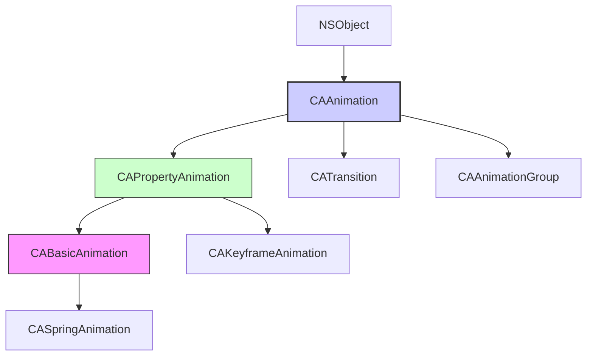

Вот подробная статья для Obsidian по термину **CAAnimation** в контексте iOS-разработки на Swift/UIKit. Текст содержит определения, архитектуру, иерархию классов, детальное описание свойств, примеры кода от простого к сложному (базовые анимации, группировка, ключевые кадры), best practices и теги.

---
### Теги
`#core-animation` `#animation` `#cabasicanimation` `#cakeyframeanimation` `#catransaction` `#uikit` `#ios`

---

## CAAnimation

### Определение
**CAAnimation** — это абстрактный базовый класс во фреймворке Core Animation, который представляет собой анимацию, применяемую к слою (`CALayer`). Он является основой всей системы анимации в iOS и macOS, позволяя анимировать свойства слоев (позицию, размер, цвет, прозрачность и т.д.) с высокой производительностью благодаря аппаратному ускорению .

Core Animation — это не просто библиотека для анимации, а целая инфраструктура для композитинга и рендеринга, которая работает на уровне GPU. `CAAnimation` и его подклассы предоставляют высокоуровневый API для создания сложных анимаций с минимальными затратами ресурсов.

### Зачем это знать iOS-разработчику?
1.  **Создание плавных анимаций:** Core Animation обеспечивает 60 FPS анимации с аппаратным ускорением.
2.  **Гибкость и контроль:** В отличие от `UIView.animate`, `CAAnimation` предоставляет гораздо больше контроля над параметрами анимации.
3.  **Анимация свойств слоя:** Многие свойства `CALayer` (например, `cornerRadius`, `shadowPath`) не анимируются через `UIView.animate`, но отлично анимируются через Core Animation.
4.  **Комплексные анимации:** Группировка анимаций, анимация по ключевым кадрам, временные функции и многое другое.
5.  **Производительность:** Core Animation работает на отдельном процессе (render server) и использует GPU.

---

### Иерархия классов



### Основные подклассы

| Класс | Описание | Применение |
|-------|----------|------------|
| **CABasicAnimation** | Анимация между двумя значениями | Простые переходы (из A в B) |
| **CAKeyframeAnimation** | Анимация по набору ключевых значений | Сложные траектории, пульсации |
| **CAAnimationGroup** | Группировка нескольких анимаций | Параллельное выполнение анимаций |
| **CATransition** | Переходы между состояниями слоя | Смена контента, эффекты появления |
| **CASpringAnimation** | Пружинная анимация | Естественные, реалистичные движения |

### Ключевые свойства CAAnimation

#### Общие свойства
- `duration` (`CFTimeInterval`) — длительность анимации в секундах .
- `repeatCount` (`Float`) — количество повторений анимации (можно использовать `Float.infinity` для бесконечного повторения) .
- `repeatDuration` (`CFTimeInterval`) — общая длительность повторений .
- `autoreverses` (`Bool`) — если `true`, анимация выполняется в обратном направлении после завершения .
- `timingFunction` (`CAMediaTimingFunction?`) — функция времени, определяющая скорость анимации (ease-in, ease-out, linear и т.д.) .
- `delegate` (`CAAnimationDelegate?`) — делегат для получения уведомлений о начале и завершении анимации .
- `isRemovedOnCompletion` (`Bool`) — удаляется ли анимация после завершения (по умолчанию `true`) .
- `fillMode` (`CAMediaTimingFillMode`) — определяет поведение слоя до начала и после окончания анимации .

#### Свойства для временного управления
- `beginTime` (`CFTimeInterval`) — время начала анимации относительно родительской группы или слоя .
- `timeOffset` (`CFTimeInterval`) — смещение времени для "проигрывания" анимации с определенной позиции .
- `speed` (`Float`) — скорость воспроизведения анимации (2.0 — в два раза быстрее) .

---

### Примеры использования

#### Уровень 1: Базовая анимация позиции (CABasicAnimation)
Простейший пример — перемещение слоя из точки А в точку Б.

```swift
import UIKit
import QuartzCore

class BasicAnimationViewController: UIViewController {
    
    let animatedLayer = CALayer()
    
    override func viewDidLoad() {
        super.viewDidLoad()
        setupLayer()
    }
    
    private func setupLayer() {
        animatedLayer.frame = CGRect(x: 50, y: 100, width: 100, height: 100)
        animatedLayer.backgroundColor = UIColor.systemRed.cgColor
        animatedLayer.cornerRadius = 10
        view.layer.addSublayer(animatedLayer)
    }
    
    @IBAction func startAnimation() {
        // 1. Создаем базовую анимацию для свойства "position"
        let animation = CABasicAnimation(keyPath: "position")
        
        // 2. Настраиваем параметры
        animation.fromValue = CGPoint(x: 50, y: 150)
        animation.toValue = CGPoint(x: 300, y: 150)
        animation.duration = 2.0
        animation.timingFunction = CAMediaTimingFunction(name: .easeInEaseOut)
        
        // 3. Анимация автоматически вернет слой в исходное состояние после завершения,
        //    если не установить fillMode и не обновить модельное значение
        animation.fillMode = .forwards
        animation.isRemovedOnCompletion = false
        
        // 4. Добавляем анимацию к слою
        animatedLayer.add(animation, forKey: "positionAnimation")
        
        // 5. Важно: обновляем фактическое значение слоя, чтобы он остался в конечной позиции
        animatedLayer.position = CGPoint(x: 300, y: 150)
    }
}
```

#### Уровень 2: Анимация с делегатом
Отслеживание начала и завершения анимации.

```swift
import UIKit
import QuartzCore

class DelegateAnimationViewController: UIViewController, CAAnimationDelegate {
    
    let animatedLayer = CALayer()
    let statusLabel = UILabel()
    
    override func viewDidLoad() {
        super.viewDidLoad()
        setupUI()
        setupLayer()
    }
    
    private func setupUI() {
        statusLabel.frame = CGRect(x: 20, y: 300, width: view.bounds.width - 40, height: 40)
        statusLabel.textAlignment = .center
        statusLabel.textColor = .black
        statusLabel.text = "Готов к анимации"
        view.addSubview(statusLabel)
    }
    
    private func setupLayer() {
        animatedLayer.frame = CGRect(x: 50, y: 100, width: 100, height: 100)
        animatedLayer.backgroundColor = UIColor.systemBlue.cgColor
        animatedLayer.cornerRadius = 10
        view.layer.addSublayer(animatedLayer)
    }
    
    @IBAction func startAnimation() {
        let animation = CABasicAnimation(keyPath: "opacity")
        animation.fromValue = 1.0
        animation.toValue = 0.2
        animation.duration = 1.5
        animation.autoreverses = true
        animation.repeatCount = 3
        
        // Устанавливаем делегат
        animation.delegate = self
        
        // Сохраняем ссылку на анимацию для идентификации в делегате
        animation.setValue("opacityAnimation", forKey: "animationID")
        
        animatedLayer.add(animation, forKey: "opacityAnimation")
        
        // Обновляем модельное значение
        animatedLayer.opacity = 0.2
    }
    
    // MARK: - CAAnimationDelegate
    func animationDidStart(_ anim: CAAnimation) {
        if let id = anim.value(forKey: "animationID") as? String {
            DispatchQueue.main.async {
                self.statusLabel.text = "Анимация \(id) началась"
                self.statusLabel.textColor = .blue
            }
        }
    }
    
    func animationDidStop(_ anim: CAAnimation, finished flag: Bool) {
        if let id = anim.value(forKey: "animationID") as? String {
            DispatchQueue.main.async {
                self.statusLabel.text = flag ? "Анимация \(id) завершена" : "Анимация \(id) прервана"
                self.statusLabel.textColor = flag ? .green : .red
            }
        }
    }
}
```

#### Уровень 3: Анимация по ключевым кадрам (CAKeyframeAnimation)
Создание сложной траектории движения.

```swift
import UIKit
import QuartzCore

class KeyframeAnimationViewController: UIViewController {
    
    let animatedLayer = CALayer()
    
    override func viewDidLoad() {
        super.viewDidLoad()
        setupLayer()
    }
    
    private func setupLayer() {
        animatedLayer.frame = CGRect(x: 50, y: 100, width: 60, height: 60)
        animatedLayer.backgroundColor = UIColor.systemGreen.cgColor
        animatedLayer.cornerRadius = 30 // Круг
        view.layer.addSublayer(animatedLayer)
    }
    
    @IBAction func startPathAnimation() {
        // 1. Создаем анимацию по ключевым кадрам для позиции
        let animation = CAKeyframeAnimation(keyPath: "position")
        
        // 2. Создаем путь (кривая Безье)
        let path = UIBezierPath()
        path.move(to: CGPoint(x: 50, y: 150))
        path.addCurve(to: CGPoint(x: 300, y: 150),
                      controlPoint1: CGPoint(x: 120, y: 50),
                      controlPoint2: CGPoint(x: 230, y: 250))
        
        animation.path = path.cgPath
        animation.duration = 3.0
        animation.timingFunction = CAMediaTimingFunction(name: .easeInEaseOut)
        
        // 3. Добавляем анимацию
        animatedLayer.add(animation, forKey: "pathAnimation")
        
        // 4. Обновляем модельное значение (конечная точка пути)
        animatedLayer.position = CGPoint(x: 300, y: 150)
    }
    
    @IBAction func startRotationAnimation() {
        // Анимация вращения с ключевыми кадрами
        let animation = CAKeyframeAnimation(keyPath: "transform.rotation.z")
        
        // Значения в радианах
        animation.values = [0, .pi / 4, .pi / 2, .pi, 2 * .pi]
        animation.keyTimes = [0, 0.25, 0.5, 0.75, 1.0]
        animation.duration = 2.0
        animation.repeatCount = .infinity
        
        animatedLayer.add(animation, forKey: "rotationAnimation")
    }
}
```

#### Уровень 4: Группировка анимаций (CAAnimationGroup)
Одновременное выполнение нескольких анимаций.

```swift
import UIKit
import QuartzCore

class GroupAnimationViewController: UIViewController {
    
    let animatedLayer = CALayer()
    
    override func viewDidLoad() {
        super.viewDidLoad()
        setupLayer()
    }
    
    private func setupLayer() {
        animatedLayer.frame = CGRect(x: 50, y: 150, width: 100, height: 100)
        animatedLayer.backgroundColor = UIColor.systemOrange.cgColor
        animatedLayer.cornerRadius = 10
        view.layer.addSublayer(animatedLayer)
    }
    
    @IBAction func startGroupAnimation() {
        // 1. Анимация позиции
        let positionAnimation = CABasicAnimation(keyPath: "position")
        positionAnimation.fromValue = CGPoint(x: 50, y: 200)
        positionAnimation.toValue = CGPoint(x: 300, y: 200)
        
        // 2. Анимация вращения
        let rotationAnimation = CABasicAnimation(keyPath: "transform.rotation.z")
        rotationAnimation.fromValue = 0
        rotationAnimation.toValue = Double.pi * 2 // Полный оборот
        
        // 3. Анимация масштаба
        let scaleAnimation = CABasicAnimation(keyPath: "transform.scale")
        scaleAnimation.fromValue = 1.0
        scaleAnimation.toValue = 1.5
        scaleAnimation.autoreverses = true
        
        // 4. Анимация цвета фона
        let colorAnimation = CABasicAnimation(keyPath: "backgroundColor")
        colorAnimation.fromValue = UIColor.systemOrange.cgColor
        colorAnimation.toValue = UIColor.systemPurple.cgColor
        
        // 5. Создаем группу
        let group = CAAnimationGroup()
        group.animations = [positionAnimation, rotationAnimation, scaleAnimation, colorAnimation]
        group.duration = 2.0
        group.timingFunction = CAMediaTimingFunction(name: .easeInEaseOut)
        
        // 6. Добавляем группу к слою
        animatedLayer.add(group, forKey: "groupAnimation")
        
        // 7. Обновляем модельные значения
        animatedLayer.position = CGPoint(x: 300, y: 200)
        animatedLayer.backgroundColor = UIColor.systemPurple.cgColor
        // transform применять не нужно, так как он вернется к исходному
    }
}
```

#### Уровень 5: Пружинная анимация (CASpringAnimation)
Естественные, реалистичные движения.

```swift
import UIKit
import QuartzCore

class SpringAnimationViewController: UIViewController {
    
    let animatedLayer = CALayer()
    
    override func viewDidLoad() {
        super.viewDidLoad()
        setupLayer()
    }
    
    private func setupLayer() {
        animatedLayer.frame = CGRect(x: 50, y: 200, width: 80, height: 80)
        animatedLayer.backgroundColor = UIColor.systemPink.cgColor
        animatedLayer.cornerRadius = 40
        view.layer.addSublayer(animatedLayer)
    }
    
    @IBAction func startSpringAnimation() {
        // Создаем пружинную анимацию
        let animation = CASpringAnimation(keyPath: "position.x")
        
        animation.fromValue = 90
        animation.toValue = 300
        animation.duration = animation.settlingDuration // Время до полной остановки
        
        // Настройка пружины
        animation.stiffness = 100.0      // Жесткость (чем выше, тем быстрее)
        animation.damping = 10.0         // Затухание (чем выше, тем быстрее остановка)
        animation.mass = 1.0             // Масса (чем выше, тем медленнее)
        animation.initialVelocity = 0.0  // Начальная скорость
        
        // Функция времени для более естественного движения
        animation.timingFunction = CAMediaTimingFunction(name: .easeInEaseOut)
        
        animatedLayer.add(animation, forKey: "springAnimation")
        animatedLayer.position.x = 300
    }
}
```

#### Уровень 6: Анимация свойств, не поддерживаемых UIView.animate
Анимация углов скругления и тени.

```swift
import UIKit
import QuartzCore

class AdvancedPropertiesViewController: UIViewController {
    
    let animatedView = UIView()
    
    override func viewDidLoad() {
        super.viewDidLoad()
        setupView()
    }
    
    private func setupView() {
        animatedView.frame = CGRect(x: 100, y: 200, width: 150, height: 150)
        animatedView.backgroundColor = .systemTeal
        view.addSubview(animatedView)
    }
    
    @IBAction func animateCornerRadius() {
        // cornerRadius не анимируется через UIView.animate, но анимируется через Core Animation
        let animation = CABasicAnimation(keyPath: "cornerRadius")
        animation.fromValue = 0
        animation.toValue = 75
        animation.duration = 1.5
        animation.autoreverses = true
        animation.repeatCount = 2
        
        animatedView.layer.add(animation, forKey: "cornerRadiusAnimation")
        animatedView.layer.cornerRadius = 75 // Модельное значение
    }
    
    @IBAction func animateShadow() {
        // Настройка тени
        animatedView.layer.shadowColor = UIColor.black.cgColor
        animatedView.layer.shadowOffset = CGSize(width: 0, height: 3)
        animatedView.layer.shadowRadius = 5
        
        // Анимация прозрачности тени
        let opacityAnimation = CABasicAnimation(keyPath: "shadowOpacity")
        opacityAnimation.fromValue = 0
        opacityAnimation.toValue = 0.8
        opacityAnimation.duration = 1.0
        
        // Анимация радиуса тени
        let radiusAnimation = CABasicAnimation(keyPath: "shadowRadius")
        radiusAnimation.fromValue = 5
        radiusAnimation.toValue = 20
        radiusAnimation.duration = 1.0
        
        let group = CAAnimationGroup()
        group.animations = [opacityAnimation, radiusAnimation]
        group.duration = 1.0
        group.autoreverses = true
        group.repeatCount = 3
        
        animatedView.layer.add(group, forKey: "shadowAnimation")
        animatedView.layer.shadowOpacity = 0.8
        animatedView.layer.shadowRadius = 20
    }
}
```

#### Уровень 7: CATransition — переходы между состояниями
Эффекты смены контента.

```swift
import UIKit
import QuartzCore

class TransitionViewController: UIViewController {
    
    let imageView = UIImageView()
    let images = [UIImage(systemName: "star.fill"), 
                  UIImage(systemName: "heart.fill"),
                  UIImage(systemName: "bolt.fill")]
    var currentIndex = 0
    
    override func viewDidLoad() {
        super.viewDidLoad()
        setupImageView()
    }
    
    private func setupImageView() {
        imageView.frame = CGRect(x: 100, y: 200, width: 200, height: 200)
        imageView.contentMode = .scaleAspectFit
        imageView.tintColor = .systemBlue
        imageView.image = images[currentIndex]
        view.addSubview(imageView)
    }
    
    @IBAction func nextImage() {
        currentIndex = (currentIndex + 1) % images.count
        
        // Создаем переход
        let transition = CATransition()
        transition.duration = 0.5
        transition.type = .fade // .push, .moveIn, .reveal
        transition.subtype = .fromRight // Направление для push
        
        // Функция времени
        transition.timingFunction = CAMediaTimingFunction(name: .easeInEaseOut)
        
        // Добавляем переход к слою
        imageView.layer.add(transition, forKey: "transition")
        
        // Меняем изображение
        imageView.image = images[currentIndex]
    }
    
    @IBAction func nextWithPush() {
        currentIndex = (currentIndex + 1) % images.count
        
        let transition = CATransition()
        transition.duration = 0.4
        transition.type = .push
        transition.subtype = .fromTop
        
        imageView.layer.add(transition, forKey: "pushTransition")
        imageView.image = images[currentIndex]
    }
}
```

#### Уровень 8: Управление временем (beginTime, timeOffset)
Создание последовательных анимаций.

```swift
import UIKit
import QuartzCore

class TimingViewController: UIViewController {
    
    let layer1 = CALayer()
    let layer2 = CALayer()
    let layer3 = CALayer()
    
    override func viewDidLoad() {
        super.viewDidLoad()
        setupLayers()
    }
    
    private func setupLayers() {
        for (index, layer) in [layer1, layer2, layer3].enumerated() {
            layer.frame = CGRect(x: 50, y: 100 + CGFloat(index * 120), width: 60, height: 60)
            layer.backgroundColor = UIColor(hue: CGFloat(index) * 0.3, 
                                           saturation: 0.8, 
                                           brightness: 0.8, 
                                           alpha: 1.0).cgColor
            layer.cornerRadius = 30
            view.layer.addSublayer(layer)
        }
    }
    
    @IBAction func startSequentialAnimation() {
        // Анимация для первого слоя (начинается сразу)
        let anim1 = CABasicAnimation(keyPath: "position.x")
        anim1.fromValue = 80
        anim1.toValue = 300
        anim1.duration = 1.0
        
        // Анимация для второго слоя (начинается через 0.5 сек)
        let anim2 = CABasicAnimation(keyPath: "position.x")
        anim2.fromValue = 80
        anim2.toValue = 300
        anim2.duration = 1.0
        anim2.beginTime = CACurrentMediaTime() + 0.5 // Абсолютное время
        
        // Анимация для третьего слоя (начинается через 1.0 сек)
        let anim3 = CABasicAnimation(keyPath: "position.x")
        anim3.fromValue = 80
        anim3.toValue = 300
        anim3.duration = 1.0
        anim3.beginTime = CACurrentMediaTime() + 1.0
        
        layer1.add(anim1, forKey: nil)
        layer2.add(anim2, forKey: nil)
        layer3.add(anim3, forKey: nil)
        
        // Обновляем модельные значения
        layer1.position.x = 300
        layer2.position.x = 300
        layer3.position.x = 300
    }
    
    @IBAction func startGroupedSequential() {
        // Использование beginTime относительно группы
        let anim1 = CABasicAnimation(keyPath: "position.x")
        anim1.fromValue = 80
        anim1.toValue = 300
        anim1.duration = 1.0
        anim1.beginTime = 0.0
        
        let anim2 = CABasicAnimation(keyPath: "position.x")
        anim2.fromValue = 80
        anim2.toValue = 300
        anim2.duration = 1.0
        anim2.beginTime = 0.5
        
        let anim3 = CABasicAnimation(keyPath: "position.x")
        anim3.fromValue = 80
        anim3.toValue = 300
        anim3.duration = 1.0
        anim3.beginTime = 1.0
        
        let group = CAAnimationGroup()
        group.animations = [anim1, anim2, anim3]
        group.duration = 2.0
        
        // Применяем группу ко всем слоям
        layer1.add(group, forKey: "group")
        layer2.add(group, forKey: "group")
        layer3.add(group, forKey: "group")
    }
}
```

---

### CAAnimation vs UIView.animate

| Характеристика | CAAnimation | UIView.animate |
|---|---|---|
| **Уровень API** | Низкоуровневый (Core Animation) | Высокоуровневый (UIKit) |
| **Анимируемые свойства** | Все свойства CALayer | Ограниченный набор свойств UIView |
| **Гибкость** | Высокая (ключевые кадры, группы, траектории) | Средняя |
| **Сложность** | Выше | Ниже |
| **Производительность** | Максимальная (GPU) | Хорошая |
| **Контроль времени** | Детальный (beginTime, timeOffset) | Базовый |
| **Когда использовать** | Сложные анимации, анимация свойств слоя, максимальная производительность | Простые анимации, анимация UIView-специфичных свойств |

### Best Practices

#### 1. **Всегда обновляйте модельное значение**
После добавления анимации обновите фактическое значение свойства слоя, чтобы после удаления анимации слой остался в правильном состоянии .

```swift
layer.add(animation, forKey: "key")
layer.opacity = 0.5 // Модельное значение
```

#### 2. **Используйте fillMode и isRemovedOnCompletion правильно**
- `fillMode = .forwards` + `isRemovedOnCompletion = false` — слой остается в конечном состоянии анимации
- `fillMode = .removed` — слой возвращается в исходное состояние

#### 3. **Уникальные ключи для анимаций**
Используйте осмысленные ключи для добавления анимаций, чтобы иметь возможность их идентифицировать и удалять .

```swift
layer.add(animation, forKey: "scaleAnimation")
layer.removeAnimation(forKey: "scaleAnimation")
```

#### 4. **Производительность**
- Анимируйте только те свойства, которые действительно нужно анимировать
- Избегайте анимации `frame` — используйте `position` и `bounds`
- Для сложных анимаций используйте `shouldRasterize` для кэширования слоев

#### 5. **Отмена анимаций**
```swift
layer.removeAllAnimations() // Удалить все анимации
layer.removeAnimation(forKey: "specificAnimation") // Удалить конкретную
```

#### 6. **Пауза и возобновление анимаций**
```swift
func pauseAnimation(layer: CALayer) {
    let pausedTime = layer.convertTime(CACurrentMediaTime(), from: nil)
    layer.speed = 0.0
    layer.timeOffset = pausedTime
}

func resumeAnimation(layer: CALayer) {
    let pausedTime = layer.timeOffset
    layer.speed = 1.0
    layer.timeOffset = 0.0
    layer.beginTime = 0.0
    let timeSincePause = layer.convertTime(CACurrentMediaTime(), from: nil) - pausedTime
    layer.beginTime = timeSincePause
}
```

### Итог
**CAAnimation** — это фундаментальный строительный блок для создания анимаций в iOS. Он предоставляет:

- **Высокую производительность** благодаря аппаратному ускорению
- **Гибкость** в создании сложных анимаций
- **Детальный контроль** над временем и параметрами
- **Интеграцию** с CALayer для анимации практически любых свойств

Понимание Core Animation и CAAnimation необходимо для создания плавных, производительных и визуально привлекательных интерфейсов в iOS-приложениях.