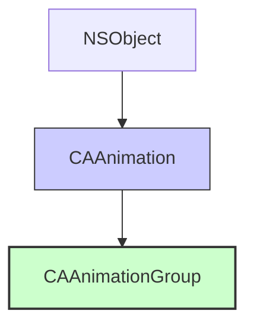

#core-animation #animation #caanimationgroup #group-animation #cabasicanimation #cakeyframeanimation #ios

---
## CAAnimationGroup

### Определение
**CAAnimationGroup** — это конкретный подкласс [[CAAnimation]] во фреймворке [[Core Animation]], который позволяет объединять несколько анимаций в одну группу для одновременного выполнения. Группа управляет временем выполнения всех входящих в нее анимаций, позволяя синхронизировать их начало, длительность и другие временные параметры .

Этот класс является мощным инструментом для создания сложных, многокомпонентных анимаций, где несколько свойств слоя должны анимироваться согласованно. Вместо того чтобы добавлять несколько отдельных анимаций к слою и пытаться синхронизировать их вручную, `CAAnimationGroup` предоставляет единый контейнер с общими временными настройками.

### Зачем это знать [[iOS]]-разработчику?
1.  **Синхронизация анимаций:** Гарантирует, что все анимации в группе начинаются и заканчиваются одновременно (относительно друг друга).
2.  **Упрощение управления:** Вместо нескольких вызовов `add(_:forKey:)` — один вызов для всей группы.
3.  **Относительное время:** Анимации внутри группы могут иметь собственные `beginTime`, которые интерпретируются относительно начала группы.
4.  **Сложные эффекты:** Позволяет создавать комплексные анимации, где одновременно изменяются положение, размер, цвет и прозрачность.
5.  **Повторное использование:** Группу можно настроить один раз и применять к разным слоям.

---

### Иерархия наследования



### Ключевые свойства

#### Свойства из CAAnimation
- `duration` (`CFTimeInterval`) — длительность всей группы. Если не указана, используется максимальная длительность из дочерних анимаций .
- `repeatCount` ([[Float]]) — количество повторений группы .
- `repeatDuration` (`CFTimeInterval`) — общая длительность повторений .
- `autoreverses` ([[Bool]]) — если `true`, вся группа выполняется в обратном направлении после завершения .
- `timingFunction` (`CAMediaTimingFunction?`) — функция времени для всей группы .
- `beginTime` (`CFTimeInterval`) — время начала группы относительно родительского слоя .
- `fillMode` (`CAMediaTimingFillMode`) — определяет поведение до начала и после окончания .

#### Специфическое свойство CAAnimationGroup
- `animations` (`[CAAnimation]?`) — массив анимаций, входящих в группу. Эти анимации будут выполняться одновременно (если не заданы индивидуальные `beginTime`) .

---

### Примеры использования

#### Уровень 1: Базовая группа анимаций
Простейший пример — одновременное изменение позиции, размера и цвета.

```swift
import UIKit
import QuartzCore

class BasicGroupViewController: UIViewController {
    
    let animatedLayer = CALayer()
    
    override func viewDidLoad() {
        super.viewDidLoad()
        setupLayer()
    }
    
    private func setupLayer() {
        animatedLayer.frame = CGRect(x: 100, y: 200, width: 100, height: 100)
        animatedLayer.backgroundColor = UIColor.systemRed.cgColor
        animatedLayer.cornerRadius = 10
        view.layer.addSublayer(animatedLayer)
    }
    
    @IBAction func startGroupAnimation() {
        // 1. Анимация позиции
        let positionAnimation = CABasicAnimation(keyPath: "position")
        positionAnimation.fromValue = CGPoint(x: 150, y: 250)
        positionAnimation.toValue = CGPoint(x: 300, y: 250)
        
        // 2. Анимация размера
        let boundsAnimation = CABasicAnimation(keyPath: "bounds.size")
        boundsAnimation.fromValue = CGSize(width: 100, height: 100)
        boundsAnimation.toValue = CGSize(width: 150, height: 150)
        
        // 3. Анимация цвета
        let colorAnimation = CABasicAnimation(keyPath: "backgroundColor")
        colorAnimation.fromValue = UIColor.systemRed.cgColor
        colorAnimation.toValue = UIColor.systemBlue.cgColor
        
        // 4. Анимация прозрачности
        let opacityAnimation = CABasicAnimation(keyPath: "opacity")
        opacityAnimation.fromValue = 1.0
        opacityAnimation.toValue = 0.5
        
        // 5. Создаем группу
        let group = CAAnimationGroup()
        group.animations = [positionAnimation, boundsAnimation, colorAnimation, opacityAnimation]
        group.duration = 2.0
        group.timingFunction = CAMediaTimingFunction(name: .easeInEaseOut)
        
        // 6. Добавляем группу к слою
        animatedLayer.add(group, forKey: "basicGroup")
        
        // 7. Обновляем модельные значения
        animatedLayer.position = CGPoint(x: 300, y: 250)
        animatedLayer.bounds.size = CGSize(width: 150, height: 150)
        animatedLayer.backgroundColor = UIColor.systemBlue.cgColor
        animatedLayer.opacity = 0.5
    }
}
```

#### Уровень 2: Группа с относительным временем (beginTime)
Создание последовательных анимаций внутри группы.

```swift
import UIKit
import QuartzCore

class SequentialGroupViewController: UIViewController {
    
    let animatedLayer = CALayer()
    
    override func viewDidLoad() {
        super.viewDidLoad()
        setupLayer()
    }
    
    private func setupLayer() {
        animatedLayer.frame = CGRect(x: 100, y: 200, width: 80, height: 80)
        animatedLayer.backgroundColor = UIColor.systemGreen.cgColor
        animatedLayer.cornerRadius = 40
        view.layer.addSublayer(animatedLayer)
    }
    
    @IBAction func startSequentialAnimation() {
        // 1. Первая анимация: движение вправо (0-1 сек)
        let moveRight = CABasicAnimation(keyPath: "position.x")
        moveRight.fromValue = 140
        moveRight.toValue = 250
        moveRight.duration = 1.0
        moveRight.beginTime = 0.0
        
        // 2. Вторая анимация: движение вниз (1-2 сек)
        let moveDown = CABasicAnimation(keyPath: "position.y")
        moveDown.fromValue = 240
        moveDown.toValue = 350
        moveDown.duration = 1.0
        moveDown.beginTime = 1.0
        
        // 3. Третья анимация: изменение цвета (2-3 сек)
        let changeColor = CABasicAnimation(keyPath: "backgroundColor")
        changeColor.fromValue = UIColor.systemGreen.cgColor
        changeColor.toValue = UIColor.systemOrange.cgColor
        changeColor.duration = 1.0
        changeColor.beginTime = 2.0
        
        // 4. Группа с общей длительностью 3 секунды
        let group = CAAnimationGroup()
        group.animations = [moveRight, moveDown, changeColor]
        group.duration = 3.0
        
        animatedLayer.add(group, forKey: "sequentialGroup")
        
        // 5. Обновляем модельные значения
        animatedLayer.position = CGPoint(x: 250, y: 350)
        animatedLayer.backgroundColor = UIColor.systemOrange.cgColor
    }
}
```

#### Уровень 3: Группа с повторением и автореверсом
Эффект пульсации с использованием группы.

```swift
import UIKit
import QuartzCore

class PulsingGroupViewController: UIViewController {
    
    let animatedLayer = CALayer()
    
    override func viewDidLoad() {
        super.viewDidLoad()
        setupLayer()
    }
    
    private func setupLayer() {
        animatedLayer.frame = CGRect(x: view.center.x - 50, y: view.center.y - 50, width: 100, height: 100)
        animatedLayer.backgroundColor = UIColor.systemPink.cgColor
        animatedLayer.cornerRadius = 50
        view.layer.addSublayer(animatedLayer)
    }
    
    @IBAction func startPulsingAnimation() {
        // 1. Анимация масштаба
        let scaleAnimation = CABasicAnimation(keyPath: "transform.scale")
        scaleAnimation.fromValue = 1.0
        scaleAnimation.toValue = 1.5
        
        // 2. Анимация прозрачности
        let opacityAnimation = CABasicAnimation(keyPath: "opacity")
        opacityAnimation.fromValue = 1.0
        opacityAnimation.toValue = 0.3
        
        // 3. Группа с автореверсом и повторением
        let group = CAAnimationGroup()
        group.animations = [scaleAnimation, opacityAnimation]
        group.duration = 1.0
        group.autoreverses = true
        group.repeatCount = .infinity
        group.timingFunction = CAMediaTimingFunction(name: .easeInEaseOut)
        
        animatedLayer.add(group, forKey: "pulsingGroup")
        
        // Модельные значения не обновляем, так как анимация бесконечная
    }
}
```

#### Уровень 4: Группа с ключевыми кадрами и базовыми анимациями
Комбинация разных типов анимаций в одной группе.

```swift
import UIKit
import QuartzCore

class MixedGroupViewController: UIViewController {
    
    let animatedLayer = CALayer()
    
    override func viewDidLoad() {
        super.viewDidLoad()
        setupLayer()
    }
    
    private func setupLayer() {
        animatedLayer.frame = CGRect(x: 100, y: 200, width: 60, height: 60)
        animatedLayer.backgroundColor = UIColor.systemPurple.cgColor
        animatedLayer.cornerRadius = 30
        view.layer.addSublayer(animatedLayer)
    }
    
    @IBAction func startMixedAnimation() {
        // 1. Анимация по ключевым кадрам для пути движения
        let pathAnimation = CAKeyframeAnimation(keyPath: "position")
        let path = UIBezierPath()
        path.move(to: CGPoint(x: 130, y: 230))
        path.addCurve(to: CGPoint(x: 300, y: 230),
                     controlPoint1: CGPoint(x: 180, y: 150),
                     controlPoint2: CGPoint(x: 250, y: 300))
        pathAnimation.path = path.cgPath
        pathAnimation.duration = 2.0
        
        // 2. Базовая анимация для вращения
        let rotationAnimation = CABasicAnimation(keyPath: "transform.rotation.z")
        rotationAnimation.fromValue = 0
        rotationAnimation.toValue = Double.pi * 2
        rotationAnimation.duration = 2.0
        
        // 3. Базовая анимация для цвета
        let colorAnimation = CABasicAnimation(keyPath: "backgroundColor")
        colorAnimation.fromValue = UIColor.systemPurple.cgColor
        colorAnimation.toValue = UIColor.systemYellow.cgColor
        colorAnimation.duration = 2.0
        
        // 4. Группа
        let group = CAAnimationGroup()
        group.animations = [pathAnimation, rotationAnimation, colorAnimation]
        group.duration = 2.0
        group.timingFunction = CAMediaTimingFunction(name: .easeInEaseOut)
        
        animatedLayer.add(group, forKey: "mixedGroup")
        
        // Обновляем модельные значения
        animatedLayer.position = CGPoint(x: 300, y: 230)
        animatedLayer.backgroundColor = UIColor.systemYellow.cgColor
    }
}
```

#### Уровень 5: Вложенные группы
Группы внутри групп для сложной иерархической анимации.

```swift
import UIKit
import QuartzCore

class NestedGroupViewController: UIViewController {
    
    let animatedLayer = CALayer()
    
    override func viewDidLoad() {
        super.viewDidLoad()
        setupLayer()
    }
    
    private func setupLayer() {
        animatedLayer.frame = CGRect(x: 100, y: 200, width: 80, height: 80)
        animatedLayer.backgroundColor = UIColor.systemIndigo.cgColor
        animatedLayer.cornerRadius = 40
        view.layer.addSublayer(animatedLayer)
    }
    
    @IBAction func startNestedAnimation() {
        // Внутренняя группа 1: рост и изменение цвета
        let scaleUp = CABasicAnimation(keyPath: "transform.scale")
        scaleUp.fromValue = 1.0
        scaleUp.toValue = 1.5
        scaleUp.duration = 1.0
        
        let colorToRed = CABasicAnimation(keyPath: "backgroundColor")
        colorToRed.fromValue = UIColor.systemIndigo.cgColor
        colorToRed.toValue = UIColor.systemRed.cgColor
        colorToRed.duration = 1.0
        
        let innerGroup1 = CAAnimationGroup()
        innerGroup1.animations = [scaleUp, colorToRed]
        innerGroup1.duration = 1.0
        innerGroup1.beginTime = 0.0
        
        // Внутренняя группа 2: уменьшение и изменение цвета обратно
        let scaleDown = CABasicAnimation(keyPath: "transform.scale")
        scaleDown.fromValue = 1.5
        scaleDown.toValue = 1.0
        scaleDown.duration = 1.0
        
        let colorToIndigo = CABasicAnimation(keyPath: "backgroundColor")
        colorToIndigo.fromValue = UIColor.systemRed.cgColor
        colorToIndigo.toValue = UIColor.systemIndigo.cgColor
        colorToIndigo.duration = 1.0
        
        let innerGroup2 = CAAnimationGroup()
        innerGroup2.animations = [scaleDown, colorToIndigo]
        innerGroup2.duration = 1.0
        innerGroup2.beginTime = 1.0
        
        // Внешняя группа, объединяющая обе внутренние
        let outerGroup = CAAnimationGroup()
        outerGroup.animations = [innerGroup1, innerGroup2]
        outerGroup.duration = 2.0
        
        animatedLayer.add(outerGroup, forKey: "nestedGroup")
        
        // Модельные значения возвращаются к исходным
        animatedLayer.transform = CATransform3DIdentity
        animatedLayer.backgroundColor = UIColor.systemIndigo.cgColor
    }
}
```

#### Уровень 6: Группа с делегатом и обработкой событий
Отслеживание начала и завершения всей группы.

```swift
import UIKit
import QuartzCore

class DelegateGroupViewController: UIViewController, CAAnimationDelegate {
    
    let animatedLayer = CALayer()
    let statusLabel = UILabel()
    
    override func viewDidLoad() {
        super.viewDidLoad()
        setupUI()
        setupLayer()
    }
    
    private func setupUI() {
        statusLabel.frame = CGRect(x: 20, y: 350, width: view.bounds.width - 40, height: 40)
        statusLabel.textAlignment = .center
        statusLabel.textColor = .black
        statusLabel.text = "Готов к анимации"
        view.addSubview(statusLabel)
    }
    
    private func setupLayer() {
        animatedLayer.frame = CGRect(x: 100, y: 200, width: 100, height: 100)
        animatedLayer.backgroundColor = UIColor.systemTeal.cgColor
        animatedLayer.cornerRadius = 10
        view.layer.addSublayer(animatedLayer)
    }
    
    @IBAction func startDelegateGroup() {
        // Анимации
        let positionAnimation = CABasicAnimation(keyPath: "position.x")
        positionAnimation.fromValue = 150
        positionAnimation.toValue = 300
        
        let rotationAnimation = CABasicAnimation(keyPath: "transform.rotation.z")
        rotationAnimation.fromValue = 0
        rotationAnimation.toValue = Double.pi
        
        // Группа
        let group = CAAnimationGroup()
        group.animations = [positionAnimation, rotationAnimation]
        group.duration = 2.0
        group.delegate = self
        
        // Сохраняем идентификатор для делегата
        group.setValue("mainGroup", forKey: "animationID")
        
        animatedLayer.add(group, forKey: "delegateGroup")
        
        // Обновляем модельные значения
        animatedLayer.position.x = 300
        // transform не обновляем, так как анимация автореверса нет
    }
    
    // MARK: - CAAnimationDelegate
    func animationDidStart(_ anim: CAAnimation) {
        if let id = anim.value(forKey: "animationID") as? String {
            DispatchQueue.main.async {
                self.statusLabel.text = "Группа \(id) началась"
                self.statusLabel.textColor = .blue
            }
        }
    }
    
    func animationDidStop(_ anim: CAAnimation, finished flag: Bool) {
        if let id = anim.value(forKey: "animationID") as? String {
            DispatchQueue.main.async {
                self.statusLabel.text = flag ? "Группа \(id) завершена" : "Группа \(id) прервана"
                self.statusLabel.textColor = flag ? .green : .red
            }
        }
    }
}
```

#### Уровень 7: Применение группы к нескольким слоям
Одна и та же группа анимаций для разных слоев.

```swift
import UIKit
import QuartzCore

class MultiLayerGroupViewController: UIViewController {
    
    let layer1 = CALayer()
    let layer2 = CALayer()
    let layer3 = CALayer()
    
    override func viewDidLoad() {
        super.viewDidLoad()
        setupLayers()
    }
    
    private func setupLayers() {
        let colors: [UIColor] = [.systemRed, .systemGreen, .systemBlue]
        
        for (index, layer) in [layer1, layer2, layer3].enumerated() {
            layer.frame = CGRect(x: 50 + CGFloat(index * 100), y: 200, width: 60, height: 60)
            layer.backgroundColor = colors[index].cgColor
            layer.cornerRadius = 30
            view.layer.addSublayer(layer)
        }
    }
    
    @IBAction func animateAllLayers() {
        // Создаем общую группу анимаций
        let moveUp = CABasicAnimation(keyPath: "position.y")
        moveUp.fromValue = 230
        moveUp.toValue = 150
        moveUp.duration = 1.0
        
        let fadeOut = CABasicAnimation(keyPath: "opacity")
        fadeOut.fromValue = 1.0
        fadeOut.toValue = 0.3
        fadeOut.duration = 1.0
        
        let scale = CABasicAnimation(keyPath: "transform.scale")
        scale.fromValue = 1.0
        scale.toValue = 1.5
        scale.duration = 1.0
        
        let group = CAAnimationGroup()
        group.animations = [moveUp, fadeOut, scale]
        group.duration = 1.0
        group.autoreverses = true
        group.repeatCount = 2
        
        // Применяем одну группу ко всем слоям
        layer1.add(group, forKey: "multiGroup")
        layer2.add(group, forKey: "multiGroup")
        layer3.add(group, forKey: "multiGroup")
    }
}
```

---

### CAAnimationGroup vs Индивидуальные анимации

| Характеристика | CAAnimationGroup | Индивидуальные анимации |
|---|---|---|
| **Синхронизация** | Автоматическая, единое время | Ручная, сложно синхронизировать |
| **Управление** | Один вызов `add(_:forKey:)` | Множественные вызовы |
| **Общие параметры** | `duration`, `repeatCount` применяются ко всем анимациям | Каждая анимация настраивается отдельно |
| **Относительное время** | `beginTime` интерпретируется относительно начала группы | `beginTime` абсолютное или относительно слоя |
| **Сложность кода** | Ниже для групп анимаций | Выше при большом количестве анимаций |
| **Гибкость** | Высокая, но анимации связаны | Максимальная, полная независимость |

### Best Practices

#### 1. **Всегда устанавливайте duration для группы**
Если не указать `duration`, группа возьмет максимальную длительность из дочерних анимаций. Лучше всегда задавать явно.

#### 2. **Используйте beginTime для последовательных анимаций**
Для создания цепочки анимаций внутри группы задавайте `beginTime` дочерним анимациям относительно 0.

```swift
anim1.beginTime = 0.0
anim2.beginTime = 1.0 // начинается через 1 секунду после начала группы
```

#### 3. **Не забывайте обновлять модельные значения**
После добавления группы обновите фактические значения свойств слоя, чтобы после удаления анимации слой остался в правильном состоянии.

#### 4. **Используйте fillMode при необходимости**
Если нужно, чтобы слой оставался в конечном состоянии после анимации:

```swift
group.fillMode = .forwards
group.isRemovedOnCompletion = false
// + обновление модельных значений
```

#### 5. **Проверяйте совместимость анимаций**
Не все анимации хорошо работают вместе. Например, одновременная анимация `transform.scale` и `transform.rotation` может конфликтовать. Используйте `CAKeyframeAnimation` с несколькими трансформациями, если нужно.

#### 6. **Оптимизация**
- Для повторяющихся анимаций создавайте группу один раз и применяйте к разным слоям.
- Избегайте слишком большого количества анимаций в одной группе.

### Итог
**CAAnimationGroup** — это мощный инструмент для создания сложных, многокомпонентных анимаций. Он предоставляет:

- **Единое управление** набором анимаций
- **Точную синхронизацию** времени выполнения
- **Гибкость** в создании последовательных и параллельных эффектов
- **Возможность повторного использования** групп анимаций

Этот класс незаменим при создании комплексных анимационных эффектов, где несколько свойств должны изменяться согласованно и с точным временным контролем.