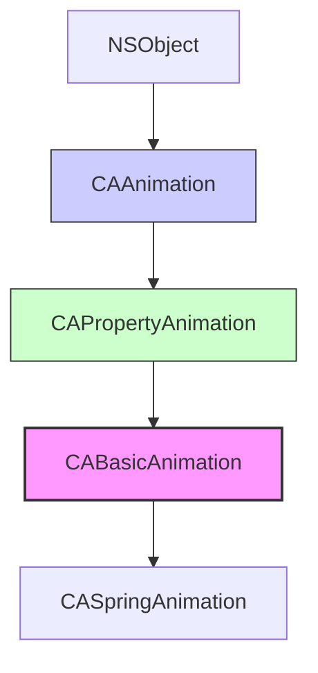

#core-animation #animation #cabasicanimation #cabasicanimation #calayer #uikit #ios

---
## CABasicAnimation

### Определение
**CABasicAnimation** — это конкретный подкласс [[CAPropertyAnimation]] (который сам является подклассом [[CAAnimation]]) во фреймворке [[Core Animation]]. Он обеспечивает простую интерполяцию между двумя значениями для указанного свойства слоя ([[CALayer]]) .

Простыми словами, `CABasicAnimation` позволяет анимировать изменение свойства слоя от начального значения к конечному за определенный промежуток времени. Это фундаментальный строительный блок для создания анимаций в [[iOS]], предоставляющий гораздо больше контроля, чем высокоуровневые `UIView.animate` методы.

### Зачем это знать iOS-разработчику?
1.  **Анимация свойств CALayer:** Многие свойства слоя (например, `cornerRadius`, `shadowPath`, `borderWidth`) не анимируются через `UIView.animate`, но отлично анимируются через `CABasicAnimation`.
2.  **Тонкий контроль:** Предоставляет детальный контроль над параметрами анимации: длительность, повторения, автореверс, функции времени.
3.  **Производительность:** Core Animation работает на отдельном процессе (render server) и использует GPU, обеспечивая 60 FPS анимации.
4.  **Гибкость:** Можно анимировать практически любое свойство слоя, включая кастомные свойства.
5.  **Интеграция с CAAnimationGroup:** Является основным компонентом для создания сложных групповых анимаций.

---

### Иерархия наследования



### Ключевые свойства

#### Свойства из CAAnimation
- `duration` (`CFTimeInterval`) — длительность анимации в секундах .
- `repeatCount` ([[Float]]) — количество повторений анимации (можно использовать `Float.infinity` для бесконечного повторения) .
- `repeatDuration` (`CFTimeInterval`) — общая длительность повторений .
- `autoreverses` ([[Bool]]) — если `true`, анимация выполняется в обратном направлении после завершения .
- `timingFunction` (`CAMediaTimingFunction?`) — функция времени, определяющая скорость анимации (ease-in, ease-out, linear и т.д.) .
- `delegate` (`CAAnimationDelegate?`) — делегат для получения уведомлений о начале и завершении анимации .
- `isRemovedOnCompletion` (`Bool`) — удаляется ли анимация после завершения (по умолчанию `true`) .
- `fillMode` (`CAMediaTimingFillMode`) — определяет поведение слоя до начала и после окончания анимации .

#### Свойства из CAPropertyAnimation
- `keyPath` (`String`) — путь к свойству слоя, которое нужно анимировать (например, `"position.x"`, `"transform.scale"`, `"opacity"`) .
- `isAdditive` (`Bool`) — если `true`, значения анимации добавляются к текущему значению слоя .
- `isCumulative` (`Bool`) — если `true`, значения накапливаются при повторениях .

#### Специфические свойства CABasicAnimation
- `fromValue` (`Any?`) — начальное значение анимации. Если `nil`, используется текущее значение слоя .
- `toValue` (`Any?`) — конечное значение анимации .
- `byValue` (`Any?`) — значение, на которое изменится свойство (относительное изменение). Используется вместо `toValue` для относительных анимаций .

---

### Примеры использования

#### Уровень 1: Базовая анимация позиции
Простейший пример — перемещение слоя.

```swift
import UIKit
import QuartzCore

class BasicPositionViewController: UIViewController {
    
    let animatedLayer = CALayer()
    
    override func viewDidLoad() {
        super.viewDidLoad()
        setupLayer()
    }
    
    private func setupLayer() {
        animatedLayer.frame = CGRect(x: 50, y: 100, width: 100, height: 100)
        animatedLayer.backgroundColor = UIColor.systemRed.cgColor
        animatedLayer.cornerRadius = 10
        view.layer.addSublayer(animatedLayer)
    }
    
    @IBAction func startAnimation() {
        // 1. Создаем анимацию для свойства "position"
        let animation = CABasicAnimation(keyPath: "position")
        
        // 2. Настраиваем параметры
        animation.fromValue = CGPoint(x: 100, y: 150)
        animation.toValue = CGPoint(x: 300, y: 150)
        animation.duration = 2.0
        animation.timingFunction = CAMediaTimingFunction(name: .easeInEaseOut)
        
        // 3. Добавляем анимацию к слою
        animatedLayer.add(animation, forKey: "positionAnimation")
        
        // 4. ВАЖНО: обновляем фактическое значение слоя
        animatedLayer.position = CGPoint(x: 300, y: 150)
    }
}
```

#### Уровень 2: Анимация прозрачности и цвета
Анимация свойств, не требующих обновления модельного значения (они сами возвращаются).

```swift
import UIKit
import QuartzCore

class OpacityAndColorViewController: UIViewController {
    
    let animatedLayer = CALayer()
    
    override func viewDidLoad() {
        super.viewDidLoad()
        setupLayer()
    }
    
    private func setupLayer() {
        animatedLayer.frame = CGRect(x: 100, y: 200, width: 150, height: 150)
        animatedLayer.backgroundColor = UIColor.systemBlue.cgColor
        animatedLayer.cornerRadius = 20
        view.layer.addSublayer(animatedLayer)
    }
    
    @IBAction func animateOpacity() {
        let animation = CABasicAnimation(keyPath: "opacity")
        animation.fromValue = 1.0
        animation.toValue = 0.2
        animation.duration = 1.5
        animation.autoreverses = true
        animation.repeatCount = 3
        
        animatedLayer.add(animation, forKey: "opacityAnimation")
        
        // opacity вернется к исходному после анимации
    }
    
    @IBAction func animateColor() {
        let animation = CABasicAnimation(keyPath: "backgroundColor")
        animation.fromValue = UIColor.systemBlue.cgColor
        animation.toValue = UIColor.systemPurple.cgColor
        animation.duration = 2.0
        animation.autoreverses = true
        animation.repeatCount = 2
        
        animatedLayer.add(animation, forKey: "colorAnimation")
        
        // цвет вернется к исходному после анимации
    }
}
```

#### Уровень 3: Анимация трансформаций (масштаб, вращение)
Использование `transform` key paths для более сложных эффектов.

```swift
import UIKit
import QuartzCore

class TransformViewController: UIViewController {
    
    let animatedLayer = CALayer()
    
    override func viewDidLoad() {
        super.viewDidLoad()
        setupLayer()
    }
    
    private func setupLayer() {
        animatedLayer.frame = CGRect(x: 150, y: 200, width: 100, height: 100)
        animatedLayer.backgroundColor = UIColor.systemGreen.cgColor
        animatedLayer.cornerRadius = 10
        view.layer.addSublayer(animatedLayer)
    }
    
    @IBAction func animateScale() {
        let animation = CABasicAnimation(keyPath: "transform.scale")
        animation.fromValue = 1.0
        animation.toValue = 2.0
        animation.duration = 1.0
        animation.autoreverses = true
        animation.repeatCount = 3
        
        animatedLayer.add(animation, forKey: "scaleAnimation")
    }
    
    @IBAction func animateRotation() {
        let animation = CABasicAnimation(keyPath: "transform.rotation.z")
        animation.fromValue = 0
        animation.toValue = Double.pi * 2 // полный оборот
        animation.duration = 2.0
        animation.repeatCount = .infinity
        animation.timingFunction = CAMediaTimingFunction(name: .linear)
        
        animatedLayer.add(animation, forKey: "rotationAnimation")
    }
    
    @IBAction func animatePositionAndScale() {
        // Для комбинированных трансформаций нужно использовать CAAnimationGroup
        // или анимировать отдельные компоненты через keyPath
        let scaleX = CABasicAnimation(keyPath: "transform.scale.x")
        scaleX.fromValue = 1.0
        scaleX.toValue = 2.0
        scaleX.duration = 1.0
        
        let scaleY = CABasicAnimation(keyPath: "transform.scale.y")
        scaleY.fromValue = 1.0
        scaleY.toValue = 0.5
        scaleY.duration = 1.0
        
        animatedLayer.add(scaleX, forKey: "scaleX")
        animatedLayer.add(scaleY, forKey: "scaleY")
    }
}
```

#### Уровень 4: Анимация свойств, не поддерживаемых UIView.animate
Анимация `cornerRadius`, `borderWidth`, `shadow` свойств.

```swift
import UIKit
import QuartzCore

class AdvancedPropertiesViewController: UIViewController {
    
    let animatedView = UIView()
    
    override func viewDidLoad() {
        super.viewDidLoad()
        setupView()
    }
    
    private func setupView() {
        animatedView.frame = CGRect(x: 100, y: 200, width: 150, height: 150)
        animatedView.backgroundColor = .systemOrange
        view.addSubview(animatedView)
        
        // Настройка тени (будет анимироваться)
        animatedView.layer.shadowColor = UIColor.black.cgColor
        animatedView.layer.shadowOffset = CGSize(width: 0, height: 3)
        animatedView.layer.shadowRadius = 5
    }
    
    @IBAction func animateCornerRadius() {
        // cornerRadius не анимируется через UIView.animate, но отлично анимируется через Core Animation
        let animation = CABasicAnimation(keyPath: "cornerRadius")
        animation.fromValue = 0
        animation.toValue = 75
        animation.duration = 1.5
        animation.autoreverses = true
        animation.repeatCount = 2
        
        animatedView.layer.add(animation, forKey: "cornerRadiusAnimation")
        
        // Обновляем модельное значение
        animatedView.layer.cornerRadius = 75
    }
    
    @IBAction func animateShadow() {
        // Анимация прозрачности тени
        let opacityAnimation = CABasicAnimation(keyPath: "shadowOpacity")
        opacityAnimation.fromValue = 0
        opacityAnimation.toValue = 0.8
        opacityAnimation.duration = 1.0
        opacityAnimation.autoreverses = true
        opacityAnimation.repeatCount = 3
        
        animatedView.layer.add(opacityAnimation, forKey: "shadowOpacityAnimation")
        animatedView.layer.shadowOpacity = 0.8
        
        // Анимация радиуса тени
        let radiusAnimation = CABasicAnimation(keyPath: "shadowRadius")
        radiusAnimation.fromValue = 5
        radiusAnimation.toValue = 20
        radiusAnimation.duration = 1.0
        radiusAnimation.autoreverses = true
        radiusAnimation.repeatCount = 3
        
        animatedView.layer.add(radiusAnimation, forKey: "shadowRadiusAnimation")
        animatedView.layer.shadowRadius = 20
    }
    
    @IBAction func animateBorder() {
        // Анимация ширины границы
        let borderWidthAnimation = CABasicAnimation(keyPath: "borderWidth")
        borderWidthAnimation.fromValue = 0
        borderWidthAnimation.toValue = 5
        borderWidthAnimation.duration = 1.0
        borderWidthAnimation.autoreverses = true
        borderWidthAnimation.repeatCount = 2
        
        animatedView.layer.add(borderWidthAnimation, forKey: "borderWidthAnimation")
        animatedView.layer.borderWidth = 5
        
        // Анимация цвета границы
        let borderColorAnimation = CABasicAnimation(keyPath: "borderColor")
        borderColorAnimation.fromValue = UIColor.clear.cgColor
        borderColorAnimation.toValue = UIColor.systemRed.cgColor
        borderColorAnimation.duration = 1.0
        borderColorAnimation.autoreverses = true
        
        animatedView.layer.add(borderColorAnimation, forKey: "borderColorAnimation")
        animatedView.layer.borderColor = UIColor.systemRed.cgColor
    }
}
```

#### Уровень 5: Использование byValue для относительных анимаций
Анимация относительно текущего значения.

```swift
import UIKit
import QuartzCore

class RelativeAnimationViewController: UIViewController {
    
    let animatedLayer = CALayer()
    
    override func viewDidLoad() {
        super.viewDidLoad()
        setupLayer()
    }
    
    private func setupLayer() {
        animatedLayer.frame = CGRect(x: 150, y: 200, width: 80, height: 80)
        animatedLayer.backgroundColor = UIColor.systemPink.cgColor
        animatedLayer.cornerRadius = 40
        view.layer.addSublayer(animatedLayer)
    }
    
    @IBAction func moveRight() {
        // Переместиться на 100 пикселей вправо от текущей позиции
        let animation = CABasicAnimation(keyPath: "position.x")
        animation.byValue = 100
        animation.duration = 1.0
        animation.timingFunction = CAMediaTimingFunction(name: .easeInEaseOut)
        
        animatedLayer.add(animation, forKey: "moveRight")
        
        // Обновляем модельное значение
        animatedLayer.position.x += 100
    }
    
    @IBAction func moveLeft() {
        let animation = CABasicAnimation(keyPath: "position.x")
        animation.byValue = -100
        animation.duration = 1.0
        
        animatedLayer.add(animation, forKey: "moveLeft")
        animatedLayer.position.x -= 100
    }
    
    @IBAction func scaleUp() {
        let animation = CABasicAnimation(keyPath: "transform.scale")
        animation.byValue = 0.5 // Увеличиться на 0.5
        animation.duration = 1.0
        animation.autoreverses = true
        
        animatedLayer.add(animation, forKey: "scaleUp")
    }
}
```

#### Уровень 6: Анимация с делегатом
Отслеживание событий анимации.

```swift
import UIKit
import QuartzCore

class DelegateAnimationViewController: UIViewController, CAAnimationDelegate {
    
    let animatedLayer = CALayer()
    let statusLabel = UILabel()
    
    override func viewDidLoad() {
        super.viewDidLoad()
        setupUI()
        setupLayer()
    }
    
    private func setupUI() {
        statusLabel.frame = CGRect(x: 20, y: 350, width: view.bounds.width - 40, height: 40)
        statusLabel.textAlignment = .center
        statusLabel.textColor = .black
        statusLabel.text = "Готов к анимации"
        view.addSubview(statusLabel)
    }
    
    private func setupLayer() {
        animatedLayer.frame = CGRect(x: 100, y: 200, width: 100, height: 100)
        animatedLayer.backgroundColor = UIColor.systemTeal.cgColor
        animatedLayer.cornerRadius = 10
        view.layer.addSublayer(animatedLayer)
    }
    
    @IBAction func startAnimation() {
        let animation = CABasicAnimation(keyPath: "opacity")
        animation.fromValue = 1.0
        animation.toValue = 0.2
        animation.duration = 2.0
        animation.autoreverses = true
        animation.repeatCount = 2
        
        // Устанавливаем делегат
        animation.delegate = self
        
        // Сохраняем идентификатор для идентификации в делегате
        animation.setValue("opacityAnimation", forKey: "animationID")
        
        animatedLayer.add(animation, forKey: "delegateAnimation")
    }
    
    // MARK: - CAAnimationDelegate
    func animationDidStart(_ anim: CAAnimation) {
        if let id = anim.value(forKey: "animationID") as? String {
            DispatchQueue.main.async {
                self.statusLabel.text = "Анимация \(id) началась"
                self.statusLabel.textColor = .blue
            }
        }
    }
    
    func animationDidStop(_ anim: CAAnimation, finished flag: Bool) {
        if let id = anim.value(forKey: "animationID") as? String {
            DispatchQueue.main.async {
                self.statusLabel.text = flag ? "Анимация \(id) завершена" : "Анимация \(id) прервана"
                self.statusLabel.textColor = flag ? .green : .red
            }
        }
    }
}
```

#### Уровень 7: Анимация с кастомной функцией времени
Использование различных `CAMediaTimingFunction`.

```swift
import UIKit
import QuartzCore

class TimingFunctionViewController: UIViewController {
    
    let layer1 = CALayer()
    let layer2 = CALayer()
    let layer3 = CALayer()
    let layer4 = CALayer()
    
    override func viewDidLoad() {
        super.viewDidLoad()
        setupLayers()
    }
    
    private func setupLayers() {
        let colors: [UIColor] = [.systemRed, .systemGreen, .systemBlue, .systemOrange]
        let functions = ["Linear", "Ease In", "Ease Out", "Ease In Out"]
        
        for (index, layer) in [layer1, layer2, layer3, layer4].enumerated() {
            layer.frame = CGRect(x: 50, y: 100 + CGFloat(index * 80), width: 60, height: 60)
            layer.backgroundColor = colors[index].cgColor
            layer.cornerRadius = 30
            
            // Добавляем метку
            let textLayer = CATextLayer()
            textLayer.string = functions[index]
            textLayer.fontSize = 12
            textLayer.foregroundColor = UIColor.white.cgColor
            textLayer.frame = CGRect(x: 70, y: 20, width: 80, height: 20)
            layer.addSublayer(textLayer)
            
            view.layer.addSublayer(layer)
        }
    }
    
    @IBAction func startAnimations() {
        let animations = [
            (layer: layer1, function: CAMediaTimingFunctionName.linear),
            (layer: layer2, function: CAMediaTimingFunctionName.easeIn),
            (layer: layer3, function: CAMediaTimingFunctionName.easeOut),
            (layer: layer4, function: CAMediaTimingFunctionName.easeInEaseOut)
        ]
        
        for item in animations {
            let animation = CABasicAnimation(keyPath: "position.x")
            animation.fromValue = 80
            animation.toValue = 300
            animation.duration = 2.0
            animation.timingFunction = CAMediaTimingFunction(name: item.function)
            
            item.layer.add(animation, forKey: "positionAnimation")
            item.layer.position.x = 300
        }
    }
}
```

#### Уровень 8: Анимация с fillMode и isRemovedOnCompletion
Управление состоянием слоя после анимации.

```swift
import UIKit
import QuartzCore

class FillModeViewController: UIViewController {
    
    let layer1 = CALayer()
    let layer2 = CALayer()
    let layer3 = CALayer()
    
    override func viewDidLoad() {
        super.viewDidLoad()
        setupLayers()
    }
    
    private func setupLayers() {
        // Слой с обычной анимацией (вернется назад)
        layer1.frame = CGRect(x: 50, y: 150, width: 60, height: 60)
        layer1.backgroundColor = UIColor.systemRed.cgColor
        layer1.cornerRadius = 30
        view.layer.addSublayer(layer1)
        
        // Слой с fillMode .forwards
        layer2.frame = CGRect(x: 50, y: 250, width: 60, height: 60)
        layer2.backgroundColor = UIColor.systemGreen.cgColor
        layer2.cornerRadius = 30
        view.layer.addSublayer(layer2)
        
        // Слой с fillMode .forwards и обновлением модельного значения
        layer3.frame = CGRect(x: 50, y: 350, width: 60, height: 60)
        layer3.backgroundColor = UIColor.systemBlue.cgColor
        layer3.cornerRadius = 30
        view.layer.addSublayer(layer3)
    }
    
    @IBAction func animateLayer1() {
        // Обычная анимация - слой вернется назад
        let animation = CABasicAnimation(keyPath: "position.x")
        animation.toValue = 300
        animation.duration = 2.0
        
        layer1.add(animation, forKey: "move")
        // Модельное значение не обновляем
    }
    
    @IBAction func animateLayer2() {
        // Анимация с fillMode .forwards - слой останется в конечной позиции
        let animation = CABasicAnimation(keyPath: "position.x")
        animation.toValue = 300
        animation.duration = 2.0
        animation.fillMode = .forwards
        animation.isRemovedOnCompletion = false
        
        layer2.add(animation, forKey: "move")
        // Модельное значение не обновляем, но из-за fillMode слой остается
    }
    
    @IBAction func animateLayer3() {
        // Правильный подход: анимация + обновление модельного значения
        let animation = CABasicAnimation(keyPath: "position.x")
        animation.toValue = 300
        animation.duration = 2.0
        
        layer3.add(animation, forKey: "move")
        layer3.position.x = 300 // Обновляем модельное значение
    }
}
```

---

### CABasicAnimation vs Другие типы анимаций

| Характеристика              | CABasicAnimation                        | CAKeyframeAnimation                | UIView.animate              |
| --------------------------- | --------------------------------------- | ---------------------------------- | --------------------------- |
| **Сложность**               | Низкая                                  | Средняя                            | Низкая                      |
| **Контроль пути**           | Только начальная и конечная точки       | Полный контроль по ключевым кадрам | Только начальная и конечная |
| **Поддерживаемые свойства** | Все свойства CALayer                    | Все свойства [[CALayer]]           | Ограниченный набор          |
| **Гибкость**                | Средняя                                 | Высокая                            | Низкая                      |
| **Производительность**      | Максимальная                            | Максимальная                       | Хорошая                     |
| **Когда использовать**      | Простые переходы между двумя значениями | Сложные траектории, пульсации      | Простые анимации UIView     |

### Best Practices

#### 1. **Всегда обновляйте модельное значение**
После добавления анимации обновите фактическое значение свойства слоя, чтобы после удаления анимации слой остался в правильном состоянии .

```swift
layer.add(animation, forKey: "key")
layer.opacity = 0.5 // Модельное значение
```

#### 2. **Используйте fillMode правильно**
- `fillMode = .forwards` + `isRemovedOnCompletion = false` — слой остается в конечном состоянии анимации (но лучше использовать с обновлением модельного значения)
- `fillMode = .removed` — слой возвращается в исходное состояние

#### 3. **Выбирайте правильные keyPath**
Используйте точечную нотацию для анимации отдельных компонентов:
- `"position.x"` — только X координата
- `"transform.scale.x"` — масштаб по X
- `"bounds.size.width"` — ширина

#### 4. **Оптимизация производительности**
- Анимируйте только те свойства, которые действительно нужно анимировать
- Для повторяющихся анимаций используйте `repeatCount` вместо множественных вызовов
- Избегайте анимации `frame` — используйте `position` и `bounds`

#### 5. **Отмена анимаций**
```swift
layer.removeAllAnimations() // Удалить все анимации
layer.removeAnimation(forKey: "specificAnimation") // Удалить конкретную
```

#### 6. **Проверка наличия анимации**
```swift
if layer.animation(forKey: "myAnimation") != nil {
    print("Анимация уже запущена")
}
```

### Итог
**CABasicAnimation** — это фундаментальный инструмент для создания анимаций в iOS. Он предоставляет:

- **Простой API** для анимации между двумя значениями
- **Высокую производительность** благодаря аппаратному ускорению
- **Доступ к свойствам CALayer**, недоступным в UIView.animate
- **Гибкость** в настройке времени и повторений
- **Интеграцию** с другими компонентами Core Animation

Этот класс является основой для создания плавных, производительных анимаций в iOS-приложениях и необходим для понимания более сложных анимационных техник.