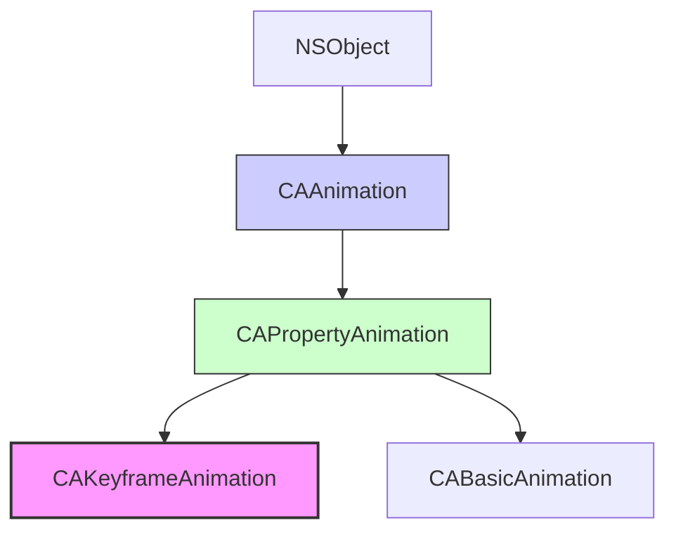

#core-animation #animation #cakeyframeanimation #keyframe #calayer #uikit #ios #path-animation

---

## CAKeyframeAnimation

### Определение
**CAKeyframeAnimation** — это конкретный подкласс [[CAPropertyAnimation]] во фреймворке [[Core Animation]], который позволяет анимировать свойство слоя по набору ключевых значений или по заданному пути. В отличие от [[CABasicAnimation]], которая перемещается между двумя точками, `CAKeyframeAnimation` может проходить через множество промежуточных значений с различными временными интервалами .

Этот класс является мощным инструментом для создания сложных, нетривиальных анимаций, таких как движение по кривой, пульсация с изменением масштаба в нескольких точках, или анимация с неравномерной скоростью.

### Зачем это знать iOS-разработчику?
1.  **Сложные траектории:** Анимация движения объекта по кривой Безье или любой другой произвольной траектории.
2.  **Многозначные анимации:** Когда свойство должно принимать несколько промежуточных значений (например, пульсация с изменением цвета через несколько оттенков).
3.  **Контроль времени:** Тонкая настройка времени достижения каждого ключевого кадра через `keyTimes` и `timingFunctions`.
4.  **Естественные движения:** Создание более реалистичных анимаций с неравномерной скоростью.
5.  **Анимация трансформаций:** Комбинирование различных трансформаций в одной анимации.

---

### Иерархия наследования



### Ключевые свойства

#### Свойства из [[CAAnimation]] и [[CAPropertyAnimation]]
- `duration` (`CFTimeInterval`) — длительность анимации .
- `repeatCount` ([[Float]]) — количество повторений .
- `autoreverses` ([[Bool]]) — если `true`, анимация выполняется в обратном направлении .
- `timingFunction` (`CAMediaTimingFunction?`) — глобальная функция времени (переопределяется `timingFunctions`) .
- `keyPath` ([[String]]) — путь к анимируемому свойству .

#### Специфические свойства CAKeyframeAnimation

##### Задание значений
- `values` (`[Any]?`) — массив ключевых значений, через которые пройдет анимация .
- `path` ([[CGPath]]?) — путь [[Core Graphics]] для анимации свойств, поддерживающих точки (например, `position`) .
- `rotationMode` (`CAAnimationRotationMode?`) — определяет, как объект поворачивается при движении по пути (`.auto`, `.autoReverse`) .

##### Управление временем
- `keyTimes` (`[NSNumber]?`) — массив моментов времени (от 0.0 до 1.0), соответствующих каждому ключевому значению .
- `timingFunctions` (`[CAMediaTimingFunction]?`) — массив функций времени для интерполяции между ключевыми кадрами .
- `calculationMode` (`CAAnimationCalculationMode`) — режим интерполяции между ключевыми кадрами :
  - `.linear` — линейная интерполяция (по умолчанию)
  - `.discrete` — дискретные переходы (без интерполяции)
  - `.paced` — равномерная скорость по всей анимации
  - `.cubic` / `.cubicPaced` — сплайновая интерполяция

- `tensionValues`, `continuityValues`, `biasValues` — параметры для сплайновой интерполяции (при `calculationMode = .cubic`).

---

### Примеры использования

#### Уровень 1: Базовая анимация по значениям
Простейший пример — изменение позиции по набору точек.

```swift
import UIKit
import QuartzCore

class BasicKeyframeViewController: UIViewController {
    
    let animatedLayer = CALayer()
    
    override func viewDidLoad() {
        super.viewDidLoad()
        setupLayer()
    }
    
    private func setupLayer() {
        animatedLayer.frame = CGRect(x: 50, y: 100, width: 60, height: 60)
        animatedLayer.backgroundColor = UIColor.systemRed.cgColor
        animatedLayer.cornerRadius = 30
        view.layer.addSublayer(animatedLayer)
    }
    
    @IBAction func startAnimation() {
        // 1. Создаем анимацию для позиции
        let animation = CAKeyframeAnimation(keyPath: "position")
        
        // 2. Задаем массив ключевых точек
        animation.values = [
            CGPoint(x: 80, y: 130),
            CGPoint(x: 200, y: 130),
            CGPoint(x: 200, y: 300),
            CGPoint(x: 80, y: 300),
            CGPoint(x: 80, y: 130) // Возвращаемся в начало
        ]
        
        // 3. Настраиваем длительность
        animation.duration = 3.0
        
        // 4. Добавляем анимацию
        animatedLayer.add(animation, forKey: "positionAnimation")
        
        // 5. Обновляем модельное значение (конечная точка)
        animatedLayer.position = CGPoint(x: 80, y: 130)
    }
}
```

#### Уровень 2: Анимация с контролем времени (keyTimes)
Управление скоростью достижения каждого ключевого кадра.

```swift
import UIKit
import QuartzCore

class KeyTimesViewController: UIViewController {
    
    let animatedLayer = CALayer()
    
    override func viewDidLoad() {
        super.viewDidLoad()
        setupLayer()
    }
    
    private func setupLayer() {
        animatedLayer.frame = CGRect(x: 50, y: 200, width: 60, height: 60)
        animatedLayer.backgroundColor = UIColor.systemGreen.cgColor
        animatedLayer.cornerRadius = 30
        view.layer.addSublayer(animatedLayer)
    }
    
    @IBAction func startAnimation() {
        let animation = CAKeyframeAnimation(keyPath: "position.x")
        
        // Значения по оси X
        animation.values = [80, 150, 250, 300, 80]
        
        // Временные метки (от 0 до 1)
        animation.keyTimes = [0, 0.1, 0.3, 0.8, 1.0]
        
        animation.duration = 4.0
        
        // Функции времени для каждого сегмента
        animation.timingFunctions = [
            CAMediaTimingFunction(name: .easeIn),
            CAMediaTimingFunction(name: .linear),
            CAMediaTimingFunction(name: .easeOut),
            CAMediaTimingFunction(name: .easeInEaseOut)
        ]
        
        animatedLayer.add(animation, forKey: "keyTimesAnimation")
        animatedLayer.position.x = 80
    }
}
```

#### Уровень 3: Анимация по пути (path)
Движение по кривой Безье.

```swift
import UIKit
import QuartzCore

class PathAnimationViewController: UIViewController {
    
    let animatedLayer = CALayer()
    
    override func viewDidLoad() {
        super.viewDidLoad()
        setupLayer()
    }
    
    private func setupLayer() {
        animatedLayer.frame = CGRect(x: 50, y: 200, width: 50, height: 50)
        animatedLayer.backgroundColor = UIColor.systemBlue.cgColor
        animatedLayer.cornerRadius = 25
        view.layer.addSublayer(animatedLayer)
    }
    
    @IBAction func startPathAnimation() {
        let animation = CAKeyframeAnimation(keyPath: "position")
        
        // Создаем путь (кривая Безье)
        let path = UIBezierPath()
        path.move(to: CGPoint(x: 75, y: 225))
        path.addCurve(to: CGPoint(x: 300, y: 225),
                     controlPoint1: CGPoint(x: 150, y: 100),
                     controlPoint2: CGPoint(x: 225, y: 350))
        
        animation.path = path.cgPath
        animation.duration = 3.0
        
        // Режим расчета для равномерной скорости по пути
        animation.calculationMode = .paced
        
        animatedLayer.add(animation, forKey: "pathAnimation")
        animatedLayer.position = CGPoint(x: 300, y: 225)
    }
    
    @IBAction func startHeartPathAnimation() {
        // Анимация по форме сердца
        let animation = CAKeyframeAnimation(keyPath: "position")
        
        let heartPath = UIBezierPath()
        // Рисуем сердце (упрощенно)
        heartPath.move(to: CGPoint(x: 150, y: 200))
        heartPath.addCurve(to: CGPoint(x: 150, y: 200),
                          controlPoint1: CGPoint(x: 100, y: 100),
                          controlPoint2: CGPoint(x: 50, y: 150))
        
        animation.path = heartPath.cgPath
        animation.duration = 4.0
        animation.repeatCount = .infinity
        animation.calculationMode = .paced
        
        animatedLayer.add(animation, forKey: "heartAnimation")
    }
}
```

#### Уровень 4: Анимация вращения при движении по пути
Использование `rotationMode` для автоматического поворота объекта.

```swift
import UIKit
import QuartzCore

class RotationModeViewController: UIViewController {
    
    let carLayer = CALayer()
    let planeLayer = CALayer()
    
    override func viewDidLoad() {
        super.viewDidLoad()
        setupLayers()
    }
    
    private func setupLayers() {
        // Машина (без авто-поворота)
        carLayer.frame = CGRect(x: 50, y: 150, width: 40, height: 20)
        carLayer.backgroundColor = UIColor.systemRed.cgColor
        carLayer.cornerRadius = 5
        view.layer.addSublayer(carLayer)
        
        // Самолетик (с авто-поворотом)
        planeLayer.frame = CGRect(x: 50, y: 300, width: 40, height: 20)
        planeLayer.backgroundColor = UIColor.systemBlue.cgColor
        planeLayer.cornerRadius = 5
        view.layer.addSublayer(planeLayer)
    }
    
    @IBAction func startAnimations() {
        let path = UIBezierPath()
        path.move(to: CGPoint(x: 70, y: 160))
        path.addCurve(to: CGPoint(x: 300, y: 310),
                     controlPoint1: CGPoint(x: 150, y: 100),
                     controlPoint2: CGPoint(x: 200, y: 350))
        
        // Анимация для машины (без поворота)
        let carAnimation = CAKeyframeAnimation(keyPath: "position")
        carAnimation.path = path.cgPath
        carAnimation.duration = 3.0
        carAnimation.calculationMode = .paced
        
        carLayer.add(carAnimation, forKey: "carAnimation")
        carLayer.position = CGPoint(x: 300, y: 310)
        
        // Анимация для самолетика (с авто-поворотом)
        let planeAnimation = CAKeyframeAnimation(keyPath: "position")
        planeAnimation.path = path.cgPath
        planeAnimation.duration = 3.0
        planeAnimation.calculationMode = .paced
        planeAnimation.rotationMode = .auto // Автоматический поворот по касательной
        
        planeLayer.add(planeAnimation, forKey: "planeAnimation")
        planeLayer.position = CGPoint(x: 300, y: 310)
    }
}
```

#### Уровень 5: Анимация масштаба и цвета с ключевыми кадрами
Пульсация с изменением размера и цвета.

```swift
import UIKit
import QuartzCore

class PulseAnimationViewController: UIViewController {
    
    let animatedLayer = CALayer()
    
    override func viewDidLoad() {
        super.viewDidLoad()
        setupLayer()
    }
    
    private func setupLayer() {
        animatedLayer.frame = CGRect(x: view.center.x - 50, y: view.center.y - 50, width: 100, height: 100)
        animatedLayer.backgroundColor = UIColor.systemOrange.cgColor
        animatedLayer.cornerRadius = 50
        view.layer.addSublayer(animatedLayer)
    }
    
    @IBAction func startPulseAnimation() {
        // Анимация масштаба
        let scaleAnimation = CAKeyframeAnimation(keyPath: "transform.scale")
        scaleAnimation.values = [1.0, 1.5, 0.8, 1.2, 1.0]
        scaleAnimation.keyTimes = [0, 0.25, 0.5, 0.75, 1.0]
        scaleAnimation.duration = 2.0
        
        // Анимация цвета
        let colorAnimation = CAKeyframeAnimation(keyPath: "backgroundColor")
        colorAnimation.values = [
            UIColor.systemOrange.cgColor,
            UIColor.systemRed.cgColor,
            UIColor.systemPurple.cgColor,
            UIColor.systemBlue.cgColor,
            UIColor.systemOrange.cgColor
        ]
        colorAnimation.keyTimes = [0, 0.25, 0.5, 0.75, 1.0]
        colorAnimation.duration = 2.0
        
        // Группируем анимации
        let group = CAAnimationGroup()
        group.animations = [scaleAnimation, colorAnimation]
        group.duration = 2.0
        group.repeatCount = .infinity
        
        animatedLayer.add(group, forKey: "pulseGroup")
    }
}
```

#### Уровень 6: Дискретная анимация (calculationMode = .discrete)
Скачкообразное изменение значений без интерполяции.

```swift
import UIKit
import QuartzCore

class DiscreteAnimationViewController: UIViewController {
    
    let animatedLayer = CALayer()
    let label = UILabel()
    
    override func viewDidLoad() {
        super.viewDidLoad()
        setupLayer()
        setupLabel()
    }
    
    private func setupLayer() {
        animatedLayer.frame = CGRect(x: 150, y: 200, width: 100, height: 100)
        animatedLayer.backgroundColor = UIColor.systemTeal.cgColor
        animatedLayer.cornerRadius = 10
        view.layer.addSublayer(animatedLayer)
    }
    
    private func setupLabel() {
        label.frame = CGRect(x: 150, y: 320, width: 100, height: 30)
        label.textAlignment = .center
        label.textColor = .black
        label.font = UIFont.boldSystemFont(ofSize: 16)
        view.addSubview(label)
    }
    
    @IBAction func startDiscreteAnimation() {
        // Анимация смены чисел (как счетчик)
        let animation = CAKeyframeAnimation(keyPath: "opacity")
        animation.values = [1.0, 0.0, 1.0, 0.0, 1.0]
        animation.keyTimes = [0, 0.2, 0.4, 0.6, 0.8]
        animation.duration = 2.0
        animation.calculationMode = .discrete // Скачкообразные изменения
        
        animatedLayer.add(animation, forKey: "discreteAnimation")
        
        // Анимация смены текста
        let textAnimation = CAKeyframeAnimation(keyPath: "contents")
        // Для UILabel нужно использовать другой подход, но для демонстрации концепции
        let images = [
            "1", "2", "3", "4", "5"
        ].compactMap { self.createImageFromString($0)?.cgImage }
        
        if !images.isEmpty {
            let contentAnimation = CAKeyframeAnimation(keyPath: "contents")
            contentAnimation.values = images
            contentAnimation.keyTimes = [0, 0.2, 0.4, 0.6, 0.8]
            contentAnimation.duration = 2.0
            contentAnimation.calculationMode = .discrete
            
            animatedLayer.add(contentAnimation, forKey: "contentAnimation")
        }
    }
    
    private func createImageFromString(_ string: String) -> UIImage? {
        let label = UILabel(frame: CGRect(x: 0, y: 0, width: 100, height: 100))
        label.text = string
        label.textAlignment = .center
        label.font = UIFont.boldSystemFont(ofSize: 40)
        label.textColor = .white
        
        UIGraphicsBeginImageContext(label.bounds.size)
        label.layer.render(in: UIGraphicsGetCurrentContext()!)
        let image = UIGraphicsGetImageFromCurrentImageContext()
        UIGraphicsEndImageContext()
        return image
    }
}
```

#### Уровень 7: Анимация с кастомными сплайнами (cubic)
Плавные, настраиваемые кривые.

```swift
import UIKit
import QuartzCore

class CubicAnimationViewController: UIViewController {
    
    let animatedLayer = CALayer()
    
    override func viewDidLoad() {
        super.viewDidLoad()
        setupLayer()
    }
    
    private func setupLayer() {
        animatedLayer.frame = CGRect(x: 50, y: 200, width: 50, height: 50)
        animatedLayer.backgroundColor = UIColor.systemPurple.cgColor
        animatedLayer.cornerRadius = 25
        view.layer.addSublayer(animatedLayer)
    }
    
    @IBAction func startCubicAnimation() {
        let animation = CAKeyframeAnimation(keyPath: "position")
        
        animation.values = [
            CGPoint(x: 75, y: 225),
            CGPoint(x: 200, y: 150),
            CGPoint(x: 300, y: 225)
        ]
        
        animation.keyTimes = [0, 0.5, 1.0]
        animation.duration = 3.0
        
        // Используем кубическую интерполяцию
        animation.calculationMode = .cubic
        
        // Настраиваем параметры сплайна
        animation.tensionValues = [0.5, 0.5] // Натяжение
        animation.continuityValues = [0.0, 0.0] // Непрерывность
        animation.biasValues = [0.0, 0.0] // Смещение
        
        animatedLayer.add(animation, forKey: "cubicAnimation")
        animatedLayer.position = CGPoint(x: 300, y: 225)
    }
    
    @IBAction func startBouncingAnimation() {
        // Имитация отскока мяча
        let animation = CAKeyframeAnimation(keyPath: "position.y")
        
        animation.values = [225, 150, 180, 130, 170, 140, 160, 150, 155, 225]
        animation.keyTimes = [0, 0.1, 0.2, 0.3, 0.4, 0.5, 0.6, 0.7, 0.8, 1.0]
        animation.duration = 2.0
        animation.calculationMode = .cubicPaced // Равномерная скорость с кубической интерполяцией
        
        animatedLayer.add(animation, forKey: "bouncingAnimation")
        animatedLayer.position.y = 225
    }
}
```

#### Уровень 8: Комбинированная анимация нескольких свойств
Одновременная анимация позиции, вращения и масштаба с ключевыми кадрами.

```swift
import UIKit
import QuartzCore

class ComplexKeyframeViewController: UIViewController {
    
    let animatedLayer = CALayer()
    
    override func viewDidLoad() {
        super.viewDidLoad()
        setupLayer()
    }
    
    private func setupLayer() {
        animatedLayer.frame = CGRect(x: 50, y: 150, width: 80, height: 80)
        animatedLayer.backgroundColor = UIColor.systemPink.cgColor
        animatedLayer.cornerRadius = 40
        view.layer.addSublayer(animatedLayer)
    }
    
    @IBAction func startComplexAnimation() {
        // Анимация позиции по X
        let positionX = CAKeyframeAnimation(keyPath: "position.x")
        positionX.values = [90, 200, 300, 200, 90]
        positionX.keyTimes = [0, 0.25, 0.5, 0.75, 1.0]
        
        // Анимация позиции по Y
        let positionY = CAKeyframeAnimation(keyPath: "position.y")
        positionY.values = [190, 150, 250, 150, 190]
        positionY.keyTimes = [0, 0.25, 0.5, 0.75, 1.0]
        
        // Анимация вращения
        let rotation = CAKeyframeAnimation(keyPath: "transform.rotation.z")
        rotation.values = [0, Double.pi/2, Double.pi, Double.pi*1.5, Double.pi*2]
        rotation.keyTimes = [0, 0.25, 0.5, 0.75, 1.0]
        
        // Анимация масштаба
        let scale = CAKeyframeAnimation(keyPath: "transform.scale")
        scale.values = [1.0, 1.5, 0.8, 1.2, 1.0]
        scale.keyTimes = [0, 0.25, 0.5, 0.75, 1.0]
        
        // Анимация цвета
        let color = CAKeyframeAnimation(keyPath: "backgroundColor")
        color.values = [
            UIColor.systemPink.cgColor,
            UIColor.systemRed.cgColor,
            UIColor.systemBlue.cgColor,
            UIColor.systemGreen.cgColor,
            UIColor.systemPink.cgColor
        ]
        color.keyTimes = [0, 0.25, 0.5, 0.75, 1.0]
        
        // Группируем все анимации
        let group = CAAnimationGroup()
        group.animations = [positionX, positionY, rotation, scale, color]
        group.duration = 4.0
        group.timingFunction = CAMediaTimingFunction(name: .easeInEaseOut)
        
        animatedLayer.add(group, forKey: "complexAnimation")
        
        // Обновляем модельные значения
        animatedLayer.position = CGPoint(x: 90, y: 190)
        animatedLayer.transform = CATransform3DIdentity
        animatedLayer.backgroundColor = UIColor.systemPink.cgColor
    }
}
```

---

### CAKeyframeAnimation vs [[CABasicAnimation]]

| Характеристика          | CAKeyframeAnimation                                              | CABasicAnimation                        |
| ----------------------- | ---------------------------------------------------------------- | --------------------------------------- |
| **Количество значений** | Множество (массив или путь)                                      | Два (from и to)                         |
| **Траектории**          | Поддерживаются сложные пути ([[CGPath]])                         | Только прямая линия                     |
| **Контроль времени**    | Детальный через keyTimes                                         | Глобальный                              |
| **Режимы интерполяции** | Linear, discrete, paced, cubic                                   | Linear только                           |
| **Сложность**           | Выше                                                             | Ниже                                    |
| **Гибкость**            | Максимальная                                                     | Базовая                                 |
| **Когда использовать**  | Сложные траектории, пульсации, эффекты с несколькими состояниями | Простые переходы между двумя значениями |

### Best Practices

#### 1. **Используйте calculationMode .paced для равномерного движения**
При движении по сложному пути `calculationMode = .paced` обеспечивает постоянную скорость, игнорируя неравномерность сегментов пути.

#### 2. **Всегда задавайте keyTimes при использовании values**
Если вы задаете `values`, рекомендуется также задавать `keyTimes` для предсказуемого поведения.

#### 3. **Для анимации позиции используйте path вместо values**
`path` дает более плавные кривые и лучше контролируется.

```swift
// Лучше
animation.path = bezierPath.cgPath

// Чем
animation.values = [point1, point2, point3, point4]
```

#### 4. **Не забывайте обновлять модельные значения**
Как и с `CABasicAnimation`, после добавления анимации обновите фактические значения слоя.

#### 5. **Используйте rotationMode для анимации ориентации**
При движении по пути `rotationMode = .auto` автоматически поворачивает объект по касательной.

#### 6. **Экспериментируйте с cubic параметрами**
Параметры `tension`, `continuity` и `bias` позволяют создавать уникальные, нелинейные движения.

### Итог
**CAKeyframeAnimation** — это мощный инструмент для создания сложных, выразительных анимаций в iOS. Он предоставляет:

- **Возможность анимации по произвольным траекториям** с помощью CGPath
- **Детальный контроль над промежуточными значениями** через values
- **Точное управление временем** с keyTimes и timingFunctions
- **Различные режимы интерполяции** для разных типов анимаций
- **Автоматический поворот** объектов при движении по пути

Этот класс незаменим при создании анимаций, где требуется больше, чем простое перемещение из точки А в точку Б — от реалистичного движения физических объектов до сложных визуальных эффектов.