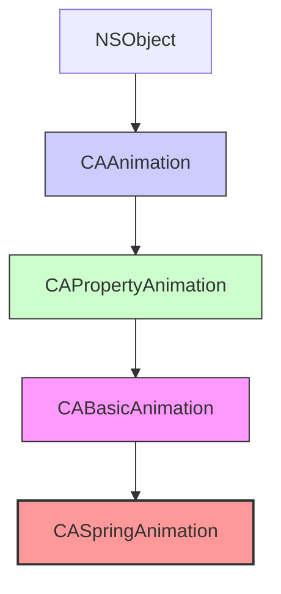

Вот подробная статья для Obsidian по термину **CASpringAnimation** в контексте iOS-разработки на Swift/UIKit. Текст содержит определения, архитектуру, детальное описание физических параметров, сравнение с другими анимациями, примеры кода от простого к сложному, best practices и теги.

---
### Теги
`#core-animation` `#animation` `#caspringanimation` `#spring` `#physics` `#calayer` `#uikit` `#ios9`

---

## CASpringAnimation

### Определение
**CASpringAnimation** — это конкретный подкласс `CABasicAnimation` во фреймворке Core Animation, который моделирует анимацию с физикой пружины. Он позволяет создавать реалистичные, естественные движения, имитирующие поведение пружины: ускорение, замедление и эффект "перелёта" (overshoot) с последующим затуханием .

Этот класс был представлен в iOS 9 и предоставляет разработчикам простой способ создания анимаций с эффектом пружины без необходимости вручную настраивать сложные кривые времени или ключевые кадры. Все параметры основаны на реальных физических величинах: масса, жесткость, затухание.

### Зачем это знать iOS-разработчику?
1.  **Реалистичные движения:** Пружинные анимации выглядят естественно и приятно для глаз, соответствуя физике реального мира.
2.  **Простота настройки:** Вместо сложных keyframe анимаций достаточно настроить несколько физических параметров.
3.  **Встроенный расчет длительности:** Свойство `settlingDuration` автоматически вычисляет время до полной остановки.
4.  **Эффект "перелёта" (overshoot):** Естественное явление, когда объект немного проскакивает целевую точку и возвращается обратно.
5.  **Современный стандарт:** Широко используется в современных интерфейсах для создания отзывчивых, живых взаимодействий.

---

### Иерархия наследования



### Физические параметры CASpringAnimation

| Параметр | Описание | Влияние | Тип |
|----------|----------|---------|-----|
| `mass` | Масса объекта | Большая масса → медленнее движение, больше инерция | `CGFloat` |
| `stiffness` | Жесткость пружины | Высокая жесткость → быстрее возврат, меньше колебаний | `CGFloat` |
| `damping` | Затухание (демпфирование) | Высокое затухание → быстрее остановка, меньше "перелётов" | `CGFloat` |
| `initialVelocity` | Начальная скорость | Положительная → движение в направлении цели, отрицательная → от цели | `CGFloat` |

#### Наследуемые свойства от CABasicAnimation
- `fromValue` — начальное значение
- `toValue` — конечное значение
- `duration` — если не задана, используется `settlingDuration`
- `autoreverses`, `repeatCount` и другие стандартные свойства

#### Специфическое свойство
- `settlingDuration` (`CFTimeInterval`) — вычисляемое свойство, возвращающее предполагаемое время до полной остановки пружины (только для чтения) .

---

### Примеры использования

#### Уровень 1: Базовая пружинная анимация позиции
Простейший пример — перемещение с эффектом пружины.

```swift
import UIKit
import QuartzCore

class BasicSpringViewController: UIViewController {
    
    let animatedLayer = CALayer()
    
    override func viewDidLoad() {
        super.viewDidLoad()
        setupLayer()
    }
    
    private func setupLayer() {
        animatedLayer.frame = CGRect(x: 50, y: 200, width: 80, height: 80)
        animatedLayer.backgroundColor = UIColor.systemRed.cgColor
        animatedLayer.cornerRadius = 40
        view.layer.addSublayer(animatedLayer)
    }
    
    @IBAction func startSpringAnimation() {
        // 1. Создаем пружинную анимацию для позиции по X
        let animation = CASpringAnimation(keyPath: "position.x")
        
        // 2. Настраиваем физические параметры
        animation.mass = 1.0
        animation.stiffness = 100.0
        animation.damping = 10.0
        animation.initialVelocity = 0.0
        
        // 3. Задаем значения
        animation.fromValue = 90
        animation.toValue = 300
        
        // 4. Используем settlingDuration для автоматической длительности
        animation.duration = animation.settlingDuration
        
        // 5. Добавляем анимацию
        animatedLayer.add(animation, forKey: "springAnimation")
        
        // 6. Обновляем модельное значение
        animatedLayer.position.x = 300
    }
}
```

#### Уровень 2: Влияние массы
Демонстрация влияния массы на движение.

```swift
import UIKit
import QuartzCore

class MassComparisonViewController: UIViewController {
    
    let lightLayer = CALayer()
    let mediumLayer = CALayer()
    let heavyLayer = CALayer()
    
    override func viewDidLoad() {
        super.viewDidLoad()
        setupLayers()
    }
    
    private func setupLayers() {
        // Легкий объект (масса 0.5)
        lightLayer.frame = CGRect(x: 50, y: 150, width: 50, height: 50)
        lightLayer.backgroundColor = UIColor.systemGreen.cgColor
        lightLayer.cornerRadius = 25
        view.layer.addSublayer(lightLayer)
        
        // Средний объект (масса 1.0)
        mediumLayer.frame = CGRect(x: 50, y: 220, width: 50, height: 50)
        mediumLayer.backgroundColor = UIColor.systemBlue.cgColor
        mediumLayer.cornerRadius = 25
        view.layer.addSublayer(mediumLayer)
        
        // Тяжелый объект (масса 3.0)
        heavyLayer.frame = CGRect(x: 50, y: 290, width: 50, height: 50)
        heavyLayer.backgroundColor = UIColor.systemRed.cgColor
        heavyLayer.cornerRadius = 25
        view.layer.addSublayer(heavyLayer)
    }
    
    @IBAction func startAnimations() {
        // Анимация для легкого объекта
        let lightAnim = CASpringAnimation(keyPath: "position.x")
        lightAnim.mass = 0.5
        lightAnim.stiffness = 100
        lightAnim.damping = 10
        lightAnim.fromValue = 75
        lightAnim.toValue = 300
        lightAnim.duration = lightAnim.settlingDuration
        
        lightLayer.add(lightAnim, forKey: "light")
        lightLayer.position.x = 300
        
        // Анимация для среднего объекта
        let mediumAnim = CASpringAnimation(keyPath: "position.x")
        mediumAnim.mass = 1.0
        mediumAnim.stiffness = 100
        mediumAnim.damping = 10
        mediumAnim.fromValue = 75
        mediumAnim.toValue = 300
        mediumAnim.duration = mediumAnim.settlingDuration
        
        mediumLayer.add(mediumAnim, forKey: "medium")
        mediumLayer.position.x = 300
        
        // Анимация для тяжелого объекта
        let heavyAnim = CASpringAnimation(keyPath: "position.x")
        heavyAnim.mass = 3.0
        heavyAnim.stiffness = 100
        heavyAnim.damping = 10
        heavyAnim.fromValue = 75
        heavyAnim.toValue = 300
        heavyAnim.duration = heavyAnim.settlingDuration
        
        heavyLayer.add(heavyAnim, forKey: "heavy")
        heavyLayer.position.x = 300
    }
}
```

#### Уровень 3: Влияние жесткости (stiffness)
Сравнение разных значений жесткости пружины.

```swift
import UIKit
import QuartzCore

class StiffnessComparisonViewController: UIViewController {
    
    let softLayer = CALayer()
    let mediumLayer = CALayer()
    let stiffLayer = CALayer()
    
    override func viewDidLoad() {
        super.viewDidLoad()
        setupLayers()
    }
    
    private func setupLayers() {
        // Мягкая пружина (низкая жесткость)
        softLayer.frame = CGRect(x: 50, y: 150, width: 50, height: 50)
        softLayer.backgroundColor = UIColor.systemYellow.cgColor
        softLayer.cornerRadius = 25
        view.layer.addSublayer(softLayer)
        
        // Средняя жесткость
        mediumLayer.frame = CGRect(x: 50, y: 220, width: 50, height: 50)
        mediumLayer.backgroundColor = UIColor.systemOrange.cgColor
        mediumLayer.cornerRadius = 25
        view.layer.addSublayer(mediumLayer)
        
        // Жесткая пружина (высокая жесткость)
        stiffLayer.frame = CGRect(x: 50, y: 290, width: 50, height: 50)
        stiffLayer.backgroundColor = UIColor.systemRed.cgColor
        stiffLayer.cornerRadius = 25
        view.layer.addSublayer(stiffLayer)
    }
    
    @IBAction func startAnimations() {
        let commonSettings: (mass: CGFloat, damping: CGFloat, velocity: CGFloat) = (1.0, 10.0, 0.0)
        
        // Мягкая пружина
        let softAnim = CASpringAnimation(keyPath: "position.x")
        softAnim.mass = commonSettings.mass
        softAnim.stiffness = 50    // Низкая жесткость
        softAnim.damping = commonSettings.damping
        softAnim.initialVelocity = commonSettings.velocity
        softAnim.fromValue = 75
        softAnim.toValue = 300
        softAnim.duration = softAnim.settlingDuration
        
        softLayer.add(softAnim, forKey: "soft")
        softLayer.position.x = 300
        
        // Средняя жесткость
        let mediumAnim = CASpringAnimation(keyPath: "position.x")
        mediumAnim.mass = commonSettings.mass
        mediumAnim.stiffness = 100   // Средняя жесткость
        mediumAnim.damping = commonSettings.damping
        mediumAnim.initialVelocity = commonSettings.velocity
        mediumAnim.fromValue = 75
        mediumAnim.toValue = 300
        mediumAnim.duration = mediumAnim.settlingDuration
        
        mediumLayer.add(mediumAnim, forKey: "medium")
        mediumLayer.position.x = 300
        
        // Жесткая пружина
        let stiffAnim = CASpringAnimation(keyPath: "position.x")
        stiffAnim.mass = commonSettings.mass
        stiffAnim.stiffness = 200   // Высокая жесткость
        stiffAnim.damping = commonSettings.damping
        stiffAnim.initialVelocity = commonSettings.velocity
        stiffAnim.fromValue = 75
        stiffAnim.toValue = 300
        stiffAnim.duration = stiffAnim.settlingDuration
        
        stiffLayer.add(stiffAnim, forKey: "stiff")
        stiffLayer.position.x = 300
    }
}
```

#### Уровень 4: Влияние затухания (damping)
Сравнение разных уровней демпфирования.

```swift
import UIKit
import QuartzCore

class DampingComparisonViewController: UIViewController {
    
    let lowDampingLayer = CALayer()
    let mediumDampingLayer = CALayer()
    let highDampingLayer = CALayer()
    
    override func viewDidLoad() {
        super.viewDidLoad()
        setupLayers()
    }
    
    private func setupLayers() {
        // Низкое затухание (много колебаний)
        lowDampingLayer.frame = CGRect(x: 50, y: 150, width: 50, height: 50)
        lowDampingLayer.backgroundColor = UIColor.systemPurple.cgColor
        lowDampingLayer.cornerRadius = 25
        view.layer.addSublayer(lowDampingLayer)
        
        // Среднее затухание
        mediumDampingLayer.frame = CGRect(x: 50, y: 220, width: 50, height: 50)
        mediumDampingLayer.backgroundColor = UIColor.systemBlue.cgColor
        mediumDampingLayer.cornerRadius = 25
        view.layer.addSublayer(mediumDampingLayer)
        
        // Высокое затухание (быстрая остановка)
        highDampingLayer.frame = CGRect(x: 50, y: 290, width: 50, height: 50)
        highDampingLayer.backgroundColor = UIColor.systemGreen.cgColor
        highDampingLayer.cornerRadius = 25
        view.layer.addSublayer(highDampingLayer)
    }
    
    @IBAction func startAnimations() {
        let commonSettings: (mass: CGFloat, stiffness: CGFloat, velocity: CGFloat) = (1.0, 100.0, 0.0)
        
        // Низкое затухание
        let lowAnim = CASpringAnimation(keyPath: "position.x")
        lowAnim.mass = commonSettings.mass
        lowAnim.stiffness = commonSettings.stiffness
        lowAnim.damping = 5     // Низкое затухание
        lowAnim.initialVelocity = commonSettings.velocity
        lowAnim.fromValue = 75
        lowAnim.toValue = 300
        lowAnim.duration = lowAnim.settlingDuration
        
        lowDampingLayer.add(lowAnim, forKey: "low")
        lowDampingLayer.position.x = 300
        
        // Среднее затухание
        let mediumAnim = CASpringAnimation(keyPath: "position.x")
        mediumAnim.mass = commonSettings.mass
        mediumAnim.stiffness = commonSettings.stiffness
        mediumAnim.damping = 10    // Среднее затухание
        mediumAnim.initialVelocity = commonSettings.velocity
        mediumAnim.fromValue = 75
        mediumAnim.toValue = 300
        mediumAnim.duration = mediumAnim.settlingDuration
        
        mediumDampingLayer.add(mediumAnim, forKey: "medium")
        mediumDampingLayer.position.x = 300
        
        // Высокое затухание
        let highAnim = CASpringAnimation(keyPath: "position.x")
        highAnim.mass = commonSettings.mass
        highAnim.stiffness = commonSettings.stiffness
        highAnim.damping = 20    // Высокое затухание
        highAnim.initialVelocity = commonSettings.velocity
        highAnim.fromValue = 75
        highAnim.toValue = 300
        highAnim.duration = highAnim.settlingDuration
        
        highDampingLayer.add(highAnim, forKey: "high")
        highDampingLayer.position.x = 300
    }
}
```

#### Уровень 5: Начальная скорость (initialVelocity)
Создание эффекта "броска" с начальной скоростью.

```swift
import UIKit
import QuartzCore

class InitialVelocityViewController: UIViewController {
    
    let zeroVelocityLayer = CALayer()
    let positiveVelocityLayer = CALayer()
    let negativeVelocityLayer = CALayer()
    
    override func viewDidLoad() {
        super.viewDidLoad()
        setupLayers()
    }
    
    private func setupLayers() {
        // Нулевая начальная скорость
        zeroVelocityLayer.frame = CGRect(x: 50, y: 150, width: 50, height: 50)
        zeroVelocityLayer.backgroundColor = UIColor.systemGray.cgColor
        zeroVelocityLayer.cornerRadius = 25
        view.layer.addSublayer(zeroVelocityLayer)
        
        // Положительная скорость (к цели)
        positiveVelocityLayer.frame = CGRect(x: 50, y: 220, width: 50, height: 50)
        positiveVelocityLayer.backgroundColor = UIColor.systemBlue.cgColor
        positiveVelocityLayer.cornerRadius = 25
        view.layer.addSublayer(positiveVelocityLayer)
        
        // Отрицательная скорость (от цели)
        negativeVelocityLayer.frame = CGRect(x: 50, y: 290, width: 50, height: 50)
        negativeVelocityLayer.backgroundColor = UIColor.systemRed.cgColor
        negativeVelocityLayer.cornerRadius = 25
        view.layer.addSublayer(negativeVelocityLayer)
    }
    
    @IBAction func startAnimations() {
        let commonSettings: (mass: CGFloat, stiffness: CGFloat, damping: CGFloat) = (1.0, 100.0, 10.0)
        
        // Нулевая скорость
        let zeroAnim = CASpringAnimation(keyPath: "position.x")
        zeroAnim.mass = commonSettings.mass
        zeroAnim.stiffness = commonSettings.stiffness
        zeroAnim.damping = commonSettings.damping
        zeroAnim.initialVelocity = 0
        zeroAnim.fromValue = 75
        zeroAnim.toValue = 300
        zeroAnim.duration = zeroAnim.settlingDuration
        
        zeroVelocityLayer.add(zeroAnim, forKey: "zero")
        zeroVelocityLayer.position.x = 300
        
        // Положительная скорость (уже движется к цели)
        let positiveAnim = CASpringAnimation(keyPath: "position.x")
        positiveAnim.mass = commonSettings.mass
        positiveAnim.stiffness = commonSettings.stiffness
        positiveAnim.damping = commonSettings.damping
        positiveAnim.initialVelocity = 2.0  // Положительная скорость
        positiveAnim.fromValue = 75
        positiveAnim.toValue = 300
        positiveAnim.duration = positiveAnim.settlingDuration
        
        positiveVelocityLayer.add(positiveAnim, forKey: "positive")
        positiveVelocityLayer.position.x = 300
        
        // Отрицательная скорость (движется от цели, потом разворачивается)
        let negativeAnim = CASpringAnimation(keyPath: "position.x")
        negativeAnim.mass = commonSettings.mass
        negativeAnim.stiffness = commonSettings.stiffness
        negativeAnim.damping = commonSettings.damping
        negativeAnim.initialVelocity = -2.0  // Отрицательная скорость
        negativeAnim.fromValue = 75
        negativeAnim.toValue = 300
        negativeAnim.duration = negativeAnim.settlingDuration
        
        negativeVelocityLayer.add(negativeAnim, forKey: "negative")
        negativeVelocityLayer.position.x = 300
    }
}
```

#### Уровень 6: Пружинная анимация масштаба
Анимация увеличения с эффектом пружины.

```swift
import UIKit
import QuartzCore

class ScaleSpringViewController: UIViewController {
    
    let animatedView = UIView()
    
    override func viewDidLoad() {
        super.viewDidLoad()
        setupView()
    }
    
    private func setupView() {
        animatedView.frame = CGRect(x: view.center.x - 75, y: view.center.y - 75, width: 150, height: 150)
        animatedView.backgroundColor = .systemTeal
        animatedView.layer.cornerRadius = 20
        view.addSubview(animatedView)
    }
    
    @IBAction func startScaleAnimation() {
        let animation = CASpringAnimation(keyPath: "transform.scale")
        
        animation.fromValue = 0.5
        animation.toValue = 1.0
        animation.mass = 1.0
        animation.stiffness = 150.0
        animation.damping = 15.0
        animation.initialVelocity = 0.5
        animation.duration = animation.settlingDuration
        
        animatedView.layer.add(animation, forKey: "scaleSpring")
        animatedView.layer.transform = CATransform3DMakeScale(1.0, 1.0, 1.0)
    }
    
    @IBAction func startPulseAnimation() {
        // Эффект пульсации с автореверсом
        let animation = CASpringAnimation(keyPath: "transform.scale")
        
        animation.fromValue = 1.0
        animation.toValue = 1.3
        animation.mass = 0.5
        animation.stiffness = 200.0
        animation.damping = 8.0
        animation.initialVelocity = 0.0
        animation.duration = animation.settlingDuration
        animation.autoreverses = true
        animation.repeatCount = 2
        
        animatedView.layer.add(animation, forKey: "pulseSpring")
    }
}
```

#### Уровень 7: Пружинная анимация с группой
Комбинация нескольких пружинных анимаций.

```swift
import UIKit
import QuartzCore

class SpringGroupViewController: UIViewController {
    
    let animatedLayer = CALayer()
    
    override func viewDidLoad() {
        super.viewDidLoad()
        setupLayer()
    }
    
    private func setupLayer() {
        animatedLayer.frame = CGRect(x: 100, y: 200, width: 80, height: 80)
        animatedLayer.backgroundColor = UIColor.systemOrange.cgColor
        animatedLayer.cornerRadius = 40
        view.layer.addSublayer(animatedLayer)
    }
    
    @IBAction func startGroupAnimation() {
        // Пружинная анимация позиции
        let positionAnim = CASpringAnimation(keyPath: "position")
        positionAnim.fromValue = CGPoint(x: 140, y: 240)
        positionAnim.toValue = CGPoint(x: 300, y: 400)
        positionAnim.mass = 1.0
        positionAnim.stiffness = 100.0
        positionAnim.damping = 10.0
        positionAnim.duration = positionAnim.settlingDuration
        
        // Пружинная анимация масштаба
        let scaleAnim = CASpringAnimation(keyPath: "transform.scale")
        scaleAnim.fromValue = 0.5
        scaleAnim.toValue = 1.5
        scaleAnim.mass = 0.8
        scaleAnim.stiffness = 150.0
        scaleAnim.damping = 12.0
        scaleAnim.duration = scaleAnim.settlingDuration
        
        // Пружинная анимация цвета
        let colorAnim = CASpringAnimation(keyPath: "backgroundColor")
        colorAnim.fromValue = UIColor.systemOrange.cgColor
        colorAnim.toValue = UIColor.systemPurple.cgColor
        colorAnim.mass = 0.5
        colorAnim.stiffness = 200.0
        colorAnim.damping = 15.0
        colorAnim.duration = colorAnim.settlingDuration
        
        // Группируем
        let group = CAAnimationGroup()
        group.animations = [positionAnim, scaleAnim, colorAnim]
        group.duration = max(positionAnim.duration, scaleAnim.duration, colorAnim.duration)
        
        animatedLayer.add(group, forKey: "springGroup")
        
        // Обновляем модельные значения
        animatedLayer.position = CGPoint(x: 300, y: 400)
        animatedLayer.transform = CATransform3DMakeScale(1.5, 1.5, 1.0)
        animatedLayer.backgroundColor = UIColor.systemPurple.cgColor
    }
}
```

#### Уровень 8: Сравнение CASpringAnimation с CABasicAnimation и кривой времени
Демонстрация преимущества пружинной анимации.

```swift
import UIKit
import QuartzCore

class ComparisonViewController: UIViewController {
    
    let springLayer = CALayer()
    let basicLayer = CALayer()
    let springLabel = UILabel()
    let basicLabel = UILabel()
    
    override func viewDidLoad() {
        super.viewDidLoad()
        setupLayers()
    }
    
    private func setupLayers() {
        // Пружинная анимация
        springLayer.frame = CGRect(x: 50, y: 150, width: 60, height: 60)
        springLayer.backgroundColor = UIColor.systemGreen.cgColor
        springLayer.cornerRadius = 30
        view.layer.addSublayer(springLayer)
        
        springLabel.frame = CGRect(x: 50, y: 220, width: 100, height: 20)
        springLabel.text = "Spring"
        springLabel.textColor = .black
        springLabel.font = UIFont.systemFont(ofSize: 12)
        view.addSubview(springLabel)
        
        // Базовая анимация с ease-in-out
        basicLayer.frame = CGRect(x: 200, y: 150, width: 60, height: 60)
        basicLayer.backgroundColor = UIColor.systemBlue.cgColor
        basicLayer.cornerRadius = 30
        view.layer.addSublayer(basicLayer)
        
        basicLabel.frame = CGRect(x: 200, y: 220, width: 100, height: 20)
        basicLabel.text = "Basic + Ease"
        basicLabel.textColor = .black
        basicLabel.font = UIFont.systemFont(ofSize: 12)
        view.addSubview(basicLabel)
    }
    
    @IBAction func startComparison() {
        // Пружинная анимация (естественное движение)
        let springAnim = CASpringAnimation(keyPath: "position.x")
        springAnim.fromValue = 80
        springAnim.toValue = 350
        springAnim.mass = 1.0
        springAnim.stiffness = 100.0
        springAnim.damping = 10.0
        springAnim.duration = springAnim.settlingDuration
        
        springLayer.add(springAnim, forKey: "spring")
        springLayer.position.x = 350
        
        // Базовая анимация с ease-in-out (искусственное движение)
        let basicAnim = CABasicAnimation(keyPath: "position.x")
        basicAnim.fromValue = 230
        basicAnim.toValue = 350
        basicAnim.duration = 1.5
        basicAnim.timingFunction = CAMediaTimingFunction(name: .easeInEaseOut)
        
        basicLayer.add(basicAnim, forKey: "basic")
        basicLayer.position.x = 350
    }
}
```

---

### CASpringAnimation vs Другие типы анимаций

| Характеристика | CASpringAnimation | CABasicAnimation | UIView.animate(withSpring) |
|---|---|---|---|
| **Физическая модель** | Реальная физика пружины | Математическая интерполяция | Пружинная модель UIKit |
| **Параметры** | Mass, stiffness, damping, velocity | From, to, duration | Damping, velocity, options |
| **Точность** | Высокая | Средняя | Средняя |
| **Расчет длительности** | Автоматический (settlingDuration) | Ручной | Ручной |
| **Доступность** | iOS 9+ | Все версии | iOS 7+ |
| **Гибкость** | Высокая | Средняя | Ограниченная |

### Best Practices

#### 1. **Используйте settlingDuration**
Всегда используйте `settlingDuration` для определения длительности анимации, если не требуется специальное значение.

```swift
animation.duration = animation.settlingDuration
```

#### 2. **Начинайте с разумных значений**
Хорошие стартовые параметры для большинства анимаций:
- `mass`: 1.0
- `stiffness`: 100-200
- `damping`: 10-20
- `initialVelocity`: 0.0

#### 3. **Экспериментируйте с initialVelocity**
Начальная скорость может создавать интересные эффекты "броска" или "замедления".

#### 4. **Комбинируйте с группами**
Пружинные анимации отлично работают в `CAAnimationGroup` для создания сложных эффектов.

#### 5. **Не забывайте обновлять модельные значения**
Как и с другими анимациями Core Animation, обновляйте фактические значения слоя.

```swift
layer.add(animation, forKey: "key")
layer.position = toValue
```

#### 6. **Тестируйте на реальных устройствах**
Пружинные анимации могут выглядеть по-разному на устройствах с разной производительностью.

### Итог
**CASpringAnimation** — это мощный инструмент для создания реалистичных, физически достоверных анимаций в iOS. Он предоставляет:

- **Физически корректную модель** движения
- **Простой API** с понятными параметрами
- **Автоматический расчет длительности** через settlingDuration
- **Естественный эффект "перелёта"** и затухания
- **Высокую производительность** благодаря аппаратному ускорению

Этот класс незаменим при создании современных интерфейсов с живыми, отзывчивыми анимациями, которые делают приложение более приятным и естественным для пользователя.