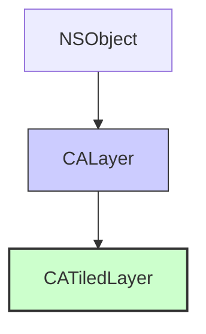

#core-animation #calayer #catiledlayer #performance #large-image #pdf #asynchronous-drawing #ios

---

## CATiledLayer

### Определение
**CATiledLayer** — это специализированный подкласс [[CALayer]] во фреймворке [[Core Animation]], предназначенный для эффективного отображения очень больших изображений или контента, который не может быть целиком загружен в память или отрисован за один кадр . Он работает путем разбиения контента на множество небольших прямоугольных фрагментов, называемых **тайлами (tiles)**, и загружает/отрисовывает их асинхронно и по мере необходимости .

Когда пользователь прокручивает или масштабирует область просмотра, `CATiledLayer` запрашивает отрисовку только тех тайлов, которые попадают в видимую область. Это позволяет приложению потреблять значительно меньше памяти и оставаться отзывчивым даже при работе с гигапиксельными изображениями или многостраничными документами .

### Зачем это знать iOS-разработчику?
1.  **Работа с огромными изображениями:** Отображение карт высокого разрешения, плакатов, схем или медицинских снимков, которые слишком велики для загрузки в память целиком.
2.  **Постраничный рендеринг PDF:** Эффективный просмотр многостраничных PDF-документов с возможностью масштабирования .
3.  **Производительность и отзывчивость:** Отрисовка контента в фоновых потоках предотвращает блокировку основного потока и "замерзание" интерфейса .
4.  **Экономия памяти:** В памяти хранятся только те тайлы, которые видны на экране, а не всё изображение целиком.
5.  **Поддержка детализации при масштабировании:** `CATiledLayer` может хранить несколько версий (уровней детализации) контента, подгружая более качественные тайлы при приближении .

---

### Иерархия наследования



### Ключевые свойства и методы

#### Основные свойства
- `tileSize` ([[CGSize]]) — максимальный размер каждого тайла в точках (points). По умолчанию 256x256. Важно: это размер в логических точках, на экранах Retina фактическое количество пикселей будет умножено на `contentsScale` .
- `levelsOfDetail` ([[Int]]) — количество уровней детализации при **уменьшении (zooming out)**. Значение по умолчанию — 1. Если установить значение 2, то при масштабе 0.5x слой запросит тайлы с вдвое меньшим разрешением .
- `levelsOfDetailBias` (`Int`) — количество уровней детализации при **увеличении (zooming in)**. По умолчанию — 0. Установка значения 3 позволит получать более качественные тайлы при масштабах 2x, 4x и 8x .

#### Основные методы
- `class func fadeDuration() -> CFTimeInterval` — возвращает длительность анимации "проявления" новых тайлов. По умолчанию 0.25 секунды .
- `setNeedsDisplay(in:)` — помечает указанную прямоугольную область как требующую перерисовки. Изменения будут применены асинхронно .

#### Механизм работы
Основная логика отрисовки реализуется в методе `draw(_:in:)` делегата слоя или, что удобнее, в методе `drawRect:` кастомного `UIView`, у которого `layerClass` переопределен на `CATiledLayer` . Этот метод вызывается для каждого тайла, обычно в фоновом потоке .

```swift
// В UIView, использующем CATiledLayer
override class var layerClass: AnyClass {
    return CATiledLayer.self
}

override func draw(_ rect: CGRect) {
    // Этот метод вызывается для каждого тайла, который необходимо отрисовать.
    // rect - это границы текущего тайла.
    // Важно: этот метод может вызываться из фоновых потоков!
    guard let context = UIGraphicsGetCurrentContext() else { return }
    
    // 1. Определить масштаб, чтобы понять, какой уровень детализации требуется
    let scale = context.ctm.a // Масштаб текущего графического контекста
    
    // 2. Вычислить, какой именно тайл (по индексу строки и колонки) запрашивается
    let tileSize = (self.layer as! CATiledLayer).tileSize
    let col = Int(floor(rect.minX * scale / tileSize.width))
    let row = Int(floor(rect.minY * scale / tileSize.height))
    
    // 3. Загрузить или сгенерировать соответствующее изображение для этого тайла
    // let image = tileSource.imageForTile(row: row, col: col, scale: scale)
    // image.draw(in: rect)
}
```

---

### Примеры использования

#### Уровень 1: Базовая настройка CATiledLayer для отрисовки паттерна
Простой пример демонстрации того, как `CATiledLayer` разбивает область на тайлы и отрисовывает их.

```swift
import UIKit

class TiledPatternView: UIView {
    
    override class var layerClass: AnyClass {
        return CATiledLayer.self
    }
    
    override init(frame: CGRect) {
        super.init(frame: frame)
        setupTiledLayer()
    }
    
    required init?(coder: NSCoder) {
        super.init(coder: coder)
        setupTiledLayer()
    }
    
    private func setupTiledLayer() {
        guard let tiledLayer = self.layer as? CATiledLayer else { return }
        
        // Настраиваем размер тайла (по умолчанию 256x256)
        tiledLayer.tileSize = CGSize(width: 128, height: 128)
        
        // Устанавливаем уровни детализации
        tiledLayer.levelsOfDetail = 4      // 4 уровня при уменьшении
        tiledLayer.levelsOfDetailBias = 2  // 2 уровня при увеличении
    }
    
    override func draw(_ rect: CGRect) {
        // Получаем текущий графический контекст
        guard let context = UIGraphicsGetCurrentContext() else { return }
        
        // Определяем, какой именно тайл рисуется (для демонстрации)
        let tileRect = rect
        
        // Получаем масштаб, чтобы понять, на каком уровне детализации мы находимся
        let scale = context.ctm.a
        
        // Генерируем цвет на основе координат тайла и масштаба
        let hue = (tileRect.origin.x.truncatingRemainder(dividingBy: 256) / 256.0)
        let saturation = (tileRect.origin.y.truncatingRemainder(dividingBy: 256) / 256.0)
        let brightness = 0.5 + 0.5 * (scale - 1.0) / 4.0 // Зависимость от масштаба
        
        context.setFillColor(UIColor(hue: hue, saturation: saturation, brightness: brightness, alpha: 1.0).cgColor)
        context.fill(tileRect)
        
        // Рисуем границы тайла и текст с координатами
        context.setStrokeColor(UIColor.black.cgColor)
        context.setLineWidth(1.0)
        context.stroke(tileRect)
        
        let text = String(format: "(%.0f, %.0f)", tileRect.origin.x, tileRect.origin.y)
        let attributes: [NSAttributedString.Key: Any] = [
            .font: UIFont.systemFont(ofSize: 10),
            .foregroundColor: UIColor.black
        ]
        
        // Рисуем текст (учитывая, что контекст может быть в фоновом потоке)
        let textRect = tileRect.insetBy(dx: 5, dy: tileRect.height/2 - 5)
        (text as NSString).draw(in: textRect, withAttributes: attributes)
    }
}

// Использование в контроллере
class TiledLayerDemoViewController: UIViewController, UIScrollViewDelegate {
    
    let scrollView = UIScrollView()
    let tiledView = TiledPatternView(frame: CGRect(x: 0, y: 0, width: 2048, height: 2048))
    
    override func viewDidLoad() {
        super.viewDidLoad()
        
        scrollView.frame = view.bounds
        scrollView.delegate = self
        scrollView.contentSize = tiledView.bounds.size
        scrollView.maximumZoomScale = 4.0
        scrollView.minimumZoomScale = 0.25
        
        tiledView.backgroundColor = .clear
        scrollView.addSubview(tiledView)
        view.addSubview(scrollView)
    }
    
    func viewForZooming(in scrollView: UIScrollView) -> UIView? {
        return tiledView
    }
}
```

#### Уровень 2: Эффективное отображение огромного изображения
Реальный пример загрузки и отображения изображения, разбитого на тайлы.

```swift
import UIKit

class LargeImageTiledView: UIView {
    
    private let imageName: String
    private let tileSize: CGSize
    private let imageSize: CGSize
    private let levelsOfDetail: Int
    
    init(imageName: String, imageSize: CGSize, tileSize: CGSize = CGSize(width: 256, height: 256), levelsOfDetail: Int = 4) {
        self.imageName = imageName
        self.imageSize = imageSize
        self.tileSize = tileSize
        self.levelsOfDetail = levelsOfDetail
        super.init(frame: CGRect(origin: .zero, size: imageSize))
        
        setupLayer()
    }
    
    required init?(coder: NSCoder) {
        fatalError("init(coder:) has not been implemented")
    }
    
    override class var layerClass: AnyClass {
        return CATiledLayer.self
    }
    
    private func setupLayer() {
        guard let tiledLayer = self.layer as? CATiledLayer else { return }
        
        tiledLayer.tileSize = tileSize
        tiledLayer.levelsOfDetail = levelsOfDetail
        
        // Для Retina дисплеев нужно учитывать contentsScale
        tiledLayer.contentsScale = UIScreen.main.scale
    }
    
    override func draw(_ rect: CGRect) {
        guard let context = UIGraphicsGetCurrentContext() else { return }
        
        // Получаем масштаб текущего контекста
        let scale = context.ctm.a
        
        // Вычисляем, какой уровень детализации соответствует текущему масштабу
        // (для загрузки соответствующей версии изображения)
        let level = log2(scale)
        
        // Вычисляем индексы тайла
        let scaledTileSize = tileSize.width * scale
        let col = Int(floor(rect.minX / scaledTileSize))
        let row = Int(floor(rect.minY / scaledTileSize))
        
        // Формируем имя файла для конкретного тайла
        // Предполагается, что изображение предварительно нарезано на тайлы вида "image_2x3_l2.jpg"
        let tileFileName = String(format: "%@_%dx%d_l%d", imageName, col, row, Int(level))
        
        if let imagePath = Bundle.main.path(forResource: tileFileName, ofType: "jpg"),
           let image = UIImage(contentsOfFile: imagePath) {
            
            // Рисуем изображение в текущем прямоугольнике
            image.draw(in: rect)
        } else {
            // Если тайл не найден, рисуем заглушку
            context.setFillColor(UIColor.gray.cgColor)
            context.fill(rect)
            
            // Рисуем границы
            context.setStrokeColor(UIColor.red.cgColor)
            context.setLineWidth(1.0)
            context.stroke(rect)
        }
    }
}

// Использование:
let tiledImageView = LargeImageTiledView(
    imageName: "world_map",
    imageSize: CGSize(width: 8192, height: 4096)
)
```

#### Уровень 3: Отображение PDF с использованием CATiledLayer
Классический пример — просмотр PDF-документа с поддержкой масштабирования .

```swift
import UIKit
import PDFKit

class PDFTiledView: UIView {
    
    private let pdfDocument: CGPDFDocument
    private let pageNumber: Int
    private let pageRect: CGRect
    
    init?(pdfURL: URL, pageNumber: Int = 1) {
        guard let document = CGPDFDocument(pdfURL as CFURL),
              let page = document.page(at: pageNumber) else {
            return nil
        }
        
        self.pdfDocument = document
        self.pageNumber = pageNumber
        self.pageRect = page.getBoxRect(.mediaBox)
        
        super.init(frame: pageRect)
        
        setupLayer()
    }
    
    required init?(coder: NSCoder) {
        fatalError("init(coder:) has not been implemented")
    }
    
    override class var layerClass: AnyClass {
        return CATiledLayer.self
    }
    
    private func setupLayer() {
        guard let tiledLayer = self.layer as? CATiledLayer else { return }
        
        tiledLayer.tileSize = CGSize(width: 512, height: 512)
        tiledLayer.levelsOfDetail = 4
        tiledLayer.levelsOfDetailBias = 4
        tiledLayer.contentsScale = UIScreen.main.scale
    }
    
    override func draw(_ rect: CGRect) {
        guard let context = UIGraphicsGetCurrentContext(),
              let page = pdfDocument.page(at: pageNumber) else { return }
        
        // PDF использует координаты с началом в левом нижнем углу
        context.translateBy(x: 0, y: bounds.height)
        context.scaleBy(x: 1, y: -1)
        
        // Получаем масштаб текущего контекста
        let scale = context.ctm.a
        
        // Вычисляем прямоугольник для отрисовки в координатах PDF
        let pdfRect = CGRect(
            x: rect.minX / scale,
            y: (bounds.height - rect.maxY) / scale,
            width: rect.width / scale,
            height: rect.height / scale
        )
        
        // Устанавливаем белую заливку для фона
        context.setFillColor(UIColor.white.cgColor)
        context.fill(rect)
        
        // Отрисовываем страницу PDF
        context.drawPDFPage(page)
        
        // Для отладки: рисуем границы тайла
        #if DEBUG
        context.setStrokeColor(UIColor.red.withAlphaComponent(0.5).cgColor)
        context.setLineWidth(1.0 / scale)
        context.stroke(pdfRect)
        #endif
    }
}

// Контроллер для просмотра PDF
class PDFViewerViewController: UIViewController, UIScrollViewDelegate {
    
    override func viewDidLoad() {
        super.viewDidLoad()
        
        guard let pdfURL = Bundle.main.url(forResource: "large_document", withExtension: "pdf"),
              let pdfView = PDFTiledView(pdfURL: pdfURL, pageNumber: 1) else {
            return
        }
        
        let scrollView = UIScrollView(frame: view.bounds)
        scrollView.delegate = self
        scrollView.contentSize = pdfView.bounds.size
        scrollView.maximumZoomScale = 8.0
        scrollView.minimumZoomScale = 0.25
        scrollView.backgroundColor = .gray
        
        scrollView.addSubview(pdfView)
        view.addSubview(scrollView)
    }
    
    func viewForZooming(in scrollView: UIScrollView) -> UIView? {
        return scrollView.subviews.first
    }
}
```

#### Уровень 4: Тонкая настройка уровней детализации
Демонстрация работы `levelsOfDetail` и `levelsOfDetailBias` .

```swift
import UIKit

class DetailLevelsView: UIView {
    
    override class var layerClass: AnyClass {
        return CATiledLayer.self
    }
    
    override init(frame: CGRect) {
        super.init(frame: frame)
        
        if let tiledLayer = self.layer as? CATiledLayer {
            // levelsOfDetail: количество уровней при уменьшении (zoom out)
            // Например, при масштабах 1.0, 0.5, 0.25, 0.125...
            tiledLayer.levelsOfDetail = 3
            
            // levelsOfDetailBias: количество уровней при увеличении (zoom in)
            // Например, при масштабах 1.0, 2.0, 4.0, 8.0...
            tiledLayer.levelsOfDetailBias = 3
            
            tiledLayer.tileSize = CGSize(width: 256, height: 256)
        }
    }
    
    required init?(coder: NSCoder) {
        fatalError("init(coder:) has not been implemented")
    }
    
    override func draw(_ rect: CGRect) {
        guard let context = UIGraphicsGetCurrentContext() else { return }
        
        let scale = context.ctm.a
        
        // Определяем текущий уровень детализации
        var detailLevel: Int
        if scale >= 1.0 {
            // Bias уровни (увеличение)
            detailLevel = Int(log2(scale)) + 1
        } else {
            // Обычные уровни (уменьшение)
            detailLevel = -Int(log2(scale))
        }
        
        // Раскрашиваем тайл в зависимости от уровня детализации
        let colors: [UIColor] = [.red, .green, .blue, .orange, .purple, .yellow]
        let colorIndex = detailLevel % colors.count
        
        context.setFillColor(colors[colorIndex].withAlphaComponent(0.3).cgColor)
        context.fill(rect)
        
        // Рисуем текст с информацией о масштабе и уровне
        let text = String(format: "Scale: %.2f\nLevel: %d", scale, detailLevel)
        let attributes: [NSAttributedString.Key: Any] = [
            .font: UIFont.boldSystemFont(ofSize: 12),
            .foregroundColor: UIColor.black
        ]
        
        let textRect = rect.insetBy(dx: 5, dy: 5)
        (text as NSString).draw(in: textRect, withAttributes: attributes)
    }
}
```

#### Уровень 5: Управление анимацией появления тайлов
Изменение длительности анимации появления новых тайлов.

```swift
import UIKit

class CustomFadeTiledView: UIView {
    
    override class var layerClass: AnyClass {
        return CATiledLayer.self
    }
    
    override func didMoveToWindow() {
        super.didMoveToWindow()
        
        if let tiledLayer = self.layer as? CATiledLayer {
            // Изменяем длительность анимации появления тайлов
            // По умолчанию 0.25, установим 0.5 для более плавного появления
            tiledLayer.fadeDuration = 0.5
            
            // Или можно полностью отключить анимацию
            // tiledLayer.fadeDuration = 0
        }
    }
    
    override func draw(_ rect: CGRect) {
        // Имитация длительной операции загрузки
        Thread.sleep(forTimeInterval: 0.05)
        
        guard let context = UIGraphicsGetCurrentContext() else { return }
        
        // Рисуем градиент для красоты
        let colors = [
            UIColor.systemBlue.cgColor,
            UIColor.systemPurple.cgColor
        ]
        
        if let gradient = CGGradient(colorsSpace: nil, colors: colors as CFArray, locations: nil) {
            context.drawLinearGradient(gradient,
                                        start: CGPoint(x: rect.minX, y: rect.minY),
                                        end: CGPoint(x: rect.maxX, y: rect.maxY),
                                        options: [])
        }
    }
}
```

---

### CATiledLayer vs Обычный CALayer

| Характеристика | CATiledLayer | Обычный CALayer |
|---|---|---|
| **Отрисовка** | Асинхронная, по частям (тайлам) в фоновых потоках  | Синхронная, в основном потоке |
| **Память** | Экономичная, только видимые тайлы  | Хранит весь контент целиком |
| **Поддержка масштабирования** | Встроенная через `levelsOfDetail`  | Требует ручного управления |
| **Сценарии использования** | Огромные изображения, карты, PDF | Обычные интерфейсные элементы |
| **Производительность при больших данных** | Высокая | Низкая (вплоть до вылета) |

### Best Practices

#### 1. **Правильно настраивайте levelsOfDetail и levelsOfDetailBias**
Понимание того, как работают эти параметры, критически важно для эффективного использования памяти :
- `levelsOfDetail` определяет, сколько раз вы можете уменьшить масштаб (каждый следующий уровень — в 2 раза меньше).
- `levelsOfDetailBias` определяет, сколько раз вы можете увеличить масштаб.

```swift
tiledLayer.levelsOfDetail = 4      // Поддержка масштабов: 1x, 0.5x, 0.25x, 0.125x
tiledLayer.levelsOfDetailBias = 3  // Поддержка масштабов: 1x, 2x, 4x, 8x
```

#### 2. **Учитывайте contentsScale для Retina дисплеев**
Если вы создаете `CATiledLayer` вручную (не через `UIView`), обязательно устанавливайте `contentsScale` равным `UIScreen.main.scale` .

#### 3. **Будьте осторожны с потоками**
Метод `draw(_:in:)` может вызываться в фоновых потоках. Убедитесь, что ваш код потокобезопасен, особенно при работе с разделяемыми ресурсами .

#### 4. **Оптимизируйте загрузку тайлов**
- Используйте кэширование загруженных тайлов.
- Для изображений, нарезанных на тайлы, используйте быстрый доступ по индексам.
- Для PDF рендерите каждый тайл независимо .

#### 5. **Настройте tileSize под ваши нужды**
Размер тайла по умолчанию (256x256) подходит для большинства случаев. Увеличение размера уменьшит количество тайлов, но увеличит время отрисовки каждого.

#### 6. **Используйте fadeDuration для лучшего UX**
Если загрузка тайлов занимает заметное время, увеличьте `fadeDuration`, чтобы появление было более плавным.

#### 7. **Подготовка ресурсов**
Для эффективной работы с большими изображениями их нужно предварительно нарезать на тайлы разных уровней детализации. Существуют инструменты (например, Tile-Cutter), которые автоматизируют этот процесс .

### Итог
**CATiledLayer** — это мощный инструмент для работы с контентом, размер которого превышает разумные пределы по памяти или времени отрисовки. Он предоставляет:

- **Асинхронную, многопоточную отрисовку** для сохранения отзывчивости интерфейса 
- **Экономию памяти** за счет загрузки только видимых частей 
- **Поддержку нескольких уровней детализации** для плавного масштабирования 
- **Гибкость** в использовании с различными источниками данных (изображения, PDF, кастомная графика)

Этот класс незаменим при создании приложений для просмотра карт, гигапиксельных фотографий, сложных схем или многостраничных документов, где производительность и эффективность использования памяти имеют первостепенное значение.