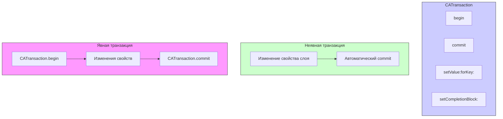

#core-animation #animation #catransaction #implicit-animation #calayer #uikit #ios

---
## CATransaction

### Определение
**CATransaction** — это класс во фреймворке [[Core Animation]], который предоставляет механизм для группировки нескольких изменений свойств слоев в одну атомарную операцию и управления параметрами анимации. Он является фундаментальной частью архитектуры Core Animation, обеспечивающей как неявные (implicit), так и явные (explicit) анимации .

Каждое изменение анимируемого свойства слоя (например, `position`, `opacity`, `backgroundColor`) автоматически создает неявную транзакцию. Разработчик также может создавать явные транзакции для группировки изменений, установки длительности анимации, функций времени и выполнения кода после завершения анимации.

### Зачем это знать [[iOS]]-разработчику?
1.  **Управление неявными анимациями:** Понимание `CATransaction` позволяет контролировать параметры неявных анимаций (например, когда вы меняете свойство слоя вне блока `UIView.animate`).
2.  **Группировка анимаций:** Объединение нескольких изменений свойств в одну транзакцию для синхронизации.
3.  **Глобальные настройки анимаций:** Установка длительности, функции времени и других параметров для всех анимаций внутри транзакции.
4.  **Completion блоки:** Выполнение кода после завершения всех анимаций в транзакции.
5.  **Отключение неявных анимаций:** Возможность временно отключить анимации для свойств, которые обычно анимируются.

---

### Иерархия и архитектура



### Ключевые методы и свойства

#### Управление транзакциями
- `CATransaction.begin()` — начинает новую явную транзакцию .
- `CATransaction.commit()` — завершает текущую явную транзакцию и запускает анимации .
- `CATransaction.flush()` — принудительно отправляет все ожидающие транзакции в render server (используется редко) .

#### Настройка параметров
- `CATransaction.setValue(_:forKey:)` — устанавливает параметры транзакции (длительность, функцию времени и т.д.) .
- `CATransaction.value(forKey:)` — получает значение параметра .

#### Completion блоки
- `CATransaction.setCompletionBlock(_:)` — устанавливает блок, который выполняется после завершения всех анимаций в текущей транзакции .

#### Отключение анимаций
- `CATransaction.setDisableActions(_:)` — включает/отключает неявные анимации для изменений свойств .

#### Стандартные ключи
- `kCATransactionAnimationDuration` — ключ для установки длительности анимации .
- `kCATransactionAnimationTimingFunction` — ключ для установки функции времени .
- `kCATransactionDisableActions` — ключ для отключения неявных анимаций .

---

### Примеры использования

#### Уровень 1: Неявная транзакция
Каждое изменение анимируемого свойства слоя автоматически создает неявную транзакцию.

```swift
import UIKit
import QuartzCore

class ImplicitTransactionViewController: UIViewController {
    
    let myLayer = CALayer()
    
    override func viewDidLoad() {
        super.viewDidLoad()
        
        myLayer.frame = CGRect(x: 100, y: 200, width: 100, height: 100)
        myLayer.backgroundColor = UIColor.systemRed.cgColor
        myLayer.cornerRadius = 10
        view.layer.addSublayer(myLayer)
    }
    
    @IBAction func moveLayer() {
        // Неявная анимация (длительность по умолчанию 0.25 сек)
        myLayer.position.x = 300
    }
    
    @IBAction func changeColor() {
        // Еще одна неявная анимация
        myLayer.backgroundColor = UIColor.systemBlue.cgColor
    }
}
```

#### Уровень 2: Явная транзакция с настройкой длительности
Изменение длительности неявной анимации для группы изменений.

```swift
import UIKit
import QuartzCore

class ExplicitTransactionViewController: UIViewController {
    
    let myLayer = CALayer()
    
    override func viewDidLoad() {
        super.viewDidLoad()
        
        myLayer.frame = CGRect(x: 100, y: 200, width: 100, height: 100)
        myLayer.backgroundColor = UIColor.systemGreen.cgColor
        myLayer.cornerRadius = 10
        view.layer.addSublayer(myLayer)
    }
    
    @IBAction func animateWithTransaction() {
        // 1. Начинаем явную транзакцию
        CATransaction.begin()
        
        // 2. Устанавливаем длительность для всех анимаций в этой транзакции
        CATransaction.setValue(2.0, forKey: kCATransactionAnimationDuration)
        
        // 3. Выполняем изменения свойств
        myLayer.position.x = 300
        myLayer.backgroundColor = UIColor.systemPurple.cgColor
        myLayer.cornerRadius = 50
        myLayer.opacity = 0.5
        
        // 4. Завершаем транзакцию (анимации запускаются)
        CATransaction.commit()
    }
}
```

#### Уровень 3: Completion блок
Выполнение кода после завершения всех анимаций в транзакции.

```swift
import UIKit
import QuartzCore

class CompletionTransactionViewController: UIViewController {
    
    let myLayer = CALayer()
    let statusLabel = UILabel()
    
    override func viewDidLoad() {
        super.viewDidLoad()
        
        statusLabel.frame = CGRect(x: 20, y: 400, width: view.bounds.width - 40, height: 40)
        statusLabel.textAlignment = .center
        statusLabel.textColor = .black
        view.addSubview(statusLabel)
        
        myLayer.frame = CGRect(x: 100, y: 200, width: 100, height: 100)
        myLayer.backgroundColor = UIColor.systemOrange.cgColor
        myLayer.cornerRadius = 10
        view.layer.addSublayer(myLayer)
    }
    
    @IBAction func animateWithCompletion() {
        statusLabel.text = "Анимация началась..."
        
        CATransaction.begin()
        CATransaction.setValue(2.0, forKey: kCATransactionAnimationDuration)
        
        // Устанавливаем completion блок
        CATransaction.setCompletionBlock {
            // Этот блок выполнится после завершения ВСЕХ анимаций в транзакции
            DispatchQueue.main.async {
                self.statusLabel.text = "Анимация завершена!"
                self.myLayer.backgroundColor = UIColor.systemGreen.cgColor
            }
        }
        
        // Анимации
        myLayer.position.x = 300
        myLayer.opacity = 0.3
        myLayer.transform = CATransform3DMakeScale(1.5, 1.5, 1.0)
        
        CATransaction.commit()
    }
}
```

#### Уровень 4: Отключение неявных анимаций
Иногда нужно изменить свойство слоя без анимации.

```swift
import UIKit
import QuartzCore

class DisableAnimationViewController: UIViewController {
    
    let myLayer = CALayer()
    
    override func viewDidLoad() {
        super.viewDidLoad()
        
        myLayer.frame = CGRect(x: 100, y: 200, width: 100, height: 100)
        myLayer.backgroundColor = UIColor.systemBlue.cgColor
        view.layer.addSublayer(myLayer)
    }
    
    @IBAction func moveWithoutAnimation() {
        // Отключаем неявные анимации для этой транзакции
        CATransaction.begin()
        CATransaction.setDisableActions(true)
        
        // Изменение произойдет мгновенно, без анимации
        myLayer.position.x = 300
        
        CATransaction.commit()
    }
    
    @IBAction func moveWithAnimation() {
        // Включаем анимации обратно (по умолчанию они включены)
        CATransaction.begin()
        CATransaction.setDisableActions(false)
        CATransaction.setValue(1.0, forKey: kCATransactionAnimationDuration)
        
        myLayer.position.x = 50
        
        CATransaction.commit()
    }
}
```

#### Уровень 5: Вложенные транзакции
Транзакции могут быть вложенными. Вложенные транзакции наследуют параметры родительских.

```swift
import UIKit
import QuartzCore

class NestedTransactionViewController: UIViewController {
    
    let layer1 = CALayer()
    let layer2 = CALayer()
    
    override func viewDidLoad() {
        super.viewDidLoad()
        
        layer1.frame = CGRect(x: 50, y: 150, width: 80, height: 80)
        layer1.backgroundColor = UIColor.systemRed.cgColor
        view.layer.addSublayer(layer1)
        
        layer2.frame = CGRect(x: 200, y: 150, width: 80, height: 80)
        layer2.backgroundColor = UIColor.systemBlue.cgColor
        view.layer.addSublayer(layer2)
    }
    
    @IBAction func startNestedAnimations() {
        // Внешняя транзакция с длительностью 2 секунды
        CATransaction.begin()
        CATransaction.setValue(2.0, forKey: kCATransactionAnimationDuration)
        
        // Анимация первого слоя (будет длиться 2 секунды)
        layer1.position.x = 300
        
        // Вложенная транзакция с другой длительностью
        CATransaction.begin()
        CATransaction.setValue(0.5, forKey: kCATransactionAnimationDuration)
        
        // Анимация второго слоя (будет длиться 0.5 секунды)
        layer2.position.x = 300
        
        // Завершаем вложенную транзакцию
        CATransaction.commit()
        
        // Возвращаемся к родительской транзакции
        // (здесь длительность снова 2 секунды для последующих анимаций)
        layer1.opacity = 0.5
        
        CATransaction.commit()
    }
}
```

#### Уровень 6: Кастомная функция времени
Установка функции времени для всех анимаций в транзакции.

```swift
import UIKit
import QuartzCore

class TimingFunctionViewController: UIViewController {
    
    let myLayer = CALayer()
    
    override func viewDidLoad() {
        super.viewDidLoad()
        
        myLayer.frame = CGRect(x: 100, y: 200, width: 100, height: 100)
        myLayer.backgroundColor = UIColor.systemTeal.cgColor
        myLayer.cornerRadius = 10
        view.layer.addSublayer(myLayer)
    }
    
    @IBAction func animateWithCustomTiming() {
        CATransaction.begin()
        CATransaction.setValue(2.0, forKey: kCATransactionAnimationDuration)
        
        // Устанавливаем кастомную функцию времени
        let timingFunction = CAMediaTimingFunction(name: .easeInEaseOut)
        CATransaction.setValue(timingFunction, forKey: kCATransactionAnimationTimingFunction)
        
        // Completion блок
        CATransaction.setCompletionBlock {
            print("Анимация завершена")
        }
        
        myLayer.position.x = 300
        myLayer.backgroundColor = UIColor.systemPurple.cgColor
        myLayer.transform = CATransform3DMakeRotation(.pi, 0, 0, 1)
        
        CATransaction.commit()
    }
}
```

#### Уровень 7: Анимация нескольких слоев с синхронизацией
Синхронизация анимаций для разных слоев.

```swift
import UIKit
import QuartzCore

class SynchronizedLayersViewController: UIViewController {
    
    let layers: [CALayer] = (0..<5).map { _ in CALayer() }
    
    override func viewDidLoad() {
        super.viewDidLoad()
        
        for (index, layer) in layers.enumerated() {
            layer.frame = CGRect(x: 50, y: 100 + CGFloat(index * 60), width: 50, height: 50)
            layer.backgroundColor = UIColor(hue: CGFloat(index) * 0.2,
                                           saturation: 0.8,
                                           brightness: 0.8,
                                           alpha: 1.0).cgColor
            layer.cornerRadius = 10
            view.layer.addSublayer(layer)
        }
    }
    
    @IBAction func animateTogether() {
        CATransaction.begin()
        CATransaction.setValue(1.5, forKey: kCATransactionAnimationDuration)
        
        // Completion блок для всей группы
        CATransaction.setCompletionBlock {
            print("Все анимации завершены!")
            
            // Возвращаем слои в исходное состояние
            CATransaction.begin()
            CATransaction.setDisableActions(true)
            for layer in self.layers {
                layer.position.x = 75
                layer.opacity = 1.0
            }
            CATransaction.commit()
        }
        
        // Запускаем анимации для всех слоев
        for layer in layers {
            layer.position.x = 300
            layer.opacity = 0.3
        }
        
        CATransaction.commit()
    }
}
```

#### Уровень 8: Анимация с задержкой и отменой
Использование транзакций с `beginTime` для создания задержки.

```swift
import UIKit
import QuartzCore

class DelayedAnimationViewController: UIViewController {
    
    let myLayer = CALayer()
    
    override func viewDidLoad() {
        super.viewDidLoad()
        
        myLayer.frame = CGRect(x: 100, y: 200, width: 100, height: 100)
        myLayer.backgroundColor = UIColor.systemPink.cgColor
        myLayer.cornerRadius = 10
        view.layer.addSublayer(myLayer)
    }
    
    @IBAction func animateWithDelay() {
        // Сохраняем текущее время
        let currentTime = CACurrentMediaTime()
        
        CATransaction.begin()
        CATransaction.setValue(1.0, forKey: kCATransactionAnimationDuration)
        
        // Устанавливаем время начала для всех анимаций в транзакции
        // (начинаются через 1 секунду от текущего момента)
        CATransaction.setValue(currentTime + 1.0, forKey: kCATransactionBeginTimeKey)
        
        myLayer.position.x = 300
        myLayer.backgroundColor = UIColor.systemBlue.cgColor
        myLayer.transform = CATransform3DMakeScale(1.5, 1.5, 1.0)
        
        CATransaction.commit()
    }
    
    @IBAction func cancelAnimations() {
        // Отмена всех активных анимаций
        myLayer.removeAllAnimations()
        
        // Возвращаем в исходное состояние
        CATransaction.begin()
        CATransaction.setDisableActions(true)
        myLayer.position.x = 150
        myLayer.backgroundColor = UIColor.systemPink.cgColor
        myLayer.transform = CATransform3DIdentity
        CATransaction.commit()
    }
}
```

#### Уровень 9: [[KVO]] для отслеживания состояния транзакции
Добавление наблюдения за изменениями в транзакции.

```swift
import UIKit
import QuartzCore

class KVOBasedAnimationViewController: UIViewController {
    
    let myLayer = CALayer()
    let progressView = UIProgressView()
    var displayLink: CADisplayLink?
    var startTime: CFTimeInterval?
    
    override func viewDidLoad() {
        super.viewDidLoad()
        
        setupUI()
        setupLayer()
    }
    
    private func setupUI() {
        progressView.frame = CGRect(x: 50, y: 400, width: view.bounds.width - 100, height: 20)
        progressView.progressTintColor = .systemBlue
        view.addSubview(progressView)
    }
    
    private func setupLayer() {
        myLayer.frame = CGRect(x: 100, y: 200, width: 100, height: 100)
        myLayer.backgroundColor = UIColor.systemYellow.cgColor
        myLayer.cornerRadius = 10
        view.layer.addSublayer(myLayer)
    }
    
    @IBAction func startTrackedAnimation() {
        startTime = CACurrentMediaTime()
        
        CATransaction.begin()
        CATransaction.setValue(2.0, forKey: kCATransactionAnimationDuration)
        
        CATransaction.setCompletionBlock {
            self.displayLink?.invalidate()
            self.displayLink = nil
        }
        
        myLayer.position.x = 300
        
        CATransaction.commit()
        
        // Используем CADisplayLink для отслеживания прогресса
        displayLink = CADisplayLink(target: self, selector: #selector(updateProgress))
        displayLink?.add(to: .main, forMode: .common)
    }
    
    @objc private func updateProgress() {
        guard let start = startTime,
              let presentationLayer = myLayer.presentation() else { return }
        
        let currentX = presentationLayer.position.x
        let progress = (currentX - 100) / (300 - 100)
        
        progressView.progress = Float(progress)
    }
}
```

#### Уровень 10: CATransaction с группой анимаций и [[CAAnimationGroup]]
Сравнение и комбинирование с `CAAnimationGroup`.

```swift
import UIKit
import QuartzCore

class TransactionVsGroupViewController: UIViewController {
    
    let transactionLayer = CALayer()
    let groupLayer = CALayer()
    let infoLabel = UILabel()
    
    override func viewDidLoad() {
        super.viewDidLoad()
        
        setupInfoLabel()
        setupLayers()
    }
    
    private func setupInfoLabel() {
        infoLabel.frame = CGRect(x: 20, y: 400, width: view.bounds.width - 40, height: 60)
        infoLabel.numberOfLines = 2
        infoLabel.textAlignment = .center
        infoLabel.textColor = .black
        view.addSubview(infoLabel)
    }
    
    private func setupLayers() {
        // Слой, который будет анимироваться через CATransaction
        transactionLayer.frame = CGRect(x: 50, y: 150, width: 80, height: 80)
        transactionLayer.backgroundColor = UIColor.systemGreen.cgColor
        transactionLayer.cornerRadius = 10
        view.layer.addSublayer(transactionLayer)
        
        // Слой, который будет анимироваться через CAAnimationGroup
        groupLayer.frame = CGRect(x: 200, y: 150, width: 80, height: 80)
        groupLayer.backgroundColor = UIColor.systemBlue.cgColor
        groupLayer.cornerRadius = 10
        view.layer.addSublayer(groupLayer)
    }
    
    @IBAction func compareApproaches() {
        infoLabel.text = "CATransaction vs CAAnimationGroup"
        
        // Подход с CATransaction (проще для множества изменений)
        CATransaction.begin()
        CATransaction.setValue(1.5, forKey: kCATransactionAnimationDuration)
        CATransaction.setCompletionBlock {
            print("Transaction animation completed")
        }
        
        transactionLayer.position.x = 350
        transactionLayer.backgroundColor = UIColor.systemRed.cgColor
        transactionLayer.transform = CATransform3DMakeScale(1.5, 1.5, 1.0)
        
        CATransaction.commit()
        
        // Подход с CAAnimationGroup (больше контроля над отдельными анимациями)
        let positionAnim = CABasicAnimation(keyPath: "position.x")
        positionAnim.fromValue = 240
        positionAnim.toValue = 350
        
        let colorAnim = CABasicAnimation(keyPath: "backgroundColor")
        colorAnim.fromValue = UIColor.systemBlue.cgColor
        colorAnim.toValue = UIColor.systemPurple.cgColor
        
        let scaleAnim = CABasicAnimation(keyPath: "transform.scale")
        scaleAnim.fromValue = 1.0
        scaleAnim.toValue = 1.5
        
        let group = CAAnimationGroup()
        group.animations = [positionAnim, colorAnim, scaleAnim]
        group.duration = 1.5
        group.fillMode = .forwards
        group.isRemovedOnCompletion = false
        
        groupLayer.add(group, forKey: "groupAnimation")
        
        // Обновляем модельные значения
        groupLayer.position.x = 350
        groupLayer.backgroundColor = UIColor.systemPurple.cgColor
        groupLayer.transform = CATransform3DMakeScale(1.5, 1.5, 1.0)
    }
}
```

---

### CATransaction vs CAAnimationGroup

| Характеристика         | CATransaction                                                         | [[CAAnimationGroup]]                                         |
| ---------------------- | --------------------------------------------------------------------- | ------------------------------------------------------------ |
| **Уровень API**        | Глобальный, управляет неявными анимациями                             | Локальный, группирует явные анимации                         |
| **Применение**         | К любым изменениям свойств слоя в коде                                | Только к явным [[CAAnimation]] объектам                      |
| **Неявные анимации**   | Да, основное назначение                                               | Нет                                                          |
| **Completion блок**    | На уровне транзакции                                                  | Нет (нужен делегат для группы)                               |
| **Вложенность**        | Поддерживается                                                        | Нет                                                          |
| **Гибкость настройки** | Глобальные параметры для всех анимаций                                | Индивидуальные параметры для каждой анимации                 |
| **Когда использовать** | Простые групповые анимации, отключение анимаций, глобальные настройки | Сложные, точно контролируемые анимации с разными параметрами |

### Best Practices

#### 1. **Всегда завершайте транзакции**
Каждый `CATransaction.begin()` должен иметь соответствующий `CATransaction.commit()`. Несбалансированные вызовы могут привести к непредсказуемому поведению .

#### 2. **Используйте completion блоки для последовательных анимаций**
Для создания цепочки анимаций вложите следующую анимацию в completion блок предыдущей.

```swift
CATransaction.begin()
CATransaction.setCompletionBlock {
    // Следующая анимация
}
// Первая анимация
CATransaction.commit()
```

#### 3. **Отключайте анимации для "мгновенных" изменений**
Используйте `CATransaction.setDisableActions(true)` для изменений, которые не должны анимироваться (например, сброс позиции) .

#### 4. **Будьте осторожны с вложенными транзакциями**
Вложенные транзакции наследуют параметры родительских, но могут их переопределять. Убедитесь, что количество `begin` и `commit` совпадает.

#### 5. **Не смешивайте CATransaction с [[UIView]].animate без необходимости**
`UIView.animate` внутри использует `CATransaction`, но с собственными настройками. Смешивание может привести к конфликтам.

#### 6. **Используйте для синхронизации**
`CATransaction` отлично подходит для синхронизации анимаций нескольких слоев и выполнения кода после их завершения.

### Итог
**CATransaction** — это фундаментальный механизм Core Animation, который обеспечивает:

- **Управление неявными анимациями** при изменении свойств слоев
- **Группировку изменений** в атомарные операции
- **Глобальные настройки** длительности, функции времени и отключения анимаций
- **Completion блоки** для выполнения кода после завершения анимаций
- **Синхронизацию** анимаций для нескольких слоев

Понимание `CATransaction` необходимо для тонкого контроля над анимациями в iOS, особенно при работе с `CALayer` напрямую или при необходимости синхронизации сложных анимационных последовательностей.