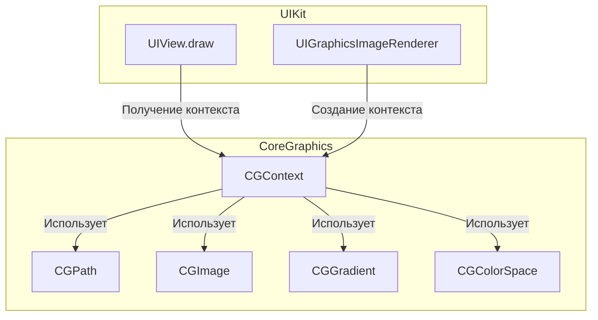

#core-graphics #cgcontext #drawing #2d-graphics #quartz-2d #uikit #ios #cgcontext

---
## CGContext (Core Graphics Context)

### Определение
**CGContext (Core Graphics Context)** — это непрозрачный тип данных (opaque type) во фреймворке [[Core Graphics]] (также известном как Quartz 2D), который представляет собой среду рисования. Он инкапсулирует информацию о том, куда и как будут отрисовываться графические команды: в битмап (изображение), в PDF, на экран (в текущий графический контекст [[UIView]]) или на принтер .

Простыми словами, `CGContext` — это "холст" и "инструменты" одновременно. Он содержит состояние рисования (цвет заливки, цвет обводки, толщину линии, трансформации, область отсечения и т.д.) и предоставляет функции для выполнения операций рисования.

### Зачем это знать iOS-разработчику?
1.  **Кастомное рисование:** Создание уникальных интерфейсных элементов, которые невозможно реализовать стандартными компонентами [[UIKit]].
2.  **Генерация изображений:** Создание изображений программно (например, для отправки на сервер, для сохранения в галерею).
3.  **Работа с PDF:** Генерация и рендеринг [[PDF]]-документов .
4.  **Обработка изображений:** Применение фильтров, изменение размера, наложение водяных знаков.
5.  **Анимация:** Создание кадров для покадровой анимации.
6.  **Графика для игр и визуализации:** Рисование сложных 2D-сцен.

---

### Архитектура Core Graphics



### Типы CGContext

В iOS вы чаще всего будете работать с тремя типами контекстов:

#### 1. Контекст экрана (Screen Context)
Получается в методе `draw(_:)` кастомного `UIView`. UIKit автоматически создает и настраивает этот контекст перед вызовом `draw`.

#### 2. Контекст изображения (Bitmap Context)
Создается для рисования в памяти с последующим получением [[CGImage]] или [[UIImage]]. Используется для программной генерации изображений.

#### 3. Контекст PDF (PDF Context)
Создается для генерации PDF-документов. Все команды рисования записываются в PDF-файл.

---

### Ключевые методы и свойства

#### Получение контекста
- `UIGraphicsGetCurrentContext()` — получает текущий графический контекст (например, в `draw(_:)`).
- `UIGraphicsBeginImageContextWithOptions()` / `UIGraphicsEndImageContext()` — устаревшие методы создания битмап-контекста (лучше использовать `UIGraphicsImageRenderer`).
- `CGContext` создаваемый через `UIGraphicsImageRenderer` или `CGPDFContext`.

#### Состояние контекста
- `saveGState()` / `restoreGState()` — сохранить/восстановить состояние контекста (трансформации, цвета, clipping) .
- `translateBy(x:y:)`, `scaleBy(x:y:)`, `rotate(by:)` — трансформации контекста.

#### Установка параметров рисования
- `setFillColor(_:)`, `setStrokeColor(_:)`, `setLineWidth(_:)`, `setLineDash(phase:lengths:)`.
- `setShadow(offset:blur:color:)` — установка тени.
- `setAlpha(_:)` — установка прозрачности.

#### Рисование примитивов
- `fill(_:)` — залить прямоугольник.
- `stroke(_:)` — обвести прямоугольник.
- `fillPath()` / `strokePath()` — залить/обвести текущий путь.
- `drawPath(using:)` — нарисовать путь с указанным режимом.

#### Работа с путями ([[CGPath]])
- `beginPath()`, `move(to:)`, `addLine(to:)`, `addArc(...)`, `addRect(_:)`, `addEllipse(in:)` — построение пути.
- `closePath()` — замкнуть путь.

#### Рисование текста и изображений
- `draw(_:in:byTiling:)` — рисование изображения.
- `drawPDFPage(_:)` — рисование PDF-страницы.
- `draw` с атрибутами (требуется использование Core Text для продвинутого текста).

#### Clipping (Обрезка)
- `clip(to:)` — установить прямоугольную область обрезки.
- `clip(to:mask:)` — обрезка по маске.
- `EOClip()` — обрезка по правилу even-odd.

#### Градиенты и тени
- `drawLinearGradient(_:start:end:options:)` — линейный градиент.
- `drawRadialGradient(_:startCenter:startRadius:endCenter:endRadius:options:)` — радиальный градиент.
- `setShadow(offset:blur:color:)` — установка тени.

---

### Примеры использования

#### Уровень 1: Кастомное рисование в UIView
Самый простой пример — переопределение `draw(_:)` в кастомном `UIView`.

```swift
import UIKit

class SimpleDrawingView: UIView {
    
    override func draw(_ rect: CGRect) {
        // 1. Получаем текущий графический контекст
        guard let context = UIGraphicsGetCurrentContext() else { return }
        
        // 2. Рисуем красный прямоугольник
        context.setFillColor(UIColor.red.cgColor)
        context.fill(CGRect(x: 50, y: 50, width: 200, height: 100))
        
        // 3. Рисуем синий круг с обводкой
        context.setStrokeColor(UIColor.blue.cgColor)
        context.setLineWidth(5)
        context.setFillColor(UIColor.yellow.cgColor)
        
        let circleRect = CGRect(x: 100, y: 200, width: 100, height: 100)
        context.addEllipse(in: circleRect)
        context.drawPath(using: .fillStroke)
        
        // 4. Рисуем линию
        context.setStrokeColor(UIColor.black.cgColor)
        context.setLineWidth(2)
        context.move(to: CGPoint(x: 50, y: 350))
        context.addLine(to: CGPoint(x: 300, y: 350))
        context.strokePath()
    }
}

// Использование в контроллере
class SimpleDrawingViewController: UIViewController {
    override func viewDidLoad() {
        super.viewDidLoad()
        
        let drawingView = SimpleDrawingView(frame: view.bounds)
        drawingView.backgroundColor = .white
        view.addSubview(drawingView)
    }
}
```

#### Уровень 2: Рисование с сохранением состояния
Использование `saveGState()` и `restoreGState()` для временных изменений.

```swift
import UIKit

class StateDrawingView: UIView {
    
    override func draw(_ rect: CGRect) {
        guard let context = UIGraphicsGetCurrentContext() else { return }
        
        // Рисуем фон
        context.setFillColor(UIColor.lightGray.cgColor)
        context.fill(rect)
        
        // Сохраняем текущее состояние
        context.saveGState()
        
        // Применяем трансформацию (сдвиг)
        context.translateBy(x: 50, y: 50)
        
        // Рисуем красный квадрат (будет сдвинут)
        context.setFillColor(UIColor.red.cgColor)
        context.fill(CGRect(x: 0, y: 0, width: 100, height: 100))
        
        // Восстанавливаем предыдущее состояние (сдвиг отменяется)
        context.restoreGState()
        
        // Рисуем синий квадрат (без сдвига)
        context.setFillColor(UIColor.blue.cgColor)
        context.fill(CGRect(x: 50, y: 50, width: 100, height: 100))
        
        // Сохраняем и применяем поворот
        context.saveGState()
        context.translateBy(x: 250, y: 250) // Смещаем центр вращения
        context.rotate(by: .pi / 4) // Поворот на 45 градусов
        
        // Рисуем зеленый квадрат (повернутый)
        context.setFillColor(UIColor.green.cgColor)
        context.fill(CGRect(x: -50, y: -50, width: 100, height: 100))
        
        context.restoreGState()
    }
}
```

#### Уровень 3: Создание изображения программно ([[UIGraphicsImageRenderer]])
Современный способ создания изображений.

```swift
import UIKit

class ImageGeneratorViewController: UIViewController {
    
    @IBOutlet weak var imageView: UIImageView!
    
    override func viewDidLoad() {
        super.viewDidLoad()
        
        // Создаем изображение с помощью UIGraphicsImageRenderer
        let renderer = UIGraphicsImageRenderer(size: CGSize(width: 300, height: 300))
        
        let image = renderer.image { context in
            // Получаем CGContext из UIGraphicsImageRendererContext
            let cgContext = context.cgContext
            
            // Рисуем градиентный фон
            let colors = [
                UIColor.systemBlue.cgColor,
                UIColor.systemPurple.cgColor
            ]
            
            if let gradient = CGGradient(colorsSpace: nil, colors: colors as CFArray, locations: nil) {
                cgContext.drawLinearGradient(gradient,
                                             start: CGPoint(x: 0, y: 0),
                                             end: CGPoint(x: 300, y: 300),
                                             options: [])
            }
            
            // Рисуем белый круг
            cgContext.setFillColor(UIColor.white.cgColor)
            cgContext.fillEllipse(in: CGRect(x: 100, y: 100, width: 100, height: 100))
            
            // Рисуем текст
            let text = "Hello, Core Graphics!" as NSString
            let attributes: [NSAttributedString.Key: Any] = [
                .font: UIFont.boldSystemFont(ofSize: 20),
                .foregroundColor: UIColor.black
            ]
            text.draw(at: CGPoint(x: 50, y: 220), withAttributes: attributes)
        }
        
        imageView.image = image
    }
}
```

#### Уровень 4: Рисование сложных путей (CGPath)
Создание и рисование сложных фигур.

```swift
import UIKit

class PathDrawingView: UIView {
    
    override func draw(_ rect: CGRect) {
        guard let context = UIGraphicsGetCurrentContext() else { return }
        
        // Создаем путь для звезды
        let starPath = CGMutablePath()
        
        let center = CGPoint(x: 150, y: 150)
        let outerRadius: CGFloat = 100
        let innerRadius: CGFloat = 40
        let points = 5
        
        for i in 0..<points * 2 {
            let angle = (CGFloat(i) * .pi / CGFloat(points)) - .pi / 2
            let radius = i % 2 == 0 ? outerRadius : innerRadius
            
            let x = center.x + cos(angle) * radius
            let y = center.y + sin(angle) * radius
            
            if i == 0 {
                starPath.move(to: CGPoint(x: x, y: y))
            } else {
                starPath.addLine(to: CGPoint(x: x, y: y))
            }
        }
        
        starPath.closeSubpath()
        
        // Добавляем путь в контекст
        context.addPath(starPath)
        
        // Настраиваем заливку и обводку
        context.setFillColor(UIColor.yellow.cgColor)
        context.setStrokeColor(UIColor.orange.cgColor)
        context.setLineWidth(3)
        
        // Рисуем
        context.drawPath(using: .fillStroke)
        
        // Создаем путь для спирали
        let spiralPath = CGMutablePath()
        let startX: CGFloat = 250
        let startY: CGFloat = 250
        
        spiralPath.move(to: CGPoint(x: startX, y: startY))
        
        for i in 0..<100 {
            let angle = CGFloat(i) * 0.5
            let radius = CGFloat(i) * 0.5
            let x = startX + cos(angle) * radius
            let y = startY + sin(angle) * radius
            spiralPath.addLine(to: CGPoint(x: x, y: y))
        }
        
        // Рисуем спираль
        context.addPath(spiralPath)
        context.setStrokeColor(UIColor.blue.cgColor)
        context.setLineWidth(1)
        context.strokePath()
    }
}
```

#### Уровень 5: Работа с градиентами и тенями
Создание объемных эффектов.

```swift
import UIKit

class GradientAndShadowView: UIView {
    
    override func draw(_ rect: CGRect) {
        guard let context = UIGraphicsGetCurrentContext() else { return }
        
        // 1. Рисуем круг с тенью
        context.saveGState()
        
        // Устанавливаем тень
        context.setShadow(offset: CGSize(width: 5, height: 5),
                          blur: 10,
                          color: UIColor.black.withAlphaComponent(0.5).cgColor)
        
        context.setFillColor(UIColor.systemRed.cgColor)
        context.fillEllipse(in: CGRect(x: 50, y: 50, width: 100, height: 100))
        
        context.restoreGState()
        
        // 2. Рисуем прямоугольник с линейным градиентом
        context.saveGState()
        
        let colors = [
            UIColor.systemGreen.cgColor,
            UIColor.systemBlue.cgColor,
            UIColor.systemPurple.cgColor
        ] as CFArray
        
        if let gradient = CGGradient(colorsSpace: nil, colors: colors, locations: [0.0, 0.5, 1.0]) {
            context.drawLinearGradient(gradient,
                                       start: CGPoint(x: 200, y: 50),
                                       end: CGPoint(x: 350, y: 150),
                                       options: [])
        }
        
        context.restoreGState()
        
        // 3. Рисуем радиальный градиент
        context.saveGState()
        
        let radialColors = [
            UIColor.yellow.cgColor,
            UIColor.orange.cgColor
        ] as CFArray
        
        if let radialGradient = CGGradient(colorsSpace: nil, colors: radialColors, locations: [0.0, 1.0]) {
            context.drawRadialGradient(radialGradient,
                                       startCenter: CGPoint(x: 250, y: 250),
                                       startRadius: 10,
                                       endCenter: CGPoint(x: 250, y: 250),
                                       endRadius: 80,
                                       options: [])
        }
        
        context.restoreGState()
    }
}
```

#### Уровень 6: Clipping (Обрезка)
Создание фигур с обрезкой.

```swift
import UIKit

class ClippingView: UIView {
    
    override func draw(_ rect: CGRect) {
        guard let context = UIGraphicsGetCurrentContext() else { return }
        
        // 1. Создаем область обрезки в форме круга
        context.saveGState()
        
        let circlePath = UIBezierPath(ovalIn: CGRect(x: 50, y: 50, width: 200, height: 200))
        context.addPath(circlePath.cgPath)
        context.clip()
        
        // Рисуем изображение внутри круга
        if let image = UIImage(named: "sample_image") {
            image.draw(in: CGRect(x: 50, y: 50, width: 200, height: 200))
        } else {
            // Если изображения нет, рисуем градиент
            let colors = [UIColor.red.cgColor, UIColor.blue.cgColor]
            if let gradient = CGGradient(colorsSpace: nil, colors: colors as CFArray, locations: nil) {
                context.drawLinearGradient(gradient,
                                           start: CGPoint(x: 50, y: 50),
                                           end: CGPoint(x: 250, y: 250),
                                           options: [])
            }
        }
        
        context.restoreGState()
        
        // 2. Создаем область обрезки в форме звезды
        context.saveGState()
        
        let starPath = createStarPath(center: CGPoint(x: 300, y: 300),
                                      outerRadius: 80,
                                      innerRadius: 40,
                                      points: 5)
        context.addPath(starPath)
        context.clip()
        
        // Рисуем паттерн внутри звезды
        context.setFillColor(UIColor.yellow.cgColor)
        context.fill(CGRect(x: 250, y: 250, width: 100, height: 100))
        
        for i in 0..<10 {
            for j in 0..<10 {
                context.setFillColor(UIColor(hue: CGFloat(i)/10,
                                             saturation: 1,
                                             brightness: 1,
                                             alpha: 1).cgColor)
                context.fill(CGRect(x: 250 + CGFloat(i)*10,
                                     y: 250 + CGFloat(j)*10,
                                     width: 5,
                                     height: 5))
            }
        }
        
        context.restoreGState()
    }
    
    private func createStarPath(center: CGPoint, outerRadius: CGFloat, innerRadius: CGFloat, points: Int) -> CGPath {
        let path = CGMutablePath()
        
        for i in 0..<points * 2 {
            let angle = (CGFloat(i) * .pi / CGFloat(points)) - .pi / 2
            let radius = i % 2 == 0 ? outerRadius : innerRadius
            
            let x = center.x + cos(angle) * radius
            let y = center.y + sin(angle) * radius
            
            if i == 0 {
                path.move(to: CGPoint(x: x, y: y))
            } else {
                path.addLine(to: CGPoint(x: x, y: y))
            }
        }
        
        path.closeSubpath()
        return path
    }
}
```

#### Уровень 7: Генерация PDF
Создание PDF-документа с помощью CGContext.

```swift
import UIKit
import PDFKit

class PDFGeneratorViewController: UIViewController {
    
    override func viewDidLoad() {
        super.viewDidLoad()
        
        generatePDF()
    }
    
    func generatePDF() {
        let pdfSize = CGSize(width: 612, height: 792) // Размер Letter
        
        // Создаем временный URL для PDF
        let pdfURL = FileManager.default.temporaryDirectory.appendingPathComponent("document.pdf")
        
        // Создаем PDF контекст
        guard let pdfContext = CGContext(pdfURL as CFURL, mediaBox: nil, nil) else { return }
        
        // Начинаем первую страницу
        pdfContext.beginPDFPage(nil)
        
        // Рисуем содержимое страницы
        drawPDFPage(in: pdfContext, pageSize: pdfSize)
        
        // Завершаем страницу
        pdfContext.endPDFPage()
        
        // Начинаем вторую страницу
        pdfContext.beginPDFPage(nil)
        
        // Рисуем содержимое второй страницы
        drawPDFPage2(in: pdfContext, pageSize: pdfSize)
        
        // Завершаем страницу
        pdfContext.endPDFPage()
        
        // Закрываем PDF контекст
        pdfContext.closePDF()
        
        print("PDF создан: \(pdfURL)")
        
        // Можно открыть PDF с помощью PDFView
        let pdfView = PDFView(frame: view.bounds)
        pdfView.document = PDFDocument(url: pdfURL)
        view.addSubview(pdfView)
    }
    
    private func drawPDFPage(in context: CGContext, pageSize: CGSize) {
        // Устанавливаем белый фон
        context.setFillColor(UIColor.white.cgColor)
        context.fill(CGRect(origin: .zero, size: pageSize))
        
        // Рисуем заголовок
        context.setFillColor(UIColor.black.cgColor)
        
        let title = "PDF Document" as NSString
        let titleAttributes: [NSAttributedString.Key: Any] = [
            .font: UIFont.boldSystemFont(ofSize: 24)
        ]
        title.draw(at: CGPoint(x: 50, y: 50), withAttributes: titleAttributes)
        
        // Рисуем линию
        context.setStrokeColor(UIColor.gray.cgColor)
        context.setLineWidth(2)
        context.move(to: CGPoint(x: 50, y: 100))
        context.addLine(to: CGPoint(x: pageSize.width - 50, y: 100))
        context.strokePath()
        
        // Рисуем текст
        let text = "This is a sample PDF generated with Core Graphics." as NSString
        let textAttributes: [NSAttributedString.Key: Any] = [
            .font: UIFont.systemFont(ofSize: 16)
        ]
        text.draw(at: CGPoint(x: 50, y: 120), withAttributes: textAttributes)
        
        // Рисуем круг
        context.setFillColor(UIColor.red.withAlphaComponent(0.5).cgColor)
        context.fillEllipse(in: CGRect(x: 400, y: 600, width: 100, height: 100))
    }
    
    private func drawPDFPage2(in context: CGContext, pageSize: CGSize) {
        context.setFillColor(UIColor.white.cgColor)
        context.fill(CGRect(origin: .zero, size: pageSize))
        
        // Рисуем градиент
        let colors = [UIColor.blue.cgColor, UIColor.purple.cgColor]
        if let gradient = CGGradient(colorsSpace: nil, colors: colors as CFArray, locations: nil) {
            context.drawLinearGradient(gradient,
                                       start: CGPoint(x: 0, y: 0),
                                       end: CGPoint(x: pageSize.width, y: pageSize.height),
                                       options: [])
        }
        
        // Рисуем текст
        let text = "Page 2" as NSString
        let attributes: [NSAttributedString.Key: Any] = [
            .font: UIFont.boldSystemFont(ofSize: 30),
            .foregroundColor: UIColor.white
        ]
        text.draw(at: CGPoint(x: 250, y: 400), withAttributes: attributes)
    }
}
```

#### Уровень 8: Маски и прозрачность
Использование масок для создания сложных эффектов прозрачности.

```swift
import UIKit

class MaskingView: UIView {
    
    override func draw(_ rect: CGRect) {
        guard let context = UIGraphicsGetCurrentContext() else { return }
        
        // 1. Рисуем фон с градиентом
        let backgroundColors = [UIColor.red.cgColor, UIColor.yellow.cgColor]
        if let gradient = CGGradient(colorsSpace: nil, colors: backgroundColors as CFArray, locations: nil) {
            context.drawLinearGradient(gradient,
                                       start: CGPoint(x: 0, y: 0),
                                       end: CGPoint(x: bounds.width, y: bounds.height),
                                       options: [])
        }
        
        // 2. Создаем маску в форме круга
        context.saveGState()
        
        // Рисуем круг, который станет областью видимости
        let circlePath = CGMutablePath()
        circlePath.addEllipse(in: CGRect(x: 100, y: 100, width: 200, height: 200))
        
        // Добавляем прямоугольник для внешней области (с использованием even-odd правила)
        let rectPath = CGMutablePath()
        rectPath.addRect(bounds)
        rectPath.addPath(circlePath)
        
        context.addPath(rectPath)
        context.clip(using: .evenOdd)
        
        // Закрашиваем внешнюю область черным (она станет прозрачной)
        context.setFillColor(UIColor.black.cgColor)
        context.fill(bounds)
        
        context.restoreGState()
        
        // 3. Рисуем изображение внутри круга
        context.saveGState()
        
        // Устанавливаем круг как область обрезки
        let circleClipPath = UIBezierPath(ovalIn: CGRect(x: 100, y: 100, width: 200, height: 200))
        context.addPath(circleClipPath.cgPath)
        context.clip()
        
        // Рисуем текстуру внутри круга
        context.setFillColor(UIColor.blue.cgColor)
        context.fill(CGRect(x: 100, y: 100, width: 200, height: 200))
        
        for i in 0..<20 {
            for j in 0..<20 {
                if (i + j) % 2 == 0 {
                    context.setFillColor(UIColor.white.cgColor)
                } else {
                    context.setFillColor(UIColor.black.cgColor)
                }
                context.fill(CGRect(x: 100 + CGFloat(i)*10,
                                     y: 100 + CGFloat(j)*10,
                                     width: 5,
                                     height: 5))
            }
        }
        
        context.restoreGState()
    }
}
```

---

### CGContext vs Другие способы рисования

| Характеристика            | CGContext                  | UIKit ([[UIBezierPath]])   | Core Graphics (высокоуровневый) | [[SwiftUI]]   |
| ------------------------- | -------------------------- | -------------------------- | ------------------------------- | ------------- |
| **Уровень API**           | Низкий                     | Средний                    | Средний                         | Высокий       |
| **Производительность**    | Очень высокая              | Высокая                    | Высокая                         | Высокая       |
| **Гибкость**              | Максимальная               | Средняя                    | Средняя                         | Высокая       |
| **Сложность кода**        | Высокая                    | Средняя                    | Средняя                         | Низкая        |
| **Управление состоянием** | Ручное (save/restore)      | Частично автоматическое    | Частично автоматическое         | Декларативное |
| **Поддержка анимации**    | Нет (нужно перерисовывать) | Нет (нужно перерисовывать) | Нет (нужно перерисовывать)      | Да            |

### Best Practices

#### 1. **Используйте saveGState и restoreGState**
Всегда сохраняйте состояние контекста перед внесением временных изменений (трансформации, цвета, clipping) и восстанавливайте после.

```swift
context.saveGState()
// временные изменения
context.restoreGState()
```

#### 2. **Не рисуйте в draw(_:) каждый раз без необходимости**
Метод `draw(_:)` вызывается при каждой перерисовке. Кэшируйте сложные изображения в `UIImage` и просто отображайте их.

#### 3. **Используйте UIGraphicsImageRenderer для создания изображений**
Он современнее, безопаснее и проще в использовании, чем старые функции `UIGraphicsBeginImageContext`.

#### 4. **Избегайте излишней сложности**
Для простых фигур используйте `UIBezierPath`, который предоставляет удобную обертку над `CGPath`.

#### 5. **Очищайте пути после использования**
Не забывайте завершать пути и очищать контекст при необходимости.

#### 6. **Учитывайте Retina дисплеи**
При создании изображений учитывайте масштаб экрана через `UIScreen.main.scale`.

```swift
let renderer = UIGraphicsImageRenderer(size: size)
let image = renderer.image { context in
    // context уже настроен с правильным масштабом
}
```

#### 7. **Потокобезопасность**
`CGContext` не является потокобезопасным. Все операции рисования должны выполняться в одном потоке.

### Итог
**CGContext** — это фундаментальный инструмент для низкоуровневого 2D-рисования в iOS. Он предоставляет:

- **Полный контроль** над процессом рисования
- **Высокую производительность** благодаря прямым вызовам графических функций
- **Гибкость** для создания любых визуальных эффектов
- **Интеграцию** с UIKit, PDF и битмапами

Понимание `CGContext` необходимо для создания кастомных элементов интерфейса, генерации изображений, работы с PDF и любой другой задачи, требующей низкоуровневого контроля над графикой.