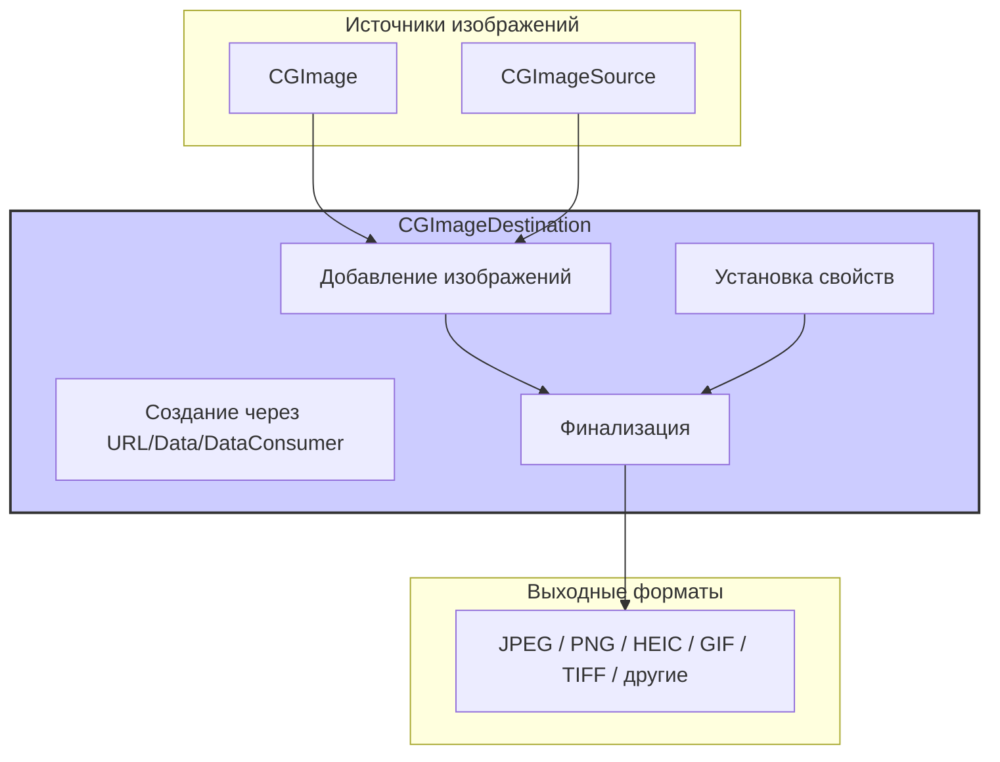

#core-graphics #imageio #cgimagedestination #image-saving #metadata #gif #heic #ios

---
## CGImageDestination

### Определение
**CGImageDestination** — это непрозрачный тип данных (opaque type) во фреймворке Image I/O, который предоставляет абстрактный интерфейс для записи данных изображения в файл, объект данных (NSMutableData/CFMutableData) или потребитель данных (CGDataConsumer) . Он позволяет сохранять как одиночные изображения, так и множественные изображения, упакованные вместе (например, анимированные GIF, тайлы) .

В отличие от высокоуровневых методов вроде [[UIImagePNGRepresentation]] и [[UIImageJPEGRepresentation]], `CGImageDestination` предоставляет детальный контроль над процессом сохранения изображений: управление метаданными, EXIF, цветовыми профилями, прогрессивной загрузкой, оптимизацией цветов для совместного использования и многими другими параметрами .

### Зачем это знать iOS-разработчику?
1.  **Сохранение с метаданными:** Позволяет сохранять изображения вместе с EXIF, GPS, XMP и другими метаданными .
2.  **Создание анимированных GIF:** Единственный нативный способ создания анимированных GIF-файлов из набора изображений .
3.  **Пакетная обработка:** Эффективное сохранение нескольких изображений в один файл (например, для многостраничных TIFF или тайлов).
4.  **Тонкий контроль качества:** Управление степенью сжатия, цветовым пространством, фоном для изображений с альфа-каналом .
5.  **Вспомогательные данные:** Сохранение карт глубины (depth maps), портретных масок (portrait effects matte) и другой вспомогательной информации вместе с изображением .
6.  **Профессиональная обработка:** Интеграция с другими инструментами Core Graphics и Image I/O для создания комплексных пайплайнов обработки изображений.

---

### Архитектура и место в Image I/O



### Ключевые методы и свойства

#### Создание CGImageDestination
- `CGImageDestinationCreateWithURL` — создает назначение для записи по URL .
- `CGImageDestinationCreateWithData` — создает назначение для записи в `CFMutableData` .
- `CGImageDestinationCreateWithDataConsumer` — создает назначение для записи через `CGDataConsumer` .

#### Добавление изображений
- `CGImageDestinationAddImage` — добавляет изображение `CGImage` с опциональными свойствами .
- `CGImageDestinationAddImageFromSource` — добавляет изображение из `CGImageSource`, сохраняя его исходные свойства и метаданные .
- `CGImageDestinationAddAuxiliaryDataInfo` — добавляет вспомогательные данные (карты глубины, маски) .

#### Настройка свойств
- `CGImageDestinationSetProperties` — устанавливает свойства, применяемые ко всем изображениям в назначении .
- `CGImageDestinationCopyTypeIdentifiers` — возвращает массив поддерживаемых типов UTI .

#### Завершение
- `CGImageDestinationFinalize` — завершает процесс записи и сохраняет данные .

#### Ключевые свойства (константы)
- `kCGImageDestinationLossyCompressionQuality` — качество сжатия (0.0 - 1.0) .
- `kCGImageDestinationBackgroundColor` — цвет фона для изображений с альфа-каналом .
- `kCGImageDestinationImageMaxPixelSize` — максимальный размер изображения в пикселях .
- `kCGImageDestinationMetadata` — метаданные для включения в изображение .
- `kCGImageDestinationOrientation` — ориентация изображения (значения EXIF 1-8) .
- `kCGImagePropertyGIFLoopCount` — количество циклов анимации GIF .
- `kCGImagePropertyGIFDelayTime` — задержка между кадрами GIF .

---

### Примеры использования

#### Уровень 1: Базовое сохранение JPEG с настройкой качества
Простейший пример — сохранение изображения в файл с заданным качеством сжатия.

```swift
import UIKit
import ImageIO
import MobileCoreServices

func saveImageAsJPEG(image: UIImage, to url: URL, quality: CGFloat = 0.8) -> Bool {
    guard let cgImage = image.cgImage else { return false }
    
    // 1. Создаем CGImageDestination для записи в URL
    guard let destination = CGImageDestinationCreateWithURL(url as CFURL,
                                                            kUTTypeJPEG,
                                                            1,
                                                            nil) else {
        print("Не удалось создать CGImageDestination")
        return false
    }
    
    // 2. Устанавливаем свойства (качество сжатия)
    let properties: [CFString: Any] = [
        kCGImageDestinationLossyCompressionQuality: quality
    ]
    
    // 3. Добавляем изображение
    CGImageDestinationAddImage(destination, cgImage, properties as CFDictionary)
    
    // 4. Финализируем сохранение
    return CGImageDestinationFinalize(destination)
}

// Использование:
let image = UIImage(named: "example")!
let documentsURL = FileManager.default.urls(for: .documentDirectory, in: .userDomainMask).first!
let outputURL = documentsURL.appendingPathComponent("output.jpg")

if saveImageAsJPEG(image: image, to: outputURL, quality: 0.9) {
    print("Изображение сохранено: \(outputURL)")
} else {
    print("Ошибка сохранения")
}
```

#### Уровень 2: Сохранение PNG с метаданными
Пример сохранения PNG с добавлением метаданных.

```swift
import UIKit
import ImageIO
import MobileCoreServices

func saveImageWithMetadata(image: UIImage, metadata: [String: Any], to url: URL) -> Bool {
    guard let cgImage = image.cgImage else { return false }
    
    guard let destination = CGImageDestinationCreateWithURL(url as CFURL,
                                                            kUTTypePNG,
                                                            1,
                                                            nil) else {
        return false
    }
    
    // Создаем метаданные в формате, ожидаемом ImageIO
    var properties: [CFString: Any] = [:]
    
    // Добавляем EXIF метаданные, если есть
    if let exifData = metadata["exif"] as? [String: Any] {
        properties[kCGImagePropertyExifDictionary] = exifData
    }
    
    // Добавляем GPS метаданные, если есть 
    if let gpsData = metadata["gps"] as? [String: Any] {
        properties[kCGImagePropertyGPSDictionary] = gpsData
    }
    
    // Добавляем изображение с метаданными
    CGImageDestinationAddImage(destination, cgImage, properties as CFDictionary)
    
    return CGImageDestinationFinalize(destination)
}

// Использование:
let metadata: [String: Any] = [
    "exif": [
        kCGImagePropertyExifDateTimeOriginal: "2025:01:15 14:30:00",
        kCGImagePropertyExifUserComment: "Пример комментария"
    ],
    "gps": [
        kCGImagePropertyGPSLatitude: 55.751244,
        kCGImagePropertyGPSLongitude: 37.618423
    ]
]

saveImageWithMetadata(image: image, metadata: metadata, to: outputURL)
```

#### Уровень 3: Создание анимированного GIF из массива изображений
Классический пример создания анимированного GIF .

```swift
import UIKit
import ImageIO
import MobileCoreServices

func createAnimatedGIF(from images: [UIImage],
                       loopCount: Int = 0, // 0 = бесконечный цикл
                       frameDelay: Double = 0.1,
                       to url: URL) -> Bool {
    
    // 1. Получаем CGImage из UIImage
    let cgImages = images.compactMap { $0.cgImage }
    guard !cgImages.isEmpty else { return false }
    
    // 2. Создаем CGImageDestination для GIF
    guard let destination = CGImageDestinationCreateWithURL(url as CFURL,
                                                            kUTTypeGIF,
                                                            cgImages.count,
                                                            nil) else {
        print("Не удалось создать CGImageDestination для GIF")
        return false
    }
    
    // 3. Устанавливаем глобальные свойства GIF (циклы) 
    let gifProperties: [CFString: Any] = [
        kCGImagePropertyGIFLoopCount: loopCount
    ]
    
    let globalProperties: [CFString: Any] = [
        kCGImagePropertyGIFDictionary: gifProperties
    ]
    
    CGImageDestinationSetProperties(destination, globalProperties as CFDictionary)
    
    // 4. Добавляем каждый кадр с его свойствами (задержка) 
    let frameProperties: [CFString: Any] = [
        kCGImagePropertyGIFDictionary: [
            kCGImagePropertyGIFDelayTime: frameDelay
        ]
    ]
    
    for cgImage in cgImages {
        CGImageDestinationAddImage(destination, cgImage, frameProperties as CFDictionary)
    }
    
    // 5. Финализируем создание GIF
    return CGImageDestinationFinalize(destination)
}

// Использование:
let frames = [UIImage(named: "frame1")!, UIImage(named: "frame2")!, UIImage(named: "frame3")!]
let gifURL = documentsURL.appendingPathComponent("animation.gif")

if createAnimatedGIF(from: frames, loopCount: 0, frameDelay: 0.2, to: gifURL) {
    print("GIF создан: \(gifURL)")
}
```

#### Уровень 4: Копирование изображения с сохранением и модификацией метаданных
Пример редактирования метаданных существующего изображения .

```swift
import UIKit
import ImageIO
import MobileCoreServices

func modifyImageMetadata(sourceURL: URL,
                        destinationURL: URL,
                        modifyMetadata: (CFDictionary) -> CFDictionary) -> Bool {
    
    // 1. Создаем CGImageSource из исходного файла
    guard let source = CGImageSourceCreateWithURL(sourceURL as CFURL, nil) else {
        print("Не удалось создать CGImageSource")
        return false
    }
    
    // 2. Получаем тип изображения (UTI)
    guard let uti = CGImageSourceGetType(source) else { return false }
    
    // 3. Создаем CGImageDestination для выходного файла
    guard let destination = CGImageDestinationCreateWithURL(destinationURL as CFURL,
                                                            uti,
                                                            1,
                                                            nil) else {
        return false
    }
    
    // 4. Получаем исходные метаданные
    guard let originalMetadata = CGImageSourceCopyPropertiesAtIndex(source, 0, nil) else {
        return false
    }
    
    // 5. Применяем модификацию метаданных
    let modifiedMetadata = modifyMetadata(originalMetadata)
    
    // 6. Добавляем изображение из источника с модифицированными метаданными
    CGImageDestinationAddImageFromSource(destination, source, 0, modifiedMetadata)
    
    // 7. Финализируем
    return CGImageDestinationFinalize(destination)
}

// Использование: добавляем GPS-координаты к существующему изображению 
let sourceURL = documentsURL.appendingPathComponent("photo.jpg")
let outputURL = documentsURL.appendingPathComponent("photo_with_gps.jpg")

let success = modifyImageMetadata(sourceURL: sourceURL, destinationURL: outputURL) { metadata in
    let mutableMetadata = NSMutableDictionary(dictionary: metadata as! [AnyHashable: Any])
    
    // Создаем GPS словарь
    let gpsDict: [CFString: Any] = [
        kCGImagePropertyGPSLatitude: 55.751244,
        kCGImagePropertyGPSLongitude: 37.618423
    ]
    
    mutableMetadata[kCGImagePropertyGPSDictionary] = gpsDict
    return mutableMetadata
}
```

#### Уровень 5: Создание [[HEIC]] с картой глубины (портретный режим)
Пример сохранения изображения с дополнительными данными глубины .

```swift
import UIKit
import ImageIO
import MobileCoreServices
import AVFoundation
import CoreImage

func saveHEICWithDepthData(image: CGImage,
                          depthData: AVDepthData,
                          to url: URL) -> Bool {
    
    // 1. Создаем CGImageDestination для HEIC
    guard let destination = CGImageDestinationCreateWithURL(url as CFURL,
                                                            kUTTypeHEIC,
                                                            1,
                                                            nil) else {
        return false
    }
    
    // 2. Преобразуем AVDepthData в вспомогательные данные для ImageIO
    // (упрощенно - в реальности требуется конвертация в CGImageAuxiliaryDataType)
    
    // 3. Добавляем изображение
    CGImageDestinationAddImage(destination, image, nil)
    
    // 4. Добавляем вспомогательные данные (карту глубины) 
    // В реальном коде нужно создать CGImageAuxiliaryDataInfo
    // CGImageDestinationAddAuxiliaryDataInfo(destination, kCGImageAuxiliaryDataTypeDepth, depthInfo)
    
    return CGImageDestinationFinalize(destination)
}
```

#### Уровень 6: Создание многостраничного TIFF
Пример объединения нескольких изображений в один TIFF-файл.

```swift
import UIKit
import ImageIO
import MobileCoreServices

func createMultiPageTIFF(images: [CGImage], to url: URL) -> Bool {
    
    guard let destination = CGImageDestinationCreateWithURL(url as CFURL,
                                                            kUTTypeTIFF,
                                                            images.count,
                                                            nil) else {
        return false
    }
    
    // Настройки для TIFF (можно задать глобально)
    let tiffProperties: [CFString: Any] = [
        kCGImagePropertyTIFFCompression: NSTIFFCompressionLZW,
        kCGImagePropertyTIFFXResolution: 72,
        kCGImagePropertyTIFFYResolution: 72
    ]
    
    CGImageDestinationSetProperties(destination, tiffProperties as CFDictionary)
    
    // Добавляем все страницы
    for (index, image) in images.enumerated() {
        // Можно задать свойства для каждой страницы отдельно
        let pageProperties: [CFString: Any] = [
            kCGImagePropertyTIFFDictionary: [
                "PageNumber": index
            ]
        ]
        CGImageDestinationAddImage(destination, image, pageProperties as CFDictionary)
    }
    
    return CGImageDestinationFinalize(destination)
}
```

---

### CGImageDestination vs Другие методы сохранения

| Характеристика | CGImageDestination | UIKit (UIImagePNGRepresentation) | Core Graphics (CGContext) |
|---|---|---|---|
| **Уровень API** | Средний (Image I/O) | Высокий | Низкий (Core Graphics) |
| **Контроль метаданных** | Полный | Отсутствует | Ограниченный |
| **Поддержка множественных изображений** | Да (GIF, TIFF) | Нет | Нет |
| **Сохранение вспомогательных данных** | Да (глубина, маски) | Нет | Нет |
| **Поддержка различных форматов** | Все форматы Image I/O | PNG/JPEG только | Зависит от контекста |
| **Простота использования** | Средняя | Высокая | Низкая |
| **Гибкость** | Высокая | Низкая | Средняя |

### Best Practices

#### 1. **Всегда проверяйте успешность создания**
`CGImageDestinationCreateWithURL` и подобные функции возвращают опциональные значения. Всегда проверяйте их перед использованием .

#### 2. **Правильно указывайте count**
Количество изображений должно точно соответствовать числу добавляемых изображений. При создании GIF или многостраничных TIFF это особенно важно.

#### 3. **Завершайте запись через Finalize**
Не забывайте вызывать `CGImageDestinationFinalize` — без этого данные не будут записаны .

#### 4. **Используйте CGImageDestinationAddImageFromSource для копирования**
При копировании изображений с сохранением метаданных используйте `CGImageDestinationAddImageFromSource` вместо извлечения и повторного добавления .

#### 5. **Учитывайте форматы и совместимость**
Не все форматы поддерживают все типы метаданных. Например, PNG имеет ограниченную поддержку EXIF по сравнению с JPEG/TIFF.

#### 6. **Освобождайте ресурсы**
`CGImageDestination` является Core Foundation объектом и требует ручного управления памятью (в Swift это обычно автоматизировано, но в смешанном коде нужно быть внимательным).

#### 7. **Используйте константы UTI**
Всегда используйте константы из `MobileCoreServices`/`UniformTypeIdentifiers` для указания типов файлов (например, `kUTTypeJPEG`, `kUTTypePNG`).

### Итог
**CGImageDestination** — это мощный инструмент для профессионального сохранения изображений в iOS. Он предоставляет:

- **Полный контроль над метаданными** (EXIF, GPS, XMP)
- **Поддержку множественных изображений** (GIF, TIFF)
- **Сохранение вспомогательных данных** (карты глубины, маски)
- **Тонкую настройку параметров** сохранения для различных форматов
- **Интеграцию** с другими компонентами Image I/O и Core Graphics

Этот класс незаменим при создании приложений, требующих профессиональной обработки и сохранения изображений с сохранением всех метаданных и дополнительной информации.