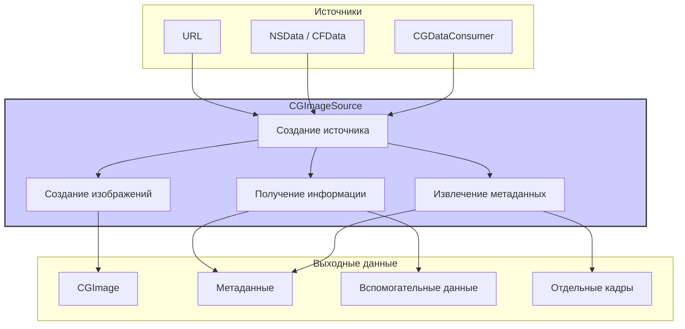

#core-graphics #imageio #cgimagesource #image-loading #metadata #gif #heic #ios

---
## CGImageSource

### Определение
**CGImageSource** — это непрозрачный тип данных (opaque type) во фреймворке Image I/O, который предоставляет абстрактный интерфейс для чтения данных изображения из различных источников: файлов, объектов данных (NSData/CFData) или потребителей данных (CGDataConsumer) . Он позволяет получать информацию об изображении, его метаданные, создавать [[CGImage]] для отображения или обработки, а также извлекать отдельные кадры из многостраничных или анимированных изображений .

В отличие от высокоуровневых методов вроде `UIImage(named:)`, `CGImageSource` предоставляет детальный контроль над процессом загрузки изображений: чтение метаданных без полной загрузки изображения, выбор подходящего размера, извлечение отдельных кадров из GIF или TIFF, доступ к вспомогательным данным (картам глубины) и многое другое .

### Зачем это знать iOS-разработчику?
1.  **Эффективная загрузка:** Возможность читать метаданные (размер, ориентацию, EXIF) без загрузки всего изображения в память .
2.  **Оптимизация памяти:** Создание уменьшенных копий (downsampling) больших изображений без полной загрузки .
3.  **Работа с анимированными изображениями:** Извлечение отдельных кадров из GIF, APNG, анимированных [[HEIC]] .
4.  **Извлечение метаданных:** Доступ к EXIF, GPS, XMP и другим метаданным для профессиональной обработки .
5.  **Поддержка множественных изображений:** Работа с многостраничными TIFF, иконками ICO, тайловыми изображениями .
6.  **Вспомогательные данные:** Получение карт глубины (depth maps), портретных масок и другой дополнительной информации .
7.  **Интеграция с CGImageDestination:** Создание пайплайнов обработки изображений с копированием метаданных .

---

### Архитектура и место в Image I/O



### Ключевые методы и свойства

#### Создание CGImageSource
- `CGImageSourceCreateWithURL` — создает источник изображения из [[URL]] .
- `CGImageSourceCreateWithData` — создает источник из данных (NSData/CFData) .
- `CGImageSourceCreateWithDataProvider` — создает источник из провайдера данных (CGDataProvider) .
- `CGImageSourceCreateIncremental` — создает источник для инкрементальной (постепенной) загрузки .

#### Получение информации
- `CGImageSourceGetCount` — возвращает количество изображений/кадров в источнике .
- `CGImageSourceGetType` — возвращает UTI (Uniform Type Identifier) типа изображения .
- `CGImageSourceCopyProperties` — возвращает словарь со свойствами изображения (метаданные) .
- `CGImageSourceCopyPropertiesAtIndex` — возвращает свойства для конкретного индекса (кадра) .
- `CGImageSourceCopyMetadataAtIndex` — возвращает метаданные для конкретного индекса .

#### Создание изображений
- `CGImageSourceCreateImageAtIndex` — создает CGImage для указанного индекса .
- `CGImageSourceCreateThumbnailAtIndex` — создает уменьшенное изображение с заданными параметрами (без полной загрузки оригинала) .
- `CGImageSourceCreateImage` — создает CGImage для первого изображения в источнике .

#### Вспомогательные данные
- `CGImageSourceCopyAuxiliaryDataInfoAtIndex` — возвращает вспомогательные данные (карты глубины, маски) для указанного индекса .

---

### Примеры использования

#### Уровень 1: Базовая загрузка изображения и получение информации
Простейший пример — загрузка изображения и получение основной информации.

```swift
import UIKit
import ImageIO
import MobileCoreServices

func loadImageInfo(from url: URL) {
    // 1. Создаем источник изображения из URL
    guard let imageSource = CGImageSourceCreateWithURL(url as CFURL, nil) else {
        print("Не удалось создать CGImageSource")
        return
    }
    
    // 2. Получаем тип изображения (UTI)
    if let uti = CGImageSourceGetType(imageSource) {
        print("Тип изображения: \(uti)")
    }
    
    // 3. Получаем количество изображений/кадров
    let count = CGImageSourceGetCount(imageSource)
    print("Количество изображений/кадров: \(count)")
    
    // 4. Получаем общие свойства изображения
    if let properties = CGImageSourceCopyProperties(imageSource, nil) as? [String: Any] {
        print("Общие свойства:")
        for (key, value) in properties {
            print("  \(key): \(value)")
        }
        
        // Получаем размер изображения
        if let width = properties[kCGImagePropertyPixelWidth as String] as? Int,
           let height = properties[kCGImagePropertyPixelHeight as String] as? Int {
            print("Размер: \(width) x \(height)")
        }
    }
    
    // 5. Создаем CGImage для первого кадра
    if let cgImage = CGImageSourceCreateImageAtIndex(imageSource, 0, nil) {
        print("CGImage создан успешно. Размер: \(cgImage.width) x \(cgImage.height)")
        
        // Можно создать UIImage для отображения
        let image = UIImage(cgImage: cgImage)
        // Используем image...
    }
}

// Использование:
let imageURL = Bundle.main.url(forResource: "example", withExtension: "jpg")!
loadImageInfo(from: imageURL)
```

#### Уровень 2: Извлечение метаданных (EXIF, GPS)
Пример получения детальных метаданных изображения.

```swift
import UIKit
import ImageIO

func extractMetadata(from url: URL) {
    guard let imageSource = CGImageSourceCreateWithURL(url as CFURL, nil) else { return }
    
    // Получаем свойства для первого изображения
    guard let properties = CGImageSourceCopyPropertiesAtIndex(imageSource, 0, nil) as? [String: Any] else { return }
    
    print("=== МЕТАДАННЫЕ ===")
    
    // EXIF данные
    if let exif = properties[kCGImagePropertyExifDictionary as String] as? [String: Any] {
        print("\n--- EXIF ---")
        if let dateTime = exif[kCGImagePropertyExifDateTimeOriginal as String] {
            print("Дата съемки: \(dateTime)")
        }
        if let exposureTime = exif[kCGImagePropertyExifExposureTime as String] {
            print("Выдержка: \(exposureTime)")
        }
        if let fNumber = exif[kCGImagePropertyExifFNumber as String] {
            print("Диафрагма: \(fNumber)")
        }
        if let iso = exif[kCGImagePropertyExifISOSpeedRatings as String] {
            print("ISO: \(iso)")
        }
        if let focalLength = exif[kCGImagePropertyExifFocalLength as String] {
            print("Фокусное расстояние: \(focalLength)")
        }
    }
    
    // GPS данные
    if let gps = properties[kCGImagePropertyGPSDictionary as String] as? [String: Any] {
        print("\n--- GPS ---")
        if let latitude = gps[kCGImagePropertyGPSLatitude as String] {
            print("Широта: \(latitude)")
        }
        if let longitude = gps[kCGImagePropertyGPSLongitude as String] {
            print("Долгота: \(longitude)")
        }
        if let altitude = gps[kCGImagePropertyGPSAltitude as String] {
            print("Высота: \(altitude)")
        }
    }
    
    // TIFF данные
    if let tiff = properties[kCGImagePropertyTIFFDictionary as String] as? [String: Any] {
        print("\n--- TIFF ---")
        if let make = tiff[kCGImagePropertyTIFFMake as String] {
            print("Производитель камеры: \(make)")
        }
        if let model = tiff[kCGImagePropertyTIFFModel as String] {
            print("Модель камеры: \(model)")
        }
        if let software = tiff[kCGImagePropertyTIFFSoftware as String] {
            print("Программное обеспечение: \(software)")
        }
    }
}
```

#### Уровень 3: Создание уменьшенного изображения (downsampling) для экономии памяти
Критически важная техника для загрузки больших изображений .

```swift
import UIKit
import ImageIO

func downsampleImage(at url: URL, to pointSize: CGSize, scale: CGFloat = UIScreen.main.scale) -> UIImage? {
    // Опции для источника изображения - не загружаем изображение полностью в память
    let sourceOptions = [kCGImageSourceShouldCache: false] as CFDictionary
    
    guard let imageSource = CGImageSourceCreateWithURL(url as CFURL, sourceOptions) else {
        return nil
    }
    
    // Максимальный размер в пикселях (с учетом масштаба экрана)
    let maxDimensionInPixels = max(pointSize.width, pointSize.height) * scale
    
    // Опции для создания уменьшенного изображения
    let downsampleOptions = [
        kCGImageSourceCreateThumbnailFromImageAlways: true,
        kCGImageSourceShouldCacheImmediately: true, // Кэшируем после создания
        kCGImageSourceCreateThumbnailWithTransform: true, // Учитываем ориентацию
        kCGImageSourceThumbnailMaxPixelSize: maxDimensionInPixels
    ] as CFDictionary
    
    // Создаем уменьшенное изображение
    guard let downsampledImage = CGImageSourceCreateThumbnailAtIndex(imageSource, 0, downsampleOptions) else {
        return nil
    }
    
    return UIImage(cgImage: downsampledImage)
}

// Использование в контроллере:
class EfficientImageViewController: UIViewController {
    
    @IBOutlet weak var imageView: UIImageView!
    
    override func viewDidLoad() {
        super.viewDidLoad()
        
        let imageURL = Bundle.main.url(forResource: "huge_photo", withExtension: "jpg")!
        
        // Загружаем изображение только в том размере, который нужен для UIImageView
        DispatchQueue.global(qos: .userInitiated).async { [weak self] in
            let downsampledImage = downsampleImage(at: imageURL, to: self?.imageView.bounds.size ?? .zero)
            
            DispatchQueue.main.async {
                self?.imageView.image = downsampledImage
            }
        }
    }
}
```

#### Уровень 4: Работа с анимированными GIF
Извлечение кадров и задержек из анимированного GIF .

```swift
import UIKit
import ImageIO

struct GIFFrame {
    let image: CGImage
    let delay: TimeInterval
}

func loadGIFData(from url: URL) -> [GIFFrame]? {
    guard let imageSource = CGImageSourceCreateWithURL(url as CFURL, nil) else { return nil }
    
    let frameCount = CGImageSourceGetCount(imageSource)
    guard frameCount > 0 else { return nil }
    
    var frames: [GIFFrame] = []
    
    for i in 0..<frameCount {
        // Получаем свойства кадра
        guard let properties = CGImageSourceCopyPropertiesAtIndex(imageSource, i, nil) as? [String: Any] else { continue }
        
        // Получаем GIF-специфичные свойства
        var delay: TimeInterval = 0.1 // Значение по умолчанию
        
        if let gifProperties = properties[kCGImagePropertyGIFDictionary as String] as? [String: Any] {
            // Задержка для этого кадра
            if let unclampedDelay = gifProperties[kCGImagePropertyGIFUnclampedDelayTime as String] as? TimeInterval {
                delay = unclampedDelay
            } else if let clampedDelay = gifProperties[kCGImagePropertyGIFDelayTime as String] as? TimeInterval {
                delay = clampedDelay
            }
        }
        
        // Создаем изображение кадра
        guard let cgImage = CGImageSourceCreateImageAtIndex(imageSource, i, nil) else { continue }
        
        frames.append(GIFFrame(image: cgImage, delay: delay))
    }
    
    return frames
}

// Создание UIImage, готового к анимации
func createAnimatedUIImage(from url: URL) -> UIImage? {
    guard let frames = loadGIFData(from: url), !frames.isEmpty else { return nil }
    
    let uiImages = frames.compactMap { UIImage(cgImage: $0.image) }
    let totalDuration = frames.reduce(0) { $0 + $1.delay }
    
    return UIImage.animatedImage(with: uiImages, duration: totalDuration)
}
```

#### Уровень 5: Чтение многостраничного TIFF
Пример работы с многостраничными изображениями.

```swift
import UIKit
import ImageIO

func extractTIFFPages(from url: URL) -> [UIImage] {
    guard let imageSource = CGImageSourceCreateWithURL(url as CFURL, nil) else { return [] }
    
    let pageCount = CGImageSourceGetCount(imageSource)
    var pages: [UIImage] = []
    
    print("Всего страниц в TIFF: \(pageCount)")
    
    for i in 0..<pageCount {
        // Получаем свойства страницы
        if let properties = CGImageSourceCopyPropertiesAtIndex(imageSource, i, nil) as? [String: Any] {
            print("\nСтраница \(i + 1):")
            
            if let width = properties[kCGImagePropertyPixelWidth as String] {
                print("  Ширина: \(width)")
            }
            if let height = properties[kCGImagePropertyPixelHeight as String] {
                print("  Высота: \(height)")
            }
            if let compression = properties[kCGImagePropertyTIFFCompression as String] {
                print("  Сжатие: \(compression)")
            }
        }
        
        // Создаем изображение страницы
        if let cgImage = CGImageSourceCreateImageAtIndex(imageSource, i, nil) {
            pages.append(UIImage(cgImage: cgImage))
        }
    }
    
    return pages
}
```

#### Уровень 6: Извлечение вспомогательных данных (карта глубины, портретная маска)
Пример получения дополнительной информации из [[HEIC]]/[[JPEG]] .

```swift
import UIKit
import ImageIO
import CoreImage

func extractAuxiliaryData(from url: URL) {
    guard let imageSource = CGImageSourceCreateWithURL(url as CFURL, nil) else { return }
    
    // Проверяем наличие вспомогательных данных для разных типов
    let auxiliaryDataTypes: [CFString] = [
        kCGImageAuxiliaryDataTypeDepth,
        kCGImageAuxiliaryDataTypeDisparity,
        kCGImageAuxiliaryDataTypePortraitEffectsMatte,
        kCGImageAuxiliaryDataTypeSemanticSegmentationMatte
    ]
    
    for dataType in auxiliaryDataTypes {
        if let auxDataInfo = CGImageSourceCopyAuxiliaryDataInfoAtIndex(imageSource, 0, dataType) as? [String: Any] {
            print("Найдены вспомогательные данные типа: \(dataType)")
            
            // Для карт глубины можно создать CIImage
            if let auxData = auxDataInfo[kCGImageAuxiliaryDataInfoData as String] as? CFData,
               let auxImage = CIImage(auxiliaryDataInfo: auxDataInfo as CFDictionary) {
                print("  Размер: \(auxImage.extent.size)")
            }
        }
    }
    
    // Специфичная проверка для Portrait Effects Matte
    if let matteData = CGImageSourceCopyAuxiliaryDataInfoAtIndex(imageSource, 0, 
                                                                  kCGImageAuxiliaryDataTypePortraitEffectsMatte) as? [String: Any] {
        print("\n=== Portrait Effects Matte доступен ===")
        if let matteImage = CIImage(auxiliaryDataInfo: matteData as CFDictionary) {
            print("Размер маски: \(matteImage.extent.size)")
        }
    }
}
```

#### Уровень 7: Инкрементальная (постепенная) загрузка изображения
Для отображения изображения по мере загрузки (например, из сети) .

```swift
import UIKit
import ImageIO

class IncrementalImageLoader {
    
    private var imageSource: CGImageSource?
    private let url: URL
    private var data = Data()
    private let completion: (UIImage?) -> Void
    
    init(url: URL, completion: @escaping (UIImage?) -> Void) {
        self.url = url
        self.completion = completion
        self.imageSource = CGImageSourceCreateIncremental(nil)
    }
    
    func startLoading() {
        let task = URLSession.shared.dataTask(with: url) { [weak self] data, response, error in
            guard let self = self, let data = data else { return }
            
            // Разбиваем данные на куски для имитации инкрементальной загрузки
            let chunkSize = 1024 * 10 // 10 KB
            var offset = 0
            
            while offset < data.count {
                let chunkEnd = min(offset + chunkSize, data.count)
                let chunkData = data.subdata(in: offset..<chunkEnd)
                
                // Добавляем данные к общему буферу
                self.data.append(chunkData)
                
                // Обновляем инкрементальный источник
                let isFinished = chunkEnd == data.count
                CGImageSourceUpdateData(self.imageSource, self.data as CFData, isFinished)
                
                // Пытаемся создать изображение из текущих данных
                if let cgImage = self.createCurrentImage() {
                    DispatchQueue.main.async {
                        self.completion(UIImage(cgImage: cgImage))
                    }
                }
                
                offset = chunkEnd
                
                // Имитация задержки сети
                Thread.sleep(forTimeInterval: 0.05)
            }
        }
        
        task.resume()
    }
    
    private func createCurrentImage() -> CGImage? {
        let options = [
            kCGImageSourceShouldCache: true,
            kCGImageSourceShouldAllowFloat: true
        ] as CFDictionary
        
        return CGImageSourceCreateImageAtIndex(imageSource, 0, options)
    }
}

// Использование:
let loader = IncrementalImageLoader(url: imageURL) { image in
    if let image = image {
        // Обновляем UI с частично загруженным изображением
        print("Получено изображение размером: \(image.size)")
    }
}
loader.startLoading()
```

#### Уровень 8: Копирование изображения с сохранением всех метаданных
Интеграция с `CGImageDestination` для копирования изображения .

```swift
import UIKit
import ImageIO

func copyImagePreservingMetadata(sourceURL: URL, destinationURL: URL) -> Bool {
    // 1. Создаем источник из исходного файла
    guard let source = CGImageSourceCreateWithURL(sourceURL as CFURL, nil) else {
        print("Не удалось создать источник")
        return false
    }
    
    // 2. Получаем тип изображения (UTI)
    guard let uti = CGImageSourceGetType(source) else { return false }
    
    // 3. Создаем назначение для выходного файла
    guard let destination = CGImageDestinationCreateWithURL(destinationURL as CFURL,
                                                             uti,
                                                             1,
                                                             nil) else {
        print("Не удалось создать назначение")
        return false
    }
    
    // 4. Получаем все метаданные из исходного изображения
    let metadata = CGImageSourceCopyPropertiesAtIndex(source, 0, nil)
    
    // 5. Добавляем изображение с сохранением всех метаданных
    CGImageDestinationAddImageFromSource(destination, source, 0, metadata)
    
    // 6. Финализируем
    return CGImageDestinationFinalize(destination)
}
```

---

### CGImageSource vs Другие методы загрузки

| Характеристика                       | CGImageSource            | [[UIImage]](named:) | UIImage(contentsOfFile:) | [[Data]] + UIImage(data:) |
| ------------------------------------ | ------------------------ | ------------------- | ------------------------ | ------------------------- |
| **Кэширование**                      | Нет                      | Да (системный кэш)  | Нет                      | Нет                       |
| **Инкрементальная загрузка**         | Да                       | Нет                 | Нет                      | Нет                       |
| **Downsampling без полной загрузки** | Да                       | Нет                 | Нет                      | Нет                       |
| **Доступ к метаданным**              | Полный                   | Ограниченный        | Ограниченный             | Ограниченный              |
| **Поддержка множественных кадров**   | Да                       | Нет                 | Нет                      | Нет                       |
| **Производительность**               | Высокая (контролируемая) | Высокая             | Средняя                  | Средняя                   |
| **Потребление памяти**               | Минимальное              | Зависит от кэша     | Высокое                  | Высокое                   |

### Best Practices

#### 1. **Используйте для больших изображений**
Для изображений с высоким разрешением всегда используйте `CGImageSource` с опцией `kCGImageSourceShouldCache: false` для предотвращения полной загрузки в память .

#### 2. **Обязательно проверяйте опциональные значения**
Все функции создания `CGImageSource` возвращают опциональные значения. Проверяйте их перед использованием.

#### 3. **Освобождайте ресурсы**
`CGImageSource` является Core Foundation объектом и требует ручного управления памятью (в Swift это обычно автоматизировано через ARC, но при смешанном использовании нужно быть внимательным).

#### 4. **Используйте thumbnail для превью**
При создании превью всегда используйте `CGImageSourceCreateThumbnailAtIndex` с правильными параметрами для экономии памяти и процессора.

```swift
let options: [CFString: Any] = [
    kCGImageSourceThumbnailMaxPixelSize: 200,
    kCGImageSourceCreateThumbnailFromImageAlways: true,
    kCGImageSourceCreateThumbnailWithTransform: true
]
```

#### 5. **Для инкрементальной загрузки используйте `CGImageSourceUpdateData`**
При загрузке из сети создавайте инкрементальный источник и обновляйте его по мере поступления данных .

#### 6. **Проверяйте наличие вспомогательных данных**
Используйте `CGImageSourceCopyAuxiliaryDataInfoAtIndex` для доступа к картам глубины и другим дополнительным данным .

#### 7. **Учитывайте ориентацию**
При создании изображений используйте опцию `kCGImageSourceCreateThumbnailWithTransform: true` для автоматического учета ориентации .

### Итог
**CGImageSource** — это мощный и гибкий инструмент для профессиональной работы с изображениями в iOS. Он предоставляет:

- **Эффективную загрузку** с минимальным потреблением памяти
- **Доступ к метаданным** без загрузки всего изображения
- **Поддержку множественных кадров** (GIF, TIFF)
- **Инкрементальную загрузку** для сетевых операций
- **Извлечение вспомогательных данных** (глубина, портретные маски)
- **Оптимизированное создание превью** (downsampling)

Понимание `CGImageSource` необходимо для создания профессиональных приложений, работающих с изображениями, особенно когда важны производительность и контроль над памятью.