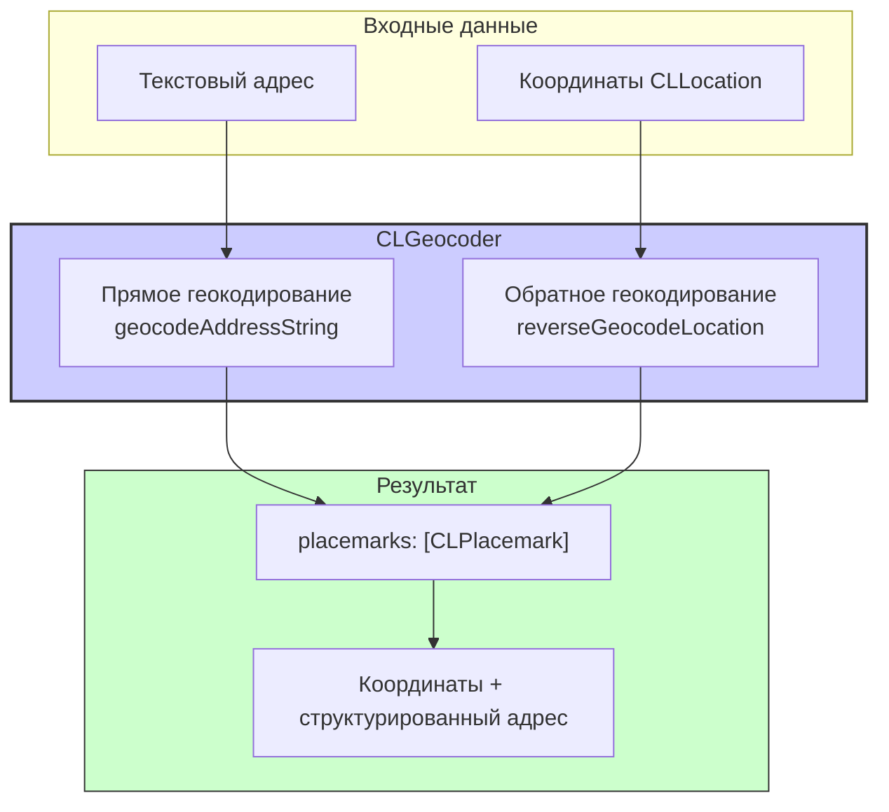

#core-location #geocoder #clgeocoder #geocoding #reverse-geocoding #maps #location #ios

---
## CLGeocoder

### Определение
**CLGeocoder** — это класс во фреймворке [[Core Location]], который предоставляет интерфейс для преобразования между географическими координатами (широта и долгота) и удобочитаемыми описаниями местоположения (названиями улиц, городов, стран) и наоборот . Он поддерживает два основных типа операций:

- **Прямое геокодирование (Forward Geocoding):** Преобразование текстового описания места (например, "Эйфелева башня, Париж") в координаты ([[CLLocationCoordinate2D]]).
- **Обратное геокодирование (Reverse Geocoding):** Преобразование координат ([[CLLocation]]) в текстовый адрес ([[CLPlacemark]]).

### Зачем это знать iOS-разработчику?
1.  **Отображение адреса по координатам:** Показать пользователю его текущий адрес (улицу, город, страну) на основе данных [[GPS]].
2.  **Поиск мест по названию:** Реализация поиска мест, где пользователь вводит адрес или название, а приложение получает координаты для отображения на карте.
3.  **Работа с placemark:** Получение структурированной информации об адресе (отдельно улица, город, почтовый индекс, страна).
4.  **Интеграция с [[MapKit]]:** Использование координат, полученных от `CLGeocoder`, для установки области карты или добавления аннотаций.
5.  **Обработка пользовательского ввода:** Преобразование текстовых адресов в данные, понятные для навигации или аналитики.

---

### Архитектура и работа



### Ключевые методы

#### Прямое геокодирование
- `geocodeAddressString(_:completionHandler:)` — преобразует строку адреса в массив `CLPlacemark` .
- `geocodeAddressString(_:in:completionHandler:)` — геокодирует адрес в указанном регионе (например, ограничивая поиск определенной страной) .

#### Обратное геокодирование
- `reverseGeocodeLocation(_:completionHandler:)` — преобразует объект `CLLocation` (координаты) в массив `CLPlacemark` .

#### Отмена операций
- `cancelGeocode()` — отменяет все ожидающие запросы геокодирования .

#### Свойства
- `isGeocoding` (`Bool`) — указывает, выполняется ли в данный момент запрос геокодирования .

---

### CLPlacemark (Результат геокодирования)

Результатом операций `CLGeocoder` является массив объектов `CLPlacemark`. Placemark содержит структурированную информацию об адресе:

```swift
let placemark = placemarks.first
placemark?.name              // Название места (например, "Эйфелева башня")
placemark?.thoroughfare      // Улица
placemark?.subThoroughfare   // Номер дома
placemark?.locality          // Город
placemark?.subLocality       // Район города
placemark?.administrativeArea // Область/штат
placemark?.subAdministrativeArea // Район области
placemark?.postalCode        // Почтовый индекс
placemark?.country           // Страна
placemark?.isoCountryCode    // Код страны (например, "RU")
placemark?.inlandWater       // Внутренние воды
placemark?.ocean             // Океан
placemark?.areasOfInterest   // Достопримечательности
placemark?.location          // Координаты
placemark?.region            // Регион (обычно круг)
```

---

### Примеры использования

#### Уровень 1: Обратное геокодирование (координаты → адрес)
Преобразование текущего местоположения пользователя в адрес.

```swift
import UIKit
import CoreLocation

class ReverseGeocodingViewController: UIViewController {

    let geocoder = CLGeocoder()
    let locationManager = CLLocationManager()
    let addressLabel = UILabel()
    
    override func viewDidLoad() {
        super.viewDidLoad()
        setupUI()
        locationManager.requestWhenInUseAuthorization()
        locationManager.startUpdatingLocation()
        locationManager.delegate = self
    }
    
    private func setupUI() {
        addressLabel.frame = CGRect(x: 20, y: 200, width: view.bounds.width - 40, height: 100)
        addressLabel.numberOfLines = 0
        addressLabel.textAlignment = .center
        addressLabel.backgroundColor = UIColor.lightGray.withAlphaComponent(0.3)
        addressLabel.text = "Определение адреса..."
        view.addSubview(addressLabel)
    }
    
    func reverseGeocode(location: CLLocation) {
        // Проверяем, не выполняется ли уже геокодирование
        guard !geocoder.isGeocoding else {
            geocoder.cancelGeocode()
            return
        }
        
        geocoder.reverseGeocodeLocation(location) { [weak self] placemarks, error in
            guard let self = self else { return }
            
            if let error = error {
                self.addressLabel.text = "Ошибка: \(error.localizedDescription)"
                return
            }
            
            guard let placemark = placemarks?.first else {
                self.addressLabel.text = "Адрес не найден"
                return
            }
            
            // Формируем строку адреса из компонентов
            var addressString = ""
            
            if let name = placemark.name {
                addressString += name + "\n"
            }
            if let thoroughfare = placemark.thoroughfare {
                addressString += thoroughfare + " "
            }
            if let subThoroughfare = placemark.subThoroughfare {
                addressString += subThoroughfare + "\n"
            }
            if let locality = placemark.locality {
                addressString += locality + ", "
            }
            if let administrativeArea = placemark.administrativeArea {
                addressString += administrativeArea + " "
            }
            if let postalCode = placemark.postalCode {
                addressString += postalCode + "\n"
            }
            if let country = placemark.country {
                addressString += country
            }
            
            self.addressLabel.text = addressString
        }
    }
}

extension ReverseGeocodingViewController: CLLocationManagerDelegate {
    func locationManager(_ manager: CLLocationManager, didUpdateLocations locations: [CLLocation]) {
        guard let location = locations.last else { return }
        reverseGeocode(location: location)
        locationManager.stopUpdatingLocation()
    }
}
```

#### Уровень 2: Прямое геокодирование (адрес → координаты)
Поиск координат по названию места.

```swift
import UIKit
import CoreLocation
import MapKit

class ForwardGeocodingViewController: UIViewController {

    @IBOutlet weak var searchTextField: UITextField!
    @IBOutlet weak var mapView: MKMapView!
    
    let geocoder = CLGeocoder()
    
    @IBAction func searchButtonTapped() {
        guard let address = searchTextField.text, !address.isEmpty else { return }
        
        // Показываем индикатор загрузки
        let activityIndicator = UIActivityIndicatorView(style: .medium)
        activityIndicator.startAnimating()
        navigationItem.rightBarButtonItem = UIBarButtonItem(customView: activityIndicator)
        
        // Выполняем геокодирование
        geocoder.geocodeAddressString(address) { [weak self] placemarks, error in
            DispatchQueue.main.async {
                self?.navigationItem.rightBarButtonItem = nil
            }
            
            if let error = error {
                self?.showAlert(message: "Ошибка: \(error.localizedDescription)")
                return
            }
            
            guard let placemark = placemarks?.first,
                  let location = placemark.location else {
                self?.showAlert(message: "Место не найдено")
                return
            }
            
            // Добавляем аннотацию на карту
            self?.addAnnotation(placemark: placemark, coordinate: location.coordinate)
            
            // Центрируем карту
            let region = MKCoordinateRegion(
                center: location.coordinate,
                latitudinalMeters: 1000,
                longitudinalMeters: 1000
            )
            self?.mapView.setRegion(region, animated: true)
        }
    }
    
    private func addAnnotation(placemark: CLPlacemark, coordinate: CLLocationCoordinate2D) {
        let annotation = MKPointAnnotation()
        annotation.coordinate = coordinate
        annotation.title = placemark.name ?? "Найденное место"
        
        // Формируем подзаголовок из адреса
        var subtitleParts: [String] = []
        if let locality = placemark.locality { subtitleParts.append(locality) }
        if let administrativeArea = placemark.administrativeArea { subtitleParts.append(administrativeArea) }
        if let country = placemark.country { subtitleParts.append(country) }
        annotation.subtitle = subtitleParts.joined(separator: ", ")
        
        mapView.addAnnotation(annotation)
    }
    
    private func showAlert(message: String) {
        let alert = UIAlertController(title: "Результат", message: message, preferredStyle: .alert)
        alert.addAction(UIAlertAction(title: "OK", style: .default))
        present(alert, animated: true)
    }
}
```

#### Уровень 3: Геокодирование с ограничением региона
Поиск адреса только в определенной стране или регионе.

```swift
import UIKit
import CoreLocation
import MapKit

class RegionLimitedGeocodingViewController: UIViewController {
    
    let geocoder = CLGeocoder()
    
    func searchInRussia(address: String) {
        // Создаем регион для ограничения поиска (вся Россия - приблизительно)
        let russiaCenter = CLLocationCoordinate2D(latitude: 61.5240, longitude: 105.3188)
        let russiaRegion = CLCircularRegion(
            center: russiaCenter,
            radius: 3000000, // 3000 км радиус
            identifier: "Russia"
        )
        
        // Геокодирование с ограничением региона
        geocoder.geocodeAddressString(address, in: russiaRegion) { [weak self] placemarks, error in
            if let error = error {
                print("Ошибка: \(error.localizedDescription)")
                return
            }
            
            if let placemarks = placemarks, !placemarks.isEmpty {
                for placemark in placemarks {
                    print("Найдено: \(placemark.name ?? "") в \(placemark.country ?? "")")
                }
            } else {
                print("Ничего не найдено в указанном регионе")
            }
        }
    }
    
    func searchWithLanguagePreference(address: String) {
        // Можно использовать настройки локали для предпочтений языка
        let locale = Locale(identifier: "ru_RU")
        
        // Создаем пользовательские опции для геокодирования (непрямо, через системные настройки)
        // CLGeocoder использует системную локаль по умолчанию
        
        geocoder.geocodeAddressString(address) { placemarks, error in
            // Результаты будут на языке, соответствующем системной локали
            if let placemark = placemarks?.first {
                print("Адрес на системном языке: \(placemark.country ?? "")")
            }
        }
    }
}
```

#### Уровень 4: Обработка ошибок и ограничений
Детальная обработка ошибок геокодирования.

```swift
import UIKit
import CoreLocation

class GeocodingErrorHandlingViewController: UIViewController {
    
    let geocoder = CLGeocoder()
    
    func reverseGeocodeWithErrorHandling(location: CLLocation) {
        geocoder.reverseGeocodeLocation(location) { placemarks, error in
            if let error = error as? CLError {
                switch error.code {
                case .geocodeFoundNoResult:
                    self.showError("Адрес не найден")
                case .geocodeFoundPartialResult:
                    self.showWarning("Найден частичный результат")
                    self.processPartialResults(placemarks)
                case .geocodeCanceled:
                    print("Геокодирование отменено")
                case .network:
                    self.showError("Проблема с сетью. Проверьте подключение")
                case .locationUnknown:
                    self.showError("Местоположение неизвестно")
                default:
                    self.showError("Ошибка: \(error.localizedDescription)")
                }
            } else if let error = error {
                self.showError("Неизвестная ошибка: \(error.localizedDescription)")
            } else if let placemark = placemarks?.first {
                self.showSuccess(placemark)
            }
        }
    }
    
    private func showError(_ message: String) {
        let alert = UIAlertController(title: "Ошибка", message: message, preferredStyle: .alert)
        alert.addAction(UIAlertAction(title: "OK", style: .default))
        present(alert, animated: true)
    }
    
    private func showWarning(_ message: String) {
        let alert = UIAlertController(title: "Предупреждение", message: message, preferredStyle: .alert)
        alert.addAction(UIAlertAction(title: "OK", style: .default))
        present(alert, animated: true)
    }
    
    private func showSuccess(_ placemark: CLPlacemark) {
        let message = "Адрес: \(placemark.name ?? ""), \(placemark.locality ?? "")"
        let alert = UIAlertController(title: "Успешно", message: message, preferredStyle: .alert)
        alert.addAction(UIAlertAction(title: "OK", style: .default))
        present(alert, animated: true)
    }
    
    private func processPartialResults(_ placemarks: [CLPlacemark]?) {
        guard let placemarks = placemarks else { return }
        for placemark in placemarks {
            print("Возможный результат: \(placemark.name ?? "")")
        }
    }
}
```

#### Уровень 5: Асинхронное геокодирование с [[async]]/[[await]]
Современный подход с использованием [[Swift Concurrency]].

```swift
import CoreLocation

extension CLGeocoder {
    func reverseGeocodeLocation(_ location: CLLocation) async throws -> [CLPlacemark] {
        return try await withCheckedThrowingContinuation { continuation in
            reverseGeocodeLocation(location) { placemarks, error in
                if let error = error {
                    continuation.resume(throwing: error)
                } else if let placemarks = placemarks {
                    continuation.resume(returning: placemarks)
                } else {
                    continuation.resume(returning: [])
                }
            }
        }
    }
    
    func geocodeAddressString(_ addressString: String) async throws -> [CLPlacemark] {
        return try await withCheckedThrowingContinuation { continuation in
            geocodeAddressString(addressString) { placemarks, error in
                if let error = error {
                    continuation.resume(throwing: error)
                } else if let placemarks = placemarks {
                    continuation.resume(returning: placemarks)
                } else {
                    continuation.resume(returning: [])
                }
            }
        }
    }
}

// Использование в контроллере
class AsyncGeocodingViewController: UIViewController {
    
    let geocoder = CLGeocoder()
    
    override func viewDidLoad() {
        super.viewDidLoad()
        
        Task {
            await performGeocoding()
        }
    }
    
    func performGeocoding() async {
        let location = CLLocation(latitude: 55.751244, longitude: 37.618423)
        
        do {
            let placemarks = try await geocoder.reverseGeocodeLocation(location)
            if let placemark = placemarks.first {
                print("Найден адрес: \(placemark.country ?? ""), \(placemark.locality ?? "")")
            }
        } catch {
            print("Ошибка геокодирования: \(error)")
        }
        
        do {
            let placemarks = try await geocoder.geocodeAddressString("Москва, Красная площадь")
            if let placemark = placemarks.first {
                print("Координаты: \(placemark.location?.coordinate.latitude ?? 0), \(placemark.location?.coordinate.longitude ?? 0)")
            }
        } catch {
            print("Ошибка геокодирования: \(error)")
        }
    }
}
```

#### Уровень 6: Геокодирование с кэшированием
Улучшение производительности с помощью кэширования результатов.

```swift
import UIKit
import CoreLocation

class CachedGeocoder {
    
    private let geocoder = CLGeocoder()
    private let cache = NSCache<NSString, NSArray>()
    
    func reverseGeocodeLocation(_ location: CLLocation, completion: @escaping ([CLPlacemark]?, Error?) -> Void) {
        // Создаем ключ для кэша на основе координат с округлением
        let lat = round(location.coordinate.latitude * 100) / 100
        let lon = round(location.coordinate.longitude * 100) / 100
        let key = "\(lat),\(lon)" as NSString
        
        // Проверяем кэш
        if let cachedPlacemarks = cache.object(forKey: key) as? [CLPlacemark] {
            completion(cachedPlacemarks, nil)
            return
        }
        
        // Выполняем запрос
        geocoder.reverseGeocodeLocation(location) { [weak self] placemarks, error in
            if let placemarks = placemarks, !placemarks.isEmpty {
                // Сохраняем в кэш
                self?.cache.setObject(placemarks as NSArray, forKey: key)
            }
            completion(placemarks, error)
        }
    }
    
    func geocodeAddressString(_ addressString: String, completion: @escaping ([CLPlacemark]?, Error?) -> Void) {
        let key = addressString as NSString
        
        if let cachedPlacemarks = cache.object(forKey: key) as? [CLPlacemark] {
            completion(cachedPlacemarks, nil)
            return
        }
        
        geocoder.geocodeAddressString(addressString) { [weak self] placemarks, error in
            if let placemarks = placemarks, !placemarks.isEmpty {
                self?.cache.setObject(placemarks as NSArray, forKey: key)
            }
            completion(placemarks, error)
        }
    }
    
    func clearCache() {
        cache.removeAllObjects()
    }
}

// Использование
class CachedGeocodingViewController: UIViewController {
    
    let cachedGeocoder = CachedGeocoder()
    
    @IBAction func geocodeButtonTapped() {
        let location = CLLocation(latitude: 55.751244, longitude: 37.618423)
        
        cachedGeocoder.reverseGeocodeLocation(location) { placemarks, error in
            if let placemark = placemarks?.first {
                print("Адрес: \(placemark.name ?? "")")
            }
        }
    }
}
```

---

### Важные нюансы и ограничения

#### 1. **Ограничения на использование**
- `CLGeocoder` имеет ограничения на количество запросов в единицу времени. Apple не публикует точные лимиты, но рекомендуется не делать больше 1-2 запросов в секунду .
- Для массового геокодирования используйте серверные решения (например, MapKit JS или сторонние API).

#### 2. **Требуется сетевое соединение**
Геокодирование требует подключения к интернету, так как запросы отправляются на серверы Apple .

#### 3. **Точность результатов**
Результаты могут быть приблизительными или содержать несколько вариантов (placemarks). Всегда проверяйте массив `placemarks` на наличие нескольких результатов.

#### 4. **Асинхронность**
Все методы `CLGeocoder` работают асинхронно. Обновляйте UI только в главном потоке.

#### 5. **Отмена запросов**
При повторных запросах отменяйте предыдущие с помощью `cancelGeocode()`, чтобы избежать накопления ожидающих операций .

#### 6. **Региональные особенности**
Результаты зависят от настроек региона и языка устройства. Для получения результатов на определенном языке можно временно изменить локаль приложения (хотя это не всегда работает напрямую).

### Итог
**CLGeocoder** — это мощный, но простой в использовании инструмент для работы с географическими координатами и адресами. Он предоставляет:

- **Простой API** для преобразования между координатами и адресами
- **Структурированную информацию** об адресе через CLPlacemark
- **Асинхронную обработку** для неблокирующего UI
- **Интеграцию** с Core Location и MapKit

Понимание работы с `CLGeocoder` необходимо для создания приложений, работающих с картами, местоположением пользователя и поиском мест.