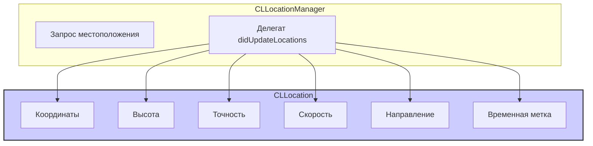

#core-location #cllocation #gps #coordinates #altitude #speed #course #location-services

---
## CLLocation

### Определение
**CLLocation** — это класс во фреймворке [[Core Location]], который представляет собой точку данных о местоположении, включая географические координаты (широту и долготу), высоту над уровнем моря, точность, скорость и направление движения, а также временную метку, когда эти данные были получены .

Объекты `CLLocation` являются основным способом передачи информации о местоположении в [[iOS]]-приложениях. Они создаются системой (например, в [[CLLocationManager]]) и могут быть созданы программно разработчиком для различных целей: расчета расстояния, сохранения точек маршрута, проверки достижения геозоны и т.д.

### Зачем это знать [[iOS]]-разработчику?
1.  **Получение текущего местоположения:** Основной способ получить координаты пользователя от `CLLocationManager`.
2.  **Расчет расстояний:** Вычисление расстояния между двумя точками с учетом кривизны Земли.
3.  **Определение высоты:** Получение высоты над уровнем моря (если доступно).
4.  **Отслеживание движения:** Получение скорости и направления движения для навигационных приложений.
5.  **Проверка точности:** Анализ `horizontalAccuracy` и `verticalAccuracy` для определения качества данных.
6.  **Сравнение местоположений:** Определение, какое местоположение более новое, используя `timestamp`.

---

### Архитектура и место в Core Location



### Ключевые свойства и методы

#### Основные свойства
- `coordinate` ([[CLLocationCoordinate2D]]) — структура, содержащая широту (`latitude`) и долготу (`longitude`) .
- `altitude` ([[CLLocationDistance]]) — высота над уровнем моря в метрах . Может быть отрицательной для мест ниже уровня моря.
- `horizontalAccuracy` ([[CLLocationAccuracy]]) — радиус неопределенности в метрах для координат. Чем меньше значение, тем точнее местоположение .
- `verticalAccuracy` (`CLLocationAccuracy`) — точность высоты в метрах .
- `timestamp` ([[Date]]) — время, когда были получены эти данные .

#### Свойства для движения
- `speed` ([[CLLocationSpeed]]) — мгновенная скорость устройства в метрах в секунду . Актуально только при движении.
- `course` (`CLLocationDirection`) — направление движения в градусах относительно севера (0° — север, 90° — восток, 180° — юг, 270° — запад) .
- `speedAccuracy` — точность измерения скорости (доступно с iOS 13.4) .
- `courseAccuracy` — точность измерения направления (доступно с iOS 13.4) .

#### Методы
- `distance(from:)` — вычисляет расстояние в метрах между двумя точками (используя формулу гаверсинуса, учитывающую кривизну Земли) .
- `init(latitude:longitude:)` — создает объект `CLLocation` с указанными координатами (другие свойства будут иметь значения по умолчанию) .
- `init(coordinate:altitude:horizontalAccuracy:verticalAccuracy:timestamp:)` — полный инициализатор со всеми параметрами .

---

### Примеры использования

#### Уровень 1: Получение текущего местоположения
Базовый пример с `CLLocationManager`.

```swift
import UIKit
import CoreLocation

class BasicLocationViewController: UIViewController, CLLocationManagerDelegate {

    let locationManager = CLLocationManager()
    let locationLabel = UILabel()
    
    override func viewDidLoad() {
        super.viewDidLoad()
        setupUI()
        setupLocationManager()
    }
    
    private func setupUI() {
        locationLabel.frame = CGRect(x: 20, y: 200, width: view.bounds.width - 40, height: 100)
        locationLabel.numberOfLines = 0
        locationLabel.textAlignment = .center
        locationLabel.text = "Определение местоположения..."
        view.addSubview(locationLabel)
    }
    
    private func setupLocationManager() {
        locationManager.delegate = self
        locationManager.desiredAccuracy = kCLLocationAccuracyBest
        locationManager.requestWhenInUseAuthorization()
        locationManager.startUpdatingLocation()
    }
    
    // MARK: - CLLocationManagerDelegate
    func locationManager(_ manager: CLLocationManager, didUpdateLocations locations: [CLLocation]) {
        guard let location = locations.last else { return }
        
        // Форматируем информацию о местоположении
        let formatter = NumberFormatter()
        formatter.maximumFractionDigits = 6
        
        let lat = formatter.string(from: NSNumber(value: location.coordinate.latitude)) ?? "\(location.coordinate.latitude)"
        let lon = formatter.string(from: NSNumber(value: location.coordinate.longitude)) ?? "\(location.coordinate.longitude)"
        
        let accuracy = location.horizontalAccuracy
        
        locationLabel.text = """
        Широта: \(lat)
        Долгота: \(lon)
        Точность: ±\(Int(accuracy)) м
        Время: \(location.timestamp)
        """
        
        // Останавливаем обновления после получения достаточно точного местоположения
        if accuracy < 50 && accuracy > 0 {
            locationManager.stopUpdatingLocation()
        }
    }
    
    func locationManager(_ manager: CLLocationManager, didFailWithError error: Error) {
        locationLabel.text = "Ошибка: \(error.localizedDescription)"
    }
}
```

#### Уровень 2: Создание и сравнение объектов CLLocation
Программное создание объектов и их сравнение.

```swift
import UIKit
import CoreLocation

class LocationComparisonViewController: UIViewController {
    
    override func viewDidLoad() {
        super.viewDidLoad()
        
        // 1. Создаем объекты местоположения
        let moscow = CLLocation(latitude: 55.751244, longitude: 37.618423)
        let spb = CLLocation(latitude: 59.934280, longitude: 30.335099)
        let ekb = CLLocation(latitude: 56.838011, longitude: 60.597474)
        
        // 2. Вычисляем расстояние между Москвой и Санкт-Петербургом
        let distanceMoscowSpb = moscow.distance(from: spb)
        print("Расстояние Москва - СПб: \(Int(distanceMoscowSpb)) метров (\(Int(distanceMoscowSpb/1000)) км)")
        
        // 3. Вычисляем расстояние между Москвой и Екатеринбургом
        let distanceMoscowEkb = moscow.distance(from: ekb)
        print("Расстояние Москва - Екатеринбург: \(Int(distanceMoscowEkb/1000)) км")
        
        // 4. Создаем объект с дополнительными параметрами
        let preciseLocation = CLLocation(
            coordinate: CLLocationCoordinate2D(latitude: 55.751244, longitude: 37.618423),
            altitude: 156, // высота над уровнем моря в метрах
            horizontalAccuracy: 10,
            verticalAccuracy: 5,
            timestamp: Date()
        )
        
        print("Координаты: \(preciseLocation.coordinate.latitude), \(preciseLocation.coordinate.longitude)")
        print("Высота: \(preciseLocation.altitude) м")
        print("Точность по горизонтали: \(preciseLocation.horizontalAccuracy) м")
    }
}
```

#### Уровень 3: Работа со скоростью и направлением
Отслеживание движения для навигационного приложения.

```swift
import UIKit
import CoreLocation

class NavigationViewController: UIViewController, CLLocationManagerDelegate {

    let locationManager = CLLocationManager()
    
    @IBOutlet weak var speedLabel: UILabel!
    @IBOutlet weak var courseLabel: UILabel!
    @IBOutlet weak var accuracyLabel: UILabel!
    @IBOutlet weak var distanceLabel: UILabel!
    
    var lastLocation: CLLocation?
    var totalDistance: CLLocationDistance = 0
    
    override func viewDidLoad() {
        super.viewDidLoad()
        setupLocationManager()
    }
    
    private func setupLocationManager() {
        locationManager.delegate = self
        locationManager.desiredAccuracy = kCLLocationAccuracyBestForNavigation
        locationManager.activityType = .automotiveNavigation
        locationManager.requestWhenInUseAuthorization()
        locationManager.startUpdatingLocation()
    }
    
    func locationManager(_ manager: CLLocationManager, didUpdateLocations locations: [CLLocation]) {
        guard let location = locations.last else { return }
        
        // 1. Скорость
        if location.speed >= 0 {
            let speedKmph = location.speed * 3.6 // перевод м/с в км/ч
            speedLabel.text = String(format: "Скорость: %.1f км/ч", speedKmph)
        } else {
            speedLabel.text = "Скорость: не определена"
        }
        
        // 2. Направление
        if location.course >= 0 {
            courseLabel.text = String(format: "Курс: %.0f°", location.course)
        } else {
            courseLabel.text = "Курс: не определен"
        }
        
        // 3. Точность
        if location.horizontalAccuracy >= 0 {
            accuracyLabel.text = String(format: "Точность: ±%.0f м", location.horizontalAccuracy)
        } else {
            accuracyLabel.text = "Точность: не определена"
        }
        
        // 4. Расчет пройденного расстояния
        if let last = lastLocation {
            let distance = location.distance(from: last)
            if distance > 0 && distance < 1000 { // Игнорируем скачки
                totalDistance += distance
                distanceLabel.text = String(format: "Пройдено: %.0f м", totalDistance)
            }
        }
        
        lastLocation = location
    }
}
```

#### Уровень 4: Фильтрация по точности и времени
Отбор наиболее релевантных местоположений.

```swift
import UIKit
import CoreLocation

class LocationFilteringViewController: UIViewController, CLLocationManagerDelegate {

    let locationManager = CLLocationManager()
    
    func locationManager(_ manager: CLLocationManager, didUpdateLocations locations: [CLLocation]) {
        // Получаем самое новое местоположение
        guard let location = locations.last else { return }
        
        // Фильтр 1: Проверка точности
        guard location.horizontalAccuracy >= 0 && location.horizontalAccuracy < 100 else {
            print("Недостаточная точность: \(location.horizontalAccuracy) м")
            return
        }
        
        // Фильтр 2: Проверка давности (не старше 5 секунд)
        let maxAge: TimeInterval = 5.0
        let age = -location.timestamp.timeIntervalSinceNow
        guard age < maxAge else {
            print("Слишком старые данные: \(Int(age)) сек")
            return
        }
        
        // Фильтр 3: Проверка на реалистичность скорости
        if location.speed >= 0 && location.speed < 100 { // менее 360 км/ч
            print("Скорость: \(location.speed) м/с")
        }
        
        // Используем отфильтрованное местоположение
        processValidLocation(location)
    }
    
    private func processValidLocation(_ location: CLLocation) {
        print("✅ Корректное местоположение: \(location.coordinate.latitude), \(location.coordinate.longitude)")
        // Далее сохраняем, отображаем и т.д.
    }
}
```

#### Уровень 5: Определение вхождения в геозону (Geofencing)
Использование расстояния для проверки входа в область.

```swift
import UIKit
import CoreLocation

class GeofencingViewController: UIViewController, CLLocationManagerDelegate {

    let locationManager = CLLocationManager()
    let targetLocation = CLLocation(latitude: 55.751244, longitude: 37.618423) // Красная площадь
    let radius: CLLocationDistance = 500 // 500 метров
    
    var isInside = false
    
    override func viewDidLoad() {
        super.viewDidLoad()
        locationManager.delegate = self
        locationManager.requestAlwaysAuthorization()
        locationManager.startUpdatingLocation()
    }
    
    func locationManager(_ manager: CLLocationManager, didUpdateLocations locations: [CLLocation]) {
        guard let location = locations.last,
              location.horizontalAccuracy < 100 else { return }
        
        let distance = location.distance(from: targetLocation)
        let inside = distance <= radius
        
        if inside && !isInside {
            print("🔔 Вы вошли в зону Красной площади!")
            sendNotification("Добро пожаловать на Красную площадь!")
            isInside = true
        } else if !inside && isInside {
            print("👋 Вы покинули зону Красной площади")
            sendNotification("Вы покинули Красную площадь")
            isInside = false
        }
        
        print("Расстояние до цели: \(Int(distance)) м")
    }
    
    private func sendNotification(_ message: String) {
        let content = UNMutableNotificationContent()
        content.title = "Геозона"
        content.body = message
        content.sound = .default
        
        let request = UNNotificationRequest(identifier: UUID().uuidString,
                                           content: content,
                                           trigger: nil)
        UNUserNotificationCenter.current().add(request)
    }
}
```

#### Уровень 6: Расчеты с географическими координатами
Дополнительные вычисления, не входящие в стандартные методы.

```swift
import CoreLocation

extension CLLocation {
    
    /// Вычисляет середину между двумя точками
    func midpoint(to location: CLLocation) -> CLLocation {
        let lat1 = self.coordinate.latitude * .pi / 180
        let lon1 = self.coordinate.longitude * .pi / 180
        let lat2 = location.coordinate.latitude * .pi / 180
        let lon2 = location.coordinate.longitude * .pi / 180
        
        let bx = cos(lat2) * cos(lon2 - lon1)
        let by = cos(lat2) * sin(lon2 - lon1)
        
        let lat3 = atan2(sin(lat1) + sin(lat2), sqrt((cos(lat1) + bx) * (cos(lat1) + bx) + by * by))
        let lon3 = lon1 + atan2(by, cos(lat1) + bx)
        
        return CLLocation(latitude: lat3 * 180 / .pi, longitude: lon3 * 180 / .pi)
    }
    
    /// Проверяет, находится ли точка в радиусе от другой точки
    func isWithin(distance: CLLocationDistance, of location: CLLocation) -> Bool {
        return self.distance(from: location) <= distance
    }
    
    /// Форматирует координаты для отображения
    var formattedCoordinate: String {
        let latDeg = Int(coordinate.latitude)
        let latMin = Int((coordinate.latitude - Double(latDeg)) * 60)
        let latSec = (coordinate.latitude - Double(latDeg) - Double(latMin)/60) * 3600
        
        let lonDeg = Int(coordinate.longitude)
        let lonMin = Int((coordinate.longitude - Double(lonDeg)) * 60)
        let lonSec = (coordinate.longitude - Double(lonDeg) - Double(lonMin)/60) * 3600
        
        return String(format: "Ш: %d°%d'%.0f\" %@, Д: %d°%d'%.0f\" %@",
                     abs(latDeg), abs(latMin), abs(latSec),
                     coordinate.latitude >= 0 ? "с.ш." : "ю.ш.",
                     abs(lonDeg), abs(lonMin), abs(lonSec),
                     coordinate.longitude >= 0 ? "в.д." : "з.д.")
    }
}

// Использование:
let moscow = CLLocation(latitude: 55.751244, longitude: 37.618423)
let spb = CLLocation(latitude: 59.934280, longitude: 30.335099)

let midpoint = moscow.midpoint(to: spb)
print("Середина маршрута: \(midpoint.formattedCoordinate)")

if spb.isWithin(distance: 100_000, of: moscow) {
    print("СПб в 100 км от Москвы")
} else {
    print("Расстояние больше 100 км")
}
```

---

### Интерпретация значений свойств

#### Точность (Accuracy)
| Значение   | Интерпретация                                |
| ---------- | -------------------------------------------- |
| `-1`       | Точность недоступна (обычно означает ошибку) |
| `0`        | Теоретически идеальная точность (редко)      |
| `< 10`     | Отличная точность ([[GPS]])                  |
| `10-50`    | Хорошая точность                             |
| `50-100`   | Средняя точность (Wi-Fi)                     |
| `100-1000` | Низкая точность (сотовая вышка)              |
| `> 1000`   | Очень низкая точность                        |

#### Скорость (Speed)
| Значение | Интерпретация |
|----------|---------------|
| `-1` | Скорость недоступна |
| `0` | Стоит на месте |
| `> 0` | Движется со скоростью в м/с |
| `1 м/с` | ~3.6 км/ч (медленная ходьба) |
| `1.4 м/с` | ~5 км/ч (средняя ходьба) |
| `5 м/с` | ~18 км/ч (бег) |
| `10 м/с` | ~36 км/ч (велосипед) |
| `30 м/с` | ~108 км/ч (автомобиль) |

#### Курс (Course)
| Значение | Направление |
|----------|-------------|
| `-1` | Недоступно |
| `0` | Север |
| `90` | Восток |
| `180` | Юг |
| `270` | Запад |

---

### Важные нюансы и Best Practices

#### 1. **Всегда проверяйте точность**
Никогда не используйте местоположение без проверки `horizontalAccuracy`. Значение `-1` означает ошибку, а слишком большие значения (>100 м) могут быть непригодны для большинства задач .

#### 2. **Учитывайте timestamp**
Местоположение может быть "старым", если GPS не обновлялся. Всегда проверяйте `timestamp` и отбрасывайте данные старше определенного порога .

#### 3. **Используйте distance(from:) для сравнения**
Не пытайтесь вычислять расстояние вручную — встроенный метод учитывает кривизну Земли и дает точные результаты.

#### 4. **Не останавливайте обновления слишком рано**
Даже после получения первого местоположения точность может улучшиться. Подождите несколько обновлений или установите порог точности .

#### 5. **Учитывайте энергопотребление**
- Используйте `desiredAccuracy` для баланса между точностью и энергопотреблением.
- Для фонового отслеживания используйте `startMonitoringSignificantLocationChanges`.
- Останавливайте обновления, когда они не нужны.

#### 6. **Обрабатывайте ошибки**
Реализуйте `didFailWithError` для обработки ситуаций, когда местоположение недоступно (например, отключен GPS).

### Итог
**CLLocation** — это фундаментальный класс для работы с географическими данными в iOS. Он предоставляет:

- **Координаты** местоположения
- **Высоту** над уровнем моря
- **Скорость и направление** движения
- **Точность** измерений
- **Временные метки** для определения свежести данных
- **Методы для расчета** расстояний и сравнения

Понимание работы с `CLLocation` необходимо для создания любого приложения, использующего геолокацию, от простых карт до сложных навигационных систем.