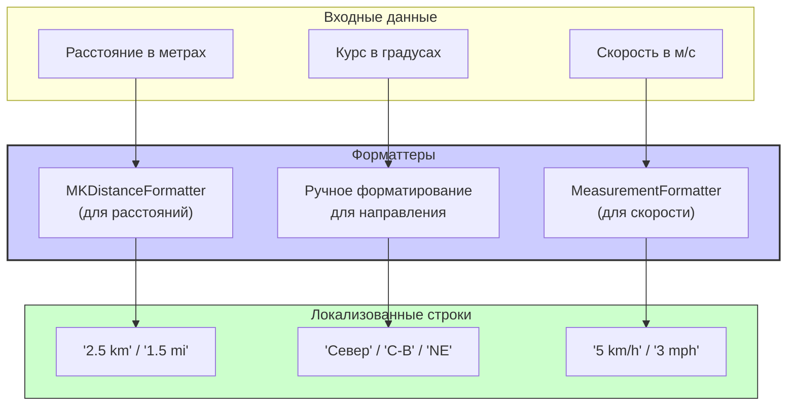

#core-location #cllocationformatter #formatter #localization #distance #course #speed #ios15

---
## CLLocationFormatter

### Определение
**CLLocationFormatter** — это класс, представленный в iOS 15, iPadOS 15, macOS 12, watchOS 8 и tvOS 15, который предоставляет локализованное форматирование значений, связанных с местоположением, включая расстояние, направление и скорость . Он является частью фреймворка Core Location и предназначен для преобразования сырых числовых значений (метры, градусы, м/с) в удобочитаемые строки, адаптированные под локаль и единицы измерения пользователя.

До появления `CLLocationFormatter` разработчикам приходилось вручную форматировать расстояния (например, с помощью `MeasurementFormatter` и `UnitLength`) или направления. Новый класс объединяет и упрощает эти задачи, предоставляя единый интерфейс для различных типов данных о местоположении.

### Зачем это знать iOS-разработчику?
1.  **Локализованное отображение:** Автоматическое отображение расстояний в метрах или футах/милях в зависимости от региона пользователя.
2.  **Форматирование направлений:** Преобразование значения курса (0-360°) в текстовые направления ("Север", "С-В", "Юг").
3.  **Форматирование скорости:** Отображение скорости в км/ч, милях/ч или м/с с учетом локали.
4.  **Единый интерфейс:** Упрощение кода за счет использования одного класса вместо нескольких форматтеров.
5.  **Соответствие Human Interface Guidelines:** Следование рекомендациям Apple по отображению локализованных единиц измерения.

---

### Архитектура и возможности



### Ключевые методы и свойства

#### Основные методы
- `string(fromDistance:)` — форматирует расстояние в метрах в локализованную строку .
- `string(fromDirection:)` — форматирует направление (курс) в градусах в текстовое представление .
- `string(fromSpeed:)` — форматирует скорость в метрах в секунду в локализованную строку .
- `string(for:)` — универсальный метод, который принимает `CLLocation`, `CLLocationDistance`, `CLLocationDirection`, `CLLocationSpeed` и возвращает соответствующую строку .

#### Настройка единиц измерения
- `unitStyle` — стиль отображения единиц измерения (`.short`, `.medium`, `.long`) .
- `distanceUnits` — предпочитаемые единицы измерения расстояния (`.automatic`, `.metric`, `.imperial`) .
- `speedUnits` — предпочитаемые единицы измерения скорости (`.automatic`, `.metric`, `.imperial`) .

#### Локализация
- `locale` — локаль, используемая для форматирования (по умолчанию текущая локаль устройства) .

---

### Примеры использования

#### Уровень 1: Базовое форматирование расстояния
Простейший пример — отображение расстояния в удобочитаемом формате.

```swift
import UIKit
import CoreLocation

class BasicFormattingViewController: UIViewController {
    
    @IBOutlet weak var distanceLabel: UILabel!
    
    override func viewDidLoad() {
        super.viewDidLoad()
        
        // 1. Создаем форматтер
        let formatter = CLLocationFormatter()
        
        // 2. Форматируем различные расстояния
        let distance1 = 100.0 // 100 метров
        let distance2 = 1500.0 // 1.5 км
        let distance3 = 25000.0 // 25 км
        let distance4 = 0.5 // 0.5 метра
        
        let formattedText = """
        \(formatter.string(fromDistance: distance1))
        \(formatter.string(fromDistance: distance2))
        \(formatter.string(fromDistance: distance3))
        \(formatter.string(fromDistance: distance4))
        """
        
        distanceLabel.text = formattedText
        // В российской локали выведет:
        // 100 m
        // 1.5 km
        // 25 km
        // 0.5 m
    }
}
```

#### Уровень 2: Форматирование направления (курса)
Преобразование градусов в текстовое направление.

```swift
import UIKit
import CoreLocation

class DirectionFormattingViewController: UIViewController {
    
    @IBOutlet weak var directionLabel: UILabel!
    
    override func viewDidLoad() {
        super.viewDidLoad()
        
        let formatter = CLLocationFormatter()
        
        let directions: [CLLocationDirection] = [0, 45, 90, 135, 180, 225, 270, 315, 360]
        
        var directionStrings: [String] = []
        for direction in directions {
            let string = formatter.string(fromDirection: direction)
            directionStrings.append("\(direction)°: \(string)")
        }
        
        directionLabel.text = directionStrings.joined(separator: "\n")
        // В российской локали выведет:
        // 0°: Север
        // 45°: С-В
        // 90°: Восток
        // 135°: Ю-В
        // 180°: Юг
        // 225°: Ю-З
        // 270°: Запад
        // 315°: С-З
        // 360°: Север
    }
}
```

#### Уровень 3: Форматирование скорости
Отображение скорости в локализованных единицах.

```swift
import UIKit
import CoreLocation

class SpeedFormattingViewController: UIViewController {
    
    @IBOutlet weak var speedLabel: UILabel!
    
    override func viewDidLoad() {
        super.viewDidLoad()
        
        let formatter = CLLocationFormatter()
        
        // Скорости в метрах в секунду
        let walkingSpeed = 1.4 // ~5 км/ч
        let runningSpeed = 5.0 // ~18 км/ч
        let carSpeed = 30.0 // ~108 км/ч
        
        let formattedText = """
        Ходьба: \(formatter.string(fromSpeed: walkingSpeed))
        Бег: \(formatter.string(fromSpeed: runningSpeed))
        Автомобиль: \(formatter.string(fromSpeed: carSpeed))
        """
        
        speedLabel.text = formattedText
        // В российской локали выведет:
        // Ходьба: 5 km/h
        // Бег: 18 km/h
        // Автомобиль: 108 km/h
    }
}
```

#### Уровень 4: Настройка единиц измерения
Принудительное использование метрической или имперской системы.

```swift
import UIKit
import CoreLocation

class UnitsConfigurationViewController: UIViewController {
    
    @IBOutlet weak var metricLabel: UILabel!
    @IBOutlet weak var imperialLabel: UILabel!
    @IBOutlet weak var automaticLabel: UILabel!
    
    override func viewDidLoad() {
        super.viewDidLoad()
        
        let distance: CLLocationDistance = 1609.34 // 1 миля в метрах
        
        // 1. Метрическая система
        let metricFormatter = CLLocationFormatter()
        metricFormatter.distanceUnits = .metric
        metricFormatter.speedUnits = .metric
        
        // 2. Имперская система
        let imperialFormatter = CLLocationFormatter()
        imperialFormatter.distanceUnits = .imperial
        imperialFormatter.speedUnits = .imperial
        
        // 3. Автоматическая (по умолчанию)
        let autoFormatter = CLLocationFormatter()
        
        metricLabel.text = """
        Расстояние: \(metricFormatter.string(fromDistance: distance))
        Скорость (10 м/с): \(metricFormatter.string(fromSpeed: 10.0))
        """
        
        imperialLabel.text = """
        Расстояние: \(imperialFormatter.string(fromDistance: distance))
        Скорость (10 м/с): \(imperialFormatter.string(fromSpeed: 10.0))
        """
        
        automaticLabel.text = """
        Расстояние: \(autoFormatter.string(fromDistance: distance))
        Скорость (10 м/с): \(autoFormatter.string(fromSpeed: 10.0))
        """
    }
}
```

#### Уровень 5: Настройка стиля единиц
Управление длиной строки единиц измерения.

```swift
import UIKit
import CoreLocation

class UnitStyleViewController: UIViewController {
    
    @IBOutlet weak var shortStyleLabel: UILabel!
    @IBOutlet weak var mediumStyleLabel: UILabel!
    @IBOutlet weak var longStyleLabel: UILabel!
    
    override func viewDidLoad() {
        super.viewDidLoad()
        
        let distance: CLLocationDistance = 2500 // 2.5 км
        
        // 1. Короткий стиль
        let shortFormatter = CLLocationFormatter()
        shortFormatter.unitStyle = .short
        
        // 2. Средний стиль
        let mediumFormatter = CLLocationFormatter()
        mediumFormatter.unitStyle = .medium
        
        // 3. Длинный стиль
        let longFormatter = CLLocationFormatter()
        longFormatter.unitStyle = .long
        
        shortStyleLabel.text = "Short: \(shortFormatter.string(fromDistance: distance))"
        mediumStyleLabel.text = "Medium: \(mediumFormatter.string(fromDistance: distance))"
        longStyleLabel.text = "Long: \(longFormatter.string(fromDistance: distance))"
        
        // В российской локали выведет:
        // Short: 2.5 km
        // Medium: 2.5 kilometers
        // Long: 2.5 kilometers
    }
}
```

#### Уровень 6: Форматирование с использованием универсального метода
Использование `string(for:)` для разных типов данных.

```swift
import UIKit
import CoreLocation

class UniversalMethodViewController: UIViewController {
    
    @IBOutlet weak var infoLabel: UILabel!
    
    override func viewDidLoad() {
        super.viewDidLoad()
        
        let formatter = CLLocationFormatter()
        
        // Создаем различные типы данных
        let distance: CLLocationDistance = 1234.56
        let direction: CLLocationDirection = 123
        let speed: CLLocationSpeed = 15.5
        
        // Используем универсальный метод
        let distanceString = formatter.string(for: distance) ?? "—"
        let directionString = formatter.string(for: direction) ?? "—"
        let speedString = formatter.string(for: speed) ?? "—"
        
        infoLabel.text = """
        Расстояние: \(distanceString)
        Направление: \(directionString)
        Скорость: \(speedString)
        """
    }
}
```

#### Уровень 7: Работа с объектом [[CLLocation]]
Форматирование различных свойств объекта `CLLocation`.

```swift
import UIKit
import CoreLocation

class LocationObjectFormattingViewController: UIViewController {
    
    @IBOutlet weak var locationInfoLabel: UILabel!
    
    override func viewDidLoad() {
        super.viewDidLoad()
        
        // Создаем тестовое местоположение
        let location = CLLocation(
            coordinate: CLLocationCoordinate2D(latitude: 55.751244, longitude: 37.618423),
            altitude: 156,
            horizontalAccuracy: 10,
            verticalAccuracy: 5,
            course: 270,
            speed: 10,
            timestamp: Date()
        )
        
        let formatter = CLLocationFormatter()
        
        // Форматируем различные свойства
        let distanceFromCenter = 1000.0 // 1 км от центра
        
        locationInfoLabel.text = """
        Координаты: \(location.coordinate.latitude), \(location.coordinate.longitude)
        Высота: \(formatter.string(fromDistance: location.altitude))
        Горизонтальная точность: ±\(formatter.string(fromDistance: location.horizontalAccuracy))
        Вертикальная точность: ±\(formatter.string(fromDistance: location.verticalAccuracy))
        Курс: \(formatter.string(fromDirection: location.course))
        Скорость: \(formatter.string(fromSpeed: location.speed))
        """
    }
}
```

#### Уровень 8: Кастомная локализация
Принудительное использование определенной локали.

```swift
import UIKit
import CoreLocation

class CustomLocaleViewController: UIViewController {
    
    @IBOutlet weak var usLocaleLabel: UILabel!
    @IBOutlet weak var ruLocaleLabel: UILabel!
    @IBOutlet weak var frLocaleLabel: UILabel!
    
    override func viewDidLoad() {
        super.viewDidLoad()
        
        let distance: CLLocationDistance = 1609.34 // 1 миля
        
        // 1. US локаль (имперская система)
        let usFormatter = CLLocationFormatter()
        usFormatter.locale = Locale(identifier: "en_US")
        
        // 2. RU локаль (метрическая система)
        let ruFormatter = CLLocationFormatter()
        ruFormatter.locale = Locale(identifier: "ru_RU")
        
        // 3. FR локаль (метрическая система, но французский язык)
        let frFormatter = CLLocationFormatter()
        frFormatter.locale = Locale(identifier: "fr_FR")
        
        usLocaleLabel.text = "US: \(usFormatter.string(fromDistance: distance))"
        ruLocaleLabel.text = "RU: \(ruFormatter.string(fromDistance: distance))"
        frLocaleLabel.text = "FR: \(frFormatter.string(fromDistance: distance))"
        
        // Вывод:
        // US: 1 mi
        // RU: 1.6 km
        // FR: 1,6 km
    }
}
```

#### Уровень 9: Создание кастомного форматтера для [[UITableView]]
Пример использования в ячейке таблицы.

```swift
import UIKit
import CoreLocation

class LocationCell: UITableViewCell {
    @IBOutlet weak var titleLabel: UILabel!
    @IBOutlet weak var distanceLabel: UILabel!
    @IBOutlet weak var directionLabel: UILabel!
    
    func configure(with placemark: CLPlacemark, currentLocation: CLLocation) {
        titleLabel.text = placemark.name ?? "Неизвестное место"
        
        if let location = placemark.location {
            let formatter = CLLocationFormatter()
            formatter.unitStyle = .medium
            
            let distance = currentLocation.distance(from: location)
            distanceLabel.text = formatter.string(fromDistance: distance)
            
            // Вычисляем направление от текущего местоположения до цели
            let direction = currentLocation.direction(to: location)
            directionLabel.text = formatter.string(fromDirection: direction)
        }
    }
}

extension CLLocation {
    func direction(to location: CLLocation) -> CLLocationDirection {
        let lat1 = self.coordinate.latitude * .pi / 180
        let lon1 = self.coordinate.longitude * .pi / 180
        let lat2 = location.coordinate.latitude * .pi / 180
        let lon2 = location.coordinate.longitude * .pi / 180
        
        let dLon = lon2 - lon1
        let y = sin(dLon) * cos(lat2)
        let x = cos(lat1) * sin(lat2) - sin(lat1) * cos(lat2) * cos(dLon)
        
        var direction = atan2(y, x) * 180 / .pi
        direction = (direction + 360).truncatingRemainder(dividingBy: 360)
        
        return direction
    }
}
```

#### Уровень 10: Сравнение с MeasurementFormatter
Пример, показывающий преимущества CLLocationFormatter.

```swift
import UIKit
import CoreLocation

class ComparisonViewController: UIViewController {
    
    @IBOutlet weak var oldWayLabel: UILabel!
    @IBOutlet weak var newWayLabel: UILabel!
    
    override func viewDidLoad() {
        super.viewDidLoad()
        
        let distance: CLLocationDistance = 1234.5
        let direction: CLLocationDirection = 45
        let speed: CLLocationSpeed = 10.5
        
        // Старый способ (до iOS 15)
        let measurementFormatter = MeasurementFormatter()
        measurementFormatter.unitOptions = .providedUnit
        measurementFormatter.numberFormatter.maximumFractionDigits = 1
        
        let distanceMeasurement = Measurement(value: distance, unit: UnitLength.meters)
        let speedMeasurement = Measurement(value: speed, unit: UnitSpeed.metersPerSecond)
        
        // Направление приходилось форматировать вручную
        let directionString: String
        switch direction {
        case 0...22.5, 337.5...360: directionString = "Север"
        case 22.5...67.5: directionString = "С-В"
        case 67.5...112.5: directionString = "Восток"
        case 112.5...157.5: directionString = "Ю-В"
        case 157.5...202.5: directionString = "Юг"
        case 202.5...247.5: directionString = "Ю-З"
        case 247.5...292.5: directionString = "Запад"
        case 292.5...337.5: directionString = "С-З"
        default: directionString = "Неизвестно"
        }
        
        oldWayLabel.text = """
        Расстояние: \(measurementFormatter.string(from: distanceMeasurement))
        Направление: \(directionString)
        Скорость: \(measurementFormatter.string(from: speedMeasurement))
        """
        
        // Новый способ (CLLocationFormatter)
        let locationFormatter = CLLocationFormatter()
        locationFormatter.unitStyle = .medium
        
        newWayLabel.text = """
        Расстояние: \(locationFormatter.string(fromDistance: distance))
        Направление: \(locationFormatter.string(fromDirection: direction))
        Скорость: \(locationFormatter.string(fromSpeed: speed))
        """
    }
}
```

---

### Сравнение с альтернативами

| Характеристика                  | CLLocationFormatter | MeasurementFormatter              | Ручное форматирование |
| ------------------------------- | ------------------- | --------------------------------- | --------------------- |
| **Простота использования**      | Высокая             | Средняя                           | Низкая                |
| **Локализация направлений**     | ✅ Встроенная        | ❌                                 | Нужно писать вручную  |
| **Единый [[API]]**              | ✅ Да                | ❌ Нет (разные для разных величин) | ❌                     |
| **Автоматический выбор единиц** | ✅ Да                | ✅ Да                              | ❌                     |
| **Гибкость настройки**          | Средняя             | Высокая                           | Максимальная          |
| **Доступность**                 | iOS 15+             | iOS 10+                           | Все версии            |

### Best Practices

#### 1. **Используйте автоматический выбор единиц**
По умолчанию оставляйте `distanceUnits` и `speedUnits` в значении `.automatic`, чтобы система сама выбирала единицы на основе локали пользователя.

#### 2. **Выбирайте правильный стиль единиц**
- `.short` — для компактного отображения (например, в таблицах)
- `.medium` — для общего использования
- `.long` — когда нужно явно указать единицы (например, в обучающих материалах)

#### 3. **Проверяйте доступность**
Так как класс доступен только с iOS 15, для поддержки старых версий используйте проверку `#available` и альтернативные методы.

```swift
if #available(iOS 15.0, *) {
    let formatter = CLLocationFormatter()
    label.text = formatter.string(fromDistance: distance)
} else {
    // Fallback для старых версий
    let formatter = MeasurementFormatter()
    let measurement = Measurement(value: distance, unit: UnitLength.meters)
    label.text = formatter.string(from: measurement)
}
```

#### 4. **Не форматируйте повторно**
Создавайте один экземпляр `CLLocationFormatter` и используйте его многократно, особенно в таблицах и коллекциях.

#### 5. **Учитывайте точность**
Форматтер не округляет числа автоматически. При необходимости используйте `NumberFormatter` для предварительного округления.

### Итог
**CLLocationFormatter** — это современное и удобное решение для локализованного форматирования данных о местоположении. Он предоставляет:

- **Единый API** для расстояний, направлений и скоростей
- **Автоматическую локализацию** с учетом региональных настроек
- **Гибкую настройку** единиц и стилей отображения
- **Встроенную поддержку** направлений (север, юг и т.д.)

Этот класс значительно упрощает код и улучшает пользовательский опыт, обеспечивая корректное отображение данных о местоположении для пользователей из разных стран.