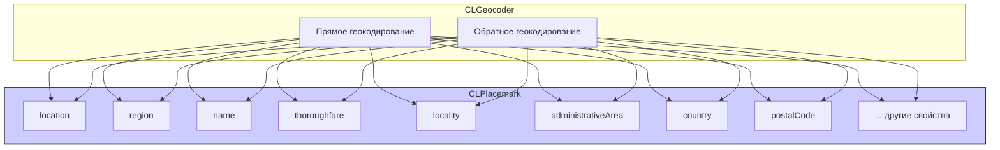

#core-location #clplacemark #geocoding #address #maps #location #ios

---
## CLPlacemark

### Определение
**CLPlacemark** — это класс во фреймворке [[Core Location]], который представляет собой удобочитаемое описание географического местоположения, включая информацию об адресе (улица, город, страна, почтовый индекс), достопримечательностях, водоемах и других географических объектах . Объекты `CLPlacemark` являются результатом операций геокодирования (как прямого, так и обратного), выполняемых с помощью [[CLGeocoder]].

Placemark объединяет в себе две важные составляющие:
- **Географические координаты** (через свойство `location`)
- **Структурированную адресную информацию** (улица, город, страна и т.д.)

### Зачем это знать [[iOS]]-разработчику?
1.  **Отображение адреса:** Преобразование координат в понятный пользователю адрес после обратного геокодирования.
2.  **Поиск мест:** Получение структурированной информации о месте, найденном по названию.
3.  **Интеграция с картами:** Создание аннотаций с полным адресом для `MKMapView`.
4.  **Анализ адресных данных:** Извлечение отдельных компонентов адреса (например, только город или только почтовый индекс) для фильтрации или отображения.
5.  **Работа с геозонами:** Использование региона (`region`) для определения области, связанной с местом.

---

### Архитектура и место в Core Location



### Ключевые свойства CLPlacemark

#### Основные свойства местоположения
- `location` ([[CLLocation]]`?`) — географические координаты места .
- `region` ([[CLRegion]]`?`) — регион (обычно круг), описывающий приблизительную область места .

#### Адресная информация
- `name` ([[String]]`?`) — название места (например, "Эйфелева башня") .
- `thoroughfare` (`String?`) — название улицы .
- `subThoroughfare` (`String?`) — номер дома .
- `locality` (`String?`) — город .
- `subLocality` (`String?`) — район города .
- `administrativeArea` (`String?`) — область, штат, регион .
- `subAdministrativeArea` (`String?`) — район области .
- `postalCode` (`String?`) — почтовый индекс .
- `country` (`String?`) — название страны .
- `isoCountryCode` (`String?`) — двухбуквенный код страны (ISO 3166-1 alpha-2) .

#### Географические объекты
- `inlandWater` (`String?`) — название внутреннего водоема (озеро, река) .
- `ocean` (`String?`) — название океана .
- `areasOfInterest` (`[String]?`) — массив достопримечательностей или значимых мест в данной точке .

#### Адресный словарь
- `addressDictionary` (`[String: Any]?`) — устаревшее свойство, содержащее полный словарь адреса (совместимость с Address Book framework) .

---

### Примеры использования

#### Уровень 1: Обратное геокодирование и отображение адреса
Базовый пример получения адреса по координатам.

```swift
import UIKit
import CoreLocation

class ReverseGeocodingViewController: UIViewController {

    let geocoder = CLGeocoder()
    let locationManager = CLLocationManager()
    @IBOutlet weak var addressLabel: UILabel!
    
    override func viewDidLoad() {
        super.viewDidLoad()
        locationManager.delegate = self
        locationManager.requestWhenInUseAuthorization()
    }
    
    func reverseGeocode(location: CLLocation) {
        geocoder.reverseGeocodeLocation(location) { [weak self] placemarks, error in
            if let error = error {
                self?.addressLabel.text = "Ошибка: \(error.localizedDescription)"
                return
            }
            
            guard let placemark = placemarks?.first else {
                self?.addressLabel.text = "Адрес не найден"
                return
            }
            
            // Формируем строку адреса из компонентов
            var addressComponents: [String] = []
            
            if let name = placemark.name { addressComponents.append(name) }
            if let thoroughfare = placemark.thoroughfare { 
                if let subThoroughfare = placemark.subThoroughfare {
                    addressComponents.append("\(thoroughfare), \(subThoroughfare)")
                } else {
                    addressComponents.append(thoroughfare)
                }
            }
            if let locality = placemark.locality { addressComponents.append(locality) }
            if let administrativeArea = placemark.administrativeArea { addressComponents.append(administrativeArea) }
            if let postalCode = placemark.postalCode { addressComponents.append(postalCode) }
            if let country = placemark.country { addressComponents.append(country) }
            
            self?.addressLabel.text = addressComponents.joined(separator: "\n")
        }
    }
}

extension ReverseGeocodingViewController: CLLocationManagerDelegate {
    func locationManager(_ manager: CLLocationManager, didUpdateLocations locations: [CLLocation]) {
        if let location = locations.last {
            reverseGeocode(location: location)
            manager.stopUpdatingLocation()
        }
    }
}
```

#### Уровень 2: Форматирование адреса с использованием CNPostalAddressFormatter
Современный способ форматирования адреса с помощью Contacts framework.

```swift
import UIKit
import CoreLocation
import Contacts

extension CLPlacemark {
    
    /// Преобразует CLPlacemark в CNPostalAddress для использования с CNPostalAddressFormatter
    var postalAddress: CNPostalAddress? {
        let address = CNMutablePostalAddress()
        
        address.street = [thoroughfare, subThoroughfare]
            .compactMap { $0 }
            .joined(separator: ", ")
        
        address.city = locality ?? ""
        address.state = administrativeArea ?? ""
        address.postalCode = postalCode ?? ""
        address.country = country ?? ""
        address.isoCountryCode = isoCountryCode ?? ""
        
        if let subLocality = subLocality {
            address.subLocality = subLocality
        }
        
        return address.copy() as? CNPostalAddress
    }
    
    /// Форматированный адрес в одну строку
    var formattedAddress: String? {
        guard let postalAddress = postalAddress else { return nil }
        
        let formatter = CNPostalAddressFormatter()
        formatter.style = .mailingAddress
        return formatter.string(from: postalAddress)
            .replacingOccurrences(of: "\n", with: ", ")
    }
    
    /// Многострочный форматированный адрес
    var multilineAddress: String? {
        guard let postalAddress = postalAddress else { return nil }
        
        let formatter = CNPostalAddressFormatter()
        formatter.style = .mailingAddress
        return formatter.string(from: postalAddress)
    }
}

// Использование:
class FormattedAddressViewController: UIViewController {
    
    func displayPlacemark(_ placemark: CLPlacemark) {
        print("Однострочный адрес: \(placemark.formattedAddress ?? "Нет адреса")")
        print("\nМногострочный адрес:\n\(placemark.multilineAddress ?? "Нет адреса")")
        
        // Для отображения в UI
        addressLabel.text = placemark.formattedAddress
    }
}
```

#### Уровень 3: Прямое геокодирование и работа с результатами
Поиск места по названию и обработка нескольких результатов.

```swift
import UIKit
import CoreLocation
import MapKit

class PlaceSearchViewController: UIViewController, UITableViewDataSource {

    @IBOutlet weak var searchTextField: UITextField!
    @IBOutlet weak var tableView: UITableView!
    
    let geocoder = CLGeocoder()
    var searchResults: [CLPlacemark] = []
    
    @IBAction func searchButtonTapped() {
        guard let query = searchTextField.text, !query.isEmpty else { return }
        
        geocoder.geocodeAddressString(query) { [weak self] placemarks, error in
            if let error = error {
                print("Ошибка: \(error.localizedDescription)")
                return
            }
            
            self?.searchResults = placemarks ?? []
            self?.tableView.reloadData()
            
            for (index, placemark) in (placemarks ?? []).enumerated() {
                print("\nРезультат \(index + 1):")
                self?.printPlacemarkInfo(placemark)
            }
        }
    }
    
    private func printPlacemarkInfo(_ placemark: CLPlacemark) {
        if let name = placemark.name { print("  Название: \(name)") }
        if let locality = placemark.locality { print("  Город: \(locality)") }
        if let administrativeArea = placemark.administrativeArea { print("  Область: \(administrativeArea)") }
        if let country = placemark.country { print("  Страна: \(country)") }
        if let location = placemark.location {
            print("  Координаты: \(location.coordinate.latitude), \(location.coordinate.longitude)")
        }
        if let region = placemark.region {
            print("  Регион: \(region)")
        }
        if let areasOfInterest = placemark.areasOfInterest {
            print("  Достопримечательности: \(areasOfInterest.joined(separator: ", "))")
        }
    }
    
    // MARK: - UITableViewDataSource
    func tableView(_ tableView: UITableView, numberOfRowsInSection section: Int) -> Int {
        return searchResults.count
    }
    
    func tableView(_ tableView: UITableView, cellForRowAt indexPath: IndexPath) -> UITableViewCell {
        let cell = tableView.dequeueReusableCell(withIdentifier: "PlaceCell", for: indexPath)
        let placemark = searchResults[indexPath.row]
        
        var content = cell.defaultContentConfiguration()
        content.text = placemark.name ?? "Неизвестное место"
        
        var detailParts: [String] = []
        if let locality = placemark.locality { detailParts.append(locality) }
        if let administrativeArea = placemark.administrativeArea { detailParts.append(administrativeArea) }
        if let country = placemark.country { detailParts.append(country) }
        
        content.secondaryText = detailParts.joined(separator: ", ")
        cell.contentConfiguration = content
        
        return cell
    }
}
```

#### Уровень 4: Создание аннотации для [[MKMapView]] из CLPlacemark
Интеграция с MapKit.

```swift
import UIKit
import CoreLocation
import MapKit

class PlacemarkAnnotation: NSObject, MKAnnotation {
    
    let placemark: CLPlacemark
    var coordinate: CLLocationCoordinate2D
    var title: String?
    var subtitle: String?
    
    init(placemark: CLPlacemark) {
        self.placemark = placemark
        self.coordinate = placemark.location?.coordinate ?? CLLocationCoordinate2D()
        
        // Заголовок
        if let name = placemark.name {
            self.title = name
        } else if let thoroughfare = placemark.thoroughfare {
            self.title = thoroughfare
        } else {
            self.title = "Местоположение"
        }
        
        // Подзаголовок
        var subtitleParts: [String] = []
        if let locality = placemark.locality { subtitleParts.append(locality) }
        if let administrativeArea = placemark.administrativeArea { subtitleParts.append(administrativeArea) }
        if let country = placemark.country { subtitleParts.append(country) }
        
        self.subtitle = subtitleParts.isEmpty ? nil : subtitleParts.joined(separator: ", ")
    }
}

class MapPlacemarkViewController: UIViewController, MKMapViewDelegate {

    @IBOutlet weak var mapView: MKMapView!
    
    func addPlacemarkToMap(_ placemark: CLPlacemark) {
        let annotation = PlacemarkAnnotation(placemark: placemark)
        mapView.addAnnotation(annotation)
        
        if let coordinate = placemark.location?.coordinate {
            let region = MKCoordinateRegion(
                center: coordinate,
                latitudinalMeters: 1000,
                longitudinalMeters: 1000
            )
            mapView.setRegion(region, animated: true)
        }
    }
    
    // MARK: - MKMapViewDelegate
    func mapView(_ mapView: MKMapView, viewFor annotation: MKAnnotation) -> MKAnnotationView? {
        guard let placemarkAnnotation = annotation as? PlacemarkAnnotation else { return nil }
        
        let identifier = "PlacemarkAnnotation"
        var annotationView = mapView.dequeueReusableAnnotationView(withIdentifier: identifier)
        
        if annotationView == nil {
            annotationView = MKMarkerAnnotationView(annotation: annotation, reuseIdentifier: identifier)
            annotationView?.canShowCallout = true
            annotationView?.rightCalloutAccessoryView = UIButton(type: .detailDisclosure)
        } else {
            annotationView?.annotation = annotation
        }
        
        return annotationView
    }
}
```

#### Уровень 5: Сравнение placemark и определение ближайшего
Поиск ближайшего места из списка.

```swift
import CoreLocation

extension CLPlacemark {
    
    /// Возвращает расстояние до другого placemark в метрах
    func distance(to placemark: CLPlacemark) -> CLLocationDistance? {
        guard let location1 = self.location,
              let location2 = placemark.location else { return nil }
        return location1.distance(from: location2)
    }
    
    /// Проверяет, находится ли placemark в том же городе
    func isInSameCity(as placemark: CLPlacemark) -> Bool {
        guard let locality1 = self.locality,
              let locality2 = placemark.locality else { return false }
        return locality1 == locality2
    }
    
    /// Проверяет, находится ли placemark в той же стране
    func isInSameCountry(as placemark: CLPlacemark) -> Bool {
        guard let country1 = self.isoCountryCode,
              let country2 = placemark.isoCountryCode else { return false }
        return country1 == country2
    }
}

class NearestPlaceFinder {
    
    static func findNearestPlace(to referencePlacemark: CLPlacemark,
                                   from placemarks: [CLPlacemark]) -> CLPlacemark? {
        
        return placemarks
            .filter { $0.location != nil } // Только те, у которых есть координаты
            .min { (placemark1, placemark2) -> Bool in
                guard let distance1 = referencePlacemark.distance(to: placemark1),
                      let distance2 = referencePlacemark.distance(to: placemark2) else {
                    return false
                }
                return distance1 < distance2
            }
    }
}
```

#### Уровень 6: Работа с водоемами и достопримечательностями
Использование специальных свойств placemark.

```swift
import UIKit
import CoreLocation

class WaterAndInterestViewController: UIViewController {
    
    let geocoder = CLGeocoder()
    
    func explorePlacemark(_ placemark: CLPlacemark) {
        var info: [String] = []
        
        // Название места
        if let name = placemark.name {
            info.append("📍 \(name)")
        }
        
        // Достопримечательности
        if let areasOfInterest = placemark.areasOfInterest, !areasOfInterest.isEmpty {
            info.append("🏛 Достопримечательности: \(areasOfInterest.joined(separator: ", "))")
        }
        
        // Водоемы
        if let inlandWater = placemark.inlandWater {
            info.append("💧 Внутренний водоем: \(inlandWater)")
        }
        
        if let ocean = placemark.ocean {
            info.append("🌊 Океан: \(ocean)")
        }
        
        // Адрес
        var addressParts: [String] = []
        if let locality = placemark.locality { addressParts.append(locality) }
        if let administrativeArea = placemark.administrativeArea { addressParts.append(administrativeArea) }
        if let country = placemark.country { addressParts.append(country) }
        
        if !addressParts.isEmpty {
            info.append("🗺 \(addressParts.joined(separator: ", "))")
        }
        
        // Вывод информации
        info.forEach { print($0) }
    }
    
    func searchBodiesOfWater() {
        geocoder.geocodeAddressString("Байкал") { placemarks, error in
            if let placemark = placemarks?.first {
                self.explorePlacemark(placemark)
            }
        }
    }
}
```

#### Уровень 7: Сериализация и сохранение CLPlacemark
Сохранение placemark в [[UserDefaults]] или файл.

```swift
import CoreLocation

extension CLPlacemark {
    
    /// Преобразует placemark в словарь для сериализации
    func toDictionary() -> [String: Any] {
        var dict: [String: Any] = [:]
        
        if let name = name { dict["name"] = name }
        if let thoroughfare = thoroughfare { dict["thoroughfare"] = thoroughfare }
        if let subThoroughfare = subThoroughfare { dict["subThoroughfare"] = subThoroughfare }
        if let locality = locality { dict["locality"] = locality }
        if let subLocality = subLocality { dict["subLocality"] = subLocality }
        if let administrativeArea = administrativeArea { dict["administrativeArea"] = administrativeArea }
        if let subAdministrativeArea = subAdministrativeArea { dict["subAdministrativeArea"] = subAdministrativeArea }
        if let postalCode = postalCode { dict["postalCode"] = postalCode }
        if let country = country { dict["country"] = country }
        if let isoCountryCode = isoCountryCode { dict["isoCountryCode"] = isoCountryCode }
        if let inlandWater = inlandWater { dict["inlandWater"] = inlandWater }
        if let ocean = ocean { dict["ocean"] = ocean }
        if let areasOfInterest = areasOfInterest { dict["areasOfInterest"] = areasOfInterest }
        
        if let location = location {
            dict["latitude"] = location.coordinate.latitude
            dict["longitude"] = location.coordinate.longitude
        }
        
        return dict
    }
    
    /// Создает placemark из словаря
    convenience init?(dictionary: [String: Any]) {
        guard let latitude = dictionary["latitude"] as? CLLocationDegrees,
              let longitude = dictionary["longitude"] as? CLLocationDegrees else { return nil }
        
        let location = CLLocation(latitude: latitude, longitude: longitude)
        
        // Создание placemark возможно только через CLGeocoder,
        // но для сохранения мы можем хранить только координаты и адресные компоненты
        self.init()
        // В реальном приложении нужно использовать MKPlacemark для создания
    }
}

// Сохранение в UserDefaults
func savePlacemark(_ placemark: CLPlacemark, forKey key: String) {
    let dict = placemark.toDictionary()
    UserDefaults.standard.set(dict, forKey: key)
}

// Загрузка из UserDefaults
func loadPlacemark(forKey key: String) -> CLPlacemark? {
    guard let dict = UserDefaults.standard.dictionary(forKey: key) else { return nil }
    return CLPlacemark(dictionary: dict)
}
```

---

### Сравнение CLPlacemark и MKPlacemark

| Характеристика          | CLPlacemark (Core Location)                            | MKPlacemark ([[MapKit]])                     |
| ----------------------- | ------------------------------------------------------ | -------------------------------------------- |
| **Фреймворк**           | [[Core Location]]                                      | MapKit                                       |
| **Основное назначение** | Представление адресной информации после геокодирования | Представление места для отображения на карте |
| **Поддержка карт**      | Ограниченная                                           | Полная (совместимость с MKAnnotation)        |
| **Координаты**          | Через свойство `location`                              | Прямо в свойстве `coordinate`                |
| **Создание**            | Только через [[CLGeocoder]]                            | Можно создать вручную                        |
| **Использование**       | Для работы с адресами и геокодирования                 | Для аннотаций на карте                       |

### Best Practices

#### 1. **Используйте CNPostalAddressFormatter для форматирования адреса**
Вместо ручного составления строк адреса используйте `CNPostalAddressFormatter` из Contacts framework для правильного локализованного форматирования .

#### 2. **Всегда проверяйте наличие координат**
Свойство `location` может быть `nil`. Проверяйте его перед использованием.

#### 3. **Учитывайте множественные результаты**
При прямом геокодировании может вернуться несколько `placemark`. Предоставляйте пользователю выбор или используйте дополнительные критерии для выбора наиболее релевантного.

#### 4. **Используйте areasOfInterest для достопримечательностей**
Это свойство содержит список значимых мест в данной точке (например, музеи, парки). Используйте его для обогащения информации о месте.

#### 5. **Комбинируйте с MapKit**
Для отображения на карте преобразуйте `CLPlacemark` в `MKPlacemark` или создайте свою аннотацию.

#### 6. **Обрабатывайте частичную информацию**
Не все свойства `CLPlacemark` могут быть заполнены. Всегда используйте опциональные значения с проверкой.

### Итог
**CLPlacemark** — это фундаментальный класс для работы с адресной информацией в iOS. Он предоставляет:

- **Структурированный адрес** с разделением на компоненты
- **Географические координаты** для определения местоположения
- **Информацию о водоемах и достопримечательностях**
- **Регион** для определения области
- **Интеграцию** с CLGeocoder и MapKit

Понимание работы с `CLPlacemark` необходимо для создания приложений, работающих с географическими данными, адресами и картами.