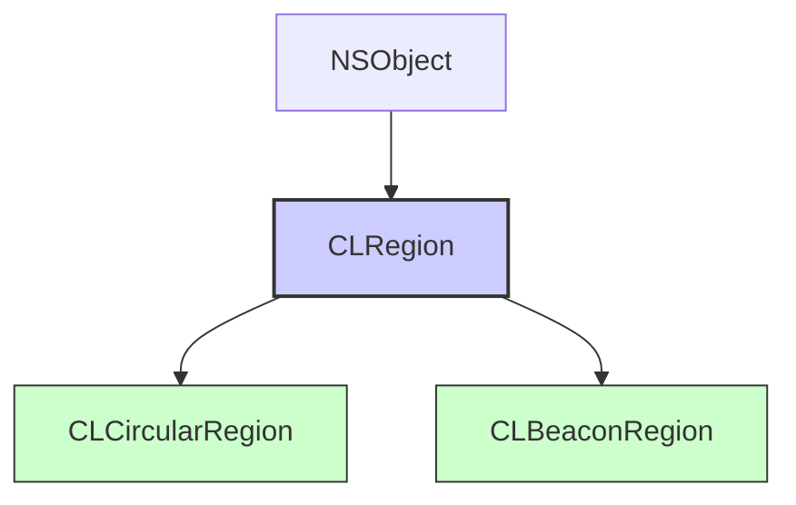

#core-location #clregion #geofencing #region-monitoring #clcircularregion #clbeaconregion #location-services

---
## CLRegion

### Определение
**CLRegion** — это абстрактный базовый класс во фреймворке [[Core Location]], который представляет собой географическую область, представляющую интерес для приложения . Он служит родительским классом для конкретных типов регионов, которые можно отслеживать с помощью служб геолокации устройства. Сам по себе `CLRegion` не используется напрямую, но предоставляет общий интерфейс для своих подклассов.

Core Location поддерживает два основных типа регионов:
- **[[CLCircularRegion]]** — круговая область, определяемая центром (координаты) и радиусом. Используется для геозон (geofencing).
- **[[CLBeaconRegion]]** — область, определяемая Bluetooth-маяками (iBeacon). Используется для точного позиционирования внутри помещений.

### Зачем это знать iOS-разработчику?
1.  **Геозоны (Geofencing):** Отслеживание входа и выхода пользователя из определенной области (например, магазин, офис, дом).
2.  **Контекстные уведомления:** Отправка push-уведомлений, когда пользователь входит в определенный район или покидает его.
3.  **Автоматизация действий:** Включение определенных функций приложения (например, Wi-Fi, режим "не беспокоить") при входе в зону.
4.  **Мониторинг посещаемости:** Отслеживание посещения определенных мест для аналитики или программ лояльности.
5.  **Bluetooth-маячки:** Создание приложений для музеев, магазинов, мероприятий с использованием iBeacon.

---

### Иерархия классов



### Ключевые свойства CLRegion

#### Общие свойства для всех регионов
- `identifier` ([[String]]) — уникальный идентификатор региона. Используется для различения регионов при мониторинге .
- `notifyOnEntry` ([[Bool]]) — определяет, должно ли приложение получать уведомление при входе в регион .
- `notifyOnExit` (`Bool`) — определяет, должно ли приложение получать уведомление при выходе из региона .
- `notifyOnEntryStateOnDisplay` (`Bool`) — определяет, должно ли устройство отправлять уведомление о состоянии региона при включении дисплея (доступно для `CLBeaconRegion`) .

#### Свойства для мониторинга
- `monitoring` — статический метод `CLRegion.monitoringAvailable()` проверяет, поддерживает ли устройство мониторинг регионов .
- `maxRegions` — максимальное количество регионов, которые можно отслеживать одновременно (обычно 20) .

---

### CLCircularRegion (Круговая область)

#### Дополнительные свойства
- `center` ([[CLLocationCoordinate2D]]) — координаты центра круга .
- `radius` ([[CLLocationDistance]]) — радиус области в метрах .
- `radiusAccuracy` — точность радиуса (обычно зависит от настроек устройства) .

#### Создание
```swift
let center = CLLocationCoordinate2D(latitude: 55.751244, longitude: 37.618423)
let region = CLCircularRegion(center: center, radius: 100, identifier: "MoscowCenter")
region.notifyOnEntry = true
region.notifyOnExit = true
```

### CLBeaconRegion (Область iBeacon)

#### Дополнительные свойства
- `proximityUUID` (`UUID`) — [[UUID]] маяка .
- `major` (`NSNumber?`) — основной идентификатор (необязательный) .
- `minor` ([[NSNumber]]`?`) — дополнительный идентификатор (необязательный) .
- `beaconIdentityConstraint` ([[CLBeaconIdentityConstraint]]) — объект, содержащий UUID, major и minor для идентификации маяков (iOS 13+) .
- `rssi` ([[Int]]) — уровень сигнала маяка .

#### Создание
```swift
let uuid = UUID(uuidString: "E2C56DB5-DFFB-48D2-B060-D0F5A71096E0")!
let constraint = CLBeaconIdentityConstraint(uuid: uuid, major: 1, minor: 1)
let region = CLBeaconRegion(beaconIdentityConstraint: constraint, identifier: "MyBeacon")
```

---

### Примеры использования

#### Уровень 1: Настройка разрешений и проверка доступности
Прежде чем использовать мониторинг регионов, нужно проверить его доступность.

```swift
import UIKit
import CoreLocation

class RegionMonitoringViewController: UIViewController, CLLocationManagerDelegate {

    let locationManager = CLLocationManager()
    let statusLabel = UILabel()
    
    override func viewDidLoad() {
        super.viewDidLoad()
        setupUI()
        setupLocationManager()
    }
    
    private func setupUI() {
        statusLabel.frame = CGRect(x: 20, y: 200, width: view.bounds.width - 40, height: 100)
        statusLabel.numberOfLines = 0
        statusLabel.textAlignment = .center
        view.addSubview(statusLabel)
    }
    
    private func setupLocationManager() {
        locationManager.delegate = self
        
        // 1. Проверяем доступность мониторинга регионов
        if CLLocationManager.isMonitoringAvailable(for: CLCircularRegion.self) {
            statusLabel.text = "Мониторинг геозон поддерживается"
        } else {
            statusLabel.text = "Мониторинг геозон не поддерживается"
            return
        }
        
        // 2. Запрашиваем разрешения (для геозон нужно Always authorization)
        locationManager.requestAlwaysAuthorization()
    }
    
    // MARK: - CLLocationManagerDelegate
    func locationManagerDidChangeAuthorization(_ manager: CLLocationManager) {
        switch manager.authorizationStatus {
        case .authorizedAlways:
            statusLabel.text = "Разрешение Always получено"
            startMonitoringRegions()
        case .authorizedWhenInUse:
            statusLabel.text = "Только When In Use - недостаточно для геозон"
        case .denied:
            statusLabel.text = "Доступ запрещен"
        default:
            break
        }
    }
    
    func startMonitoringRegions() {
        // Будет реализовано в следующих примерах
    }
}
```

#### Уровень 2: Мониторинг круговой геозоны (CLCircularRegion)
Создание и мониторинг входа/выхода из области.

```swift
import UIKit
import CoreLocation

class GeofencingViewController: RegionMonitoringViewController {

    let homeRegion = CLCircularRegion(
        center: CLLocationCoordinate2D(latitude: 55.751244, longitude: 37.618423),
        radius: 100,
        identifier: "Home"
    )
    
    let officeRegion = CLCircularRegion(
        center: CLLocationCoordinate2D(latitude: 55.755826, longitude: 37.617300),
        radius: 50,
        identifier: "Office"
    )
    
    override func startMonitoringRegions() {
        // Настройка регионов
        homeRegion.notifyOnEntry = true
        homeRegion.notifyOnExit = true
        
        officeRegion.notifyOnEntry = true
        officeRegion.notifyOnExit = true
        
        // Начинаем мониторинг
        locationManager.startMonitoring(for: homeRegion)
        locationManager.startMonitoring(for: officeRegion)
        
        statusLabel.text = "Мониторинг геозон запущен"
    }
    
    // MARK: - CLLocationManagerDelegate для регионов
    func locationManager(_ manager: CLLocationManager, didEnterRegion region: CLRegion) {
        if let circularRegion = region as? CLCircularRegion {
            let message = "Вход в регион: \(region.identifier)"
            print(message)
            statusLabel.text = message
            sendLocalNotification(title: "Геозона", body: message)
        }
    }
    
    func locationManager(_ manager: CLLocationManager, didExitRegion region: CLRegion) {
        if let circularRegion = region as? CLCircularRegion {
            let message = "Выход из региона: \(region.identifier)"
            print(message)
            statusLabel.text = message
            sendLocalNotification(title: "Геозона", body: message)
        }
    }
    
    func locationManager(_ manager: CLLocationManager, monitoringDidFailFor region: CLRegion?, withError error: Error) {
        print("Ошибка мониторинга региона: \(error.localizedDescription)")
        statusLabel.text = "Ошибка мониторинга: \(error.localizedDescription)"
    }
    
    private func sendLocalNotification(title: String, body: String) {
        let content = UNMutableNotificationContent()
        content.title = title
        content.body = body
        content.sound = .default
        
        let request = UNNotificationRequest(identifier: UUID().uuidString,
                                           content: content,
                                           trigger: nil)
        UNUserNotificationCenter.current().add(request)
    }
}
```

#### Уровень 3: Определение текущего состояния региона
Проверка, находится ли пользователь внутри региона в данный момент.

```swift
import UIKit
import CoreLocation

class RegionStateViewController: GeofencingViewController {
    
    func checkRegionState() {
        // Запрашиваем текущее состояние для всех регионов
        locationManager.requestState(for: homeRegion)
        locationManager.requestState(for: officeRegion)
    }
    
    // MARK: - CLLocationManagerDelegate
    func locationManager(_ manager: CLLocationManager, didDetermineState state: CLRegionState, for region: CLRegion) {
        var stateString: String
        switch state {
        case .inside:
            stateString = "внутри"
        case .outside:
            stateString = "снаружи"
        case .unknown:
            stateString = "неизвестно"
        @unknown default:
            stateString = "неизвестно"
        }
        
        let message = "Регион \(region.identifier): \(stateString)"
        print(message)
        
        if let circularRegion = region as? CLCircularRegion {
            print("  Центр: \(circularRegion.center.latitude), \(circularRegion.center.longitude)")
            print("  Радиус: \(circularRegion.radius) м")
        }
        
        DispatchQueue.main.async {
            self.statusLabel.text = message
        }
    }
}
```

#### Уровень 4: Управление несколькими регионами
Добавление, удаление и получение списка отслеживаемых регионов.

```swift
import UIKit
import CoreLocation

class MultiRegionViewController: GeofencingViewController {
    
    var trackedRegions: Set<CLRegion> {
        return locationManager.monitoredRegions
    }
    
    func addRegion(center: CLLocationCoordinate2D, radius: CLLocationDistance, identifier: String) {
        // Проверяем лимит регионов (обычно 20)
        guard trackedRegions.count < 20 else {
            print("Достигнут лимит регионов")
            return
        }
        
        let region = CLCircularRegion(center: center, radius: radius, identifier: identifier)
        region.notifyOnEntry = true
        region.notifyOnExit = true
        
        locationManager.startMonitoring(for: region)
        print("Регион \(identifier) добавлен")
    }
    
    func removeRegion(identifier: String) {
        if let region = trackedRegions.first(where: { $0.identifier == identifier }) {
            locationManager.stopMonitoring(for: region)
            print("Регион \(identifier) удален")
        }
    }
    
    func listRegions() {
        print("Отслеживаемые регионы (\(trackedRegions.count)):")
        for region in trackedRegions {
            print("  - \(region.identifier)")
            if let circularRegion = region as? CLCircularRegion {
                print("    Центр: \(circularRegion.center)")
                print("    Радиус: \(circularRegion.radius)")
            }
        }
    }
    
    func removeAllRegions() {
        for region in trackedRegions {
            locationManager.stopMonitoring(for: region)
        }
        print("Все регионы удалены")
    }
}
```

#### Уровень 5: Работа с CLBeaconRegion (iBeacon)
Пример мониторинга Bluetooth-маяков.

```swift
import UIKit
import CoreLocation

class BeaconMonitoringViewController: RegionMonitoringViewController {

    let beaconUUID = UUID(uuidString: "E2C56DB5-DFFB-48D2-B060-D0F5A71096E0")!
    
    override func startMonitoringRegions() {
        guard CLLocationManager.isMonitoringAvailable(for: CLBeaconRegion.self) else {
            statusLabel.text = "Мониторинг iBeacon не поддерживается"
            return
        }
        
        // 1. Создаем регион для всех маяков с указанным UUID
        let beaconConstraint = CLBeaconIdentityConstraint(uuid: beaconUUID)
        let beaconRegion = CLBeaconRegion(beaconIdentityConstraint: beaconConstraint, identifier: "AllBeacons")
        
        beaconRegion.notifyOnEntry = true
        beaconRegion.notifyOnExit = true
        beaconRegion.notifyEntryStateOnDisplay = true
        
        // 2. Начинаем мониторинг
        locationManager.startMonitoring(for: beaconRegion)
        
        // 3. Также можно начать сканирование (требуется дополнительная настройка)
        // locationManager.startRangingBeacons(satisfying: beaconConstraint)
        
        statusLabel.text = "Мониторинг iBeacon запущен"
    }
    
    // MARK: - Дополнительные методы делегата для iBeacon
    func locationManager(_ manager: CLLocationManager, didRange beacons: [CLBeacon], satisfying beaconConstraint: CLBeaconIdentityConstraint) {
        for beacon in beacons {
            let proximityString: String
            switch beacon.proximity {
            case .immediate:
                proximityString = "очень близко"
            case .near:
                proximityString = "близко"
            case .far:
                proximityString = "далеко"
            case .unknown:
                proximityString = "неизвестно"
            @unknown default:
                proximityString = "неизвестно"
            }
            
            print("Маяк UUID: \(beacon.uuid), major: \(beacon.major ?? 0), minor: \(beacon.minor ?? 0), расстояние: \(proximityString), RSSI: \(beacon.rssi)")
        }
    }
}
```

#### Уровень 6: Проверка вхождения координат в регион
Проверка, находится ли точка внутри региона.

```swift
import CoreLocation

extension CLCircularRegion {
    
    /// Проверяет, содержит ли регион указанные координаты
    func contains(_ coordinate: CLLocationCoordinate2D) -> Bool {
        return self.contains(coordinate)
    }
    
    /// Проверяет, содержит ли регион указанное местоположение
    func contains(_ location: CLLocation) -> Bool {
        return self.contains(location.coordinate)
    }
    
    /// Возвращает расстояние от центра региона до указанных координат
    func distance(to coordinate: CLLocationCoordinate2D) -> CLLocationDistance {
        let location1 = CLLocation(latitude: center.latitude, longitude: center.longitude)
        let location2 = CLLocation(latitude: coordinate.latitude, longitude: coordinate.longitude)
        return location1.distance(from: location2)
    }
}

class RegionCheckViewController: UIViewController, CLLocationManagerDelegate {
    
    let locationManager = CLLocationManager()
    let officeRegion = CLCircularRegion(center: CLLocationCoordinate2D(latitude: 55.755826, longitude: 37.617300),
                                        radius: 100,
                                        identifier: "Office")
    
    override func viewDidLoad() {
        super.viewDidLoad()
        locationManager.delegate = self
        locationManager.startUpdatingLocation()
    }
    
    func locationManager(_ manager: CLLocationManager, didUpdateLocations locations: [CLLocation]) {
        guard let location = locations.last else { return }
        
        if officeRegion.contains(location) {
            print("Вы находитесь в офисе! Расстояние от центра: \(Int(officeRegion.distance(to: location.coordinate))) м")
        } else {
            print("Вы не в офисе. Расстояние до центра: \(Int(officeRegion.distance(to: location.coordinate))) м")
        }
    }
}
```

#### Уровень 7: Работа с геозонами в фоновом режиме
Настройка приложения для получения событий в фоне.

```swift
import UIKit
import CoreLocation
import UserNotifications

class BackgroundGeofencingViewController: GeofencingViewController {
    
    override func setupLocationManager() {
        super.setupLocationManager()
        
        // 1. Настройка для фоновой работы
        locationManager.allowsBackgroundLocationUpdates = true
        locationManager.pausesLocationUpdatesAutomatically = false
        
        // 2. Включение фонового режима (требуется включить в capabilities)
        // В Info.plist нужно добавить Required background modes с элементом location
    }
    
    override func startMonitoringRegions() {
        // Создаем регионы с меньшим радиусом для более точного срабатывания
        let region1 = CLCircularRegion(center: CLLocationCoordinate2D(latitude: 55.751244, longitude: 37.618423),
                                       radius: 50,
                                       identifier: "Home")
        region1.notifyOnEntry = true
        region1.notifyOnExit = true
        
        locationManager.startMonitoring(for: region1)
    }
    
    // MARK: - CLLocationManagerDelegate (фоновые события)
    func locationManager(_ manager: CLLocationManager, didEnterRegion region: CLRegion) {
        // Это может быть вызвано в фоновом режиме
        let content = UNMutableNotificationContent()
        content.title = "Геозона"
        content.body = "Вы вошли в \(region.identifier)"
        content.sound = .default
        
        let request = UNNotificationRequest(identifier: UUID().uuidString,
                                           content: content,
                                           trigger: nil)
        
        UNUserNotificationCenter.current().add(request)
        
        // Сохраняем событие для последующей отправки на сервер
        saveEvent(regionIdentifier: region.identifier, eventType: "entry")
    }
    
    private func saveEvent(regionIdentifier: String, eventType: String) {
        // Сохраняем в локальную базу данных для последующей отправки на сервер
        print("Событие: \(eventType) в \(regionIdentifier) в \(Date())")
    }
}
```

#### Уровень 8: Тестирование геозон в симуляторе
Пример для тестирования с использованием координат.

```swift
import UIKit
import CoreLocation

class GeofencingTestViewController: RegionMonitoringViewController {
    
    override func viewDidLoad() {
        super.viewDidLoad()
        
        // Добавляем кнопки для тестирования
        let enterButton = UIButton(frame: CGRect(x: 50, y: 300, width: 200, height: 50))
        enterButton.setTitle("Симулировать вход", for: .normal)
        enterButton.backgroundColor = .blue
        enterButton.addTarget(self, action: #selector(simulateEntry), for: .touchUpInside)
        view.addSubview(enterButton)
        
        let exitButton = UIButton(frame: CGRect(x: 50, y: 370, width: 200, height: 50))
        exitButton.setTitle("Симулировать выход", for: .normal)
        exitButton.backgroundColor = .red
        exitButton.addTarget(self, action: #selector(simulateExit), for: .touchUpInside)
        view.addSubview(exitButton)
    }
    
    @objc func simulateEntry() {
        // В симуляторе можно вручную вызвать делегат
        let region = CLCircularRegion(center: CLLocationCoordinate2D(latitude: 55.751244, longitude: 37.618423),
                                     radius: 100,
                                     identifier: "TestRegion")
        locationManager(locationManager, didEnterRegion: region)
    }
    
    @objc func simulateExit() {
        let region = CLCircularRegion(center: CLLocationCoordinate2D(latitude: 55.751244, longitude: 37.618423),
                                     radius: 100,
                                     identifier: "TestRegion")
        locationManager(locationManager, didExitRegion: region)
    }
}
```

---

### Важные нюансы и ограничения

#### 1. **Лимит регионов**
Устройство может отслеживать только до 20 регионов одновременно . Планируйте их использование с учетом этого ограничения.

#### 2. **Точность геозон**
Радиус геозоны должен быть не менее 100 метров для надежной работы. Меньшие радиусы могут работать нестабильно из-за ограничений GPS и энергосбережения .

#### 3. **Разрешения**
Для мониторинга геозон требуется разрешение `always` (всегда), а не `whenInUse` (только при использовании) .

#### 4. **Фоновый режим**
Если приложение должно получать события геозон в фоне, необходимо:
- Включить фоновый режим `Location updates` в capabilities проекта
- Установить `allowsBackgroundLocationUpdates = true`
- Установить `pausesLocationUpdatesAutomatically = false`

#### 5. **Энергопотребление**
Мониторинг регионов оптимизирован для низкого энергопотребления, но все же потребляет батарею. Используйте минимально необходимое количество регионов.

#### 6. **Первое определение состояния**
При старте мониторинга региона состояние изначально неизвестно. Используйте `requestState(for:)`, чтобы получить текущее состояние.

#### 7. **Уникальные идентификаторы**
Все регионы должны иметь уникальные `identifier`. Повторное использование идентификатора приведет к перезаписи предыдущего региона.

### Итог
**CLRegion** и его подклассы предоставляют мощный механизм для отслеживания географических областей в iOS. Основные возможности:

- **CLCircularRegion** для создания геозон и отслеживания входа/выхода
- **CLBeaconRegion** для работы с Bluetooth-маяками iBeacon
- **Автоматические уведомления** при пересечении границ региона
- **Возможность работы в фоне** для постоянного мониторинга
- **Интеграция** с локальными уведомлениями и серверной аналитикой

Понимание работы с регионами необходимо для создания контекстно-зависимых приложений, реагирующих на местоположение пользователя.