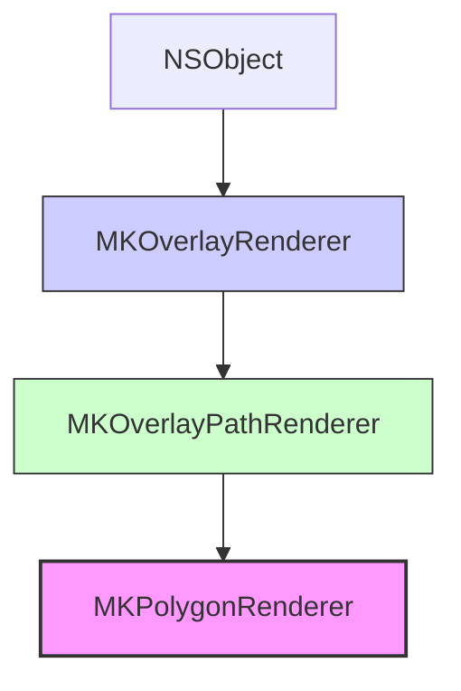

#mapkit #mkpolygonrenderer #mkoverlay #polygon #maps #geofencing #ios #swift

---
## MKPolygonRenderer

### Определение
**MKPolygonRenderer** — это класс во фреймворке [[MapKit]], который отвечает за визуальное отображение многоугольных наложений ([[MKPolygon]]) на карте . Он является подклассом [[MKOverlayPathRenderer]] и предоставляет разработчику полный контроль над тем, как будет выглядеть polygon: цвет заливки, цвет и стиль границы, толщина линии и другие параметры .

Этот класс является современной заменой устаревшего [[MKPolygonView]] и рекомендуется к использованию для всех приложений, начиная с iOS 7 и выше .

### Зачем это знать iOS-разработчику?
1.  **Визуализация зон и областей:** Отображение на карте различных географических зон (районы города, заповедники, зоны доставки) .
2.  **Геозоны (Geofencing):** Визуальная индикация областей, для которых настроен мониторинг входа/выхода.
3.  **Визуализация данных:** Представление статистических данных на карте (например, раскрашивание районов в зависимости от плотности населения) .
4.  **Навигация и планирование:** Отображение запретных или разрешенных зон для движения .
5.  **Пользовательские карты:** Создание интерактивных карт с кастомизированными областями интереса.

---

### Иерархия наследования



### Ключевые свойства

#### Свойства из MKOverlayPathRenderer (основные для настройки)
- `fillColor` ([[UIColor]]`?`) — цвет заливки многоугольника .
- `strokeColor` (`UIColor?`) — цвет обводки (границы) многоугольника .
- `lineWidth` ([[CGFloat]]) — толщина линии обводки в точках .
- `lineDashPattern` (`[NSNumber]?`) — массив чисел, определяющий паттерн штриховой линии (например, `[4, 2]` для пунктира) .
- `lineJoin` ([[CGLineJoin]]) — стиль соединения линий (`.miter`, `.round`, `.bevel`).
- `lineCap` ([[CGLineCap]]) — стиль окончания линии (`.butt`, `.round`, `.square`).
- `miterLimit` ([[CGFloat]]) — предел для соединения типа "митра".
- `alpha` (`CGFloat`) — прозрачность всего рендерера (наследуется от `MKOverlayRenderer`) .

#### Свойства из MKPolygonRenderer
- `polygon` (`MKPolygon`) — объект многоугольника, который представляет данный рендерер . Это свойство доступно только для чтения.

### Основные методы

#### Инициализация
- `init(polygon: MKPolygon)` — создает рендерер для указанного многоугольника .
- `init(overlay: MKOverlay)` — унаследованный инициализатор, который также можно использовать (передавая polygon как overlay).

#### Методы для кастомизации отрисовки
- `createPath()` — создает [[CGPath]], представляющий многоугольник. Может быть переопределен в подклассах .
- `invalidatePath()` — помечает текущий путь как недействительный, вызывая его пересоздание при следующей отрисовке .
- `applyStrokeProperties(to:atZoomScale:)` — применяет свойства обводки к графическому контексту .
- `applyFillProperties(to:atZoomScale:)` — применяет свойства заливки к графическому контексту .
- `strokePath(_:in:)` — выполняет обводку указанного пути в заданном контексте .
- `fillPath(_:in:)` — выполняет заливку указанного пути в заданном контексте .

---

### Примеры использования

#### Уровень 1: Базовое отображение полигона с заливкой и обводкой
Самый простой пример — создание и отображение многоугольника на карте.

```swift
import UIKit
import MapKit

class PolygonViewController: UIViewController, MKMapViewDelegate {

    @IBOutlet weak var mapView: MKMapView!
    
    override func viewDidLoad() {
        super.viewDidLoad()
        mapView.delegate = self
        
        // 1. Создаем координаты для полигона (например, треугольник)
        let coordinates = [
            CLLocationCoordinate2D(latitude: 55.751244, longitude: 37.618423), // Центр
            CLLocationCoordinate2D(latitude: 55.761244, longitude: 37.628423), // Северо-восток
            CLLocationCoordinate2D(latitude: 55.741244, longitude: 37.628423), // Юго-восток
            CLLocationCoordinate2D(latitude: 55.751244, longitude: 37.618423)  // Замыкаем (опционально)
        ]
        
        // 2. Создаем полигон
        let polygon = MKPolygon(coordinates: coordinates, count: coordinates.count)
        
        // 3. Добавляем на карту
        mapView.addOverlay(polygon)
        
        // 4. Устанавливаем регион, чтобы увидеть полигон
        let region = MKCoordinateRegion(
            center: coordinates[0],
            latitudinalMeters: 5000,
            longitudinalMeters: 5000
        )
        mapView.setRegion(region, animated: true)
    }
    
    // MARK: - MKMapViewDelegate
    func mapView(_ mapView: MKMapView, rendererFor overlay: MKOverlay) -> MKOverlayRenderer {
        // 5. Проверяем, является ли overlay полигоном
        if let polygon = overlay as? MKPolygon {
            // 6. Создаем рендерер
            let renderer = MKPolygonRenderer(polygon: polygon)
            
            // 7. Настраиваем внешний вид
            renderer.fillColor = UIColor.blue.withAlphaComponent(0.3)
            renderer.strokeColor = UIColor.blue
            renderer.lineWidth = 2.0
            renderer.alpha = 0.8
            
            return renderer
        }
        
        return MKOverlayRenderer()
    }
}
```

#### Уровень 2: Несколько полигонов с разными стилями
Добавление нескольких полигонов с различными цветами и стилями.

```swift
import UIKit
import MapKit

class MultiPolygonViewController: UIViewController, MKMapViewDelegate {

    @IBOutlet weak var mapView: MKMapView!
    
    override func viewDidLoad() {
        super.viewDidLoad()
        mapView.delegate = self
        addSamplePolygons()
    }
    
    private func addSamplePolygons() {
        // Полигон 1: синий с заливкой
        let coords1 = [
            CLLocationCoordinate2D(latitude: 55.751244, longitude: 37.618423),
            CLLocationCoordinate2D(latitude: 55.761244, longitude: 37.618423),
            CLLocationCoordinate2D(latitude: 55.761244, longitude: 37.638423),
            CLLocationCoordinate2D(latitude: 55.751244, longitude: 37.638423)
        ]
        let polygon1 = MKPolygon(coordinates: coords1, count: coords1.count)
        polygon1.title = "Синий район"
        mapView.addOverlay(polygon1)
        
        // Полигон 2: красный без заливки, только граница
        let coords2 = [
            CLLocationCoordinate2D(latitude: 55.741244, longitude: 37.598423),
            CLLocationCoordinate2D(latitude: 55.751244, longitude: 37.598423),
            CLLocationCoordinate2D(latitude: 55.751244, longitude: 37.618423),
            CLLocationCoordinate2D(latitude: 55.741244, longitude: 37.618423)
        ]
        let polygon2 = MKPolygon(coordinates: coords2, count: coords2.count)
        polygon2.title = "Красный район"
        mapView.addOverlay(polygon2)
        
        // Полигон 3: зеленый с пунктирной границей
        let coords3 = [
            CLLocationCoordinate2D(latitude: 55.731244, longitude: 37.618423),
            CLLocationCoordinate2D(latitude: 55.741244, longitude: 37.628423),
            CLLocationCoordinate2D(latitude: 55.731244, longitude: 37.638423),
            CLLocationCoordinate2D(latitude: 55.721244, longitude: 37.628423)
        ]
        let polygon3 = MKPolygon(coordinates: coords3, count: coords3.count)
        polygon3.title = "Зеленый район"
        mapView.addOverlay(polygon3)
    }
    
    func mapView(_ mapView: MKMapView, rendererFor overlay: MKOverlay) -> MKOverlayRenderer {
        guard let polygon = overlay as? MKPolygon else {
            return MKOverlayRenderer()
        }
        
        let renderer = MKPolygonRenderer(polygon: polygon)
        
        // Настраиваем стиль в зависимости от title
        switch polygon.title {
        case "Синий район":
            renderer.fillColor = UIColor.blue.withAlphaComponent(0.3)
            renderer.strokeColor = UIColor.blue
            renderer.lineWidth = 2.0
            
        case "Красный район":
            renderer.fillColor = UIColor.clear // Без заливки 
            renderer.strokeColor = UIColor.red
            renderer.lineWidth = 3.0
            
        case "Зеленый район":
            renderer.fillColor = UIColor.green.withAlphaComponent(0.2)
            renderer.strokeColor = UIColor.green
            renderer.lineWidth = 2.0
            renderer.lineDashPattern = [4, 4] // Пунктирная линия
            
        default:
            break
        }
        
        return renderer
    }
}
```

#### Уровень 3: Полигон с отверстием (многоугольник с вырезом)
Создание сложной фигуры с внутренним отверстием.

```swift
import UIKit
import MapKit

class PolygonWithHoleViewController: UIViewController, MKMapViewDelegate {

    @IBOutlet weak var mapView: MKMapView!
    
    override func viewDidLoad() {
        super.viewDidLoad()
        mapView.delegate = self
        addPolygonWithHole()
    }
    
    private func addPolygonWithHole() {
        // Внешний контур (большой квадрат)
        let outerCoordinates = [
            CLLocationCoordinate2D(latitude: 55.751244, longitude: 37.618423),
            CLLocationCoordinate2D(latitude: 55.771244, longitude: 37.618423),
            CLLocationCoordinate2D(latitude: 55.771244, longitude: 37.648423),
            CLLocationCoordinate2D(latitude: 55.751244, longitude: 37.648423)
        ]
        let outerPolygon = MKPolygon(coordinates: outerCoordinates, count: outerCoordinates.count)
        
        // Внутренний контур (маленький квадрат - отверстие)
        let innerCoordinates = [
            CLLocationCoordinate2D(latitude: 55.758244, longitude: 37.628423),
            CLLocationCoordinate2D(latitude: 55.764244, longitude: 37.628423),
            CLLocationCoordinate2D(latitude: 55.764244, longitude: 37.638423),
            CLLocationCoordinate2D(latitude: 55.758244, longitude: 37.638423)
        ]
        let innerPolygon = MKPolygon(coordinates: innerCoordinates, count: innerCoordinates.count)
        
        // Создаем полигон с отверстием
        let polygonWithHole = MKPolygon(polygon: outerPolygon, interiorPolygons: [innerPolygon])
        
        mapView.addOverlay(polygonWithHole)
        
        // Устанавливаем регион
        let region = MKCoordinateRegion(
            center: outerCoordinates[0],
            latitudinalMeters: 8000,
            longitudinalMeters: 8000
        )
        mapView.setRegion(region, animated: true)
    }
    
    func mapView(_ mapView: MKMapView, rendererFor overlay: MKOverlay) -> MKOverlayRenderer {
        guard let polygon = overlay as? MKPolygon else {
            return MKOverlayRenderer()
        }
        
        let renderer = MKPolygonRenderer(polygon: polygon)
        renderer.fillColor = UIColor.orange.withAlphaComponent(0.4)
        renderer.strokeColor = UIColor.orange
        renderer.lineWidth = 2.0
        
        return renderer
    }
}
```

#### Уровень 4: Оптимизация для большого количества полигонов
При добавлении множества полигонов (например, до 100 000) важно оптимизировать рендеринг .

```swift
import UIKit
import MapKit

class OptimizedPolygonRenderer: MKPolygonRenderer {
    
    private var maxZoomLevel: MKZoomScale = 0.02
    
    override func draw(_ mapRect: MKMapRect, zoomScale: MKZoomScale, in context: CGContext) {
        // Не отрисовываем полигоны при слишком низком масштабе (сильно удаленный вид)
        if zoomScale < maxZoomLevel {
            return
        }
        
        // Для остальных масштабов отрисовываем как обычно
        super.draw(mapRect, zoomScale: zoomScale, in: context)
    }
}

class ManyPolygonsViewController: UIViewController, MKMapViewDelegate {

    @IBOutlet weak var mapView: MKMapView!
    
    override func viewDidLoad() {
        super.viewDidLoad()
        mapView.delegate = self
        addManyPolygons()
    }
    
    private func addManyPolygons() {
        // Пример добавления 100 полигонов (в реальном приложении их может быть тысячи)
        for i in 0..<100 {
            let centerLat = 55.75 + Double(i % 10) * 0.02
            let centerLon = 37.62 + Double(i / 10) * 0.02
            
            let coords = [
                CLLocationCoordinate2D(latitude: centerLat - 0.01, longitude: centerLon - 0.01),
                CLLocationCoordinate2D(latitude: centerLat + 0.01, longitude: centerLon - 0.01),
                CLLocationCoordinate2D(latitude: centerLat + 0.01, longitude: centerLon + 0.01),
                CLLocationCoordinate2D(latitude: centerLat - 0.01, longitude: centerLon + 0.01)
            ]
            
            let polygon = MKPolygon(coordinates: coords, count: coords.count)
            mapView.addOverlay(polygon)
        }
    }
    
    func mapView(_ mapView: MKMapView, rendererFor overlay: MKOverlay) -> MKOverlayRenderer {
        guard let polygon = overlay as? MKPolygon else {
            return MKOverlayRenderer()
        }
        
        // Используем оптимизированный рендерер вместо стандартного
        let renderer = OptimizedPolygonRenderer(polygon: polygon)
        renderer.fillColor = UIColor.purple.withAlphaComponent(0.3)
        renderer.strokeColor = UIColor.purple
        renderer.lineWidth = 1.0
        
        return renderer
    }
}
```

#### Уровень 5: Интерактивный полигон с определением попадания точки
Определение, находится ли заданная точка внутри полигона.

```swift
import UIKit
import MapKit

class InteractivePolygonViewController: UIViewController, MKMapViewDelegate {

    @IBOutlet weak var mapView: MKMapView!
    var testPolygon: MKPolygon?
    
    override func viewDidLoad() {
        super.viewDidLoad()
        mapView.delegate = self
        setupPolygon()
        
        // Добавляем жест для тестирования
        let tapGesture = UITapGestureRecognizer(target: self, action: #selector(handleTap(_:)))
        mapView.addGestureRecognizer(tapGesture)
    }
    
    private func setupPolygon() {
        let coordinates = [
            CLLocationCoordinate2D(latitude: 55.751244, longitude: 37.618423),
            CLLocationCoordinate2D(latitude: 55.761244, longitude: 37.618423),
            CLLocationCoordinate2D(latitude: 55.761244, longitude: 37.638423),
            CLLocationCoordinate2D(latitude: 55.751244, longitude: 37.638423)
        ]
        
        testPolygon = MKPolygon(coordinates: coordinates, count: coordinates.count)
        mapView.addOverlay(testPolygon!)
        
        let region = MKCoordinateRegion(
            center: coordinates[0],
            latitudinalMeters: 3000,
            longitudinalMeters: 3000
        )
        mapView.setRegion(region, animated: true)
    }
    
    @objc func handleTap(_ gesture: UITapGestureRecognizer) {
        let location = gesture.location(in: mapView)
        let coordinate = mapView.convert(location, toCoordinateFrom: mapView)
        
        // Создаем CLLocationCoordinate2D для проверки
        let mapPoint = MKMapPoint(coordinate)
        
        if let polygon = testPolygon {
            // Создаем рендерер для проверки (можно использовать для CGPath)
            let renderer = MKPolygonRenderer(polygon: polygon)
            
            // Конвертируем координату в точку на экране
            let point = mapView.convert(coordinate, toPointTo: mapView)
            
            // Проверяем, находится ли точка внутри полигона
            let inside = renderer.path.contains(point)
            
            let message = inside ? "Точка внутри полигона!" : "Точка вне полигона"
            showAlert(message: message)
        }
    }
    
    private func showAlert(message: String) {
        let alert = UIAlertController(title: "Результат", message: message, preferredStyle: .alert)
        alert.addAction(UIAlertAction(title: "OK", style: .default))
        present(alert, animated: true)
    }
    
    func mapView(_ mapView: MKMapView, rendererFor overlay: MKOverlay) -> MKOverlayRenderer {
        guard let polygon = overlay as? MKPolygon else {
            return MKOverlayRenderer()
        }
        
        let renderer = MKPolygonRenderer(polygon: polygon)
        renderer.fillColor = UIColor.green.withAlphaComponent(0.3)
        renderer.strokeColor = UIColor.green
        renderer.lineWidth = 2.0
        
        return renderer
    }
}
```

#### Уровень 6: Анимированное изменение прозрачности полигона
Использование анимаций для плавного появления/исчезновения.

```swift
import UIKit
import MapKit

class AnimatedPolygonViewController: UIViewController, MKMapViewDelegate {

    @IBOutlet weak var mapView: MKMapView!
    var polygonRenderer: MKPolygonRenderer?
    
    override func viewDidLoad() {
        super.viewDidLoad()
        mapView.delegate = self
        addPolygon()
        
        // Добавляем кнопки для управления анимацией
        setupControlButtons()
    }
    
    private func addPolygon() {
        let coordinates = [
            CLLocationCoordinate2D(latitude: 55.751244, longitude: 37.618423),
            CLLocationCoordinate2D(latitude: 55.761244, longitude: 37.618423),
            CLLocationCoordinate2D(latitude: 55.761244, longitude: 37.638423),
            CLLocationCoordinate2D(latitude: 55.751244, longitude: 37.638423)
        ]
        
        let polygon = MKPolygon(coordinates: coordinates, count: coordinates.count)
        mapView.addOverlay(polygon)
    }
    
    private func setupControlButtons() {
        let fadeInButton = UIButton(frame: CGRect(x: 20, y: 100, width: 80, height: 40))
        fadeInButton.setTitle("Fade In", for: .normal)
        fadeInButton.backgroundColor = .blue
        fadeInButton.addTarget(self, action: #selector(fadeIn), for: .touchUpInside)
        view.addSubview(fadeInButton)
        
        let fadeOutButton = UIButton(frame: CGRect(x: 110, y: 100, width: 80, height: 40))
        fadeOutButton.setTitle("Fade Out", for: .normal)
        fadeOutButton.backgroundColor = .red
        fadeOutButton.addTarget(self, action: #selector(fadeOut), for: .touchUpInside)
        view.addSubview(fadeOutButton)
    }
    
    @objc func fadeIn() {
        UIView.animate(withDuration: 1.0) {
            self.polygonRenderer?.alpha = 1.0
        }
    }
    
    @objc func fadeOut() {
        UIView.animate(withDuration: 1.0) {
            self.polygonRenderer?.alpha = 0.0
        }
    }
    
    func mapView(_ mapView: MKMapView, rendererFor overlay: MKOverlay) -> MKOverlayRenderer {
        guard let polygon = overlay as? MKPolygon else {
            return MKOverlayRenderer()
        }
        
        let renderer = MKPolygonRenderer(polygon: polygon)
        renderer.fillColor = UIColor.blue.withAlphaComponent(0.5)
        renderer.strokeColor = UIColor.blue
        renderer.lineWidth = 2.0
        
        // Сохраняем ссылку на рендерер
        self.polygonRenderer = renderer
        
        return renderer
    }
}
```

---

### Важные нюансы и Best Practices

#### 1. **Всегда используйте rendererForOverlay**
Для отображения любого наложения необходимо реализовать метод делегата `mapView(_:rendererFor:)` . Без этого полигоны не будут видны на карте.

#### 2. **Правильно выбирайте метод инициализации**
При создании `MKPolygonRenderer` всегда передавайте соответствующий объект `MKPolygon`:
```swift
// Правильно
let renderer = MKPolygonRenderer(polygon: polygon)

// Тоже правильно, если overlay точно является полигоном
let renderer = MKPolygonRenderer(overlay: overlay)
```

#### 3. **Прозрачность заливки**
Используйте `withAlphaComponent` для создания полупрозрачных заливок, чтобы пользователь мог видеть карту под полигоном :
```swift
renderer.fillColor = UIColor.red.withAlphaComponent(0.3)
```

#### 4. **Отключение заливки**
Если нужен только контур, установите `fillColor = UIColor.clear` .

#### 5. **Оптимизация производительности**
При добавлении большого количества полигонов (сотни и тысячи) рекомендуется :
- Использовать кастомные подклассы `MKPolygonRenderer` и переопределять `draw(_:zoomScale:in:)` для пропуска отрисовки при низком масштабе.
- Упрощать геометрию полигонов для удаленных масштабов.
- Группировать мелкие полигоны в один составной.

#### 6. **Проверка попадания точки**
Для определения, находится ли координата внутри полигона, используйте метод `contains()` у `CGPath`, полученного из рендерера, с предварительным преобразованием координат.

#### 7. **Анимированные изменения**
Изменения свойств `alpha`, `strokeColor`, `fillColor` можно анимировать внутри блока `UIView.animate`.

### Итог
**MKPolygonRenderer** — это основной инструмент для отображения многоугольных областей на карте в iOS. Он предоставляет:

- **Полный контроль над стилем** (цвета, линии, прозрачность)
- **Поддержку сложных полигонов** с отверстиями
- **Высокую производительность** при правильной оптимизации
- **Интеграцию** с системой наложений MapKit

Понимание работы с `MKPolygonRenderer` необходимо для создания приложений, работающих с географическими зонами, районами и областями интереса на карте.