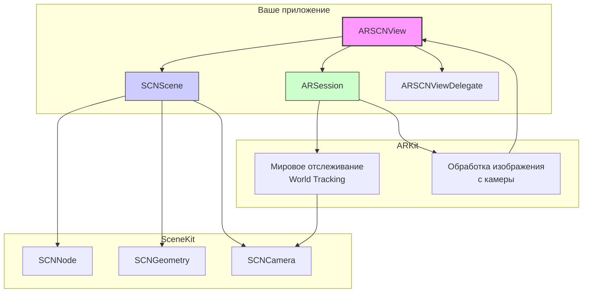

#arkit #scenekit #ar #augmented-reality #arscnview #3d #ios #apple

---
### Определение
**ARSCNView** — это специализированный класс во фреймворке ARKit, который интегрирует возможности дополненной реальности с графическим движком [[SceneKit]]. Он является подклассом `SCNView` и предоставляет простой способ создания AR-опытов, объединяющих виртуальный 3D-контент с камерой реального мира на устройстве .

`ARSCNView` автоматически управляет отображением живого видео с камеры в качестве фона сцены, синхронизирует координатные системы SceneKit с реальным миром и перемещает камеру SceneKit в соответствии с движением устройства .

### Важное примечание о статусе Deprecated
Начиная с iOS 19.0 (2026 год), класс **`ARSCNView` объявлен устаревшим (deprecated)** . Apple рекомендует использовать для новых проектов фреймворк **RealityKit** и его основной компонент — **`ARView`**. Однако огромное количество существующих проектов, туториалов и документации по-прежнему используют `ARSCNView`, поэтому понимание этого класса критически важно для поддержки легаси-кода и изучения основ ARKit .

### Зачем это знать iOS-разработчику?
1.  **Интеграция 3D-контента:** Позволяет легко добавлять трехмерные объекты в AR-сцену с помощью мощного инструментария SceneKit .
2.  **Автоматизация:** `ARSCNView` автоматически рендерит видеопоток с камеры как фон и синхронизирует виртуальную камеру с реальной .
3.  **Работа с геометрией:** SceneKit предоставляет удобные примитивы (сферы, кубы, плоскости) и инструменты для загрузки сложных 3D-моделей.
4.  **Hit-Testing и Raycasting:** Встроенные методы для поиска пересечений лучей с реальными объектами и виртуальными узлами .
5.  **Интеграция с Vision и Core ML:** Возможность получать 3D-координаты объектов, распознанных нейросетями в видеопотоке .

---

### Архитектура и ключевые компоненты



### Основные свойства

| Свойство | Тип | Описание |
|----------|-----|----------|
| `session` | `ARSession` | Объект AR-сессии, управляющий отслеживанием движения и обработкой изображения с камеры . |
| `scene` | `SCNScene` | SceneKit-сцена, содержащая все виртуальные объекты . |
| `delegate` | `ARSCNViewDelegate` | Делегат для синхронизации SceneKit-контента с AR-сессией . |
| `automaticallyUpdatesLighting` | `Bool` | Указывает, создает ли ARKit источники света в сцене на основе реального освещения . |
| `rendersCameraGrain` | `Bool` | Определяет, применяет ли SceneKit шум изображения к виртуальному контенту для большей реалистичности . |
| `rendersMotionBlur` | `Bool` | Включает/выключает размытие при движении . |

### Ключевые методы

#### Работа с узлами и анкорами
- `func anchor(for node: SCNNode) -> ARAnchor?` — возвращает AR-анкор, связанный с указанным SceneKit-узлом .
- `func node(for anchor: ARAnchor) -> SCNNode?` — возвращает SceneKit-узел, связанный с указанным AR-анкором .

#### Hit-Testing (устаревший) и Raycasting (современный)
- `func hitTest(_ point: CGPoint, types: ARHitTestResult.ResultType) -> [ARHitTestResult]` — **устаревший метод** поиска пересечений с реальными объектами (плоскостями, точками) .
- `func raycastQuery(from point: CGPoint, allowing target: ARRaycastQuery.Target, alignment: ARRaycastQuery.TargetAlignment) -> ARRaycastQuery?` — создает запрос для лучевого поиска (современный API) .

#### Проекции и координаты
- `func unprojectPoint(_ point: CGPoint, ontoPlane planeTransform: simd_float4x4) -> simd_float3?` — проецирует 2D-точку из экрана на плоскость в 3D-пространстве .
- `func unprojectPoint(_ point: float3) -> float3` — вспомогательный метод для преобразования экранных координат в мировые .

---

### Примеры от простого к сложному

#### Уровень 0: Настройка Info.plist и базового ViewController

```xml
<!-- Info.plist -->
<key>NSCameraUsageDescription</key>
<string>Для отображения объектов в дополненной реальности</string>
<key>UIRequiredDeviceCapabilities</key>
<array>
    <string>arkit</string>
</array>
```

```swift
import UIKit
import ARKit
import SceneKit

class ViewController: UIViewController {
    
    @IBOutlet var sceneView: ARSCNView!
    
    override func viewDidLoad() {
        super.viewDidLoad()
        sceneView.delegate = self
        sceneView.showsStatistics = true // Показывать статистику (FPS, время)
        sceneView.autoenablesDefaultLighting = true
        sceneView.automaticallyUpdatesLighting = true
    }
    
    override func viewWillAppear(_ animated: Bool) {
        super.viewWillAppear(animated)
        
        // Создаем конфигурацию сессии
        let configuration = ARWorldTrackingConfiguration()
        configuration.planeDetection = [.horizontal, .vertical]
        
        // Запускаем сессию
        sceneView.session.run(configuration)
    }
    
    override func viewWillDisappear(_ animated: Bool) {
        super.viewWillDisappear(animated)
        sceneView.session.pause()
    }
}

extension ViewController: ARSCNViewDelegate {
    // Методы делегата
}
```

#### Уровень 1: Добавление простого 3D-объекта в сцену

```swift
import UIKit
import ARKit
import SceneKit

class SimpleARViewController: UIViewController, ARSCNViewDelegate {
    
    @IBOutlet var sceneView: ARSCNView!
    
    override func viewDidLoad() {
        super.viewDidLoad()
        sceneView.delegate = self
        sceneView.autoenablesDefaultLighting = true
        sceneView.automaticallyUpdatesLighting = true
    }
    
    override func viewWillAppear(_ animated: Bool) {
        super.viewWillAppear(animated)
        
        let configuration = ARWorldTrackingConfiguration()
        sceneView.session.run(configuration)
    }
    
    override func viewWillDisappear(_ animated: Bool) {
        super.viewWillDisappear(animated)
        sceneView.session.pause()
    }
    
    override func viewDidAppear(_ animated: Bool) {
        super.viewDidAppear(animated)
        addCubeInFrontOfCamera()
    }
    
    func addCubeInFrontOfCamera() {
        // Создаем куб размером 0.1 x 0.1 x 0.1 метра
        let boxGeometry = SCNBox(width: 0.1, height: 0.1, length: 0.1, chamferRadius: 0)
        boxGeometry.firstMaterial?.diffuse.contents = UIColor.red
        
        let boxNode = SCNNode(geometry: boxGeometry)
        
        // Помещаем куб на расстоянии 0.5 метра от камеры
        boxNode.position = SCNVector3(0, 0, -0.5)
        
        // Добавляем в сцену
        sceneView.scene.rootNode.addChildNode(boxNode)
    }
}
```

#### Уровень 2: Размещение объектов на обнаруженных плоскостях

```swift
import UIKit
import ARKit
import SceneKit

class PlaneDetectionViewController: UIViewController, ARSCNViewDelegate {
    
    @IBOutlet var sceneView: ARSCNView!
    
    override func viewDidLoad() {
        super.viewDidLoad()
        sceneView.delegate = self
        sceneView.autoenablesDefaultLighting = true
        sceneView.debugOptions = [.showFeaturePoints, .showWorldOrigin] // Отладочная визуализация
    }
    
    override func viewWillAppear(_ animated: Bool) {
        super.viewWillAppear(animated)
        
        let configuration = ARWorldTrackingConfiguration()
        configuration.planeDetection = [.horizontal, .vertical] // Обнаружение горизонтальных и вертикальных плоскостей
        sceneView.session.run(configuration)
    }
    
    override func viewWillDisappear(_ animated: Bool) {
        super.viewWillDisappear(animated)
        sceneView.session.pause()
    }
    
    // MARK: - ARSCNViewDelegate
    func renderer(_ renderer: SCNSceneRenderer, didAdd node: SCNNode, for anchor: ARAnchor) {
        // Этот метод вызывается, когда обнаружена новая плоскость (ARPlaneAnchor)
        guard let planeAnchor = anchor as? ARPlaneAnchor else { return }
        
        // Создаем визуальное представление плоскости
        let planeNode = createPlaneNode(for: planeAnchor)
        node.addChildNode(planeNode)
    }
    
    func renderer(_ renderer: SCNSceneRenderer, didUpdate node: SCNNode, for anchor: ARAnchor) {
        // Обновляем плоскость при изменении ее размеров или положения
        guard let planeAnchor = anchor as? ARPlaneAnchor,
              let planeNode = node.childNodes.first else { return }
        
        updatePlaneNode(planeNode, for: planeAnchor)
    }
    
    private func createPlaneNode(for anchor: ARPlaneAnchor) -> SCNNode {
        // Создаем геометрию плоскости
        let planeGeometry = SCNPlane(width: CGFloat(anchor.extent.x), height: CGFloat(anchor.extent.z))
        
        // Полупрозрачный материал для визуализации плоскости
        let material = SCNMaterial()
        material.diffuse.contents = UIColor.blue.withAlphaComponent(0.3)
        planeGeometry.materials = [material]
        
        let planeNode = SCNNode(geometry: planeGeometry)
        
        // Плоскость в SceneKit горизонтальна по умолчанию, а ARKit использует вертикальные плоскости
        // Поэтому поворачиваем на -90 градусов вокруг X
        planeNode.eulerAngles.x = -.pi / 2
        planeNode.position = SCNVector3(anchor.center.x, 0, anchor.center.z)
        
        return planeNode
    }
    
    private func updatePlaneNode(_ node: SCNNode, for anchor: ARPlaneAnchor) {
        guard let planeGeometry = node.geometry as? SCNPlane else { return }
        
        // Обновляем размеры
        planeGeometry.width = CGFloat(anchor.extent.x)
        planeGeometry.height = CGFloat(anchor.extent.z)
        
        // Обновляем позицию
        node.position = SCNVector3(anchor.center.x, 0, anchor.center.z)
    }
    
    // Обработка касания для размещения объекта на плоскости
    override func touchesBegan(_ touches: Set<UITouch>, with event: UIEvent?) {
        guard let touch = touches.first else { return }
        let touchLocation = touch.location(in: sceneView)
        
        // Выполняем hit-test для поиска существующих плоскостей
        let hitTestResults = sceneView.hitTest(touchLocation, types: .existingPlaneUsingExtent)
        
        if let result = hitTestResults.first {
            // Получаем координаты точки касания в мировом пространстве
            let worldTransform = result.worldTransform
            let position = SCNVector3(worldTransform.columns.3.x,
                                      worldTransform.columns.3.y,
                                      worldTransform.columns.3.z)
            
            // Создаем сферу в месте касания
            let sphereGeometry = SCNSphere(radius: 0.03)
            sphereGeometry.firstMaterial?.diffuse.contents = UIColor.red
            let sphereNode = SCNNode(geometry: sphereGeometry)
            sphereNode.position = position
            
            sceneView.scene.rootNode.addChildNode(sphereNode)
        }
    }
}
```

#### Уровень 3: Получение 3D-координат объектов, распознанных Vision 

```swift
import UIKit
import ARKit
import SceneKit
import Vision

class VisionARViewController: UIViewController, ARSessionDelegate {
    
    @IBOutlet var sceneView: ARSCNView!
    private var vnRequest: VNCoreMLRequest?
    
    override func viewDidLoad() {
        super.viewDidLoad()
        
        sceneView.session.delegate = self
        setupVision()
    }
    
    override func viewWillAppear(_ animated: Bool) {
        super.viewWillAppear(animated)
        
        let configuration = ARWorldTrackingConfiguration()
        sceneView.session.run(configuration)
    }
    
    override func viewWillDisappear(_ animated: Bool) {
        super.viewWillDisappear(animated)
        sceneView.session.pause()
    }
    
    private func setupVision() {
        guard let modelURL = Bundle.main.url(forResource: "YOLOv3Tiny", withExtension: "mlmodelc"),
              let visionModel = try? VNCoreMLModel(for: MLModel(contentsOf: modelURL)) else {
            print("Не удалось загрузить модель Vision")
            return
        }
        
        vnRequest = VNCoreMLRequest(model: visionModel) { [weak self] request, error in
            if let error = error {
                print("Ошибка Vision: \(error)")
                return
            }
            
            guard let observations = request.results as? [VNRecognizedObjectObservation] else { return }
            self?.processVisionObservations(observations)
        }
        
        vnRequest?.imageCropAndScaleOption = .centerCrop
    }
    
    // MARK: - ARSessionDelegate
    func session(_ session: ARSession, didUpdate frame: ARFrame) {
        // Этот метод вызывается для каждого нового кадра с камеры
        guard let request = vnRequest else { return }
        
        // Настройки для Vision
        let options: [VNImageOption: Any] = [.cameraIntrinsics: frame.camera.intrinsics]
        let requestHandler = VNImageRequestHandler(cvPixelBuffer: frame.capturedImage,
                                                    orientation: .downMirrored,
                                                    options: options)
        
        try? requestHandler.perform([request])
    }
    
    private func processVisionObservations(_ observations: [VNRecognizedObjectObservation]) {
        DispatchQueue.main.async { [weak self] in
            guard let self = self else { return }
            
            for observation in observations {
                // Берем только объекты с высокой уверенностью
                guard let label = observation.labels.first,
                      label.confidence > 0.8 else { continue }
                
                // Получаем bounding box в координатах экрана
                guard let boundingBox = self.getBoundingBoxInView(from: observation) else { continue }
                
                // Находим центр bounding box
                let center = CGPoint(x: boundingBox.midX, y: boundingBox.midY)
                
                // Выполняем raycast для получения 3D-координат
                if let worldPosition = self.performRaycast(at: center) {
                    // Создаем метку в 3D-пространстве
                    self.addLabelNode(at: worldPosition, text: label.identifier)
                }
            }
        }
    }
    
    private func getBoundingBoxInView(from observation: VNRecognizedObjectObservation) -> CGRect? {
        guard let currentFrame = sceneView.session.currentFrame else { return nil }
        
        let viewportSize = sceneView.frame.size
        
        // Преобразуем bounding box из системы координат Vision в систему координат ARSCNView
        let transform = currentFrame.displayTransform(for: .portrait, viewportSize: viewportSize)
        let normalizedBoundingBox = observation.boundingBox.applying(transform)
        
        // Масштабируем к размеру вью
        let scaleTransform = CGAffineTransform(scaleX: viewportSize.width, y: viewportSize.height)
        return normalizedBoundingBox.applying(scaleTransform)
    }
    
    private func performRaycast(at point: CGPoint) -> SCNVector3? {
        // Создаем raycast query
        guard let query = sceneView.raycastQuery(from: point,
                                                  allowing: .estimatedPlane,
                                                  alignment: .any) else { return nil }
        
        // Выполняем raycast
        guard let result = sceneView.session.raycast(query).first else { return nil }
        
        // Извлекаем координаты из матрицы трансформации
        let translation = result.worldTransform.columns.3
        return SCNVector3(translation.x, translation.y, translation.z)
    }
    
    private func addLabelNode(at position: SCNVector3, text: String) {
        // Создаем текстовую геометрию
        let textGeometry = SCNText(string: text, extrusionDepth: 0.1)
        textGeometry.font = UIFont.systemFont(ofSize: 0.3)
        textGeometry.firstMaterial?.diffuse.contents = UIColor.white
        
        let textNode = SCNNode(geometry: textGeometry)
        textNode.position = position
        textNode.scale = SCNVector3(0.02, 0.02, 0.02) // Масштабируем текст
        
        // Поворачиваем текст лицом к камере (биллбординг)
        let billboardConstraint = SCNBillboardConstraint()
        billboardConstraint.freeAxes = [.all]
        textNode.constraints = [billboardConstraint]
        
        sceneView.scene.rootNode.addChildNode(textNode)
    }
}
```

#### Уровень 4: Загрузка и размещение 3D-модели из файла

```swift
import UIKit
import ARKit
import SceneKit

class ModelLoadingViewController: UIViewController, ARSCNViewDelegate {
    
    @IBOutlet var sceneView: ARSCNView!
    private var modelNode: SCNNode?
    
    override func viewDidLoad() {
        super.viewDidLoad()
        sceneView.delegate = self
        sceneView.autoenablesDefaultLighting = true
        sceneView.automaticallyUpdatesLighting = true
        
        // Добавляем жест для размещения модели
        let tapGesture = UITapGestureRecognizer(target: self, action: #selector(handleTap(_:)))
        sceneView.addGestureRecognizer(tapGesture)
    }
    
    override func viewWillAppear(_ animated: Bool) {
        super.viewWillAppear(animated)
        
        let configuration = ARWorldTrackingConfiguration()
        configuration.planeDetection = [.horizontal]
        sceneView.session.run(configuration)
    }
    
    override func viewWillDisappear(_ animated: Bool) {
        super.viewWillDisappear(animated)
        sceneView.session.pause()
    }
    
    @objc func handleTap(_ gesture: UITapGestureRecognizer) {
        let location = gesture.location(in: sceneView)
        
        // Ищем плоскости
        let hitTestResults = sceneView.hitTest(location, types: .existingPlaneUsingExtent)
        
        if let result = hitTestResults.first {
            let position = SCNVector3(result.worldTransform.columns.3.x,
                                      result.worldTransform.columns.3.y,
                                      result.worldTransform.columns.3.z)
            
            placeModel(at: position)
        }
    }
    
    private func placeModel(at position: SCNVector3) {
        // Если модель уже существует, удаляем старую
        modelNode?.removeFromParentNode()
        
        // Загружаем модель из файла .scn или .dae
        guard let modelURL = Bundle.main.url(forResource: "chair", withExtension: "scn"),
              let modelScene = try? SCNScene(url: modelURL, options: nil) else {
            print("Не удалось загрузить модель")
            return
        }
        
        modelNode = SCNNode()
        
        // Копируем все узлы из загруженной сцены
        for child in modelScene.rootNode.childNodes {
            modelNode?.addChildNode(child.clone())
        }
        
        // Устанавливаем позицию
        modelNode?.position = position
        
        // Масштабируем при необходимости
        modelNode?.scale = SCNVector3(0.1, 0.1, 0.1)
        
        // Добавляем в сцену
        if let node = modelNode {
            sceneView.scene.rootNode.addChildNode(node)
        }
    }
    
    // MARK: - ARSCNViewDelegate
    func renderer(_ renderer: SCNSceneRenderer, didAdd node: SCNNode, for anchor: ARAnchor) {
        // Визуализируем обнаруженные плоскости
        guard let planeAnchor = anchor as? ARPlaneAnchor else { return }
        
        let planeGeometry = SCNPlane(width: CGFloat(planeAnchor.extent.x),
                                      height: CGFloat(planeAnchor.extent.z))
        
        let material = SCNMaterial()
        material.diffuse.contents = UIColor.green.withAlphaComponent(0.3)
        planeGeometry.materials = [material]
        
        let planeNode = SCNNode(geometry: planeGeometry)
        planeNode.eulerAngles.x = -.pi / 2
        planeNode.position = SCNVector3(planeAnchor.center.x, 0, planeAnchor.center.z)
        
        node.addChildNode(planeNode)
    }
}
```

#### Уровень 5: Кастомный [[hitTest]] с детальным анализом 

```swift
import UIKit
import ARKit
import SceneKit

extension ARSCNView {
    
    struct FeatureHitTestResult {
        let position: float3
        let distanceToRayOrigin: Float
        let featureHit: float3
        let featureDistanceToHitResult: Float
    }
    
    func hitTestWithFeatures(at point: CGPoint, coneAngle: Float = 18.0, maxResults: Int = 1) -> [FeatureHitTestResult] {
        guard let frame = self.session.currentFrame,
              let ray = hitTestRayFromScreenPoint(point) else {
            return []
        }
        
        let features = frame.rawFeaturePoints?.points ?? []
        let maxAngle = (coneAngle / 2) * .pi / 180.0
        var results: [FeatureHitTestResult] = []
        
        for feature in features {
            let originToFeature = feature - ray.origin
            let distance = simd_length(originToFeature)
            
            // Вычисляем угол между лучом и направлением на точку
            let directionToFeature = simd_normalize(originToFeature)
            let dotProduct = simd_dot(ray.direction, directionToFeature)
            let angle = acos(min(1.0, max(-1.0, dotProduct)))
            
            // Проверяем, попадает ли точка в конус
            if angle > maxAngle { continue }
            
            // Находим точку на луче, ближайшую к feature point
            let projectionDistance = simd_dot(originToFeature, ray.direction)
            let hitPosition = ray.origin + ray.direction * projectionDistance
            let distanceToHit = simd_distance(hitPosition, feature)
            
            let result = FeatureHitTestResult(
                position: hitPosition,
                distanceToRayOrigin: distance,
                featureHit: feature,
                featureDistanceToHitResult: distanceToHit
            )
            results.append(result)
        }
        
        // Сортируем по расстоянию до луча
        results.sort { $0.distanceToRayOrigin < $1.distanceToRayOrigin }
        return Array(results.prefix(maxResults))
    }
    
    func hitTestRayFromScreenPoint(_ point: CGPoint) -> (origin: float3, direction: float3)? {
        guard let frame = self.session.currentFrame else { return nil }
        
        let camera = frame.camera
        let cameraPos = camera.transform.translation
        
        // Проецируем точку на дальнюю плоскость отсечения
        let farPoint = float3(Float(point.x), Float(point.y), 1.0)
        let farWorldPoint = self.unprojectPoint(farPoint)
        
        let direction = simd_normalize(farWorldPoint - cameraPos)
        return (origin: cameraPos, direction: direction)
    }
    
    func unprojectPoint(_ point: float3) -> float3 {
        return float3(self.unprojectPoint(SCNVector3(point)))
    }
}

extension float4x4 {
    var translation: float3 {
        return float3(columns.3.x, columns.3.y, columns.3.z)
    }
}
```

---

### ARSCNView vs RealityKit (современный подход)

| Характеристика         | ARSCNView (устаревший)            | ARView (RealityKit)             |
| ---------------------- | --------------------------------- | ------------------------------- |
| **Фреймворк**          | SceneKit + ARKit                  | RealityKit                      |
| **Статус**             | Deprecated (iOS 19+)              | Актуальный                      |
| **Производительность** | Хорошая                           | Отличная (оптимизирован для AR) |
| **Рендеринг**          | Metal (ограниченно) или OpenGL ES | [[Metal]] (полная поддержка)    |
| **Физика**             | SCNPhysicsBody                    | Встроенная физика RealityKit    |
| **Анимации**           | [[CAAnimation]], SCNAnimation     | Система анимаций RealityKit     |
| **Совместимость**      | Все [[iOS]] 11+ устройства        | iOS 13+                         |
| **Сложность**          | Выше (много ручной работы)        | Ниже (высокоуровневый API)      |

### Пример перехода с ARSCNView на RealityKit

```swift
// ARSCNView (старый способ)
class OldARViewController: UIViewController {
    @IBOutlet var sceneView: ARSCNView!
    
    func addCube() {
        let box = SCNBox(width: 0.1, height: 0.1, length: 0.1, chamferRadius: 0)
        let node = SCNNode(geometry: box)
        node.position = SCNVector3(0, 0, -0.5)
        sceneView.scene.rootNode.addChildNode(node)
    }
}

// RealityKit (новый способ)
import RealityKit
import ARKit

class NewARViewController: UIViewController {
    @IBOutlet var arView: ARView!
    
    func addCube() async {
        // Создаем модель куба
        let mesh = MeshResource.generateBox(size: 0.1)
        let material = SimpleMaterial(color: .red, isMetallic: false)
        let entity = ModelEntity(mesh: mesh, materials: [material])
        
        // Создаем якорь на расстоянии 0.5 метра
        let anchor = AnchorEntity(world: [0, 0, -0.5])
        anchor.addChild(entity)
        
        // Добавляем в сцену
        arView.scene.addAnchor(anchor)
    }
}
```

---

### Важные нюансы и Best Practices

#### 1. **Проверка поддержки ARKit**
Не все устройства поддерживают ARKit. Всегда проверяйте `ARConfiguration.isSupported` и добавляйте ключ `arkit` в `UIRequiredDeviceCapabilities` .

```swift
guard ARWorldTrackingConfiguration.isSupported else {
    showAlert("ARKit не поддерживается на этом устройстве")
    return
}
```

#### 2. **Управление сессией**
- Запускайте сессию в `viewWillAppear` и останавливайте в `viewWillDisappear` .
- Используйте соответствующие конфигурации (`ARWorldTrackingConfiguration`, `ARFaceTrackingConfiguration` и т.д.).

#### 3. **Отладка**
Используйте `debugOptions` для визуализации точек и сетки:

```swift
sceneView.debugOptions = [.showFeaturePoints, .showWorldOrigin]
```

#### 4. **Оптимизация производительности**
- Ограничьте количество полигонов в 3D-моделях.
- Используйте уровни детализации (LOD).
- Для анимированных моделей проверяйте частоту кадров (должно быть 60 FPS).

#### 5. **Миграция на RealityKit**
Для новых проектов используйте `ARView` вместо `ARSCNView`. RealityKit предлагает:
- Лучшую производительность.
- Интеграцию со SwiftUI.
- Более простой API.
- Встроенную поддержку физики и анимаций .

#### 6. **Обработка событий сессии**
Реализуйте делегат `ARSessionDelegate` для мониторинга состояния сессии:

```swift
func session(_ session: ARSession, didFailWithError error: Error) {
    // Обработка ошибок (например, потеря отслеживания)
}

func sessionWasInterrupted(_ session: ARSession) {
    // Сессия прервана (например, свернули приложение)
}

func sessionInterruptionEnded(_ session: ARSession) {
    // Сессия возобновлена
}
```

### Итог
**ARSCNView** — это мощный, но устаревший класс для создания AR-приложений с использованием SceneKit. Он автоматизирует множество сложных задач: рендеринг видео с камеры, синхронизацию виртуальной и реальной камер, управление освещением . 

Для поддержки легаси-проектов и изучения истории ARKit понимание `ARSCNView` остается важным. Однако для всех новых проектов Apple настоятельно рекомендует использовать **RealityKit** и **ARView**, которые предлагают более современный, производительный и удобный API .

Ключевые навыки работы с `ARSCNView`: управление AR-сессией, добавление и трансформация 3D-объектов, hit-testing для размещения объектов на реальных плоскостях, интеграция с Vision для распознавания объектов и получения их 3D-координат .