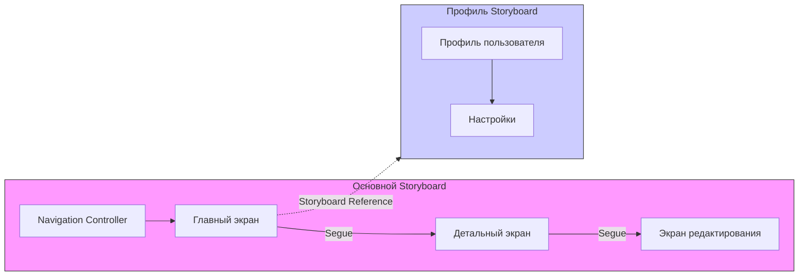

#xcode #interface-builder #storyboard #uikit #ios #ui #segue #navigation

---
### Определение
**Storyboard (раскадровка)** — это визуальный инструмент в среде разработки Xcode, который позволяет разработчикам проектировать пользовательский интерфейс приложения целиком, отображая не только отдельные экраны, но и связи (переходы) между ними. Storyboard представляет собой файл с расширением `.storyboard`, содержащий XML-описание всех экранов приложения, их элементов и навигационной структуры .

Storyboard был представлен Apple в 2011 году вместе с iOS 5 как эволюция XIB-файлов. В отличие от [[XIB]], который описывает один экран или компонент, Storyboard может содержать множество экранов ([[UIViewController]]) и переходы (`segue`) между ними, предоставляя целостное представление о потоке пользовательского интерфейса .

### Зачем это знать iOS-разработчику?
1.  **Визуализация навигации:** Storyboard позволяет увидеть всю структуру приложения и связи между экранами в одном месте.
2.  **Быстрое прототипирование:** Позволяет быстро создать работающий прототип с переходами между экранами без написания кода.
3.  **Упрощение разработки:** Многие задачи (переходы, передача данных) автоматизированы через segues.
4.  **Работа с существующими проектами:** Огромное количество приложений использует Storyboard, особенно проекты.
5.  **Визуальное редактирование:** Позволяет дизайнерам и разработчикам совместно работать над интерфейсом.

---

### Структура Storyboard

Storyboard — это XML-файл, который при открытии в Xcode отображается как визуальная канва. Основные компоненты:

#### 1. Сцены (Scenes)
Каждая сцена представляет собой экран приложения — обычно [[UIViewController]] (или его подкласс, например, [[UITableViewController]]). На канве сцены выглядят как прямоугольники, внутри которых располагаются UI-элементы.

#### 2. Контроллеры (View Controllers)
Каждая сцена связана с определенным классом контроллера. Это может быть стандартный `UIViewController` или кастомный класс, созданный разработчиком.

#### 3. Переходы (Segues)
Segue (от англ. "переход") — это визуальное представление перехода между двумя сценами. Segue определяет, как и когда происходит переход (по нажатию кнопки, свайпу или программно). Существует несколько типов segues:
- **Show (Push):** Для навигационных стеков (работает с [[UINavigationController]]).
- **Present Modally:** Модальный переход, когда новый экран появляется поверх текущего.
- **Show Detail (Replace):** Для split-контроллеров (например, на iPad).
- **Popover Presentation:** Для отображения всплывающих окон.
- **Custom:** Кастомный переход с собственной анимацией.

#### 4. Контроллеры-контейнеры (Container View Controllers)
Storyboard поддерживает встроенные контроллеры, такие как `UINavigationController`, `UITabBarController`, `UISplitViewController`. Их можно добавить на канву, и они автоматически создадут связи с дочерними контроллерами.

#### 5. Storyboard References (iOS 9+)
Позволяют разбивать большие Storyboard на логические модули, создавая ссылки на другие storyboard-файлы. Это улучшает производительность Xcode и упрощает командную работу.



---

### Основные компоненты Interface Builder для Storyboard

#### 1. Canvas (Канва)
Основное рабочее пространство, где располагаются сцены и создаются переходы.

#### 2. Document Outline (Структура документа)
Левая панель, показывающая иерархию всех объектов в Storyboard: контроллеры, вью, констрейнты и т.д.

#### 3. Inspector (Инспектор)
Правая панель для настройки свойств выбранного объекта:
- **Identity Inspector:** Класс контроллера или вью, storyboard ID.
- **Attributes Inspector:** Визуальные свойства (цвет фона, заголовок кнопки и т.д.).
- **Size Inspector:** Размеры и констрейнты [[Auto Layout]].
- **Connections Inspector:** Связи (outlets, actions, segues).

#### 4. Library (Библиотека)
Панель с элементами управления, которые можно перетаскивать на канву: кнопки, лейблы, контроллеры, жесты и т.д.

---

### Связи в Storyboard: Outlet, Action и Segue

#### Outlet ([[@IBOutlet]])
Ссылка на элемент интерфейса из кода. Позволяет управлять свойствами элемента (менять текст, скрывать и т.д.).

```swift
@IBOutlet weak var titleLabel: UILabel!
```

#### Action (`@IBAction`)
Метод, вызываемый при событии от элемента интерфейса (например, нажатие кнопки).

```swift
@IBAction func saveButtonTapped(_ sender: UIButton) {
    // Обработка нажатия
}
```

#### Segue (`UIStoryboardSegue`)
Объект, представляющий переход между контроллерами. Можно настроить подготовку к переходу в методе `prepare(for:sender:)`.

```swift
override func prepare(for segue: UIStoryboardSegue, sender: Any?) {
    if segue.identifier == "showDetail" {
        guard let detailVC = segue.destination as? DetailViewController else { return }
        detailVC.itemID = selectedItemID
    }
}
```

---

### Примеры использования Storyboard

#### Уровень 1: Создание простого приложения с навигацией

**Шаг 1: Создание проекта с Storyboard**
При создании нового проекта Xcode автоматически включает файл `Main.storyboard`.

**Шаг 2: Добавление Navigation Controller**
1.  Выделите существующий `ViewController` на канве.
2.  В меню Xcode выберите `Editor -> Embed In -> Navigation Controller`.
3.  Теперь перед вашим контроллером появится `Navigation Controller` с серой полосой навигации.

**Шаг 3: Добавление второго экрана**
1.  Перетащите новый `UIViewController` из библиотеки на канву.
2.  Разместите его справа от первого.

**Шаг 4: Создание перехода (Segue)**
1.  Зажмите `Ctrl` и перетащите от кнопки на первом экране к новому контроллеру.
2.  В появившемся меню выберите тип перехода, например, `Show`.

**Шаг 5: Настройка идентификатора перехода**
1.  Выделите созданную линию перехода (сегвей).
2.  В инспекторе атрибутов задайте `Identifier`, например, `goToDetail`.

**Шаг 6: Связывание элементов**
1.  Откройте Assistant Editor.
2.  Создайте `@IBOutlet` для лейбла на первом экране и `@IBAction` для кнопки (если нужно).
3.  Создайте `@IBOutlet` для лейбла на втором экране.

**Шаг 7: Передача данных**
В контроллере первого экрана реализуйте метод `prepare(for:sender:)`:

```swift
class FirstViewController: UIViewController {
    
    @IBOutlet weak var messageLabel: UILabel!
    let dataToSend = "Привет со первого экрана!"
    
    override func prepare(for segue: UIStoryboardSegue, sender: Any?) {
        if segue.identifier == "goToDetail" {
            guard let secondVC = segue.destination as? SecondViewController else { return }
            secondVC.receivedMessage = dataToSend
        }
    }
}
```

Во втором контроллере:

```swift
class SecondViewController: UIViewController {
    
    @IBOutlet weak var displayLabel: UILabel!
    var receivedMessage: String?
    
    override func viewDidLoad() {
        super.viewDidLoad()
        displayLabel.text = receivedMessage
    }
}
```

#### Уровень 2: Использование Tab Bar Controller

**Шаг 1:** Удалите существующий контроллер с канвы.
**Шаг 2:** Перетащите [[UITabBarController]] из библиотеки на канву.
**Шаг 3:** Xcode автоматически создаст два связанных контроллера (обычно [[UIViewController]]).
**Шаг 4:** Настройте иконки и заголовки вкладок через инспектор атрибутов каждого контроллера (свойство `Tab Bar Item`).
**Шаг 5:** При необходимости добавьте новые контроллеры и свяжите их с Tab Bar Controller через `Ctrl`+перетаскивание и выбор `view controllers` в секции `Relationship Segue`.

#### Уровень 3: Создание статической таблицы (Static Table View)
`UITableViewController` в Storyboard может быть настроен как "Static Cells". Это идеально для форм настроек или профиля.

1.  Перетащите `UITableViewController` на канву.
2.  В инспекторе атрибутов таблицы измените `Content` с `Dynamic Prototypes` на `Static Cells`.
3.  Теперь вы можете редактировать ячейки прямо на канве: добавлять секции, менять их количество, перетаскивать внутрь ячеек переключатели, текстовые поля и т.д.
4.  Создайте кастомный класс для этого контроллера и свяжите элементы через `@IBOutlet`.

#### Уровень 4: Использование Storyboard References (разделение на модули)

1.  Создайте новый Storyboard файл: `File -> New -> File... -> Storyboard`. Назовите его, например, `Profile.storyboard`.
2.  В `Profile.storyboard` создайте нужные экраны (например, профиль пользователя, настройки).
3.  Вернитесь в основной `Main.storyboard`.
4.  Перетащите из библиотеки `Storyboard Reference` и поместите его на канву.
5.  В инспекторе атрибутов укажите имя созданного storyboard файла (`Profile`).
6.  Теперь можно создать segue от кнопки на главном экране к этому `Storyboard Reference`. При переходе откроется начальный контроллер из `Profile.storyboard`.

#### Уровень 5: Кастомный segue с анимацией

```swift
import UIKit

class CustomSegue: UIStoryboardSegue {
    
    override func perform() {
        // Получаем доступ к исходному и целевому контроллерам
        guard let sourceView = source.view,
              let destinationView = destination.view else { return }
        
        // Настраиваем начальное положение целевого контроллера
        let screenWidth = UIScreen.main.bounds.width
        destinationView.transform = CGAffineTransform(translationX: screenWidth, y: 0)
        
        // Добавляем целевой контроллер как дочерний (для правильного жизненного цикла)
        source.addChild(destination)
        
        // Анимация перехода
        UIView.animate(withDuration: 0.5, delay: 0, options: .curveEaseInOut, animations: {
            sourceView.transform = CGAffineTransform(translationX: -screenWidth, y: 0)
            destinationView.transform = .identity
        }) { finished in
            // Завершаем переход
            source.present(destination, animated: false, completion: nil)
            sourceView.transform = .identity
            destination.removeFromParent()
        }
    }
}
```

В Storyboard выделите segue, в инспекторе атрибутов выберите `Custom` и укажите класс `CustomSegue`.

---

### Storyboard vs XIB vs Code

| Характеристика | Storyboard | XIB | Программная верстка (Code) |
|---|---|---|---|
| **Область применения** | Несколько экранов и переходы | Один экран или компонент | Полный контроль |
| **Визуализация навигации** | Отличная (видно все связи) | Отсутствует | Отсутствует |
| **Переиспользование** | Ограничено (можно через references) | Отличное для компонентов | Отличное через классы |
| **Контроль версий** | Плохой (большие XML-файлы) | Лучше, чем Storyboard | Отличный |
| **Производительность Xcode** | Медленнее при больших файлах | Быстрее | Не влияет |
| **Скорость разработки** | Высокая для простых UI | Высокая для компонентов | Ниже |
| **Гибкость** | Ограничена возможностями IB | Ограничена | Максимальная |

### Преимущества Storyboard

1.  **Визуализация потока:** Позволяет увидеть всю структуру приложения и навигацию между экранами .
2.  **Быстрое прототипирование:** Можно создать работающий прототип без написания кода .
3.  **Автоматические переходы:** Segue упрощают навигацию и передачу данных .
4.  **Визуальное редактирование Auto Layout:** Удобные инструменты для создания констрейнтов .
5.  **Поддержка Size Classes:** Позволяет проектировать интерфейсы для разных устройств и ориентаций в одном месте .
6.  **Storyboard References:** Позволяют разбивать большие проекты на модули .

### Недостатки Storyboard

1.  **Проблемы с Git:** XML-файлы сложно мержить, конфликты возникают часто .
2.  **Производительность Xcode:** Большие Storyboard могут тормозить при редактировании .
3.  **Скрытая логика:** Часть поведения (констрейнты, переходы) "спрятана" в файле, что затрудняет понимание кода .
4.  **Меньшая гибкость:** Некоторые вещи сложно реализовать в Storyboard (например, сложные кастомные переходы) .
5.  **Трудности при рефакторинге:** Переименование классов или удаление экранов может сломать связи в Storyboard .
6.  **Загрузка:** Весь Storyboard загружается в память при запуске (хотя это оптимизируется) .

---

### Best Practices

1.  **Разбивайте на модули:** Используйте Storyboard References для разделения приложения на логические части (авторизация, главный экран, профиль) .
2.  **Давайте осмысленные идентификаторы:** Всем segues, storyboard references и контроллерам задавайте понятные имена.
3.  **Не смешивайте подходы без необходимости:** Если вы используете Storyboard, старайтесь не добавлять вью программно без крайней необходимости.
4.  **Используйте Storyboard для описания потоков:** Storyboard отлично подходит для демонстрации потока экранов, но для сложных, переиспользуемых компонентов лучше использовать XIB или код.
5.  **Настройте Initial View Controller:** Всегда указывайте, какой контроллер является начальным (стрелка на канве).
6.  **Избегайте слишком больших Storyboard:** Если в файле больше 20-30 экранов, это сигнал к декомпозиции.
7.  **Используйте IBInspectable и IBDesignable:** Для кастомных компонентов, чтобы они отображались в Storyboard .
8.  **Храните Storyboard в системе контроля версий:** Не забывайте коммитить изменения, но будьте готовы к конфликтам.

### Распространенные ошибки

1.  **Забытые связи:** Если удалить outlet из кода, но оставить связь в Storyboard, приложение упадет с крашем.
2.  **Неправильный класс контроллера:** Убедитесь, что в Identity Inspector указан правильный кастомный класс.
3.  **Множественные segue от одного элемента:** Несколько переходов от одной кнопки могут вызвать путаницу.
4.  **Необработанный prepare(for:sender:):** Забыли передать данные в следующий контроллер.
5.  **Конфликты констрейнтов:** Storyboard показывает ошибки Auto Layout красными линиями — их нельзя игнорировать.

### Итог
**Storyboard** — это мощный инструмент визуального проектирования интерфейсов в iOS-разработке. Он предоставляет уникальную возможность видеть всю структуру приложения и связи между экранами, что ускоряет разработку и упрощает понимание проекта. Несмотря на недостатки (проблемы с Git, производительность), Storyboard остается популярным выбором для многих проектов, особенно на начальных этапах разработки. Умение эффективно работать со Storyboard — важный навык для любого iOS-разработчика.