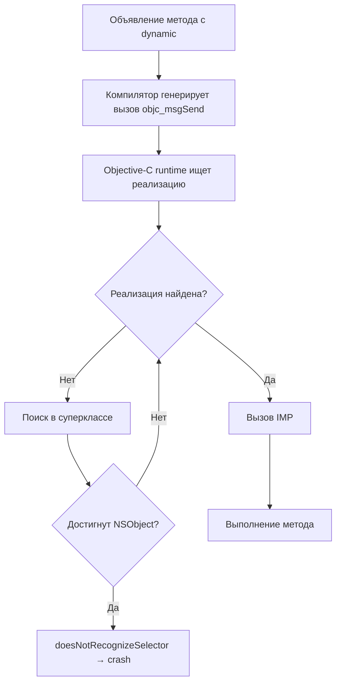

#swift #dynamic #objc #kvo #message-dispatch #objective-c #runtime #performance

---
### Определение
**`dynamic`** — это модификатор в [[Swift]], который включает **[[Message Dispatch]]** (динамическую диспетчеризацию через [[Objective-C]] [[Runtime]]) для методов, свойств или индексов. При использовании `dynamic` компилятор генерирует вызовы через `objc_msgSend`, что позволяет:

- Использовать **Key-Value Observing ([[KVO]])**
- Выполнять **Method [[Swizzling]]**
- Динамически заменять реализации методов во время выполнения
- Обеспечивать совместимость с Objective-C runtime

`dynamic` всегда подразумевает наличие `@objc`, так как для Message Dispatch требуется видимость в Objective-C runtime.

### Зачем это знать iOS-разработчику?
1.  **KVO (Key-Value Observing):** `dynamic` необходим для наблюдения за изменениями свойств .
2.  **Method Swizzling:** Только `dynamic` методы могут быть заменены во время выполнения .
3.  **[[Core Data]]:** Свойства в [[NSManagedObject]] обычно помечаются как `@NSManaged`, что подразумевает `dynamic` .
4.  **Objective-C совместимость:** Для использования Swift-кода в Objective-C или для работы с runtime .
5.  **Производительность:** `dynamic` вызовы медленнее (~10–20 нс), используйте только когда действительно нужно .

---

### dynamic vs @objc

| Характеристика | `@objc` | `dynamic` |
|----------------|---------|-----------|
| **Видимость в Obj-C** | Да | Да |
| **Тип диспетчеризации** | Table (обычно) | Message |
| **KVO** | Нет | Да |
| **Method Swizzling** | Нет | Да |
| **Скорость** | Средняя (~3–5 нс) | Медленная (~10–20 нс) |
| **Использование** | Для совместимости с Obj-C | Для динамических возможностей |

**Ключевое правило:** `@objc` делает метод видимым из Objective-C, но не меняет способ вызова. `dynamic` добавляет Message Dispatch и все связанные с ним динамические возможности .

---

### Синтаксис

#### 1. **Методы**

```swift
class MyClass {
    // Message Dispatch через Objective-C runtime
    @objc dynamic func dynamicMethod() {
        print("Dynamic dispatch")
    }
    
    // Table Dispatch (vtable)
    func tableMethod() {
        print("Table dispatch")
    }
}
```

#### 2. **Свойства**

```swift
class ObservableObject: NSObject {
    // KVO-совместимое свойство
    @objc dynamic var value: Int = 0
}
```

#### 3. **Индексы (subscripts)**

```swift
class DynamicCollection: NSObject {
    @objc dynamic subscript(index: Int) -> String {
        get { return "Item \(index)" }
        set { /* ... */ }
    }
}
```

---

### Когда используется dynamic

#### 1. **Key-Value Observing (KVO)**

```swift
import Foundation

class Person: NSObject {
    @objc dynamic var name: String
    @objc dynamic var age: Int
    
    init(name: String, age: Int) {
        self.name = name
        self.age = age
    }
}

class Observer: NSObject {
    var observation: NSKeyValueObservation?
    
    func observePerson(_ person: Person) {
        observation = person.observe(\.name, options: [.new]) { _, change in
            print("Name changed to: \(change.newValue ?? "")")
        }
    }
}

let person = Person(name: "Alice", age: 30)
let observer = Observer()
observer.observePerson(person)

person.name = "Bob"  // KVO срабатывает через Message Dispatch
```

#### 2. **Method Swizzling**

```swift
import UIKit

extension UIViewController {
    @objc dynamic func swizzled_viewDidLoad() {
        print("Swizzled viewDidLoad called")
        swizzled_viewDidLoad()  // вызывает оригинальный метод
    }
    
    static func swizzle() {
        let originalSelector = #selector(viewDidLoad)
        let swizzledSelector = #selector(swizzled_viewDidLoad)
        
        guard let originalMethod = class_getInstanceMethod(self, originalSelector),
              let swizzledMethod = class_getInstanceMethod(self, swizzledSelector) else {
            return
        }
        
        method_exchangeImplementations(originalMethod, swizzledMethod)
    }
}

// После swizzling все viewDidLoad будут логировать
UIViewController.swizzle()
```

#### 3. **Core Data**

```swift
import CoreData

class User: NSManagedObject {
    // NSManaged автоматически подразумевает dynamic поведение
    @NSManaged var name: String
    @NSManaged var email: String
}
```

#### 4. **Анимации и UIKit (исторически)**

```swift
// В старом коде (устарело, но встречается)
class CustomView: UIView {
    @objc dynamic func animate() {
        // ...
    }
}
```

---

### Как работает dynamic



**Ключевые компоненты:**
- **objc_msgSend:** Функция отправки сообщений Objective-C runtime
- **Selector (SEL):** Идентификатор метода
- **IMP (Implementation Pointer):** Указатель на реализацию
- **isa pointer:** Указатель на класс объекта

---

### Производительность

```swift
import Darwin

class PerformanceTest {
    // Table Dispatch
    func tableMethod() { }
    
    // Message Dispatch
    @objc dynamic func dynamicMethod() { }
}

func measure(_ name: String, iterations: Int, _ block: () -> Void) {
    let start = mach_absolute_time()
    for _ in 0..<iterations {
        block()
    }
    let end = mach_absolute_time()
    
    var info = mach_timebase_info()
    mach_timebase_info(&info)
    let elapsed = (end - start) * UInt64(info.numer) / UInt64(info.denom)
    let avg = Double(elapsed) / Double(iterations)
    print("\(name): \(String(format: "%.2f", avg)) нс")
}

let test = PerformanceTest()

measure("Table", iterations: 10_000_000) {
    test.tableMethod()
}

measure("dynamic", iterations: 10_000_000) {
    test.dynamicMethod()
}

// Примерный результат:
// Table: 3.5 нс
// dynamic: 15.2 нс
```

**Вывод:** `dynamic` вызовы примерно в **4–5 раз медленнее**, чем Table Dispatch.

---

### Правила использования

| Сценарий                      | Рекомендация                    | Альтернатива                                     |
| ----------------------------- | ------------------------------- | ------------------------------------------------ |
| **KVO**                       | ✅ Необходим                     | Combine (`@Published`, `ObservableObject`)       |
| **Method Swizzling**          | ✅ Только через dynamic          | Избегать в новом коде                            |
| **Core Data**                 | ✅ `@NSManaged` (аналог dynamic) | -                                                |
| **Горячие циклы**             | ❌ Избегать                      | [[Static Dispatch\|Static]] / [[Table Dispatch]] |
| **Новые Swift-проекты**       | ❌ Только при необходимости      | [[Combine]], [[SwiftUI]]                         |
| **Objective-C совместимость** | `@objc` (без dynamic)           | -                                                |

---

### dynamic vs @NSManaged

```swift
import CoreData

class Product: NSManagedObject {
    // @NSManaged — специальная форма dynamic для Core Data
    @NSManaged var name: String
    @NSManaged var price: Decimal
    
    // Обычный dynamic — для KVO в NSObject
    @objc dynamic var temporaryValue: String = ""
}
```

---

### Альтернативы dynamic в современном Swift

#### 1. **Combine для KVO**

```swift
import Combine

class ViewModel: ObservableObject {
    @Published var name: String = ""  // Combine Publisher
}

// Вместо KVO через dynamic
class Observer {
    private var cancellables = Set<AnyCancellable>()
    
    func observe(_ viewModel: ViewModel) {
        viewModel.$name
            .sink { newName in
                print("Name changed to: \(newName)")
            }
            .store(in: &cancellables)
    }
}
```

#### 2. **Swift Observation (iOS 17+)**

```swift
import Observation

@Observable
class Person {
    var name: String = ""  // Автоматическое наблюдение
}

// Использование
let person = Person()
withObservationTracking {
    print(person.name)
} onChange: {
    print("Name changed")
}
```

---

### Лучшие практики

#### 1. **Используйте Combine вместо KVO**

```swift
// ❌ Старый способ
class OldModel: NSObject {
    @objc dynamic var value: Int = 0
}

// ✅ Новый способ
class NewModel: ObservableObject {
    @Published var value: Int = 0
}
```

#### 2. **Избегайте Method Swizzling в новом коде**

```swift
// ❌ Не рекомендуется
extension UIViewController {
    @objc dynamic func swizzled_viewDidLoad() { }
}

// ✅ Используйте наследование или композицию
class BaseViewController: UIViewController {
    override func viewDidLoad() {
        super.viewDidLoad()
        customSetup()
    }
    
    func customSetup() { }
}
```

#### 3. **Ограничьте использование dynamic**

```swift
// ❌ Избыточно
class MyClass {
    @objc dynamic func process() { }  // KVO не нужен
}

// ✅ Достаточно Table Dispatch
class MyClass {
    func process() { }
}
```

---

### Короткое правило 2026

> **`dynamic`** — это ключ к динамическим возможностям Objective-C runtime.  
> Используйте только для **KVO**, **Method Swizzling** или **Core Data**.  
> В новом коде предпочитайте **Combine**, **Swift Observation** или **статическую диспетчеризацию**.

### Итог

**`dynamic`** в Swift:

1.  **Включает Message Dispatch** — вызовы через Objective-C runtime (~10–20 нс) .
2.  **Необходим для**:
    - Key-Value Observing (KVO)
    - Method Swizzling
    - Core Data (`@NSManaged`)
3.  **Всегда подразумевает `@objc`** — видимость в Objective-C .
4.  **Медленнее Table Dispatch** (~4–5×) — избегайте в горячих путях .
5.  **Альтернативы в современном Swift**:
    - Combine (`@Published`)
    - Swift Observation (`@Observable`)
    - Статическая диспетчеризация (`final`, `struct`)

Используйте `dynamic` только когда действительно нужны динамические возможности Objective-C runtime. В остальных случаях предпочитайте более быстрые и типобезопасные альтернативы .