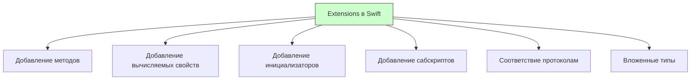

#swift #extensions #protocols #code-organization #uikit #swiftui

---
### Определение

**Extensions** — это мощный механизм в [[Swift]], который позволяет добавлять новую функциональность к существующим типам (классам, структурам, перечислениям, протоколам) без необходимости наследования или модификации исходного кода типа. Расширения не могут переопределять существующую функциональность, но могут добавлять новую.



---

### Зачем это знать iOS-разработчику?

| Сценарий | Почему важно |
|---|---|
| **Организация кода** | Разбивка больших классов на логические части |
| **Добавление удобных методов** | `String.isValidEmail`, `UIColor.hex(_:)`, `UIView.anchor(...)` |
| **Соответствие протоколам** | Добавление протокольной конформности без наследования |
| **Расширение стандартных типов** | Добавление функциональности к `String`, `Array`, `Int`, `UIView` и т.д. |
| **Улучшение читаемости** | Отделение приватной логики от публичного API |
| **Работа с Objective-C** | Расширения не могут переопределять методы Objective-C |

---

### Синтаксис

```swift
extension SomeType {
    // новая функциональность
}

extension SomeType: SomeProtocol {
    // реализация протокола
}

extension SomeType where Self: SomeProtocol {
    // условная функциональность
}
```

---

### Что можно добавлять в расширениях

| Что можно | Что нельзя |
|---|---|
| Вычисляемые свойства | Хранимые свойства |
| Методы экземпляра и типа | Переопределение методов |
| Инициализаторы | Деинициализаторы (`deinit`) |
| Сабскрипты | |
| Соответствие протоколам | |
| Вложенные типы | |

---

### Примеры от простого к сложному

#### 1. Базовое расширение — удобные методы для [[String]]

```swift
import UIKit

extension String {
    // Проверка email
    var isValidEmail: Bool {
        let emailRegex = "[A-Z0-9a-z._%+-]+@[A-Za-z0-9.-]+\\.[A-Za-z]{2,64}"
        let predicate = NSPredicate(format: "SELF MATCHES %@", emailRegex)
        return predicate.evaluate(with: self)
    }
    
    // Обрезание пробелов
    var trimmed: String {
        trimmingCharacters(in: .whitespacesAndNewlines)
    }
    
    // Подсчёт количества слов
    var wordCount: Int {
        components(separatedBy: .whitespacesAndNewlines)
            .filter { !$0.isEmpty }
            .count
    }
    
    // Проверка на пустоту после обрезки
    var isBlank: Bool {
        trimmed.isEmpty
    }
    
    // Добавление префикса
    func withPrefix(_ prefix: String) -> String {
        if hasPrefix(prefix) { return self }
        return prefix + self
    }
}

// Использование
print("test@example.com".isValidEmail) // true
print("   Hello   ".trimmed)           // "Hello"
print("Hello world".wordCount)         // 2
print("   ".isBlank)                   // true
print("world".withPrefix("Hello "))   // "Hello world"
```

#### 2. Расширение [[UIView]] — удобные методы для верстки

```swift
import UIKit

extension UIView {
    
    // Добавление нескольких subviews
    func addSubviews(_ views: UIView...) {
        views.forEach { addSubview($0) }
    }
    
    // Закругление углов с возможностью выбора
    func roundCorners(_ corners: UIRectCorner = .allCorners, radius: CGFloat) {
        let path = UIBezierPath(
            roundedRect: bounds,
            byRoundingCorners: corners,
            cornerRadii: CGSize(width: radius, height: radius)
        )
        let mask = CAShapeLayer()
        mask.path = path.cgPath
        layer.mask = mask
    }
    
    // Тень
    func applyShadow(
        color: UIColor = .black,
        opacity: Float = 0.3,
        offset: CGSize = CGSize(width: 0, height: 2),
        radius: CGFloat = 4
    ) {
        layer.shadowColor = color.cgColor
        layer.shadowOpacity = opacity
        layer.shadowOffset = offset
        layer.shadowRadius = radius
    }
    
    // Анимация пульсации
    func pulse(duration: TimeInterval = 0.5, scale: CGFloat = 1.05) {
        UIView.animate(withDuration: duration,
                       delay: 0,
                       options: [.autoreverse, .repeat]) {
            self.transform = CGAffineTransform(scaleX: scale, y: scale)
        }
    }
}

// Использование
let view = UIView()
view.addSubviews(label1, label2, button)
view.roundCorners([.topLeft, .topRight], radius: 12)
view.applyShadow(color: .black, opacity: 0.2)
view.pulse()
```

#### 3. Расширение [[UIColor]] — работа с HEX

```swift
import UIKit

extension UIColor {
    
    // Создание из HEX строки
    convenience init?(hex: String) {
        var hexSanitized = hex.trimmingCharacters(in: .whitespacesAndNewlines)
        hexSanitized = hexSanitized.replacingOccurrences(of: "#", with: "")
        
        var rgb: UInt64 = 0
        
        guard Scanner(string: hexSanitized).scanHexInt64(&rgb) else { return nil }
        
        let length = hexSanitized.count
        let r, g, b, a: CGFloat
        
        if length == 6 {
            r = CGFloat((rgb & 0xFF0000) >> 16) / 255.0
            g = CGFloat((rgb & 0x00FF00) >> 8) / 255.0
            b = CGFloat(rgb & 0x0000FF) / 255.0
            a = 1.0
        } else if length == 8 {
            r = CGFloat((rgb & 0xFF000000) >> 24) / 255.0
            g = CGFloat((rgb & 0x00FF0000) >> 16) / 255.0
            b = CGFloat((rgb & 0x0000FF00) >> 8) / 255.0
            a = CGFloat(rgb & 0x000000FF) / 255.0
        } else {
            return nil
        }
        
        self.init(red: r, green: g, blue: b, alpha: a)
    }
    
    // HEX строка
    var hexString: String {
        var r: CGFloat = 0
        var g: CGFloat = 0
        var b: CGFloat = 0
        var a: CGFloat = 0
        
        getRed(&r, green: &g, blue: &b, alpha: &a)
        
        let rgb = Int(r * 255) << 16 | Int(g * 255) << 8 | Int(b * 255) << 0
        return String(format: "#%06X", rgb)
    }
}

// Использование
let primaryColor = UIColor(hex: "#2C3E50")!
print(primaryColor.hexString) // #2C3E50
```

#### 4. Расширение [[Array]] — безопасный доступ

```swift
extension Array {
    // Безопасный доступ по индексу
    subscript(safe index: Int) -> Element? {
        indices.contains(index) ? self[index] : nil
    }
    
    // Удаление дубликатов (для Equatable)
    func removingDuplicates<T: Hashable>() -> [T] where Element == T {
        var seen = Set<T>()
        return filter { seen.insert($0).inserted }
    }
    
    // Получение элементов с определенным типом
    func compactMap<T>() -> [T] {
        compactMap { $0 as? T }
    }
}

// Использование
let numbers = [1, 2, 3, 4, 5]
print(numbers[safe: 10]) // nil

let duplicates = [1, 2, 2, 3, 3, 3]
print(duplicates.removingDuplicates()) // [1, 2, 3]

let mixed: [Any] = [1, "hello", 3.14, "world"]
print(mixed.compactMap() as [String]) // ["hello", "world"]
```

#### 5. Расширение с ограничениями ([[where]])

```swift
extension Array where Element: Equatable {
    // Проверка на дубликаты
    var containsDuplicates: Bool {
        Set(self).count != count
    }
    
    // Удаление первого вхождения
    mutating func removeFirstOccurrence(of element: Element) {
        guard let index = firstIndex(of: element) else { return }
        remove(at: index)
    }
    
    // Количество вхождений
    func countOccurrences(of element: Element) -> Int {
        filter { $0 == element }.count
    }
}

extension Collection where Element: Numeric {
    var sum: Element {
        reduce(0, +)
    }
}

// Использование
let array = [1, 2, 3, 4, 5]
print(array.sum) // 15

var duplicates = [1, 2, 2, 3, 3, 3]
print(duplicates.containsDuplicates) // true
duplicates.removeFirstOccurrence(of: 3)
print(duplicates) // [1, 2, 2, 3, 3]
```

#### 6. Расширение [[Optional]] — удобные методы

```swift
extension Optional {
    // Проверка на nil и выполнение
    func whenSome(_ closure: (Wrapped) -> Void) {
        if let value = self { closure(value) }
    }
    
    // Значение или fallback
    func or(_ defaultValue: Wrapped) -> Wrapped {
        self ?? defaultValue
    }
    
    // Преобразование с замыканием
    func mapOr<T>(_ defaultValue: T, _ transform: (Wrapped) -> T) -> T {
        self.map(transform) ?? defaultValue
    }
}

// Использование
let optionalString: String? = "Hello"
optionalString.whenSome { print($0) } // "Hello"
print(optionalString.or("Default"))    // "Hello"

let nilString: String? = nil
print(nilString.or("Default"))         // "Default"
```

#### 7. Расширение протокола — реализация по умолчанию

```swift
protocol Loggable {
    var logDescription: String { get }
}

extension Loggable {
    func log() {
        print("🔹 \(logDescription)")
    }
    
    func logError() {
        print("❌ \(logDescription)")
    }
}

// Использование
struct User: Loggable {
    let name: String
    let email: String
    
    var logDescription: String {
        "User(name: \(name), email: \(email))"
    }
}

let user = User(name: "Alice", email: "alice@example.com")
user.log()      // 🔹 User(name: Alice, email: alice@example.com)
user.logError() // ❌ User(name: Alice, email: alice@example.com)
```

#### 8. Расширение с вложенными типами

```swift
extension String {
    enum ValidationError: Error {
        case empty
        case tooShort(minLength: Int)
        case tooLong(maxLength: Int)
    }
    
    func validate(
        minLength: Int = 0,
        maxLength: Int = Int.max
    ) throws -> String {
        guard !isBlank else { throw ValidationError.empty }
        guard count >= minLength else { throw ValidationError.tooShort(minLength: minLength) }
        guard count <= maxLength else { throw ValidationError.tooLong(maxLength: maxLength) }
        return self
    }
}

// Использование
do {
    try "Hello".validate(minLength: 3, maxLength: 10)
} catch let error as String.ValidationError {
    switch error {
    case .empty: print("Пустая строка")
    case .tooShort(let min): print("Минимальная длина: \(min)")
    case .tooLong(let max): print("Максимальная длина: \(max)")
    }
}
```

#### 9. Расширение [[UIImage]] — загрузка и обработка

```swift
import UIKit

extension UIImage {
    
    // Создание из цвета
    convenience init?(color: UIColor, size: CGSize = CGSize(width: 1, height: 1)) {
        let renderer = UIGraphicsImageRenderer(size: size)
        let image = renderer.image { context in
            color.setFill()
            context.fill(CGRect(origin: .zero, size: size))
        }
        guard let cgImage = image.cgImage else { return nil }
        self.init(cgImage: cgImage)
    }
    
    // Изменение размера
    func resized(to size: CGSize) -> UIImage? {
        let renderer = UIGraphicsImageRenderer(size: size)
        return renderer.image { _ in
            draw(in: CGRect(origin: .zero, size: size))
        }
    }
    
    // Сжатие до целевого размера
    func compressed(maxSizeKB: Int) -> Data? {
        let maxBytes = maxSizeKB * 1024
        var compression: CGFloat = 1.0
        
        guard var data = jpegData(compressionQuality: compression) else { return nil }
        
        while data.count > maxBytes && compression > 0.1 {
            compression -= 0.1
            data = jpegData(compressionQuality: compression) ?? data
        }
        
        return data
    }
    
    // Круглое изображение
    var rounded: UIImage? {
        let size = CGSize(width: min(size.width, size.height), height: min(size.width, size.height))
        let renderer = UIGraphicsImageRenderer(size: size)
        return renderer.image { context in
            UIBezierPath(ovalIn: CGRect(origin: .zero, size: size)).addClip()
            draw(in: CGRect(origin: .zero, size: size))
        }
    }
}

// Использование
let colorImage = UIImage(color: .systemBlue)!
let resizedImage = colorImage.resized(to: CGSize(width: 100, height: 100))
```

#### 10. Расширение [[UIViewController]] — удобные алерты и навигация

```swift
import UIKit

extension UIViewController {
    
    // Показать алерт
    func showAlert(
        title: String,
        message: String,
        buttonTitle: String = "OK",
        style: UIAlertController.Style = .alert,
        completion: (() -> Void)? = nil
    ) {
        let alert = UIAlertController(title: title, message: message, preferredStyle: style)
        alert.addAction(UIAlertAction(title: buttonTitle, style: .default) { _ in
            completion?()
        })
        present(alert, animated: true)
    }
    
    // Показать алерт с выбором
    func showDecisionAlert(
        title: String,
        message: String,
        confirmTitle: String = "Да",
        cancelTitle: String = "Нет",
        onConfirm: @escaping () -> Void,
        onCancel: (() -> Void)? = nil
    ) {
        let alert = UIAlertController(title: title, message: message, preferredStyle: .alert)
        alert.addAction(UIAlertAction(title: cancelTitle, style: .cancel) { _ in
            onCancel?()
        })
        alert.addAction(UIAlertAction(title: confirmTitle, style: .default) { _ in
            onConfirm()
        })
        present(alert, animated: true)
    }
    
    // Показать индикатор загрузки
    func showLoading(title: String? = nil) {
        let alert = UIAlertController(title: nil, message: title ?? "Загрузка...", preferredStyle: .alert)
        let indicator = UIActivityIndicatorView(frame: CGRect(x: 10, y: 5, width: 50, height: 50))
        indicator.hidesWhenStopped = true
        indicator.style = .medium
        indicator.startAnimating()
        alert.view.addSubview(indicator)
        present(alert, animated: true)
    }
    
    func hideLoading() {
        dismiss(animated: true)
    }
}

// Использование
class MyViewController: UIViewController {
    func showMessage() {
        showAlert(title: "Привет", message: "Это алерт")
    }
    
    func askQuestion() {
        showDecisionAlert(
            title: "Удалить?",
            message: "Вы уверены?",
            onConfirm: {
                print("Удалено")
            }
        )
    }
}
```

#### 11. Расширение [[Date]] — форматирование и вычисления

```swift
import Foundation

extension Date {
    
    // Форматирование
    func formatted(style: DateFormatter.Style = .medium) -> String {
        let formatter = DateFormatter()
        formatter.dateStyle = style
        formatter.timeStyle = .short
        return formatter.string(from: self)
    }
    
    // ISO 8601
    var iso8601String: String {
        let formatter = ISO8601DateFormatter()
        return formatter.string(from: self)
    }
    
    // Начало дня
    var startOfDay: Date {
        Calendar.current.startOfDay(for: self)
    }
    
    // Разница в днях
    func daysBetween(_ date: Date) -> Int {
        Calendar.current.dateComponents([.day], from: self, to: date).day ?? 0
    }
    
    // Проверка, сегодня ли
    var isToday: Bool {
        Calendar.current.isDateInToday(self)
    }
    
    // Возраст из даты рождения
    var age: Int {
        Calendar.current.dateComponents([.year], from: self, to: Date()).year ?? 0
    }
}

// Использование
let date = Date()
print(date.formatted())           // "Jan 15, 2026 at 2:30 PM"
print(date.iso8601String)         // "2026-01-15T14:30:00Z"
print(date.isToday)               // true
```

#### 12. Расширение [[UIApplication]] — topViewController

```swift
import UIKit

extension UIApplication {
    
    // Получение текущего верхнего контроллера
    var topViewController: UIViewController? {
        guard let windowScene = connectedScenes.first as? UIWindowScene,
              let rootViewController = windowScene.windows.first(where: { $0.isKeyWindow })?.rootViewController else {
            return nil
        }
        return topViewController(from: rootViewController)
    }
    
    private func topViewController(from viewController: UIViewController) -> UIViewController? {
        if let tabBarController = viewController as? UITabBarController {
            return topViewController(from: tabBarController.selectedViewController ?? viewController)
        }
        if let navigationController = viewController as? UINavigationController {
            return topViewController(from: navigationController.topViewController ?? viewController)
        }
        if let presented = viewController.presentedViewController {
            return topViewController(from: presented)
        }
        return viewController
    }
}

// Использование
if let topVC = UIApplication.shared.topViewController {
    topVC.showAlert(title: "Привет", message: "Это верхний контроллер")
}
```

---

### Лучшие практики

| Практика | Почему |
|---|---|
| **Используйте осмысленные имена** | `isValidEmail` лучше, чем `checkEmail` |
| **Не добавляйте хранимые свойства** | Нельзя, используйте ассоциативные объекты |
| **Используйте `where` для ограничений** | Условная функциональность для конкретных типов |
| **Документируйте расширения** | Понятно, что делает метод |
| **Организуйте по файлам** | Одно расширение — один файл |
| **Избегайте дублирования** | Не дублируйте методы в разных расширениях |
| **Не переопределяйте существующие методы** | Расширения не могут переопределять |

---

### Расширения для протоколов

```swift
// Протокол с default реализацией
protocol Identifiable {
    var id: String { get }
}

extension Identifiable {
    func printId() {
        print("ID: \(id)")
    }
}

// Использование
struct Product: Identifiable {
    let id: String
}

let product = Product(id: "123")
product.printId() // ID: 123
```

---

### Короткое правило

> **Extensions** = добавляй новую функциональность без наследования.  
> **Нельзя** добавлять хранимые свойства и переопределять методы.  
> **Можно** добавлять методы, вычисляемые свойства, инициализаторы и соответствие протоколам.

---

### Итог

**Extensions** в Swift:

| Аспект | Значение |
|---|---|
| **Назначение** | Добавление функциональности к существующим типам |
| **Можно** | Методы, вычисляемые свойства, инициализаторы, сабскрипты, протоколы, вложенные типы |
| **Нельзя** | Хранимые свойства, переопределение, deinit |
| **Ограничения** | `where` для условной функциональности |
| **Когда использовать** | Всегда для организации кода и добавления удобных методов |

**Главное правило:**
> Используй extensions для организации кода и добавления удобных методов к стандартным типам. Не пытайся добавить хранимые свойства — используй ассоциативные объекты или обертки. Для условной функциональности используй `where`. Расширения — отличный способ сделать код чище и удобнее. В [[UIKit]] часто используют extensions для [[UIView]], [[UIColor]], [[UIViewController]] и других типов. В [[SwiftUI]] extensions полезны для `View`, `Color`, `Font`. Для протоколов extensions предоставляют default реализации. Всегда документируй свои расширения, чтобы другие разработчики понимали их назначение. Избегай дублирования методов в разных расширениях. Помни, что extensions не могут переопределять существующие методы — это делают через наследование или протоколы.