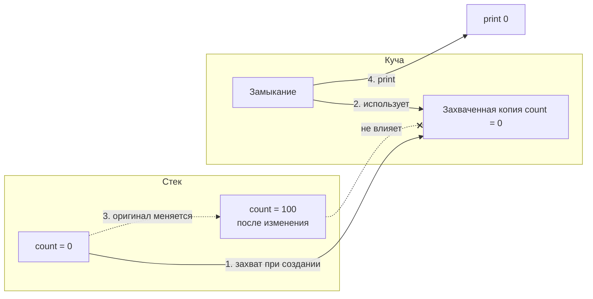

**Capture List** — это **список захвата** (capture list), который находится в квадратных скобках `[]` **перед параметрами** замыкания и определяет, **как именно** замыкание будет захватывать внешние переменные и [[self]].

Это один из самых важных механизмов безопасности в [[Swift]], потому что именно capture list помогает **предотвратить [[retain cycle]]** (замкнутый цикл сильных ссылок), который приводит к утечкам памяти.

### 1. Зачем нужен capture list (самые частые проблемы без него)

| Проблема без capture list                      | Что происходит                                               | Последствия                      | Как решает capture list               |
| ---------------------------------------------- | ------------------------------------------------------------ | -------------------------------- | ------------------------------------- |
| Замыкание захватывает `self` сильно            | `self` → closure → self удерживает друг друга                | [[Retain cycle]] → утечка памяти | `[weak self]` или `[unowned self]`    |
| Замыкание захватывает большую структуру/массив | Копия создаётся, даже если она не нужна                      | Лишнее потребление памяти        | `[weak self]` + опциональная проверка |
| Значение переменной меняется после захвата     | Замыкание хранит **старую копию** значения                   | Непредсказуемое поведение        | `[x]` — захват по значению            |
| Вызов на другом потоке / после deinit          | `self` уже уничтожен, но замыкание пытается его использовать | Crash (EXC_BAD_ACCESS)           | `[weak self]` + `guard let self`      |

### 2. Все варианты capture list (с актуальными рекомендациями 2026)

| Вариант захвата               | Синтаксис                      | Что происходит с памятью                     | Когда использовать (2026)                          | Самый безопасный паттерн         |
| ----------------------------- | ------------------------------ | -------------------------------------------- | -------------------------------------------------- | -------------------------------- |
| **[[Strong]]** (по умолчанию) | `{ [self] in ... }` или без [] | Сильная ссылка → retain cycle возможен       | Почти никогда — только если замыкание не escaping  | —                                |
| **[[Weak]]**                  | `{ [weak self] in ... }`       | Слабая ссылка → [[self]] может стать [[nil]] | **99% случаев** в escaping замыканиях              | `guard let self else { return }` |
| **[[Unowned]]**               | `{ [unowned self] in ... }`    | Не удерживает, но предполагает, что self жив | Когда точно знаешь, что self существует при вызове | Редко — опасно                   |
| **По значению**               | `{ [x, y] in ... }`            | Захватывает **текущее значение** переменной  | Когда нужно сохранить snapshot значения            | Очень часто для констант         |
| **Смешанный**                 | `{ [weak self, x, y] in ... }` | Комбинация weak + значение                   | Самый гибкий и рекомендуемый вариант               | Золотой стандарт                 |

### 3. Самый важный и рекомендуемый паттерн 2026 года

```swift
class ViewController: UIViewController {
    
    var counter = 0
    
    func startTimer() {
        Timer.scheduledTimer(withTimeInterval: 1.0, repeats: true) { [weak self] timer in
            guard let self else {
                timer.invalidate()           // Важно! Останавливаем таймер
                return
            }
            
            self.counter += 1
            print("Счётчик: \(self.counter)")
            
            if self.counter >= 10 {
                timer.invalidate()
            }
        }
    }
}
```

**Почему именно так**:
- `[weak self]` → нет retain cycle
- `guard let self else { ... }` → безопасный доступ к self (Swift 6+ требует явного unwrap)
- `timer.invalidate()` в случае nil → предотвращает вызовы после deinit

### 4. Полный разбор всех случаев (схемы и ловушки)

#### Случай 1: Захват по значению (очень полезно)

```swift
var count = 0

let closure = { [count] in          // захватываем текущее значение
    print("Count внутри closure: \(count)")
}

count = 100
closure()                           // выведет 0, а не 100
```

**Схема**:


#### Случай 2: `[weak self]` + `guard let self` (золотой стандарт)

```swift
class NetworkManager {
    var isActive = false
    
    func fetchData() {
        URLSession.shared.dataTask(with: url) { [weak self] data, _, error in
            guard let self else { return }
            
            self.isActive = false
            // безопасно работаем с self
        }.resume()
    }
}
```

#### Случай 3: `[unowned self]` — когда можно (и опасно)

```swift
class Parent {
    var child: Child?
    
    func startChildTask() {
        child = Child(parent: self)
        child?.start { [unowned self] in
            print(self.someProperty)  // safe, потому что parent живёт дольше
        }
    }
}

class Child {
    unowned let parent: Parent
    
    init(parent: Parent) { self.parent = parent }
    
    func start(completion: @escaping () -> Void) {
        // ...
        completion()
    }
}
```

**Опасность**: если `parent` уничтожится раньше — краш.

### 5. Лучшие практики capture list в Swift 2026

- **Правило №1**: в любом **escaping** замыкании — **всегда** `[weak self]`  
- **Правило №2**: после `[weak self]` — **всегда** `guard let self else { return }` (или `self?`)  
- **Правило №3**: захватывай **по значению** константы и неизменяемые данные: `[userID, timestamp]`  
- **Не пиши `[unowned self]`**, если не уверен на 100%, что объект живее замыкания  
- **Для нескольких объектов** — `[weak delegate, weak dataSource]`  
- **Swift 6 strict concurrency** — захват `[self]` (strong) требует, чтобы класс был `Sendable` или замыкание было на том же акторе  
- **Документируйте** — пиши комментарий «[weak self] — предотвращаем retain cycle в escaping closure»

**Короткий девиз 2026**:
> Capture list — это когда замыкание говорит: «я беру эти переменные снаружи, но вот как именно».  
> В 2026 году **золотое правило**: `[weak self]` + `guard let self` в каждом escaping замыкании.  
> `[unowned self]` — только если уверен в жизненном цикле.  
> Захват по значению `[x, y]` — когда нужно сохранить snapshot.
