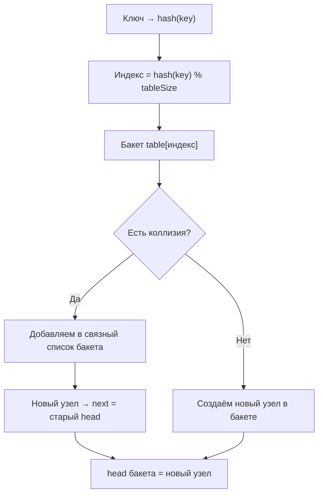

**Связанные списки в хеш-таблицах** (chaining, метод цепочек) — это классический и до сих пор один из самых понятных способов разрешения коллизий в хеш-таблицах.

В 2026 году он **не используется** в стандартной реализации [[Dictionary]] и [[Set]] в [[Swift]] (там применяется **open addressing** с quadratic probing и Robin Hood hashing), но остаётся важным для:

- понимания основ хеширования  
- учебных проектов  
- кастомных хеш-таблиц  
- ситуаций, когда нужна простота и предсказуемость (а не максимальная производительность)

### 1. Как именно работает chaining (схема и принцип)



**Ключевые моменты**:
- Каждый бакет — это **голова** односвязного списка (`Node?`)
- При коллизии новый элемент добавляется **в начало** списка (O(1))
- Поиск / удаление — линейный перебор списка в бакете (O(длина цепочки))
- Средняя длина цепочки при хорошем хеше ≈ **load factor** (α = count / capacity)

### 2. Полная, но понятная реализация chaining-хеш-таблицы (Swift 2026)

```swift
final class Node<Key: Hashable, Value> {
    let key: Key
    var value: Value
    var next: Node?
    
    init(key: Key, value: Value, next: Node? = nil) {
        self.key = key
        self.value = value
        self.next = next
    }
}

final class ChainingHashTable<Key: Hashable, Value> {
    private var buckets: [Node<Key, Value>?]
    private(set) var count = 0
    
    init(capacity: Int = 16) {
        precondition(capacity > 0, "Capacity must be positive")
        buckets = Array(repeating: nil, count: capacity)
    }
    
    private func index(for key: Key) -> Int {
        abs(key.hashValue) % buckets.count
    }
    
    // O(1) в среднем, O(n) в худшем
    func insert(_ key: Key, value: Value) {
        let idx = index(for: key)
        var current = buckets[idx]
        
        // Проверяем, есть ли ключ уже
        while let node = current {
            if node.key == key {
                node.value = value  // обновляем значение
                return
            }
            current = node.next
        }
        
        // Новый ключ — вставляем в голову
        let newNode = Node(key: key, value: value, next: buckets[idx])
        buckets[idx] = newNode
        count += 1
        
        // Можно добавить resize при load factor > 0.75
        if Double(count) / Double(buckets.count) > 0.75 {
            resize()
        }
    }
    
    func value(for key: Key) -> Value? {
        let idx = index(for: key)
        var current = buckets[idx]
        
        while let node = current {
            if node.key == key {
                return node.value
            }
            current = node.next
        }
        return nil
    }
    
    func remove(_ key: Key) {
        let idx = index(for: key)
        var current = buckets[idx]
        var previous: Node<Key, Value>? = nil
        
        while let node = current {
            if node.key == key {
                if let prev = previous {
                    prev.next = node.next
                } else {
                    buckets[idx] = node.next
                }
                count -= 1
                return
            }
            previous = node
            current = node.next
        }
    }
    
    private func resize() {
        let oldBuckets = buckets
        buckets = Array(repeating: nil, count: buckets.count * 2)
        count = 0
        
        for case let node? in oldBuckets {
            var current = node
            while let n = current {
                insert(n.key, value: n.value)
                current = n.next
            }
        }
    }
}
```

### 3. Плюсы и минусы chaining (реальная оценка 2026)

**Плюсы** (почему до сих пор используется в некоторых случаях):
- Очень простая реализация (особенно без resize)
- Удаление — O(1) в среднем (в отличие от open addressing)
- Нет «плохих» сценариев с длинными пробами
- Хорошо работает при высокой load factor (0.8–1.0)
- Легко реализовать потокобезопасность (lock на бакет)

**Минусы** (почему Swift выбрал [[open addressing]]):
- **Плохая локальность кэша** — узлы разбросаны по heap
- **Много аллокаций** — каждый Node — отдельный объект ([[ARC]] overhead)
- **Дольше работает** при большом количестве коллизий (O(n) в худшем)
- **Сложнее оптимизировать** под современные CPU (branch prediction, prefetching)

### 4. Сравнение chaining vs open addressing (Swift Dictionary)

| Характеристика                  | Chaining (Linked List)                     | Open Addressing (Swift Dict)               | Победитель в 2026 |
|---------------------------------|--------------------------------------------|---------------------------------------------|-------------------|
| Среднее время поиска            | O(1 + α)                                   | O(1) в среднем, хуже при высокой load       | Open addressing   |
| Худший случай                   | O(n)                                       | O(n) (очень редко)                          | Chaining стабильнее |
| Память                          | + overhead на каждый узел                  | Только массив бакетов                       | Open addressing   |
| Локальность кэша                | Плохая (разбросанные узлы)                 | Отличная (линейный массив)                  | Open addressing   |
| Удаление                        | Просто (перевязка указателей)              | Сложно (нужны tombstone или Robin Hood)     | Chaining проще    |
| Реализация в Swift              | Почти не используется                      | Основной метод в Dictionary / Set           | Open addressing   |

### 5. Когда стоит использовать chaining в 2026

- Учебные проекты / алгоритмы  
- Кастомные хеш-таблицы с потокобезопасностью (lock-free на бакет)  
- Когда важна **предсказуемость** (нет резких деградаций при плохом хеше)  
- Когда коллизий мало и load factor высокий  
- В ситуациях, где аллокации не критичны (маленькие таблицы)

### Короткий девиз 2026

> Chaining — это когда коллизии «навешиваются» в связный список в бакете.  
> Просто, надёжно, но **дорого по памяти** и **плохо по кэшу**.  
> Swift выбрал open addressing именно поэтому — лучше производительность и локальность.  
> Но понимание chaining **обязательно** для любого, кто хочет глубоко понять хеш-таблицы.
