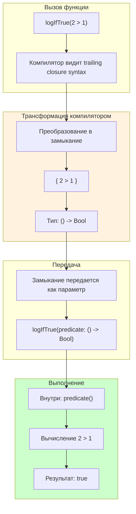

#swift #autoclosure #closures #lazy-evaluation #performance #language-features

---
### Определение
**`@autoclosure`** — это атрибут в [[Swift]], который автоматически оборачивает выражение в замыкание. Вместо того чтобы явно передавать замыкание `{ ... }`, можно передать обычное выражение, которое будет автоматически преобразовано в замыкание с этим выражением в теле .

`@autoclosure` позволяет сделать [[API]] более чистым и удобным, убирая необходимость в фигурных скобках при вызове функций, принимающих замыкания, особенно в случаях, когда замыкание представляет собой простое выражение.

### Зачем это знать [[iOS]]-разработчику?
1.  **Ленивое вычисление:** Выражение внутри `@autoclosure` не вычисляется до тех пор, пока замыкание не будет вызвано .
2.  **Улучшение читаемости кода:** Убирает лишние фигурные скобки при вызове функций.
3.  **Стандартные функции Swift:** `assert(condition:)`, `precondition(condition:)` и операторы `&&`, `||` используют `@autoclosure`.
4.  **Создание удобных API:** Позволяет писать функции, которые выглядят как встроенные конструкции языка.
5.  **Производительность:** Вычисление выражения может быть отложено до момента реальной необходимости.

---

### Базовый синтаксис

#### Без `@autoclosure`

```swift
func logIfTrue(_ predicate: () -> Bool) {
    if predicate() {
        print("True")
    }
}

logIfTrue({ 2 > 1 })  // Требует явного замыкания
```

#### С `@autoclosure`

```swift
func logIfTrue(_ predicate: @autoclosure () -> Bool) {
    if predicate() {
        print("True")
    }
}

logIfTrue(2 > 1)  // Выражение автоматически оборачивается в замыкание
```

---

### Как это работает



**Ключевой момент:** Выражение внутри `@autoclosure` **не вычисляется** в момент вызова функции. Оно вычисляется **только при вызове** полученного замыкания.

---

### Ленивое вычисление ([[Lazy]] Evaluation)

#### Пример: Дорогое выражение

```swift
func expensiveOperation() -> Bool {
    print("Дорогая операция выполнена")
    return true
}

func logIfTrue(_ predicate: @autoclosure () -> Bool) {
    print("Функция вызвана")
    // predicate не вызван здесь
    if predicate() {
        print("True")
    }
}

logIfTrue(expensiveOperation())

// Вывод:
// Функция вызвана
// Дорогая операция выполнена
// True
```

**Важно:** `expensiveOperation()` не выполняется до тех пор, пока внутри функции не будет вызвано `predicate()`.

#### Пример с несколькими параметрами

```swift
func and(_ left: Bool, _ right: @autoclosure () -> Bool) -> Bool {
    if !left { return false }
    return right()
}

let result = and(false, expensiveOperation())
print(result)  // false

// Вывод:
// expensiveOperation() НЕ вызывается, так как left == false
```

---

### Использование в стандартной библиотеке Swift

#### 1. **`assert(condition:message:file:line:)`**

```swift
assert(2 > 1, "Это сообщение не покажется")
```

Если бы `condition` не был `@autoclosure`, нужно было бы писать `assert({ 2 > 1 })`.

#### 2. **`precondition(condition:message:file:line:)`**

```swift
precondition(index >= 0, "Index out of bounds")
```

#### 3. **Логические операторы `&&` и `||`**

```swift
// Оператор && использует short-circuit evaluation
let result = false && expensiveOperation()  // expensiveOperation не вызывается
```

---

### `@autoclosure` и `@escaping`

По умолчанию замыкания с `@autoclosure` являются **неэкранирующими (non-escaping)** — они должны быть вызваны до завершения функции. Если нужно сохранить замыкание для последующего использования, добавьте `@escaping`.

```swift
var storedClosure: (() -> Bool)?

// ❌ Ошибка: @autoclosure без escaping не может быть сохранен
func storePredicate(_ predicate: @autoclosure () -> Bool) {
    storedClosure = predicate  // Compilation error
}

// ✅ Правильно: с @escaping
func storePredicate(_ predicate: @autoclosure @escaping () -> Bool) {
    storedClosure = predicate
}
```

---

### `@autoclosure` с разными типами

#### 1. **Возвращающие значение**

```swift
func provideDefault<T>(_ value: @autoclosure () -> T) -> T {
    return value()
}

let number = provideDefault(42)        // 42
let text = provideDefault("Hello")     // "Hello"
```

#### 2. **Генерирующие ошибку**

```swift
func checkCondition(_ condition: @autoclosure () throws -> Bool) rethrows {
    if try condition() {
        print("Condition met")
    }
}

checkCondition(2 > 1)  // Condition met
```

#### 3. **С несколькими параметрами**

```swift
func coalesce<T>(_ value: T?, _ defaultValue: @autoclosure () -> T) -> T {
    return value ?? defaultValue()
}

let optional: String? = nil
let result = coalesce(optional, "Default")  // "Default"
```

---

### Создание удобных API

#### Пример: Функция `measure` для бенчмарков

```swift
func measure(_ name: String, _ block: @autoclosure () -> Void) {
    let start = CFAbsoluteTimeGetCurrent()
    block()
    let end = CFAbsoluteTimeGetCurrent()
    print("\(name): \(String(format: "%.4f", (end - start) * 1000)) ms")
}

measure("Sleep", usleep(100_000))
// Sleep: 100.1234 ms
```

#### Пример: Валидатор с ленивыми сообщениями

```swift
struct Validator {
    static func require(
        _ condition: @autoclosure () -> Bool,
        message: @autoclosure () -> String
    ) {
        if !condition() {
            fatalError(message())
        }
    }
}

Validator.require(age >= 18, message: "Возраст должен быть не менее 18")
// Сообщение вычисляется только при ошибке
```

---

### Производительность и `@autoclosure`

```swift
func computeHeavy() -> Int {
    print("Heavy computation")
    return 42
}

func useAutoclosure(_ value: @autoclosure () -> Int) {
    print("Function called")
    let result = value()  // Только здесь вычисляется
    print(result)
}

func useDirect(_ value: Int) {
    print("Function called")
    print(value)
}

// @autoclosure: heavy не вычисляется до вызова
useAutoclosure(computeHeavy())
// Вывод:
// Function called
// Heavy computation
// 42

// Direct: heavy вычисляется перед вызовом
useDirect(computeHeavy())
// Вывод:
// Heavy computation
// Function called
// 42
```

---

### Ограничения

1.  **Выражение должно быть валидным Swift-выражением**, не содержащим управляющих конструкций (`if`, `guard`, `for` и т.д.).

```swift
// ❌ Ошибка: невалидное выражение
validate({ if condition { return true } else { return false } }())

// ✅ Правильно: вынести в замыкание вручную
validate { if condition { return true } else { return false } }
```

2.  **Не поддерживает [[async]]/[[await]]** напрямую.

3.  **По умолчанию non-escaping** — нужно явно добавлять `@escaping` при необходимости.

---

### Лучшие практики

#### 1. **Используйте для коротких, простых выражений**

```swift
// ✅ Хорошо
assert(isValid, "Invalid state")

// ❌ Плохо — лучше вынести в отдельное замыкание
assert({
    let result = longComputation()
    return result.isValid
}(), "Invalid")
```

#### 2. **Не злоупотребляйте в публичных API**

Слишком частое использование `@autoclosure` может сделать код менее понятным для других разработчиков.

#### 3. **Документируйте ленивое поведение**

```swift
/// Проверяет условие и выполняет действие.
/// - Parameters:
///   - condition: Выражение, проверяемое на истинность. Вычисляется лениво.
///   - action: Действие, выполняемое при истинном условии. Вычисляется лениво.
func when(_ condition: @autoclosure () -> Bool, 
          then action: @autoclosure () -> Void) {
    if condition() {
        action()
    }
}
```

---

### Короткое правило

> **`@autoclosure`** автоматически оборачивает выражение в замыкание, откладывая его вычисление до вызова.  
> Используйте для ленивых выражений, чтобы улучшить читаемость и производительность.  
> Не применяйте для сложных выражений или в публичных API без необходимости.

### Итог

**`@autoclosure`** в Swift:

1.  **Автоматически преобразует выражение в замыкание** — не нужно писать `{ ... }`.
2.  **Обеспечивает ленивое вычисление** — выражение выполняется только при вызове замыкания.
3.  **Используется в стандартной библиотеке** — `assert`, `precondition`, `&&`, `||`.
4.  **По умолчанию non-escaping** — для сохранения нужно добавить `@escaping`.
5.  **Улучшает читаемость API** — делает вызовы похожими на встроенные конструкции.

Понимание `@autoclosure` помогает писать более выразительные и эффективные API, особенно в случаях, где важна ленивая инициализация или короткое замыкание (short-circuit evaluation) .