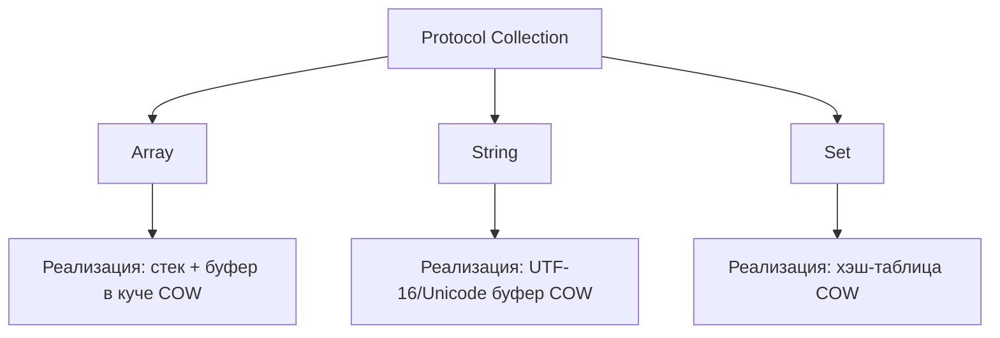

**`Collection`** — это базовый протокол для всех последовательностей элементов в [[Swift]], который расширяет **[[protocol Sequence]]** и добавляет возможности доступа по индексу, подсчёта количества элементов и безопасной итерации.

> Проще говоря: `Collection` = «любая упорядоченная последовательность элементов, доступная по индексу».

---

## 🔹 1. Основные термины

| Термин                      | Описание                                                                             |
| --------------------------- | ------------------------------------------------------------------------------------ |
| **Element**                 | Тип элемента коллекции (`Collection.Element`)                                        |
| **Index**                   | Тип индекса для доступа к элементам (может отличаться от Int, например у LinkedList) |
| **startIndex / endIndex**   | Границы коллекции для итерации                                                       |
| **Subscript**               | Доступ к элементам через `collection[index]`                                         |
| **count**                   | Количество элементов в коллекции                                                     |
| **Mutable / Immutable**     | Можно изменять коллекцию (`var`) или нет (`let`)                                     |
| **Indices**                 | Диапазон всех индексов коллекции                                                     |
| **first / last**            | Первый и последний элемент коллекции                                                 |
| **Sequence**                | `Collection` наследует протокол `Sequence`, поэтому поддерживает `for-in` и `map`    |
| **[[Copy-On-Write]] (COW)** | Оптимизация для массивов и строк: буфер может быть общий до модификации              |

---

## 🔹 2. Основной синтаксис

```swift
let array: [Int] = [1, 2, 3]
let set: Set<String> = ["A", "B", "C"]

func printCollection<C: Collection>(_ collection: C) {
    for element in collection {
        print(element)
    }
}
```

- Протокол `Collection` **обобщённый**: поддерживает любой тип `Element`
    
- Все массивы, строки, словари, множества в Swift соответствуют `Collection`
    

---

## 🔹 3. Минимальные требования для реализации Collection

Чтобы свой тип соответствовал `Collection`, нужно реализовать:

1. Типы:
    
    ```swift
    associatedtype Element
    associatedtype Index: Comparable
    ```
    
2. Свойства:
    
    ```swift
    var startIndex: Index { get }
    var endIndex: Index { get }
    ```
    
3. Методы:
    
    ```swift
    func index(after i: Index) -> Index
    subscript(position: Index) -> Element { get }
    ```
    

- После этого вы автоматически получаете:
    
    - [[for-in]] циклы
        
    - [[map]], [[filter]], [[reduce]]
        
    - Свойства `first`, `last`, `count` (через default реализацию)
        

---

## 🔹 4. Примеры

### Пример 1. [[Array]] как Collection

```swift
let numbers = [10, 20, 30]
print(numbers.startIndex) // 0
print(numbers.endIndex)   // 3
print(numbers[numbers.startIndex]) // 10
```

- `Array` реализует `Collection`, поэтому `startIndex` и `endIndex` доступны
    
- Индексы массива — это `Int`
    

---

### Пример 2. Строка как Collection

```swift
let text = "Hello"
for index in text.indices {
    print(text[index])
}
// H e l l o
```

- [[String]] тоже Collection, но **индексы не Int**, а `String.Index`
    
- Безопасно для юникода и сложных символов
    

---

### Пример 3. Свой тип Collection

```swift
struct SimpleRange: Collection {
    var start: Int
    var end: Int
    
    var startIndex: Int { start }
    var endIndex: Int { end }
    
    func index(after i: Int) -> Int {
        return i + 1
    }
    
    subscript(position: Int) -> Int {
        return position
    }
}

let range = SimpleRange(start: 1, end: 5)
for i in range {
    print(i) // 1 2 3 4
}
```

- Создали свою **коллекцию**, которая поддерживает `for-in`
    

---

### Пример 4. Collection и операции высшего порядка

```swift
let numbers = [1, 2, 3, 4, 5]
let doubled = numbers.map { $0 * 2 }
let evens = numbers.filter { $0 % 2 == 0 }
let sum = numbers.reduce(0, +)

print(doubled) // [2, 4, 6, 8, 10]
print(evens)   // [2, 4]
print(sum)     // 15
```

- Все методы доступны благодаря тому, что `Collection` наследует `Sequence`
    

---

## 🔹 5. Под капотом: как разные коллекции реализуют Collection

- `Collection` **определяет контракт доступа по индексу**, а не конкретное хранение
    
- Массивы, строки, словари и множества имеют **разные реализации индексов и хранения**, но conforming к Collection позволяет использовать их одинаково
    



- **Array**: struct на stack с указателем на heap buffer, copy-on-write при изменении
    
- **String**: аналогично Array, но индекс = `String.Index`, поддерживает Unicode
    
- **Set**: hash table, индекс = специальный внутренний тип, порядок не гарантирован
    

---

## 🔹 6. Особенности Collection

1. Все коллекции имеют **startIndex / endIndex**
    
2. Индексы **не обязательно Int**
    
3. Поддерживает **итерацию, map, filter, reduce, first, last, count**
    
4. Может быть **mutable или immutable**
    
5. Наследует **Sequence**, поэтому совместима со всеми методами Sequence
    
6. Позволяет писать **обобщённый код**, работающий с массивами, строками, словарями, сетами и пользовательскими коллекциями
    
7. Copy-On-Write: массивы и строки могут делить буфер до модификации
    

---

## 🔹 7. Итог

- **Collection** = базовый протокол для всех упорядоченных последовательностей
    
- Позволяет работать **с элементами по индексу**, безопасно итерировать и использовать высшего порядка функции
    
- Обеспечивает **унифицированный интерфейс** для разных коллекций, скрывая внутреннюю реализацию
    
- Позволяет писать **обобщённый код**, совместимый с любыми коллекциями Swift
    

---
