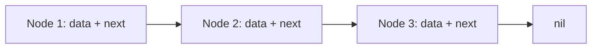

#data-structures #linked-list #swift #algorithms #interview #performance #memory

---
### Определение

**Связный список (Linked List)** — это линейная структура данных, в которой элементы (узлы) хранятся в **непрерывном блоке памяти**, а связаны между собой **ссылками (указателями)**. В отличие от массива, где элементы расположены в памяти последовательно, узлы связного списка могут находиться в любых местах памяти, а порядок определяется ссылками.



В 2025–2026 годах связные списки в реальных [[iOS]]-приложениях используются **очень редко** как самостоятельная структура ([[Array]] почти всегда эффективнее). Но они остаются **важной темой** для:

- **Собеседований** (Apple, Google, Meta и др.)
- **Алгоритмических задач** (LeetCode, HackerRank)
- **Понимания основ структур данных** (указатели, ссылки, управление памятью)
- **Реализации низкоуровневых структур** (LRU Cache, Undo/Redo, очереди с приоритетом)

---

### Зачем это знать iOS-разработчику?

| Причина                           | Объяснение                                                     |
| --------------------------------- | -------------------------------------------------------------- |
| **Алгоритмические собеседования** | 80% технических интервью содержат задачи на связные списки     |
| **Понимание ссылочных типов**     | Linked List — идеальный пример reference semantics в [[Swift]] |
| **Оптимизация редких сценариев**  | Вставка/удаление в начало — O(1) против O(n) у массива         |
| **Базовые структуры**             | Реализация LRU Cache, Deque, очередей                          |
| **Углублённое понимание Swift**   | [[ARC]], [[retain cycle]]s, [[weak]]/[[unowned]] ссылки        |

---

## 1. Основные виды связных списков в Swift

| Вид списка | Особенности хранения | Сложность операций | Когда реально используют в 2026 |
|---|---|---|---|
| **Односвязный (Singly Linked)** | каждый узел → только `next` | Доступ: O(n), вставка/удаление в начало: O(1) | Алгоритмические задачи, LRU Cache (иногда) |
| **Двусвязный (Doubly Linked)** | каждый узел → `next` и `prev` | Доступ: O(n), вставка/удаление: O(1) при наличии указателя | Реализация Deque, LRU Cache, Undo/Redo |
| **Циклический (Circular)** | последний узел → на первый | — | Кольцевые буферы, планировщики задач (редко) |
| **С заглушкой (Sentinel / Dummy nodes)** | фиктивные узлы в начале и/или конце | Упрощает код вставки/удаления | Очень часто в задачах LeetCode |

---

## 2. Реализация односвязного списка (2026 стиль)

### 2.1. Узел списка

```swift
// MARK: - Узел односвязного списка
final class ListNode<T> {
    var value: T
    var next: ListNode<T>?
    
    init(_ value: T) {
        self.value = value
    }
}

// MARK: - Расширение для Equatable (полезно для тестов)
extension ListNode: Equatable where T: Equatable {
    static func == (lhs: ListNode<T>, rhs: ListNode<T>) -> Bool {
        return lhs.value == rhs.value && lhs.next === rhs.next
    }
}
```

### 2.2. Полная реализация списка

```swift
// MARK: - Односвязный список
final class LinkedList<T> {
    // MARK: - Private properties
    private(set) var head: ListNode<T>?
    private(set) var tail: ListNode<T>?
    private(set) var count: Int = 0
    
    // MARK: - Computed properties
    var isEmpty: Bool { head == nil }
    var first: T? { head?.value }
    var last: T? { tail?.value }
    
    // MARK: - Initialization
    init() {}
    
    init(array: [T]) {
        for element in array {
            append(element)
        }
    }
    
    // MARK: - O(1) добавление в конец
    func append(_ value: T) {
        let newNode = ListNode(value)
        
        if let tail {
            tail.next = newNode
            self.tail = newNode
        } else {
            head = newNode
            tail = newNode
        }
        count += 1
    }
    
    // MARK: - O(1) добавление в начало
    func prepend(_ value: T) {
        let newNode = ListNode(value)
        newNode.next = head
        head = newNode
        
        if tail == nil {
            tail = newNode
        }
        count += 1
    }
    
    // MARK: - O(n) вставка по индексу
    func insert(_ value: T, at index: Int) {
        guard index >= 0 && index <= count else {
            fatalError("Index out of range")
        }
        
        if index == 0 {
            prepend(value)
            return
        }
        
        if index == count {
            append(value)
            return
        }
        
        var current = head
        for _ in 0..<index - 1 {
            current = current?.next
        }
        
        let newNode = ListNode(value)
        newNode.next = current?.next
        current?.next = newNode
        count += 1
    }
    
    // MARK: - O(n) удаление по значению
    func remove(_ value: T) where T: Equatable {
        guard var current = head else { return }
        
        // Удаление головы
        if current.value == value {
            head = current.next
            if head == nil { tail = nil }
            count -= 1
            return
        }
        
        // Удаление остальных
        while let next = current.next {
            if next.value == value {
                current.next = next.next
                if next.next == nil { tail = current }
                count -= 1
                return
            }
            current = next
        }
    }
    
    // MARK: - O(n) удаление по индексу
    func remove(at index: Int) -> T? {
        guard index >= 0 && index < count else { return nil }
        
        if index == 0 {
            let value = head?.value
            head = head?.next
            if head == nil { tail = nil }
            count -= 1
            return value
        }
        
        var current = head
        for _ in 0..<index - 1 {
            current = current?.next
        }
        
        let value = current?.next?.value
        current?.next = current?.next?.next
        if current?.next == nil { tail = current }
        count -= 1
        
        return value
    }
    
    // MARK: - O(1) очистка
    func removeAll() {
        head = nil
        tail = nil
        count = 0
    }
    
    // MARK: - O(n) доступ по индексу
    func node(at index: Int) -> ListNode<T>? {
        guard index >= 0 && index < count else { return nil }
        
        var current = head
        for _ in 0..<index {
            current = current?.next
        }
        return current
    }
    
    subscript(index: Int) -> T? {
        return node(at: index)?.value
    }
}

// MARK: - Sequence conformance для итерации
extension LinkedList: Sequence {
    func makeIterator() -> LinkedListIterator<T> {
        return LinkedListIterator(current: head)
    }
}

struct LinkedListIterator<T>: IteratorProtocol {
    var current: ListNode<T>?
    
    mutating func next() -> T? {
        defer { current = current?.next }
        return current?.value
    }
}

// MARK: - CustomStringConvertible
extension LinkedList: CustomStringConvertible where T: CustomStringConvertible {
    var description: String {
        var result = "["
        var current = head
        while let node = current {
            result += node.value.description
            if node.next != nil { result += ", " }
            current = node.next
        }
        result += "]"
        return result
    }
}
```

### 2.3. Пример использования

```swift
let list = LinkedList<String>()
list.append("A")
list.append("B")
list.append("C")
list.prepend("Start")
list.insert("Middle", at: 2)

print(list)  // [Start, A, Middle, B, C]
print(list.first ?? "nil")  // Start
print(list.last ?? "nil")   // C
print(list[2] ?? "nil")     // Middle

list.remove("B")
print(list)  // [Start, A, Middle, C]

for value in list {
    print("Iterating: \(value)")
}
```

---

## 3. Реализация двусвязного списка (для LRU Cache)

```swift
// MARK: - Узел двусвязного списка
final class DoublyListNode<T> {
    var value: T
    var prev: DoublyListNode<T>?
    var next: DoublyListNode<T>?
    
    init(_ value: T) {
        self.value = value
    }
}

// MARK: - Двусвязный список
final class DoublyLinkedList<T> {
    private(set) var head: DoublyListNode<T>?
    private(set) var tail: DoublyListNode<T>?
    private(set) var count: Int = 0
    
    var isEmpty: Bool { head == nil }
    
    // O(1) добавление в конец
    func append(_ value: T) -> DoublyListNode<T> {
        let newNode = DoublyListNode(value)
        
        if let tail {
            tail.next = newNode
            newNode.prev = tail
            self.tail = newNode
        } else {
            head = newNode
            tail = newNode
        }
        
        count += 1
        return newNode
    }
    
    // O(1) добавление в начало
    func prepend(_ value: T) -> DoublyListNode<T> {
        let newNode = DoublyListNode(value)
        
        if let head {
            head.prev = newNode
            newNode.next = head
            self.head = newNode
        } else {
            head = newNode
            tail = newNode
        }
        
        count += 1
        return newNode
    }
    
    // O(1) удаление узла (если известен указатель)
    func remove(node: DoublyListNode<T>) {
        let prev = node.prev
        let next = node.next
        
        if let prev = prev {
            prev.next = next
        } else {
            head = next
        }
        
        if let next = next {
            next.prev = prev
        } else {
            tail = prev
        }
        
        node.prev = nil
        node.next = nil
        count -= 1
    }
    
    // O(1) перемещение узла в конец
    func moveToLast(node: DoublyListNode<T>) {
        guard node !== tail else { return }
        
        // Извлекаем узел
        let prev = node.prev
        let next = node.next
        
        if let prev = prev {
            prev.next = next
        } else {
            head = next
        }
        
        if let next = next {
            next.prev = prev
        }
        
        // Вставляем в конец
        node.prev = tail
        node.next = nil
        tail?.next = node
        tail = node
        
        if head == nil { head = node }
    }
    
    // O(1) удаление последнего
    func removeLast() -> T? {
        guard let tail = tail else { return nil }
        let value = tail.value
        remove(node: tail)
        return value
    }
    
    // O(1) удаление первого
    func removeFirst() -> T? {
        guard let head = head else { return nil }
        let value = head.value
        remove(node: head)
        return value
    }
}
```

---

## 4. Реализация LRU Cache (двусвязный список + словарь)

```swift
// MARK: - LRU Cache (Least Recently Used)
final class LRUCache<Key: Hashable, Value> {
    private let capacity: Int
    private var cache: [Key: DoublyListNode<(key: Key, value: Value)>] = [:]
    private let list = DoublyLinkedList<(key: Key, value: Value)>()
    
    init(capacity: Int) {
        self.capacity = capacity
    }
    
    func get(_ key: Key) -> Value? {
        guard let node = cache[key] else { return nil }
        
        // Перемещаем узел в конец (самый свежий)
        list.moveToLast(node: node)
        return node.value.value
    }
    
    func put(_ key: Key, value: Value) {
        if let existingNode = cache[key] {
            // Обновляем существующий ключ
            existingNode.value = (key: key, value: value)
            list.moveToLast(node: existingNode)
            return
        }
        
        // Добавляем новый элемент
        if cache.count >= capacity {
            // Удаляем самый старый (из головы)
            if let oldest = list.removeFirst() {
                cache.removeValue(forKey: oldest.key)
            }
        }
        
        let node = list.append((key: key, value: value))
        cache[key] = node
    }
    
    var count: Int { cache.count }
}

// Использование
let lru = LRUCache<String, String>(capacity: 2)
lru.put("a", value: "1")
lru.put("b", value: "2")
print(lru.get("a") ?? "nil")  // "1"
lru.put("c", value: "3")      // вытесняет "b"
print(lru.get("b") ?? "nil")  // nil
```

---

## 5. Сравнение LinkedList vs Array (реальность 2026)

| Операция | Array (Contiguous) | LinkedList (Singly) | Победитель в реальных приложениях |
|---|---|---|---|
| **Доступ по индексу** | O(1) | O(n) | **Array** |
| **Добавление в конец** | O(1) амортизировано | O(1) с tail | **Ничья** (Array часто быстрее из-за кэша) |
| **Добавление в начало** | O(n) (сдвиг) | O(1) | **LinkedList** (но редко нужно) |
| **Удаление с начала** | O(n) | O(1) | **LinkedList** |
| **Удаление по значению** | O(n) | O(n) | **Ничья** |
| **Вставка в середину** | O(n) (сдвиг) | O(n) (поиск) | **Ничья** |
| **Память** | непрерывная, компактная | разрозненная + overhead (2 указателя) | **Array** (лучше кэш-память) |
| **Итерация** | очень быстрая (кэш-френдли) | медленнее (промахи кэша) | **Array** |
| **Copy-on-Write** | ✅ | ❌ (reference type) | **Array** |

### Производительность: реальные цифры

```swift
import Foundation

// 1 млн элементов
let array = Array(0..<1_000_000)
let list = LinkedList(array: Array(0..<1_000_000))

// Доступ по индексу (Array побеждает)
// Array[500_000] → ~0.0001 мс
// List[500_000] → ~5-10 мс (в 50 000 раз медленнее)

// Добавление в начало
// array.insert(0, at: 0) → ~100-200 мс (сдвиг)
// list.prepend(0) → ~0.001 мс

// Итерация по всем элементам
// array.forEach → ~10-20 мс
// list.forEach → ~30-50 мс
```

**Вывод**: В реальных iOS-приложениях 2025–2026 LinkedList почти никогда не используется вместо `Array`.

---

## 6. Основные места, где LinkedList всё ещё встречается

| Сценарий | Причина | Частота использования |
|---|---|---|
| **Алгоритмические задачи (LeetCode)** | Классические задачи на указатели | **Очень часто** |
| **Технические собеседования** | Проверка понимания ссылочных типов | **Очень часто** |
| **LRU Cache** | Двусвязный список + словарь | **Иногда** |
| **Undo/Redo** | Хранение истории с ограничением | **Редко** (обычно массив) |
| **Низкоуровневые структуры в Core Foundation / Metal** | Специфические требования | **Очень редко** |
| **Deque (двусторонняя очередь)** | Реализация в `swift-collections` | **Под капотом** |

---

## 7. Альтернативы LinkedList в production

| Библиотека / Тип                             | Что под капотом                             | Когда использовать           |
| -------------------------------------------- | ------------------------------------------- | ---------------------------- |
| **`Array`**                                  | Непрерывный буфер ([[Copy-On-Write\|COW]])  | **99% случаев**              |
| **`Deque`** из swift-collections             | Кольцевой буфер или двусвязный список       | Двусторонние очереди         |
| **`OrderedDictionary`** из swift-collections | Хэш-таблица + массив                        | Сохранение порядка вставки   |
| **`NSCache`**                                | [[Reference type]] + автоматическая очистка | Кэширование объектов         |
| **`IndexSet`**                               | Битовая карта индексов                      | Хранение диапазонов индексов |

```swift
import Collections

// Deque — эффективная двусторонняя очередь
var deque: Deque<Int> = [1, 2, 3, 4, 5]
deque.prepend(0)   // O(1)
deque.append(6)    // O(1)
deque.popFirst()   // O(1)
deque.popLast()    // O(1)

// OrderedDictionary — словарь с порядком вставки
var dict: OrderedDictionary<String, Int> = ["a": 1, "b": 2]
dict["c"] = 3      // порядок: a, b, c
```

---

## 8. Решение классических задач на связные списки (LeetCode)

### 8.1. Reverse Linked List (Разворот списка)

```swift
func reverseList<T>(_ head: ListNode<T>?) -> ListNode<T>? {
    var prev: ListNode<T>? = nil
    var current = head
    
    while let cur = current {
        let next = cur.next
        cur.next = prev
        prev = cur
        current = next
    }
    
    return prev
}
```

### 8.2. Detect Cycle (Обнаружение цикла — алгоритм Флойда)

```swift
func hasCycle<T>(_ head: ListNode<T>?) -> Bool {
    var slow = head
    var fast = head
    
    while fast?.next != nil {
        slow = slow?.next
        fast = fast?.next?.next
        
        if slow === fast {
            return true
        }
    }
    
    return false
}
```

### 8.3. Find Middle (Поиск середины)

```swift
func middleNode<T>(_ head: ListNode<T>?) -> ListNode<T>? {
    var slow = head
    var fast = head
    
    while fast?.next != nil {
        slow = slow?.next
        fast = fast?.next?.next
    }
    
    return slow
}
```

---

## 9. Лучшие практики при работе со связными списками в Swift 2026

1.  **Никогда не реализуй LinkedList вручную для хранения данных в приложении** — используй `Array`.
2.  **Используй `ListNode` только в задачах на алгоритмы и собеседованиях.**
3.  **Для LRU Cache** — стандартная реализация в Swift 5.5+ это двусвязный список + словарь.
4.  **В production чаще используют `Deque` из swift-collections** (двусвязный список под капотом).
5.  **Swift 6 strict concurrency** — если делаешь свой LinkedList, делай его `@unchecked Sendable` или `actor`.
6.  **Документируйте** — пиши комментарий: «Singly Linked List — используется только для алгоритмической задачи».

```swift
// Swift 6: Sendable для LinkedList
final class LinkedList<T: Sendable>: @unchecked Sendable {
    // ...
}
```

---

### Короткий девиз 2026

> **Linked List** — это **учебная** структура данных: отлична для понимания указателей, но в реальном iOS-приложении почти всегда проигрывает `Array`.  
> Используй её только на собеседованиях, в LeetCode и для LRU Cache.  
> В production → `Array`, `Deque`, `NSCache`, `OrderedDictionary`.

---

### Итог

**Связный список (Linked List)** в Swift:

| Вид | Сложность | Применение |
|---|---|---|
| **Односвязный** | Доступ O(n), вставка/удаление в начало O(1) | Алгоритмические задачи |
| **Двусвязный** | Доступ O(n), вставка/удаление O(1) | LRU Cache, Deque |
| **Циклический** | — | Кольцевые буферы |

**Ключевые выводы:**
- В реальных приложениях **почти никогда не используй LinkedList**
- `Array` быстрее, компактнее, кэш-френдли
- LinkedList нужен для **понимания указателей** и **алгоритмических задач**
- Альтернативы в production: `Array`, `Deque`, `OrderedDictionary`, `NSCache`

Понимание связных списков необходимо для прохождения технических собеседований и глубокого понимания структур данных, но в повседневной iOS-разработке они почти не встречаются.