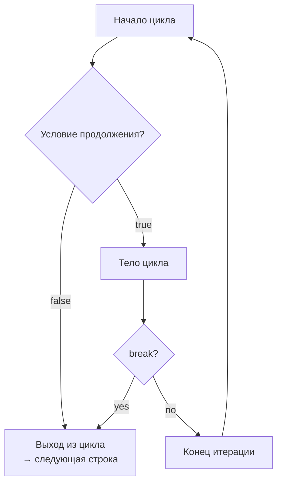

**`break`** — это оператор **управления потоком выполнения** в [[Swift]], который **немедленно прерывает** выполнение ближайшего цикла или оператора `switch` и передаёт управление на первую строку кода после него.

Это один из самых простых, но очень мощных инструментов для раннего выхода из итераций или ветвлений, когда дальнейшее выполнение теряет смысл.

### 1. Где и когда используется `break` (2026 актуальные сценарии)

| Конструкция                  | Когда `break` срабатывает                    | Самый частый сценарий 2026                               | Альтернатива (когда лучше не использовать `break`)   |
| ---------------------------- | -------------------------------------------- | -------------------------------------------------------- | ---------------------------------------------------- |
| [[for-in]]                   | Прерывает весь цикл                          | Нашли нужный элемент → дальше искать не нужно            | `first(where:)` / `contains(where:)`                 |
| [[while]] / [[repeat-while]] | Прерывает цикл (включая бесконечные)         | Достигли нужного условия → выходим из цикла              | `guard` + `return` в функции                         |
| [[switch]]                   | Досрочно завершает выполнение текущего case  | Выполнили нужную логику → не нужно проверять fallthrough | Почти никогда — в Swift `break` в switch редко нужен |
| Вложенные циклы              | С меткой (`label`) прерывает конкретный цикл | Нашли совпадение → выходим из обоих/всех циклов          | `return` или `throw` из функции                      |

### 2. Полный разбор всех вариантов использования (схемы + примеры)

#### Вариант 1: Обычный `break` в `for-in` (самый частый)

```swift
let users = ["Alice", "Bob", "Charlie", "David"]

for name in users {
    if name == "Charlie" {
        print("Нашли Charlie → выходим из цикла")
        break
    }
    print("Проверяем: \(name)")
}
// Вывод:
// Проверяем: Alice
// Проверяем: Bob
// Нашли Charlie → выходим из цикла
```

**Схема**:


#### Вариант 2: `break` в `while` / `repeat-while` (бесконечные циклы)

```swift
var attempt = 0
let maxAttempts = 5

while true {
    attempt += 1
    print("Попытка \(attempt)")
    
    if attempt >= maxAttempts {
        print("Достигнут лимит попыток")
        break
    }
    
    // симуляция неудачной попытки
    if attempt < 3 { continue }
    
    print("Успех!")
    break
}
```

#### Вариант 3: `break` в `switch` — почти никогда не нужен

```swift
let number = 2

switch number {
case 1:
    print("Один")
case 2:
    print("Два")
    // break здесь НЕ нужен — Swift автоматически выходит из case
case 3:
    print("Три")
default:
    print("Другое")
}
```

**Важно**: в Swift `switch` **не требует** `break` в конце каждого `case` (в отличие от C/Java).  
`break` в `switch` нужен только если вы хотите **досрочно выйти** из case до конца его тела (очень редкий случай).

#### Вариант 4: `break` с меткой (label) — выход из вложенных циклов

```swift
outer: for i in 1...5 {
    print("Внешний цикл: \(i)")
    
    for j in 1...5 {
        print("  Внутренний: \(j)")
        
        if i == 3 && j == 4 {
            print("Нашли комбинацию 3×4 → выходим из обоих циклов")
            break outer  // ← выход из внешнего цикла
        }
    }
}
```

Без метки `break` прервал бы только внутренний цикл.

### 3. Когда `break` лучше заменить на другие конструкции (современный стиль 2026)

| Ситуация                                        | Старый стиль с `break`            | Современный стиль (рекомендуется)                | Почему лучше                |
| ----------------------------------------------- | --------------------------------- | ------------------------------------------------ | --------------------------- |
| Найти первый элемент, удовлетворяющий условию   | `for` + `if` + `break`            | `first(where:)`                                  | Коротко, безопасно, читаемо |
| Проверить наличие элемента                      | `for` + `if found { break }`      | `contains(where:)`                               | Одна строка                 |
| Обработать элементы до первого [[nil]] / ошибки | `for` + `guard` + `break`         | `prefix(while:)` или `compactMap`                | Функциональный стиль        |
| Ранний выход из функции                         | `for` + `if` + `break` + `return` | `return` сразу из функции                        | Меньше вложенности          |
| Обработка всех элементов до условия             | `for` + `if` + `break`            | `prefix(while:)` или `take(while:)` (в Swift 6+) | Более декларативно          |

Пример замены:

```swift
// Старый стиль
var found: String?
for name in names {
    if name.hasPrefix("A") {
        found = name
        break
    }
}

// Новый стиль (рекомендуется 2026)
let found = names.first { $0.hasPrefix("A") }
```

### 4. Лучшие практики `break` в Swift 2026

- **Используйте `break` только тогда, когда условие выхода очевидно**  
- **Предпочитайте higher-order функции** (`first`, `contains`, `filter`, `prefix(while:)`) — они короче и безопаснее  
- **Метки** (`label`) используйте **только** для вложенных циклов — это редкий случай  
- **Не злоупотребляйте** — слишком много `break` делает код трудно читаемым (лучше `return` / `guard`)  
- **Swift 6 strict concurrency** — `break` безопасен, но весь цикл должен быть на одном акторе  
- **Документируйте** — пиши комментарий «break — выходим из цикла после нахождения первого совпадения»

**Короткий девиз 2026**:
> `break` — это «хватит, дальше не нужно».  
> В 2026 году используй его **редко** — лучше `first(where:)`, `contains(where:)`, `return`, `guard`.  
> `break` с меткой — только для вложенных циклов.  
> Современный код стремится к декларативности и минимумом ранних выходов через `break`.
