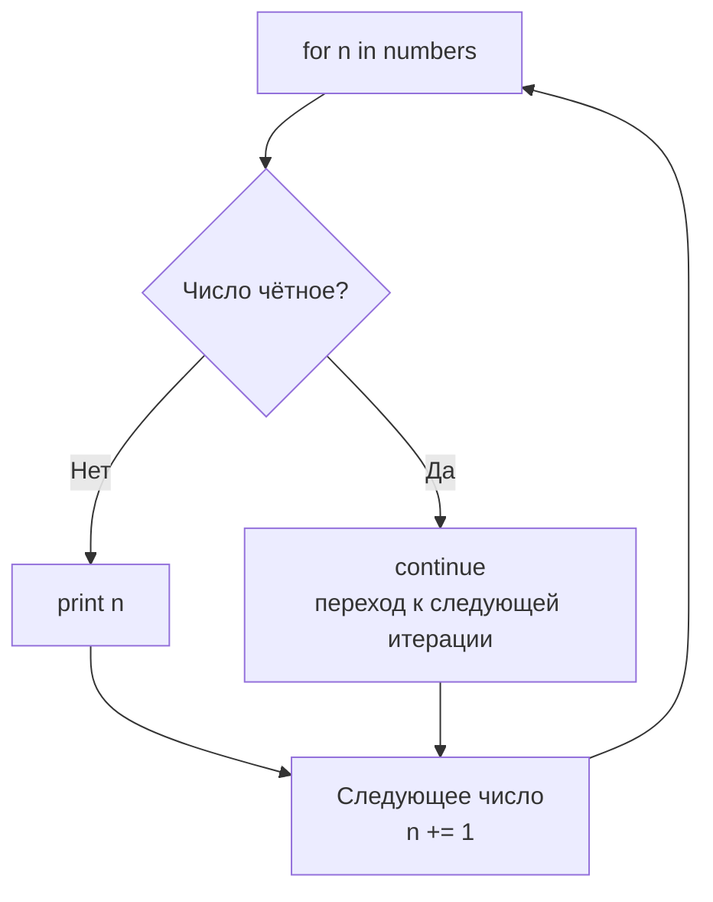

**`continue`** — это оператор управления потоком в [[Swift]], который **немедленно прерывает текущую итерацию цикла** и **переходит к проверке условия следующей итерации**.

Он работает только внутри циклов (`for-in`, `while`, `repeat-while`) и **не влияет** на `switch`, `if`, `guard` или функции (в отличие от `break` и `return`).

### 1. Когда continue полезен (реальные сценарии 2026)

| Ситуация                                             | Почему используем continue                                   | Альтернатива (когда continue не нужен) |
| ---------------------------------------------------- | ------------------------------------------------------------ | -------------------------------------- |
| Пропустить элемент, который не удовлетворяет условию | Не хотим тратить время на обработку неподходящего элемента   | `filter` + `for` или `forEach`         |
| Обработка только валидных данных в массиве           | Пропустить [[nil]], пустые строки, отрицательные значения    | `compactMap`, `filter`                 |
| Избежать вложенности guard/if                        | Вместо глубокой вложенности — continue + код на уровне цикла | `guard let` + `continue` (часто лучше) |
| Пропуск в бесконечном цикле                          | Пропустить итерацию при определённом условии                 | `while true` + `continue`              |
| Вложенные циклы + метка                              | Пропустить итерацию внешнего цикла из внутреннего            | `continue outerLabel`                  |

### 2. Полный разбор всех вариантов continue (схемы + примеры)

#### Вариант 1: Простой continue в for-in (самый частый)

```swift
let numbers = [1, 2, 3, 4, 5, 6, 7, 8]

for n in numbers {
    if n % 2 == 0 {
        continue          // пропускаем чётные числа
    }
    print("Нечётное:", n)
}
// Вывод:
// Нечётное: 1
// Нечётное: 3
// Нечётное: 5
// Нечётное: 7
```

**Схема работы**:


#### Вариант 2: continue в while / repeat-while

```swift
var i = 0
while i < 10 {
    i += 1
    
    if i == 5 {
        continue      // пропускаем печать для i = 5
    }
    
    print("i =", i)
}
// Вывод:
// i = 1
// i = 2
// i = 3
// i = 4
// i = 6
// i = 7
// i = 8
// i = 9
// i = 10
```

**Важно**: `continue` в `while` / `repeat-while` **не проверяет условие цикла** — сразу переходит к следующей итерации.

#### Вариант 3: continue с меткой (label) — выход из вложенного цикла

```swift
outer: for i in 1...4 {
    print("Внешний цикл:", i)
    
    for j in 1...4 {
        if j == 3 {
            print("  Пропускаем внешний цикл при j = 3")
            continue outer      // ← переходим к следующей итерации внешнего цикла
        }
        print("  Внутренний:", j)
    }
}
// Вывод:
// Внешний цикл: 1
//   Внутренний: 1
//   Внутренний: 2
//   Пропускаем внешний цикл при j = 3
// Внешний цикл: 2
//   Внутренний: 1
//   Внутренний: 2
//   Пропускаем внешний цикл при j = 3
// ...
```

Без метки `continue` пропустил бы только внутренний цикл.

#### Вариант 4: continue + guard (очень популярный паттерн)

```swift
let items = ["apple", "", "banana", nil, "cherry", ""]

for item in items {
    guard let text = item, !text.isEmpty else {
        continue
    }
    
    print("Обрабатываем:", text.uppercased())
}
// Вывод:
// Обрабатываем: APPLE
// Обрабатываем: BANANA
// Обрабатываем: CHERRY
```

### 3. Когда continue лучше заменить (современный стиль 2026)

| Ситуация                                      | Старый стиль с continue                              | Современный стиль (рекомендуется)                    | Почему лучше |
|-----------------------------------------------|-------------------------------------------------------|------------------------------------------------------|--------------|
| Пропустить неподходящие элементы              | `for` + `if bad { continue }`                         | `for element in array where condition { ... }`       | Читаемо, декларативно |
| Обработка только валидных элементов           | `for` + `guard let` + `continue`                      | `for case let .some(value) in optionals { ... }`     | Типобезопасно |
| Фильтрация перед циклом                       | `for` + `if !condition { continue }`                  | `for element in array.filter { condition } { ... }`  | Легче читать |
| Пропуск nil в опциональной коллекции          | `for` + `guard let` + `continue`                      | `for element in array.compactMap { $0 } { ... }`     | Коротко, безопасно |

Пример замены:

```swift
// Старый стиль
for number in numbers {
    if number <= 0 {
        continue
    }
    print(number)
}

// Новый стиль (лучше)
for number in numbers where number > 0 {
    print(number)
}
```

### 4. Лучшие практики continue в Swift 2026

- **Используйте `continue` только для пропуска очевидных случаев**  
- **Предпочитайте `where` в `for-in`** — это самый читаемый способ  
- **Метки (`label`)** используйте **только** при вложенных циклах — это редкий случай  
- **Не злоупотребляйте** — слишком много `continue` делает код трудно читаемым (лучше `filter` или `guard`)  
- **Swift 6 strict concurrency** — `continue` безопасен, но весь цикл должен быть на одном акторе  
- **Документируйте** — пиши комментарий «continue — пропускаем пустые строки»

**Короткий девиз 2026**:
> `continue` — это «пропустить эту итерацию, идём к следующей».  
> В 2026 году используй его **редко** — лучше `for ... where`, `filter`, `compactMap`, `guard`.  
> `continue outerLabel` — только для вложенных циклов.  
> Современный код стремится к **декларативности** и минимумом ручных `continue`.
