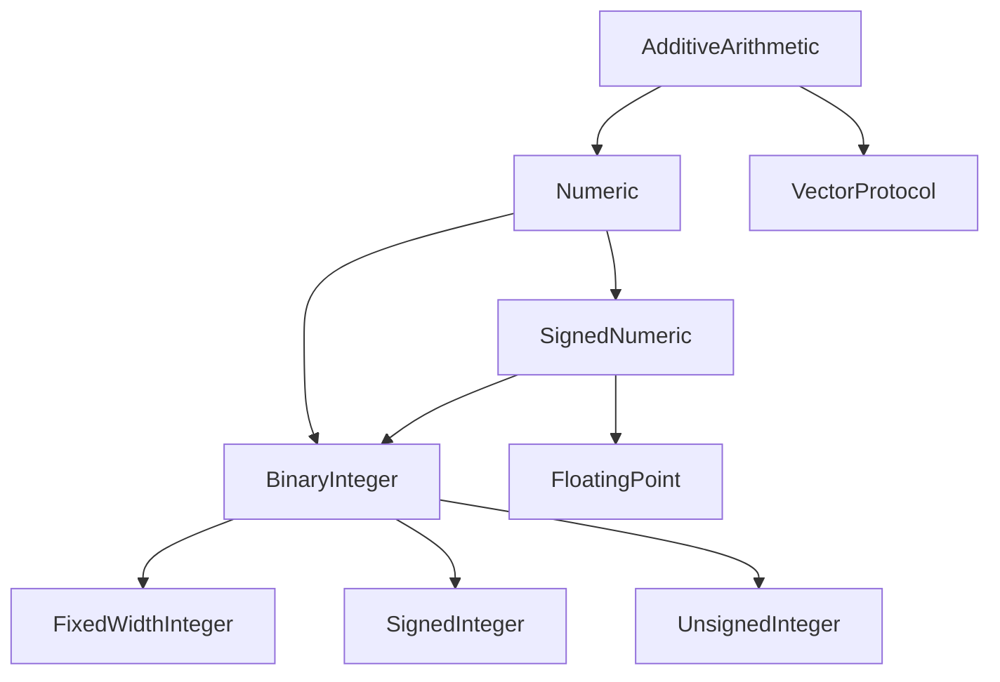

#swift #protocol #additivearithmetic #numeric #arithmetic #generics

---

## AdditiveArithmetic — Протокол аддитивной арифметики

### Определение

**`AdditiveArithmetic`** — это протокол в стандартной библиотеке [[Swift]], который определяет минимальный набор требований для типов, поддерживающих **сложение**, **вычитание** и имеющих **нулевое значение** (аддитивную идентичность). Это один из самых фундаментальных числовых протоколов, лежащий в основе всей арифметической иерархии Swift.

Типы, соответствующие `AdditiveArithmetic`, можно:
- Складывать (`+`)
- Вычитать (`-`)
- Иметь значение "ноль" (аддитивную нейтраль)

Простыми словами: если тип можно складывать и вычитать, и у него есть ноль — он соответствует `AdditiveArithmetic`.

### Зачем это знать iOS-разработчику?

1. **Фундамент числовой системы:** `AdditiveArithmetic` — корень всей арифметической иерархии Swift.
2. **Дженерики:** Позволяет писать обобщённый код для любых "складываемых" типов (векторы, матрицы, точки, комплексные числа).
3. **Стандартные типы:** [[Int]], [[Double]], [[CGFloat]], [[Decimal]] — все соответствуют этому протоколу.
4. **Создание собственных числовых типов:** Идеальная основа для кастомных математических структур.
5. **Минимальные требования:** Самый простой способ добавить базовую арифметику в ваш тип.

---

### Иерархия протоколов



---

### Основные требования протокола

`AdditiveArithmetic` требует всего **три** вещи:

#### 1. **Оператор сложения (`+`)**

```swift
static func + (lhs: Self, rhs: Self) -> Self
```

#### 2. **Оператор вычитания (`-`)**

```swift
static func - (lhs: Self, rhs: Self) -> Self
```

#### 3. **Нулевое значение (аддитивная идентичность)**

```swift
static var zero: Self { get }
```

#### Также автоматически предоставляются:

- Оператор присваивания с добавлением (`+=`)
- Оператор присваивания с вычитанием (`-=`)
- Унарный плюс (`+value`)
- Метод сложения с накоплением (`addingProduct` — для типов, соответствующих `Numeric`)

---

### Примеры использования

#### 1. **Базовые числовые типы**

```swift
let a = 5
let b = 3
let sum = a + b           // 8 (Int соответствует AdditiveArithmetic)

let c = 3.14
let d = 2.86
let diff = c - d          // 0.28 (Double соответствует)

let zeroInt = Int.zero    // 0
let zeroDouble = Double.zero // 0.0
```

#### 2. **Ограничение дженерика**

```swift
func sumAll<T: AdditiveArithmetic>(_ items: [T]) -> T {
    var result = T.zero
    for item in items {
        result = result + item
    }
    return result
}

print(sumAll([1, 2, 3, 4, 5]))        // 15 (Int)
print(sumAll([1.5, 2.5, 3.5]))        // 7.5 (Double)
```

#### 3. **Среднее арифметическое**

```swift
func average<T: AdditiveArithmetic & BinaryInteger>(_ items: [T]) -> Double {
    let sum = items.reduce(T.zero, +)
    return Double(sum) / Double(items.count)
}

print(average([1, 2, 3, 4, 5])) // 3.0
```

---

### Реализация для кастомных типов

#### 1. **Вектор 2D**

```swift
struct Vector2D: AdditiveArithmetic {
    var x: Double
    var y: Double
    
    static var zero: Vector2D {
        return Vector2D(x: 0, y: 0)
    }
    
    static func + (lhs: Vector2D, rhs: Vector2D) -> Vector2D {
        return Vector2D(x: lhs.x + rhs.x, y: lhs.y + rhs.y)
    }
    
    static func - (lhs: Vector2D, rhs: Vector2D) -> Vector2D {
        return Vector2D(x: lhs.x - rhs.x, y: lhs.y - rhs.y)
    }
}

let v1 = Vector2D(x: 1, y: 2)
let v2 = Vector2D(x: 3, y: 4)
let v3 = v1 + v2           // (4, 6)
let v4 = v1 - v2           // (-2, -2)
print(Vector2D.zero)       // (0, 0)
```

#### 2. **Комплексное число**

```swift
struct Complex: AdditiveArithmetic {
    let real: Double
    let imag: Double
    
    static var zero: Complex {
        return Complex(real: 0, imag: 0)
    }
    
    static func + (lhs: Complex, rhs: Complex) -> Complex {
        return Complex(real: lhs.real + rhs.real, imag: lhs.imag + rhs.imag)
    }
    
    static func - (lhs: Complex, rhs: Complex) -> Complex {
        return Complex(real: lhs.real - rhs.real, imag: lhs.imag - rhs.imag)
    }
}

let c1 = Complex(real: 1, imag: 2)
let c2 = Complex(real: 3, imag: 4)
let sum = c1 + c2          // (4 + 6i)
```

#### 3. **[[RGB]] цвет**

```swift
struct RGBColor: AdditiveArithmetic {
    var red: Double
    var green: Double
    var blue: Double
    
    static var zero: RGBColor {
        return RGBColor(red: 0, green: 0, blue: 0)
    }
    
    static func + (lhs: RGBColor, rhs: RGBColor) -> RGBColor {
        return RGBColor(
            red: lhs.red + rhs.red,
            green: lhs.green + rhs.green,
            blue: lhs.blue + rhs.blue
        )
    }
    
    static func - (lhs: RGBColor, rhs: RGBColor) -> RGBColor {
        return RGBColor(
            red: lhs.red - rhs.red,
            green: lhs.green - rhs.green,
            blue: lhs.blue - rhs.blue
        )
    }
}

let color1 = RGBColor(red: 0.5, green: 0.3, blue: 0.2)
let color2 = RGBColor(red: 0.2, green: 0.4, blue: 0.1)
let blended = color1 + color2  // (0.7, 0.7, 0.3)
```

---

### AdditiveArithmetic vs [[Numeric]]

| Характеристика | AdditiveArithmetic | Numeric |
|----------------|--------------------|---------|
| **Операции** | `+`, `-`, `zero` | `*`, `init?(exactly:)` |
| **Нулевое значение** | `zero` | наследуется |
| **Умножение** | ❌ | ✅ |
| **Преобразование из целых** | ❌ | ✅ |
| **Используется для** | Базовые складываемые типы | Полноценные числовые типы |

---

### Расширения для AdditiveArithmetic

```swift
extension AdditiveArithmetic {
    /// Возвращает сумму массива значений
    static func sum(_ items: [Self]) -> Self {
        return items.reduce(zero, +)
    }
}

let numbers = [1, 2, 3, 4, 5]
print(AdditiveArithmetic.sum(numbers)) // 15
```

---

### AdditiveArithmetic в стандартной библиотеке

Многие протоколы и структуры в Swift используют `AdditiveArithmetic`:

```swift
// Numeric наследует AdditiveArithmetic
protocol Numeric: AdditiveArithmetic { ... }

// DistanceMeasure (в Combine)
protocol DistanceMeasure: AdditiveArithmetic { ... }
```

---

### Типы, соответствующие AdditiveArithmetic

| Тип         | Соответствует | Примечание                      |
| ----------- | ------------- | ------------------------------- |
| [[Int]]     | ✅             | Целые числа                     |
| `UInt`      | ✅             | Беззнаковые целые               |
| [[Double]]  | ✅             | Плавающая точка                 |
| [[Float]]   | ✅             | Плавающая точка                 |
| [[CGFloat]] | ✅             | Плавающая точка                 |
| [[Decimal]] | ✅             | Десятичные числа                |
| [[String]]  | ❌             | Нельзя складывать как числа     |
| [[Date]]    | ❌             | Использует `addingTimeInterval` |

---

### Ошибки и ограничения

#### 1. **Нет умножения**

```swift
// ❌ Ошибка: AdditiveArithmetic не требует умножения
func double<T: AdditiveArithmetic>(_ value: T) -> T {
    return value * 2 // ❌
}

// ✅ Решение: используйте Numeric
func double<T: Numeric>(_ value: T) -> T {
    return value * 2
}
```

#### 2. **Нет деления**

```swift
// ❌ Ошибка: AdditiveArithmetic не требует деления
func half<T: AdditiveArithmetic>(_ value: T) -> T {
    return value / 2 // ❌
}
```

#### 3. **Нет преобразования из других типов**

```swift
// ❌ Ошибка: нет init(integerLiteral:)
func fromInt<T: AdditiveArithmetic>(_ value: Int) -> T {
    return T(value) // ❌
}
```

---

### Короткое правило

> **`AdditiveArithmetic`** — минимальный протокол для складываемых типов.  
> Реализуйте для кастомных типов, которые можно складывать и вычитать.  
> Используйте в дженериках для работы с любыми "аддитивными" типами.

---

### Итог

**`AdditiveArithmetic`** в Swift:

1. **Минимальные требования:** `+`, `-`, `zero`.
2. **Фундаментальный протокол:** лежит в основе всей числовой иерархии.
3. **Подходит для:** векторов, матриц, цветов, комплексных чисел.
4. **Не включает:** умножение, деление, преобразование из целых.
5. **Используется в:** `Numeric`, `DistanceMeasure`, кастомных математических структурах.

Понимание `AdditiveArithmetic` необходимо для создания собственных числовых типов и написания обобщённого кода, работающего с любыми складываемыми величинами.