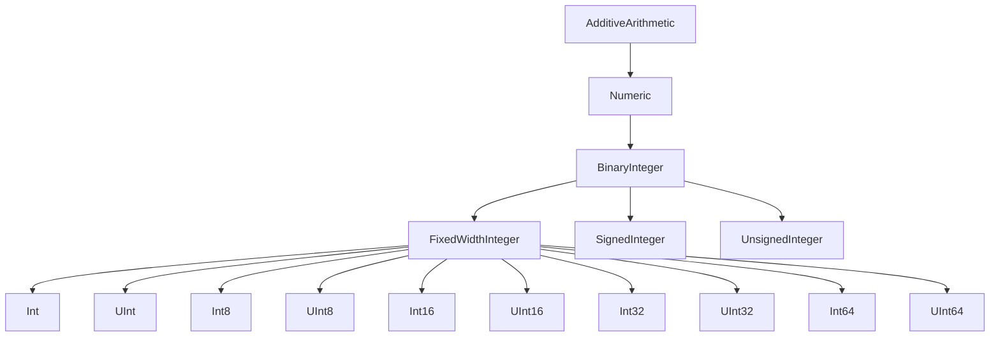

#swift #protocol #binaryinteger #numeric #bitwise #generics #standard-library

---

## BinaryInteger — Протокол целых чисел с битовыми операциями

### Определение

`BinaryInteger` — это протокол в стандартной библиотеке [[Swift]], который наследуется от [[Numeric]] и [[Comparable]]. Он представляет **целые числа**, которые могут быть представлены в двоичной системе счисления и поддерживают **битовые операции**, **арифметику с переполнением** и **преобразование из/в другие представления**.

Все стандартные целочисленные типы в Swift ([[Int]], `UInt`, `Int8`, `UInt8`, `Int16`, `UInt16`, `Int32`, `UInt32`, `Int64`, `UInt64`) соответствуют протоколу `BinaryInteger`.

Простыми словами: если вы пишете обобщённый код, который должен работать с **любым целым числом** (и знаковым, и беззнаковым, любого размера) и нуждается в **битовых операциях** — вы используете `BinaryInteger`.

### Почему это важно знать iOS-разработчику?

1.  **Абстракция размера и знака:** Позволяет писать код, работающий с `Int8`, `UInt64`, `Int` одинаково.
2.  **Битовые операции:** `&`, `|`, `^`, `~`, `>>`, `<<` — критически важны для криптографии, хеширования, оптимизаций, протоколов.
3.  **Арифметика с переполнением:** Методы `addingReportingOverflow`, `multipliedReportingOverflow` для безопасной работы с переполнением.
4.  **Преобразования:** Безопасные инициализаторы `init(exactly:)`, `init(truncatingIfNeeded:)`.
5.  **Стандартная библиотека:** Фундаментальный протокол, на котором построены все целые числа.

---

### Иерархия протоколов



---

### Основные требования протокола

`BinaryInteger` требует реализации (или автоматически предоставляет) следующих возможностей:

#### 1. **Битовые операции**
- `&` (побитовое И), `|` (побитовое ИЛИ), `^` (побитовое XOR)
- `~` (побитовое НЕ)
- `>>` (сдвиг вправо), `<<` (сдвиг влево)

#### 2. **Арифметика с переполнением**
- `func addingReportingOverflow(_:) -> (partialValue: Self, overflow: Bool)`
- `func subtractingReportingOverflow(_:) -> (partialValue: Self, overflow: Bool)`
- `func multipliedReportingOverflow(by:) -> (partialValue: Self, overflow: Bool)`
- `func dividedReportingOverflow(by:) -> (partialValue: Self, overflow: Bool)`
- `func remainderReportingOverflow(dividingBy:) -> (partialValue: Self, overflow: Bool)`

#### 3. **Инициализаторы**
- `init?<T: BinaryInteger>(exactly source: T)` — безопасный, возвращает `nil` при потере данных
- `init<T: BinaryInteger>(truncatingIfNeeded source: T)` — обрезает лишние биты
- `init<T: BinaryInteger>(clamping source: T)` — ограничивает значение диапазоном типа

#### 4. **Свойства**
- `var bitWidth: Int { get }` — количество бит, необходимых для представления числа
- `var trailingZeroBitCount: Int { get }` — количество нулевых битов в конце
- `var words: Words { get }` — представление числа в виде массива "слов" (обычно по 64 бита)

---

### Примеры использования

#### 1. **Ограничение дженерика любым целым числом**

```swift
func isPowerOfTwo<T: BinaryInteger>(_ value: T) -> Bool {
    guard value > 0 else { return false }
    return (value & (value - 1)) == 0
}

print(isPowerOfTwo(16))   // true (Int)
print(isPowerOfTwo(18))   // false
print(isPowerOfTwo(UInt8(4)))  // true
```

#### 2. **Безопасная арифметика с переполнением**

```swift
func safeAdd<T: BinaryInteger>(_ a: T, _ b: T) -> T? {
    let (result, overflow) = a.addingReportingOverflow(b)
    return overflow ? nil : result
}

let int8max: Int8 = 127
print(safeAdd(int8max, 1) as Any) // nil (переполнение)
print(safeAdd(int8max, 0) as Any) // Optional(127)
```

#### 3. **Подсчёт установленных битов (popcount)**

```swift
extension BinaryInteger {
    var popCount: Int {
        return (0..<bitWidth).reduce(0) { $0 + Int((self >> $1) & 1) }
    }
}

let value: UInt8 = 0b10110010
print(value.popCount)  // 4
```

#### 4. **Проверка на чётность**

```swift
extension BinaryInteger {
    var isEven: Bool { return self & 1 == 0 }
    var isOdd: Bool { return !isEven }
}

print(42.isEven)  // true
print(43.isOdd)   // true
```

#### 5. **Циклический сдвиг (вращение битов)**

```swift
extension BinaryInteger {
    func rotateLeft(by count: Int) -> Self {
        let bits = Self.bitWidth
        let shift = count % bits
        if shift == 0 { return self }
        return (self << shift) | (self >> (bits - shift))
    }
    
    func rotateRight(by count: Int) -> Self {
        let bits = Self.bitWidth
        let shift = count % bits
        if shift == 0 { return self }
        return (self >> shift) | (self << (bits - shift))
    }
}

let number: UInt8 = 0b10110010
let rotated = number.rotateLeft(by: 2)
print(String(rotated, radix: 2)) // 11001010
```

#### 6. **Безопасное преобразование между типами**

```swift
func safelyCast<T: BinaryInteger, U: BinaryInteger>(_ value: T) -> U? {
    return U(exactly: value)
}

let large: Int64 = 1000
let small: Int8? = safelyCast(large)
print(small as Any)  // nil (1000 не влезает в Int8)

let medium: Int16 = 100
let smallOk: Int8? = safelyCast(medium)
print(smallOk as Any) // Optional(100)
```

#### 7. **Получение битового представления**

```swift
extension BinaryInteger {
    var binaryString: String {
        let bits = Self.bitWidth
        let binary = String(self, radix: 2)
        return String(repeating: "0", count: bits - binary.count) + binary
    }
}

let negative: Int8 = -1
print(negative.binaryString)  // "11111111" (дополнительный код)

let positive: UInt8 = 42
print(positive.binaryString)  // "00101010"
```

#### 8. **Маскирование битов**

```swift
func extractBits<T: BinaryInteger>(_ value: T, from start: Int, to end: Int) -> T {
    let mask = (T(1) << (end - start + 1)) - 1
    return (value >> start) & mask
}

let data: UInt16 = 0b1011001110001111
let middleBits = extractBits(data, from: 4, to: 7)
print(String(middleBits, radix: 2)) // 1110 (биты 4-7)
```

---

### BinaryInteger vs Numeric vs AdditiveArithmetic

| Протокол               | Операции                                                      | Наследует               |
| ---------------------- | ------------------------------------------------------------- | ----------------------- |
| [[AdditiveArithmetic]] | `+`, `-`, `zero`                                              | -                       |
| [[Numeric]]            | `*`, `init?(exactly:)`                                        | `AdditiveArithmetic`    |
| `BinaryInteger`        | Битовые операции, `%`, `>>`, `<<`, арифметика с переполнением | `Numeric`, `Comparable` |

---

### Свойства и методы BinaryInteger

#### Свойства

| Свойство | Тип | Описание |
|----------|-----|----------|
| `bitWidth` | `Int` | Количество бит для представления числа (без знака) |
| `trailingZeroBitCount` | `Int` | Количество нулевых битов в конце двоичной записи |
| `words` | `Words` | Массив "слов" (обычно 64-битных фрагментов) |

#### Методы

| Метод | Описание |
|-------|----------|
| `addingReportingOverflow(_:)` | Сложение с индикацией переполнения |
| `subtractingReportingOverflow(_:)` | Вычитание с индикацией переполнения |
| `multipliedReportingOverflow(by:)` | Умножение с индикацией переполнения |
| `dividedReportingOverflow(by:)` | Деление с индикацией переполнения |
| `remainderReportingOverflow(dividingBy:)` | Остаток с индикацией переполнения |
| `quotientAndRemainder(dividingBy:)` | Частное и остаток за одну операцию |

---

### Распространённые ошибки

#### 1. **Деление на ноль в дженериках**

```swift
func divide<T: BinaryInteger>(_ a: T, by b: T) -> T? {
    guard b != 0 else { return nil }  // ✅ Всегда проверяйте
    return a / b
}
```

#### 2. **Переполнение при сдвиге**

```swift
func shiftLeft<T: BinaryInteger>(_ value: T, by count: Int) -> T {
    // ⚠️ Сдвиг на bitWidth или больше — UB
    guard count < T.bitWidth else { return 0 }
    return value << count
}
```

#### 3. **Использование `BinaryInteger` для плавающей точки**

```swift
// ❌ Ошибка: Double не соответствует BinaryInteger
func process<T: BinaryInteger>(_ value: T) { }
process(3.14) // ❌

// ✅ Используйте FloatingPoint
func process<T: FloatingPoint>(_ value: T) { }
```

---

### BinaryInteger в стандартной библиотеке

Многие алгоритмы и структуры данных в Swift используют `BinaryInteger` для обобщения.

```swift
// Пример: функция реверсирования битов
extension BinaryInteger {
    var reversedBits: Self {
        var result: Self = 0
        var copy = self
        for _ in 0..<Self.bitWidth {
            result = (result << 1) | (copy & 1)
            copy >>= 1
        }
        return result
    }
}

let byte: UInt8 = 0b10110010
print(String(byte.reversedBits, radix: 2)) // 01001101 (реверсировано)
```

---

### Короткое правило

> **`BinaryInteger`** — протокол для целых чисел, поддерживающих битовые операции.  
> Используйте в дженериках, когда нужна работа с **любыми целыми** (и знаковыми, и беззнаковыми).  
> Предоставляет **арифметику с переполнением** и **битовые манипуляции**.

---

### Итог

**`BinaryInteger`** в Swift:

1.  **Объединяет** все целые типы (`Int`, `UInt`, `Int8`, `UInt8` и т.д.).
2.  **Поддерживает битовые операции** (`&`, `|`, `^`, `~`, `>>`, `<<`).
3.  **Предоставляет безопасную арифметику** с методами `*ReportingOverflow`.
4.  **Позволяет безопасное преобразование** между типами через `init(exactly:)`.
5.  **Даёт доступ к низкоуровневому представлению** через `bitWidth`, `words`, `trailingZeroBitCount`.
6.  **Является наследником** `Numeric` и `Comparable`.

Понимание `BinaryInteger` — ключ к написанию мощных, типобезопасных и эффективных обобщённых алгоритмов для работы с целыми числами в Swift.