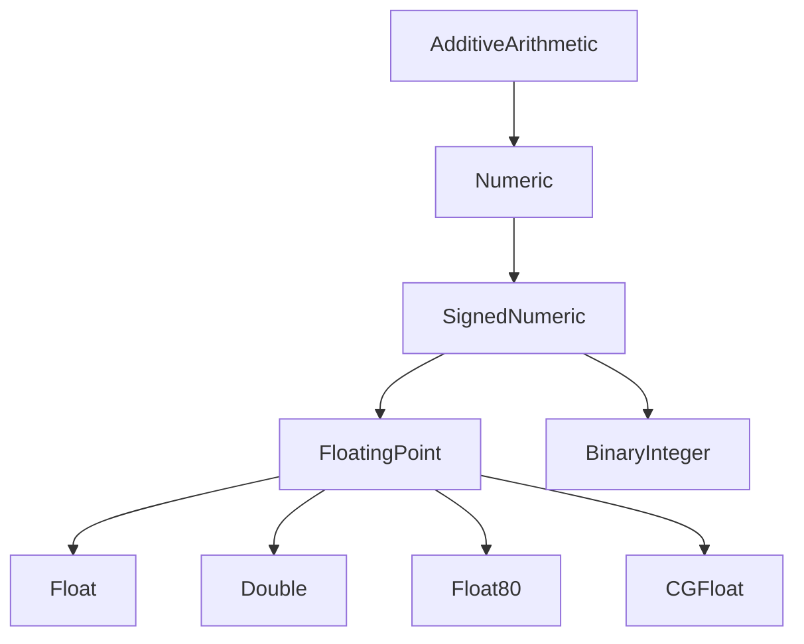

#swift #protocol #floatingpoint #numeric #ieee754 #math #generics

---

## FloatingPoint — Протокол чисел с плавающей точкой

### Определение

**`FloatingPoint`** — это протокол в стандартной библиотеке Swift, который наследуется от [[SignedNumeric]] и [[Strideable]]. Он представляет **числа с плавающей точкой**, соответствующие стандарту **IEEE 754** (за исключением `Float80`). Все стандартные типы с плавающей точкой в Swift ([[Float]], [[Double]], `Float80`, а также [[CGFloat]] в [[iOS]]/macOS) соответствуют этому протоколу.

Простыми словами: если вы пишете обобщённый код, который должен работать с **дробными числами** (не целыми), поддерживать **математические операции** (синус, косинус, корень, степень) и **работу с бесконечностью и NaN** — вы используете `FloatingPoint`.

### Почему это важно знать iOS-разработчику?

1.  **Математические расчёты:** Физика, графика, анимации, 3D-преобразования — всё это требует `FloatingPoint`.
2.  **Абстракция точности:** Позволяет писать код, работающий с `Float`, `Double`, `CGFloat` одинаково.
3.  **Обработка особых значений:** Бесконечность (`inf`), "не число" (`NaN`), денормализованные числа.
4.  **Надёжные сравнения:** Специальные методы для сравнения с учётом погрешности.
5.  **Графика и анимации:** `CGFloat` в [[UIKit]] и [[Core Graphics]] соответствует `FloatingPoint`.

---

### Иерархия протоколов



---

### Основные возможности протокола

`FloatingPoint` — один из самых больших и мощных протоколов в Swift. Он предоставляет:

#### 1. **Математические константы**
- `pi` — число π
- `infinity` — положительная бесконечность
- `nan` — "не число" (Not a Number)
- `signalingNaN` — сигнальный NaN
- `greatestFiniteMagnitude` — наибольшее конечное число

#### 2. **Свойства состояния**
- `sign` — знак числа (`.plus` или `.minus`)
- `exponent` — экспонента (смещённая)
- `significand` — мантисса (значимая часть)
- `isZero`, `isInfinite`, `isNaN`, `isSubnormal`, `isCanonical`
- `isFinite` — конечно ли число
- `isNormal` — нормализовано ли число

#### 3. **Округление**
- `rounded()` — округление до целого
- `rounded(_:)` — округление с заданным правилом
- `round(_:)` — мутирующая версия

#### 4. **Сравнение**
- `isEqual(to:)` — сравнение с учётом погрешности
- `isLess(than:)` — безопасное сравнение
- `isLessThanOrEqualTo(_:)`
- `isTotallyOrdered(belowOrEqualTo:)` — полный порядок (включая NaN)

#### 5. **Арифметика**
- `addingProduct(_:_:)` — `self + (a * b)` за одну операцию (меньше погрешности)
- `remainder(dividingBy:)` — остаток от деления по IEEE
- `formRemainder(dividingBy:)` — мутирующая версия
- `squareRoot()` — квадратный корень

---

### Примеры использования

#### 1. **Ограничение дженерика числами с плавающей точкой**

```swift
func hypotenuse<T: FloatingPoint>(_ a: T, _ b: T) -> T {
    return (a * a + b * b).squareRoot()
}

print(hypotenuse(3.0, 4.0))   // 5.0 (Double)
print(hypotenuse(Float(3), Float(4))) // 5.0 (Float)
```

#### 2. **Безопасное сравнение с погрешностью**

```swift
func almostEqual<T: FloatingPoint>(_ a: T, _ b: T, tolerance: T) -> Bool {
    return abs(a - b) < tolerance
}

print(almostEqual(0.1 + 0.2, 0.3, tolerance: 1e-10)) // true
```

#### 3. **Обработка особых значений**

```swift
func processValue<T: FloatingPoint>(_ value: T) -> T {
    if value.isNaN {
        print("⚠️ Значение NaN")
        return 0
    }
    if value.isInfinite {
        print("♾️ Бесконечность")
        return value.sign == .minus ? -T.greatestFiniteMagnitude : T.greatestFiniteMagnitude
    }
    return value
}

print(processValue(Double.nan))      // 0.0
print(processValue(Double.infinity)) // 1.7976931348623157e+308
```

#### 4. **Проверка нормализованности**

```swift
func isNormalized<T: FloatingPoint>(_ value: T) -> Bool {
    return value.isNormal && !value.isZero
}

print(isNormalized(0.0))   // false
print(isNormalized(1.0))   // true
print(isNormalized(Float.leastNonzeroMagnitude)) // false (субнормальное)
```

#### 5. **Манипуляция компонентами числа**

```swift
func decompose<T: FloatingPoint>(_ value: T) -> (sign: FloatingPointSign, exponent: Int, significand: T) {
    return (value.sign, value.exponent, value.significand)
}

let (sign, exponent, significand) = decompose(12.34)
print(sign)        // .plus
print(exponent)    // 3 (смещённая экспонента)
print(significand) // 1.5425 (мантисса)
```

#### 6. **Округление с разными правилами**

```swift
let values: [Double] = [3.14, 2.71, 1.618, 2.5]

print(values.map { $0.rounded(.down) })    // [3.0, 2.0, 1.0, 2.0]
print(values.map { $0.rounded(.up) })      // [4.0, 3.0, 2.0, 3.0]
print(values.map { $0.rounded(.towardZero) }) // [3.0, 2.0, 1.0, 2.0]
print(values.map { $0.rounded(.toNearestOrAwayFromZero) }) // [3.0, 3.0, 2.0, 3.0]
```

#### 7. **Умножение с накоплением (FMA)**

```swift
// Классический способ (может потерять точность)
func classicFMA<T: FloatingPoint>(_ a: T, _ b: T, _ c: T) -> T {
    return a * b + c
}

// FMA способ (меньше погрешности)
func fmaFMA<T: FloatingPoint>(_ a: T, _ b: T, _ c: T) -> T {
    return a.addingProduct(b, c)
}

let a: Double = 1e20
let b: Double = 1e-20
let c: Double = 1.0

print(classicFMA(a, b, c)) // 1.0 (но может быть неточным)
print(fmaFMA(a, b, c))     // 1.0 (точнее)
```

#### 8. **Квадратный корень**

```swift
extension FloatingPoint {
    func hypot(_ other: Self) -> Self {
        return (self * self + other * other).squareRoot()
    }
}

let distance = 3.0.hypot(4.0)
print(distance) // 5.0
```

---

### Сравнение FloatingPoint и Numeric

| Характеристика | Numeric | FloatingPoint |
|----------------|---------|---------------|
| **Целые числа** | ✅ | ❌ (не поддерживает точные целые операции) |
| **Плавающая точка** | ❌ | ✅ |
| **IEEE 754 стандарт** | ❌ | ✅ |
| **NaN, Infinity** | ❌ | ✅ |
| **Квадратный корень** | ❌ | ✅ |
| **Округление** | ❌ | ✅ |
| **Сравнение с погрешностью** | ❌ | ✅ |

---

### Типы, соответствующие FloatingPoint

| Тип | Точность | Размер | Примечание |
|-----|----------|--------|------------|
| `Float` | ~6 знаков | 32 бита | IEEE 754 single-precision |
| `Double` | ~15 знаков | 64 бита | IEEE 754 double-precision |
| `Float80` | ~18 знаков | 80 бит | Extended precision (x86 only) |
| `CGFloat` | зависит от платформы | 32/64 бита | На 64-битных устройствах — Double |

---

### Расширения для FloatingPoint

```swift
extension FloatingPoint {
    /// Ограничивает значение диапазоном
    func clamped(to range: ClosedRange<Self>) -> Self {
        return min(max(self, range.lowerBound), range.upperBound)
    }
    
    /// Нормализует угол в радианах к диапазону [0, 2π)
    func normalizedAngle() -> Self {
        let twoPi = Self.pi * 2
        var angle = self.truncatingRemainder(dividingBy: twoPi)
        if angle < 0 { angle += twoPi }
        return angle
    }
    
    /// Проверяет, является ли число целым
    var isInteger: Bool {
        return self.rounded() == self
    }
}

let angle: Double = 750.0
print(angle.normalizedAngle()) // 0.2617993877991494 (30 градусов)
print(3.14.isInteger) // false
print(3.0.isInteger)  // true
```

---

### FloatingPoint в реальных iOS-задачах

#### 1. **Анимация с обобщённым типом**

```swift
import UIKit

func interpolate<T: FloatingPoint>(from start: T, to end: T, progress: T) -> T {
    return start + (end - start) * progress
}

let currentAlpha = interpolate(from: 0.0, to: 1.0, progress: 0.5)
print(currentAlpha) // 0.5
```

#### 2. **Проверка коллизий в играх**

```swift
struct Circle<T: FloatingPoint> {
    var center: (x: T, y: T)
    var radius: T
    
    func intersects(with other: Circle<T>) -> Bool {
        let dx = center.x - other.center.x
        let dy = center.y - other.center.y
        let distance = (dx * dx + dy * dy).squareRoot()
        return distance < radius + other.radius
    }
}
```

---

### Ошибки и ограничения

#### 1. **Прямое сравнение чисел с плавающей точкой**

```swift
// ❌ Плохо — может не работать из-за погрешностей
if 0.1 + 0.2 == 0.3 {
    print("Equal")
} else {
    print("Not equal") // ← часто выводится это
}

// ✅ Хорошо — сравнение с погрешностью
func isEqual<T: FloatingPoint>(_ a: T, _ b: T, tolerance: T) -> Bool {
    return abs(a - b) < tolerance
}
```

#### 2. **Использование FloatingPoint для целых чисел**

```swift
// ❌ Плохо — FloatingPoint не гарантирует точное представление больших целых
let largeInt = 9007199254740993
let asDouble = Double(largeInt)
print(asDouble == Double(largeInt)) // true, но не всегда
```

#### 3. **Деление на ноль**

```swift
func safeDivide<T: FloatingPoint>(_ a: T, by b: T) -> T? {
    guard !b.isZero else { return nil }
    return a / b
}
```

---

### Короткое правило

> **`FloatingPoint`** — протокол для дробных чисел (IEEE 754).  
> Используйте в дженериках для математических расчётов, графики и анимаций.  
> Всегда учитывайте погрешности при сравнении.

---

### Итог

**`FloatingPoint`** в Swift:

1.  **Наследует от `SignedNumeric`** и предоставляет математические операции.
2.  **Объединяет** `Float`, `Double`, `Float80`, `CGFloat`.
3.  **Поддерживает IEEE 754** — NaN, infinity, субнормальные числа.
4.  **Предоставляет методы** для округления, сравнения с погрешностью, квадратного корня.
5.  **Не подходит** для точных денежных расчётов (используйте `Decimal`).
6.  **Критически важен** для графики, физики, анимаций и научных вычислений.

Понимание `FloatingPoint` необходимо для любого iOS-разработчика, работающего с анимациями, играми, графикой или математикой.