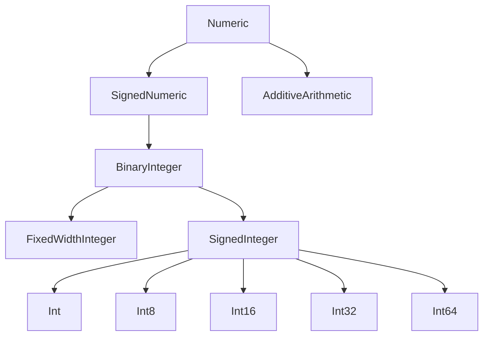

#swift #protocol #numeric #signedinteger #generics #standard-library

---

## SignedInteger — Протокол целых чисел со знаком

### Определение

`SignedInteger` — это протокол в стандартной библиотеке Swift, который наследуется от [[BinaryInteger]] и [[SignedNumeric]]. Он представляет **целые числа со знаком** (могут быть отрицательными, нулем и положительными). Все стандартные целочисленные типы в [[Swift]] (`Int`, `Int8`, `Int16`, `Int32`, `Int64`) соответствуют этому протоколу.

Простыми словами: если вы пишете обобщенный код, который должен работать с **любым целым числом** (неважно, 8-битным или 64-битным, но обязательно со знаком), вы используете `SignedInteger`.

### Почему это важно знать iOS-разработчику?

1. **Абстракция размера:** Позволяет писать код, работающий с `Int8`, `Int`, `Int64` одинаково.
2. **Безопасность:** Ограничивает код только знаковыми типами (исключая `UInt`).
3. **Дженерики:** Ключевой протокол для написания обобщенных математических алгоритмов.
4. **Стандартная библиотека:** Понимание иерархии числовых протоколов делает вас более глубоким Swift-разработчиком.

### Иерархия протоколов



### Основные требования протокола

Будучи наследником `BinaryInteger` и `SignedNumeric`, `SignedInteger` требует реализацию:

- Арифметических операций (`+`, `-`, `*`, `/`, `%`)
- Битовых операций (`&`, `|`, `^`, `~`, `>>`, `<<`)
- Сравнения (`<`, `>`, `==`)
- Инициализаторов из других числовых типов
- Свойств: `.bitWidth`, `.trailingZeroBitCount`, `.words`

Но главное, что `SignedInteger` **не добавляет новых требований**, а только **уточняет семантику** — это знаковое целое.

### Примеры использования

#### 1. **Ограничение дженерика знаковыми целыми**

```swift
func clamp<T: SignedInteger>(_ value: T, min minValue: T, max maxValue: T) -> T {
    return min(max(value, minValue), maxValue)
}

let clampedInt = clamp(150, min: 0, max: 100)   // 100
let clampedInt8: Int8 = clamp(-10, min: 0, max: 100) // 0
```

#### 2. **Функция, работающая с любым знаковым целым**

```swift
func absoluteValue<T: SignedInteger>(_ value: T) -> T {
    return value < 0 ? -value : value
}

print(absoluteValue(-42))    // 42 (Int)
print(absoluteValue(-128 as Int8)) // 128 (Int8)
```

#### 3. **Циклический сдвиг (вращение битов)**

```swift
extension SignedInteger {
    func rotateLeft(by count: Int) -> Self {
        let bits = Self.bitWidth
        let shift = count % bits
        if shift == 0 { return self }
        return (self << shift) | (self >> (bits - shift))
    }
}

let value: Int8 = 0b10110010
let rotated = value.rotateLeft(by: 2)
print(String(rotated, radix: 2)) // 11001010
```

#### 4. **Обработка переполнения в дженериках**

```swift
func safeAdd<T: SignedInteger>(_ a: T, _ b: T) -> T? {
    let (result, overflow) = a.addingReportingOverflow(b)
    return overflow ? nil : result
}

let int16max: Int16 = .max
print(safeAdd(int16max, 1) as Any) // nil (переполнение)
```

#### 5. **Работа с битовыми масками**

```swift
func isPowerOfTwo<T: SignedInteger>(_ value: T) -> Bool {
    guard value > 0 else { return false }
    return (value & (value - 1)) == 0
}

print(isPowerOfTwo(16))  // true
print(isPowerOfTwo(18))  // false
```

### Расширения для SignedInteger

```swift
extension SignedInteger {
    /// Возвращает строковое представление числа в двоичной системе с лидирующими нулями
    var binaryString: String {
        let bits = Self.bitWidth
        let binary = String(self, radix: 2)
        return String(repeating: "0", count: bits - binary.count) + binary
    }
}

let number: Int8 = -1
print(number.binaryString) // "11111111" (дополнительный код)
```

### SignedInteger vs BinaryInteger

| Характеристика | SignedInteger | BinaryInteger |
|----------------|---------------|---------------|
| **Знак** | Всегда знаковый | Может быть знаковым или беззнаковым |
| **Примеры** | `Int`, `Int8`, `Int64` | `Int`, `UInt`, `Int16`, `UInt8` |
| **Наследует от** | `BinaryInteger`, `SignedNumeric` | `Numeric` |
| **Дополнительные методы** | Нет (только семантика) | Битовые операции, инициализаторы |

### Распространённые ошибки

#### 1. **Использование SignedInteger для беззнаковых типов**

```swift
// ❌ Ошибка: UInt не соответствует SignedInteger
func process<T: SignedInteger>(_ value: T) { }
process(UInt(42)) // ❌

// ✅ Решение: используйте BinaryInteger для обоих
func process<T: BinaryInteger>(_ value: T) { }
```

#### 2. **Переполнение при преобразовании типов**

```swift
func convert<T: SignedInteger, U: SignedInteger>(_ value: T) -> U? {
    // Опасно: прямое преобразование может переполниться
    return U(exactly: value)
}

let big: Int64 = 1_000_000_000_000
let small: Int32? = convert(big) // nil (переполнение)
```

#### 3. **Деление на ноль в дженериках**

```swift
func divide<T: SignedInteger>(_ a: T, by b: T) -> T? {
    guard b != 0 else { return nil }
    return a / b
}
```

### Сравнение с Numeric и AdditiveArithmetic

| Протокол             | Операции                          | Наследует                      |
| -------------------- | --------------------------------- | ------------------------------ |
| `AdditiveArithmetic` | `+`, `-`, `zero`                  | -                              |
| `Numeric`            | `*`, `init?(exactly:)`            | `AdditiveArithmetic`           |
| `SignedNumeric`      | `-` (унарный), знак               | `Numeric`                      |
| `BinaryInteger`      | Битовые операции, `%`, `>>`, `<<` | `SignedNumeric` (для знаковых) |
| `SignedInteger`      | (только семантика)                | `BinaryInteger`                |

### Когда использовать SignedInteger

| Сценарий                                    | Рекомендация      | Почему                                 |
| ------------------------------------------- | ----------------- | -------------------------------------- |
| **Работа только со знаковыми целыми**       | `SignedInteger`   | Исключает `UInt`                       |
| **Нужны битовые операции и деление**        | [[BinaryInteger]] | Поддерживает и знаковые, и беззнаковые |
| **Только арифметика (сложение, умножение)** | [[Numeric]]       | Минимальные требования                 |
| **Работа с плавающей точкой**               | [[FloatingPoint]] | Для [[Double]], [[Float]]              |

### Пример из реального [[iOS]]-приложения

```swift
protocol NetworkParameters {
    associatedtype ID: SignedInteger & Codable
    var userId: ID { get }
    var page: ID { get }
    var limit: ID { get }
}

struct UserRequest: NetworkParameters {
    typealias ID = Int
    let userId: Int = 1
    let page: Int = 1
    let limit: Int = 20
}

func buildURL<T: NetworkParameters>(_ params: T) -> String {
    return "/users/\(params.userId)?page=\(params.page)&limit=\(params.limit)"
}
```

### Короткое правило

> **`SignedInteger`** — протокол для целых чисел со знаком (`Int`, `Int8`, `Int16`, `Int32`, `Int64`).  
> Используйте в дженериках, когда важна **знаковость**, но не важен **размер**.  
> Наследует от `BinaryInteger` и `SignedNumeric`.

### Итог

**`SignedInteger`** в Swift:

1. **Объединяет** все знаковые целые типы (`Int`, `Int8`, `Int16`, `Int32`, `Int64`).
2. **Исключает** беззнаковые (`UInt`, `UInt8` и т.д.).
3. **Не добавляет новых требований** — только уточняет семантику (знак).
4. **Позволяет писать обобщённый код** для любых знаковых целых.
5. **Используется в стандартной библиотеке** и в дженериках.

Понимание `SignedInteger` — ключ к написанию гибких и типобезопасных математических абстракций в Swift.