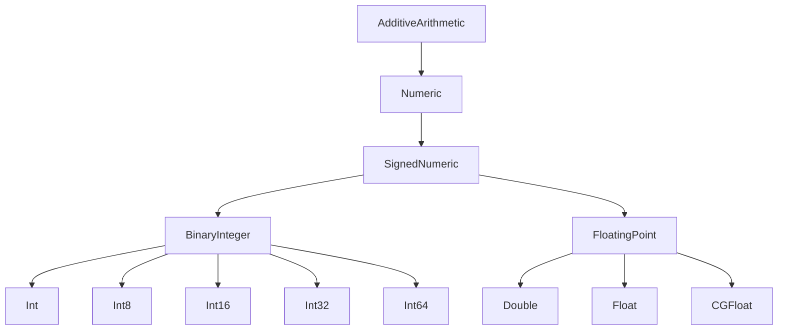

#swift #protocol #numeric #signednumeric #arithmetic #generics

---

## SignedNumeric — Протокол чисел со знаком

### Определение

**`SignedNumeric`** — это протокол в стандартной библиотеке [[Swift]], который наследуется от [[Numeric]]. Он добавляет к арифметике **знак** (sign) и **унарный минус** (отрицание). Типы, соответствующие `SignedNumeric`, могут быть отрицательными, нулём и положительными.

Все стандартные целочисленные типы со знаком ([[Int]], `Int8`, `Int16`, `Int32`, `Int64`) и типы с плавающей точкой ([[Double]], [[Float]], [[CGFloat]]) соответствуют этому протоколу. Беззнаковые типы (`UInt`, `UInt8` и т.д.) **не соответствуют** `SignedNumeric`.

Простыми словами: если вы пишете обобщённый код, который должен работать с **числами, имеющими знак** (могут быть отрицательными), вы используете `SignedNumeric`.

### Зачем это знать iOS-разработчику?

1.  **Абстракция знака:** Позволяет писать код, работающий с `Int`, `Double`, `Float` одинаково, исключая беззнаковые типы.
2.  **Математические алгоритмы:** Многие алгоритмы (поиск минимума, максимума, вычисление расстояний) требуют знак.
3.  **Графика и анимация:** `CGFloat` соответствует `SignedNumeric`, что полезно для обобщённых функций трансформации.
4.  **Дженерики:** Ключевой протокол для ограничения типов, поддерживающих отрицательные значения.
5.  **Иерархия протоколов:** Понимание места `SignedNumeric` помогает лучше понять числовую систему Swift.

---

### Иерархия протоколов



---

### Основные требования протокола

`SignedNumeric` добавляет к `Numeric` всего одно новое требование:

#### Унарный минус (префиксный оператор `-`)

```swift
static prefix func - (operand: Self) -> Self
```

А также определяет **семантику знака** — тип может быть отрицательным, нулём или положительным.

В отличие от `Numeric`, который ничего не говорит о знаке, `SignedNumeric` явно указывает, что тип поддерживает отрицательные значения.

---

### Примеры использования

#### 1. **Ограничение дженерика числами со знаком**

```swift
func absoluteValue<T: SignedNumeric>(_ value: T) -> T {
    return value < 0 ? -value : value
}

print(absoluteValue(-42))    // 42 (Int)
print(absoluteValue(-3.14))  // 3.14 (Double)
print(absoluteValue(-128 as Int8)) // 128 (Int8)
```

#### 2. **Расстояние между двумя числами**

```swift
func distance<T: SignedNumeric>(_ a: T, _ b: T) -> T where T: Comparable {
    return absoluteValue(a - b)
}

print(distance(5, 2))     // 3 (Int)
print(distance(3.5, 1.2)) // 2.3 (Double)
```

#### 3. **Обобщённая функция знака**

```swift
extension SignedNumeric where Self: Comparable {
    var sign: Int {
        if self < 0 { return -1 }
        if self > 0 { return 1 }
        return 0
    }
}

print((-42).sign)   // -1
print(0.sign)       // 0
print(3.14.sign)    // 1
```

#### 4. **Интерполяция значений**

```swift
func lerp<T: SignedNumeric>(_ a: T, _ b: T, _ t: T) -> T where T: FloatingPoint {
    return a + (b - a) * t
}

let result = lerp(0.0, 10.0, 0.5) // 5.0 (Double)
```

---

### SignedNumeric vs Numeric vs AdditiveArithmetic

| Протокол               | Операции               | Знак | Унарный минус      |
| ---------------------- | ---------------------- | ---- | ------------------ |
| [[AdditiveArithmetic]] | `+`, `-`, `zero`       | ❌    | ❌                  |
| [[Numeric]]            | `*`, `init?(exactly:)` | ❌    | ❌                  |
| `SignedNumeric`        | (наследует всё)        | ✅    | ✅ (префиксный `-`) |

---

### Типы, соответствующие SignedNumeric

| Тип | Соответствует SignedNumeric? | Примечание |
|-----|------------------------------|------------|
| `Int` | ✅ | Знаковое целое |
| `Int8`, `Int16`, `Int32`, `Int64` | ✅ | Знаковые целые |
| `Double` | ✅ | Плавающая точка со знаком |
| `Float` | ✅ | Плавающая точка со знаком |
| `CGFloat` | ✅ | Плавающая точка со знаком |
| `Decimal` | ✅ | Десятичное число со знаком |
| `UInt` | ❌ | Беззнаковое |
| `UInt8`, `UInt16`, `UInt32`, `UInt64` | ❌ | Беззнаковые |

---

### Расширения для SignedNumeric

```swift
extension SignedNumeric where Self: Comparable {
    /// Ограничивает значение диапазоном [min, max]
    func clamped(to range: ClosedRange<Self>) -> Self {
        return min(max(self, range.lowerBound), range.upperBound)
    }
    
    /// Возвращает значение, гарантированно неотрицательное
    var nonNegative: Self {
        return self < 0 ? 0 : self
    }
}

let temperature: Double = -5
print(temperature.nonNegative)  // 0.0
print(temperature.clamped(to: -10...10)) // -5.0
```

---

### SignedNumeric в реальных iOS-задачах

#### 1. **Анимация с обобщённым типом**

```swift
import UIKit

func animateValue<T: SignedNumeric>(from start: T, to end: T, duration: TimeInterval, update: @escaping (T) -> Void) where T: FloatingPoint {
    let delta = end - start
    let startTime = CACurrentMediaTime()
    
    let displayLink = CADisplayLink(target: Selector, selector: #selector)
    // ... упрощённо
}
```

#### 2. **Матричные преобразования**

```swift
struct Vector2<T: SignedNumeric> {
    var x: T
    var y: T
    
    static func + (lhs: Vector2, rhs: Vector2) -> Vector2 {
        return Vector2(x: lhs.x + rhs.x, y: lhs.y + rhs.y)
    }
    
    static prefix func - (vector: Vector2) -> Vector2 {
        return Vector2(x: -vector.x, y: -vector.y)
    }
}
```

#### 3. **Финансовые расчёты (с [[Decimal]])**

```swift
func calculateTax<T: SignedNumeric>(amount: T, rate: T) -> T where T: FloatingPoint {
    return amount * rate
}

let amount: Decimal = 100.0
let tax = calculateTax(amount: amount, rate: 0.2)
print(tax)  // 20.0
```

---

### Ошибки и ограничения

#### 1. **Беззнаковые типы не соответствуют SignedNumeric**

```swift
// ❌ Ошибка: UInt не соответствует SignedNumeric
func process<T: SignedNumeric>(_ value: T) { }
process(UInt(42)) // ❌

// ✅ Решение: используйте Numeric
func process<T: Numeric>(_ value: T) { }
```

#### 2. **Сравнение требует [[Comparable]]**

`SignedNumeric` сам по себе не наследует `Comparable`. Для операций сравнения (`<`, `>`) нужно добавлять ограничение.

```swift
func clamp<T: SignedNumeric>(_ value: T, min minValue: T, max maxValue: T) -> T where T: Comparable {
    return min(max(value, minValue), maxValue)
}
```

#### 3. **Деление и остаток не гарантированы**

`SignedNumeric` не требует оператора `/`. Для деления нужен `BinaryInteger` или `FloatingPoint`.

---

### Короткое правило

> **`SignedNumeric`** — протокол для чисел, имеющих знак (могут быть отрицательными).  
> Используйте в дженериках, когда важна **знаковость**, но не важны битовые операции.  
> Добавляет **унарный минус** (`-value`) к возможностям `Numeric`.

---

### Итог

**`SignedNumeric`** в Swift:

1.  **Наследует от `Numeric`** и добавляет **унарный минус**.
2.  **Объединяет** знаковые целые (`Int`, `Int8`...) и типы с плавающей точкой (`Double`, `Float`, `CGFloat`).
3.  **Исключает** беззнаковые типы (`UInt`, `UInt8`...).
4.  **Не требует** `Comparable` — нужно добавлять отдельно.
5.  **Является** родителем для `BinaryInteger` и `FloatingPoint`.

Понимание `SignedNumeric` необходимо для написания обобщённого кода, работающего с отрицательными числами, особенно в графике, анимациях и математических вычислениях.