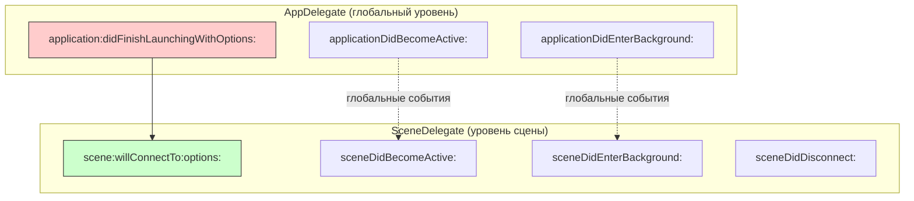
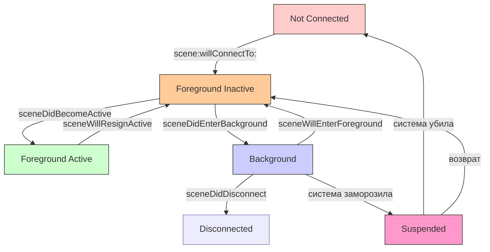

#ios #scenedelegate #app-lifecycle #multitasking #ipad #ios13 #swift #uikit

---
### Определение

**SceneDelegate** — это ключевой класс в современных [[UIKit]]-приложениях ([[iOS]] 13+), который отвечает за **жизненный цикл отдельной сцены** (окна) приложения.

С появлением многозадачности на iPad, Split View, Slide Over, Stage Manager, внешних дисплеев и нескольких окон на Mac Catalyst, Apple разделила ответственность:

- **[[AppDelegate]]** — управляет **всем приложением** глобально (push-токены, запуск, аналитика, глобальные сервисы)
- **SceneDelegate** — управляет **каждым отдельным окном/сценой** (создание окна, rootViewController, состояния конкретного окна)



---

### Когда и зачем появился SceneDelegate (короткая история)

| Версия iOS        | Что изменилось                                                                    |
| ----------------- | --------------------------------------------------------------------------------- |
| **До iOS 13**     | Весь жизненный цикл был в **AppDelegate**                                         |
| **iOS 13 (2019)** | Apple ввела **[[UIScene]]** и **UIWindowSceneDelegate**                           |
| **iOS 14+**       | SceneDelegate стал обязательным для iPad многозадачности                          |
| **iOS 15+**       | Stage Manager использует SceneDelegate для управления окнами                      |
| **iOS 19 (2026)** | SceneDelegate — стандарт для всех UIKit-приложений, поддерживающих несколько сцен |

В 2026 году (iOS 19+) это **стандарт** для всех приложений, поддерживающих несколько сцен. Новый проект в Xcode 17+ по умолчанию использует **SceneDelegate** + `@main`.

---

### Основные состояния сцены (и методы SceneDelegate)

| Состояние сцены         | Когда происходит                                      | Метод в SceneDelegate            | Что обычно делают здесь                              |
| ----------------------- | ----------------------------------------------------- | -------------------------------- | ---------------------------------------------------- |
| **Not Connected**       | Сцена ещё не создана                                  | —                                | —                                                    |
| **Foreground Inactive** | Сцена создана, но не в фокусе (например, при запуске) | [[scene(willConnectTo options)]] | Создание окна, rootViewController, настройка UI      |
| **Foreground Active**   | Сцена на экране, пользователь взаимодействует         | [[sceneDidBecomeActive]]         | Запуск анимаций, обновление данных, проверка токенов |
| **Background**          | Сцена ушла в фон (другое окно впереди)                | [[sceneDidEnterBackground]]      | Сохранение состояния сцены, остановка таймеров       |
| **Suspended**           | Система заморозила сцену (нет CPU)                    | —                                | Ничего (может быть убита)                            |
| **Disconnected**        | Сцена закрыта или удалена системой                    | [[sceneDidDisconnect]]           | Освобождение ресурсов сцены                          |



---

### Самый важный метод — `scene(_:willConnectTo:options:)`

Это аналог `didFinishLaunchingWithOptions` из AppDelegate, но **для каждой сцены**.

```swift
func scene(_ scene: UIScene,
           willConnectTo session: UISceneSession,
           options connectionOptions: UIScene.ConnectionOptions) {
    
    // 1. Проверяем, что это именно UIWindowScene
    guard let windowScene = (scene as? UIWindowScene) else { return }
    
    // 2. Создаём окно для этой сцены
    let window = UIWindow(windowScene: windowScene)
    self.window = window
    
    // 3. Настраиваем rootViewController
    let rootVC = MainTabBarController()
    window.rootViewController = rootVC
    
    // 4. Делаем окно видимым и ключевым
    window.makeKeyAndVisible()
    
    // 5. (Опционально) обрабатываем launch options для этой сцены
    if let shortcutItem = connectionOptions.shortcutItem {
        handleShortcut(shortcutItem)
    }
    
    if let urlContext = connectionOptions.urlContexts.first {
        handleURLContext(urlContext)
    }
    
    if let userActivity = connectionOptions.userActivities.first {
        handleUserActivity(userActivity)
    }
}
```

---

### Полный современный SceneDelegate 2026

```swift
import UIKit

class SceneDelegate: UIResponder, UIWindowSceneDelegate {
    
    var window: UIWindow?
    private var backgroundTaskId: UIBackgroundTaskIdentifier = .invalid
    
    // MARK: - Scene Lifecycle
    
    // Самый важный метод — создание сцены
    func scene(_ scene: UIScene,
               willConnectTo session: UISceneSession,
               options connectionOptions: UIScene.ConnectionOptions) {
        
        print("🔗 scene(_:willConnectTo:options:)")
        
        guard let windowScene = (scene as? UIWindowScene) else { return }
        
        let window = UIWindow(windowScene: windowScene)
        self.window = window
        
        // Настраиваем корневой контроллер
        let rootVC = MainTabBarController()
        window.rootViewController = rootVC
        
        // Делаем окно видимым
        window.makeKeyAndVisible()
        
        // Обрабатываем опции запуска
        handleLaunchOptions(connectionOptions)
    }
    
    // Сцена стала активной (пользователь видит это окно)
    func sceneDidBecomeActive(_ scene: UIScene) {
        print("✅ sceneDidBecomeActive")
        // Обновление данных, возобновление анимаций
        refreshDataIfNeeded()
        resumeAnimations()
    }
    
    // Сцена временно неактивна (уведомление, звонок и т.д.)
    func sceneWillResignActive(_ scene: UIScene) {
        print("⚠️ sceneWillResignActive")
        // Пауза анимаций, видео, таймеров
        pauseAnimations()
        pauseMedia()
    }
    
    // Сцена ушла в фон
    func sceneDidEnterBackground(_ scene: UIScene) {
        print("⏸ sceneDidEnterBackground")
        
        startBackgroundTask()
        
        // Сохранить состояние этой сцены
        saveSceneState()
        
        // Освободить ресурсы
        freeMemoryResources()
        
        endBackgroundTask()
    }
    
    // Сцена вернётся на передний план
    func sceneWillEnterForeground(_ scene: UIScene) {
        print("🔄 sceneWillEnterForeground")
        // Подготовить UI, обновить данные
        prepareForForeground()
    }
    
    // Сцена будет отключена (закрыта, удалена системой)
    func sceneDidDisconnect(_ scene: UIScene) {
        print("🔌 sceneDidDisconnect")
        // Освободить ресурсы этой сцены
        cleanupSceneResources()
        window = nil
    }
    
    // MARK: - Launch Options Handling
    private func handleLaunchOptions(_ options: UIScene.ConnectionOptions) {
        if let shortcut = options.shortcutItem {
            handleShortcut(shortcut)
        }
        
        if let urlContext = options.urlContexts.first {
            handleURLContext(urlContext)
        }
        
        if let userActivity = options.userActivities.first {
            handleUserActivity(userActivity)
        }
    }
    
    // MARK: - Background Task
    private func startBackgroundTask() {
        backgroundTaskId = UIApplication.shared.beginBackgroundTask { [weak self] in
            self?.endBackgroundTask()
        }
        print("📱 Background task started")
    }
    
    private func endBackgroundTask() {
        guard backgroundTaskId != .invalid else { return }
        UIApplication.shared.endBackgroundTask(backgroundTaskId)
        backgroundTaskId = .invalid
        print("✅ Background task ended")
    }
    
    // MARK: - Handlers
    private func handleShortcut(_ shortcut: UIApplicationShortcutItem) {
        print("⚡️ Shortcut: \(shortcut.type)")
        NotificationCenter.default.post(name: .shortcutReceived, object: shortcut)
    }
    
    private func handleURLContext(_ context: UIOpenURLContext) {
        print("🔗 URL: \(context.url)")
        NotificationCenter.default.post(name: .deepLinkReceived, object: context.url)
    }
    
    private func handleUserActivity(_ activity: NSUserActivity) {
        print("📱 User activity: \(activity.activityType)")
        NotificationCenter.default.post(name: .userActivityReceived, object: activity)
    }
    
    // MARK: - Helpers
    private func refreshDataIfNeeded() {
        let lastRefresh = UserDefaults.standard.object(forKey: "lastRefresh") as? Date ?? .distantPast
        if Date().timeIntervalSince(lastRefresh) > 60 {
            print("🔄 Refreshing data")
            UserDefaults.standard.set(Date(), forKey: "lastRefresh")
        }
    }
    
    private func resumeAnimations() { print("▶️ Animations resumed") }
    private func pauseAnimations() { print("⏸ Animations paused") }
    private func pauseMedia() { print("⏸ Media paused") }
    private func prepareForForeground() { print("🔄 Preparing for foreground") }
    private func saveSceneState() { print("💾 Scene state saved") }
    private func freeMemoryResources() { print("🧹 Memory freed") }
    private func cleanupSceneResources() { print("🧹 Scene resources cleaned") }
}

// MARK: - Notifications
extension Notification.Name {
    static let shortcutReceived = Notification.Name("shortcutReceived")
    static let deepLinkReceived = Notification.Name("deepLinkReceived")
    static let userActivityReceived = Notification.Name("userActivityReceived")
}
```

---

### Отличия AppDelegate vs SceneDelegate (таблица 2026)

| Характеристика | AppDelegate | SceneDelegate |
|---|---|---|
| **Управляет** | Всем приложением глобально | Конкретной сценой (окном) |
| **Сколько экземпляров** | Один на приложение | Один на каждую сцену (может быть несколько) |
| **didFinishLaunchingWithOptions** | Да (глобальный запуск) | Нет (только willConnectTo) |
| **Создание окна** | Старый способ (до iOS 13) | `window = UIWindow(windowScene:)` |
| **Поддержка нескольких окон** | Ограниченная | Полная (Split View, Stage Manager, внешний дисплей) |
| **Push-токены, глобальные уведомления** | Да | Нет (регистрирует AppDelegate) |
| **Состояния сцены (active, background)** | Глобальные | Локальные для каждой сцены |
| **Когда использовать** | Глобальная инициализация | UI-логика для каждого окна |

```swift
// AppDelegate — глобальная инициализация
@main
class AppDelegate: UIResponder, UIApplicationDelegate {
    
    func application(_ application: UIApplication,
                     didFinishLaunchingWithOptions launchOptions: [UIApplication.LaunchOptionsKey: Any]?) -> Bool {
        
        // Инициализация Firebase, аналитики, Crashlytics
        FirebaseApp.configure()
        AnalyticsManager.shared.setup()
        
        return true
    }
    
    func applicationDidBecomeActive(_ application: UIApplication) {
        // Глобальная аналитика
        AnalyticsManager.shared.track(event: "app_became_active")
    }
}

// SceneDelegate — UI-логика для сцены
class SceneDelegate: UIResponder, UIWindowSceneDelegate {
    
    var window: UIWindow?
    
    func scene(_ scene: UIScene, willConnectTo session: UISceneSession, options connectionOptions: UIScene.ConnectionOptions) {
        guard let windowScene = scene as? UIWindowScene else { return }
        
        let window = UIWindow(windowScene: windowScene)
        window.rootViewController = MainViewController()
        window.makeKeyAndVisible()
        self.window = window
    }
    
    func sceneDidBecomeActive(_ scene: UIScene) {
        // Обновление UI для конкретной сцены
        refreshUIIfNeeded()
    }
}
```

---

### Поддержка нескольких сцен на iPad

```swift
class SceneDelegate: UIResponder, UIWindowSceneDelegate {
    
    var window: UIWindow?
    private var sceneId: String = ""
    
    func scene(_ scene: UIScene, willConnectTo session: UISceneSession, options connectionOptions: UIScene.ConnectionOptions) {
        sceneId = session.persistentIdentifier
        print("🔗 Scene connected: \(sceneId)")
        
        guard let windowScene = scene as? UIWindowScene else { return }
        
        // Разные конфигурации для разных сцен
        let rootVC: UIViewController
        switch session.configuration.name {
        case "MainScene":
            rootVC = MainViewController()
        case "SecondaryScene":
            rootVC = SecondaryViewController()
        case "SearchScene":
            rootVC = SearchViewController()
        default:
            rootVC = MainViewController()
        }
        
        let window = UIWindow(windowScene: windowScene)
        window.rootViewController = rootVC
        window.makeKeyAndVisible()
        self.window = window
        
        // Регистрируем сцену в менеджере
        SceneManager.shared.registerScene(sceneId, delegate: self)
    }
    
    func sceneDidDisconnect(_ scene: UIScene) {
        print("🔌 Scene disconnected: \(sceneId)")
        
        // Дерегистрируем сцену
        SceneManager.shared.unregisterScene(sceneId)
        
        // Если это была последняя сцена — глобальная очистка
        if SceneManager.shared.activeSceneCount == 0 {
            cleanupGlobalResources()
        }
    }
}

class SceneManager {
    static let shared = SceneManager()
    private var activeScenes: [String: SceneDelegate] = [:]
    
    var activeSceneCount: Int { activeScenes.count }
    
    func registerScene(_ id: String, delegate: SceneDelegate) {
        activeScenes[id] = delegate
        print("📱 Active scenes: \(activeSceneCount)")
    }
    
    func unregisterScene(_ id: String) {
        activeScenes.removeValue(forKey: id)
        print("📱 Active scenes: \(activeSceneCount)")
    }
}
```

---

### SceneDelegate и SwiftUI

В [[SwiftUI]] `SceneDelegate` используется автоматически через `WindowGroup`:

```swift
import SwiftUI

@main
struct MyApp: App {
    var body: some Scene {
        WindowGroup {
            ContentView()
        }
        .onChange(of: scenePhase) { newPhase in
            switch newPhase {
            case .active:
                print("App is active")
            case .inactive:
                print("App is inactive")
            case .background:
                print("App is in background")
            @unknown default:
                break
            }
        }
    }
}
```

Или с ручным `SceneDelegate` для UIKit:

```swift
class SceneDelegate: UIResponder, UIWindowSceneDelegate {
    
    var window: UIWindow?
    
    func scene(_ scene: UIScene, willConnectTo session: UISceneSession, options connectionOptions: UIScene.ConnectionOptions) {
        guard let windowScene = scene as? UIWindowScene else { return }
        
        let window = UIWindow(windowScene: windowScene)
        window.rootViewController = UIHostingController(rootView: ContentView())
        window.makeKeyAndVisible()
        self.window = window
    }
}
```

---

### Как проверить, использует ли проект SceneDelegate

В новом проекте Xcode 17+ → **да**, по умолчанию:

1. **Info.plist** имеет ключ `UIApplicationSceneManifest`
2. Есть класс **SceneDelegate**
3. `@main` стоит над AppDelegate, но сцены включены

Если в Info.plist **нет** `UIApplicationSceneManifest` → проект использует старый lifecycle (только AppDelegate).

```xml
<!-- Info.plist -->
<key>UIApplicationSceneManifest</key>
<dict>
    <key>UIApplicationSupportsMultipleScenes</key>
    <true/>
    <key>UISceneConfigurations</key>
    <dict>
        <key>UIWindowSceneSessionRoleApplication</key>
        <array>
            <dict>
                <key>UISceneConfigurationName</key>
                <string>Default Configuration</string>
                <key>UISceneDelegateClassName</key>
                <string>$(PRODUCT_MODULE_NAME).SceneDelegate</string>
            </dict>
        </array>
    </dict>
</dict>
```

---

### Короткий девиз 2026

> SceneDelegate — это «мозг» **каждого отдельного окна** приложения.
> AppDelegate — «мозг» всего приложения.
> В 2026 году в UIKit-проектах **SceneDelegate** отвечает за создание окна, rootViewController и состояния каждой сцены.
> Без него многозадачность, несколько окон и Stage Manager работать не будут.

---

### Итог

**SceneDelegate** в iOS:

| Аспект | Значение |
|---|---|
| **Появление** | iOS 13 (2019) |
| **Назначение** | Управление жизненным циклом отдельной сцены (окна) |
| **Ключевой метод** | `scene(_:willConnectTo:options:)` — создание окна |
| **Для чего нужен** | Поддержка многозадачности, Split View, Stage Manager |
| **AppDelegate** | Глобальная инициализация, push, аналитика |
| **SwiftUI альтернатива** | `WindowGroup` и `scenePhase` |

**Главное правило:**
> Для новых iOS-приложений (iOS 13+) всегда используй SceneDelegate. AppDelegate оставь для глобальной инициализации (Firebase, аналитика, push). На iPad с многозадачностью SceneDelegate позволяет каждому окну иметь своё состояние. Для SwiftUI используй `WindowGroup` и не создавай SceneDelegate вручную. Если проект использует старый AppDelegate-стиль (без SceneDelegate), его нужно обновить для поддержки многозадачности на iPad. Всегда проверяй `UIApplicationSceneManifest` в Info.plist. Помни, что SceneDelegate может быть вызван несколько раз (для каждого окна) на iPad. Используй идентификатор сцены для различения окон. При закрытии окна не забывай освобождать ресурсы в `sceneDidDisconnect`. Для Handoff и State Restoration используй `NSUserActivity` в SceneDelegate. В SwiftUI используй `@SceneStorage` для сохранения состояния каждой сцены. Для глубоких ссылок обрабатывай `connectionOptions.urlContexts`. Для Shortcuts используй `connectionOptions.shortcutItem`. Для User Activities используй `connectionOptions.userActivities`. Каждое окно может иметь свой rootViewController и навигацию. Используй разные конфигурации сцен для разных типов окон (главное, поиск, настройки). В Info.plist укажи `UISceneConfigurations` для поддержки разных конфигураций. Для работы с несколькими окнами используй `UIApplication.shared.openSessions`. Для закрытия окон используй `scene.session` и `UIApplication.shared.requestSceneSessionDestruction`.