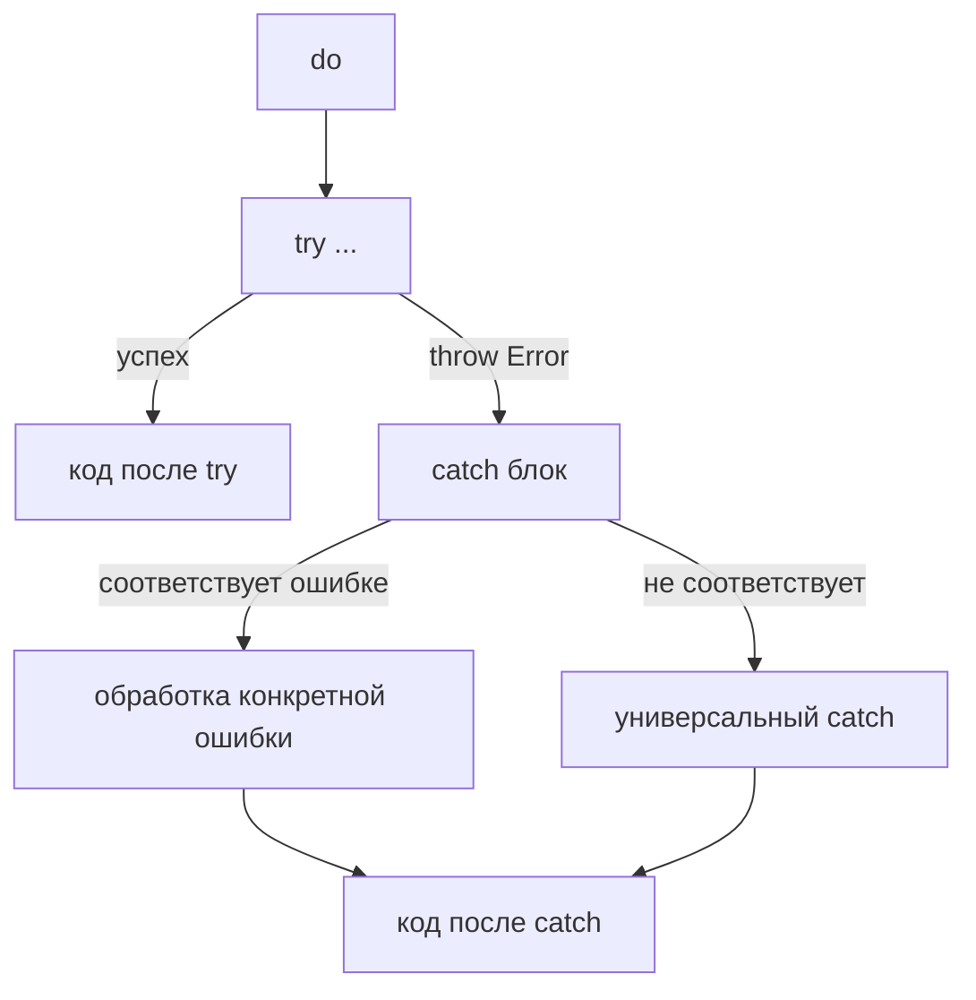

**`catch`** — это ключевая часть конструкции **обработки ошибок** в Swift (`do-try-catch`), которая **перехватывает** и позволяет **реагировать** на ошибки, выброшенные с помощью `throw`.

Без `catch` любая ошибка, выброшенная через `try`, привела бы к **аварийному завершению программы** (fatal error).  
С `catch` ты получаешь полный контроль: можешь обработать конкретные типы ошибок, показать пользователю сообщение, повторить попытку, записать в лог или просто проигнорировать.

### 1. Как работает `do-try-catch` (самая важная схема)



- `do` — начало блока, в котором может быть выброшена ошибка
- `try` — перед вызовом функции/метода, которая может выбросить ошибку
- `catch` — перехватывает ошибку и даёт возможность её обработать

### 2. Полный разбор всех вариантов catch (2026 актуально)

#### Вариант 1: Простой универсальный catch (самый частый)

```swift
do {
    try fileManager.removeItem(at: url)
} catch {
    print("Не удалось удалить файл: \(error.localizedDescription)")
}
```

- `error` — это **любая** ошибка, соответствующая протоколу `Error`
- Очень удобно для быстрого прототипа и логирования

#### Вариант 2: Ловим конкретный тип ошибки (рекомендуемый стиль)

```swift
enum AuthError: Error {
    case wrongPassword
    case userNotFound
    case networkTimeout
}

do {
    try authenticate()
} catch AuthError.wrongPassword {
    showAlert("Неверный пароль")
} catch AuthError.userNotFound {
    showAlert("Пользователь не найден")
} catch AuthError.networkTimeout {
    showAlert("Нет соединения с сервером")
} catch {
    showAlert("Неизвестная ошибка: \(error)")
}
```

**Золотое правило 2026**:  
Всегда ставь **универсальный `catch`** последним — он ловит всё, что не поймали выше.

#### Вариант 3: Catch с распаковкой associated values (очень мощно)

```swift
enum APIError: Error {
    case server(statusCode: Int, message: String)
    case decodingFailed
}

do {
    try fetchUser()
} catch APIError.server(let code, let message) {
    print("Сервер ответил \(code): \(message)")
} catch {
    print("Другая ошибка: \(error)")
}
```

#### Вариант 4: Catch в async/await (самый частый в 2026)

```swift
Task {
    do {
        let data = try await network.fetchUser()
        await MainActor.run {
            updateUI(with: data)
        }
    } catch NetworkError.timeout {
        await showTimeoutAlert()
    } catch {
        await showGenericError(error)
    }
}
```

**Важно**: в `async` функциях `catch` работает точно так же, но почти всегда оборачивается в `Task {}` или `await`.

#### Вариант 5: try? и try! — когда catch не нужен

```swift
// try? — возвращает Optional, ошибка превращается в nil
let data = try? JSONDecoder().decode(User.self, from: jsonData)
if let user = data {
    // успех
} else {
    // ошибка, но мы не знаем какая
}

// try! — force try, если ошибка — краш
let user = try! JSONDecoder().decode(User.self, from: jsonData) // опасно!
```

**Рекомендация 2026**:  
`try?` — только когда ошибка не критична и не нужно её обрабатывать.  
`try!` — **только** в тестах или когда ты на 100% уверен (очень редко).

### 3. Лучшие практики catch в Swift 2026

- **Всегда** ставь универсальный `catch` последним — ловит всё непредвиденное  
- **Лови конкретные ошибки первыми** — `catch SpecificError` перед `catch`  
- **Используй `localizedDescription`** для показа пользователю  
- **Логируй** неизвестные ошибки: `print(error)` или Crashlytics  
- **В UI** — показывай алерт только в `catch`, а не внутри `try`  
- **В async** — оборачивай в `Task {}` и обновляй UI через `await MainActor.run`  
- **Swift 6 strict concurrency** — `catch` безопасен, но весь блок `do-try-catch` должен быть на одном акторе  
- **Документируйте** — пиши комментарий «catch — обработка ошибок авторизации»

**Короткий девиз 2026**:
> `catch` — это когда ты говоришь: «если что-то пойдёт не так — я готов».  
> В 2026 году:  
> - конкретные ошибки → сверху  
> - универсальный `catch` → снизу  
> - `try?` — когда ошибка не важна  
> - `try!` — почти никогда  
> Это **единственный правильный** способ безопасно работать с `throws` в Swift.

Удачи с надёжной и понятной обработкой ошибок в твоём коде! 🛡️