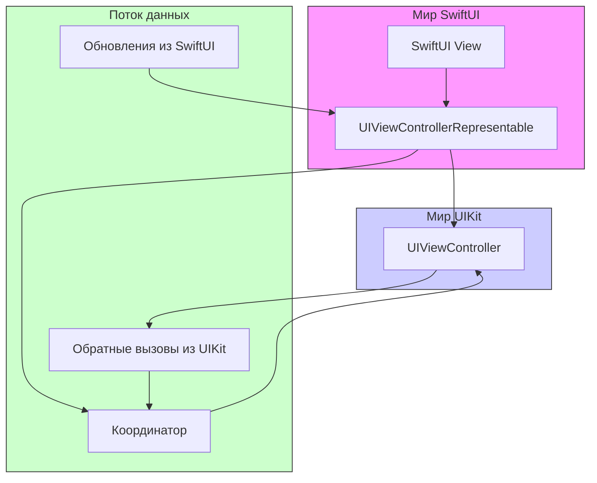

#swiftui #uikit #integration #uiviewcontrollerrepresentable #representable #protocol #swift 

---
## UIViewControllerRepresentable

### Определение
**UIViewControllerRepresentable** — это протокол в [[SwiftUI]], который позволяет оборачивать и использовать контроллеры представлений ([[UIViewController]]) из [[UIKit]] в иерархии представлений SwiftUI . Он служит мостом между двумя фреймворками, давая разработчикам возможность использовать богатый функционал UIKit (например, [[UIImagePickerController]], [[UINavigationController]], [[UITableViewController]] и другие) внутри приложений, написанных на [[SwiftUI]] .

Этот протокол является фундаментальным инструментом для постепенной миграции проектов с UIKit на SwiftUI, а также для использования тех компонентов UIKit, которые пока не имеют аналогов в SwiftUI или сложны для реализации декларативным способом.

### Зачем это знать iOS-разработчику?
1.  **Интеграция существующего кода:** Позволяет переиспользовать готовые контроллеры из UIKit в новых SwiftUI-проектах.
2.  **Доступ к недостающим компонентам:** Некоторые сложные компоненты (например, [[UIDocumentPicker]], [[UIActivityViewController]], кастомные камеры) проще реализовать через UIKit и затем обернуть в SwiftUI .
3.  **Постепенная миграция:** Дает возможность постепенно переводить проект с UIKit на SwiftUI, не переписывая все сразу.
4.  **Использование проверенных решений:** Многие разработчики имеют обширные библиотеки кастомных UIKit-контроллеров, которые можно продолжить использовать.
5.  **Глубокое понимание связи UIKit и SwiftUI:** Понимание этого протокола необходимо для решения сложных задач взаимодействия двух фреймворков.

---

### Архитектура и принцип работы



**Принцип работы:**
1.  **Создание:** SwiftUI создает экземпляр `UIViewControllerRepresentable`.
2.  **Генерация UIKit-контроллера:** SwiftUI вызывает метод `makeUIViewController(context:)`, который должен создать и настроить `UIViewController`.
3.  **Обновление:** Когда состояние SwiftUI-представления меняется, SwiftUI вызывает `updateUIViewController(_:context:)`, давая возможность обновить контроллер новыми данными.
4.  **Координатор:** Опциональный объект-координатор (`Coordinator`), который управляет обратными вызовами из UIKit и помогает синхронизировать данные между двумя мирами.
5.  **Уничтожение:** Когда представление покидает иерархию, SwiftUI автоматически освобождает контроллер.

---

### Протокол UIViewControllerRepresentable

```swift
public protocol UIViewControllerRepresentable : View where Self.Body == Never {
    /// Тип оборачиваемого контроллера
    associatedtype UIViewControllerType : UIViewController

    /// Создает контроллер и настраивает его начальное состояние
    func makeUIViewController(context: Context) -> UIViewControllerType

    /// Обновляет контроллер при изменении состояния SwiftUI-представления
    func updateUIViewController(_ uiViewController: UIViewControllerType, context: Context)

    /// Создает координатор для обработки событий UIKit
    func makeCoordinator() -> Coordinator

    /// Тип координатора
    associatedtype Coordinator = Void
}
```

### Ключевые компоненты

#### 1. makeUIViewController(context:)
Обязательный метод, который вызывается **один раз** при создании контроллера. Здесь происходит:
- Инициализация контроллера
- Начальная настройка свойств
- Установка делегата (обычно на координатор)
- Конфигурация, не зависящая от данных

#### 2. updateUIViewController(_:context:)
Обязательный метод, который вызывается **каждый раз**, когда изменяется состояние SwiftUI-представления или приходят новые данные. Здесь обновляются:
- Свойства контроллера
- Данные для отображения
- Состояние UI-элементов

#### 3. makeCoordinator()
Опциональный метод, создающий координатор. Вызывается до `makeUIViewController`, и созданный координатор передается в контекст. Координатор обычно используется как делегат UIKit-контроллера и содержит логику обратных вызовов.

#### 4. Context
Структура, передаваемая в методы, которая содержит:
- **coordinator:** Созданный координатор
- **transaction:** Текущая транзакция с анимациями
- **environment:** Окружение SwiftUI (значения из `@Environment`)

---

### Примеры от простого к сложному

#### Уровень 0: Интеграция Activity View Controller (UIActivityViewController)

```swift
import SwiftUI
import UIKit

// Простая обертка для UIActivityViewController
struct ActivityView: UIViewControllerRepresentable {
    let activityItems: [Any]
    let applicationActivities: [UIActivity]? = nil
    
    func makeUIViewController(context: Context) -> UIActivityViewController {
        UIActivityViewController(activityItems: activityItems,
                               applicationActivities: applicationActivities)
    }
    
    func updateUIViewController(_ uiViewController: UIActivityViewController, context: Context) {
        // Ничего не обновляем
    }
}

// Использование в SwiftUI
struct ContentView: View {
    @State private var isShowingShareSheet = false
    let textToShare = "Hello, SwiftUI!"
    
    var body: some View {
        Button("Поделиться") {
            isShowingShareSheet = true
        }
        .sheet(isPresented: $isShowingShareSheet) {
            ActivityView(activityItems: [textToShare])
        }
    }
}
```

#### Уровень 1: Интеграция UIImagePickerController

```swift
import SwiftUI
import UIKit

struct ImagePicker: UIViewControllerRepresentable {
    @Binding var selectedImage: UIImage?
    @Environment(\.presentationMode) var presentationMode
    
    // MARK: - UIViewControllerRepresentable
    func makeUIViewController(context: Context) -> UIImagePickerController {
        let picker = UIImagePickerController()
        picker.delegate = context.coordinator
        picker.sourceType = .photoLibrary
        picker.allowsEditing = false
        return picker
    }
    
    func updateUIViewController(_ uiViewController: UIImagePickerController, context: Context) {
        // Ничего не обновляем
    }
    
    func makeCoordinator() -> Coordinator {
        Coordinator(self)
    }
    
    // MARK: - Coordinator
    class Coordinator: NSObject, UIImagePickerControllerDelegate, UINavigationControllerDelegate {
        let parent: ImagePicker
        
        init(_ parent: ImagePicker) {
            self.parent = parent
        }
        
        func imagePickerController(_ picker: UIImagePickerController,
                                  didFinishPickingMediaWithInfo info: [UIImagePickerController.InfoKey: Any]) {
            if let image = info[.originalImage] as? UIImage {
                parent.selectedImage = image
            }
            parent.presentationMode.wrappedValue.dismiss()
        }
        
        func imagePickerControllerDidCancel(_ picker: UIImagePickerController) {
            parent.presentationMode.wrappedValue.dismiss()
        }
    }
}

// Использование
struct ContentView: View {
    @State private var image: UIImage?
    @State private var isShowingPicker = false
    
    var body: some View {
        VStack {
            if let image = image {
                Image(uiImage: image)
                    .resizable()
                    .scaledToFit()
                    .frame(height: 200)
            } else {
                Text("Выберите изображение")
            }
            
            Button("Выбрать фото") {
                isShowingPicker = true
            }
        }
        .sheet(isPresented: $isShowingPicker) {
            ImagePicker(selectedImage: $image)
        }
    }
}
```

#### Уровень 2: Интеграция кастомного ViewController с обратной связью

```swift
import SwiftUI
import UIKit

// Кастомный UIKit контроллер
class CounterViewController: UIViewController {
    private let label = UILabel()
    private let button = UIButton()
    
    var onButtonTap: (() -> Void)?
    
    var count: Int = 0 {
        didSet {
            label.text = "Счет: \(count)"
        }
    }
    
    override func viewDidLoad() {
        super.viewDidLoad()
        setupUI()
    }
    
    private func setupUI() {
        view.backgroundColor = .systemBackground
        
        label.text = "Счет: 0"
        label.font = .systemFont(ofSize: 24, weight: .bold)
        label.textAlignment = .center
        
        button.setTitle("Увеличить", for: .normal)
        button.backgroundColor = .systemBlue
        button.layer.cornerRadius = 8
        button.addTarget(self, action: #selector(buttonTapped), for: .touchUpInside)
        
        [label, button].forEach {
            $0.translatesAutoresizingMaskIntoConstraints = false
            view.addSubview($0)
        }
        
        NSLayoutConstraint.activate([
            label.centerXAnchor.constraint(equalTo: view.centerXAnchor),
            label.centerYAnchor.constraint(equalTo: view.centerYAnchor, constant: -30),
            
            button.centerXAnchor.constraint(equalTo: view.centerXAnchor),
            button.topAnchor.constraint(equalTo: label.bottomAnchor, constant: 30),
            button.widthAnchor.constraint(equalToConstant: 150),
            button.heightAnchor.constraint(equalToConstant: 50)
        ])
    }
    
    @objc private func buttonTapped() {
        onButtonTap?()
    }
}

// SwiftUI обертка
struct CounterView: UIViewControllerRepresentable {
    @Binding var count: Int
    var onButtonTap: (() -> Void)?
    
    func makeUIViewController(context: Context) -> CounterViewController {
        let controller = CounterViewController()
        controller.onButtonTap = {
            context.coordinator.buttonTapped()
        }
        return controller
    }
    
    func updateUIViewController(_ uiViewController: CounterViewController, context: Context) {
        uiViewController.count = count
    }
    
    func makeCoordinator() -> Coordinator {
        Coordinator(self)
    }
    
    class Coordinator {
        let parent: CounterView
        
        init(_ parent: CounterView) {
            self.parent = parent
        }
        
        func buttonTapped() {
            parent.count += 1
            parent.onButtonTap?()
        }
    }
}

// Использование
struct ContentView: View {
    @State private var counter = 0
    
    var body: some View {
        VStack {
            Text("SwiftUI счет: \(counter)")
                .font(.headline)
            
            CounterView(count: $counter) {
                print("Кнопка нажата! Новое значение: \(counter)")
            }
            .frame(height: 200)
        }
        .padding()
    }
}
```

#### Уровень 3: Интеграция с передачей данных окружения

```swift
import SwiftUI
import UIKit

// Модель данных
struct User: Codable {
    var name: String
    var age: Int
}

// UIKit контроллер для отображения профиля
class ProfileViewController: UIViewController {
    private let nameLabel = UILabel()
    private let ageLabel = UILabel()
    private let stackView = UIStackView()
    
    var user: User? {
        didSet {
            updateUI()
        }
    }
    
    override func viewDidLoad() {
        super.viewDidLoad()
        setupUI()
    }
    
    private func setupUI() {
        view.backgroundColor = .systemGray6
        view.layer.cornerRadius = 12
        view.layer.masksToBounds = true
        
        stackView.axis = .vertical
        stackView.spacing = 10
        stackView.alignment = .center
        stackView.distribution = .fill
        
        nameLabel.font = .systemFont(ofSize: 18, weight: .medium)
        ageLabel.font = .systemFont(ofSize: 16, weight: .regular)
        ageLabel.textColor = .secondaryLabel
        
        [nameLabel, ageLabel].forEach { stackView.addArrangedSubview($0) }
        
        stackView.translatesAutoresizingMaskIntoConstraints = false
        view.addSubview(stackView)
        
        NSLayoutConstraint.activate([
            stackView.centerXAnchor.constraint(equalTo: view.centerXAnchor),
            stackView.centerYAnchor.constraint(equalTo: view.centerYAnchor)
        ])
    }
    
    private func updateUI() {
        guard let user = user else { return }
        nameLabel.text = user.name
        ageLabel.text = "Возраст: \(user.age)"
    }
}

// SwiftUI обертка с использованием Environment
struct ProfileCard: UIViewControllerRepresentable {
    @EnvironmentObject var userSettings: UserSettings
    var style: ProfileStyle
    
    enum ProfileStyle {
        case compact, regular
        
        var backgroundColor: UIColor {
            switch self {
            case .compact: return .systemGray5
            case .regular: return .systemBackground
            }
        }
    }
    
    func makeUIViewController(context: Context) -> ProfileViewController {
        ProfileViewController()
    }
    
    func updateUIViewController(_ uiViewController: ProfileViewController, context: Context) {
        uiViewController.user = userSettings.currentUser
        uiViewController.view.backgroundColor = style.backgroundColor
    }
    
    func makeCoordinator() -> Coordinator {
        Coordinator()
    }
    
    class Coordinator { }
}

// Класс для Environment
class UserSettings: ObservableObject {
    @Published var currentUser = User(name: "Иван", age: 30)
}

// Использование
struct ContentView: View {
    @StateObject private var settings = UserSettings()
    
    var body: some View {
        VStack(spacing: 20) {
            ProfileCard(style: .compact)
                .frame(height: 100)
                .environmentObject(settings)
            
            ProfileCard(style: .regular)
                .frame(height: 150)
                .environmentObject(settings)
            
            Button("Обновить пользователя") {
                settings.currentUser = User(name: "Петр", age: 25)
            }
        }
        .padding()
    }
}
```

#### Уровень 4: Интеграция сложного контроллера с множеством обратных вызовов

```swift
import SwiftUI
import UIKit
import WebKit

// UIKit контроллер для WebView
class WebViewController: UIViewController, WKNavigationDelegate, WKUIDelegate {
    var webView: WKWebView!
    var onPageLoaded: ((Double) -> Void)?
    var onTitleChanged: ((String) -> Void)?
    var onNavigationChange: ((NavigationAction) -> Void)?
    
    enum NavigationAction {
        case started, finished, failed(Error)
    }
    
    var url: URL? {
        didSet {
            if let url = url, isViewLoaded {
                loadURL(url)
            }
        }
    }
    
    override func loadView() {
        let config = WKWebViewConfiguration()
        webView = WKWebView(frame: .zero, configuration: config)
        webView.navigationDelegate = self
        webView.uiDelegate = self
        view = webView
    }
    
    override func viewDidLoad() {
        super.viewDidLoad()
        if let url = url {
            loadURL(url)
        }
    }
    
    private func loadURL(_ url: URL) {
        webView.load(URLRequest(url: url))
    }
    
    // MARK: - WKNavigationDelegate
    func webView(_ webView: WKWebView, didStartProvisionalNavigation navigation: WKNavigation!) {
        onNavigationChange?(.started)
    }
    
    func webView(_ webView: WKWebView, didFinish navigation: WKNavigation!) {
        onNavigationChange?(.finished)
        
        // Оценка прогресса (имитация)
        onPageLoaded?(1.0)
        
        // Получение заголовка
        webView.evaluateJavaScript("document.title") { result, error in
            if let title = result as? String {
                self.onTitleChanged?(title)
            }
        }
    }
    
    func webView(_ webView: WKWebView, didFail navigation: WKNavigation!, withError error: Error) {
        onNavigationChange?(.failed(error))
    }
}

// SwiftUI обертка
struct WebView: UIViewControllerRepresentable {
    let url: URL
    var onPageLoaded: ((Double) -> Void)?
    var onTitleChanged: ((String) -> Void)?
    var onNavigationChange: ((WebViewController.NavigationAction) -> Void)?
    
    func makeUIViewController(context: Context) -> WebViewController {
        let controller = WebViewController()
        controller.onPageLoaded = context.coordinator.onPageLoaded
        controller.onTitleChanged = context.coordinator.onTitleChanged
        controller.onNavigationChange = context.coordinator.onNavigationChange
        return controller
    }
    
    func updateUIViewController(_ uiViewController: WebViewController, context: Context) {
        uiViewController.url = url
        // Обновляем замыкания на случай их изменения
        uiViewController.onPageLoaded = context.coordinator.onPageLoaded
        uiViewController.onTitleChanged = context.coordinator.onTitleChanged
        uiViewController.onNavigationChange = context.coordinator.onNavigationChange
    }
    
    func makeCoordinator() -> Coordinator {
        Coordinator(self)
    }
    
    class Coordinator {
        let parent: WebView
        
        init(_ parent: WebView) {
            self.parent = parent
        }
        
        lazy var onPageLoaded: (Double) -> Void = { [weak self] progress in
            self?.parent.onPageLoaded?(progress)
        }
        
        lazy var onTitleChanged: (String) -> Void = { [weak self] title in
            self?.parent.onTitleChanged?(title)
        }
        
        lazy var onNavigationChange: (WebViewController.NavigationAction) -> Void = { [weak self] action in
            self?.parent.onNavigationChange?(action)
        }
    }
}

// Использование
struct ContentView: View {
    @State private var pageTitle = "Загрузка..."
    @State private var isLoading = true
    @State private var errorMessage: String?
    
    var body: some View {
        VStack {
            Text(pageTitle)
                .font(.headline)
                .padding()
            
            if isLoading {
                ProgressView("Загрузка страницы...")
                    .padding()
            }
            
            if let error = errorMessage {
                Text(error)
                    .foregroundColor(.red)
                    .padding()
            }
            
            WebView(url: URL(string: "https://www.apple.com")!,
                   onPageLoaded: { progress in
                print("Загрузка завершена с прогрессом: \(progress)")
            },
                   onTitleChanged: { title in
                pageTitle = title
            },
                   onNavigationChange: { action in
                switch action {
                case .started:
                    isLoading = true
                    errorMessage = nil
                case .finished:
                    isLoading = false
                case .failed(let error):
                    isLoading = false
                    errorMessage = error.localizedDescription
                }
            })
        }
    }
}
```

---

### Важные нюансы и Best Practices

#### 1. **Жизненный цикл контроллера**
- `makeUIViewController` вызывается только один раз.
- `updateUIViewController` может вызываться часто — не делайте здесь тяжелых операций.
- Контроллер автоматически освобождается, когда SwiftUI-представление покидает иерархию .

#### 2. **Использование координатора**
Координатор — лучшее место для:
- Реализации делегатов UIKit
- Хранения слабых ссылок на parent (чтобы избежать циклов)
- Обработки событий из UIKit и передачи их в SwiftUI .

```swift
class Coordinator: NSObject, SomeUIKitDelegate {
    weak var parent: SomeView?
    
    init(_ parent: SomeView) {
        self.parent = parent
    }
    
    // Методы делегата...
}
```

#### 3. **Управление размером**
SwiftUI контролирует размер представления через фрейм. Контроллер должен правильно реагировать на изменения размера (например, используя Auto Layout).

```swift
func updateUIViewController(_ uiViewController: MyController, context: Context) {
    // SwiftUI автоматически управляет размером, 
    // но контроллер должен быть готов к изменению фрейма
}
```

#### 4. **Передача данных**
- Используйте `@Binding` для двусторонней синхронизации.
- Используйте замыкания для обратных вызовов.
- Для сложных данных используйте наблюдаемые объекты (`ObservableObject`) .

#### 5. **Обработка ошибок**
Всегда предусматривайте обработку ошибок, особенно при работе с контроллерами, которые могут их генерировать (например, `UIImagePickerController` при отсутствии доступа к камере).

#### 6. **Производительность**
- Минимизируйте работу в `updateUIViewController`.
- Используйте `DispatchQueue.main.async` при необходимости обновления SwiftUI-состояния из координатора .

#### 7. **Совместимость с модификаторами SwiftUI**
Обернутый контроллер можно использовать с обычными модификаторами SwiftUI (`.frame`, `.padding`, `.background` и т.д.), что дает дополнительную гибкость .

### Итог
**UIViewControllerRepresentable** — это мощный мост между UIKit и SwiftUI, позволяющий:
1.  **Интегрировать существующие UIKit-контроллеры** в новые SwiftUI-приложения.
2.  **Использовать богатый функционал UIKit** там, где SwiftUI пока недостаточно гибок.
3.  **Постепенно мигрировать проекты** с UIKit на SwiftUI.
4.  **Создавать сложные компоненты** с полным контролем над поведением.

Ключевые навыки: понимание жизненного цикла, правильное использование координатора для обратных вызовов, эффективное обновление контроллера при изменении данных, управление памятью через слабые ссылки.