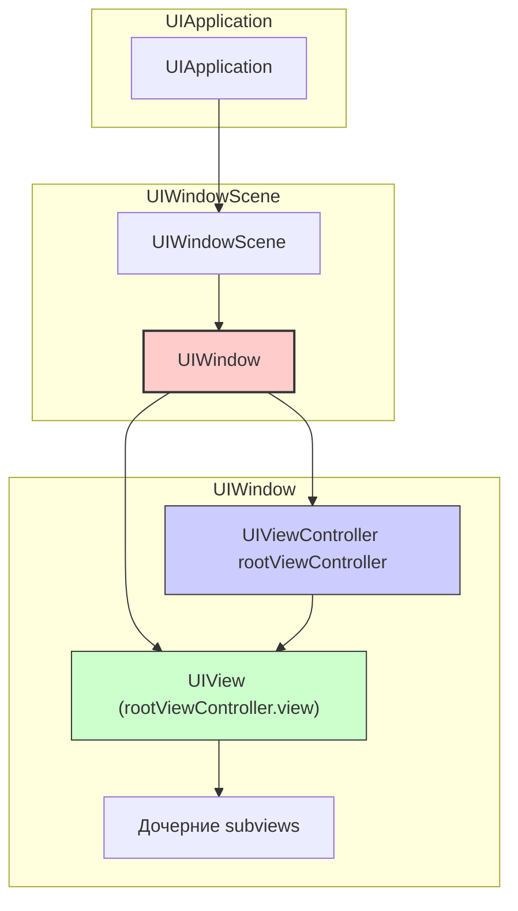

#uikit #uiwindow #ios #app-lifecycle #scenedelegate #multitasking #window

---
## UIWindow — Корневой контейнер для UI

### Определение
**UIWindow** — это фундаментальный класс в [[UIKit]], который служит **корневым контейнером** для всех визуальных элементов приложения. Он является связующим звеном между приложением и экраном устройства, управляя отображением иерархии представлений (views) и маршрутизацией событий (касания, жесты, клавиатура) .

Каждое [[iOS]]-приложение имеет как минимум одно окно (`UIWindow`), которое отображается на экране. Окно не имеет собственного визуального содержимого, но содержит корневой контроллер (`rootViewController`), чьё представление (`view`) занимает всё окно и является корнем всей иерархии UI.

### Зачем это знать iOS-разработчику?
1.  **Корень всей иерархии:** Понимание UIWindow необходимо для правильной настройки начального экрана приложения.
2.  **Переключение экранов:** Через `window.rootViewController` можно программно менять основной экран приложения (например, при выходе из аккаунта).
3.  **Модальные окна и алерты:** UIWindow используется для отображения элементов поверх всего приложения (например, кастомных алертов или системных уведомлений).
4.  **Многозадачность и сцены:** В iOS 13+ с появлением [[UIScene]] каждое окно привязано к конкретной сцене ([[UIWindowScene]]).
5.  **Работа с жестами и событиями:** UIWindow является первым получателем событий касания и маршрутизирует их в иерархию view.

---

### Иерархия и архитектура



**Иерархия:**
- **[[UIApplication]]:** Главный объект приложения.
- **UIWindowScene:** Представляет сцену (окно) в многозадачной среде (iOS 13+).
- **UIWindow:** Контейнер для UI, связан с `UIWindowScene`.
- **[[UIViewController]] (rootViewController):** Корневой контроллер, управляющий основным представлением.
- **[[UIView]]:** Корневое представление, занимающее всё окно.

---

### Создание UIWindow

#### 1. **В [[AppDelegate]] ([[iOS]] 12 и ниже)**

```swift
import UIKit

@UIApplicationMain
class AppDelegate: UIResponder, UIApplicationDelegate {
    
    var window: UIWindow?
    
    func application(_ application: UIApplication,
                     didFinishLaunchingWithOptions launchOptions: [UIApplication.LaunchOptionsKey: Any]?) -> Bool {
        
        // Создаем окно с размерами экрана
        window = UIWindow(frame: UIScreen.main.bounds)
        
        // Устанавливаем корневой контроллер
        window?.rootViewController = MainViewController()
        
        // Делаем окно видимым и ключевым
        window?.makeKeyAndVisible()
        
        return true
    }
}
```

#### 2. **В [[SceneDelegate]] (iOS 13+ — современный подход)**

```swift
import UIKit

class SceneDelegate: UIResponder, UIWindowSceneDelegate {
    
    var window: UIWindow?
    
    func scene(_ scene: UIScene,
               willConnectTo session: UISceneSession,
               options connectionOptions: UIScene.ConnectionOptions) {
        
        // 1. Проверяем, что сцена — UIWindowScene
        guard let windowScene = (scene as? UIWindowScene) else { return }
        
        // 2. Создаем окно, связанное со сценой
        let window = UIWindow(windowScene: windowScene)
        self.window = window
        
        // 3. Устанавливаем корневой контроллер
        window.rootViewController = MainViewController()
        
        // 4. Делаем окно видимым и ключевым
        window.makeKeyAndVisible()
    }
}
```

---

### Основные свойства и методы

| Свойство / Метод | Описание |
|---|---|
| **`windowScene`** | Сцена, к которой принадлежит окно (iOS 13+) |
| **`rootViewController`** | Корневой контроллер окна |
| **`isKeyWindow`** | Является ли окно ключевым (получает события) |
| **`screen`** | Экран, на котором отображается окно (iOS 12-) |
| **`makeKeyAndVisible()`** | Делает окно ключевым и видимым |
| **`makeKey()`** | Делает окно ключевым (без изменения видимости) |
| **`resignKey()`** | Убирает статус ключевого окна |

---

### Примеры использования

#### 1. **Смена rootViewController (переключение экранов)**

```swift
class AppDelegate: UIResponder, UIApplicationDelegate {
    var window: UIWindow?
    
    func showLoginScreen() {
        let loginVC = LoginViewController()
        window?.rootViewController = loginVC
        window?.makeKeyAndVisible()
    }
    
    func showMainScreen() {
        let mainVC = MainTabBarController()
        window?.rootViewController = mainVC
        window?.makeKeyAndVisible()
    }
}

// Использование в любом месте приложения
if let appDelegate = UIApplication.shared.delegate as? AppDelegate {
    appDelegate.showLoginScreen()
}
```

#### 2. **Переключение с анимацией**

```swift
func transitionToMainScreen() {
    guard let window = window else { return }
    
    let mainVC = MainTabBarController()
    
    // Анимация перехода
    UIView.transition(with: window,
                      duration: 0.5,
                      options: [.transitionCrossDissolve],
                      animations: {
                        window.rootViewController = mainVC
                      },
                      completion: nil)
}
```

#### 3. **Создание кастомного окна для алерта (поверх всех)**

```swift
class CustomAlertWindow: UIWindow {
    override init(windowScene: UIWindowScene) {
        super.init(windowScene: windowScene)
        setup()
    }
    
    override init(frame: CGRect) {
        super.init(frame: frame)
        setup()
    }
    
    required init?(coder: NSCoder) {
        super.init(coder: coder)
        setup()
    }
    
    private func setup() {
        backgroundColor = UIColor.black.withAlphaComponent(0.4)
        windowLevel = .alert  // Отображается поверх всех
        isHidden = true
    }
    
    func showAlert(message: String) {
        let alertView = UIView(frame: CGRect(x: 50, y: 200, width: 300, height: 150))
        alertView.backgroundColor = .white
        alertView.layer.cornerRadius = 12
        alertView.center = center
        
        let label = UILabel(frame: CGRect(x: 20, y: 20, width: 260, height: 60))
        label.text = message
        label.textAlignment = .center
        label.numberOfLines = 0
        alertView.addSubview(label)
        
        let button = UIButton(type: .system)
        button.setTitle("OK", for: .normal)
        button.frame = CGRect(x: 100, y: 100, width: 100, height: 40)
        button.addTarget(self, action: #selector(dismissAlert), for: .touchUpInside)
        alertView.addSubview(button)
        
        addSubview(alertView)
        isHidden = false
        makeKeyAndVisible()
    }
    
    @objc func dismissAlert() {
        isHidden = true
        rootViewController = nil
        resignKey()
    }
}

// Использование
class ViewController: UIViewController {
    var alertWindow: CustomAlertWindow?
    
    func showCustomAlert() {
        if let windowScene = view.window?.windowScene {
            alertWindow = CustomAlertWindow(windowScene: windowScene)
            alertWindow?.showAlert(message: "Это кастомный алерт!")
        }
    }
}
```

#### 4. **Работа с несколькими окнами (iOS 13+ iPad)**

```swift
class SceneDelegate: UIResponder, UIWindowSceneDelegate {
    
    var window: UIWindow?
    private var secondaryWindow: UIWindow?
    
    func scene(_ scene: UIScene,
               willConnectTo session: UISceneSession,
               options connectionOptions: UIScene.ConnectionOptions) {
        
        guard let windowScene = scene as? UIWindowScene else { return }
        
        let window = UIWindow(windowScene: windowScene)
        self.window = window
        window.rootViewController = MainViewController()
        window.makeKeyAndVisible()
        
        // Второе окно для особого контента
        if let secondaryScene = UIApplication.shared.connectedScenes
            .first(where: { $0 is UIWindowScene && $0 != scene }) as? UIWindowScene {
            
            secondaryWindow = UIWindow(windowScene: secondaryScene)
            secondaryWindow?.rootViewController = SecondaryViewController()
            secondaryWindow?.makeKeyAndVisible()
        }
    }
    
    func openSecondaryWindow() {
        guard let windowScene = window?.windowScene else { return }
        
        let newWindow = UIWindow(windowScene: windowScene)
        newWindow.rootViewController = DetailViewController()
        newWindow.windowLevel = .normal
        newWindow.makeKeyAndVisible()
        
        secondaryWindow = newWindow
    }
}
```

#### 5. **Получение ключевого окна (safe way)**

```swift
extension UIApplication {
    var keyWindow: UIWindow? {
        // iOS 13+ через connectedScenes
        if #available(iOS 13.0, *) {
            return connectedScenes
                .compactMap { $0 as? UIWindowScene }
                .flatMap { $0.windows }
                .first { $0.isKeyWindow }
        } else {
            // iOS 12 и ниже
            return windows.first { $0.isKeyWindow }
        }
    }
}

// Использование
if let keyWindow = UIApplication.shared.keyWindow {
    let topController = keyWindow.rootViewController
    // Работа с topController
}
```

#### 6. **Получение topViewController через UIWindow**

```swift
extension UIWindow {
    func topViewController() -> UIViewController? {
        var top = rootViewController
        
        while true {
            if let presented = top?.presentedViewController {
                top = presented
            } else if let nav = top as? UINavigationController {
                top = nav.topViewController
            } else if let tab = top as? UITabBarController {
                top = tab.selectedViewController
            } else {
                break
            }
        }
        
        return top
    }
}

// Использование
if let topVC = UIApplication.shared.keyWindow?.topViewController() {
    topVC.present(SomeViewController(), animated: true)
}
```

---

### UIWindow и [[UIWindowScene]] (iOS 13+)

С появлением [[UIScene]] (iOS 13) `UIWindow` больше не создаётся напрямую с `frame`, а через [[UIWindowScene]].

```swift
// Старый способ (до iOS 13)
let window = UIWindow(frame: UIScreen.main.bounds)

// Новый способ (iOS 13+)
guard let windowScene = scene as? UIWindowScene else { return }
let window = UIWindow(windowScene: windowScene)
```

**Различия:**

| Аспект             | iOS 12 и ниже                           | iOS 13+                      |
| ------------------ | --------------------------------------- | ---------------------------- |
| **Создание окна**  | `UIWindow(frame: UIScreen.main.bounds)` | `UIWindow(windowScene:)`     |
| **Управление**     | [[AppDelegate]]                         | [[SceneDelegate]]            |
| **Экран**          | `window.screen`                         | `window.windowScene?.screen` |
| **Несколько окон** | Ограниченно                             | Полная поддержка             |

---

### Window Levels (Уровни окон)

UIWindow имеет свойство `windowLevel`, которое определяет порядок отображения окон (выше — поверх).

| Уровень | Значение | Описание |
|---|---|---|
| **`.normal`** | 0.0 | Стандартные окна (по умолчанию) |
| **`.statusBar`** | 1000.0 | Окна статус-бара |
| **`.alert`** | 2000.0 | Окна алертов (поверх всего) |
| **`.modalPanel`** | 3000.0 | Модальные окна |

```swift
// Создание окна поверх всех
let alertWindow = UIWindow(windowScene: windowScene)
alertWindow.windowLevel = .alert + 1
alertWindow.rootViewController = AlertViewController()
alertWindow.makeKeyAndVisible()
```

---

### Управление клавиатурой через UIWindow

```swift
// Скрыть клавиатуру глобально
UIApplication.shared.keyWindow?.endEditing(true)

// Получить первый респондер
let firstResponder = UIApplication.shared.keyWindow?.firstResponder
```

---

### Распространённые ошибки

#### 1. **Забыли вызвать makeKeyAndVisible()**

```swift
// ❌ Ошибка — окно не будет показано
window = UIWindow(windowScene: windowScene)
window.rootViewController = MainViewController()
// Забыли window.makeKeyAndVisible()

// ✅ Правильно
window.makeKeyAndVisible()
```

#### 2. **Использование старого способа на iOS 13+**

```swift
// ❌ Предупреждение: 'init(frame:)' is deprecated
let window = UIWindow(frame: UIScreen.main.bounds)

// ✅ iOS 13+ способ
let window = UIWindow(windowScene: windowScene)
```

#### 3. **Сильная ссылка на окно в SceneDelegate**

```swift
class SceneDelegate: UIResponder, UIWindowSceneDelegate {
    var window: UIWindow?  // ✅ weak не использовать — strong нужен
}
```

---

### Best Practices

| Практика | Почему |
|---|---|
| **Всегда сохраняйте window в SceneDelegate** | Иначе окно будет освобождено |
| **Используйте makeKeyAndVisible()** | Для отображения окна |
| **Для iOS 13+ используйте UIWindowScene** | Современный и правильный способ |
| **Не создавайте лишние окна** | Они потребляют память |
| **Для алертов используйте UIWindow + windowLevel** | Для отображения поверх всего |
| **Получайте keyWindow через UIApplication.shared** | Безопасно и надёжно |

---

### Короткое правило

> **UIWindow** = корневой контейнер для UI.  
> **rootViewController** — главный контроллер окна.  
> **makeKeyAndVisible()** — показать окно.  
> **iOS 13+** — создавай через `UIWindowScene`.  
> **windowLevel** — управляет порядком отображения.

---

### Итог

**UIWindow** в iOS:

| Аспект | Значение |
|---|---|
| **Назначение** | Корневой контейнер для UI |
| **rootViewController** | Главный контроллер окна |
| **Создание (iOS 13+)** | Через `UIWindowScene` |
| **Ключевое окно** | Получает события касания и клавиатуры |
| **windowLevel** | Управляет порядком отображения |
| **Несколько окон** | Поддерживается на iPad (iOS 13+) |

**Главное правило:**
> UIWindow — это корень всей иерархии UI. Всегда сохраняй ссылку на окно в SceneDelegate (или AppDelegate). Для iOS 13+ используй `UIWindow(windowScene:)`. Не забывай вызывать `makeKeyAndVisible()` для отображения окна. Для отображения элементов поверх всего используй `windowLevel = .alert`. Для смены rootViewController используй анимацию для плавного перехода. Помни, что на iPad с многозадачностью может быть несколько окон, каждое со своим rootViewController. Используй `UIApplication.shared.keyWindow` для безопасного получения ключевого окна. Для topViewController используй рекурсивный обход иерархии контроллеров. При работе с клавиатурой используй `endEditing(true)` через keyWindow.