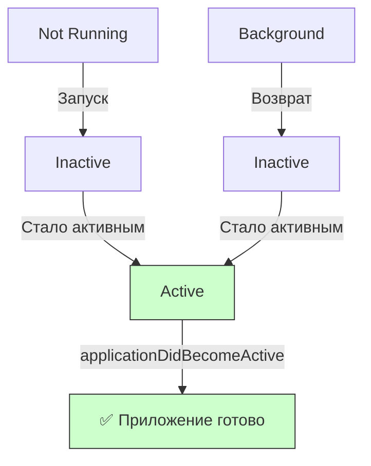

## applicationDidBecomeActive — Приложение стало активным и видимым

---

#ios #appdelegate #app-lifecycle #scenedelegate #active #swift

---

### Определение

**`applicationDidBecomeActive`** — это метод в [[AppDelegate]] (или [[SceneDelegate]] для многоконных приложений), который вызывается, когда приложение **становится активным** и готово к взаимодействию с пользователем. В этот момент приложение находится на переднем плане и получает события от пользователя.

```swift
func applicationDidBecomeActive(_ application: UIApplication) {
    print("✅ applicationDidBecomeActive — приложение активно")
}
```

Этот метод вызывается:
- После первого запуска приложения (после `applicationDidFinishLaunching`)
- При возврате приложения из фона (после `applicationWillEnterForeground`)
- При закрытии системных диалогов (уведомления, звонки, Siri)
- При разблокировке экрана, если приложение было на переднем плане



---

### Зачем это знать iOS-разработчику?

| Сценарий | Почему это важно |
|---|---|
| **Обновление данных при возврате** | Пользователь вернулся в приложение — нужно показать актуальные данные |
| **Запуск анимаций и таймеров** | Анимации и игры должны возобновляться при возврате в приложение |
| **Проверка авторизации и токенов** | Токен мог устареть, пока приложение было в фоне |
| **Обновление виджетов** | Нужно синхронизировать данные с виджетами |
| **Аналитика и логирование** | Отслеживание, когда пользователь активно использует приложение |
| **Обновление UI после системных событий** | Изменение темы, шрифтов, размера экрана |

---

### Где находится метод (2026)

#### AppDelegate (глобальный уровень)

```swift
@main
class AppDelegate: UIResponder, UIApplicationDelegate {
    
    func applicationDidBecomeActive(_ application: UIApplication) {
        print("✅ AppDelegate: applicationDidBecomeActive")
        
        // Глобальные действия при активации приложения
        refreshWidgets()
        checkAuthToken()
        resumeBackgroundTasks()
    }
}
```

#### SceneDelegate (уровень сцены, [[iOS]] 13+)

```swift
class SceneDelegate: UIResponder, UIWindowSceneDelegate {
    
    func sceneDidBecomeActive(_ scene: UIScene) {
        print("✅ SceneDelegate: sceneDidBecomeActive")
        
        // Действия для конкретной сцены (окна)
        refreshUI()
        startAnimations()
    }
}
```

> **Важно:** В iOS 13+ для приложений с поддержкой сцен (multitasking на iPad) вместо `applicationDidBecomeActive` в AppDelegate используется `sceneDidBecomeActive` в SceneDelegate. AppDelegate получает только глобальные события.

---

### Полный пример использования

```swift
@main
class AppDelegate: UIResponder, UIApplicationDelegate {
    
    // MARK: - Application Lifecycle
    func applicationDidBecomeActive(_ application: UIApplication) {
        print("✅ applicationDidBecomeActive")
        
        // 1. Обновление данных
        refreshDataIfNeeded()
        
        // 2. Проверка авторизации
        checkAuthStatus()
        
        // 3. Обновление виджетов
        refreshWidgets()
        
        // 4. Возобновление анимаций и таймеров
        resumeAnimations()
        resumeTimers()
        
        // 5. Аналитика
        trackSessionStart()
        
        // 6. Обновление UI после системных изменений
        applyThemeIfChanged()
    }
    
    func applicationWillResignActive(_ application: UIApplication) {
        print("⚠️ applicationWillResignActive")
        
        // Пауза анимаций и таймеров
        pauseAnimations()
        pauseTimers()
        
        // Сохранение состояния
        saveCurrentState()
        
        // Аналитика
        trackSessionEnd()
    }
    
    // MARK: - Private Methods
    private func refreshDataIfNeeded() {
        let lastRefresh = UserDefaults.standard.object(forKey: "lastDataRefresh") as? Date ?? .distantPast
        let refreshInterval: TimeInterval = 60 // 1 минута
        
        if Date().timeIntervalSince(lastRefresh) > refreshInterval {
            print("🔄 Refreshing data")
            
            Task {
                await fetchRemoteData()
                UserDefaults.standard.set(Date(), forKey: "lastDataRefresh")
            }
        }
    }
    
    private func checkAuthStatus() {
        guard let token = AuthManager.shared.token else {
            print("🔐 No token, need login")
            showLoginScreen()
            return
        }
        
        // Проверка валидности токена
        Task {
            let isValid = await AuthManager.shared.validateToken(token)
            if !isValid {
                await MainActor.run {
                    showLoginScreen()
                }
            }
        }
    }
    
    private func refreshWidgets() {
        if #available(iOS 14.0, *) {
            WidgetCenter.shared.reloadAllTimelines()
            print("📱 Widgets refreshed")
        }
    }
    
    private func fetchRemoteData() async {
        // Имитация сетевого запроса
        try? await Task.sleep(nanoseconds: 1_000_000_000)
        print("📡 Remote data fetched")
    }
    
    private func showLoginScreen() {
        // Показать экран логина
        NotificationCenter.default.post(name: .showLogin, object: nil)
    }
    
    private func pauseAnimations() { print("⏸ Animations paused") }
    private func resumeAnimations() { print("▶️ Animations resumed") }
    private func pauseTimers() { print("⏸ Timers paused") }
    private func resumeTimers() { print("▶️ Timers resumed") }
    private func saveCurrentState() { print("💾 State saved") }
    private func trackSessionStart() { print("📊 Session started") }
    private func trackSessionEnd() { print("📊 Session ended") }
    private func applyThemeIfChanged() { print("🎨 Theme applied") }
}

extension Notification.Name {
    static let showLogin = Notification.Name("showLogin")
}
```

---

### SceneDelegate (iOS 13+)

Для современных приложений с поддержкой многозадачности на iPad:

```swift
class SceneDelegate: UIResponder, UIWindowSceneDelegate {
    
    var window: UIWindow?
    
    func sceneDidBecomeActive(_ scene: UIScene) {
        print("✅ sceneDidBecomeActive")
        
        // Обновление UI текущей сцены
        refreshUIIfNeeded()
        
        // Возобновление анимаций
        resumeAnimations()
        
        // Проверка авторизации
        checkAuthAndUpdateUI()
    }
    
    func sceneWillResignActive(_ scene: UIScene) {
        print("⚠️ sceneWillResignActive")
        
        // Пауза анимаций
        pauseAnimations()
        
        // Сохранение состояния сцены
        saveSceneState()
    }
    
    private func refreshUIIfNeeded() {
        guard let rootVC = window?.rootViewController as? MainViewController else { return }
        rootVC.refreshData()
    }
    
    private func checkAuthAndUpdateUI() {
        if !AuthManager.shared.isLoggedIn {
            window?.rootViewController = LoginViewController()
        }
    }
    
    private func resumeAnimations() { }
    private func pauseAnimations() { }
    private func saveSceneState() { }
}

@main
class AppDelegate: UIResponder, UIApplicationDelegate {
    
    func applicationDidBecomeActive(_ application: UIApplication) {
        // Только глобальные действия
        WidgetCenter.shared.reloadAllTimelines()
    }
}
```

---

### Различия между applicationDidBecomeActive и sceneDidBecomeActive

| Аспект | `applicationDidBecomeActive` | `sceneDidBecomeActive` |
|---|---|---|
| **Вызывается** | При активации приложения | При активации конкретной сцены (окна) |
| **Количество вызовов** | Один | По числу активных сцен |
| **Использование** | Глобальная инициализация | UI-логика конкретной сцены |
| **Multitasking iPad** | Вызывается для приложения | Вызывается для каждого окна отдельно |
| **Рекомендация** | Сервисы, виджеты, аналитика | UI, анимации, таймеры |

---

### Типичные ошибки

#### 1. Долгие синхронные операции

```swift
// ❌ Плохо — блокирует UI
func applicationDidBecomeActive(_ application: UIApplication) {
    let data = loadLargeDataFromDisk()  // Синхронно, долго
    updateUI(with: data)
}

// ✅ Хорошо — асинхронно
func applicationDidBecomeActive(_ application: UIApplication) {
    Task {
        let data = await loadLargeDataFromDiskAsync()
        await MainActor.run {
            updateUI(with: data)
        }
    }
}
```

#### 2. Игнорирование паузы анимаций

```swift
// ❌ Плохо — анимации не приостанавливаются
class GameViewController: UIViewController {
    override func viewDidLoad() {
        super.viewDidLoad()
        startGameLoop()  // Бесконечная анимация
    }
}

// ✅ Хорошо — приостанавливаем в фоне
class GameViewController: UIViewController {
    
    override func viewDidLoad() {
        super.viewDidLoad()
        NotificationCenter.default.addObserver(
            self,
            selector: #selector(pauseGame),
            name: UIApplication.willResignActiveNotification,
            object: nil
        )
        NotificationCenter.default.addObserver(
            self,
            selector: #selector(resumeGame),
            name: UIApplication.didBecomeActiveNotification,
            object: nil
        )
    }
    
    @objc private func pauseGame() { gameLoop.pause() }
    @objc private func resumeGame() { gameLoop.resume() }
}
```

#### 3. Неправильная работа с токенами

```swift
// ❌ Плохо — токен не проверяется
func applicationDidBecomeActive(_ application: UIApplication) {
    // Предполагаем, что токен всё ещё валиден
    loadUserData()
}

// ✅ Хорошо — проверяем токен
func applicationDidBecomeActive(_ application: UIApplication) {
    Task {
        if await !AuthManager.shared.isTokenValid() {
            await MainActor.run {
                showLoginScreen()
            }
        } else {
            loadUserData()
        }
    }
}
```

---

### Лучшие практики (2026)

| Практика | Почему |
|---|---|
| **Обновляйте данные только если они устарели** | Экономия трафика и батареи |
| **Проверяйте авторизацию** | Токен мог устареть в фоне |
| **Обновляйте виджеты** | Пользователь ожидает актуальные данные |
| **Не делайте тяжёлых операций синхронно** | Не блокируйте UI |
| **Используйте Combine или async/await** | Современный и безопасный подход |
| **Возобновляйте анимации и таймеры** | Игры и анимации должны продолжаться |
| **Для анализа используйте SceneDelegate** | Разделение ответственности |

---

### Короткое правило

> **`applicationDidBecomeActive`** = приложение стало активным и видимым.  
> **Обнови данные** (если устарели).  
> **Проверь токен** (мог устареть).  
> **Возобнови анимации и таймеры**.  
> **Не блокируй UI** — используй async/await.  
> **Для многоконных приложений используй `sceneDidBecomeActive`**.

---

### Итог

**`applicationDidBecomeActive`** — ключевой метод для возобновления работы приложения:

| Аспект | Значение |
|---|---|
| **Вызывается** | После запуска, при возврате из фона, после системных диалогов |
| **Назначение** | Обновление данных, проверка авторизации, возобновление анимаций |
| **Не делать** | Тяжёлые синхронные операции |
| **Обязательно** | Проверять токен и обновлять виджеты |
| **Альтернатива** | `sceneDidBecomeActive` в SceneDelegate (iOS 13+) |

**Главное правило:**
> При возврате в приложение всегда проверяй, не устарели ли данные, и валиден ли токен авторизации. Используй асинхронные операции, чтобы не блокировать UI. Для игр и анимаций не забывай возобновлять их при активации. На iPad с многозадачностью используй SceneDelegate и метод `sceneDidBecomeActive` для UI-логики, а AppDelegate оставь для глобальных действий (виджеты, аналитика). Современный код должен использовать async/await или Combine для асинхронных операций.