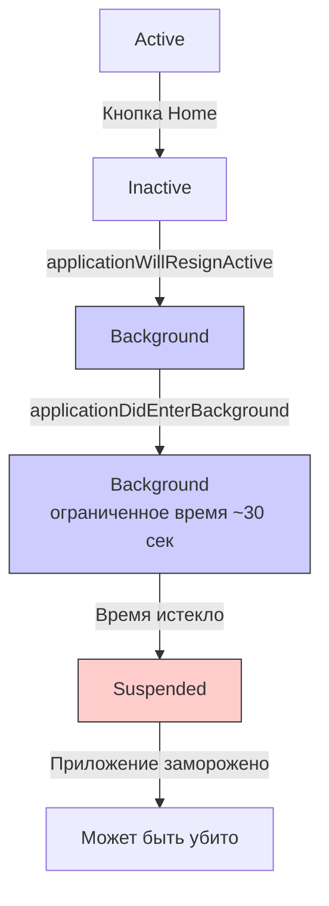

## applicationDidEnterBackground — Приложение ушло в фон

---

#ios #appdelegate #app-lifecycle #background #swift #background-execution

---

### Определение

**`applicationDidEnterBackground`** — это метод в [[AppDelegate]] (или [[SceneDelegate]] для многоконных приложений), который вызывается, когда приложение **переходит в фоновый режим**. Это происходит при нажатии кнопки Home, запуске другого приложения или при открытии панели уведомлений.

```swift
func applicationDidEnterBackground(_ application: UIApplication) {
    print("⏸ applicationDidEnterBackground — приложение ушло в фон")
}
```

**Ключевые факты:**
- У приложения есть **ограниченное время** (~30 секунд) для выполнения кода после этого вызова
- После этого времени приложение переходит в состояние **Suspended** (заморожено)
- В состоянии Suspended приложение **не выполняет код** и может быть убито системой при нехватке памяти



---

### Зачем это знать iOS-разработчику?

| Сценарий | Почему это важно |
|---|---|
| **Сохранение состояния приложения** | Пользователь ожидает, что при возврате всё будет на своих местах |
| **Завершение фоновых задач** | Сетевые запросы, запись в базу данных, обработка файлов |
| **Освобождение ресурсов** | Кэши, большие объекты, невидимые UI-элементы |
| **Отправка аналитики** | Отправить накопленные события до ухода в фон |
| **Сохранение пользовательских данных** | Тексты, позиции скролла, состояние форм |
| **Запрос дополнительного фонового времени** | Для завершения длительных операций |

---

### Где находится метод (2026)

#### AppDelegate (глобальный уровень)

```swift
@main
class AppDelegate: UIResponder, UIApplicationDelegate {
    
    func applicationDidEnterBackground(_ application: UIApplication) {
        print("⏸ AppDelegate: applicationDidEnterBackground")
        
        // Глобальные действия при уходе в фон
        saveGlobalState()
        flushAnalytics()
        cancelBackgroundTasks()
        
        // Запрос дополнительного времени
        let taskId = beginBackgroundTask()
        defer { endBackgroundTask(taskId) }
    }
}
```

#### SceneDelegate (уровень сцены, iOS 13+)

```swift
class SceneDelegate: UIResponder, UIWindowSceneDelegate {
    
    func sceneDidEnterBackground(_ scene: UIScene) {
        print("⏸ SceneDelegate: sceneDidEnterBackground")
        
        // Сохранение состояния конкретной сцены
        saveSceneState()
        
        // Остановка UI-операций
        pauseVideoPlayback()
    }
}
```

> **Важно:** В [[iOS]] 13+ для приложений с поддержкой сцен (multitasking на iPad) вместо `applicationDidEnterBackground` в AppDelegate используется `sceneDidEnterBackground` в SceneDelegate.

---

### Полный пример использования

```swift
@main
class AppDelegate: UIResponder, UIApplicationDelegate {
    
    private var backgroundTaskId: UIBackgroundTaskIdentifier = .invalid
    
    // MARK: - Application Lifecycle
    func applicationDidEnterBackground(_ application: UIApplication) {
        print("⏸ applicationDidEnterBackground")
        
        // 1. Начинаем фоновую задачу
        startBackgroundTask()
        
        // 2. Сохраняем состояние
        saveAppState()
        
        // 3. Завершаем операции
        completePendingOperations()
        
        // 4. Отправляем аналитику
        flushAnalytics()
        
        // 5. Освобождаем ресурсы
        freeMemoryResources()
        
        // 6. Завершаем фоновую задачу
        endBackgroundTask()
    }
    
    func applicationWillEnterForeground(_ application: UIApplication) {
        print("🔄 applicationWillEnterForeground")
        
        // Восстановление при возврате
        restoreAppState()
        refreshData()
    }
    
    // MARK: - Background Task
    private func startBackgroundTask() {
        backgroundTaskId = UIApplication.shared.beginBackgroundTask { [weak self] in
            print("⏰ Background task expired")
            self?.endBackgroundTask()
        }
        print("📱 Background task started: \(backgroundTaskId.rawValue)")
    }
    
    private func endBackgroundTask() {
        guard backgroundTaskId != .invalid else { return }
        
        UIApplication.shared.endBackgroundTask(backgroundTaskId)
        print("✅ Background task ended: \(backgroundTaskId.rawValue)")
        backgroundTaskId = .invalid
    }
    
    // MARK: - State Management
    private func saveAppState() {
        let state = AppState(
            timestamp: Date(),
            selectedTab: TabBarManager.shared.selectedIndex,
            scrollPositions: ScrollPositionManager.shared.getAll()
        )
        
        if let data = try? JSONEncoder().encode(state) {
            UserDefaults.standard.set(data, forKey: "savedAppState")
            UserDefaults.standard.synchronize()
            print("💾 App state saved")
        }
    }
    
    private func restoreAppState() {
        guard let data = UserDefaults.standard.data(forKey: "savedAppState"),
              let state = try? JSONDecoder().decode(AppState.self, from: data) else {
            return
        }
        
        print("🔄 Restoring app state from \(state.timestamp)")
        TabBarManager.shared.selectedIndex = state.selectedTab
        ScrollPositionManager.shared.restore(state.scrollPositions)
    }
    
    // MARK: - Operations
    private func completePendingOperations() {
        let group = DispatchGroup()
        
        // Сохранение в Core Data
        group.enter()
        CoreDataManager.shared.saveContext { group.leave() }
        
        // Завершение сетевых запросов
        group.enter()
        NetworkQueue.shared.completePendingRequests { group.leave() }
        
        // Запись в файлы
        group.enter()
        FileManager.shared.flushWrites { group.leave() }
        
        // Ждём завершения с таймаутом
        let result = group.wait(timeout: .now() + 25)
        if result == .timedOut {
            print("⚠️ Some operations timed out")
        } else {
            print("✅ All operations completed")
        }
    }
    
    // MARK: - Analytics
    private func flushAnalytics() {
        AnalyticsManager.shared.flush()
        print("📊 Analytics flushed")
    }
    
    // MARK: - Memory
    private func freeMemoryResources() {
        // Очистка кэшей
        ImageCache.shared.clear()
        URLCache.shared.removeAllCachedResponses()
        
        // Освобождение больших объектов
        LargeDataManager.shared.releaseMemory()
        
        print("🧹 Memory resources freed")
        
        // Уведомляем систему о нехватке памяти
        DispatchQueue.global().async {
            URLCache.shared.diskCapacity = 0
            URLCache.shared.memoryCapacity = 0
        }
    }
}

// MARK: - Models
struct AppState: Codable {
    let timestamp: Date
    let selectedTab: Int
    let scrollPositions: [String: CGFloat]
}
```

---

### SceneDelegate (iOS 13+)

```swift
class SceneDelegate: UIResponder, UIWindowSceneDelegate {
    
    var window: UIWindow?
    private var backgroundTaskId: UIBackgroundTaskIdentifier = .invalid
    
    func sceneDidEnterBackground(_ scene: UIScene) {
        print("⏸ sceneDidEnterBackground")
        
        startBackgroundTask()
        
        // Сохранение состояния сцены
        saveSceneState()
        
        // Остановка UI-операций
        pauseVideoPlayback()
        stopAnimations()
        
        endBackgroundTask()
    }
    
    func sceneWillEnterForeground(_ scene: UIScene) {
        print("🔄 sceneWillEnterForeground")
        
        // Восстановление сцены
        restoreSceneState()
        resumeVideoPlayback()
        startAnimations()
    }
    
    private func saveSceneState() {
        guard let navigationController = window?.rootViewController as? UINavigationController else { return }
        
        let state = SceneState(
            viewControllers: navigationController.viewControllers.map { String(describing: type(of: $0)) },
            scrollPositions: getScrollPositions()
        )
        
        UserDefaults.standard.set(try? JSONEncoder().encode(state), forKey: "sceneState_\(scene.hash)")
    }
    
    private func pauseVideoPlayback() { }
    private func resumeVideoPlayback() { }
    private func stopAnimations() { }
    private func startAnimations() { }
    private func getScrollPositions() -> [String: CGFloat] { [:] }
}

struct SceneState: Codable {
    let viewControllers: [String]
    let scrollPositions: [String: CGFloat]
}
```

---

### Запрос дополнительного фонового времени

Для операций, требующих больше времени, можно запросить дополнительное фоновое время:

```swift
class BackgroundTaskManager {
    
    static func performBackgroundTask(operation: @escaping (@escaping () -> Void) -> Void) {
        var taskId: UIBackgroundTaskIdentifier = .invalid
        
        taskId = UIApplication.shared.beginBackgroundTask {
            print("⏰ Background task expired")
            operation { _ in
                UIApplication.shared.endBackgroundTask(taskId)
            }
        }
        
        operation { _ in
            UIApplication.shared.endBackgroundTask(taskId)
        }
    }
}

// Использование
BackgroundTaskManager.performBackgroundTask { completion in
    // Длительная операция
    DispatchQueue.global().asyncAfter(deadline: .now() + 25) {
        print("Long operation completed")
        completion()
    }
}
```

---

### Фоновые задачи (Background Tasks) iOS 13+

```swift
import BackgroundTasks

class BackgroundTaskScheduler {
    
    static func registerTasks() {
        BGTaskScheduler.shared.register(forTaskWithIdentifier: "com.app.cleanup", using: nil) { task in
            handleCleanupTask(task: task as! BGProcessingTask)
        }
    }
    
    static func scheduleCleanup() {
        let request = BGProcessingTaskRequest(identifier: "com.app.cleanup")
        request.requiresNetworkConnectivity = false
        request.requiresExternalPower = false
        
        do {
            try BGTaskScheduler.shared.submit(request)
            print("📅 Cleanup task scheduled")
        } catch {
            print("❌ Failed to schedule: \(error)")
        }
    }
    
    private static func handleCleanupTask(task: BGProcessingTask) {
        task.expirationHandler = {
            print("⏰ Cleanup task expired")
            task.setTaskCompleted(success: false)
        }
        
        // Выполнение очистки
        DispatchQueue.global().async {
            cleanupDatabase()
            clearOldCache()
            
            DispatchQueue.main.async {
                task.setTaskCompleted(success: true)
                scheduleCleanup()
            }
        }
    }
    
    private static func cleanupDatabase() { }
    private static func clearOldCache() { }
}
```

---

### Различия между applicationDidEnterBackground и sceneDidEnterBackground

| Аспект | `applicationDidEnterBackground` | `sceneDidEnterBackground` |
|---|---|---|
| **Вызывается** | При уходе приложения в фон | При уходе конкретной сцены (окна) в фон |
| **Количество вызовов** | Один | По числу активных сцен |
| **Использование** | Глобальное сохранение | UI-логика конкретной сцены |
| **Multitasking iPad** | Вызывается для приложения | Вызывается для каждого окна отдельно |
| **Рекомендация** | Сервисы, аналитика, Core Data | UI, видео, анимации, тексты |

---

### Распространённые ошибки

#### 1. Нет фоновой задачи — приложение убито до сохранения

```swift
// ❌ Плохо — приложение может быть убито до сохранения
func applicationDidEnterBackground(_ application: UIApplication) {
    saveData()  // Может не успеть выполниться
}

// ✅ Хорошо — с фоновой задачей
func applicationDidEnterBackground(_ application: UIApplication) {
    let taskId = beginBackgroundTask()
    saveData()
    endBackgroundTask(taskId)
}
```

#### 2. Долгие синхронные операции

```swift
// ❌ Плохо — блокирует, может не успеть
func applicationDidEnterBackground(_ application: UIApplication) {
    processLargeDatabase()  // Может занять 10+ секунд
}

// ✅ Хорошо — асинхронно
func applicationDidEnterBackground(_ application: UIApplication) {
    let taskId = beginBackgroundTask()
    
    DispatchQueue.global().async {
        self.processLargeDatabase()
        DispatchQueue.main.async {
            self.endBackgroundTask(taskId)
        }
    }
}
```

#### 3. Игнорирование сохранения UI-состояния

```swift
// ❌ Плохо — состояние не сохраняется
func applicationDidEnterBackground(_ application: UIApplication) {
    // Ничего не делаем
}

// ✅ Хорошо — сохраняем состояние
func applicationDidEnterBackground(_ application: UIApplication) {
    saveCurrentScreenState()
    saveScrollPositions()
    saveUserInput()
}
```

---

### Лучшие практики (2026)

| Практика                                                 | Почему                             |
| -------------------------------------------------------- | ---------------------------------- |
| **Используйте фоновые задачи**                           | Гарантирует выполнение кода        |
| **Сохраняйте состояние UI**                              | Пользователь ожидает непрерывности |
| **Не делайте долгих операций без фоновой задачи**        | Приложение может быть убито        |
| **Очищайте кэши и ресурсы**                              | Экономия памяти                    |
| **Отправляйте аналитику**                                | Не теряйте события                 |
| **Используйте [[async]]/[[await]]**                      | Современный и безопасный подход    |
| **Для многоконных приложений используйте SceneDelegate** | Разделение ответственности         |

---

### Короткое правило

> **`applicationDidEnterBackground`** = приложение ушло в фон, есть ~30 секунд на завершение операций.  
> **Сохрани состояние** (тексты, позиции, вкладки).  
> **Заверши операции** (сеть, база данных, файлы).  
> **Отправь аналитику** (не теряй события).  
> **Очисти ресурсы** (кэши, большие объекты).  
> **Используй фоновую задачу** для гарантии выполнения.

---

### Итог

**`applicationDidEnterBackground`** — критически важный метод для сохранения состояния и завершения операций:

| Аспект | Значение |
|---|---|
| **Вызывается** | При уходе приложения в фон |
| **Доступное время** | ~30 секунд (или больше с Background Tasks) |
| **Назначение** | Сохранение состояния, завершение операций, очистка ресурсов |
| **Обязательно** | Использовать фоновую задачу для длительных операций |
| **Не делать** | Долгие синхронные операции без фоновой задачи |
| **Альтернатива** | `sceneDidEnterBackground` в SceneDelegate (iOS 13+) |

**Главное правило:**
> Всегда сохраняй состояние приложения в `applicationDidEnterBackground` — это последний шанс перед заморозкой. Используй фоновые задачи для гарантии выполнения критических операций. Очищай кэши и ресурсы для экономии памяти. Отправляй аналитику, чтобы не терять события. На iPad с многозадачностью используй SceneDelegate и метод `sceneDidEnterBackground` для UI-логики. Не делай синхронных долгих операций — используй фоновые очереди и async/await. Помни, что после ~30 секунд приложение будет заморожено и может быть убито в любой момент.